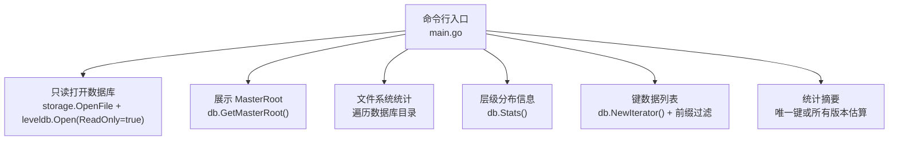
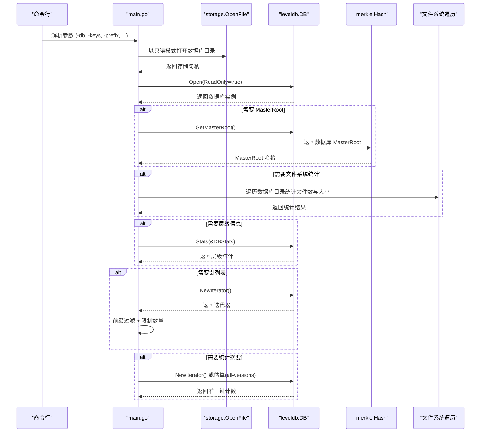
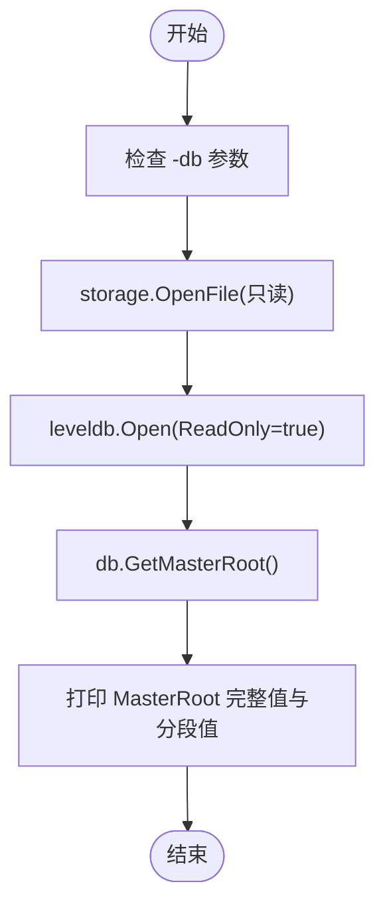
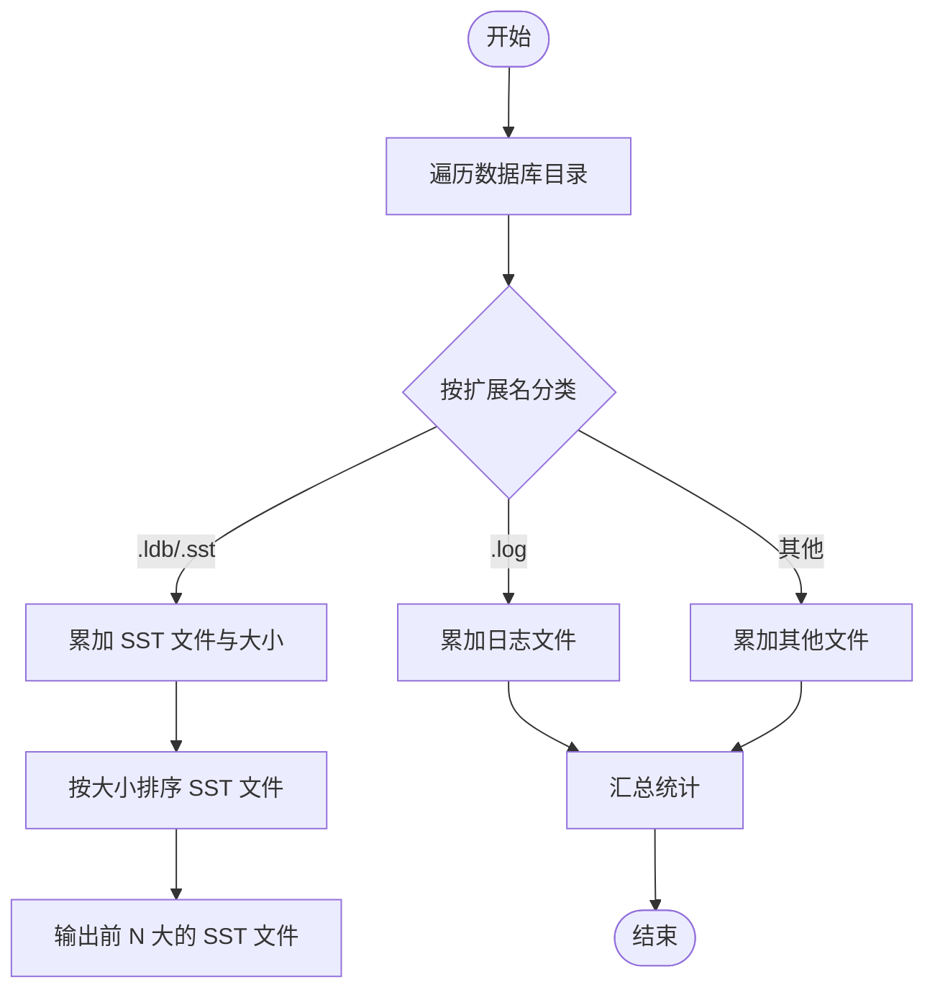
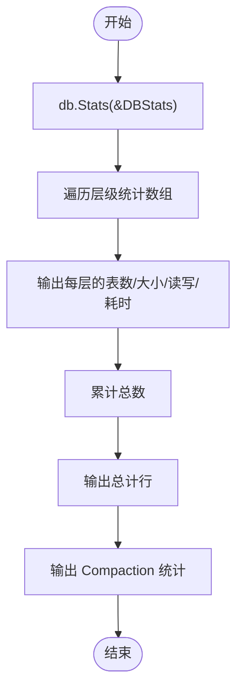
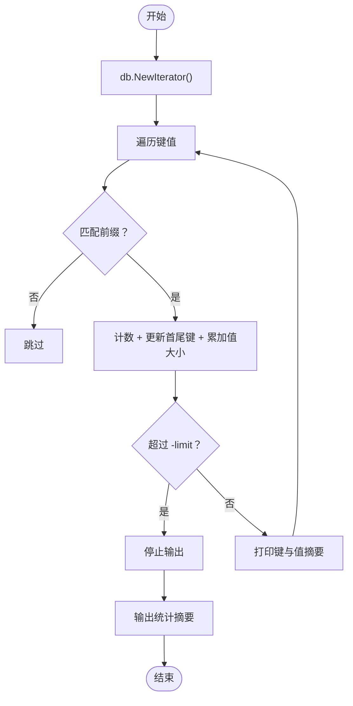
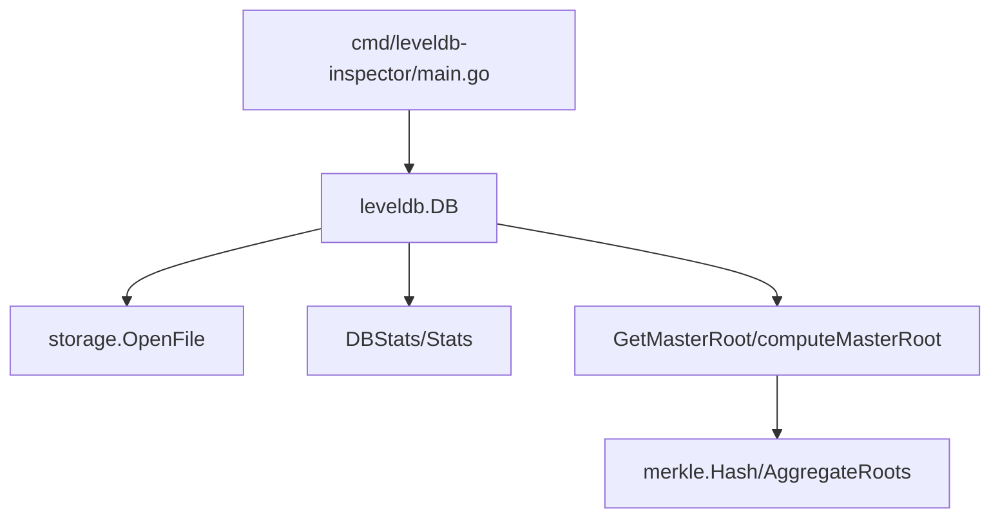

# 命令行工具

<cite>
**本文引用的文件**
- [main.go](file://cmd/leveldb-inspector/main.go)
- [db.go](file://leveldb/db.go)
- [hash.go](file://leveldb/merkle/hash.go)
- [README.md](file://README.md)
</cite>

## 目录
1. [简介](#简介)
2. [项目结构](#项目结构)
3. [核心组件](#核心组件)
4. [架构总览](#架构总览)
5. [详细组件分析](#详细组件分析)
6. [依赖分析](#依赖分析)
7. [性能考虑](#性能考虑)
8. [故障排查指南](#故障排查指南)
9. [结论](#结论)
10. [附录](#附录)

## 简介
leveldb-inspector 是一个命令行工具，用于以只读方式打开 LevelDB 数据库并分析其内部结构。它基于 avccDB 对 LevelDB 的增强实现（mLSM），能够：
- 显示 MasterRoot 哈希值（数据库整体状态的 Merkle 根）
- 统计文件系统信息（SST、日志、其他文件数量与大小）
- 展示层级分布信息（按 Level 的表数量、大小、读写量、耗时等）
- 列出键数据（支持前缀过滤、限制数量、版本信息提示）
- 提供统计摘要（唯一键或所有版本的估算）

该工具通过只读模式打开数据库，避免对正在运行的数据库造成影响，并提供丰富的诊断信息，便于数据库状态检查、性能评估与故障排查。

## 项目结构
命令行工具位于 cmd/leveldb-inspector/main.go，核心逻辑围绕以下模块展开：
- 命令行参数解析与主流程控制
- 只读打开数据库与资源管理
- MasterRoot 信息展示
- 文件系统统计
- 层级分布信息展示
- 键数据列表与统计摘要
- 辅助函数（字符串安全输出、三元条件辅助）

图表来源
- [main.go](file://cmd/leveldb-inspector/main.go#L32-L101)
- [db.go](file://leveldb/db.go#L1479-L1571)

章节来源
- [main.go](file://cmd/leveldb-inspector/main.go#L20-L30)
- [main.go](file://cmd/leveldb-inspector/main.go#L32-L101)

## 核心组件
- 命令行参数
  - -db：必需，指定数据库路径
  - -keys：是否显示键列表
  - -stats：是否显示统计信息（默认开启）
  - -levels：是否显示层级信息（默认开启）
  - -root：是否显示 MasterRoot（默认开启）
  - -limit：显示的键数量限制（默认100）
  - -prefix：仅显示指定前缀的键
  - -version：尝试解析并显示键的版本信息（当前为提示性输出）
  - -all-versions：统计所有版本的键（不去重；当前为估算）
- 主流程
  - 解析参数并校验 -db 是否提供
  - 以只读模式打开存储与数据库
  - 条件性执行各功能模块：MasterRoot、文件系统统计、层级信息、键列表、统计摘要
  - 输出完成提示

章节来源
- [main.go](file://cmd/leveldb-inspector/main.go#L20-L30)
- [main.go](file://cmd/leveldb-inspector/main.go#L32-L101)

## 架构总览
下图展示了命令行工具与数据库引擎之间的交互关系，以及关键函数的调用链。

图表来源
- [main.go](file://cmd/leveldb-inspector/main.go#L46-L101)
- [db.go](file://leveldb/db.go#L1479-L1571)

## 详细组件分析

### 命令行参数与用法
- -db：数据库路径（必填）。若未提供，程序会打印用法与示例后退出。
- -keys：启用键列表输出，配合 -limit 控制显示数量，-prefix 进行前缀过滤。
- -stats：默认开启，显示文件系统统计与统计摘要。
- -levels：默认开启，显示层级分布信息（表数量、大小、读写量、耗时、Compaction 计数）。
- -root：默认开启，显示 MasterRoot 哈希及其可读格式（前16字节/后16字节）。
- -limit：限制键列表输出数量，默认100。
- -prefix：仅显示以指定前缀开头的键。
- -version：当前为提示性输出，显示键长度等信息（版本解析需更深入的内部格式解析）。
- -all-versions：统计所有版本（不去重）。由于公开 API 限制，当前仅能估算唯一键数。

章节来源
- [main.go](file://cmd/leveldb-inspector/main.go#L20-L30)
- [main.go](file://cmd/leveldb-inspector/main.go#L32-L44)

### MasterRoot 信息展示
- 功能：读取数据库的 MasterRoot 哈希，输出完整哈希及分段可读格式。
- 实现要点：
  - 通过数据库实例调用 GetMasterRoot() 获取 Merkle 根。
  - 在只读模式下，MasterRoot 由引擎维护并在打开时初始化。
  - MasterRoot 是对各层级 SSTable Merkle 根聚合后的顶层根，用于快速验证数据库一致性。

图表来源
- [main.go](file://cmd/leveldb-inspector/main.go#L46-L61)
- [main.go](file://cmd/leveldb-inspector/main.go#L103-L119)
- [db.go](file://leveldb/db.go#L1479-L1489)

章节来源
- [main.go](file://cmd/leveldb-inspector/main.go#L103-L119)
- [db.go](file://leveldb/db.go#L1479-L1489)

### 文件系统统计
- 功能：统计数据库目录下的 SST、日志、其他文件数量与总大小，并列出最大的若干 SST 文件。
- 实现要点：
  - 使用 filepath.Walk 遍历数据库目录，按扩展名分类统计。
  - 对 SST 文件按大小排序并输出前 N 名（默认5）。
  - 单位换算为 MB/KB，便于直观判断。

图表来源
- [main.go](file://cmd/leveldb-inspector/main.go#L121-L178)

章节来源
- [main.go](file://cmd/leveldb-inspector/main.go#L121-L178)

### 层级分布信息
- 功能：展示每个 Level 的表数量、大小、读写量、耗时，以及各类 Compaction 次数。
- 实现要点：
  - 通过 db.Stats(&DBStats) 获取层级统计，包括 LevelTablesCounts、LevelSizes、LevelRead、LevelWrite、LevelDurations 等。
  - 输出表格形式的层级详情与总计行。
  - Compaction 统计包括 MemDB Compactions、Level0 Compactions、NonLevel0 Compactions、Seek Compactions。

图表来源
- [main.go](file://cmd/leveldb-inspector/main.go#L180-L242)
- [db.go](file://leveldb/db.go#L1388-L1441)

章节来源
- [main.go](file://cmd/leveldb-inspector/main.go#L180-L242)
- [db.go](file://leveldb/db.go#L1388-L1441)

### 键数据列表与统计摘要
- 键列表：
  - 使用 db.NewIterator() 创建迭代器，遍历键值。
  - 支持 -prefix 前缀过滤与 -limit 数量限制。
  - 安全字符串输出（safeString），对不可打印字符显示十六进制。
  - 当启用 -version 时，输出键长度等提示信息（版本解析需更深入的内部格式解析）。
  - 统计首个键、最后一个键、平均值大小、总值大小。
- 统计摘要：
  - 默认模式：统计唯一键数（最新版本）。
  - -all-versions 模式：当前公开 API 无法直接统计所有 internal keys，工具给出估算说明并返回唯一键数。

图表来源
- [main.go](file://cmd/leveldb-inspector/main.go#L244-L347)
- [main.go](file://cmd/leveldb-inspector/main.go#L349-L408)

章节来源
- [main.go](file://cmd/leveldb-inspector/main.go#L244-L347)
- [main.go](file://cmd/leveldb-inspector/main.go#L349-L408)

### 技术细节与调用关系
- 只读模式：
  - storage.OpenFile(..., true) 以只读方式打开存储。
  - leveldb.Open(...) 设置 ReadOnly: true，确保不会触发写操作或后台任务。
- MasterRoot：
  - db.GetMasterRoot() 返回数据库的顶层 Merkle 根，反映当前所有层级的状态聚合。
  - 引擎内部通过 computeMasterRoot() 从各层级 SSTable 根构建分层 Merkle 树，再聚合得到 MasterRoot。
- 层级统计：
  - DBStats 结构体包含层级维度的统计字段，db.Stats() 填充这些字段。
- 键迭代：
  - db.NewIterator() 返回快照迭代器，保证遍历期间数据一致性。
  - safeString() 用于安全输出键/值内容，避免二进制数据导致的输出问题。

章节来源
- [main.go](file://cmd/leveldb-inspector/main.go#L46-L61)
- [db.go](file://leveldb/db.go#L1479-L1571)
- [hash.go](file://leveldb/merkle/hash.go#L127-L152)

## 依赖分析
- 外部依赖
  - goleveldb：数据库引擎与存储抽象
- 内部依赖
  - cmd/leveldb-inspector/main.go 依赖 leveldb.DB 的只读接口与统计能力
  - MasterRoot 依赖 merkle.Hash 与聚合算法

图表来源
- [main.go](file://cmd/leveldb-inspector/main.go#L46-L101)
- [db.go](file://leveldb/db.go#L1388-L1571)
- [hash.go](file://leveldb/merkle/hash.go#L127-L152)

章节来源
- [main.go](file://cmd/leveldb-inspector/main.go#L46-L101)
- [db.go](file://leveldb/db.go#L1388-L1571)
- [hash.go](file://leveldb/merkle/hash.go#L127-L152)

## 性能考虑
- 只读模式：避免写放大与后台 compaction 干扰，适合离线分析。
- 键遍历：-limit 与 -prefix 可显著减少遍历成本，建议在大规模数据库上优先使用。
- 统计估算：-all-versions 当前为估算，实际场景中可能需要更底层的访问以获得精确值。
- 文件系统统计：仅遍历目录，复杂度与文件数量线性相关，通常很快。

## 故障排查指南
- 无法打开数据库
  - 检查 -db 路径是否存在且可读
  - 若数据库处于只读模式，确认没有其他进程占用
- MasterRoot 获取失败
  - 确认数据库已正确打开且未损坏
  - 检查引擎是否支持 MasterRoot（avccDB 的增强特性）
- 键列表为空或异常
  - 检查 -prefix 是否过于严格导致过滤过多
  - 检查 -limit 是否过小
- 统计摘要与层级信息异常
  - 确认数据库已稳定一段时间，统计信息反映最近状态
  - 若 Compaction 频繁，层级分布可能波动较大

章节来源
- [main.go](file://cmd/leveldb-inspector/main.go#L32-L44)
- [main.go](file://cmd/leveldb-inspector/main.go#L103-L119)
- [db.go](file://leveldb/db.go#L1388-L1441)

## 结论
leveldb-inspector 提供了对 avccDB 增强版 LevelDB 数据库的全面诊断能力。通过只读模式，用户可以安全地获取 MasterRoot、文件系统统计、层级分布、键数据详情与统计摘要，从而进行数据库状态检查、性能评估与故障排查。对于 -all-versions 等高级需求，当前公开 API 存在限制，建议结合更底层的工具或引擎扩展进行深入分析。

## 附录

### 实际使用示例与输出解读
- 基本用法
  - 查看数据库基本信息：leveldb-inspector -db=./mydb
  - 显示键列表并限制数量：leveldb-inspector -db=./mydb -keys -limit=50
  - 仅显示特定前缀的键：leveldb-inspector -db=./mydb -prefix=user-
- 输出解读
  - MasterRoot：用于验证数据库一致性，若后续变更应与预期一致
  - 文件系统统计：关注 SST 文件数量与最大文件，过大文件可能影响读放大
  - 层级分布：观察 Level0 表数与读写量，频繁的 Level0 Compaction 可能导致写放大
  - 键列表：结合 -prefix 与 -limit 快速定位数据分布与键空间特征
  - 统计摘要：唯一键数用于评估数据规模，-all-versions 估算用于粗略评估历史版本数量

章节来源
- [main.go](file://cmd/leveldb-inspector/main.go#L32-L44)
- [README.md](file://README.md#L1-L20)