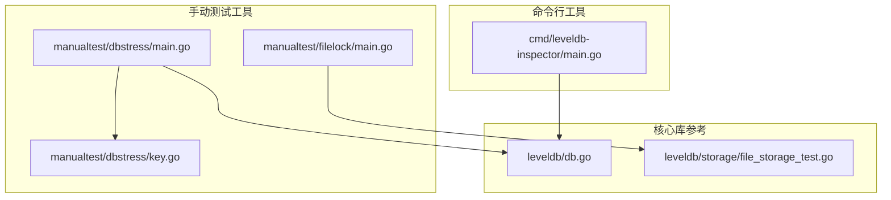
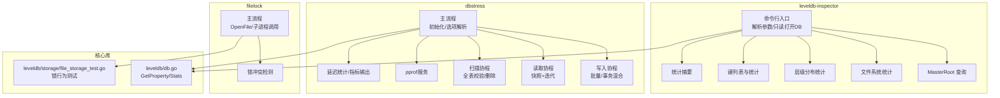
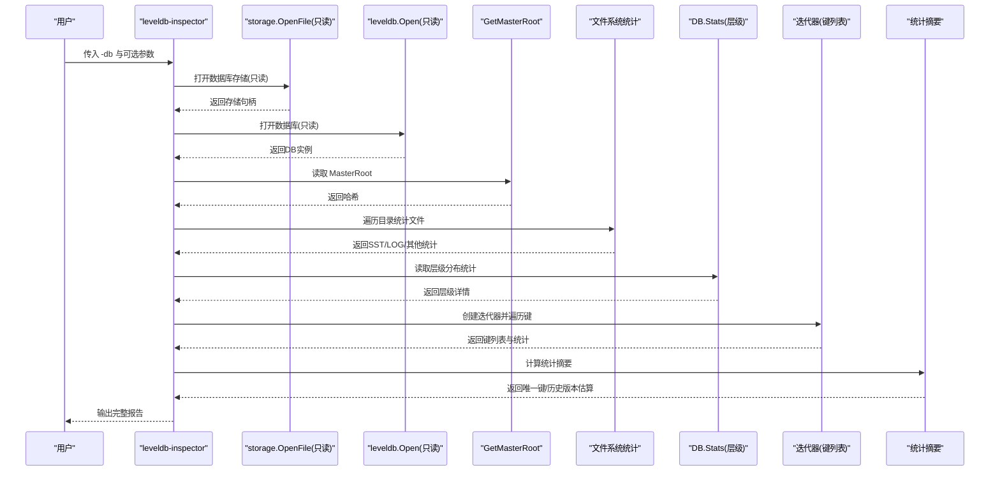
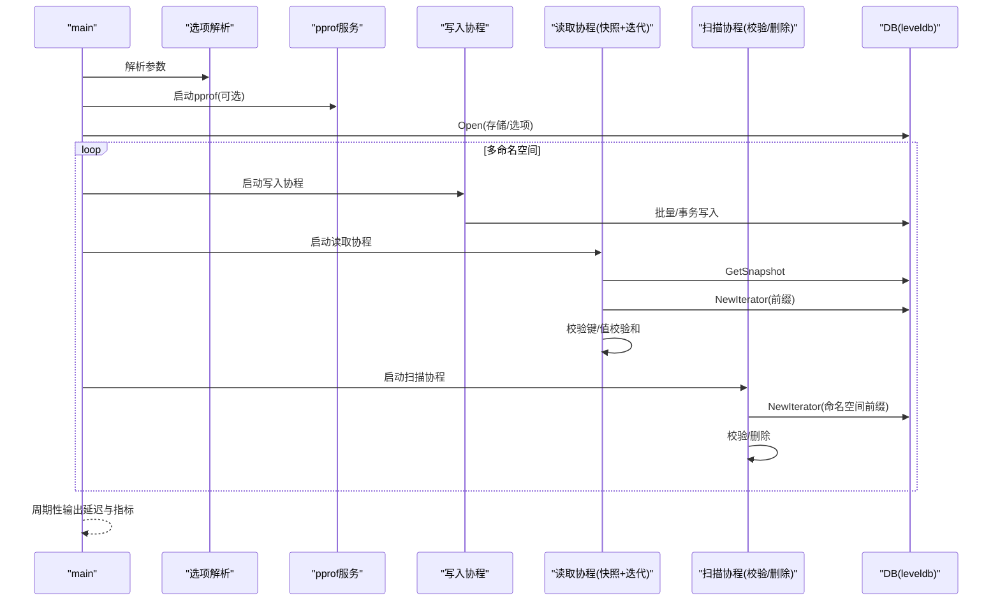
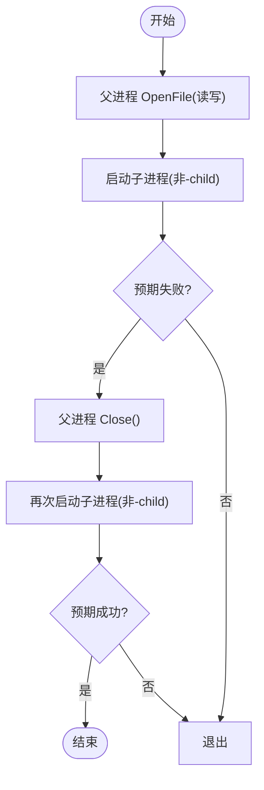
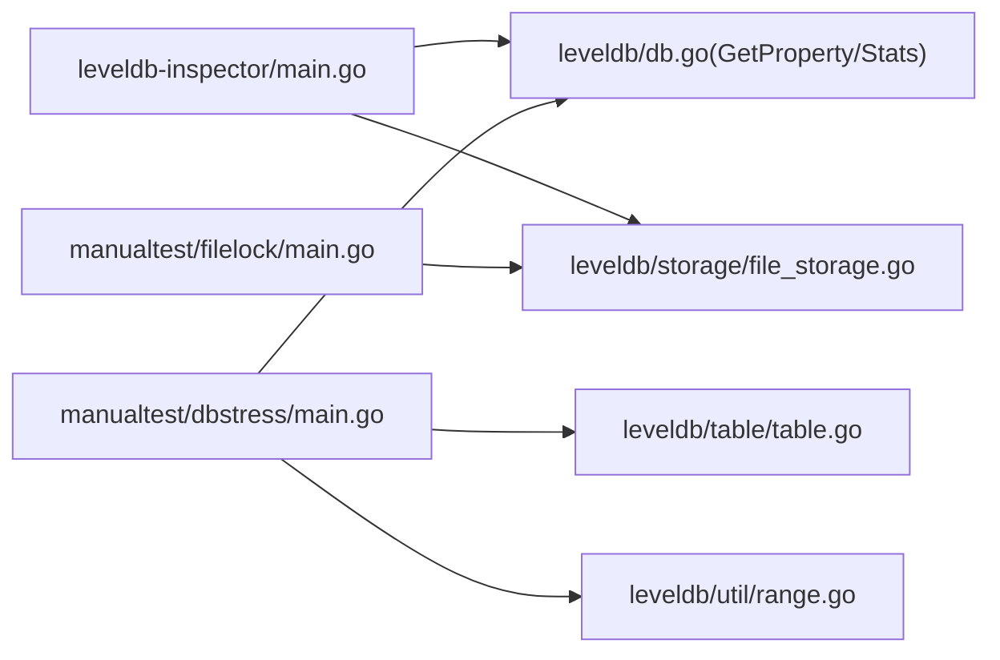

# 工具与实用程序

<cite>
**本文引用的文件**
- [cmd/leveldb-inspector/main.go](file://cmd/leveldb-inspector/main.go)
- [manualtest/dbstress/main.go](file://manualtest/dbstress/main.go)
- [manualtest/dbstress/key.go](file://manualtest/dbstress/key.go)
- [manualtest/filelock/main.go](file://manualtest/filelock/main.go)
- [leveldb/db.go](file://leveldb/db.go)
- [leveldb/storage/file_storage_test.go](file://leveldb/storage/file_storage_test.go)
</cite>

## 目录
1. [简介](#简介)
2. [项目结构](#项目结构)
3. [核心组件](#核心组件)
4. [架构总览](#架构总览)
5. [详细组件分析](#详细组件分析)
6. [依赖关系分析](#依赖关系分析)
7. [性能考量](#性能考量)
8. [故障排查指南](#故障排查指南)
9. [结论](#结论)

## 简介
本文件面向 avccDB 仓库中的工具与实用程序，提供系统化的使用说明与技术剖析，重点覆盖：
- leveldb-inspector 命令行工具：数据库结构与状态分析、命令行参数与典型输出解读
- manualtest/dbstress 压力测试工具：并发读写、事务、快照、迭代器与延迟统计
- manualtest/filelock 文件锁测试工具：验证数据库文件锁行为与并发访问约束

这些工具在调试、性能评估与故障排查中具有重要价值，既可用于日常运维诊断，也可用于回归测试与性能基线建立。

## 项目结构
工具与实用程序主要分布在以下位置：
- 命令行工具：cmd/leveldb-inspector
- 手动测试工具：manualtest/dbstress、manualtest/filelock
- 关键实现参考：leveldb/db.go（属性查询）、leveldb/storage/file_storage_test.go（文件锁测试）

图表来源
- [cmd/leveldb-inspector/main.go](file://cmd/leveldb-inspector/main.go#L1-L120)
- [manualtest/dbstress/main.go](file://manualtest/dbstress/main.go#L1-L120)
- [manualtest/dbstress/key.go](file://manualtest/dbstress/key.go#L1-L78)
- [manualtest/filelock/main.go](file://manualtest/filelock/main.go#L1-L86)
- [leveldb/db.go](file://leveldb/db.go#L1251-L1297)
- [leveldb/storage/file_storage_test.go](file://leveldb/storage/file_storage_test.go#L322-L402)

章节来源
- [cmd/leveldb-inspector/main.go](file://cmd/leveldb-inspector/main.go#L1-L120)
- [manualtest/dbstress/main.go](file://manualtest/dbstress/main.go#L1-L120)
- [manualtest/filelock/main.go](file://manualtest/filelock/main.go#L1-L86)

## 核心组件
- leveldb-inspector：以只读方式打开 LevelDB 存储，输出 MasterRoot、文件系统信息、层级分布、键列表与统计摘要；支持前缀过滤、版本解析提示与“统计所有版本”的估算模式。
- dbstress：多命名空间并发压力测试，生成随机键值，混合批量写入、事务写入、快照读取、迭代扫描与删除；内置 HTTP pprof 服务端口，周期性输出延迟与速率统计，并对数据校验与内部键类型进行严格校验。
- filelock：通过同一二进制启动父子进程，模拟并发打开同一数据库路径，验证文件锁与只读/读写互斥行为。

章节来源
- [cmd/leveldb-inspector/main.go](file://cmd/leveldb-inspector/main.go#L20-L120)
- [manualtest/dbstress/main.go](file://manualtest/dbstress/main.go#L80-L120)
- [manualtest/filelock/main.go](file://manualtest/filelock/main.go#L15-L42)

## 架构总览
下图展示三个工具与核心库之间的交互关系与职责边界。

图表来源
- [cmd/leveldb-inspector/main.go](file://cmd/leveldb-inspector/main.go#L120-L242)
- [manualtest/dbstress/main.go](file://manualtest/dbstress/main.go#L308-L448)
- [manualtest/filelock/main.go](file://manualtest/filelock/main.go#L44-L86)
- [leveldb/db.go](file://leveldb/db.go#L1251-L1297)
- [leveldb/storage/file_storage_test.go](file://leveldb/storage/file_storage_test.go#L322-L402)

## 详细组件分析

### leveldb-inspector 命令行工具
- 功能概述
  - 只读打开数据库，避免影响生产数据
  - 输出 MasterRoot 哈希与可读片段
  - 统计数据库目录内 SST、LOG、其他文件数量与总大小，列出最大 SST 文件
  - 通过 DB.Stats 输出层级分布（每层表数、大小、时长、读写量），并汇总 Compaction 统计
  - 遍历键空间：支持前缀过滤、限制显示数量、估算平均值大小与总值大小
  - 统计摘要：默认统计唯一键（最新版本）；可切换到“统计所有版本”模式（基于公开 API 的估算）
- 安装与运行
  - 在仓库根目录执行构建或直接运行：
    - go build -o leveldb-inspector ./cmd/leveldb-inspector
    - ./leveldb-inspector -db=/path/to/your/db
- 常用参数
  - -db：数据库路径（必填）
  - -keys：是否显示键列表
  - -stats：是否显示统计信息（默认开启）
  - -levels：是否显示层级信息（默认开启）
  - -root：是否显示 MasterRoot（默认开启）
  - -limit：显示键数量限制（默认100）
  - -prefix：仅显示指定前缀的键
  - -version：尝试解析并显示键的版本信息（提示）
  - -all-versions：统计所有版本（不去重）（默认关闭）
- 典型输出解读
  - MasterRoot：用于核验数据库一致性与变更追踪
  - 文件系统信息：识别异常膨胀的 SST 文件与 LOG 数量
  - 层级分布：定位热点层、Compaction 压力与读写放大趋势
  - 键列表与统计：快速判断键空间分布、值大小分布与潜在编码问题
  - 统计摘要：区分唯一键与历史版本总数，指导容量规划与压缩策略
- 实际价值
  - 调试：定位异常膨胀、层级失衡、键编码问题
  - 性能评估：结合层级与 Compaction 统计评估写放大与读放大
  - 故障排查：通过 MasterRoot 与文件统计快速定位问题范围

图表来源
- [cmd/leveldb-inspector/main.go](file://cmd/leveldb-inspector/main.go#L32-L120)
- [cmd/leveldb-inspector/main.go](file://cmd/leveldb-inspector/main.go#L121-L242)
- [cmd/leveldb-inspector/main.go](file://cmd/leveldb-inspector/main.go#L243-L347)

章节来源
- [cmd/leveldb-inspector/main.go](file://cmd/leveldb-inspector/main.go#L20-L120)
- [cmd/leveldb-inspector/main.go](file://cmd/leveldb-inspector/main.go#L121-L242)
- [cmd/leveldb-inspector/main.go](file://cmd/leveldb-inspector/main.go#L243-L347)

### manualtest/dbstress 压力测试工具
- 功能概述
  - 多命名空间并发写入：按命名空间生成固定数量键，混合批量写与事务写
  - 并发读取：使用快照读取，限定前缀范围，验证键值校验与内部键类型
  - 扫描与删除：全表扫描，校验键/值校验和，按概率删除
  - 指标输出：周期性输出 Get/Iter/Write/Transaction 的最小/最大/平均延迟与吞吐
  - 性能剖析：可选启用 HTTP pprof 服务端口，便于 CPU/阻塞分析
  - 数据校验：对内部键序列号与类型进行解析与校验，发现潜在编码问题
- 安装与运行
  - 在仓库根目录执行构建或直接运行：
    - go build -o dbstress ./manualtest/dbstress
    - ./dbstress -db=/tmp/testdb -numkeys=100000,1332 -keylen=63 -valuelen=256 -transactionprob=0.5 -httpprof=127.0.0.1:5454
- 常用参数
  - -db：测试数据库路径（默认临时目录）
  - -openfilescachecap：打开文件缓存容量（0 表示禁用）
  - -keylen：键长度
  - -valuelen：值长度
  - -numkeys：命名空间键数量数组（逗号分隔）
  - -httpprof：HTTP pprof 监听地址（空表示禁用）
  - -transactionprob：写入使用事务的概率
  - -enablebufferpool/-enableblockcache/-enablecompression：启用缓冲池/块缓存/压缩
  - -maxManifestFileSize：manifest 最大文件大小
- 典型输出解读
  - 延迟统计：最小/最大/平均延迟与每秒吞吐，用于评估写放大与读放大
  - 指标属性：块缓存、打开表数、存活快照/迭代器、写延迟、IO 统计、Compaction 次数
  - 校验日志：内部键解析错误、校验和不一致、缺失键等，帮助定位编码与压缩问题
- 实际价值
  - 调试：通过内部键解析与校验和发现编码缺陷
  - 性能评估：pprof 与延迟统计支撑优化方向
  - 回归测试：多命名空间与事务混合场景验证稳定性

图表来源
- [manualtest/dbstress/main.go](file://manualtest/dbstress/main.go#L308-L448)
- [manualtest/dbstress/main.go](file://manualtest/dbstress/main.go#L449-L633)
- [manualtest/dbstress/key.go](file://manualtest/dbstress/key.go#L66-L78)

章节来源
- [manualtest/dbstress/main.go](file://manualtest/dbstress/main.go#L80-L120)
- [manualtest/dbstress/main.go](file://manualtest/dbstress/main.go#L308-L448)
- [manualtest/dbstress/main.go](file://manualtest/dbstress/main.go#L449-L633)
- [manualtest/dbstress/key.go](file://manualtest/dbstress/key.go#L1-L78)

### manualtest/filelock 文件锁测试工具
- 功能概述
  - 通过同一二进制启动父子进程，模拟并发打开同一数据库路径
  - 验证文件锁：首次子进程打开应失败（读写互斥），第二次子进程应在父进程释放后成功
  - 支持只读与读写模式的互斥行为测试
- 安装与运行
  - 在仓库根目录执行构建或直接运行：
    - go build -o filelock ./manualtest/filelock
    - ./filelock -filename=/tmp/goleveldb_filelock_test
- 参数
  - -filename：测试文件路径（默认临时目录）
  - -child：内部标志，标识子进程
- 典型输出解读
  - 首次子进程：预期失败（锁冲突）
  - 父进程关闭存储后：再次启动子进程应成功
  - 验证只读/读写互斥：读写互斥、多个只读可同时持有
- 实际价值
  - 调试：确认文件锁实现与平台差异
  - 故障排查：定位并发访问导致的锁竞争与资源占用

图表来源
- [manualtest/filelock/main.go](file://manualtest/filelock/main.go#L44-L86)
- [leveldb/storage/file_storage_test.go](file://leveldb/storage/file_storage_test.go#L322-L402)

章节来源
- [manualtest/filelock/main.go](file://manualtest/filelock/main.go#L15-L42)
- [manualtest/filelock/main.go](file://manualtest/filelock/main.go#L44-L86)
- [leveldb/storage/file_storage_test.go](file://leveldb/storage/file_storage_test.go#L322-L402)

## 依赖关系分析
- leveldb-inspector
  - 依赖 leveldb.Open 与 storage.OpenFile（只读）
  - 依赖 leveldb.DB.Stats 获取层级分布
  - 依赖 leveldb.DB.GetMasterRoot 获取 MasterRoot
- dbstress
  - 依赖 leveldb.Open、leveldb.Transaction、leveldb.Snapshot、leveldb.Batch
  - 依赖 leveldb.GetProperty 获取运行时指标
  - 依赖 leveldb/table.NewReader 对 SST 进行底层扫描与校验
  - 依赖 leveldb/util.Range 与 BytesPrefix 进行范围迭代
- filelock
  - 依赖 leveldb/storage.OpenFile 进行锁测试
  - 依赖操作系统子进程机制进行并发验证

图表来源
- [cmd/leveldb-inspector/main.go](file://cmd/leveldb-inspector/main.go#L120-L242)
- [manualtest/dbstress/main.go](file://manualtest/dbstress/main.go#L308-L448)
- [manualtest/filelock/main.go](file://manualtest/filelock/main.go#L44-L86)
- [leveldb/db.go](file://leveldb/db.go#L1251-L1297)

章节来源
- [cmd/leveldb-inspector/main.go](file://cmd/leveldb-inspector/main.go#L120-L242)
- [manualtest/dbstress/main.go](file://manualtest/dbstress/main.go#L308-L448)
- [manualtest/filelock/main.go](file://manualtest/filelock/main.go#L44-L86)

## 性能考量
- leveldb-inspector
  - 只读模式避免写放大干扰，适合离线分析
  - 层级分布与 Compaction 统计有助于识别热点层与压缩瓶颈
- dbstress
  - 通过 -openfilescachecap 控制文件句柄缓存，平衡内存与并发
  - -enablebufferpool/-enableblockcache/-enablecompression 影响内存占用与吞吐
  - -transactionprob 调整事务与批量写比例，观察不同写入模式的延迟与吞吐
  - -httpprof 开启剖析，结合 pprof 分析 CPU/阻塞热点
- filelock
  - 通过并发进程验证锁行为，避免生产环境锁竞争导致的性能抖动

[本节为通用性能建议，无需特定文件引用]

## 故障排查指南
- leveldb-inspector
  - 若 -db 未指定，工具会打印默认用法与示例，按提示补齐路径
  - 若打开存储失败，检查路径是否存在、权限是否足够
  - 若层级统计为空，确认数据库已存在且已完成一定 Compaction
- dbstress
  - 若出现内部键解析错误或校验和不一致，优先检查键/值生成逻辑与压缩配置
  - 若写入/读取延迟异常升高，结合 pprof 与延迟统计定位瓶颈
  - 若出现“corruption detected”，工具会自动扫描对应 SST 并输出定位信息
- filelock
  - 若首次子进程未报错，检查是否正确传递 -child 标志
  - 若多次只读打开均失败，确认父进程是否已释放锁

章节来源
- [cmd/leveldb-inspector/main.go](file://cmd/leveldb-inspector/main.go#L32-L61)
- [manualtest/dbstress/main.go](file://manualtest/dbstress/main.go#L336-L353)
- [manualtest/filelock/main.go](file://manualtest/filelock/main.go#L58-L86)

## 结论
- leveldb-inspector 是数据库结构与状态的“体检仪”，适合在维护窗口或离线环境下进行深度分析
- dbstress 提供高覆盖率的并发与数据校验场景，是回归测试与性能基线建立的重要工具
- filelock 验证文件锁与并发互斥行为，有助于提前发现锁相关风险

通过合理使用这些工具，可以显著提升调试效率、性能评估准确性与系统稳定性。