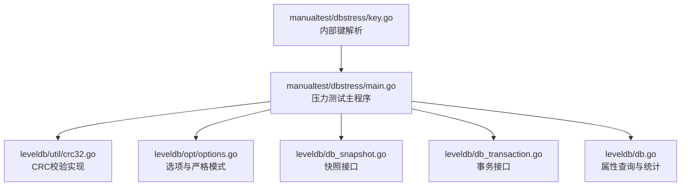
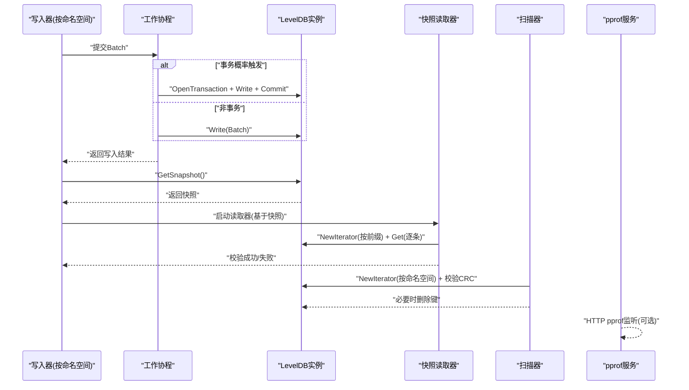
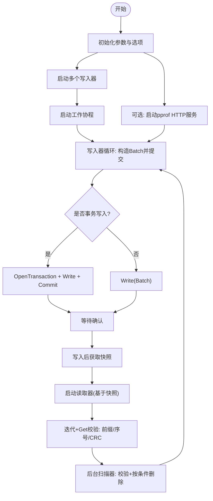
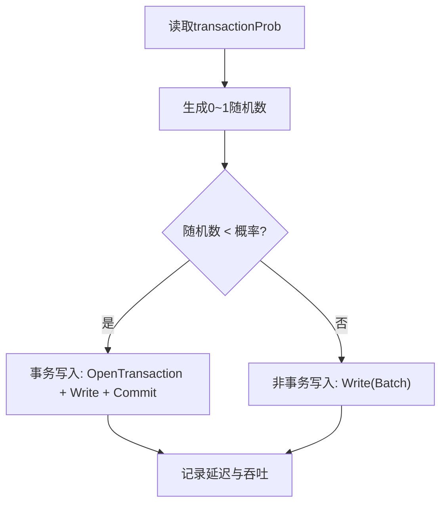
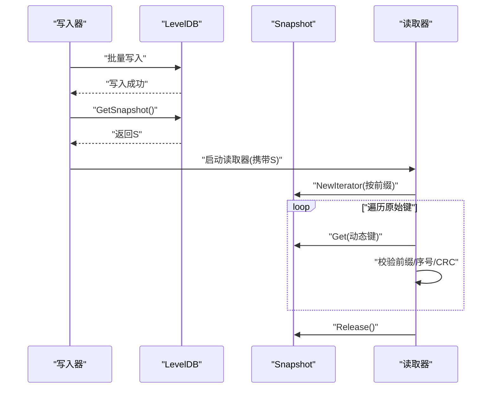
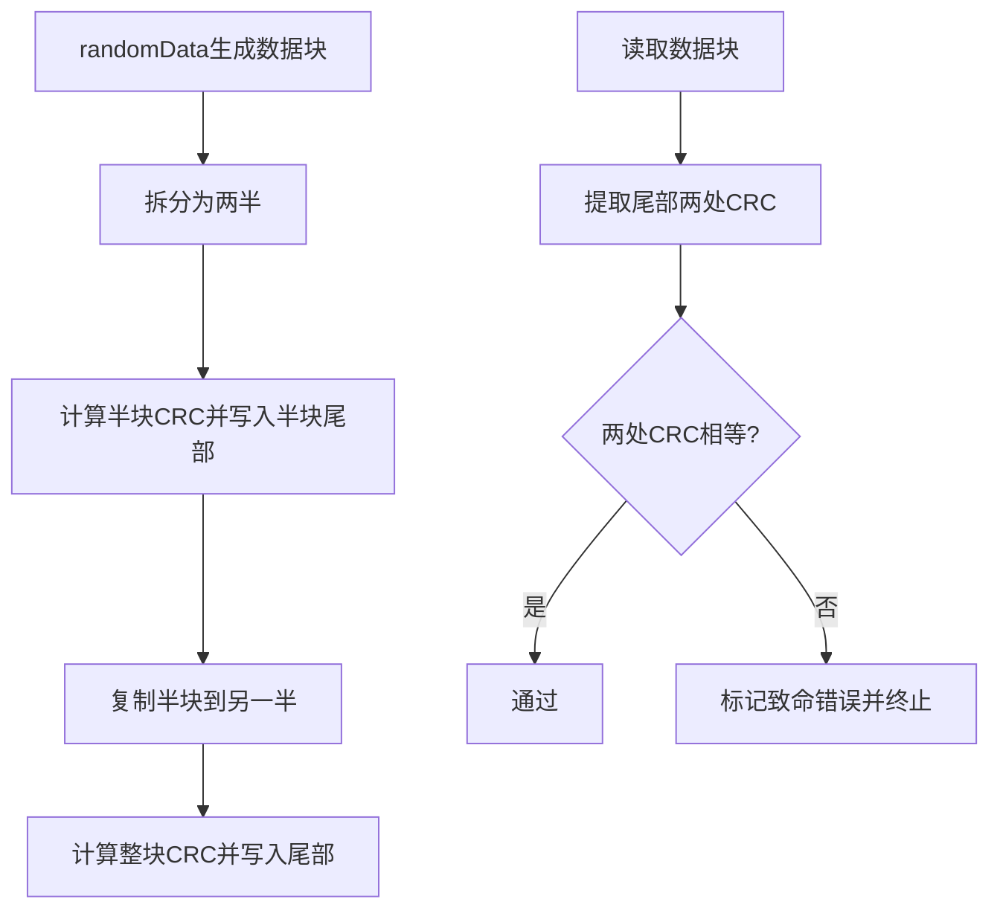
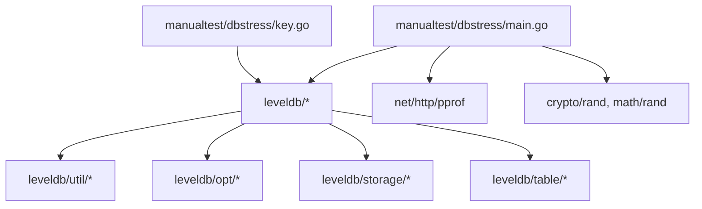

# dbstress压力测试工具

<cite>
**本文引用的文件**
- [main.go](file://manualtest/dbstress/main.go)
- [key.go](file://manualtest/dbstress/key.go)
- [crc32.go](file://leveldb/util/crc32.go)
- [options.go](file://leveldb/opt/options.go)
- [db_snapshot.go](file://leveldb/db_snapshot.go)
- [db_transaction.go](file://leveldb/db_transaction.go)
- [db.go](file://leveldb/db.go)
- [README.md](file://README.md)
</cite>

## 目录
1. [简介](#简介)
2. [项目结构](#项目结构)
3. [核心组件](#核心组件)
4. [架构总览](#架构总览)
5. [详细组件分析](#详细组件分析)
6. [依赖关系分析](#依赖关系分析)
7. [性能考量](#性能考量)
8. [故障排查指南](#故障排查指南)
9. [结论](#结论)
10. [附录：命令与参数](#附录命令与参数)

## 简介
本文件为 avccDB 的 dbstress 压力测试工具的技术文档，聚焦于其多线程并发读写机制、事务概率控制、快照一致性验证、数据完整性校验（含双重CRC）、以及 pprof 性能分析集成。文档旨在帮助读者理解工具如何在高并发场景下对数据库进行读写压力测试，并验证不同一致性级别与持久化策略下的正确性与稳定性。

## 项目结构
dbstress 工具位于 manualtest/dbstress 目录，核心代码由两个文件组成：
- main.go：压力测试主程序，包含参数解析、并发写入器、扫描器、读取器、快照验证、统计与pprof集成等。
- key.go：内部键解析与错误类型定义，用于辅助扫描器对内部键进行解析与校验。

图表来源
- [main.go](file://manualtest/dbstress/main.go#L1-L120)
- [crc32.go](file://leveldb/util/crc32.go#L1-L31)
- [options.go](file://leveldb/opt/options.go#L130-L174)
- [db_snapshot.go](file://leveldb/db_snapshot.go#L74-L131)
- [db_transaction.go](file://leveldb/db_transaction.go#L21-L90)
- [db.go](file://leveldb/db.go#L1251-L1297)
- [key.go](file://manualtest/dbstress/key.go#L66-L78)

章节来源
- [main.go](file://manualtest/dbstress/main.go#L1-L120)
- [key.go](file://manualtest/dbstress/key.go#L1-L78)

## 核心组件
- 参数与初始化
  - 支持的命令行参数包括数据库路径、打开文件缓存容量、键/值长度、每命名空间写入键数数组、pprof监听地址、事务概率、缓冲池/块缓存/压缩开关、最大清单文件大小等。
  - 初始化阶段注册 flag 并设置默认值，同时根据参数决定是否启用缓冲池。
- 并发写入器
  - 每个命名空间启动一个写入器 goroutine，周期性构造批量写入（Batch），包含两组键值对：一组是“原始键”，另一组是“写入器生成的动态键”。
  - 写入器通过通道向工作协程提交 Batch，并等待确认；若失败则调用致命错误处理逻辑。
- 工作协程（事务/非事务）
  - 单一工作协程负责接收 Batch 并选择写入方式：以指定概率使用事务写入（OpenTransaction + Commit）或直接 Write。
  - 统计每次写入的延迟与吞吐，记录最小/最大/平均延迟与每秒速率。
- 快照读取器
  - 写入器在每次批量写入后立即获取快照，然后启动一个独立读取器 goroutine，基于快照迭代命名空间内的“原始键”，并逐个读取对应的“动态键”值。
  - 读取器在快照范围内验证键前缀、写入序号、以及值的双重CRC校验，确保读到的数据在写入时刻保持一致。
- 扫描器
  - 后台扫描器定期遍历数据库，对所有键值进行双重CRC校验；部分键满足条件时会删除，形成持续的写入-删除循环。
- pprof 集成
  - 可选开启 HTTP pprof 监听端口，采集阻塞与互斥等运行时指标，便于定位热点与性能瓶颈。
- 统计输出
  - 定期输出各类延迟统计与数据库运行时属性（如块缓存、打开表、存活快照、存活迭代器、写延迟、IO统计、压缩次数等）。

章节来源
- [main.go](file://manualtest/dbstress/main.go#L80-L121)
- [main.go](file://manualtest/dbstress/main.go#L308-L416)
- [main.go](file://manualtest/dbstress/main.go#L418-L448)
- [main.go](file://manualtest/dbstress/main.go#L450-L631)
- [main.go](file://manualtest/dbstress/main.go#L635-L644)

## 架构总览
dbstress 采用“生产者-消费者”模型：多个命名空间的写入器作为生产者，将批量写入任务投递到单一工作协程；工作协程按概率选择事务或非事务写入；读取器基于快照在只读视角验证一致性；扫描器持续校验全库数据完整性；pprof 服务可选开启。

图表来源
- [main.go](file://manualtest/dbstress/main.go#L390-L416)
- [main.go](file://manualtest/dbstress/main.go#L488-L560)
- [main.go](file://manualtest/dbstress/main.go#L566-L631)
- [main.go](file://manualtest/dbstress/main.go#L316-L324)

## 详细组件分析

### 多线程并发读写机制
- 写入器并发
  - 每个命名空间启动一个写入器 goroutine，周期性构造 Batch 并提交给工作协程。
  - 写入器在提交后等待确认，失败即终止测试流程。
- 工作协程
  - 使用 math/rand 的浮点概率判断是否使用事务写入；事务写入包含 OpenTransaction、Write、Commit 流程，失败则丢弃事务。
  - 非事务写入直接调用 Write(Batch)。
  - 统计写入延迟与吞吐，记录最小/最大/平均延迟与每秒速率。
- 读取器并发
  - 基于快照迭代命名空间内的“原始键”，逐个读取对应“动态键”值，验证前缀、写入序号与值的双重CRC。
  - 读取器统计迭代与Get延迟，汇总到全局统计。
- 扫描器并发
  - 后台扫描器遍历数据库，对键值进行双重CRC校验；满足条件的键会被删除，形成持续写入-删除循环。

图表来源
- [main.go](file://manualtest/dbstress/main.go#L390-L416)
- [main.go](file://manualtest/dbstress/main.go#L450-L631)
- [main.go](file://manualtest/dbstress/main.go#L316-L324)

章节来源
- [main.go](file://manualtest/dbstress/main.go#L390-L416)
- [main.go](file://manualtest/dbstress/main.go#L450-L631)

### 事务概率控制（transactionProb）
- 功能说明
  - 通过随机概率决定每次批量写入是否使用事务写入。默认概率为 0.5，意味着约一半写入走事务路径，另一半走非事务路径。
- 实现位置
  - 在工作协程中，使用浮点概率判断是否执行事务写入；事务写入包含 OpenTransaction、Write、Commit 流程，失败则丢弃事务。
- 一致性影响
  - 事务写入提供原子性与一致性保障，有助于在高并发下验证 ACID 行为；非事务写入更贴近常规写入路径，用于对比两种写入方式的性能与稳定性差异。

图表来源
- [main.go](file://manualtest/dbstress/main.go#L394-L411)

章节来源
- [main.go](file://manualtest/dbstress/main.go#L394-L411)

### 快照一致性验证机制
- 获取快照
  - 写入器在每次批量写入成功后立即调用 GetSnapshot 获取一致性视图。
- 读取器基于快照
  - 读取器使用快照的 NewIterator 迭代命名空间内的“原始键”，逐个读取对应的“动态键”值。
  - 读取器验证：
    - 键前缀与命名空间匹配；
    - 动态键中嵌入的写入序号与当前快照一致；
    - 值的双重CRC校验通过。
- 释放与统计
  - 读取完成后释放快照；迭代与Get延迟分别统计并汇总到全局。

图表来源
- [main.go](file://manualtest/dbstress/main.go#L488-L560)
- [db_snapshot.go](file://leveldb/db_snapshot.go#L74-L131)

章节来源
- [main.go](file://manualtest/dbstress/main.go#L488-L560)
- [db_snapshot.go](file://leveldb/db_snapshot.go#L74-L131)

### 数据完整性校验流程（双重CRC）
- 数据块结构
  - 工具生成的数据块包含：
    - 前缀字节（命名空间与前缀标识）；
    - 中间部分为随机数据；
    - 尾部包含两处CRC校验：一处为“半块”CRC，另一处为整块CRC。
- 生成流程
  - randomData 负责填充数据块，先写入前缀与随机数据，再计算半块CRC写入半块尾部，复制半块到另一半，最后写入整块CRC。
- 读取校验
  - dataChecksum 提取尾部两处CRC并进行比较；若不一致，标记致命错误并终止测试。
  - 扫描器与读取器均使用此校验逻辑，确保全库一致性。

图表来源
- [main.go](file://manualtest/dbstress/main.go#L94-L121)
- [main.go](file://manualtest/dbstress/main.go#L140-L144)
- [crc32.go](file://leveldb/util/crc32.go#L1-L31)

章节来源
- [main.go](file://manualtest/dbstress/main.go#L94-L121)
- [main.go](file://manualtest/dbstress/main.go#L140-L144)
- [crc32.go](file://leveldb/util/crc32.go#L1-L31)

### 选项与严格模式（一致性与校验）
- 严格模式
  - 选项中包含多种严格级别标志，如块校验、读取严格、清单严格等；工具在扫描表时可根据需要启用严格模式以强制校验。
- 缓冲池与块缓存
  - 可通过命令行开关启用/禁用缓冲池与块缓存，影响内存占用与I/O行为。
- 压缩与清单文件大小
  - 可切换压缩算法与最大清单文件大小，用于评估不同配置下的性能与稳定性。

章节来源
- [options.go](file://leveldb/opt/options.go#L130-L174)
- [main.go](file://manualtest/dbstress/main.go#L358-L369)

### pprof 性能分析集成
- 启动方式
  - 当设置 HTTP pprof 监听地址时，工具会在后台启动 HTTP 服务器，暴露 pprof 接口。
- 运行时指标
  - 设置阻塞分析采样率，便于识别阻塞热点。
- 使用建议
  - 在长时间压力测试期间开启，结合 CPU/阻塞/互斥等指标进行分析。

章节来源
- [main.go](file://manualtest/dbstress/main.go#L316-L324)

## 依赖关系分析
- 组件耦合
  - main.go 依赖 leveldb 库提供的 DB、Snapshot、Transaction、Batch、Iterator、Options、util 等能力。
  - key.go 提供内部键解析辅助，被扫描器与读取器用于校验内部键格式。
- 外部依赖
  - net/http/pprof 用于性能分析；
  - math/rand 用于事务概率与随机删除条件；
  - crypto/rand 用于生成随机数据块内容。

图表来源
- [main.go](file://manualtest/dbstress/main.go#L1-L31)
- [key.go](file://manualtest/dbstress/key.go#L1-L23)

章节来源
- [main.go](file://manualtest/dbstress/main.go#L1-L31)
- [key.go](file://manualtest/dbstress/key.go#L1-L23)

## 性能考量
- 并发度与资源
  - 写入器数量与命名空间数量呈正比；每个写入器都会启动读取器与扫描器，需关注CPU与内存占用。
- 缓冲池与块缓存
  - 启用缓冲池与块缓存可降低I/O开销，但会增加内存占用；根据目标环境权衡配置。
- 压缩与清单文件大小
  - 启用压缩可能提升空间效率但增加CPU消耗；增大清单文件大小可减少频繁切换，但会增加内存占用。
- pprof 分析
  - 在测试过程中开启 pprof，结合阻塞/互斥/堆栈等指标定位热点与瓶颈。

## 故障排查指南
- 致命错误处理
  - 任何写入、读取、迭代或内部键解析失败都会触发 fatalf，标记失败状态并尝试扫描可疑表以定位问题。
- 内部键解析错误
  - 若内部键长度不足或类型非法，扫描器会报告“内部键损坏”并终止。
- 数据块CRC不一致
  - 读取器与扫描器均会对数据块进行双重CRC校验，不一致时会打印详细信息并终止测试。
- 快照与迭代器
  - 读取器在退出时会释放快照与迭代器，避免资源泄漏；若出现异常，检查快照生命周期与迭代器释放顺序。

章节来源
- [main.go](file://manualtest/dbstress/main.go#L336-L353)
- [main.go](file://manualtest/dbstress/main.go#L158-L236)
- [key.go](file://manualtest/dbstress/key.go#L66-L78)

## 结论
dbstress 通过多线程并发写入、事务概率控制、快照一致性验证与双重CRC校验，构建了覆盖读写路径、一致性级别与数据完整性的综合压力测试方案。配合 pprof 性能分析，可在长时间稳定性测试、故障注入测试与性能基线建立等场景中有效评估数据库在高并发与复杂一致性需求下的表现。

## 附录：命令与参数
- 常用命令示例
  - 启动压力测试（默认参数）：在项目根目录执行编译与运行命令，随后在终端输入相应参数。
  - 开启 pprof：设置 -httpprof 参数后，访问本地 HTTP pprof 端口查看性能数据。
- 关键参数说明
  - -db：数据库存储路径，默认临时目录下的测试数据库。
  - -openfilescachecap：打开文件缓存容量；设为0表示禁用。
  - -keylen：键长度，默认63字节。
  - -valuelen：值长度，默认256字节。
  - -numkeys：每命名空间写入键数数组，支持多个数值。
  - -httpprof：pprof HTTP监听地址，默认关闭；设置后启动HTTP服务。
  - -transactionprob：事务写入概率，默认0.5。
  - -enablebufferpool：启用缓冲池，默认false。
  - -enableblockcache：启用块缓存，默认false。
  - -enablecompression：启用压缩，默认false。
  - -maxManifestFileSize：最大清单文件大小，默认使用选项默认值。
- 典型应用场景
  - 长时间稳定性测试：持续运行，观察内存、磁盘与CPU变化趋势。
  - 故障注入测试：结合扫描器与内部键解析，验证损坏键/值的检测与恢复能力。
  - 性能基线建立：固定参数组合，记录延迟与吞吐，形成对比基准。

章节来源
- [main.go](file://manualtest/dbstress/main.go#L80-L92)
- [README.md](file://README.md#L1-L20)