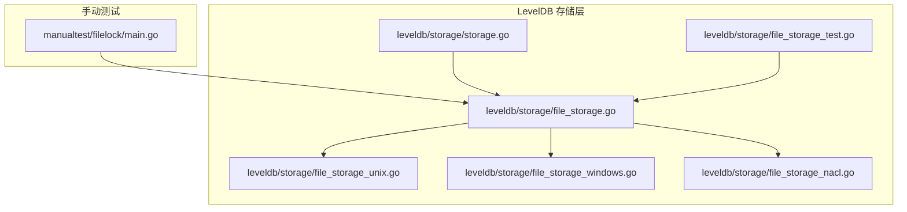
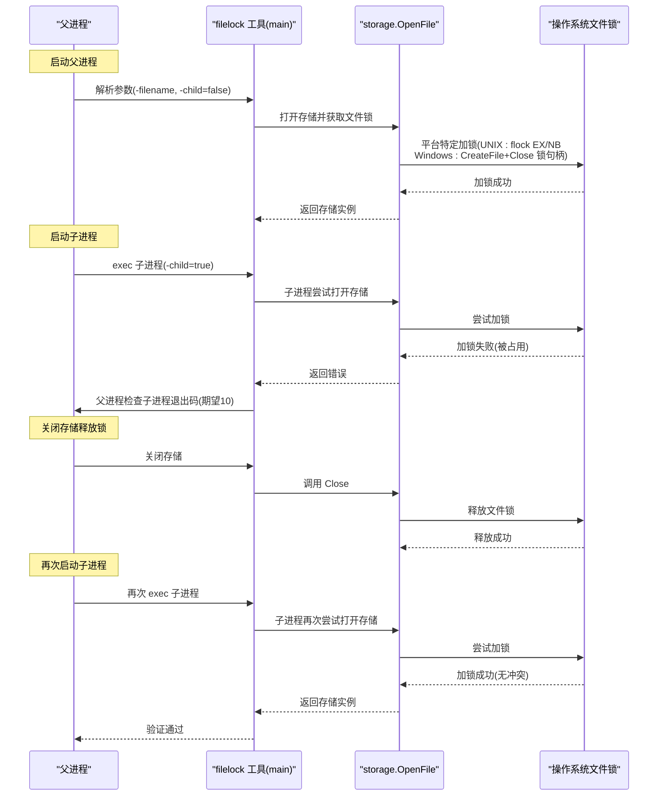
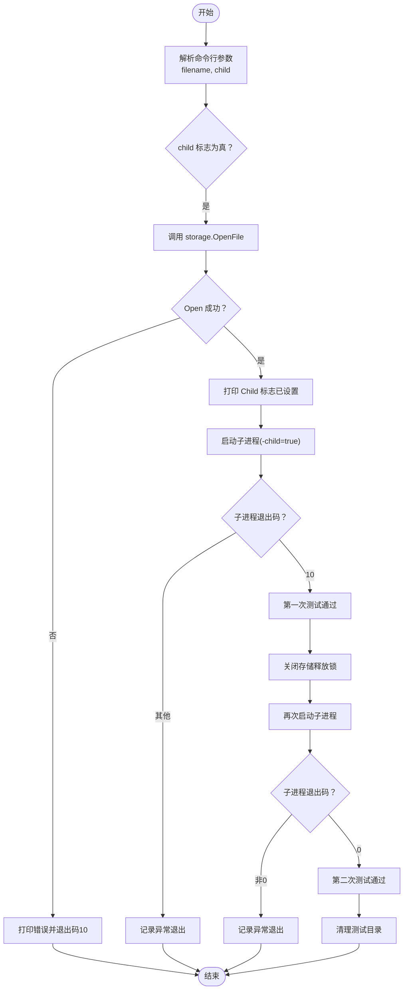
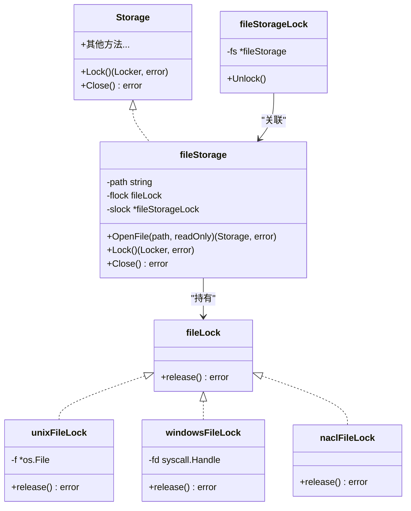
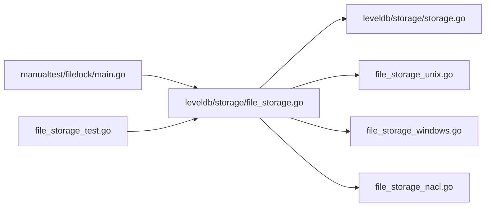

# filelock文件锁测试工具

<cite>
**本文引用的文件**
- [manualtest/filelock/main.go](file://manualtest/filelock/main.go)
- [leveldb/storage/file_storage.go](file://leveldb/storage/file_storage.go)
- [leveldb/storage/storage.go](file://leveldb/storage/storage.go)
- [leveldb/storage/file_storage_unix.go](file://leveldb/storage/file_storage_unix.go)
- [leveldb/storage/file_storage_windows.go](file://leveldb/storage/file_storage_windows.go)
- [leveldb/storage/file_storage_nacl.go](file://leveldb/storage/file_storage_nacl.go)
- [leveldb/storage/file_storage_test.go](file://leveldb/storage/file_storage_test.go)
- [README.md](file://README.md)
</cite>

## 目录
1. [简介](#简介)
2. [项目结构](#项目结构)
3. [核心组件](#核心组件)
4. [架构总览](#架构总览)
5. [详细组件分析](#详细组件分析)
6. [依赖关系分析](#依赖关系分析)
7. [性能与可靠性考量](#性能与可靠性考量)
8. [故障排查指南](#故障排查指南)
9. [结论](#结论)
10. [附录：使用方法与参数说明](#附录用法与参数说明)

## 简介
本文件为 avccDB 仓库中 filelock 文件锁测试工具的技术文档。该工具用于验证 LevelDB 的文件锁定机制，确保同一时间仅有一个进程能够访问指定的数据库目录，从而避免多实例并发访问导致的数据损坏或不可预期行为。工具通过父子进程协作模拟典型场景：
- 父进程先创建存储实例并获取文件锁；
- 子进程随后尝试在同一路径上打开存储，应因文件被占用而失败；
- 父进程关闭存储后释放锁，子进程再次尝试应成功。

该工具对部署前的环境兼容性测试具有重要价值，尤其在不同操作系统（Unix/Linux、Windows、NaCl）下验证文件系统锁的可靠性。

## 项目结构
filelock 测试工具位于手动测试目录中，核心逻辑集中在单一入口文件；底层文件锁实现分布于 storage 包的不同平台文件中。

图表来源
- [manualtest/filelock/main.go](file://manualtest/filelock/main.go#L1-L86)
- [leveldb/storage/storage.go](file://leveldb/storage/storage.go#L1-L189)
- [leveldb/storage/file_storage.go](file://leveldb/storage/file_storage.go#L1-L299)
- [leveldb/storage/file_storage_unix.go](file://leveldb/storage/file_storage_unix.go#L1-L64)
- [leveldb/storage/file_storage_windows.go](file://leveldb/storage/file_storage_windows.go#L1-L79)
- [leveldb/storage/file_storage_nacl.go](file://leveldb/storage/file_storage_nacl.go#L1-L35)
- [leveldb/storage/file_storage_test.go](file://leveldb/storage/file_storage_test.go#L333-L402)

章节来源
- [manualtest/filelock/main.go](file://manualtest/filelock/main.go#L1-L86)
- [README.md](file://README.md#L1-L108)

## 核心组件
- filelock 测试工具（manualtest/filelock/main.go）
  - 提供命令行参数解析，支持 filename 和 child 标志位；
  - 通过 exec 启动子进程，收集子进程输出并打印；
  - 在父进程中调用 storage.OpenFile 获取文件锁，随后关闭存储释放锁；
  - 依据子进程退出状态判断锁行为是否符合预期。
- 存储接口与文件锁实现（leveldb/storage）
  - Storage 接口定义了 Lock/Unlock、Close 等方法；
  - fileStorage.OpenFile 负责创建目录、打开 LOCK 文件并获取文件锁；
  - 不同平台的文件锁实现分别封装在 file_storage_unix.go、file_storage_windows.go、file_storage_nacl.go 中；
  - file_storage_test.go 提供了针对文件锁行为的单元测试样例。

章节来源
- [manualtest/filelock/main.go](file://manualtest/filelock/main.go#L1-L86)
- [leveldb/storage/storage.go](file://leveldb/storage/storage.go#L140-L189)
- [leveldb/storage/file_storage.go](file://leveldb/storage/file_storage.go#L92-L145)
- [leveldb/storage/file_storage_unix.go](file://leveldb/storage/file_storage_unix.go#L1-L64)
- [leveldb/storage/file_storage_windows.go](file://leveldb/storage/file_storage_windows.go#L1-L79)
- [leveldb/storage/file_storage_nacl.go](file://leveldb/storage/file_storage_nacl.go#L1-L35)
- [leveldb/storage/file_storage_test.go](file://leveldb/storage/file_storage_test.go#L333-L402)

## 架构总览
下面的时序图展示了工具从父进程到子进程的完整验证流程，以及文件锁在不同平台上的实现差异。

图表来源
- [manualtest/filelock/main.go](file://manualtest/filelock/main.go#L25-L85)
- [leveldb/storage/file_storage.go](file://leveldb/storage/file_storage.go#L92-L145)
- [leveldb/storage/file_storage_unix.go](file://leveldb/storage/file_storage_unix.go#L28-L61)
- [leveldb/storage/file_storage_windows.go](file://leveldb/storage/file_storage_windows.go#L32-L53)

## 详细组件分析

### 组件A：filelock 测试工具（manualtest/filelock/main.go）
- 参数与标志位
  - filename：测试使用的数据库目录路径，默认位于临时目录下；
  - child：布尔标志，指示当前进程是否为子进程。
- 主流程
  - 父进程解析参数后，调用 storage.OpenFile 获取存储实例；
  - 若 OpenFile 返回错误，父进程打印提示并以特定退出码结束；
  - 父进程启动子进程，捕获子进程标准输出并回显；
  - 子进程同样调用 storage.OpenFile，若失败则以相同退出码返回；
  - 父进程关闭存储释放锁；
  - 再次启动子进程，验证第二次访问成功。
- 退出码约定
  - 子进程因文件被占用而失败时，父进程期望其以特定退出码返回；
  - 父进程在关闭存储时若发生错误，会以另一个退出码提示。

图表来源
- [manualtest/filelock/main.go](file://manualtest/filelock/main.go#L25-L85)

章节来源
- [manualtest/filelock/main.go](file://manualtest/filelock/main.go#L1-L86)

### 组件B：存储接口与文件锁实现（leveldb/storage）
- 接口契约
  - Storage 定义了 Lock/Unlock、Close 等方法，保证同一存储实例的互斥访问；
  - fileStorage 实现了这些方法，并在 OpenFile 中获取文件锁。
- 文件锁获取与释放
  - OpenFile 在创建目录后，打开 LOCK 文件并通过平台特定函数获取文件锁；
  - Close 时调用 flock.release() 释放锁，确保后续进程可正常访问。
- 平台差异
  - Unix/Linux：使用 flock 加排他锁（非阻塞），失败即表示被占用；
  - Windows：通过 CreateFile 打开/创建锁文件句柄，实现独占访问；
  - NaCl：不支持文件锁，返回特定错误类型。

图表来源
- [leveldb/storage/storage.go](file://leveldb/storage/storage.go#L140-L189)
- [leveldb/storage/file_storage.go](file://leveldb/storage/file_storage.go#L73-L145)
- [leveldb/storage/file_storage_unix.go](file://leveldb/storage/file_storage_unix.go#L17-L61)
- [leveldb/storage/file_storage_windows.go](file://leveldb/storage/file_storage_windows.go#L24-L53)
- [leveldb/storage/file_storage_nacl.go](file://leveldb/storage/file_storage_nacl.go#L17-L19)

章节来源
- [leveldb/storage/storage.go](file://leveldb/storage/storage.go#L1-L189)
- [leveldb/storage/file_storage.go](file://leveldb/storage/file_storage.go#L73-L145)
- [leveldb/storage/file_storage_unix.go](file://leveldb/storage/file_storage_unix.go#L1-L64)
- [leveldb/storage/file_storage_windows.go](file://leveldb/storage/file_storage_windows.go#L1-L79)
- [leveldb/storage/file_storage_nacl.go](file://leveldb/storage/file_storage_nacl.go#L1-L35)

### 组件C：文件锁行为验证（leveldb/storage/file_storage_test.go）
- 单元测试覆盖
  - 多次 OpenFile 同一路径应报错（已被占用）；
  - 同一进程多次 Lock 应报错（重复占用）；
  - 释放锁后再次 Lock 应成功；
  - 只读模式下的锁行为与读写模式不同。
- 与工具的一致性
  - 测试工具的行为与单元测试一致：子进程首次访问应失败，父进程关闭后再次访问应成功。

章节来源
- [leveldb/storage/file_storage_test.go](file://leveldb/storage/file_storage_test.go#L333-L402)

## 依赖关系分析
- 工具依赖
  - manualtest/filelock/main.go 依赖 leveldb/storage 包的 OpenFile；
  - 通过 os/exec 启动自身作为子进程，传递 -child 标志。
- 存储层依赖
  - file_storage.go 依赖平台特定文件锁实现；
  - storage.go 定义接口契约，file_storage.go 实现之；
  - file_storage_unix.go/file_storage_windows.go/file_storage_nacl.go 分别处理不同平台的文件锁语义。

图表来源
- [manualtest/filelock/main.go](file://manualtest/filelock/main.go#L1-L86)
- [leveldb/storage/file_storage.go](file://leveldb/storage/file_storage.go#L1-L299)
- [leveldb/storage/storage.go](file://leveldb/storage/storage.go#L1-L189)
- [leveldb/storage/file_storage_unix.go](file://leveldb/storage/file_storage_unix.go#L1-L64)
- [leveldb/storage/file_storage_windows.go](file://leveldb/storage/file_storage_windows.go#L1-L79)
- [leveldb/storage/file_storage_nacl.go](file://leveldb/storage/file_storage_nacl.go#L1-L35)
- [leveldb/storage/file_storage_test.go](file://leveldb/storage/file_storage_test.go#L333-L402)

章节来源
- [manualtest/filelock/main.go](file://manualtest/filelock/main.go#L1-L86)
- [leveldb/storage/file_storage.go](file://leveldb/storage/file_storage.go#L1-L299)
- [leveldb/storage/storage.go](file://leveldb/storage/storage.go#L1-L189)
- [leveldb/storage/file_storage_unix.go](file://leveldb/storage/file_storage_unix.go#L1-L64)
- [leveldb/storage/file_storage_windows.go](file://leveldb/storage/file_storage_windows.go#L1-L79)
- [leveldb/storage/file_storage_nacl.go](file://leveldb/storage/file_storage_nacl.go#L1-L35)
- [leveldb/storage/file_storage_test.go](file://leveldb/storage/file_storage_test.go#L333-L402)

## 性能与可靠性考量
- 文件锁粒度
  - 采用目录级 LOCK 文件进行互斥，避免跨进程共享内存或信号量等复杂机制；
  - 平台差异导致的锁行为不同（Unix 使用 flock，Windows 使用文件句柄），工具通过统一接口屏蔽差异。
- 并发与竞争
  - 工具通过父子进程模拟真实并发场景，验证锁的正确性；
  - 建议在高并发部署环境中，配合进程管理器确保单实例运行，避免意外的多实例竞争。
- 清理与容错
  - 父进程在最后清理测试目录，避免残留文件影响后续测试；
  - Close 失败时以特定退出码提示，便于自动化脚本识别问题。

[本节为通用指导，无需列出具体文件来源]

## 故障排查指南
- 子进程首次访问未失败
  - 检查父进程是否成功获取锁；
  - 确认平台文件锁是否可用（NaCl 不支持文件锁）。
- 关闭存储后子进程仍失败
  - 确认 Close 是否被调用且未返回错误；
  - 检查平台锁释放逻辑是否正常。
- 退出码不符合预期
  - 父进程期望子进程以特定退出码返回，若不一致需检查工具逻辑与平台实现；
  - 参考单元测试验证锁行为是否符合预期。

章节来源
- [manualtest/filelock/main.go](file://manualtest/filelock/main.go#L44-L85)
- [leveldb/storage/file_storage.go](file://leveldb/storage/file_storage.go#L565-L582)
- [leveldb/storage/file_storage_unix.go](file://leveldb/storage/file_storage_unix.go#L28-L61)
- [leveldb/storage/file_storage_windows.go](file://leveldb/storage/file_storage_windows.go#L32-L53)
- [leveldb/storage/file_storage_nacl.go](file://leveldb/storage/file_storage_nacl.go#L17-L19)
- [leveldb/storage/file_storage_test.go](file://leveldb/storage/file_storage_test.go#L333-L402)

## 结论
filelock 文件锁测试工具通过父子进程协作，有效验证了 LevelDB 的文件锁定机制在不同平台上的可靠性。它不仅可用于部署前的环境兼容性测试，还能帮助开发者理解不同操作系统下文件锁的行为差异，确保数据库实例的单点运行保障机制稳定可靠。

[本节为总结性内容，无需列出具体文件来源]

## 附录：使用方法与参数说明
- 命令行参数
  - -filename：指定测试使用的数据库目录路径（默认位于临时目录下）；
  - -child：布尔标志，指示当前进程是否为子进程（工具内部使用）。
- 运行步骤
  - 直接运行工具：父进程创建存储并获取锁；
  - 工具自动启动子进程尝试访问同一路径，子进程应失败并返回特定退出码；
  - 父进程关闭存储释放锁；
  - 再次启动子进程，子进程应成功访问；
  - 最终清理测试目录。
- 适用场景
  - 部署前环境兼容性测试；
  - 验证不同平台文件锁的可靠性；
  - 确保数据库实例单点运行策略有效。

章节来源
- [manualtest/filelock/main.go](file://manualtest/filelock/main.go#L20-L23)
- [manualtest/filelock/main.go](file://manualtest/filelock/main.go#L44-L85)
- [README.md](file://README.md#L1-L108)