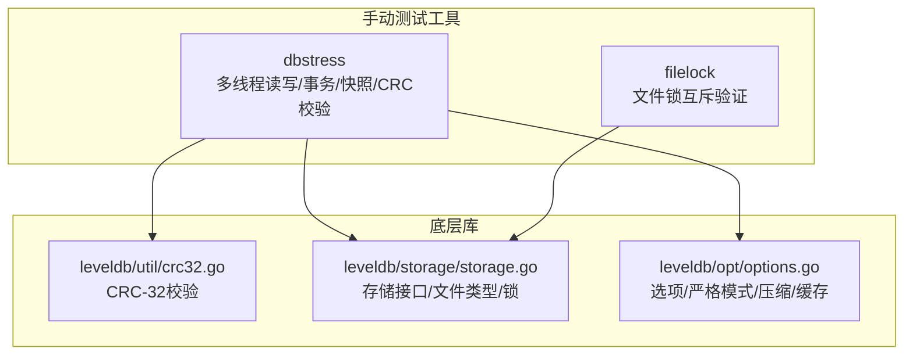
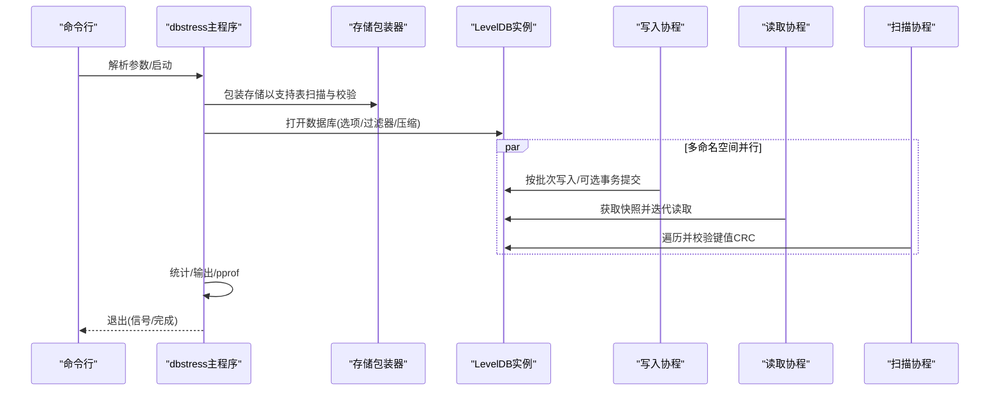
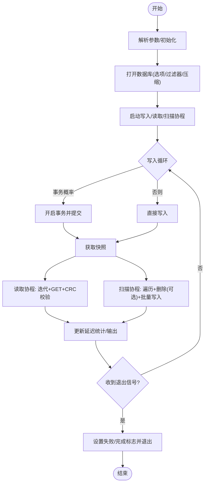
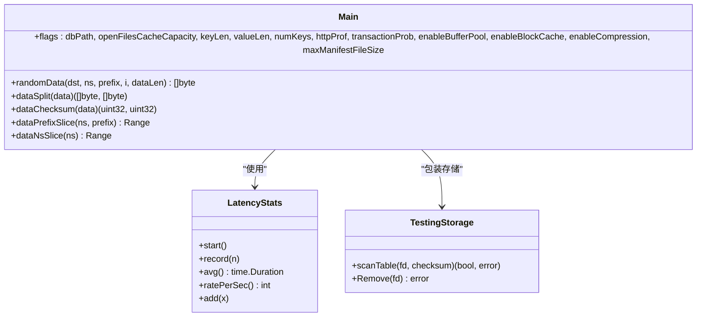
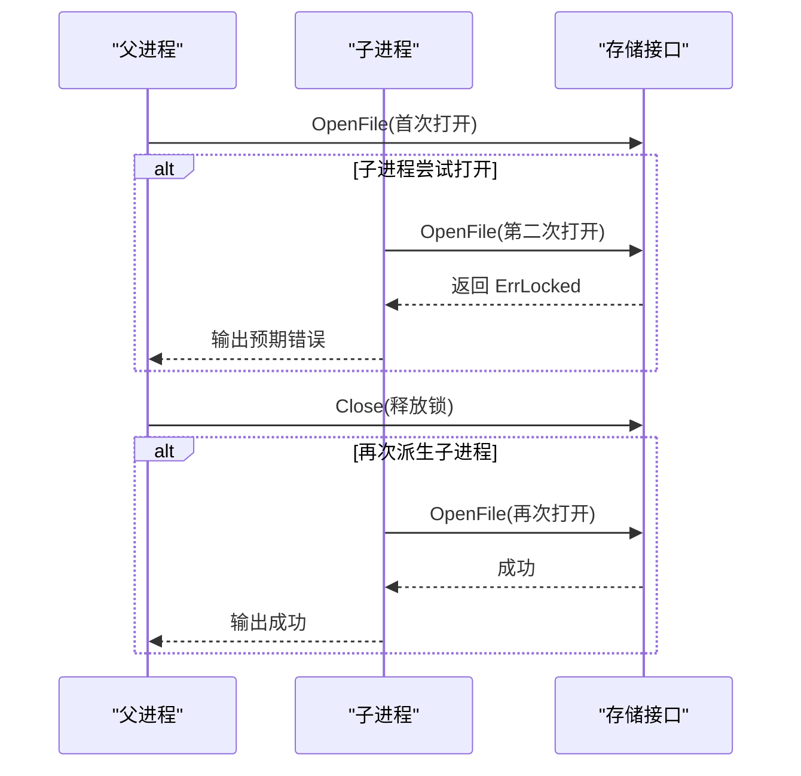
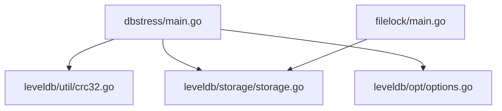

# 手动测试工具

<cite>
**本文引用的文件**
- [manualtest/dbstress/main.go](file://manualtest/dbstress/main.go)
- [manualtest/dbstress/key.go](file://manualtest/dbstress/key.go)
- [manualtest/filelock/main.go](file://manualtest/filelock/main.go)
- [leveldb/util/crc32.go](file://leveldb/util/crc32.go)
- [leveldb/storage/storage.go](file://leveldb/storage/storage.go)
- [leveldb/opt/options.go](file://leveldb/opt/options.go)
</cite>

## 目录
1. [简介](#简介)
2. [项目结构](#项目结构)
3. [核心组件](#核心组件)
4. [架构总览](#架构总览)
5. [详细组件分析](#详细组件分析)
6. [依赖关系分析](#依赖关系分析)
7. [性能考量](#性能考量)
8. [故障排查指南](#故障排查指南)
9. [结论](#结论)
10. [附录：使用与参数说明](#附录使用与参数说明)

## 简介
本文件面向 avccDB 的手动测试工具，提供两类关键工具的技术文档：
- dbstress 压力测试工具：通过多线程读写、事务概率控制、快照一致性验证与数据完整性校验（含随机数据生成与 CRC 校验）进行系统稳定性与健壮性测试。
- filelock 文件锁测试工具：验证 LevelDB 的文件锁定机制，防止多实例并发访问冲突，确保数据库目录的互斥访问。

文档从工作机制、数据流、处理逻辑、集成点、错误处理与性能特征等维度展开，并给出运行方法、参数配置与典型应用场景，帮助读者在系统稳定性测试与故障模拟中高效使用这两个工具。

## 项目结构
本仓库包含两个手动测试子目录：
- manualtest/dbstress：实现多线程读写、事务概率控制、快照一致性与数据完整性校验的压力测试工具。
- manualtest/filelock：实现基于进程派生的文件锁测试，验证 LevelDB 存储层的互斥访问能力。

图表来源
- [manualtest/dbstress/main.go](file://manualtest/dbstress/main.go#L1-L120)
- [manualtest/dbstress/key.go](file://manualtest/dbstress/key.go#L1-L78)
- [manualtest/filelock/main.go](file://manualtest/filelock/main.go#L1-L86)
- [leveldb/util/crc32.go](file://leveldb/util/crc32.go#L1-L31)
- [leveldb/storage/storage.go](file://leveldb/storage/storage.go#L1-L189)
- [leveldb/opt/options.go](file://leveldb/opt/options.go#L1-L200)

章节来源
- [manualtest/dbstress/main.go](file://manualtest/dbstress/main.go#L1-L120)
- [manualtest/filelock/main.go](file://manualtest/filelock/main.go#L1-L86)

## 核心组件
- dbstress 主程序：负责参数解析、随机数据生成、多线程写入/读取/扫描、事务概率控制、快照一致性与延迟统计、HTTP pprof 性能分析、以及对表文件的 CRC 校验与损坏检测。
- dbstress 键解析与内部键类型：定义内部键类型与解析逻辑，用于校验内部键格式正确性。
- filelock 主程序：通过派生子进程尝试二次打开同一存储路径，验证存储层的互斥锁行为（ErrLocked）。

章节来源
- [manualtest/dbstress/main.go](file://manualtest/dbstress/main.go#L80-L120)
- [manualtest/dbstress/key.go](file://manualtest/dbstress/key.go#L1-L78)
- [manualtest/filelock/main.go](file://manualtest/filelock/main.go#L1-L86)

## 架构总览
dbstress 的整体工作流包括：参数初始化、存储包装器（用于扫描与校验）、数据库打开、写入/事务执行、快照读取、迭代扫描与 CRC 校验、统计输出与信号退出；filelock 则通过父子进程并发打开同一存储路径，触发存储层的互斥锁失败，从而验证文件锁定机制。

图表来源
- [manualtest/dbstress/main.go](file://manualtest/dbstress/main.go#L308-L644)
- [leveldb/storage/storage.go](file://leveldb/storage/storage.go#L139-L189)
- [leveldb/opt/options.go](file://leveldb/opt/options.go#L176-L200)

## 详细组件分析

### dbstress 工具分析
- 参数与配置
  - 数据库路径、打开文件缓存容量、键/值长度、命名空间键数量数组、HTTP pprof 地址、事务概率、缓冲池/块缓存/压缩开关、最大 MANIFEST 文件大小等。
- 随机数据生成与校验
  - 使用随机源填充数据主体，采用 CRC-32（Castagnoli 多项式）计算校验值，附加到数据尾部；同时将数据对半拆分，分别计算校验，确保读取时双段校验一致。
  - 内部键解析：内部键最后 8 字节编码序列号与类型，解析失败即判定损坏。
- 多线程读写与事务概率
  - 写入协程：按批次写入，随机选择是否开启事务提交；事务失败则丢弃。
  - 读取协程：每次写入后获取快照，迭代指定前缀键，逐条校验内部键与值的 CRC，统计 GET/迭代延迟与吞吐。
  - 扫描协程：遍历指定命名空间的所有键值，校验键/值 CRC，按一定概率删除键，批量写回。
- 快照一致性与数据完整性
  - 读取使用快照，保证读取期间写入不干扰，避免“写放大”导致的可见性问题。
  - 表扫描器在移除文件时，先对表进行严格校验（启用块级校验与只读读取），定位损坏键值或内部键格式错误。
- 统计与可观测性
  - 延迟统计：最小/最大/平均延迟与每秒速率；周期性输出数据库属性（块缓存、打开表数、存活快照/迭代器、写延迟、IO 统计、压缩次数等）。
  - HTTP pprof：可选启用本地 HTTP 服务，便于性能分析与阻塞分析。
- 错误处理与退出
  - 出错时设置全局失败标记，记录致命信息，必要时扫描损坏表以定位问题；收到中断信号后优雅退出。

图表来源
- [manualtest/dbstress/main.go](file://manualtest/dbstress/main.go#L308-L644)
- [manualtest/dbstress/key.go](file://manualtest/dbstress/key.go#L66-L78)
- [leveldb/util/crc32.go](file://leveldb/util/crc32.go#L1-L31)

章节来源
- [manualtest/dbstress/main.go](file://manualtest/dbstress/main.go#L80-L120)
- [manualtest/dbstress/main.go](file://manualtest/dbstress/main.go#L137-L206)
- [manualtest/dbstress/main.go](file://manualtest/dbstress/main.go#L308-L644)
- [manualtest/dbstress/key.go](file://manualtest/dbstress/key.go#L1-L78)
- [leveldb/util/crc32.go](file://leveldb/util/crc32.go#L1-L31)

#### 对象关系类图（dbstress）

图表来源
- [manualtest/dbstress/main.go](file://manualtest/dbstress/main.go#L255-L307)
- [manualtest/dbstress/main.go](file://manualtest/dbstress/main.go#L154-L253)
- [manualtest/dbstress/main.go](file://manualtest/dbstress/main.go#L94-L121)

### filelock 工具分析
- 目标：验证 LevelDB 存储层的文件锁定机制，确保同一目录下无法被多个进程同时打开。
- 方法：父进程打开存储后，派生子进程尝试再次打开同一存储路径；若返回“已锁定”错误，则证明文件锁有效；关闭父进程存储后再派生子进程，验证释放后可再次打开。
- 关键点：存储接口定义了 Lock/Unlock 方法，ErrLocked 表示互斥锁冲突；该工具通过 OpenFile 调用触发存储层的互斥语义。

图表来源
- [manualtest/filelock/main.go](file://manualtest/filelock/main.go#L44-L86)
- [leveldb/storage/storage.go](file://leveldb/storage/storage.go#L139-L189)

章节来源
- [manualtest/filelock/main.go](file://manualtest/filelock/main.go#L1-L86)
- [leveldb/storage/storage.go](file://leveldb/storage/storage.go#L139-L189)

## 依赖关系分析
- dbstress 依赖
  - leveldb/util/crc32：提供 CRC-32 校验（Castagnoli 多项式）与掩码函数，用于键/值数据的完整性校验。
  - leveldb/storage/storage：提供存储抽象、文件类型枚举、互斥锁接口与错误类型（如 ErrLocked、ErrCorrupted）。
  - leveldb/opt/options：提供数据库选项（块缓存、压缩、严格模式、最大 MANIFEST 尺寸等），影响读写性能与严格性。
- filelock 依赖
  - leveldb/storage/storage：通过 OpenFile 触发存储层的互斥锁行为，验证 ErrLocked 是否按预期返回。

图表来源
- [manualtest/dbstress/main.go](file://manualtest/dbstress/main.go#L1-L60)
- [manualtest/filelock/main.go](file://manualtest/filelock/main.go#L1-L24)
- [leveldb/util/crc32.go](file://leveldb/util/crc32.go#L1-L31)
- [leveldb/storage/storage.go](file://leveldb/storage/storage.go#L1-L189)
- [leveldb/opt/options.go](file://leveldb/opt/options.go#L1-L200)

章节来源
- [manualtest/dbstress/main.go](file://manualtest/dbstress/main.go#L1-L60)
- [manualtest/filelock/main.go](file://manualtest/filelock/main.go#L1-L24)

## 性能考量
- 并发与延迟
  - 写入/读取/扫描三类协程并行执行，通过通道与信号量协调；延迟统计提供最小/最大/平均与每秒速率，便于评估系统在高负载下的响应表现。
- 缓存与压缩
  - 可配置块缓存、缓冲池与压缩策略；合理设置可降低 I/O 压力，但需权衡 CPU 开销与内存占用。
- 严格模式
  - 启用块级校验与只读读取可提升数据可靠性，但在扫描阶段会增加读取成本；建议在稳定性测试中开启，在生产环境根据需求调整。
- pprof 分析
  - 可选启用 HTTP pprof，便于定位热点与阻塞点，优化瓶颈环节。

章节来源
- [manualtest/dbstress/main.go](file://manualtest/dbstress/main.go#L360-L448)
- [leveldb/opt/options.go](file://leveldb/opt/options.go#L130-L174)

## 故障排查指南
- 数据损坏定位
  - 当出现内部键解析错误或 CRC 不一致时，dbstress 会记录致命信息并尝试扫描对应表文件，定位具体键值位置；必要时可结合 pprof 定位异常。
- 文件锁冲突
  - filelock 通过 ErrLocked 验证互斥锁生效；若未返回该错误，需检查存储实现或平台文件锁语义。
- 退出与信号
  - 收到中断信号后，dbstress 会设置完成标志并等待所有协程退出；如长时间无响应，可检查是否存在阻塞的迭代或写入操作。

章节来源
- [manualtest/dbstress/main.go](file://manualtest/dbstress/main.go#L336-L353)
- [manualtest/dbstress/main.go](file://manualtest/dbstress/main.go#L158-L206)
- [manualtest/filelock/main.go](file://manualtest/filelock/main.go#L44-L86)

## 结论
dbstress 与 filelock 分别从“数据完整性与并发稳定性”和“文件互斥访问”两个维度，为 avccDB 提供了高效的自动化测试手段。前者通过多线程读写、事务概率控制、快照一致性与 CRC 校验，全面评估系统在高负载下的健壮性；后者通过父子进程并发打开同一存储路径，验证存储层的互斥锁机制。两者配合，可在系统稳定性测试与故障模拟中发挥重要作用。

## 附录：使用与参数说明

### dbstress 使用与参数
- 运行方式
  - 直接运行二进制文件，或通过构建后执行（例如：go build -o dbstress ./manualtest/dbstress；./dbstress [参数]）。
- 常用参数
  - -db：测试数据库目录路径，默认临时目录下的测试数据库。
  - -openfilescachecap：打开文件缓存容量；设为 0 表示禁用。
  - -keylen：键长度。
  - -valuelen：值长度。
  - -numkeys：命名空间对应的键数量数组（逗号分隔）。
  - -httpprof：HTTP pprof 监听地址（可选）。
  - -transactionprob：写入使用事务的概率（0~1）。
  - -enablebufferpool：启用缓冲池。
  - -enableblockcache：启用块缓存。
  - -enablecompression：启用块压缩。
  - -maxManifestFileSize：最大 MANIFEST 文件大小。
- 典型场景
  - 稳定性测试：设置较高 -numkeys 与 -transactionprob，观察延迟与吞吐变化。
  - 故障模拟：在 -httpprof 开启下，结合 pprof 分析热点；或在 -enablecompression 下评估压缩对性能的影响。
  - 数据完整性验证：在 -enableblockcache 与 -enablebufferpool 下对比不同缓存策略对 CRC 校验与读取延迟的影响。

章节来源
- [manualtest/dbstress/main.go](file://manualtest/dbstress/main.go#L80-L92)
- [manualtest/dbstress/main.go](file://manualtest/dbstress/main.go#L360-L448)

### filelock 使用与参数
- 运行方式
  - 直接运行二进制文件，或通过构建后执行（例如：go build -o filelock ./manualtest/filelock；./filelock [参数]）。
- 常用参数
  - -filename：测试使用的文件路径（默认临时目录下的测试文件）。
  - -child：子进程标识（由工具内部使用，一般无需手动设置）。
- 典型场景
  - 并发冲突验证：确保同一目录下无法被多个进程同时打开，返回 ErrLocked。
  - 平台兼容性：在不同操作系统上验证文件锁语义是否符合预期。

章节来源
- [manualtest/filelock/main.go](file://manualtest/filelock/main.go#L15-L23)
- [manualtest/filelock/main.go](file://manualtest/filelock/main.go#L44-L86)
- [leveldb/storage/storage.go](file://leveldb/storage/storage.go#L139-L189)