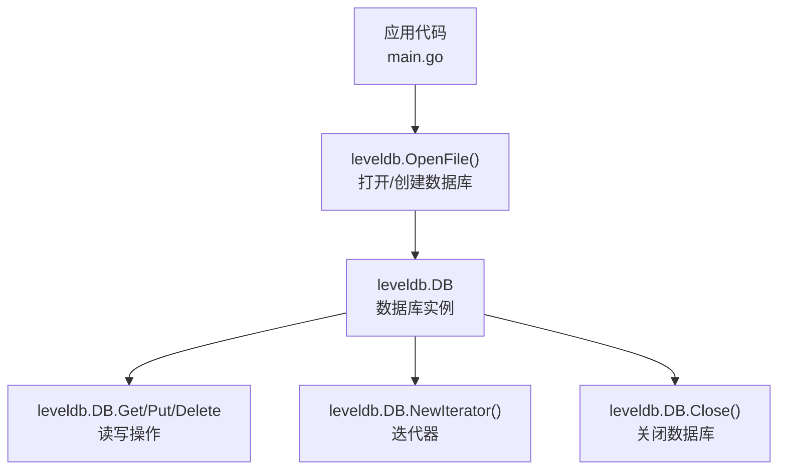
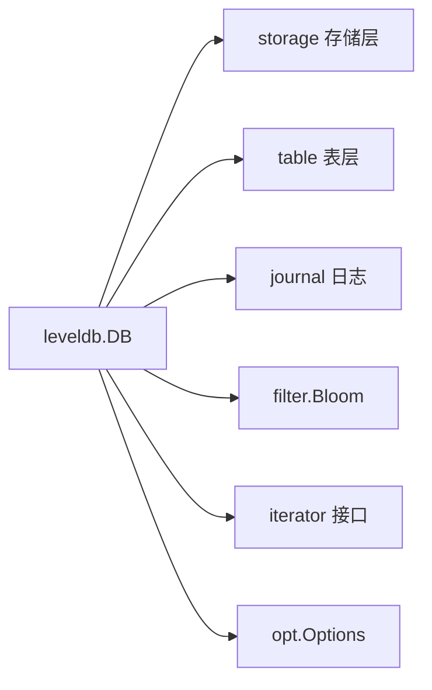

# 快速入门

<cite>
**本文引用的文件列表**
- [README.md](file://README.md)
- [db.go](file://leveldb/db.go)
- [options.go](file://leveldb/options.go)
- [bloom.go](file://leveldb/filter/bloom.go)
- [iter.go](file://leveldb/iterator/iter.go)
- [batch.go](file://leveldb/batch.go)
- [errors.go](file://leveldb/errors.go)
- [key.go](file://leveldb/key.go)
</cite>

## 目录
1. [简介](#简介)
2. [项目结构与入口](#项目结构与入口)
3. [核心组件与职责](#核心组件与职责)
4. [架构总览](#架构总览)
5. [详细操作指南](#详细操作指南)
6. [依赖关系分析](#依赖关系分析)
7. [性能与配置建议](#性能与配置建议)
8. [常见问题排查](#常见问题排查)
9. [结语](#结语)

## 简介
本指南面向初学者，帮助你在本地环境快速安装并运行 avccDB（LevelDB Go 实现）。你将学会：
- 使用 go get 安装依赖
- 创建或打开数据库（OpenFile）
- 执行基本的 Put、Get、Delete 操作
- 使用迭代器遍历数据
- 正确处理错误与资源释放（defer db.Close()）
- 配置 Bloom 过滤器以优化读取性能

为保证可运行性，所有示例均来自仓库中已实现的 API，并通过“章节来源”定位到具体文件与行号。

## 项目结构与入口
avccDB 是一个完整的 LevelDB Go 实现，核心入口位于 leveldb 包。README 提供了安装与基础用法示例；数据库对象 DB 提供了 OpenFile、Get、Put、Delete、NewIterator、Close 等关键接口。



图表来源
- [README.md](file://README.md#L18-L36)
- [db.go](file://leveldb/db.go#L217-L243)

章节来源
- [README.md](file://README.md#L8-L14)
- [db.go](file://leveldb/db.go#L217-L243)

## 核心组件与职责
- 数据库实例 DB：负责打开/恢复数据库、事务、写入、读取、迭代、快照、统计等。
- 迭代器 Iterator：按键顺序遍历数据库内容，支持 Seek、Next、Release、Error。
- 批量写 Batch：将多个 Put/Delete 组合提交，提升吞吐。
- Bloom 过滤器：通过 opt.Options.Filter 配置，加速查找不存在的键。
- 错误常量：统一的错误类型，如 ErrNotFound、ErrClosed、ErrReadOnly 等。

章节来源
- [db.go](file://leveldb/db.go#L33-L98)
- [iter.go](file://leveldb/iterator/iter.go#L17-L96)
- [batch.go](file://leveldb/batch.go#L63-L156)
- [bloom.go](file://leveldb/filter/bloom.go#L106-L117)
- [errors.go](file://leveldb/errors.go#L13-L21)

## 架构总览
下面的时序图展示了从打开数据库到执行一次读写再到关闭的完整流程。

```mermaid
sequenceDiagram
    participant App as "应用"
    participant DB as "leveldb.DB"
    participant Opt as "opt_Options"
    participant Bloom as "filter.Bloom"
    participant Iter as "iterator.Iterator"
    App->>Opt: "创建选项(可选 : 设置 Filter)"
    Opt->>Bloom: "NewBloomFilter(bitsPerKey)"
    App->>DB: "OpenFile(path, options)"
    DB-->>App: "返回 DB 实例"
    App->>DB: "Put(key, value, nil)"
    DB-->>App: "返回 err"
    App->>DB: "Get(key, nil)"
    DB-->>App: "返回 value 或 ErrNotFound"
    App->>DB: "NewIterator(nil, nil)"
    DB-->>App: "返回 Iter"
    App->>Iter: "循环 Next()"
    Iter-->>App: "Key()/Value()"
    App->>Iter: "Release()"
    App->>DB: "Close()"
```

图表来源
- [README.md](file://README.md#L18-L36)
- [README.md](file://README.md#L94-L103)
- [db.go](file://leveldb/db.go#L217-L243)
- [bloom.go](file://leveldb/filter/bloom.go#L106-L117)
- [iter.go](file://leveldb/iterator/iter.go#L17-L96)

## 详细操作指南

### 1. 安装依赖
- 使用 go get 安装依赖包。
- 确保 Go 版本满足要求（至少 go1.14）。

章节来源
- [README.md](file://README.md#L8-L14)

### 2. 打开或创建数据库
- 使用 OpenFile 打开或创建数据库目录。
- 成功后必须在退出前调用 Close 释放资源。

章节来源
- [README.md](file://README.md#L18-L26)
- [db.go](file://leveldb/db.go#L217-L243)
- [db.go](file://leveldb/db.go#L1573-L1643)

### 3. 基本读写操作
- Put：向数据库写入键值对。
- Get：根据键读取值；若不存在返回 ErrNotFound。
- Delete：删除指定键。

章节来源
- [README.md](file://README.md#L27-L36)
- [db.go](file://leveldb/db.go#L1092-L1107)
- [db.go](file://leveldb/db.go#L1186-L1198)

### 4. 使用迭代器遍历数据
- NewIterator 返回最新快照的迭代器。
- 支持 Seek、Next、Release、Error。
- 可通过 util.Range 对子集进行遍历，或使用 util.BytesPrefix 前缀匹配。

章节来源
- [README.md](file://README.md#L38-L83)
- [db.go](file://leveldb/db.go#L1200-L1230)
- [iter.go](file://leveldb/iterator/iter.go#L17-L96)

### 5. 批量写入
- 使用 Batch 聚合多次 Put/Delete，最后一次性写入，减少写放大。

章节来源
- [README.md](file://README.md#L85-L93)
- [batch.go](file://leveldb/batch.go#L63-L156)

### 6. 配置 Bloom 过滤器优化读取
- 在 opt.Options 中设置 Filter 为 NewBloomFilter(bitsPerKey)。
- 通过 OpenFile 传入该选项打开数据库。

章节来源
- [README.md](file://README.md#L94-L103)
- [options.go](file://leveldb/options.go#L25-L44)
- [bloom.go](file://leveldb/filter/bloom.go#L106-L117)

### 7. 错误处理与资源释放
- 关闭数据库前应释放所有迭代器与快照。
- Close 会等待后台任务结束并清理资源。
- 常见错误包括 ErrNotFound、ErrClosed、ErrReadOnly 等。

章节来源
- [README.md](file://README.md#L27-L36)
- [db.go](file://leveldb/db.go#L1573-L1643)
- [errors.go](file://leveldb/errors.go#L13-L21)

## 依赖关系分析
- DB 依赖存储层、表层、日志、比较器、过滤器、迭代器等模块。
- Bloom 过滤器通过 opt.Options 注入，DB 在内部封装为 iFilter 以适配系统。
- 迭代器在 DB 层创建时获取快照，保证遍历期间数据一致性。



图表来源
- [db.go](file://leveldb/db.go#L9-L31)
- [options.go](file://leveldb/options.go#L25-L44)
- [bloom.go](file://leveldb/filter/bloom.go#L106-L117)
- [iter.go](file://leveldb/iterator/iter.go#L17-L96)

## 性能与配置建议
- 启用 Bloom 过滤器可显著降低读取不存在键时的磁盘访问次数（参考 README 的使用示例）。
- 使用批量写入（Batch）合并多次写操作，减少写放大。
- 迭代器遍历时注意及时 Release，避免持有过多快照导致内存占用上升。
- 若需要版本化读取或溯源查询，可结合内部键版本机制与 GetVersionHistory 使用（详见源码注释与接口定义）。

章节来源
- [README.md](file://README.md#L94-L103)
- [batch.go](file://leveldb/batch.go#L63-L156)
- [db.go](file://leveldb/db.go#L1155-L1184)
- [key.go](file://leveldb/key.go#L90-L104)

## 常见问题排查
- 打开数据库报错：检查路径是否存在、权限是否足够、是否与其他进程占用。
- 读取返回 ErrNotFound：确认键是否存在，或检查 Bloom 过滤器参数是否过低导致误判。
- 迭代器未释放：确保每次遍历结束后调用 Release，避免资源泄漏。
- 数据库无法关闭：确保所有迭代器与快照均已释放后再调用 Close。

章节来源
- [errors.go](file://leveldb/errors.go#L13-L21)
- [iter.go](file://leveldb/iterator/iter.go#L17-L96)
- [db.go](file://leveldb/db.go#L1573-L1643)

## 结语
通过本指南，你可以在 5 分钟内完成第一个 avccDB 示例程序：安装依赖、打开数据库、执行 Put/Get/Delete、遍历数据并正确释放资源，同时启用 Bloom 过滤器优化读取性能。若需进一步了解高级特性（如快照、版本历史、统计信息等），请参考 README 中的文档链接与源码注释。