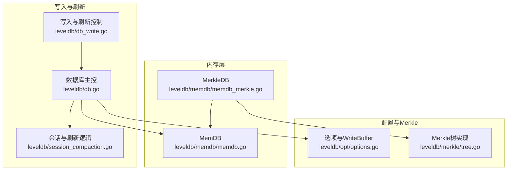
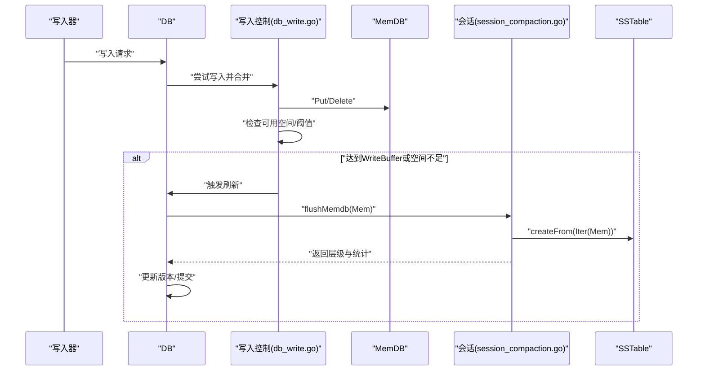
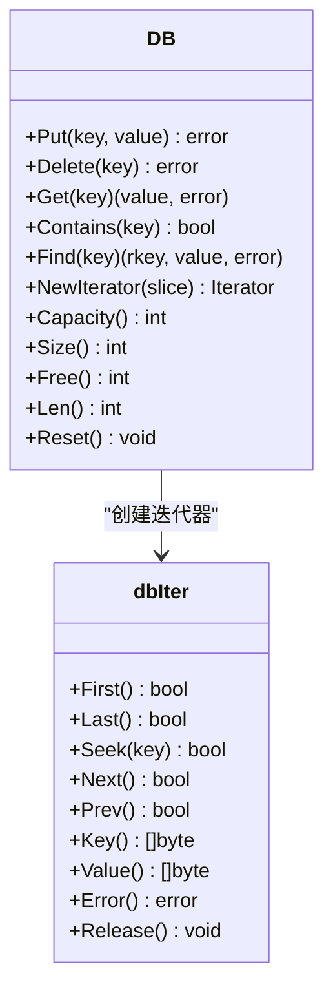
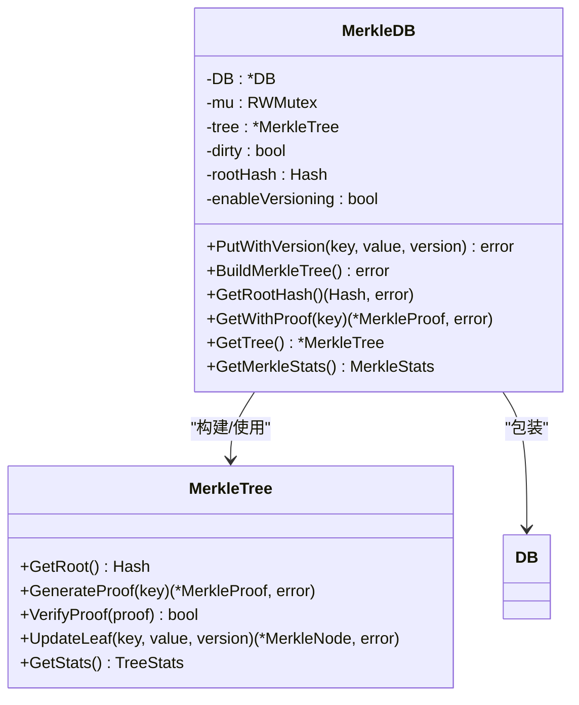
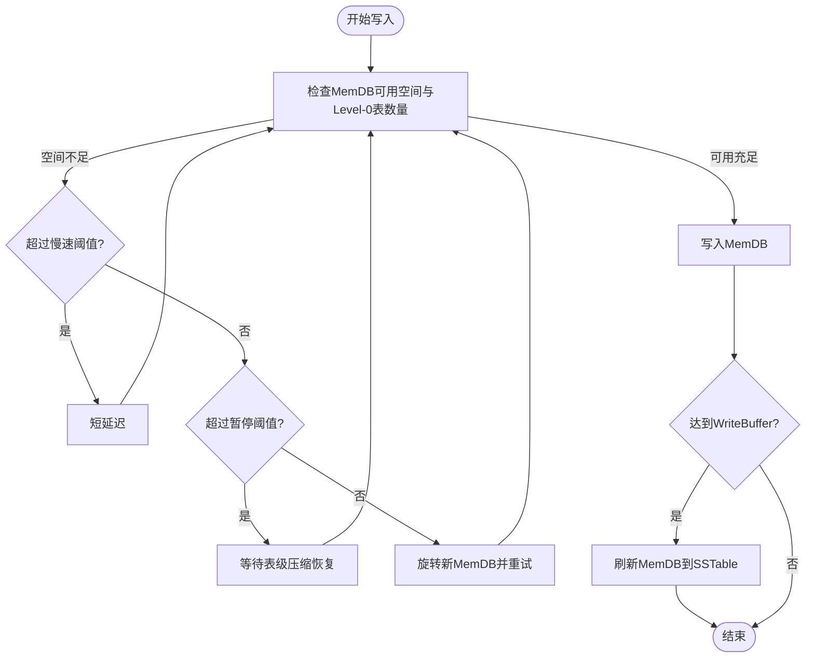
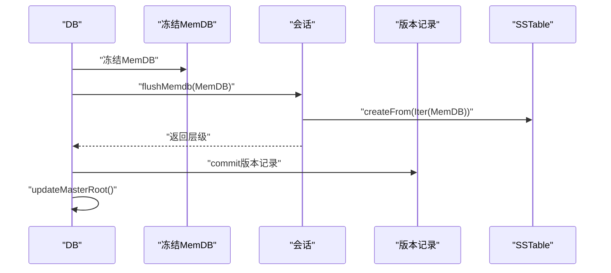
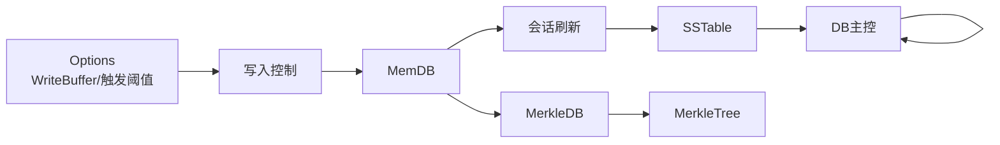

# 内存管理

<cite>
**本文引用的文件**
- [memdb.go](file://leveldb/memdb/memdb.go)
- [memdb_merkle.go](file://leveldb/memdb/memdb_merkle.go)
- [db.go](file://leveldb/db.go)
- [db_write.go](file://leveldb/db_write.go)
- [session_compaction.go](file://leveldb/session_compaction.go)
- [options.go](file://leveldb/opt/options.go)
- [tree.go](file://leveldb/merkle/tree.go)
</cite>

## 目录
1. [简介](#简介)
2. [项目结构](#项目结构)
3. [核心组件](#核心组件)
4. [架构总览](#架构总览)
5. [详细组件分析](#详细组件分析)
6. [依赖关系分析](#依赖关系分析)
7. [性能考量](#性能考量)
8. [故障排查指南](#故障排查指南)
9. [结论](#结论)

## 简介
本文件聚焦于 avccDB 的内存管理，系统性阐述内存数据库（MemDB）的实现机制，包括：
- MemDB 作为写入缓冲区的工作方式与生命周期
- 基于跳表的数据结构设计与并发访问模型
- 在 mLSM 架构中与 Merkle 树的集成，用于维护数据完整性与可验证性
- 容量控制与 WriteBuffer 选项的关系
- 刷新到 SSTable 前的数据管理策略
- 性能影响分析与调优建议（结合工作负载）

## 项目结构
围绕内存管理的关键模块与文件如下：
- 内存数据库实现：leveldb/memdb/memdb.go
- MemDB 与 Merkle 集成：leveldb/memdb/memdb_merkle.go
- 数据库主流程与写入路径：leveldb/db.go、leveldb/db_write.go
- 刷新到 SSTable 的会话逻辑：leveldb/session_compaction.go
- 全局配置与 WriteBuffer 选项：leveldb/opt/options.go
- Merkle 树实现与证明生成：leveldb/merkle/tree.go

图表来源
- [memdb.go](file://leveldb/memdb/memdb.go#L1-L120)
- [memdb_merkle.go](file://leveldb/memdb/memdb_merkle.go#L1-L120)
- [db_write.go](file://leveldb/db_write.go#L1-L120)
- [db.go](file://leveldb/db.go#L1-L120)
- [session_compaction.go](file://leveldb/session_compaction.go#L30-L52)
- [options.go](file://leveldb/opt/options.go#L392-L420)
- [tree.go](file://leveldb/merkle/tree.go#L1-L80)

章节来源
- [memdb.go](file://leveldb/memdb/memdb.go#L1-L120)
- [memdb_merkle.go](file://leveldb/memdb/memdb_merkle.go#L1-L120)
- [db_write.go](file://leveldb/db_write.go#L1-L120)
- [db.go](file://leveldb/db.go#L1-L120)
- [session_compaction.go](file://leveldb/session_compaction.go#L30-L52)
- [options.go](file://leveldb/opt/options.go#L392-L420)
- [tree.go](file://leveldb/merkle/tree.go#L1-L80)

## 核心组件
- MemDB：基于跳表的内存键值存储，支持并发读写，作为写入缓冲区。
- MerkleDB：在 MemDB 基础上扩展 Merkle 树能力，支持根哈希计算与证明生成。
- 写入与刷新控制：负责写入合并、容量检查、触发刷新与冻结 MemDB。
- 会话与刷新：将 MemDB 中的数据转换为 SSTable，并记录到版本历史。
- 配置与选项：WriteBuffer 控制 MemDB 的容量阈值，影响刷新时机。

章节来源
- [memdb.go](file://leveldb/memdb/memdb.go#L180-L220)
- [memdb_merkle.go](file://leveldb/memdb/memdb_merkle.go#L1-L60)
- [db_write.go](file://leveldb/db_write.go#L66-L120)
- [session_compaction.go](file://leveldb/session_compaction.go#L30-L52)
- [options.go](file://leveldb/opt/options.go#L392-L420)

## 架构总览
MemDB 在写入路径中的角色：
- 写入阶段：新写入的数据先写入 MemDB；当 MemDB 达到 WriteBuffer 阈值或需要腾挪空间时，触发刷新。
- 刷新阶段：会话层将 MemDB 的内容迭代生成 SSTable，并选择合适的层级写入，随后更新版本历史。
- mLSM 与 Merkle：刷新完成后，数据库重新计算 MasterRoot（由各层 SST 根聚合而成），并在需要时通过 MerkleDB 提供根哈希与证明。

图表来源
- [db_write.go](file://leveldb/db_write.go#L66-L120)
- [session_compaction.go](file://leveldb/session_compaction.go#L30-L52)
- [db.go](file://leveldb/db.go#L270-L340)

## 详细组件分析

### MemDB：跳表实现与并发模型
- 数据结构
  - 跳表节点数组：每个节点包含键值偏移、键长、值长、高度及多层 next 指针。
  - 键值数据区：连续字节缓冲，按追加方式存储键值，删除仅标记失效而不回收。
  - 并发控制：读写锁保护节点与数据区，迭代器持有只读锁。
- 关键操作
  - 查找/插入/删除：通过 findGE/findLT 等辅助方法定位节点，按高度随机生成策略维护跳表。
  - 迭代：dbIter 实现向前/向后遍历，支持切片范围。
  - 统计：Capacity/Size/Free/Len 提供容量、占用、剩余与条目数。
  - 重置：Reset 可复用缓冲，便于频繁刷新场景。
- 并发与安全
  - Put/Delete/Get/Contains/Find 等均在内部加锁；NewIterator 返回的迭代器非线程安全，但允许多个迭代器并发使用。
  - 迭代器释放后不可再使用，错误返回统一 ErrIterReleased。

图表来源
- [memdb.go](file://leveldb/memdb/memdb.go#L180-L480)

章节来源
- [memdb.go](file://leveldb/memdb/memdb.go#L180-L480)

### MemDB 与 Merkle 集成：MerkleDB
- 设计要点
  - 包装底层 DB，新增 Merkle 树缓存、脏标记与根哈希缓存。
  - PutWithVersion 支持带版本号写入；内部仍通过底层 DB Put 存储。
  - BuildMerkleTree 基于当前状态迭代构建 Merkle 树；GetRootHash 获取缓存或重建后的根。
  - GetWithProof 生成存在/不存在证明；GetTree/GetMerkleStats 用于调试与监控。
- 版本化与内部键
  - 注释指出内部键编码包含版本信息，实际解析在批处理层完成；MerkleDB 层暂简化提取逻辑。

图表来源
- [memdb_merkle.go](file://leveldb/memdb/memdb_merkle.go#L1-L181)
- [tree.go](file://leveldb/merkle/tree.go#L1-L120)

章节来源
- [memdb_merkle.go](file://leveldb/memdb/memdb_merkle.go#L1-L181)
- [tree.go](file://leveldb/merkle/tree.go#L1-L120)

### 写入与刷新控制：容量与阈值
- 写入合并与空间检查
  - flush 方法根据 WriteL0SlowdownTrigger/WriteL0PauseTrigger 与 MemDB 可用空间决定是否延迟、暂停或旋转新的 MemDB。
  - 当 MemDB 可用空间不足且 Level-0 表数量超过阈值时，写入被暂停，等待表级压缩恢复。
- WriteBuffer 与 MemDB 初始化
  - mpoolGet 会在池中取可用 MemDB 或按 max(WriteBuffer, 所需最小容量) 创建新实例，确保写入有足够的缓冲空间。
- 写入合并
  - writeLocked 支持批量合并，受合并上限与可用空间限制，避免一次性写入过大导致内存压力。

图表来源
- [db_write.go](file://leveldb/db_write.go#L66-L120)
- [db_write.go](file://leveldb/db_write.go#L155-L200)
- [options.go](file://leveldb/opt/options.go#L392-L420)

章节来源
- [db_write.go](file://leveldb/db_write.go#L66-L120)
- [db_write.go](file://leveldb/db_write.go#L155-L200)
- [options.go](file://leveldb/opt/options.go#L392-L420)

### 刷新到 SSTable：从 MemDB 到磁盘
- 会话层刷新
  - flushMemdb 将 MemDB 的内容通过迭代器生成 SSTable，选择合适层级并记录到版本记录。
- 数据库主控
  - memCompaction 在冻结 MemDB 后执行事务式刷新，生成表并提交版本，随后更新 MasterRoot。
- MasterRoot 更新
  - computeMasterRoot 从各层 SST 根构建层根，再聚合为 MasterRoot；updateMasterRoot 在刷新/压缩后更新全局根。

图表来源
- [db.go](file://leveldb/db.go#L269-L354)
- [session_compaction.go](file://leveldb/session_compaction.go#L30-L52)
- [db.go](file://leveldb/db.go#L1500-L1571)

章节来源
- [session_compaction.go](file://leveldb/session_compaction.go#L30-L52)
- [db.go](file://leveldb/db.go#L269-L354)
- [db.go](file://leveldb/db.go#L1500-L1571)

## 依赖关系分析
- MemDB 与 Merkle 集成
  - MerkleDB 依赖 MemDB 的 Put/迭代能力；Merkle 树依赖比较函数与 KV 对集合。
- 写入路径依赖
  - 写入控制依赖选项中的 WriteBuffer/WriteL0 触发阈值；MemDB 的 Capacity/Free 用于空间判断。
- 刷新链路
  - 会话层负责将 MemDB 转换为 SSTable；数据库主控负责版本提交与 MasterRoot 更新。

图表来源
- [options.go](file://leveldb/opt/options.go#L392-L420)
- [db_write.go](file://leveldb/db_write.go#L66-L120)
- [memdb.go](file://leveldb/memdb/memdb.go#L180-L260)
- [memdb_merkle.go](file://leveldb/memdb/memdb_merkle.go#L1-L120)
- [tree.go](file://leveldb/merkle/tree.go#L1-L80)
- [session_compaction.go](file://leveldb/session_compaction.go#L30-L52)
- [db.go](file://leveldb/db.go#L269-L354)

章节来源
- [options.go](file://leveldb/opt/options.go#L392-L420)
- [db_write.go](file://leveldb/db_write.go#L66-L120)
- [memdb.go](file://leveldb/memdb/memdb.go#L180-L260)
- [memdb_merkle.go](file://leveldb/memdb/memdb_merkle.go#L1-L120)
- [tree.go](file://leveldb/merkle/tree.go#L1-L80)
- [session_compaction.go](file://leveldb/session_compaction.go#L30-L52)
- [db.go](file://leveldb/db.go#L269-L354)

## 性能考量
- 写入吞吐与延迟
  - 当 Level-0 表过多时，写入会被慢速或暂停，避免堆积引发更严重的压缩压力。
  - 写入合并可减少小批次写入开销，但需考虑合并上限与可用空间。
- MemDB 内存占用
  - Capacity/Size/Free 提供容量与占用信息；Reset 可复用缓冲，降低频繁分配成本。
  - WriteBuffer 决定刷新阈值，过小会导致频繁刷新与碎片化；过大则增加内存占用与崩溃风险。
- Merkle 树构建成本
  - MerkleDB 的 BuildMerkleTree 需要遍历 MemDB，适合在刷新后或批量变更后进行；GetRootHash 采用缓存与惰性重建策略。
- mLSM 与 MasterRoot
  - MasterRoot 由各层 SST 根聚合而成，刷新/压缩后更新；频繁刷新会增加聚合计算次数，应结合业务需求权衡。

章节来源
- [db_write.go](file://leveldb/db_write.go#L66-L120)
- [memdb.go](file://leveldb/memdb/memdb.go#L411-L460)
- [memdb_merkle.go](file://leveldb/memdb/memdb_merkle.go#L58-L124)
- [db.go](file://leveldb/db.go#L1500-L1571)

## 故障排查指南
- 迭代器错误
  - 若迭代器已释放，后续操作会返回 ErrIterReleased；请确保迭代器在使用期间未被释放。
- 写入阻塞与延迟
  - 若写入出现延迟或暂停，检查 Level-0 表数量与 WriteL0SlowdownTrigger/WriteL0PauseTrigger 设置；必要时增大 WriteBuffer 或优化写入模式。
- 刷新失败
  - 刷新过程中若遇到错误，会回滚临时文件；检查磁盘空间与权限，确认会话提交与版本记录正常。
- Merkle 树问题
  - 若 GetRootHash 报错或为空，确认 MemDB 是否有数据；必要时显式调用 BuildMerkleTree 或在刷新后自动重建。

章节来源
- [memdb.go](file://leveldb/memdb/memdb.go#L20-L40)
- [db_write.go](file://leveldb/db_write.go#L66-L120)
- [session_compaction.go](file://leveldb/session_compaction.go#L30-L52)
- [memdb_merkle.go](file://leveldb/memdb/memdb_merkle.go#L108-L147)

## 结论
- MemDB 通过跳表提供高效的有序键值存储，作为写入缓冲区在写入路径中扮演关键角色。
- 与 Merkle 的集成使得数据完整性可验证，适合需要可追溯性的应用场景。
- WriteBuffer 与写入控制策略共同决定了刷新频率与内存占用，应结合工作负载进行调优。
- 在 mLSM 架构下，刷新到 SSTable 后及时更新 MasterRoot，保证全局一致性与可验证性。