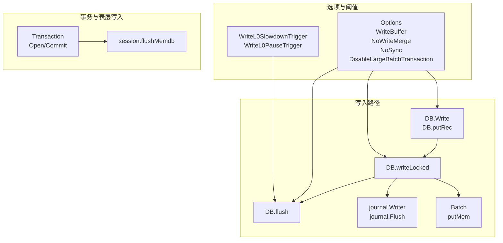
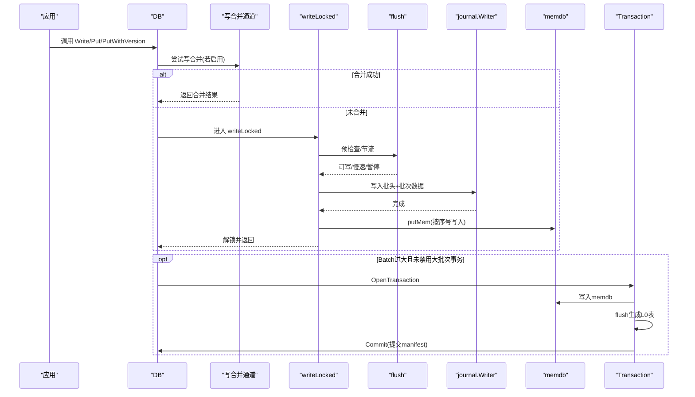
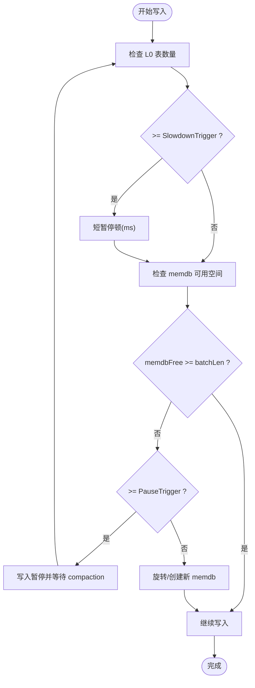
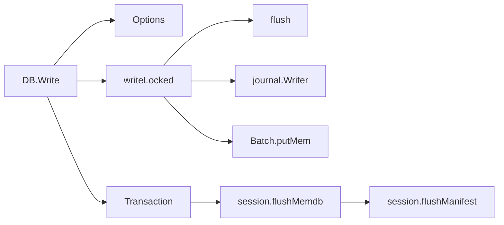

# 写入优化

<cite>
**本文引用的文件**
- [db_write.go](file://leveldb/db_write.go)
- [batch.go](file://leveldb/batch.go)
- [options.go](file://leveldb/opt/options.go)
- [db.go](file://leveldb/db.go)
- [session_compaction.go](file://leveldb/session_compaction.go)
- [db_transaction.go](file://leveldb/db_transaction.go)
- [journal.go](file://leveldb/journal/journal.go)
- [session_util.go](file://leveldb/session_util.go)
</cite>

## 目录
1. [引言](#引言)
2. [项目结构](#项目结构)
3. [核心组件](#核心组件)
4. [架构总览](#架构总览)
5. [详细组件分析](#详细组件分析)
6. [依赖关系分析](#依赖关系分析)
7. [性能考量](#性能考量)
8. [故障排查指南](#故障排查指南)
9. [结论](#结论)

## 引言
本指南聚焦于 avccDB 的写入路径与优化策略，围绕以下主题系统展开：
- 批量写入（Batch）的原子性与性能优势
- WriteBuffer 参数对内存使用与刷新频率的影响
- WriteOptions 中 Sync 选项的权衡
- NoWriteMerge 对写入吞吐量的影响
- 通过 CompactionL0Trigger、WriteL0SlowdownTrigger 等参数优化写入路径，避免写入停顿

目标是帮助读者在理解实现细节的基础上，安全、高效地配置与调优写入路径。

## 项目结构
与写入优化直接相关的模块包括：
- 写入主流程：DB.Write、DB.putRec、DB.writeLocked、DB.flush
- 批处理：Batch 结构与序列化、合并与追加
- 选项与阈值：WriteBuffer、WriteL0SlowdownTrigger、WriteL0PauseTrigger、NoWriteMerge、NoSync、DisableLargeBatchTransaction
- 日志与事务：journal 写入、事务提交绕过日志直写表层
- 合并与触发：compaction 触发与限制

图表来源
- [db_write.go](file://leveldb/db_write.go#L66-L131)
- [batch.go](file://leveldb/batch.go#L244-L257)
- [options.go](file://leveldb/opt/options.go#L392-L411)
- [db_transaction.go](file://leveldb/db_transaction.go#L91-L115)
- [journal.go](file://leveldb/journal/journal.go#L436-L447)
- [session_util.go](file://leveldb/session_util.go#L468-L490)

章节来源
- [db_write.go](file://leveldb/db_write.go#L66-L131)
- [options.go](file://leveldb/opt/options.go#L392-L411)

## 核心组件
- 写入主流程
  - DB.Write：入口，支持批量写入；当 Batch 过大时可切换到事务模式以跳过日志直写表层。
  - DB.putRec / DB.Put / DB.PutWithVersion：单条写入封装为 Batch 并进入写入主流程。
  - DB.writeLocked：核心写入执行体，负责合并、写 journal、写 memdb、序列号推进、必要时旋转 memdb。
  - DB.flush：写入前的刷写/节流控制，依据 L0 表数量触发慢速或暂停。
- 批处理
  - Batch：记录集合，支持内部长度统计、版本化写入、合并追加、写入 memdb。
- 选项与阈值
  - WriteBuffer：memdb 大小上限，决定何时刷写。
  - WriteL0SlowdownTrigger / WriteL0PauseTrigger：L0 表数量阈值，分别触发写入慢速与暂停。
  - NoWriteMerge / NoSync：禁用写合并与禁用同步。
  - DisableLargeBatchTransaction：禁用“大批次自动转事务”逻辑。
- 事务
  - Transaction：将多条写入聚合到 memdb，提交时直接生成 L0 表，绕过 journal。

章节来源
- [db_write.go](file://leveldb/db_write.go#L274-L329)
- [db_write.go](file://leveldb/db_write.go#L154-L265)
- [batch.go](file://leveldb/batch.go#L63-L136)
- [options.go](file://leveldb/opt/options.go#L392-L411)
- [db_transaction.go](file://leveldb/db_transaction.go#L91-L115)

## 架构总览
写入从应用层调用 DB.Write 或 Put/PutWithVersion 开始，经过合并、写 journal、写 memdb、必要时旋转 memdb，并由 flush 控制写入节奏。当 Batch 过大时，可切换到事务模式，直接生成 L0 表，绕过 journal，减少一次 IO 路径。

图表来源
- [db_write.go](file://leveldb/db_write.go#L274-L329)
- [db_write.go](file://leveldb/db_write.go#L154-L265)
- [journal.go](file://leveldb/journal/journal.go#L436-L447)
- [batch.go](file://leveldb/batch.go#L244-L257)
- [db_transaction.go](file://leveldb/db_transaction.go#L91-L115)

## 详细组件分析

### 批量写入（Batch）的原子性与性能
- 原子性
  - 单个 Batch 在 writeLocked 中一次性写入 journal 与 memdb，随后统一推进序列号，形成一个不可分割的写入单元。
  - 若启用写合并，多个小写入会被合并为一个批次，减少多次 journal 与 memdb 操作，同时保持原子性。
- 性能优势
  - 减少系统调用与磁盘 IO 次数：合并写入减少 journal 刷新次数。
  - 降低 memdb 写入开销：一次 putMem 迭代写入多条记录。
  - 降低序列号推进成本：统一推进一次序列号。
- 版本化写入
  - Batch 支持带版本号的写入，internalLen 计算包含版本字段，便于后续读取最新版本或指定版本。

章节来源
- [db_write.go](file://leveldb/db_write.go#L154-L265)
- [batch.go](file://leveldb/batch.go#L63-L136)
- [batch.go](file://leveldb/batch.go#L244-L257)

### WriteBuffer 对内存使用与刷新频率的影响
- WriteBuffer 是 memdb 的大小上限，决定何时触发 flush。
- 当 Batch 的 internalLen 接近或超过 WriteBuffer 时，DB.Write 会自动切换到事务模式，直接生成 L0 表，绕过 journal，从而减少一次 IO 路径。
- 较大的 WriteBuffer 可降低 flush 频率，但会增加内存占用；较小则更频繁刷写，降低内存峰值但增加 IO 次数。

章节来源
- [db_write.go](file://leveldb/db_write.go#L274-L329)
- [options.go](file://leveldb/opt/options.go#L392-L400)

### WriteOptions 中 Sync 选项的权衡
- Sync=true：每次写入都会触发底层存储同步（如 fsync），确保崩溃后数据不丢失，但显著降低写入吞吐。
- Sync=false：默认行为，写入仅进入 OS 缓冲区，更快但存在进程崩溃时少量最近写入丢失的风险。
- NoSync=true：完全禁用同步，进一步提升吞吐，适合对持久性要求较低的场景。

章节来源
- [options.go](file://leveldb/opt/options.go#L362-L366)
- [options.go](file://leveldb/opt/options.go#L723-L744)
- [db_write.go](file://leveldb/db_write.go#L17-L32)

### NoWriteMerge 对写入吞吐量的影响
- NoWriteMerge=true：禁用写合并，每个写入都独立获取写锁并执行完整写入流程，减少合并带来的并发调度收益，但避免了合并队列中的等待。
- 默认情况下，DB 会尝试合并多个小写入，提高吞吐；但在高并发下可能因合并队列竞争导致延迟抖动。
- 对于大量小写入且对延迟敏感的场景，可考虑关闭合并以获得更稳定的尾延迟。

章节来源
- [options.go](file://leveldb/opt/options.go#L367-L371)
- [db_write.go](file://leveldb/db_write.go#L294-L329)

### 通过参数优化写入路径：CompactionL0Trigger、WriteL0SlowdownTrigger、WriteL0PauseTrigger
- WriteL0SlowdownTrigger：当 L0 表数量达到该阈值时，写入会进行短时间休眠，以缓解 compaction 压力，避免写放大加剧。
- WriteL0PauseTrigger：当 L0 表数量达到该阈值时，写入会被阻塞，直到后台 compaction 完成，防止 L0 表无限堆积。
- CompactionL0Trigger：用于触发 L0 到 L1 的 compaction，通常与 WriteL0SlowdownTrigger/WriteL0PauseTrigger配合，避免 L0 过度膨胀。

图表来源
- [db_write.go](file://leveldb/db_write.go#L66-L131)

章节来源
- [db_write.go](file://leveldb/db_write.go#L66-L131)
- [options.go](file://leveldb/opt/options.go#L401-L411)

### 事务模式与大批次写入
- 当 Batch 的 internalLen 超过 WriteBuffer 且未禁用“大批次自动转事务”，DB.Write 会打开事务，将 Batch 写入 memdb 并直接生成 L0 表，最后提交 manifest。
- 优点：绕过 journal，减少一次 IO 路径，适合大批量写入。
- 注意：事务模式会占用更多内存，且可能给 compaction 带来压力，应结合业务规模合理使用。

章节来源
- [db_write.go](file://leveldb/db_write.go#L274-L329)
- [db_transaction.go](file://leveldb/db_transaction.go#L91-L115)
- [options.go](file://leveldb/opt/options.go#L310-L315)

## 依赖关系分析
- 写入主流程依赖：
  - DB.flush 依赖 Options 中的 WriteL0SlowdownTrigger/WriteL0PauseTrigger 与 L0 表计数。
  - DB.writeLocked 依赖 Batch 的 putMem、journal.Writer 的 Flush/Sync。
  - DB.Write 依赖 Options 中的 WriteBuffer、NoWriteMerge、NoSync、DisableLargeBatchTransaction。
- 事务模式依赖：
  - Transaction.flush 使用 session.flushMemdb 将 memdb 转换为 L0 表。
  - Commit 时通过 session.flushManifest/Sync 控制 manifest 的持久化。

图表来源
- [db_write.go](file://leveldb/db_write.go#L274-L329)
- [db_write.go](file://leveldb/db_write.go#L154-L265)
- [batch.go](file://leveldb/batch.go#L244-L257)
- [options.go](file://leveldb/opt/options.go#L392-L411)
- [db_transaction.go](file://leveldb/db_transaction.go#L91-L115)
- [session_util.go](file://leveldb/session_util.go#L468-L490)

章节来源
- [db_write.go](file://leveldb/db_write.go#L274-L329)
- [db_transaction.go](file://leveldb/db_transaction.go#L91-L115)

## 性能考量
- 合理设置 WriteBuffer
  - 增大可降低 flush 频率，但需评估内存峰值；减小可降低内存占用，但增加 IO。
- 启用写合并
  - 在小批量写入场景下可显著提升吞吐；若出现延迟抖动，可考虑关闭 NoWriteMerge。
- Sync 与 NoSync
  - 生产环境建议默认 Sync=false；对持久性要求极高的场景可启用 Sync，但要接受吞吐下降。
- L0 触发与节流
  - 适当提高 WriteL0SlowdownTrigger/WriteL0PauseTrigger 可延缓写入停顿，但会增加 L0 表数量；需要平衡写入延迟与 compaction 压力。
- 大批次写入
  - 对超大 Batch，优先使用事务模式以绕过 journal，减少一次 IO；同时注意内存占用与 compaction 峰值。

## 故障排查指南
- 写入变慢或频繁停顿
  - 检查 L0 表数量是否接近 WriteL0PauseTrigger；必要时增大阈值或优化写入节奏。
  - 关注 flush 循环中的延迟统计与写暂停标志位。
- 数据未落盘
  - 若使用 Sync=false，进程崩溃可能导致少量最近写入丢失；如需强持久性，请启用 Sync。
- 写合并导致延迟抖动
  - 临时关闭 NoWriteMerge，观察延迟分布变化；或调整合并窗口大小。
- 事务模式内存压力
  - 事务会将大量写入暂存于 memdb，注意监控内存使用；必要时拆分批次或降低事务大小。

章节来源
- [db_write.go](file://leveldb/db_write.go#L66-L131)
- [options.go](file://leveldb/opt/options.go#L362-L366)
- [options.go](file://leveldb/opt/options.go#L367-L371)

## 结论
通过对写入路径的深入分析可知，写入性能优化的关键在于：
- 合理配置 WriteBuffer，平衡内存占用与刷写频率；
- 在小批量写入场景启用写合并，在大批量写入场景采用事务模式；
- 通过 WriteL0SlowdownTrigger/WriteL0PauseTrigger 与 CompactionL0Trigger 控制 L0 表数量，避免写入停顿；
- 根据业务对持久性的需求选择 Sync/NoSync。

以上策略可在保证数据一致性的前提下，最大化写入吞吐并稳定延迟。