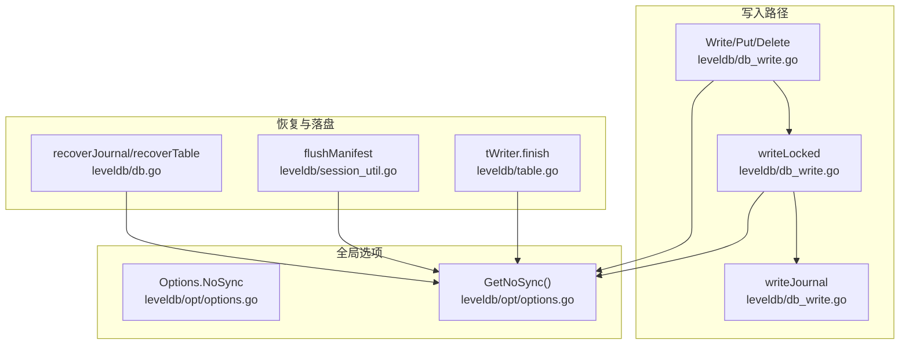
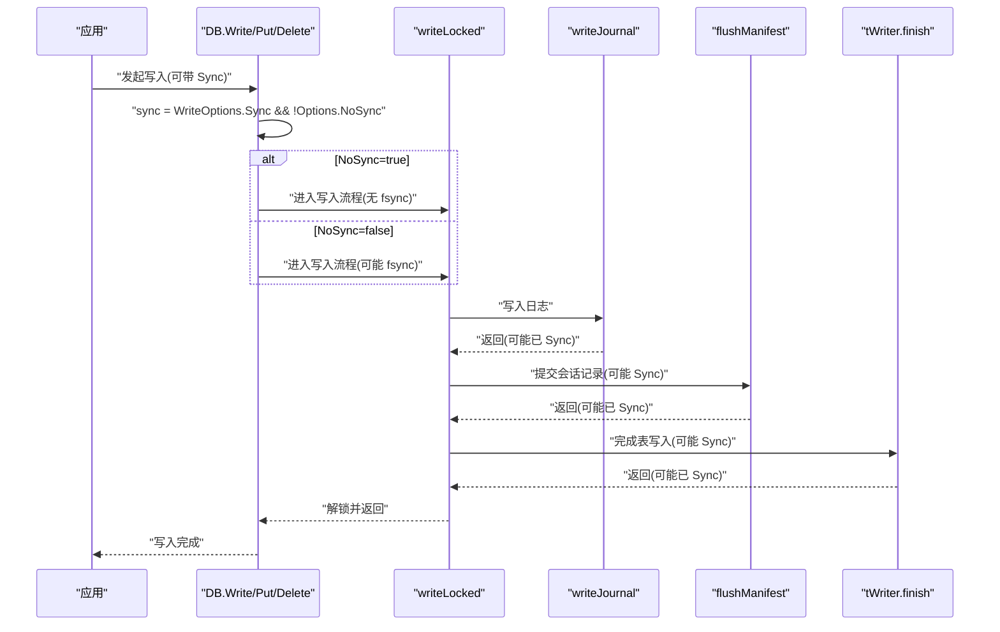
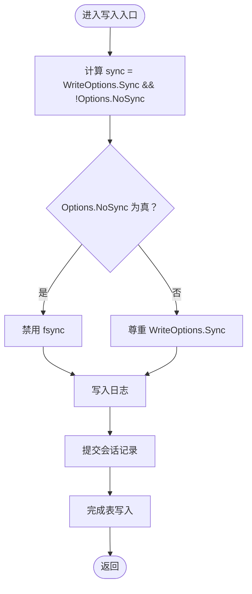
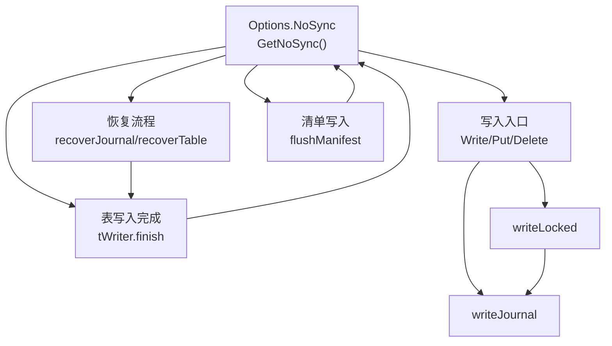

# NoSync全局控制

<cite>
**本文引用的文件**
- [db_write.go](file://leveldb/db_write.go)
- [options.go](file://leveldb/opt/options.go)
- [db.go](file://leveldb/db.go)
- [session_util.go](file://leveldb/session_util.go)
- [table.go](file://leveldb/table.go)
- [bench_test.go](file://leveldb/bench_test.go)
</cite>

## 目录
1. [简介](#简介)
2. [项目结构](#项目结构)
3. [核心组件](#核心组件)
4. [架构总览](#架构总览)
5. [详细组件分析](#详细组件分析)
6. [依赖关系分析](#依赖关系分析)
7. [性能考量](#性能考量)
8. [故障排查指南](#故障排查指南)
9. [结论](#结论)
10. [附录：配置与基准对比](#附录配置与基准对比)

## 简介
本指南围绕 avccDB 中的 Options.NoSync 全局配置展开，系统阐述其如何从源头禁用所有 fsync 操作，从而在写入路径上实现极致性能。通过对 writeLocked 方法中的 sync 计算逻辑进行剖析，说明 NoSync 如何覆盖单个写入请求的 Sync 设置；并结合恢复流程、表写入与清单（manifest）写入处的同步策略，给出 NoSync 的完整影响面。文档还提供在临时数据存储、缓存层等对持久性要求不高的场景下使用 NoSync 的建议，并警示在生产环境启用此选项可能带来的数据丢失风险。最后，给出配置要点与性能基准对比思路，帮助读者在安全与性能之间做出权衡。

## 项目结构
与 NoSync 直接相关的核心位置包括：
- 写入路径：leveldb/db_write.go 中的 writeLocked 及 Write/Put/Delete 等入口
- 全局选项：leveldb/opt/options.go 中的 Options.NoSync 字段及 GetNoSync 方法
- 恢复与落盘：leveldb/db.go 中的 recoverJournal 与 recoverTable 流程
- 清单与表写入：leveldb/session_util.go 与 leveldb/table.go 中的 Sync 调用点
- 基准测试：leveldb/bench_test.go 中包含 Sync 开关的基准用例

图表来源
- [db_write.go](file://leveldb/db_write.go#L295-L339)
- [options.go](file://leveldb/opt/options.go#L361-L366)
- [options.go](file://leveldb/opt/options.go#L621-L627)
- [db.go](file://leveldb/db.go#L312-L367)
- [session_util.go](file://leveldb/session_util.go#L458-L491)
- [table.go](file://leveldb/table.go#L558-L627)

章节来源
- [db_write.go](file://leveldb/db_write.go#L295-L339)
- [options.go](file://leveldb/opt/options.go#L361-L366)
- [options.go](file://leveldb/opt/options.go#L621-L627)
- [db.go](file://leveldb/db.go#L312-L367)
- [session_util.go](file://leveldb/session_util.go#L458-L491)
- [table.go](file://leveldb/table.go#L558-L627)

## 核心组件
- Options.NoSync：全局布尔开关，用于完全禁用 fsync 同步写入，降低磁盘同步开销，提升写入吞吐。
- WriteOptions.Sync：单次写入可选的同步标志，通常为 false；当 NoSync 为 true 时，无论 Sync 是否为 true，最终都不会触发 fsync。
- writeLocked：写入主流程，负责合并写入、写入日志、更新内存数据库、递增序列号、必要时旋转内存表等。
- writeJournal：将批量记录写入日志并按需执行同步。
- recoverJournal/recoverTable：数据库启动时的恢复流程，其中会根据 NoSync 决定是否对新生成的表与清单执行 Sync。
- flushManifest：将会话记录写入清单文件，同样受 NoSync 影响。
- tWriter.finish：表写入完成后，若未启用 NoSync，则对文件执行 Sync。

章节来源
- [options.go](file://leveldb/opt/options.go#L361-L366)
- [options.go](file://leveldb/opt/options.go#L621-L627)
- [db_write.go](file://leveldb/db_write.go#L155-L266)
- [db_write.go](file://leveldb/db_write.go#L18-L33)
- [db.go](file://leveldb/db.go#L312-L367)
- [session_util.go](file://leveldb/session_util.go#L458-L491)
- [table.go](file://leveldb/table.go#L558-L627)

## 架构总览
NoSync 的作用链路如下：
- 应用层调用 Write/Put/Delete，传入 WriteOptions.Sync（通常为 false）
- 写入入口计算 sync = WriteOptions.Sync && !Options.NoSync
- 若 NoSync 为 true，则 sync 恒为 false，后续 writeJournal、flushManifest、tWriter.finish 都不会执行 fsync
- 恢复阶段 recoverTable 也会根据 NoSync 决定是否对新生成的表执行 Sync

图表来源
- [db_write.go](file://leveldb/db_write.go#L295-L339)
- [db_write.go](file://leveldb/db_write.go#L18-L33)
- [session_util.go](file://leveldb/session_util.go#L458-L491)
- [table.go](file://leveldb/table.go#L558-L627)

## 详细组件分析

### NoSync 在写入路径中的生效机制
- 写入入口（Write/Put/Delete）均会计算 sync = WriteOptions.Sync && !Options.NoSync
- 当 Options.NoSync 为 true 时，sync 恒为 false，这意味着：
  - writeJournal 不会调用 journalWriter.Sync()
  - flushManifest 不会调用 manifestWriter.Sync()
  - tWriter.finish 不会调用 storage.Writer.Sync()

图表来源
- [db_write.go](file://leveldb/db_write.go#L295-L339)
- [db_write.go](file://leveldb/db_write.go#L18-L33)
- [session_util.go](file://leveldb/session_util.go#L458-L491)
- [table.go](file://leveldb/table.go#L558-L627)

章节来源
- [db_write.go](file://leveldb/db_write.go#L295-L339)
- [db_write.go](file://leveldb/db_write.go#L18-L33)
- [session_util.go](file://leveldb/session_util.go#L458-L491)
- [table.go](file://leveldb/table.go#L558-L627)

### 恢复流程中的 NoSync 行为
- recoverTable：在构建/重建表后，若 Options.NoSync 为真，则跳过 writer.Sync()
- recoverJournal：在恢复过程中，journal 的读取与回放不涉及 fsync；但 recoverTable 会在写入新表时依据 NoSync 决定是否 Sync

章节来源
- [db.go](file://leveldb/db.go#L312-L367)

### NoSync 对不同写入模式的影响
- 大批量写入（Write + Batch）：通过 writeLocked 合并写入，最终仍受 NoSync 控制
- 单条写入（Put/Delete）：通过 putRec/putRecWithVersion 进入 writeLocked，同样受 NoSync 控制
- 事务写入（OpenTransaction + Commit）：当批量超过 WriteBuffer 且未禁用大批次事务模式时，会切换到事务路径，但仍受 NoSync 控制

章节来源
- [db_write.go](file://leveldb/db_write.go#L268-L339)
- [db_write.go](file://leveldb/db_write.go#L332-L438)

### NoSync 与 WriteOptions.Sync 的优先级
- NoSync 是全局覆盖项，优先级高于单次写入的 Sync 设置
- 即使 WriteOptions.Sync 为 true，只要 Options.NoSync 为 true，也不会触发 fsync

章节来源
- [db_write.go](file://leveldb/db_write.go#L295-L339)
- [options.go](file://leveldb/opt/options.go#L621-L627)

## 依赖关系分析
- Options.NoSync 由 Options.GetNoSync 提供，被写入入口、写入主流程、恢复流程、清单与表写入处广泛使用
- 写入主流程依赖 journal Writer 与 storage Writer，NoSync 将决定这些 Writer 的 Sync 是否执行
- 恢复流程依赖 NoSync 来决定新生成表的 Sync 行为

图表来源
- [options.go](file://leveldb/opt/options.go#L361-L366)
- [options.go](file://leveldb/opt/options.go#L621-L627)
- [db_write.go](file://leveldb/db_write.go#L155-L266)
- [db_write.go](file://leveldb/db_write.go#L18-L33)
- [db.go](file://leveldb/db.go#L312-L367)
- [session_util.go](file://leveldb/session_util.go#L458-L491)
- [table.go](file://leveldb/table.go#L558-L627)

章节来源
- [options.go](file://leveldb/opt/options.go#L361-L366)
- [options.go](file://leveldb/opt/options.go#L621-L627)
- [db_write.go](file://leveldb/db_write.go#L155-L266)
- [db_write.go](file://leveldb/db_write.go#L18-L33)
- [db.go](file://leveldb/db.go#L312-L367)
- [session_util.go](file://leveldb/session_util.go#L458-L491)
- [table.go](file://leveldb/table.go#L558-L627)

## 性能考量
- NoSync 的核心收益在于消除 fsync 调用，显著降低写入延迟与系统调用开销，适合高吞吐写入场景
- 在 Linux ext4/xfs 等现代文件系统上，NoSync 可能带来更明显的性能提升；但在某些文件系统或挂载参数下，风险更高
- 由于 NoSync 禁用了 fsync，写入数据在断电或系统崩溃时可能丢失，因此不适合对持久性有强需求的生产环境

[本节为通用性能讨论，不直接分析具体文件]

## 故障排查指南
- 启动后数据异常或缺失：检查是否启用了 Options.NoSync，以及是否在断电/崩溃后重启
- 恢复阶段卡顿或失败：确认文件系统支持与挂载参数，避免在不支持的文件系统上长期禁用 fsync
- 写入延迟与吞吐：可通过基准测试对比开启/关闭 NoSync 的差异，观察写入延迟与吞吐变化

章节来源
- [db.go](file://leveldb/db.go#L312-L367)

## 结论
Options.NoSync 是一个强大的全局写入优化开关，它通过在多个关键落盘路径上统一禁用 fsync，显著降低写入延迟与系统调用开销。然而，这种优化是以牺牲数据持久性为代价的。在临时数据存储、缓存层、日志缓冲等对持久性要求不高的场景中，NoSync 可以带来可观的性能收益；但在生产环境中，应谨慎评估数据丢失风险，必要时采用其他持久化策略（如 WAL/RAID/UPS）或在关键业务环节手动触发同步。

[本节为总结性内容，不直接分析具体文件]

## 附录：配置与基准对比

### 配置要点
- 在 Options 中设置 NoSync 为 true，即可全局禁用 fsync
- 单次写入的 WriteOptions.Sync 会被 NoSync 覆盖，无需单独设置
- 恢复流程（recoverTable）也会遵循 NoSync 的决策，不再对新表执行 Sync

章节来源
- [options.go](file://leveldb/opt/options.go#L361-L366)
- [options.go](file://leveldb/opt/options.go#L621-L627)
- [db.go](file://leveldb/db.go#L312-L367)

### 基准对比思路
- 使用现有基准测试框架，分别在开启与关闭 NoSync 的情况下运行写入基准
- 参考现有基准用例，其中包含 Sync 开关的基准（例如写入随机键的基准），可作为对比参考
- 关注指标：每秒写入次数、平均写入延迟、99% 延迟、吞吐量等

章节来源
- [bench_test.go](file://leveldb/bench_test.go#L264-L306)
- [bench_test.go](file://leveldb/bench_test.go#L300-L306)