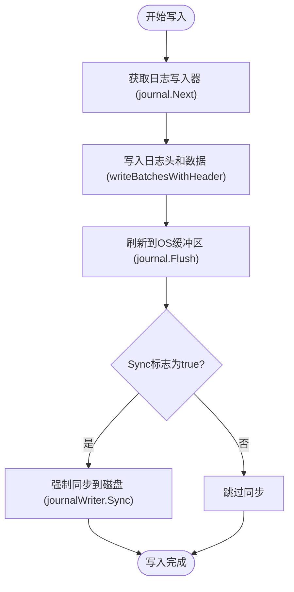

# Sync标志机制

<cite>
**本文档引用的文件**   
- [db_write.go](file://leveldb/db_write.go)
- [options.go](file://leveldb/opt/options.go)
- [journal.go](file://leveldb/journal/journal.go)
- [batch.go](file://leveldb/batch.go)
- [db.go](file://leveldb/db.go)
</cite>

## 目录
1. [引言](#引言)
2. [Sync标志的核心机制](#sync标志的核心机制)
3. [持久性保证与数据安全](#持久性保证与数据安全)
4. [性能开销分析](#性能开销分析)
5. [关键操作的代码示例](#关键操作的代码示例)
6. [与系统级NoSync选项的交互逻辑](#与系统级nosync选项的交互逻辑)
7. [结论](#结论)

## 引言

在avccDB数据库系统中，`WriteOptions.Sync`标志是控制单次写入操作持久性保证的核心配置。该标志决定了写入操作是否需要强制将数据从操作系统缓冲区刷新到物理磁盘，从而在系统崩溃时防止数据丢失。这对于金融交易、区块链等要求强一致性和数据安全性的关键应用场景至关重要。本文档将深入解析`Sync`标志的实现机制，详细阐述其在`db_write.go`中的`writeJournal`方法中的具体应用，并分析其带来的性能开销以及与系统整体`NoSync`选项的交互逻辑。

## Sync标志的核心机制

`WriteOptions.Sync`标志是`WriteOptions`结构体中的一个布尔字段，其核心作用是为单次写入操作提供细粒度的持久性控制。当该标志被设置为`true`时，系统会强制执行一次`fsync`操作，确保数据真正落盘。

该机制的实现主要依赖于`db_write.go`文件中的`writeJournal`方法。该方法负责将写入批次（batch）序列化并写入预写日志（WAL, Write-Ahead Log），这是确保数据持久性的关键步骤。其核心逻辑如下：

1.  **获取日志写入器**：通过`db.journal.Next()`获取一个`io.Writer`，用于向日志文件写入数据。
2.  **写入日志头和数据**：调用`writeBatchesWithHeader`函数，将批次数据和序列号写入日志。
3.  **刷新缓冲区**：调用`db.journal.Flush()`，将数据从应用层缓冲区刷新到操作系统的文件系统缓冲区。
4.  **强制同步到磁盘（关键步骤）**：如果`sync`参数为`true`，则调用`db.journalWriter.Sync()`。这一步是`Sync`标志生效的核心，它会触发底层操作系统的`fsync`系统调用，强制将操作系统缓冲区中的数据写入物理存储设备。



**图示来源**
- [db_write.go](file://leveldb/db_write.go#L18-L32)

**本节来源**
- [db_write.go](file://leveldb/db_write.go#L18-L32)
- [options.go](file://leveldb/opt/options.go#L723-L744)

## 持久性保证与数据安全

`Sync`标志直接关系到数据库在意外故障下的数据完整性。其提供的持久性保证可以分为两个层面：

*   **无Sync（Sync = false）**：写入操作仅保证数据到达操作系统的文件系统缓冲区。如果仅仅是进程崩溃，由于数据仍在内存中，重启后可以恢复。但如果发生机器断电或操作系统崩溃，缓冲区中尚未写入磁盘的数据将永久丢失。这种模式的语义等同于普通的`write`系统调用。
*   **有Sync（Sync = true）**：写入操作会强制执行`fsync`，确保数据从操作系统缓冲区刷新到物理磁盘。即使发生机器断电，只要磁盘本身没有损坏，已确认的写入操作所涉及的数据也是安全的。这种模式的语义等同于`write`后紧跟`fsync`系统调用。

在金融交易、区块链等场景中，每一笔交易都至关重要。例如，在区块链应用中，一个区块的写入必须是持久的，否则可能导致账本不一致或资产丢失。通过为关键的`Put`或`Write`操作设置`Sync=true`，可以确保交易记录在返回成功后，即使系统立即崩溃，也不会丢失，从而满足强一致性要求。

## 性能开销分析

启用`Sync`标志会带来显著的性能开销，主要体现在以下几个方面：

1.  **I/O延迟增加**：`fsync`操作是阻塞的，它必须等待磁盘的物理写入完成才能返回。机械硬盘（HDD）的寻道时间通常在几毫秒到十几毫秒，而即使是固态硬盘（SSD），一次`fsync`也可能需要数百微秒。这会极大地增加单次写入的延迟。
2.  **吞吐量下降**：由于`fsync`是同步操作，它会阻塞后续的写入请求。在高并发写入场景下，频繁的`fsync`会成为系统瓶颈，导致整体写入吞吐量急剧下降。
3.  **磁盘寿命影响**：频繁的`fsync`会增加磁盘的写入次数，对于SSD而言，这可能会加速其磨损，影响使用寿命。

因此，`Sync`标志的使用是一个典型的**一致性与性能的权衡**。在对数据安全要求不高的场景（如缓存、日志），可以关闭`Sync`以获得最佳性能；而在对数据完整性要求极高的场景，则必须牺牲性能来换取安全。

## 关键操作的代码示例

以下代码示例展示了如何为关键操作设置`Sync=true`：

```go
// 创建一个WriteOptions实例，并启用Sync
wo := &opt.WriteOptions{
    Sync: true, // 强制持久化
}

// 执行一个关键的Put操作
err := db.Put([]byte("critical_key"), []byte("critical_value"), wo)
if err != nil {
    // 处理错误
    log.Fatal(err)
}

// 或者使用Batch进行批量写入
batch := new(leveldb.Batch)
batch.Put([]byte("key1"), []byte("value1"))
batch.Put([]byte("key2"), []byte("value2"))

// 使用相同的WriteOptions进行写入
err = db.Write(batch, wo)
if err != nil {
    log.Fatal(err)
}
```

**本节来源**
- [options.go](file://leveldb/opt/options.go#L723-L744)
- [db_write.go](file://leveldb/db_write.go#L275-L329)

## 与系统级NoSync选项的交互逻辑

`WriteOptions.Sync`标志并非孤立存在，它会与数据库级别的`NoSync`全局选项进行逻辑与（AND）运算。`NoSync`选项定义在`opt.Options`结构体中，用于完全禁用所有`fsync`操作，通常用于测试或对数据持久性要求极低的场景。

在`db_write.go`的`Write`和`putRec`等方法中，`sync`参数的最终值是通过以下逻辑计算的：
```go
sync := wo.GetSync() && !db.s.o.GetNoSync()
```
这意味着：
*   只有当`WriteOptions.Sync`为`true`**并且** `Options.NoSync`为`false`时，最终的`sync`才会为`true`，从而触发`journalWriter.Sync()`调用。
*   如果全局`NoSync`被设置为`true`，那么无论单次写入的`Sync`标志如何设置，都不会执行`fsync`操作。

这种设计提供了一个安全的“总开关”。即使应用程序代码中错误地为所有操作设置了`Sync=true`，管理员仍然可以通过配置`NoSync=true`来禁用所有同步操作，以应对紧急的性能问题或在特定环境中运行。

**本节来源**
- [db_write.go](file://leveldb/db_write.go#L295-L296)
- [options.go](file://leveldb/opt/options.go#L362-L365)

## 结论

`WriteOptions.Sync`标志是avccDB中实现数据持久性保证的关键机制。它通过在`writeJournal`方法中调用`journalWriter.Sync()`，为单次写入操作提供了强制落盘的能力。这种机制在金融、区块链等强一致性场景中不可或缺，能够有效防止因系统崩溃导致的数据丢失。然而，这种安全性的提升是以显著的性能开销为代价的，主要体现在增加的I/O延迟和降低的吞吐量上。开发者必须根据具体的应用场景，在数据安全和系统性能之间做出明智的权衡。同时，`Sync`标志与全局`NoSync`选项的交互逻辑提供了一层额外的控制，使得系统管理员可以在必要时覆盖应用级别的持久性设置，确保了系统的灵活性和可管理性。