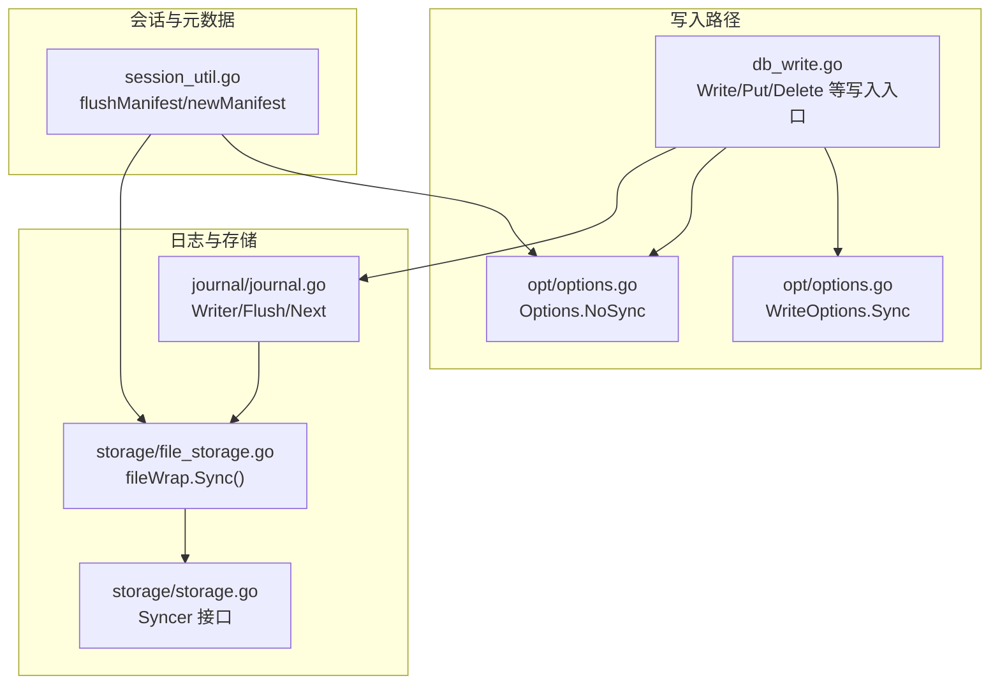
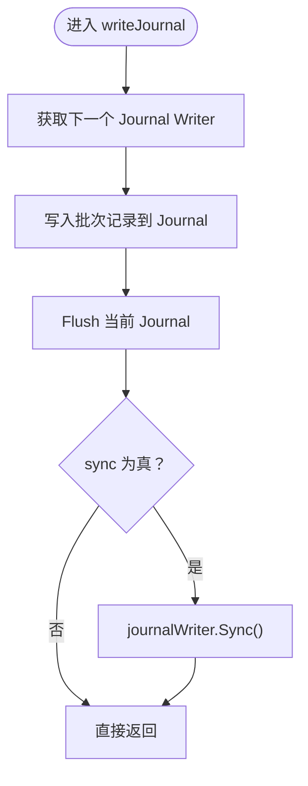
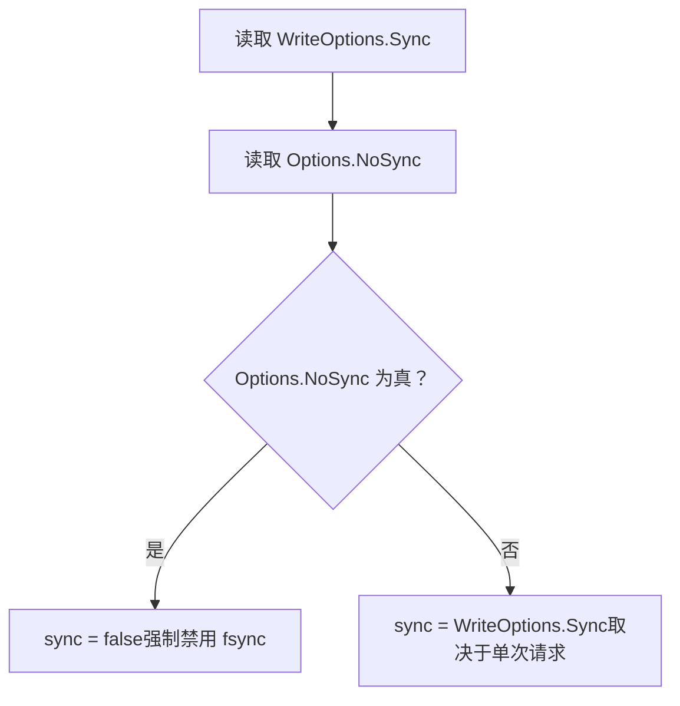
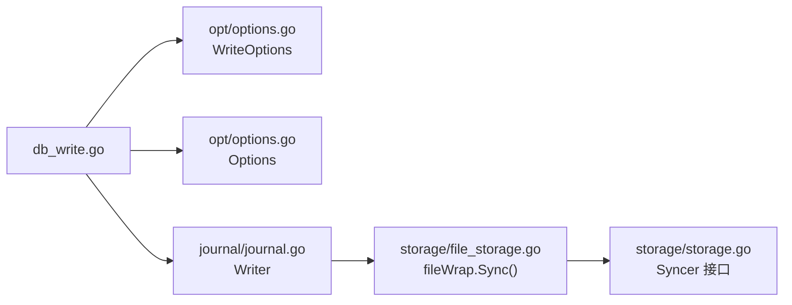

# 写入同步策略

<cite>
**本文引用的文件**
- [leveldb/db_write.go](file://leveldb/db_write.go)
- [leveldb/journal/journal.go](file://leveldb/journal/journal.go)
- [leveldb/storage/storage.go](file://leveldb/storage/storage.go)
- [leveldb/storage/file_storage.go](file://leveldb/storage/file_storage.go)
- [leveldb/session_util.go](file://leveldb/session_util.go)
- [leveldb/opt/options.go](file://leveldb/opt/options.go)
- [leveldb/options.go](file://leveldb/options.go)
</cite>

## 目录
1. [引言](#引言)
2. [项目结构](#项目结构)
3. [核心组件](#核心组件)
4. [架构总览](#架构总览)
5. [详细组件分析](#详细组件分析)
6. [依赖关系分析](#依赖关系分析)
7. [性能考量](#性能考量)
8. [故障排查指南](#故障排查指南)
9. [结论](#结论)
10. [附录](#附录)

## 引言
本指南聚焦于 avccDB 的写入同步策略，系统性解析 WriteOptions 中的 Sync 标志与 Options 中的 NoSync 标志之间的协同与权衡。通过对 db_write.go 中 writeJournal 方法的深入分析，阐明同步写入对数据持久性的保障机制，以及在不同场景下的性能影响。我们将结合 Journal 与存储层的 fsync 行为，给出配置建议，帮助用户在“强持久性”与“高吞吐量”之间做出合理取舍。

## 项目结构
围绕写入同步策略的关键代码分布在以下模块：
- 写入入口与合并逻辑：leveldb/db_write.go
- 日志记录器（Journal）：leveldb/journal/journal.go
- 存储接口与文件包装：leveldb/storage/storage.go、leveldb/storage/file_storage.go
- 会话与 MANIFEST 刷新：leveldb/session_util.go
- 配置项定义：leveldb/opt/options.go、leveldb/options.go



图表来源
- [leveldb/db_write.go](file://leveldb/db_write.go#L18-L33)
- [leveldb/journal/journal.go](file://leveldb/journal/journal.go#L435-L448)
- [leveldb/storage/file_storage.go](file://leveldb/storage/file_storage.go#L591-L604)
- [leveldb/storage/storage.go](file://leveldb/storage/storage.go#L74-L93)
- [leveldb/session_util.go](file://leveldb/session_util.go#L446-L491)
- [leveldb/opt/options.go](file://leveldb/opt/options.go#L362-L366)
- [leveldb/opt/options.go](file://leveldb/opt/options.go#L723-L744)

章节来源
- [leveldb/db_write.go](file://leveldb/db_write.go#L18-L33)
- [leveldb/journal/journal.go](file://leveldb/journal/journal.go#L435-L448)
- [leveldb/storage/file_storage.go](file://leveldb/storage/file_storage.go#L591-L604)
- [leveldb/storage/storage.go](file://leveldb/storage/storage.go#L74-L93)
- [leveldb/session_util.go](file://leveldb/session_util.go#L446-L491)
- [leveldb/opt/options.go](file://leveldb/opt/options.go#L362-L366)
- [leveldb/opt/options.go](file://leveldb/opt/options.go#L723-L744)

## 核心组件
- WriteOptions.Sync：控制单次写入是否触发底层 fsync，以确保写入落盘。
- Options.NoSync：全局开关，一旦开启则完全跳过 fsync，无论 WriteOptions.Sync 如何设置。
- writeJournal：写入流程中负责写入 Journal 并按需执行 fsync 的关键函数。
- Journal.Writer：负责将批量记录写入块缓冲区，并在 Flush/Next 时写出块。
- fileWrap.Sync：对 Journal 文件执行 fsync；当文件类型为 MANIFEST 时还会同步父目录。

章节来源
- [leveldb/opt/options.go](file://leveldb/opt/options.go#L362-L366)
- [leveldb/opt/options.go](file://leveldb/opt/options.go#L723-L744)
- [leveldb/db_write.go](file://leveldb/db_write.go#L18-L33)
- [leveldb/journal/journal.go](file://leveldb/journal/journal.go#L435-L448)
- [leveldb/storage/file_storage.go](file://leveldb/storage/file_storage.go#L591-L604)

## 架构总览
写入同步策略的决策链路如下：
- 应用层调用 Write/Put/Delete，传入 WriteOptions。
- DB 层根据 WriteOptions.Sync 与 Options.NoSync 计算最终是否需要同步。
- 若需要同步，则在写入 Journal 后调用 journalWriter.Sync()。
- Journal.Writer 在 Flush/Next 时将缓冲写出；fileWrap.Sync() 对 Journal 文件执行 fsync，并在 MANIFEST 类型文件上同步父目录。

```mermaid
sequenceDiagram
participant App as "应用"
participant DB as "DB.Write/Put/Delete"
participant WO as "WriteOptions"
participant Opt as "Options"
participant DBW as "db_write.go"
participant JW as "journal.Writer"
participant FS as "fileWrap.Sync()"
App->>DB : 调用写入接口(带 WriteOptions)
DB->>WO : 读取 Sync 标志
DB->>Opt : 读取 NoSync 标志
DB->>DBW : 计算 sync 标志并进入 writeLocked
DBW->>JW : writeJournal(批次, seq, sync)
alt 需要同步
DBW->>FS : journalWriter.Sync()
FS-->>DBW : 完成 fsync
else 不需要同步
DBW-->>DBW : 直接返回
end
DBW-->>DB : 返回成功或错误
```

图表来源
- [leveldb/db_write.go](file://leveldb/db_write.go#L296-L330)
- [leveldb/db_write.go](file://leveldb/db_write.go#L18-L33)
- [leveldb/journal/journal.go](file://leveldb/journal/journal.go#L435-L448)
- [leveldb/storage/file_storage.go](file://leveldb/storage/file_storage.go#L591-L604)

## 详细组件分析

### writeJournal 方法与同步控制
writeJournal 是写入同步策略的核心实现点。其职责包括：
- 获取下一个 Journal Writer。
- 将一批写入记录写入 Journal。
- Flush 当前 Journal。
- 若 sync 为真，则对 journalWriter 执行 Sync()。



图表来源
- [leveldb/db_write.go](file://leveldb/db_write.go#L18-L33)

章节来源
- [leveldb/db_write.go](file://leveldb/db_write.go#L18-L33)

### WriteOptions.Sync 与 Options.NoSync 的协同
- WriteOptions.Sync 仅在单次写入请求中生效，用于覆盖默认行为。
- Options.NoSync 为全局开关，一旦启用，即使 WriteOptions.Sync 为真，也不会执行 fsync。
- 最终是否同步由两者共同决定：sync = WriteOptions.Sync && !Options.NoSync。



图表来源
- [leveldb/db_write.go](file://leveldb/db_write.go#L296-L300)
- [leveldb/opt/options.go](file://leveldb/opt/options.go#L622-L627)

章节来源
- [leveldb/db_write.go](file://leveldb/db_write.go#L296-L300)
- [leveldb/opt/options.go](file://leveldb/opt/options.go#L622-L627)

### Journal 写入与 Flush 行为
- Journal.Writer 在 Next() 时准备新的 Journal 块；在 Flush() 时将缓冲写出。
- writeJournal 在写入后调用 Flush，确保 Journal 数据被写出到底层存储。
- 若需要同步，随后调用 journalWriter.Sync() 触发 fsync。

章节来源
- [leveldb/journal/journal.go](file://leveldb/journal/journal.go#L435-L448)
- [leveldb/db_write.go](file://leveldb/db_write.go#L23-L28)

### 文件层 fsync 与目录同步
- fileWrap.Sync() 对 Journal 文件执行 fsync。
- 当文件类型为 MANIFEST 时，还会同步父目录，确保元数据一致性。

章节来源
- [leveldb/storage/file_storage.go](file://leveldb/storage/file_storage.go#L591-L604)

### 会话层 MANIFEST 的同步策略
- 会话在刷新 MANIFEST 时同样遵循 Options.NoSync：若 NoSync 为真则不执行 fsync。
- 这体现了全局 NoSync 对所有关键元数据写入的一致性影响。

章节来源
- [leveldb/session_util.go](file://leveldb/session_util.go#L446-L491)

## 依赖关系分析
- db_write.go 依赖 opt/options.go 提供的 WriteOptions.Sync 与 Options.NoSync。
- db_write.go 通过 journal.Writer.Next()/Flush() 写入 Journal，并在需要时调用 journalWriter.Sync()。
- fileWrap.Sync() 实现了底层 fsync，满足 Journal 与 MANIFEST 的持久化需求。
- storage/storage.go 定义了 Syncer 接口，fileWrap 实现该接口。



图表来源
- [leveldb/db_write.go](file://leveldb/db_write.go#L296-L330)
- [leveldb/opt/options.go](file://leveldb/opt/options.go#L362-L366)
- [leveldb/opt/options.go](file://leveldb/opt/options.go#L723-L744)
- [leveldb/journal/journal.go](file://leveldb/journal/journal.go#L435-L448)
- [leveldb/storage/file_storage.go](file://leveldb/storage/file_storage.go#L591-L604)
- [leveldb/storage/storage.go](file://leveldb/storage/storage.go#L74-L93)

## 性能考量
- 启用 Sync（WriteOptions.Sync = true）：
  - 每次写入都会触发 fsync，显著降低写入吞吐量，但提供更强的数据持久性保障。
  - 适用于对数据可靠性要求极高的场景，如金融交易、区块链区块提交等。
- 禁用 Sync（Options.NoSync = true）：
  - 全局跳过 fsync，写入性能大幅提升，但遇到系统崩溃时可能丢失最近的 Journal 数据。
  - 适用于高吞吐量、可容忍短暂丢失的场景，如日志收集、临时数据缓存等。
- 组合策略：
  - 在高频写入场景中，可将 Options.NoSync 设为 true，仅在关键事务或周期性检查点中显式设置 WriteOptions.Sync = true，以平衡性能与可靠性。

[本节为通用性能讨论，无需特定文件分析]

## 故障排查指南
- 写入缓慢或延迟升高：
  - 检查是否启用了 WriteOptions.Sync 或 Options.NoSync 设置不当。
  - 关注 Journal Flush 与 fsync 的频率，必要时调整写入批大小与合并策略。
- 数据恢复异常或元数据损坏：
  - 若 Options.NoSync 为真，系统崩溃可能导致最近 Journal 数据丢失。
  - 检查 fileWrap.Sync() 是否被正确调用（Journal 与 MANIFEST）。
- 目录同步问题：
  - MANIFEST 文件类型会触发父目录同步，若文件系统不支持目录 fsync，可能出现兼容性问题。

章节来源
- [leveldb/storage/file_storage.go](file://leveldb/storage/file_storage.go#L591-L604)
- [leveldb/session_util.go](file://leveldb/session_util.go#L446-L491)

## 结论
- WriteOptions.Sync 与 Options.NoSync 共同决定了写入是否进行 fsync。
- writeJournal 是同步策略的关键节点：先 Flush 再按需 Sync。
- Options.NoSync 提供全局禁用 fsync 的能力，影响 Journal 与 MANIFEST 的持久化行为。
- 在实践中，应根据业务对数据可靠性的要求与性能目标，选择合适的组合策略。

[本节为总结性内容，无需特定文件分析]

## 附录

### 配置建议
- 强持久性优先（金融、区块链）
  - 将 Options.NoSync 设为 false（默认），并在关键写入时设置 WriteOptions.Sync = true。
- 高吞吐量优先（日志、监控）
  - 将 Options.NoSync 设为 true，减少 fsync 开销；对关键操作使用 WriteOptions.Sync = true 进行补偿。
- 混合策略
  - 默认关闭 fsync，定期（如每 N 次写入或每 T 时间）执行一次显式同步，以兼顾吞吐与可靠性。

[本节为通用建议，无需特定文件分析]