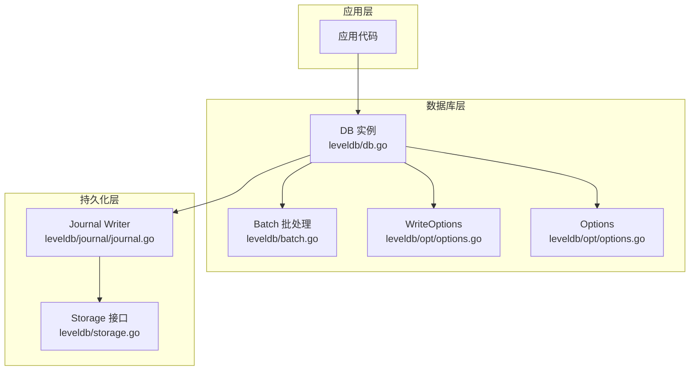
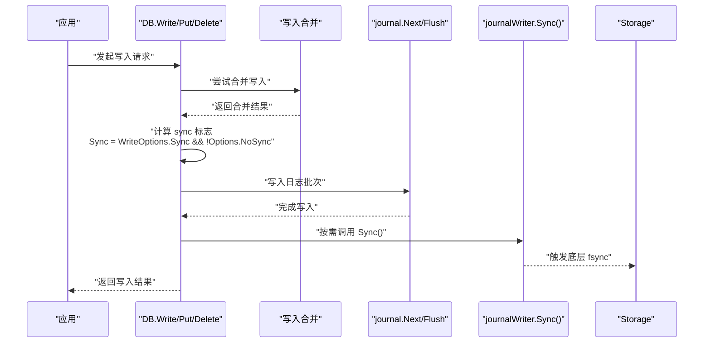
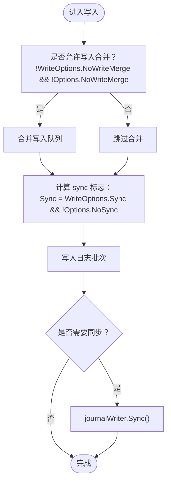
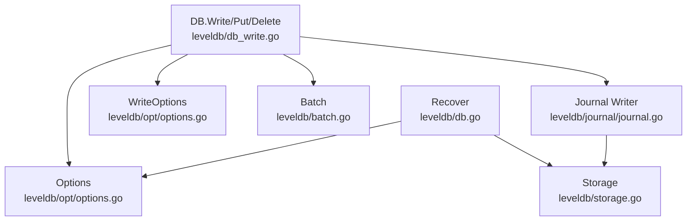
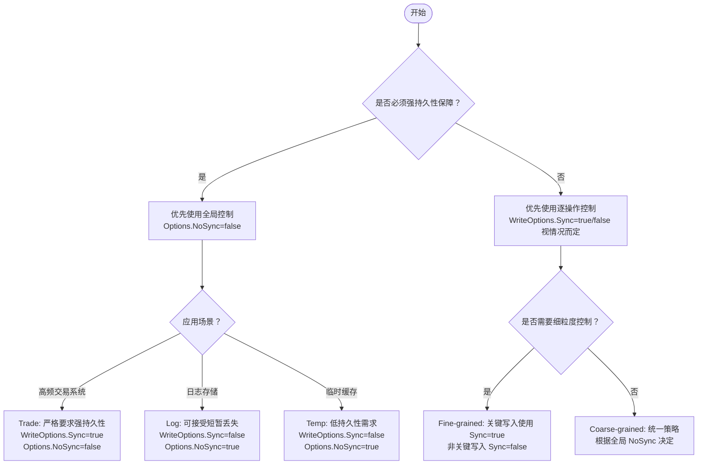

# 性能与持久性权衡

<cite>
**本文引用的文件**
- [README.md](file://README.md)
- [leveldb/db_write.go](file://leveldb/db_write.go)
- [leveldb/db.go](file://leveldb/db.go)
- [leveldb/opt/options.go](file://leveldb/opt/options.go)
- [leveldb/batch.go](file://leveldb/batch.go)
- [leveldb/journal/journal.go](file://leveldb/journal/journal.go)
- [leveldb/bench_test.go](file://leveldb/bench_test.go)
- [leveldb/testutil/storage.go](file://leveldb/testutil/storage.go)
</cite>

## 目录
1. [引言](#引言)
2. [项目结构](#项目结构)
3. [核心组件](#核心组件)
4. [架构总览](#架构总览)
5. [详细组件分析](#详细组件分析)
6. [依赖关系分析](#依赖关系分析)
7. [性能考量](#性能考量)
8. [故障排查指南](#故障排查指南)
9. [结论](#结论)
10. [附录](#附录)

## 引言
本指南聚焦于 avccDB 写入同步策略中的“性能与数据持久性”权衡，系统对比两类同步控制机制：
- 逐操作控制：通过 WriteOptions 的 Sync 标志，允许单次写入决定是否触发底层同步（fsync）。
- 全局控制：通过 Options 的 NoSync 标志，整体关闭或开启同步行为，影响所有写入路径。

我们将基于代码实现与基准测试，给出在不同场景（高频交易系统、日志存储、临时缓存）下的配置决策树、最佳实践、监控指标与故障恢复策略，帮助读者在性能需求与数据安全之间做出明智选择。

## 项目结构
avccDB 是基于 Go 的 LevelDB 实现，核心写入流程涉及数据库实例、写入选项、批处理、日志记录器与存储层。下图展示了与写入同步相关的模块关系。

图表来源
- [leveldb/db_write.go](file://leveldb/db_write.go#L1-L120)
- [leveldb/batch.go](file://leveldb/batch.go#L1-L120)
- [leveldb/opt/options.go](file://leveldb/opt/options.go#L360-L420)
- [leveldb/journal/journal.go](file://leveldb/journal/journal.go#L1-L120)

章节来源
- [README.md](file://README.md#L1-L30)

## 核心组件
- 写入主流程与合并：DB.Write/DB.Put/DB.Delete 调用 writeLocked，支持写入合并与同步标志计算。
- 同步标志计算：逐操作 Sync 由 WriteOptions 控制；全局 NoSync 由 Options 控制；两者共同决定最终是否调用底层 Sync。
- 日志写入：journal.Next/Flush/Sync 组成写入路径，Sync 在需要时触发。
- 批处理：Batch 支持多条记录合并，减少写入次数，提升吞吐。

章节来源
- [leveldb/db_write.go](file://leveldb/db_write.go#L1-L120)
- [leveldb/db_write.go](file://leveldb/db_write.go#L268-L375)
- [leveldb/opt/options.go](file://leveldb/opt/options.go#L360-L420)
- [leveldb/batch.go](file://leveldb/batch.go#L1-L120)

## 架构总览
下面的序列图展示了典型写入流程，包括同步标志的计算与最终的底层同步调用。

图表来源
- [leveldb/db_write.go](file://leveldb/db_write.go#L268-L375)
- [leveldb/db_write.go](file://leveldb/db_write.go#L1-L60)
- [leveldb/journal/journal.go](file://leveldb/journal/journal.go#L1-L120)

## 详细组件分析

### 同步标志计算与写入合并
- 逐操作控制：WriteOptions.Sync 默认为 false，表示不强制同步；当设置为 true 时，本次写入会触发同步。
- 全局控制：Options.NoSync 默认为 false，表示启用同步；当设置为 true 时，忽略所有写入的 Sync 请求，统一不进行同步。
- 合并策略：当写入较小且未禁用合并时，系统会尝试将多个写入合并为一次日志写入，从而降低同步调用次数，提高吞吐。

图表来源
- [leveldb/db_write.go](file://leveldb/db_write.go#L268-L375)
- [leveldb/opt/options.go](file://leveldb/opt/options.go#L360-L420)

章节来源
- [leveldb/db_write.go](file://leveldb/db_write.go#L1-L120)
- [leveldb/db_write.go](file://leveldb/db_write.go#L268-L375)
- [leveldb/opt/options.go](file://leveldb/opt/options.go#L360-L420)

### 日志写入与同步
- 日志写入器负责将批次数据写入磁盘，并在必要时执行同步。
- 恢复路径中也存在同步逻辑，用于确保表文件写入后落盘。

章节来源
- [leveldb/journal/journal.go](file://leveldb/journal/journal.go#L1-L120)
- [leveldb/db.go](file://leveldb/db.go#L300-L370)

### 批处理与内部长度
- Batch 内部维护 internalLen，用于估算内存占用与合并阈值，避免频繁分配。
- 大批量写入时，Batch 可显著减少日志写入次数，配合合并策略提升吞吐。

章节来源
- [leveldb/batch.go](file://leveldb/batch.go#L1-L120)
- [leveldb/batch.go](file://leveldb/batch.go#L240-L320)

## 依赖关系分析
- DB.Write/DB.Put/DB.Delete 依赖 Options 和 WriteOptions 计算同步标志。
- 写入路径依赖 Batch 进行数据组织，依赖 Journal Writer 完成日志写入，最终依赖 Storage 层的 Sync。
- 恢复路径（Recover）同样受 Options.NoSync 影响，决定是否对生成的表文件执行同步。

图表来源
- [leveldb/db_write.go](file://leveldb/db_write.go#L268-L375)
- [leveldb/opt/options.go](file://leveldb/opt/options.go#L360-L420)
- [leveldb/batch.go](file://leveldb/batch.go#L1-L120)
- [leveldb/journal/journal.go](file://leveldb/journal/journal.go#L1-L120)
- [leveldb/db.go](file://leveldb/db.go#L300-L370)

章节来源
- [leveldb/db_write.go](file://leveldb/db_write.go#L268-L375)
- [leveldb/opt/options.go](file://leveldb/opt/options.go#L360-L420)
- [leveldb/db.go](file://leveldb/db.go#L300-L370)

## 性能考量
- 同步成本：每次 Sync 都会触发底层 fsync，带来显著的磁盘 IO 延迟，降低吞吐。
- 合并收益：写入合并可减少日志写入次数与同步调用次数，提升吞吐。
- 大批量写入：当单次写入批次过大时，系统可能切换到事务模式直接写表，绕过日志，进一步减少同步开销。
- 基准测试：仓库提供了带 Sync 的写入基准测试，可用于对比不同配置下的吞吐与延迟表现。

章节来源
- [leveldb/db_write.go](file://leveldb/db_write.go#L268-L375)
- [leveldb/bench_test.go](file://leveldb/bench_test.go#L290-L310)

## 故障排查指南
- 同步模拟与阻塞：测试工具可在写入与同步阶段注入错误与阻塞，便于验证同步失败与恢复路径。
- 常见问题定位：
  - 若出现写入延迟异常升高，检查是否启用了 WriteOptions.Sync 或 Options.NoSync 设置不当。
  - 若出现恢复阶段卡顿，检查恢复路径中对表文件的同步逻辑。
- 建议的诊断步骤：
  - 使用测试工具模拟同步错误，观察系统行为与错误传播。
  - 结合写入合并开关与批量大小，评估对延迟的影响。

章节来源
- [leveldb/testutil/storage.go](file://leveldb/testutil/storage.go#L210-L240)
- [leveldb/db.go](file://leveldb/db.go#L300-L370)

## 决策树：如何选择 Sync 配置
以下决策树帮助你在不同应用场景中选择合适的配置组合（逐操作控制 vs 全局控制）。

说明
- Trade 场景强调强持久性，建议全局启用同步，同时在关键写入处使用逐操作同步。
- Log/Temp 场景更关注吞吐，建议全局禁用同步，仅在极少数关键点使用逐操作同步。

[本图为概念性决策树，不直接映射具体源码文件，故无图表来源]

## 最佳实践
- 高频交易系统
  - 全局策略：Options.NoSync=false（启用同步）
  - 逐操作策略：关键订单、结算等写入使用 WriteOptions.Sync=true
  - 监控：写入延迟、同步耗时、写入合并率
- 日志存储
  - 全局策略：Options.NoSync=true（禁用同步）
  - 逐操作策略：周期性批量落盘时使用 WriteOptions.Sync=true
  - 监控：吞吐、磁盘写入量、恢复时间
- 临时缓存
  - 全局策略：Options.NoSync=true（禁用同步）
  - 逐操作策略：不使用 Sync
  - 监控：内存占用、写入延迟、合并效率

章节来源
- [leveldb/db_write.go](file://leveldb/db_write.go#L268-L375)
- [leveldb/opt/options.go](file://leveldb/opt/options.go#L360-L420)

## 监控指标建议
- 写入延迟分布（P50/P95/P99）
- 同步调用次数与耗时
- 写入合并率（合并写入数/总写入数）
- 磁盘写入字节数与 IOPS
- 写入暂停次数与持续时间（写入节流/暂停）

章节来源
- [leveldb/db_write.go](file://leveldb/db_write.go#L60-L120)

## 故障恢复策略
- 恢复路径：在恢复表文件时，若 Options.NoSync=false，则会对生成的表文件执行同步，确保落盘。
- 恢复容错：严格模式下，损坏的块或校验失败会被丢弃或重建，保证数据库一致性。
- 建议：在高可用场景中，结合备份与只读恢复能力，定期验证恢复路径的有效性。

章节来源
- [leveldb/db.go](file://leveldb/db.go#L300-L370)

## 结论
- 逐操作控制适合需要细粒度持久性保障的场景，但会增加同步调用频率，影响吞吐。
- 全局控制适合对一致性有统一要求的场景，可通过批量落盘与合并策略平衡性能与持久性。
- 实际部署应结合业务特性、硬件条件与监控反馈，动态调整配置组合，并通过基准测试验证效果。

[本节为总结性内容，不直接分析具体文件]

## 附录

### A. 逐操作控制与全局控制的关系
- 逐操作控制：WriteOptions.Sync
- 全局控制：Options.NoSync
- 最终是否同步：Sync = WriteOptions.Sync && !Options.NoSync

章节来源
- [leveldb/db_write.go](file://leveldb/db_write.go#L268-L375)
- [leveldb/opt/options.go](file://leveldb/opt/options.go#L360-L420)

### B. 基准测试参考
- 带同步的写入基准测试入口：BenchmarkDBWriteRandomSync
- 可据此对比不同配置下的吞吐与延迟差异

章节来源
- [leveldb/bench_test.go](file://leveldb/bench_test.go#L290-L310)