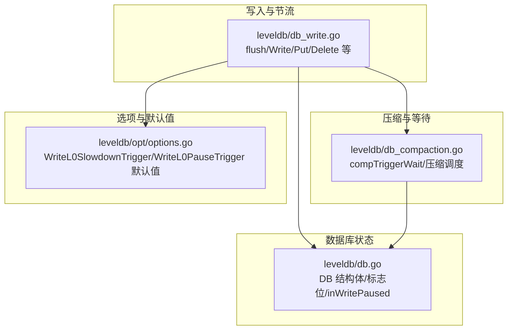
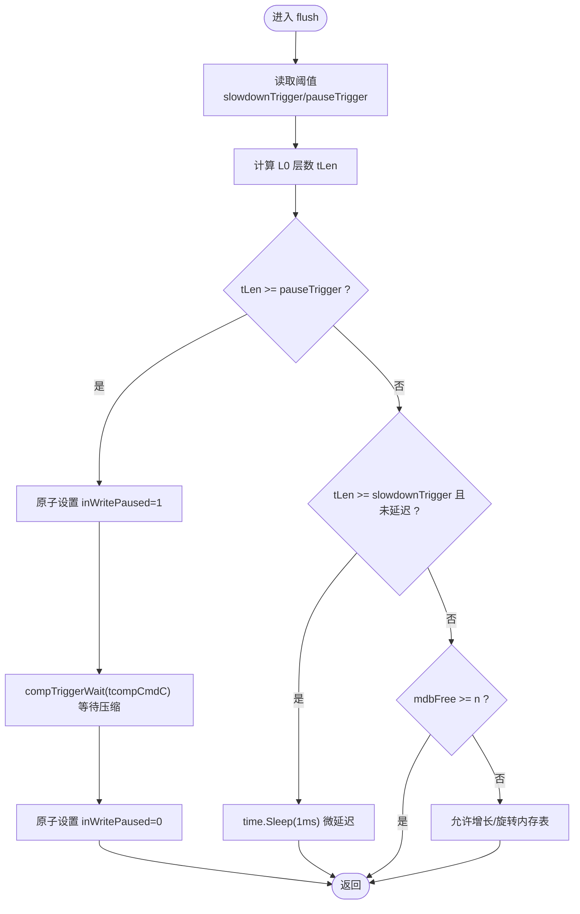
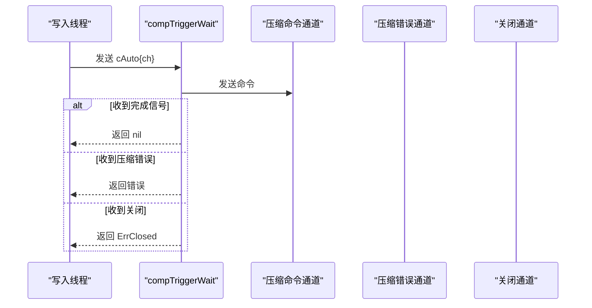
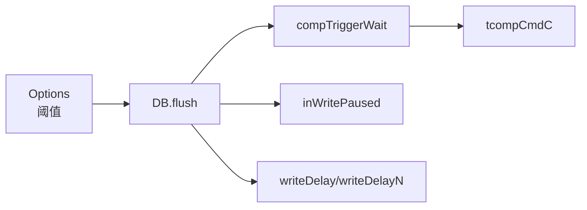

# L0层阈值行为与写入控制

<cite>
**本文引用的文件**
- [leveldb/db_write.go](file://leveldb/db_write.go)
- [leveldb/db_compaction.go](file://leveldb/db_compaction.go)
- [leveldb/db.go](file://leveldb/db.go)
- [leveldb/opt/options.go](file://leveldb/opt/options.go)
</cite>

## 目录
1. [引言](#引言)
2. [项目结构](#项目结构)
3. [核心组件](#核心组件)
4. [架构总览](#架构总览)
5. [详细组件分析](#详细组件分析)
6. [依赖关系分析](#依赖关系分析)
7. [性能考量](#性能考量)
8. [故障排查指南](#故障排查指南)
9. [结论](#结论)

## 引言
本指南聚焦于 avccDB 中 L0 层阈值行为与写入控制机制，围绕两个关键参数 WriteL0SlowdownTrigger 与 WriteL0PauseTrigger 的作用边界、触发条件与实现细节展开。文档将系统解释：
- 当 L0 层 SSTable 数量达到 slowdownTrigger 阈值时，系统通过微小延迟（time.Sleep）降低写入速率；
- 当达到 pauseTrigger 阈值时，系统通过原子标志位与压缩通道等待机制暂停写入，直至压缩完成；
- 结合 switch 分支逻辑与原子标志位 inWritePaused 的使用，说明写入暂停的实现路径；
- 提供基于应用吞吐量与压缩性能的阈值调优建议，帮助避免写入停顿（write stall）对系统造成显著影响。

## 项目结构
与 L0 层阈值行为直接相关的代码主要分布在以下模块：
- 写入与节流：leveldb/db_write.go
- 压缩与等待：leveldb/db_compaction.go
- 数据库状态与标志位：leveldb/db.go
- 选项与默认阈值：leveldb/opt/options.go



图表来源
- [leveldb/db_write.go](file://leveldb/db_write.go#L66-L131)
- [leveldb/db_compaction.go](file://leveldb/db_compaction.go#L737-L756)
- [leveldb/db.go](file://leveldb/db.go#L33-L120)
- [leveldb/opt/options.go](file://leveldb/opt/options.go#L36-L45)

章节来源
- [leveldb/db_write.go](file://leveldb/db_write.go#L66-L131)
- [leveldb/db_compaction.go](file://leveldb/db_compaction.go#L737-L756)
- [leveldb/db.go](file://leveldb/db.go#L33-L120)
- [leveldb/opt/options.go](file://leveldb/opt/options.go#L36-L45)

## 核心组件
- WriteL0SlowdownTrigger：L0 层 SSTable 达到该阈值后，写入流程在 flush 阶段引入微小延迟，以缓解写入压力。
- WriteL0PauseTrigger：L0 层 SSTable 达到该阈值后，写入流程设置写入暂停标志，并通过压缩命令通道等待压缩完成，从而阻塞后续写入。
- flush 函数：在写入前尝试刷新内存表，期间根据 L0 层 SSTable 数量与阈值执行减速或暂停逻辑。
- compTriggerWait：向压缩命令通道发送“自动触发”命令并等待返回，用于暂停写入直到压缩完成。
- inWritePaused：原子标志位，标记当前是否处于写入暂停状态。

章节来源
- [leveldb/db_write.go](file://leveldb/db_write.go#L66-L131)
- [leveldb/db_compaction.go](file://leveldb/db_compaction.go#L737-L756)
- [leveldb/db.go](file://leveldb/db.go#L33-L120)
- [leveldb/opt/options.go](file://leveldb/opt/options.go#L36-L45)

## 架构总览
下图展示了写入路径中 L0 层阈值控制的关键交互：

```mermaid
sequenceDiagram
participant Writer as "写入线程"
participant DBW as "DB.flush"
participant OPT as "Options(阈值)"
participant DB as "DB(标志位/inWritePaused)"
participant TComp as "tcompCmdC(表压缩命令)"
participant MComp as "mcompCmdC(内存压缩命令)"
Writer->>DBW : 调用 flush(n)
DBW->>OPT : 读取 WriteL0SlowdownTrigger/WriteL0PauseTrigger
DBW->>DBW : 计算 L0 层 SSTable 数量 tLen
alt tLen >= pauseTrigger
DBW->>DB : 原子设置 inWritePaused=1
DBW->>TComp : 发送压缩命令并等待 compTriggerWait
TComp-->>DBW : 返回错误或完成
DBW->>DB : 原子设置 inWritePaused=0
else tLen >= slowdownTrigger
DBW->>DBW : time.Sleep(1ms) 微小延迟
else 其他情况
DBW->>DBW : 可能旋转内存表/允许增长
end
DBW-->>Writer : 返回结果
```

图表来源
- [leveldb/db_write.go](file://leveldb/db_write.go#L66-L131)
- [leveldb/db_compaction.go](file://leveldb/db_compaction.go#L737-L756)
- [leveldb/db.go](file://leveldb/db.go#L33-L120)
- [leveldb/opt/options.go](file://leveldb/opt/options.go#L36-L45)

## 详细组件分析

### 组件一：flush 函数与 L0 阈值控制
- 读取阈值：从 Options 获取 WriteL0SlowdownTrigger 与 WriteL0PauseTrigger。
- 计算 L0 层数：通过 session.tLen(0) 获取 L0 层 SSTable 数量。
- 切换逻辑：
  - 若 tLen ≥ slowdownTrigger 且尚未延迟，则引入 1ms 微小延迟；
  - 若内存表剩余容量足够（mdbFree ≥ n），则直接继续；
  - 若 tLen ≥ pauseTrigger，则设置 inWritePaused=1，调用 compTriggerWait(tcompCmdC) 等待压缩完成，再清除标志位；
  - 否则在空内存表场景允许增长，否则旋转内存表并重试。
- 统计与日志：累计写入延迟时间与次数；若发生延迟，最终记录延迟统计。



图表来源
- [leveldb/db_write.go](file://leveldb/db_write.go#L66-L131)

章节来源
- [leveldb/db_write.go](file://leveldb/db_write.go#L66-L131)

### 组件二：compTriggerWait 与压缩等待
- 功能：向压缩命令通道发送“自动触发”命令，同时监听压缩错误通道与关闭信号，等待压缩完成或错误返回。
- 用途：在 pauseTrigger 触发时，写入线程通过该函数阻塞等待压缩完成，从而避免写入堆积。



图表来源
- [leveldb/db_compaction.go](file://leveldb/db_compaction.go#L737-L756)

章节来源
- [leveldb/db_compaction.go](file://leveldb/db_compaction.go#L737-L756)

### 组件三：DB 结构体中的标志位与通道
- inWritePaused：原子整型标志位，用于标记写入是否被暂停。
- tcompCmdC/mcompCmdC：表压缩与内存压缩命令通道，用于触发与等待压缩。
- writeDelay/writeDelayN：累计写入延迟时长与次数，便于观测与诊断。

章节来源
- [leveldb/db.go](file://leveldb/db.go#L33-L120)

### 组件四：选项与默认阈值
- 默认值：
  - WriteL0SlowdownTrigger = 8
  - WriteL0PauseTrigger = 12
- 应用可通过 Options 覆盖上述阈值，以适配不同写入负载与压缩能力。

章节来源
- [leveldb/opt/options.go](file://leveldb/opt/options.go#L36-L45)
- [leveldb/opt/options.go](file://leveldb/opt/options.go#L673-L685)

## 依赖关系分析
- flush 依赖 Options 提供的阈值；
- flush 在 pauseTrigger 场景下依赖 compTriggerWait 完成等待；
- compTriggerWait 依赖 tcompCmdC 与压缩错误通道；
- DB 结构体提供 inWritePaused 与统计字段；
- 选项默认值定义在 opt/options.go。



图表来源
- [leveldb/db_write.go](file://leveldb/db_write.go#L66-L131)
- [leveldb/db_compaction.go](file://leveldb/db_compaction.go#L737-L756)
- [leveldb/db.go](file://leveldb/db.go#L33-L120)
- [leveldb/opt/options.go](file://leveldb/opt/options.go#L36-L45)

章节来源
- [leveldb/db_write.go](file://leveldb/db_write.go#L66-L131)
- [leveldb/db_compaction.go](file://leveldb/db_compaction.go#L737-L756)
- [leveldb/db.go](file://leveldb/db.go#L33-L120)
- [leveldb/opt/options.go](file://leveldb/opt/options.go#L36-L45)

## 性能考量
- 微延迟策略：在接近 pauseTrigger 但尚未达到时引入 1ms 微延迟，可有效降低写入速率，避免 L0 快速堆积导致压缩无法跟上。
- 暂停策略：当 L0 层数超过 pauseTrigger 时，写入线程会阻塞等待压缩完成，防止写入堆积进一步恶化。
- 原子标志位：通过 inWritePaused 与 compTriggerWait 的配合，确保暂停与恢复过程可控且无竞争。
- 统计与可观测性：累计写入延迟时长与次数，有助于定位写入停顿问题并指导阈值调优。

## 故障排查指南
- 写入长时间阻塞：
  - 检查 L0 层数是否长期高于 pauseTrigger，确认压缩是否正常进行；
  - 观察 writeDelay 与 writeDelayN 是否持续增长。
- 压缩异常：
  - 关注压缩错误通道与持久化错误通道，必要时检查存储与磁盘性能。
- 阈值不当：
  - 若写入吞吐较低但频繁触发暂停，可适当提高 pauseTrigger；
  - 若写入吞吐较高且压缩能力较强，可适当降低 pauseTrigger 以减少延迟。

章节来源
- [leveldb/db_write.go](file://leveldb/db_write.go#L66-L131)
- [leveldb/db_compaction.go](file://leveldb/db_compaction.go#L87-L139)
- [leveldb/db.go](file://leveldb/db.go#L33-L120)

## 结论
- WriteL0SlowdownTrigger 与 WriteL0PauseTrigger 是 L0 层写入控制的双阈值策略：前者通过微延迟缓解压力，后者通过暂停写入保障系统稳定；
- flush 函数在写入前统一评估 L0 层数并按阈值执行减速或暂停；
- compTriggerWait 与 inWritePaused 协同实现了可感知、可恢复的写入暂停；
- 通过合理调整阈值与优化压缩性能，可在高写入场景下显著降低写入停顿风险，提升整体稳定性与吞吐表现。