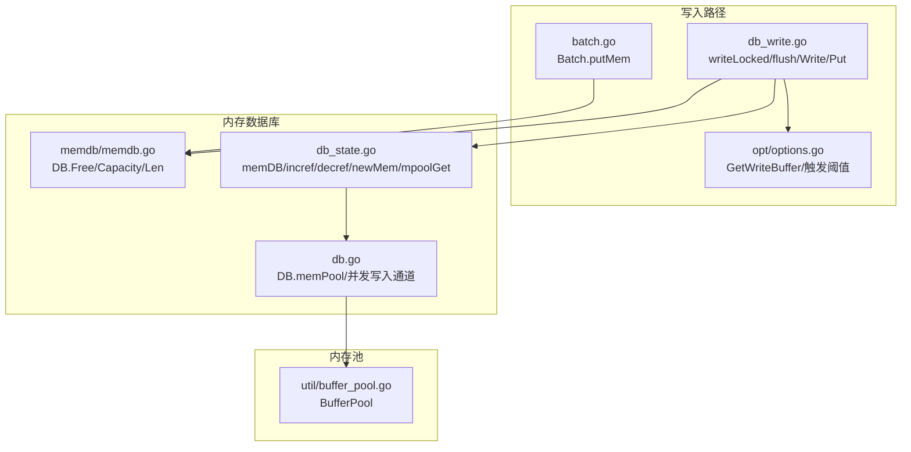
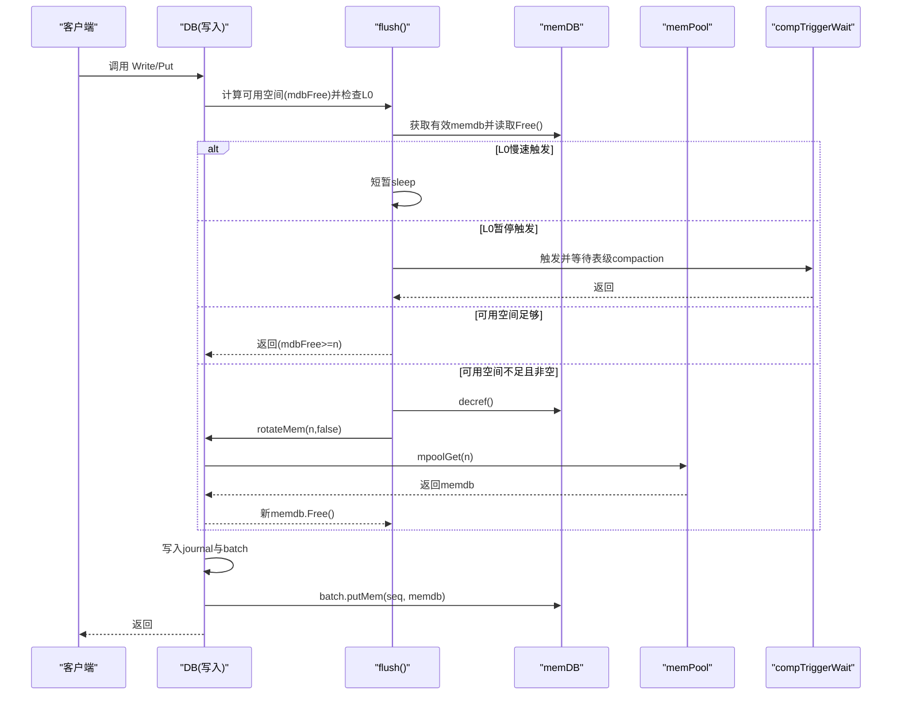
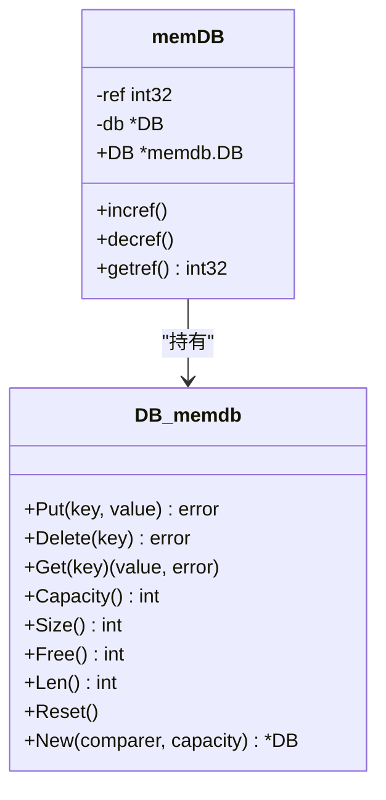
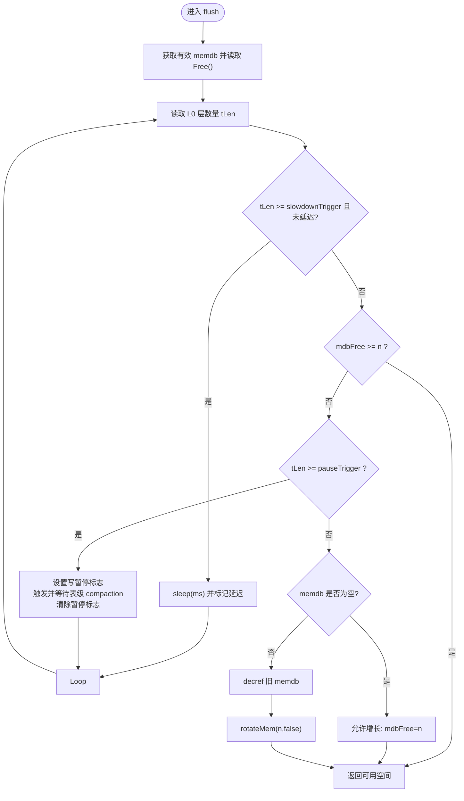
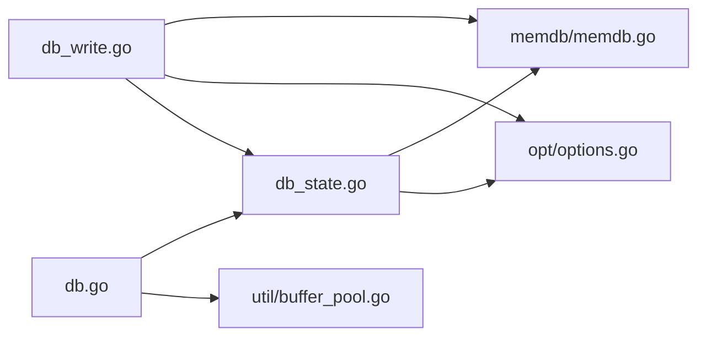

# 写入缓冲区概念与机制

<cite>
**本文引用的文件**
- [leveldb/db_write.go](file://leveldb/db_write.go)
- [leveldb/db_state.go](file://leveldb/db_state.go)
- [leveldb/memdb/memdb.go](file://leveldb/memdb/memdb.go)
- [leveldb/util/buffer_pool.go](file://leveldb/util/buffer_pool.go)
- [leveldb/opt/options.go](file://leveldb/opt/options.go)
- [leveldb/db.go](file://leveldb/db.go)
- [leveldb/batch.go](file://leveldb/batch.go)
</cite>

## 目录
1. [引言](#引言)
2. [项目结构](#项目结构)
3. [核心组件](#核心组件)
4. [架构总览](#架构总览)
5. [详细组件分析](#详细组件分析)
6. [依赖关系分析](#依赖关系分析)
7. [性能考量](#性能考量)
8. [故障排查指南](#故障排查指南)
9. [结论](#结论)

## 引言
本指南围绕 avccDB 的写入缓冲区（WriteBuffer）与内存数据库（memdb）展开，系统性解释 WriteBuffer 参数如何作为 memdb 的容量上限，并在写入压力下通过 flush 机制协调写入流程。文档将深入分析：
- WriteBuffer 与 memdb 容量的关系
- flush 方法如何根据 L0 层 SSTable 数量与 memdb 使用率进行不同处理路径
- 可用空间计算（mdbFree）与阈值触发（慢速/暂停）
- memdb 引用计数（incref/decref）与内存池（memPool）的作用
- newMem 与 mpoolGet 如何协同优化内存分配

## 项目结构
与写入缓冲区直接相关的核心模块如下：
- 写入控制与 flush 协调：leveldb/db_write.go
- memdb 生命周期与引用计数：leveldb/db_state.go、leveldb/memdb/memdb.go
- 内存池与缓冲区复用：leveldb/util/buffer_pool.go
- 选项配置（WriteBuffer 等）：leveldb/opt/options.go
- 数据库实例字段与并发写入通道：leveldb/db.go
- 批处理写入到 memdb：leveldb/batch.go

图表来源
- [leveldb/db_write.go](file://leveldb/db_write.go#L66-L278)
- [leveldb/db_state.go](file://leveldb/db_state.go#L1-L120)
- [leveldb/memdb/memdb.go](file://leveldb/memdb/memdb.go#L411-L460)
- [leveldb/util/buffer_pool.go](file://leveldb/util/buffer_pool.go#L1-L136)
- [leveldb/opt/options.go](file://leveldb/opt/options.go#L392-L400)
- [leveldb/db.go](file://leveldb/db.go#L33-L120)
- [leveldb/batch.go](file://leveldb/batch.go#L244-L257)

章节来源
- [leveldb/db_write.go](file://leveldb/db_write.go#L66-L278)
- [leveldb/db_state.go](file://leveldb/db_state.go#L1-L120)
- [leveldb/memdb/memdb.go](file://leveldb/memdb/memdb.go#L411-L460)
- [leveldb/util/buffer_pool.go](file://leveldb/util/buffer_pool.go#L1-L136)
- [leveldb/opt/options.go](file://leveldb/opt/options.go#L392-L400)
- [leveldb/db.go](file://leveldb/db.go#L33-L120)
- [leveldb/batch.go](file://leveldb/batch.go#L244-L257)

## 核心组件
- WriteBuffer 选项：决定 memdb 的容量上限，默认 4 MiB；可通过配置覆盖。
- memdb.DB：提供容量（Capacity）、已用大小（Size）、剩余空间（Free）、条目数（Len）等接口。
- flush 流程：在写入前评估 memdb 剩余空间与 L0 层状态，必要时触发 compaction 或旋转 memdb。
- 引用计数与内存池：memDB.incref/decref 控制生命周期；memPool 复用标准容量的 memdb 实例，降低频繁分配成本。
- newMem 与 mpoolGet：newMem 负责冻结旧 memdb 并创建新 memdb；mpoolGet 从池中取或按 WriteBuffer/n 的最大值新建。

章节来源
- [leveldb/opt/options.go](file://leveldb/opt/options.go#L392-L400)
- [leveldb/memdb/memdb.go](file://leveldb/memdb/memdb.go#L411-L460)
- [leveldb/db_write.go](file://leveldb/db_write.go#L66-L131)
- [leveldb/db_state.go](file://leveldb/db_state.go#L1-L120)
- [leveldb/db.go](file://leveldb/db.go#L33-L120)

## 架构总览
写入流程的关键交互如下：

图表来源
- [leveldb/db_write.go](file://leveldb/db_write.go#L66-L131)
- [leveldb/db_state.go](file://leveldb/db_state.go#L120-L181)
- [leveldb/db.go](file://leveldb/db.go#L33-L120)

## 详细组件分析

### WriteBuffer 与 memdb 容量上限
- WriteBuffer 是 memdb 的容量上限，由选项 GetWriteBuffer 提供，默认 4 MiB。
- memdb.New 接受 capacity 参数，实际容量即为该上限；memdb.Capacity 返回容量，Free 返回剩余空间。
- 在 newMem 与 mpoolGet 中，会以 max(WriteBuffer, n) 作为新建 memdb 的容量，确保至少满足当前写入需求。

章节来源
- [leveldb/opt/options.go](file://leveldb/opt/options.go#L392-L400)
- [leveldb/memdb/memdb.go](file://leveldb/memdb/memdb.go#L411-L460)
- [leveldb/db_state.go](file://leveldb/db_state.go#L83-L96)
- [leveldb/db_state.go](file://leveldb/db_state.go#L120-L159)

### flush 机制与可用空间计算（mdbFree）
- flush 在每次写入前被调用，计算：
  - tLen = L0 层 SSTable 数量
  - mdbFree = memdb.Free()
- 判断逻辑：
  - 若 tLen 达到慢速触发阈值且尚未延迟，则短暂 sleep，降低写入速度
  - 若 mdbFree ≥ n，直接返回，允许继续写入
  - 若 tLen 达到暂停阈值，则设置写暂停标志，触发并等待表级 compaction，再清除暂停标志
  - 否则（可用空间不足且 memdb 非空）：
    - 对旧 memdb decref
    - 调用 rotateMem(n, false) 创建新 memdb
    - 返回新 memdb 的 Free 作为 mdbFree
- 当 memdb 为空时，允许增长，此时将 mdbFree 设为 n，避免无意义的旋转

章节来源
- [leveldb/db_write.go](file://leveldb/db_write.go#L66-L131)

### L0 层 SSTable 数量与 memdb 使用率的处理路径
- 慢速路径：tLen ≥ slowdownTrigger 时，写入线程短暂停顿，缓解 L0 压力
- 暂停路径：tLen ≥ pauseTrigger 时，写入被暂停，等待表级 compaction 完成后恢复
- 正常路径：memdb 有足够空间（mdbFree ≥ n），直接写入
- 旋转路径：memdb 无足够空间且非空，执行 rotateMem，切换到新的 memdb

章节来源
- [leveldb/db_write.go](file://leveldb/db_write.go#L66-L131)

### memdb 引用计数（incref/decref）与生命周期管理
- memDB 结构包含 ref 字段，用于跟踪引用计数
- incref：增加引用计数
- decref：减少引用计数；当 ref 降为 0 时：
  - 若 memdb 容量等于标准 WriteBuffer，则 Reset 并放回 memPool
  - 否则丢弃该实例
- getEffectiveMem/getMems/getFrozenMem 在获取 memdb 时均会 incref，确保使用者持有期间不会被回收

章节来源
- [leveldb/db_state.go](file://leveldb/db_state.go#L1-L74)
- [leveldb/db_state.go](file://leveldb/db_state.go#L161-L196)

### 内存池（memPool）与 newMem、mpoolGet 的协作
- memPool 是一个带缓冲的通道，用于缓存标准容量的 memdb 实例
- mpoolGet：
  - 优先尝试从池中取出
  - 若池为空或容量小于 n，则按 max(WriteBuffer, n) 新建
  - 返回包装后的 memDB（包含 DB 指针与引用计数）
- newMem：
  - 冻结当前 memdb（frozenMem）
  - 创建新的 journal 文件与 writer
  - 通过 mpoolGet 获取新 memdb，并为其增加两次引用（自持与调用者）
  - 更新 seq 冻结点（frozenSeq）

章节来源
- [leveldb/db_state.go](file://leveldb/db_state.go#L74-L120)
- [leveldb/db_state.go](file://leveldb/db_state.go#L120-L181)
- [leveldb/db.go](file://leveldb/db.go#L33-L120)

### 写入合并与可用空间限制
- writeLocked 在写入前调用 flush 获取 mdb 与 mdbFree
- 合并策略会考虑：
  - 合并上限 mergeLimit（受 batch/internalLen 与 128 KiB 限制）
  - 合并容量 mergeCap = mdbFree − batch.internalLen
  - 若合并后仍超过可用空间，标记 overflow 并等待后续处理
- 写入完成后，若本次写入长度达到或超过 mdbFree，则触发 rotateMem，避免后续写入再次触发 flush

章节来源
- [leveldb/db_write.go](file://leveldb/db_write.go#L154-L266)
- [leveldb/batch.go](file://leveldb/batch.go#L244-L257)

### 类图：memDB 与 memdb.DB 的关系

图表来源
- [leveldb/db_state.go](file://leveldb/db_state.go#L1-L74)
- [leveldb/memdb/memdb.go](file://leveldb/memdb/memdb.go#L411-L460)

### 流程图：flush 的决策逻辑

图表来源
- [leveldb/db_write.go](file://leveldb/db_write.go#L66-L131)

## 依赖关系分析
- db_write.go 依赖：
  - memdb.Free/Capacity/Len（memdb 接口）
  - 选项 GetWriteBuffer/GetWriteL0SlowdownTrigger/GetWriteL0PauseTrigger
  - DB.rotateMem/newMem/mpoolGet
- db_state.go 依赖：
  - memdb.New/Reset/Capacity
  - 选项 GetWriteBuffer
  - DB.memPool
- db.go 依赖：
  - DB.memPool/并发写入通道
  - util.BufferPool（间接影响批量写入缓冲复用）

图表来源
- [leveldb/db_write.go](file://leveldb/db_write.go#L66-L278)
- [leveldb/db_state.go](file://leveldb/db_state.go#L1-L120)
- [leveldb/memdb/memdb.go](file://leveldb/memdb/memdb.go#L411-L460)
- [leveldb/opt/options.go](file://leveldb/opt/options.go#L392-L400)
- [leveldb/db.go](file://leveldb/db.go#L33-L120)
- [leveldb/util/buffer_pool.go](file://leveldb/util/buffer_pool.go#L1-L136)

## 性能考量
- WriteBuffer 过小会导致频繁 flush 与 rotate，增加系统开销；过大则占用更多内存，可能延缓 compaction。
- L0 层 SSTable 数量过高会触发慢速/暂停策略，避免写放大与读放大。
- memPool 复用标准容量的 memdb，可显著降低频繁分配与 GC 压力。
- 合并写入（WriteMerge）可减少写入次数，但需考虑合并上限与可用空间的平衡。

## 故障排查指南
- 写入阻塞或延迟：
  - 检查 L0 层数量是否达到 pauseTrigger，确认 compaction 是否正常运行
  - 查看 writeDelay/writeDelayN 统计，定位延迟原因
- 内存占用异常：
  - 检查 WriteBuffer 设置是否合理
  - 观察 memPool 是否被正确复用（decref 为 0 时应 Reset 并放回池）
- 引用计数异常：
  - 若出现负引用，会在 decref 中 panic，需检查是否存在漏 decref 的场景

章节来源
- [leveldb/db_write.go](file://leveldb/db_write.go#L117-L131)
- [leveldb/db_state.go](file://leveldb/db_state.go#L33-L49)

## 结论
WriteBuffer 作为 memdb 的容量上限，与 flush 机制共同保障了写入吞吐与系统稳定性的平衡。通过可用空间（mdbFree）与 L0 层状态的联合判断，系统在不同条件下选择慢速、暂停或旋转 memdb 的路径。配合引用计数与内存池，avccDB 在高并发写入场景下实现了高效的内存复用与可控的写入节奏。