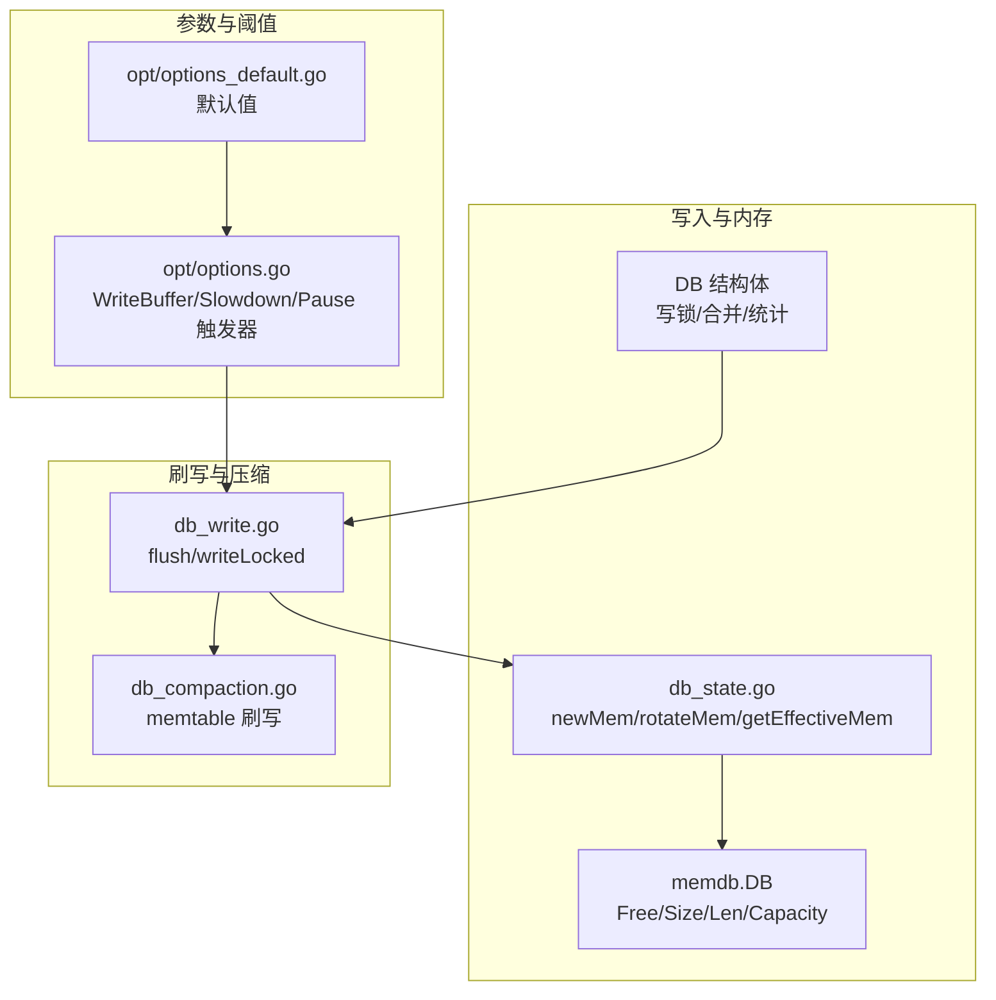
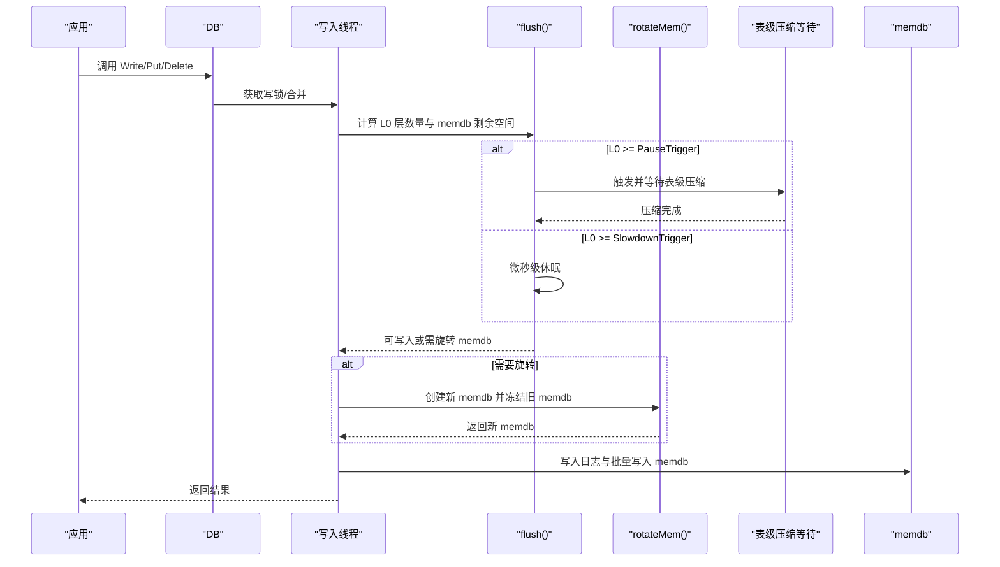
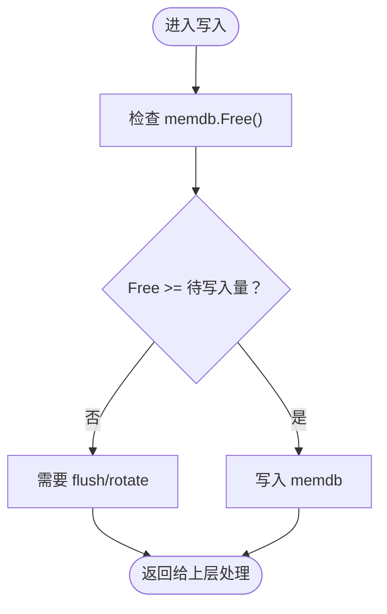
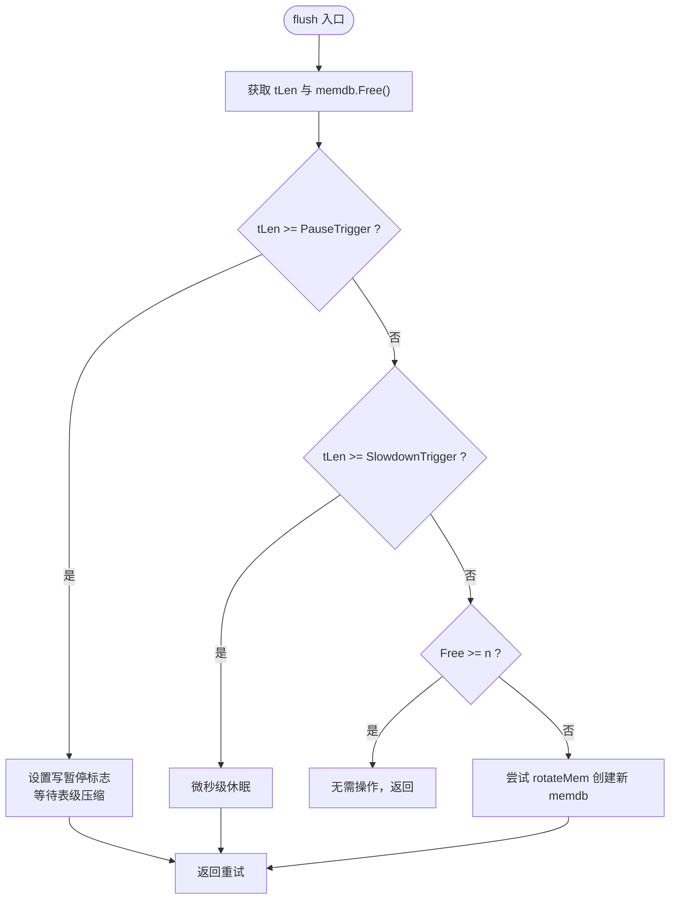
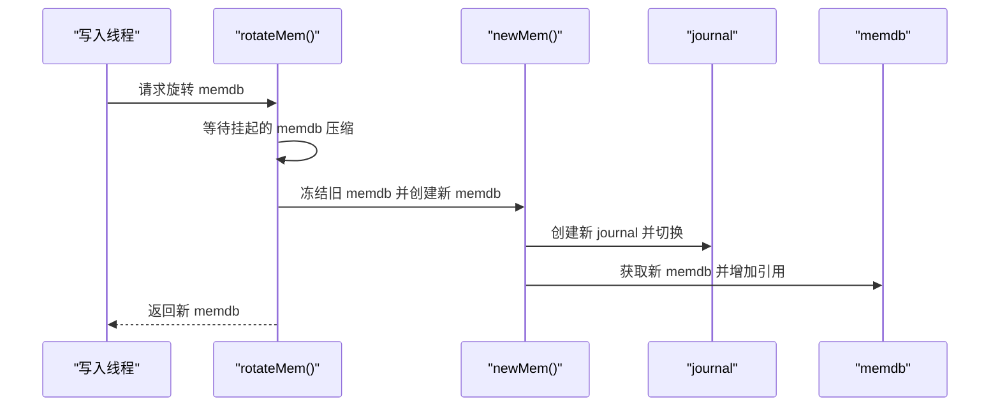
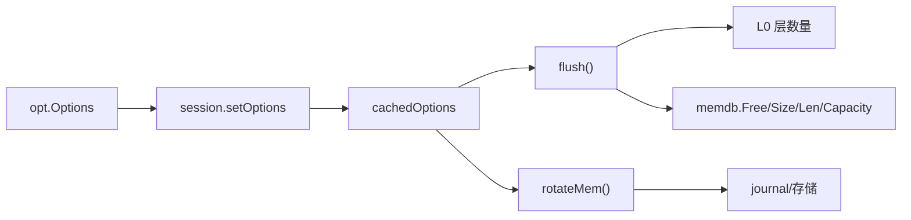

# 写入缓冲区管理

<cite>
**本文引用的文件列表**
- [db_write.go](file://leveldb/db_write.go)
- [memdb.go](file://leveldb/memdb/memdb.go)
- [options.go](file://leveldb/opt/options.go)
- [options.go](file://leveldb/opt/options_default.go)
- [db_state.go](file://leveldb/db_state.go)
- [db_compaction.go](file://leveldb/db_compaction.go)
- [db.go](file://leveldb/db.go)
- [session.go](file://leveldb/session.go)
</cite>

## 目录
1. [简介](#简介)
2. [项目结构与定位](#项目结构与定位)
3. [核心组件](#核心组件)
4. [架构总览](#架构总览)
5. [详细组件分析](#详细组件分析)
6. [依赖关系分析](#依赖关系分析)
7. [性能考量](#性能考量)
8. [故障排查指南](#故障排查指南)
9. [结论](#结论)
10. [附录：参数调优建议](#附录参数调优建议)

## 简介
本指南聚焦于 avccDB 的写入缓冲区管理，围绕 WriteBuffer 参数对数据库性能的影响进行系统化说明。重点解释：
- WriteBuffer 如何控制内存数据库（memdb）的最大容量；
- 当缓冲区接近或达到上限时，flush 和 rotateMem 机制如何协同工作；
- 在 L0 层 SSTable 数量达到 WriteL0SlowdownTrigger 和 WriteL0PauseTrigger 阈值时，写入的延迟与暂停行为；
- 结合 db_write.go 中的 flush 方法，给出参数调优策略，帮助在内存使用与写入性能之间取得平衡，避免写入停顿。

## 项目结构与定位
- 写入路径关键文件：
  - leveldb/db_write.go：写入主流程、flush、rotateMem、写合并与写锁协调。
  - leveldb/memdb/memdb.go：内存数据库实现，提供 Free、Size、Len 等容量与使用信息。
  - leveldb/db_state.go：memdb 生命周期管理（冻结、新建、释放）。
  - leveldb/db_compaction.go：memdb 刷写到磁盘（memtable -> sst）的流程。
  - leveldb/opt/options.go：默认参数与选项读取（WriteBuffer、WriteL0SlowdownTrigger、WriteL0PauseTrigger）。
  - leveldb/db.go：DB 结构体与并发控制、统计字段。
  - leveldb/session.go：会话与选项缓存（cachedOptions）。

图表来源
- [db_write.go](file://leveldb/db_write.go#L66-L131)
- [memdb.go](file://leveldb/memdb/memdb.go#L411-L440)
- [db_state.go](file://leveldb/db_state.go#L120-L200)
- [options.go](file://leveldb/opt/options.go#L392-L412)
- [options_default.go](file://leveldb/opt/options_default.go#L1-L200)
- [db_compaction.go](file://leveldb/db_compaction.go#L269-L327)

章节来源
- [db_write.go](file://leveldb/db_write.go#L66-L131)
- [memdb.go](file://leveldb/memdb/memdb.go#L411-L440)
- [db_state.go](file://leveldb/db_state.go#L120-L200)
- [options.go](file://leveldb/opt/options.go#L392-L412)
- [options_default.go](file://leveldb/opt/options_default.go#L1-L200)
- [db_compaction.go](file://leveldb/db_compaction.go#L269-L327)

## 核心组件
- 写入主流程与节流
  - flush：根据 L0 层数量阈值执行写入减速或暂停；必要时触发表级压缩等待；否则尝试旋转 memdb。
  - writeLocked：写入日志、批量写入 memdb、必要时旋转 memdb。
- 内存数据库（memdb）
  - 提供 Free、Size、Len、Capacity 等容量信息，用于判断是否需要 flush 或 rotate。
- memdb 生命周期
  - newMem：冻结当前 memdb 并创建新的 memdb 与 journal。
  - rotateMem：等待挂起的 memdb 压缩，创建新 memdb 并调度压缩。
- 参数与阈值
  - WriteBuffer：memdb 最大容量（字节）。
  - WriteL0SlowdownTrigger：L0 层数量达到该阈值开始写入减速（微秒级休眠）。
  - WriteL0PauseTrigger：L0 层数量达到该阈值写入暂停，等待表级压缩完成。

章节来源
- [db_write.go](file://leveldb/db_write.go#L66-L131)
- [db_write.go](file://leveldb/db_write.go#L155-L266)
- [memdb.go](file://leveldb/memdb/memdb.go#L411-L440)
- [db_state.go](file://leveldb/db_state.go#L120-L200)
- [options.go](file://leveldb/opt/options.go#L392-L412)

## 架构总览
写入路径从应用层进入 DB.Write/Put/Delete，经过写锁与写合并，调用 flush 判断是否需要减速/暂停或直接写入 memdb；当 memdb 容量不足或批量写入超过剩余空间时，触发 rotateMem 创建新 memdb 并调度压缩。同时，L0 层数量超过阈值会触发写入减速或暂停，避免堆积导致性能崩溃。

图表来源
- [db_write.go](file://leveldb/db_write.go#L66-L131)
- [db_write.go](file://leveldb/db_write.go#L155-L266)
- [db_state.go](file://leveldb/db_state.go#L120-L200)
- [db_compaction.go](file://leveldb/db_compaction.go#L269-L327)

## 详细组件分析

### 组件一：WriteBuffer 对 memdb 的容量控制
- WriteBuffer 定义了 memdb 的最大容量（字节）。当 memdb 的可用空间 Free 小于待写入数据量时，写入必须等待 flush 或 rotateMem。
- memdb.Free 返回当前 KV 缓冲区容量与已用长度之差，是判断是否需要 flush 的关键依据。
- memdb.Capacity 返回初始容量，用于在 memdb 引用计数归零且容量匹配时回收重用。

图表来源
- [memdb.go](file://leveldb/memdb/memdb.go#L411-L440)
- [db_write.go](file://leveldb/db_write.go#L256-L262)

章节来源
- [options.go](file://leveldb/opt/options.go#L392-L412)
- [memdb.go](file://leveldb/memdb/memdb.go#L411-L440)
- [db_state.go](file://leveldb/db_state.go#L120-L200)

### 组件二：flush 与 L0 阈值控制（Slowdown/Pause）
- flush 逻辑：
  - 读取 L0 层数量 tLen，比较 Slowdown/Pause 触发器；
  - 若达到 PauseTrigger，则设置写暂停标志，触发并等待表级压缩完成，再清除暂停标志；
  - 若达到 SlowdownTrigger，则进行微秒级休眠以降低写入速率；
  - 否则若 memdb 为空允许增长，否则尝试 rotateMem 创建新 memdb。
- 写入延迟统计：delayed 为真时累计写入延迟时间与次数，便于监控与诊断。

图表来源
- [db_write.go](file://leveldb/db_write.go#L66-L131)

章节来源
- [db_write.go](file://leveldb/db_write.go#L66-L131)

### 组件三：rotateMem 与 newMem 的协作
- rotateMem：
  - 等待挂起的 memdb 压缩；
  - 调用 newMem 冻结旧 memdb 并创建新 memdb 与 journal；
  - 调度 memdb 压缩。
- newMem：
  - 创建新的 journal 文件并切换当前 memdb；
  - 冻结旧 memdb（frozenMem），保存冻结序列号；
  - 从 mem 池获取新 memdb 并增加引用计数。

图表来源
- [db_write.go](file://leveldb/db_write.go#L35-L64)
- [db_state.go](file://leveldb/db_state.go#L120-L200)

章节来源
- [db_write.go](file://leveldb/db_write.go#L35-L64)
- [db_state.go](file://leveldb/db_state.go#L120-L200)

### 组件四：memdb 刷写到磁盘（memtable -> sst）
- memCompaction 流程：
  - 暂停表级压缩；
  - 执行 flushMemdb 将 memdb 内容生成 sst；
  - 提交记录并恢复表级压缩。
- 这一步由后台压缩协程驱动，flush 仅负责触发或等待。

章节来源
- [db_compaction.go](file://leveldb/db_compaction.go#L269-L327)

## 依赖关系分析
- 参数来源：
  - WriteBuffer、WriteL0SlowdownTrigger、WriteL0PauseTrigger 来自 opt.Options，默认值定义在 options_default.go，运行时可通过 Options 设置覆盖。
- 选项缓存：
  - session.setOptions 将 Options 复制到 cachedOptions 并缓存，后续读取通过 cachedOptions.GetXxx 获取，减少重复计算。
- 写入路径依赖：
  - flush 依赖 session.tLen(0) 获取 L0 层数量；
  - rotateMem/newMem 依赖 journal 与存储层；
  - memdb 的 Free/Size/Len/Capacity 用于容量判断。

图表来源
- [options.go](file://leveldb/opt/options.go#L25-L44)
- [options.go](file://leveldb/opt/options.go#L392-L412)
- [options_default.go](file://leveldb/opt/options_default.go#L1-L200)
- [db_write.go](file://leveldb/db_write.go#L66-L131)
- [db_state.go](file://leveldb/db_state.go#L120-L200)
- [memdb.go](file://leveldb/memdb/memdb.go#L411-L440)

章节来源
- [options.go](file://leveldb/opt/options.go#L25-L44)
- [options.go](file://leveldb/opt/options.go#L392-L412)
- [options_default.go](file://leveldb/opt/options_default.go#L1-L200)
- [db_write.go](file://leveldb/db_write.go#L66-L131)
- [db_state.go](file://leveldb/db_state.go#L120-L200)
- [memdb.go](file://leveldb/memdb/memdb.go#L411-L440)

## 性能考量
- WriteBuffer 过小：
  - 导致频繁 flush/rotate，增加系统调用与上下文切换开销；
  - 写入吞吐下降，延迟上升。
- WriteBuffer 过大：
  - 占用更多内存，可能引发 OOM 或 GC 压力；
  - L0 压积风险增大，flush 周期变长，影响读放大与查询延迟。
- L0 阈值设置：
  - WriteL0SlowdownTrigger 过低：写入频繁休眠，影响吞吐；
  - WriteL0PauseTrigger 过高：L0 压积严重，写入阻塞时间过长，甚至触发只读模式。
- 写合并（WriteMerge）：
  - 合理开启可提升小批量写入效率，但需权衡 CPU 与内存占用。

章节来源
- [db_write.go](file://leveldb/db_write.go#L155-L266)
- [options.go](file://leveldb/opt/options.go#L392-L412)

## 故障排查指南
- 写入延迟异常升高
  - 检查是否频繁触发写入减速或暂停（inWritePaused 标志与 writeDelay 统计）。
  - 关注 L0 层数量是否长期接近或超过 PauseTrigger。
- 写入阻塞
  - 查看 flush 是否持续等待表级压缩完成；
  - 检查 compaction 是否卡住或失败。
- 内存占用过高
  - 检查 WriteBuffer 是否过大；
  - 观察 memdb 引用计数与回收策略（decref 时 Capacity 匹配才会重用）。
- 只读模式
  - 若 L0 压积严重，系统可能进入只读模式，需降低写入速率或增大 WriteBuffer 并优化 compaction。

章节来源
- [db.go](file://leveldb/db.go#L33-L98)
- [db_write.go](file://leveldb/db_write.go#L66-L131)
- [db_state.go](file://leveldb/db_state.go#L120-L200)

## 结论
WriteBuffer 是控制 memdb 容量与写入节奏的关键参数。配合 L0 层数量阈值（Slowdown/Pause），flush 与 rotateMem 协同工作，既能保证写入吞吐，又能避免 L0 压积导致的性能雪崩。合理设置 WriteBuffer、WriteL0SlowdownTrigger 与 WriteL0PauseTrigger，是获得稳定写入性能与内存占用平衡的核心。

## 附录：参数调优建议
- 基础原则
  - WriteBuffer：根据工作集大小与可用内存设定，确保单个 memdb 不会过度膨胀；
  - WriteL0SlowdownTrigger：略高于目标 L0 表数量，避免频繁减速；
  - WriteL0PauseTrigger：明显高于 SlowdownTrigger，留出足够的压缩窗口。
- 工作负载类型
  - 高频小批量写入：适当提高 WriteBuffer，启用写合并，降低 flush 频率；
  - 大批量写入：考虑关闭 Large Batch Transaction（见 options），或分批写入，避免一次性写入超过 WriteBuffer。
- 监控指标
  - L0 层数量、写入延迟（writeDelay）、写暂停次数（cWriteDelayN）与写入速率；
  - memdb 引用计数与回收频率，评估 WriteBuffer 是否合适。

章节来源
- [options.go](file://leveldb/opt/options.go#L392-L412)
- [options_default.go](file://leveldb/opt/options_default.go#L1-L200)
- [db_write.go](file://leveldb/db_write.go#L276-L330)