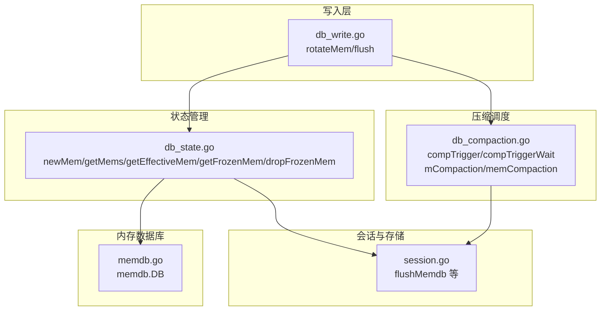
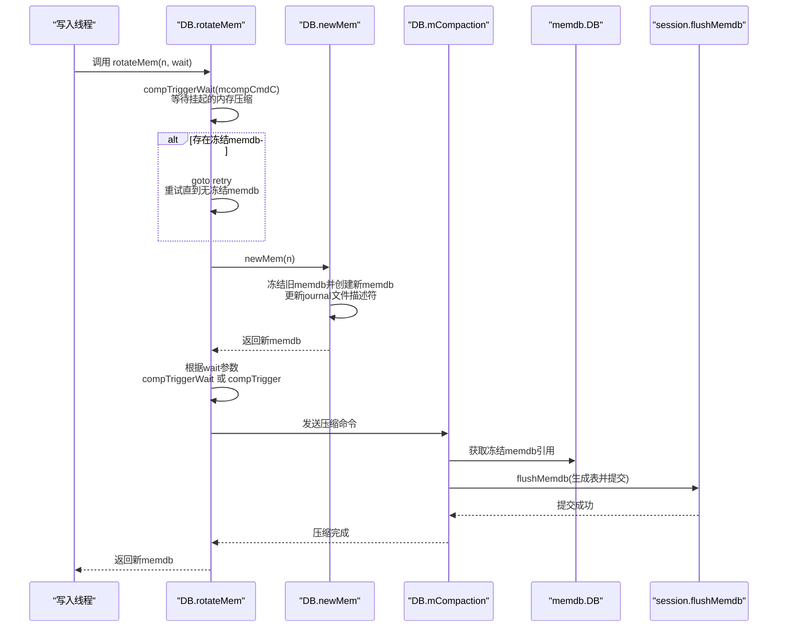
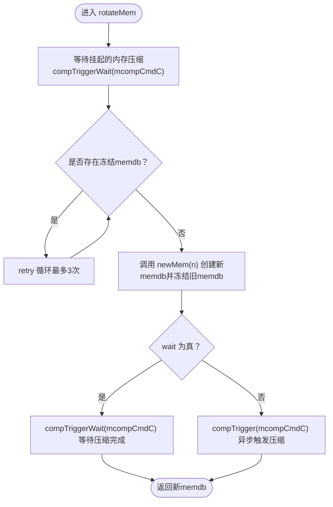
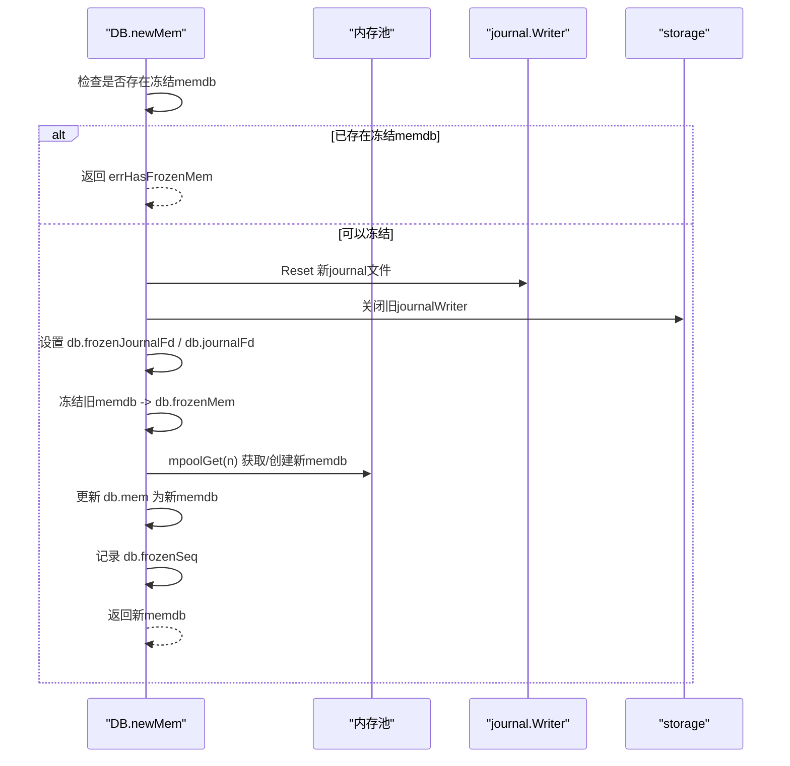
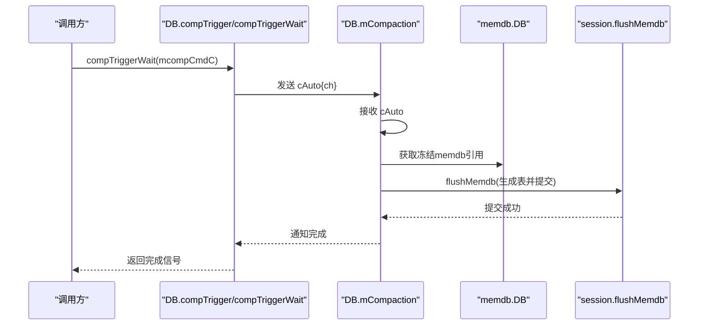
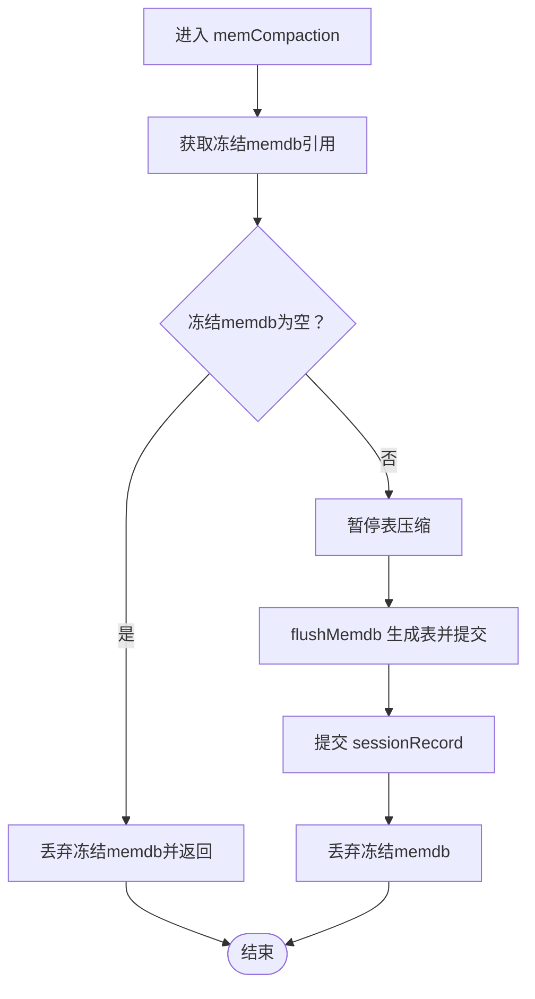
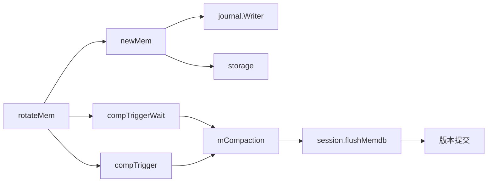

# 缓冲区轮换（rotateMem）机制

<cite>
**本文引用的文件列表**
- [db_write.go](file://leveldb/db_write.go)
- [db_state.go](file://leveldb/db_state.go)
- [db_compaction.go](file://leveldb/db_compaction.go)
- [memdb.go](file://leveldb/memdb/memdb.go)
- [session.go](file://leveldb/session.go)
</cite>

## 目录
1. [引言](#引言)
2. [项目结构](#项目结构)
3. [核心组件](#核心组件)
4. [架构总览](#架构总览)
5. [详细组件分析](#详细组件分析)
6. [依赖关系分析](#依赖关系分析)
7. [性能考量](#性能考量)
8. [故障排查指南](#故障排查指南)
9. [结论](#结论)

## 引言
本指南聚焦于 avccDB 的“缓冲区轮换”机制，围绕 rotateMem 方法展开，系统性解析以下关键点：
- 当前 memdb 被填满或需要刷新时，系统如何调用 rotateMem 创建新 memdb 实例，并将旧 memdb 标记为只读（frozen），从而触发其向磁盘的持久化过程；
- 代码中的 retry 逻辑：在存在冻结的 memdb 时如何进行重试；
- 通过 compTriggerWait 和 compTrigger 如何调度内存数据库的压缩任务；
- wait 参数的作用：轮换后是立即等待压缩完成（同步）还是异步触发压缩；
- 该机制如何实现写入操作与磁盘 I/O 操作的解耦，保证写入的高吞吐量。

## 项目结构
围绕缓冲区轮换机制，涉及的关键模块包括：
- 写入与轮换：db_write.go 中的 rotateMem、flush 等；
- 冻结与切换：db_state.go 中的 newMem、getMems/getEffectiveMem/getFrozenMem、dropFrozenMem；
- 压缩调度与执行：db_compaction.go 中的 compTrigger/compTriggerWait、mCompaction、memCompaction；
- 内存数据库：leveldb/memdb/memdb.go；
- 会话与存储：leveldb/session.go。

图表来源
- [db_write.go](file://leveldb/db_write.go#L35-L131)
- [db_state.go](file://leveldb/db_state.go#L120-L210)
- [db_compaction.go](file://leveldb/db_compaction.go#L729-L757)
- [memdb.go](file://leveldb/memdb/memdb.go#L182-L210)
- [session.go](file://leveldb/session.go#L1-L120)

章节来源
- [db_write.go](file://leveldb/db_write.go#L35-L131)
- [db_state.go](file://leveldb/db_state.go#L120-L210)
- [db_compaction.go](file://leveldb/db_compaction.go#L729-L757)
- [memdb.go](file://leveldb/memdb/memdb.go#L182-L210)
- [session.go](file://leveldb/session.go#L1-L120)

## 核心组件
- rotateMem：负责在写入压力下触发 memdb 轮换，创建新的 memdb 并冻结旧 memdb；根据 wait 参数决定是否同步等待压缩完成。
- newMem：在冻结旧 memdb 后创建新的 memdb 实例并更新 journal 文件句柄。
- compTrigger/compTriggerWait：用于向压缩调度器发送命令并可选择等待完成。
- memCompaction/memdb@flush：冻结的 memdb 压缩流程，生成表并提交到版本记录。
- memdb.DB：内存键值存储，提供 Put/Delete/Get/Size/Len/Capacity 等能力。

章节来源
- [db_write.go](file://leveldb/db_write.go#L35-L64)
- [db_state.go](file://leveldb/db_state.go#L120-L180)
- [db_compaction.go](file://leveldb/db_compaction.go#L729-L757)
- [memdb.go](file://leveldb/memdb/memdb.go#L273-L340)

## 架构总览
下面以序列图展示一次典型的轮换与压缩流程，从写入侧调用 rotateMem 开始，到冻结 memdb 的压缩完成为止。

图表来源
- [db_write.go](file://leveldb/db_write.go#L35-L64)
- [db_state.go](file://leveldb/db_state.go#L120-L180)
- [db_compaction.go](file://leveldb/db_compaction.go#L781-L811)
- [memdb.go](file://leveldb/memdb/memdb.go#L182-L210)
- [session.go](file://leveldb/session.go#L1-L120)

## 详细组件分析

### rotateMem 执行流程与 retry 逻辑
- 入口：rotateMem 接收两个参数：n（建议容量）、wait（是否等待压缩完成）。
- 步骤一：调用 compTriggerWait(mcompCmdC)，确保没有挂起的内存压缩任务在排队，避免竞争。
- 步骤二：调用 newMem(n) 创建新 memdb 并冻结旧 memdb。如果此时仍存在冻结的 memdb（errHasFrozenMem），则进入 retry 循环最多 3 次，直至成功。
- 步骤三：根据 wait 参数决定压缩调度方式：
  - wait=true：调用 compTriggerWait(mcompCmdC) 等待压缩完成；
  - wait=false：调用 compTrigger(mcompCmdC) 异步触发压缩。
- 返回：返回新创建的 memdb。

图表来源
- [db_write.go](file://leveldb/db_write.go#L35-L64)
- [db_state.go](file://leveldb/db_state.go#L120-L180)
- [db_compaction.go](file://leveldb/db_compaction.go#L729-L757)

章节来源
- [db_write.go](file://leveldb/db_write.go#L35-L64)
- [db_state.go](file://leveldb/db_state.go#L120-L180)

### newMem：冻结旧 memdb 与创建新 memdb
- newMem 在冻结旧 memdb 的同时创建新的 memdb 实例，并更新 journal 文件描述符与写入器。
- 关键点：
  - 若当前已存在冻结的 memdb，则直接返回错误（errHasFrozenMem），供上层 retry 使用；
  - 将 db.mem 设为新 memdb，并将 db.frozenMem 指向旧 memdb；
  - 记录 db.frozenSeq 为冻结时刻的序列号，供后续压缩提交使用；
  - 通过 mpoolGet 从内存池中获取或新建 memdb，确保容量满足要求。

图表来源
- [db_state.go](file://leveldb/db_state.go#L120-L180)

章节来源
- [db_state.go](file://leveldb/db_state.go#L120-L180)

### 压缩调度：compTrigger 与 compTriggerWait
- compTrigger：向压缩通道发送一个自动压缩命令（cAuto），不等待完成，适合异步触发。
- compTriggerWait：发送 cAuto 并阻塞等待完成信号，适合需要同步等待的场景（如 rotateMem(wait=true)）。
- mCompaction：内存压缩协程循环，接收 cAuto 后调用 memCompaction 执行实际压缩。

图表来源
- [db_compaction.go](file://leveldb/db_compaction.go#L729-L757)
- [db_compaction.go](file://leveldb/db_compaction.go#L781-L811)

章节来源
- [db_compaction.go](file://leveldb/db_compaction.go#L729-L757)
- [db_compaction.go](file://leveldb/db_compaction.go#L781-L811)

### 冻结 memdb 的压缩执行：memCompaction 与 memdb@flush
- memCompaction：
  - 获取冻结 memdb 引用；
  - 如果为空则直接丢弃冻结 memdb；
  - 暂停表压缩（tCompaction），避免与内存压缩冲突；
  - 调用 session.flushMemdb 将冻结 memdb 内容写入磁盘表；
  - 提交 sessionRecord，记录新表与当前 journal 序列号；
  - 完成后丢弃冻结 memdb。
- memdb@flush：由 session.flushMemdb 实现，负责将 memdb 数据转换为磁盘上的表文件，并更新版本记录。

图表来源
- [db_compaction.go](file://leveldb/db_compaction.go#L269-L327)
- [session.go](file://leveldb/session.go#L1-L120)

章节来源
- [db_compaction.go](file://leveldb/db_compaction.go#L269-L327)
- [session.go](file://leveldb/session.go#L1-L120)

### wait 参数的作用与写入吞吐保障
- wait=true：在 rotateMem 中调用 compTriggerWait，会阻塞写入线程直到内存压缩完成。适用于对一致性有强需求但可接受短时延迟的场景。
- wait=false：在 rotateMem 中调用 compTrigger，异步触发压缩，写入线程无需等待，能显著提升写入吞吐量。
- flush 流程中也体现了类似的权衡：当写入过快导致 L0 表过多时，flush 会通过 compTriggerWait 暂停写入并等待表压缩完成，缓解写放大；否则允许 rotateMem 异步轮换，维持高吞吐。

章节来源
- [db_write.go](file://leveldb/db_write.go#L66-L131)
- [db_write.go](file://leveldb/db_write.go#L35-L64)

### 与内存数据库（memdb）的关系
- memdb.DB 提供并发安全的 Put/Delete/Get/Size/Len/Capacity 等接口；
- 在 newMem 中，冻结的是 memdb.DB 的实例，而非其内容；
- memdb 的容量与增长策略影响轮换频率与压缩规模。

章节来源
- [memdb.go](file://leveldb/memdb/memdb.go#L273-L340)
- [memdb.go](file://leveldb/memdb/memdb.go#L411-L480)

## 依赖关系分析
- rotateMem 依赖 compTriggerWait/newMem/compTrigger；
- newMem 依赖 journal.Writer 与存储层，同时维护 db.mem/db.frozenMem；
- memCompaction 依赖 session.flushMemdb 与版本提交；
- 整体通过通道（mcompCmdC/tcompCmdC）实现写入与压缩的解耦。

图表来源
- [db_write.go](file://leveldb/db_write.go#L35-L64)
- [db_state.go](file://leveldb/db_state.go#L120-L180)
- [db_compaction.go](file://leveldb/db_compaction.go#L729-L757)
- [db_compaction.go](file://leveldb/db_compaction.go#L781-L811)
- [session.go](file://leveldb/session.go#L1-L120)

章节来源
- [db_write.go](file://leveldb/db_write.go#L35-L64)
- [db_state.go](file://leveldb/db_state.go#L120-L180)
- [db_compaction.go](file://leveldb/db_compaction.go#L729-L757)
- [db_compaction.go](file://leveldb/db_compaction.go#L781-L811)
- [session.go](file://leveldb/session.go#L1-L120)

## 性能考量
- 异步轮换（wait=false）可显著降低写入延迟，提高吞吐；
- compTriggerWait 会在写入过快时暂停写入，等待表压缩完成，避免 L0 过载；
- 冻结 memdb 的压缩采用事务式提交，失败可回滚，减少数据损坏风险；
- 内存池复用 memdb，减少频繁分配带来的 GC 压力。

[本节为通用性能讨论，不直接分析具体文件]

## 故障排查指南
- 问题：频繁出现“仍有冻结 memdb”的错误
  - 可能原因：压缩协程未及时处理冻结 memdb，或压缩过程中发生错误；
  - 处理建议：检查 mCompaction 是否正常运行，确认 compTriggerWait 是否被正确消费；查看压缩错误通道与持久化日志。
- 问题：写入延迟增大
  - 可能原因：wait=true 导致写入阻塞；或 L0 表过多触发了 flush 中的 compTriggerWait；
  - 处理建议：评估业务对一致性的需求，必要时改为 wait=false；调整压缩阈值与写缓冲大小。
- 问题：压缩失败或卡住
  - 可能原因：存储层错误、磁盘空间不足、压缩回滚失败；
  - 处理建议：查看压缩错误通道与日志，定位具体错误类型并修复存储或磁盘问题。

章节来源
- [db_compaction.go](file://leveldb/db_compaction.go#L147-L235)
- [db_compaction.go](file://leveldb/db_compaction.go#L781-L811)

## 结论
avccDB 的缓冲区轮换机制通过 rotateMem 将写入与磁盘 I/O 解耦：写入线程仅负责创建新 memdb 并冻结旧 memdb，随后根据 wait 参数选择同步或异步压缩。compTriggerWait 与 compTrigger 提供了灵活的调度策略，配合 memCompaction 的事务式提交，既保证了高吞吐，又能在必要时提供强一致的落盘保障。retry 逻辑确保在冻结 memdb 未释放时的安全重试，避免竞态条件。整体设计在性能与可靠性之间取得良好平衡。