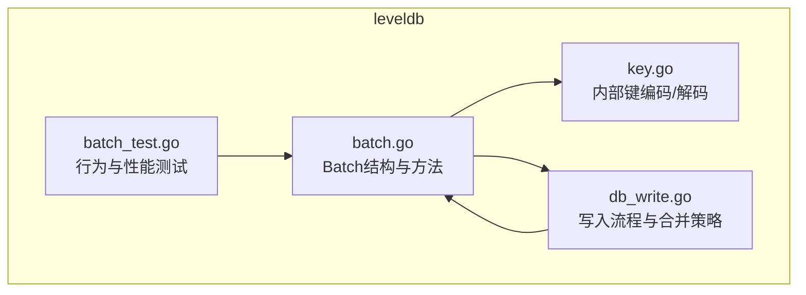
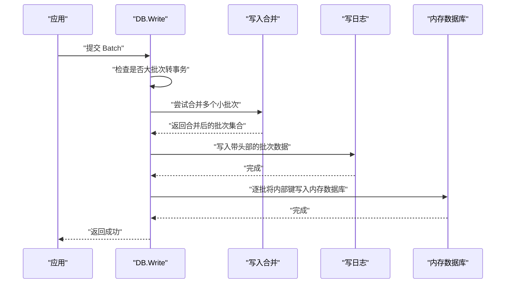
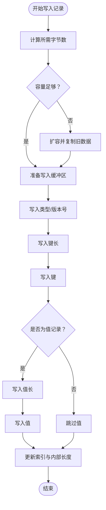
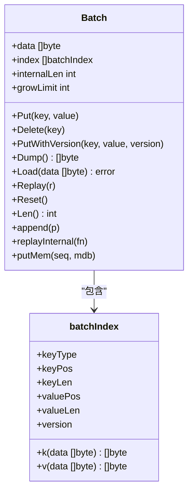
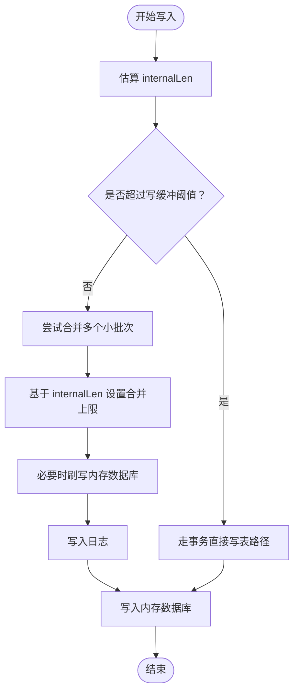
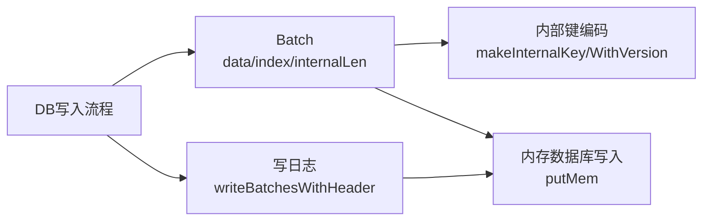

# Batch结构详解

<cite>
**本文引用的文件**
- [leveldb/batch.go](file://leveldb/batch.go)
- [leveldb/key.go](file://leveldb/key.go)
- [leveldb/db_write.go](file://leveldb/db_write.go)
- [leveldb/batch_test.go](file://leveldb/batch_test.go)
</cite>

## 目录
1. [简介](#简介)
2. [项目结构](#项目结构)
3. [核心组件](#核心组件)
4. [架构总览](#架构总览)
5. [详细组件分析](#详细组件分析)
6. [依赖关系分析](#依赖关系分析)
7. [性能考量](#性能考量)
8. [故障排查指南](#故障排查指南)
9. [结论](#结论)

## 简介
本文件围绕 avccDB 中的 Batch 结构体进行深入解析，重点阐释其三个关键字段：data（字节缓冲区）、index（索引数组）与 internalLen（内部键总长度）。我们将从设计原理、数据组织方式、读写流程、性能影响等维度展开，帮助读者理解 Batch 在批量写入场景下的高效组织与调度机制。

## 项目结构
Batch 结构体位于 leveldb 子模块中，配合内部键编码工具与写入路径共同工作：
- Batch 定义与序列化/反序列化逻辑集中在 batch.go
- 内部键格式与编码/解码逻辑集中在 key.go
- 写入路径（合并、落盘、内存写入）集中在 db_write.go
- 单元测试覆盖了 Batch 的行为与性能特性，集中在 batch_test.go

图表来源
- [leveldb/batch.go](file://leveldb/batch.go#L62-L135)
- [leveldb/key.go](file://leveldb/key.go#L75-L104)
- [leveldb/db_write.go](file://leveldb/db_write.go#L154-L265)
- [leveldb/batch_test.go](file://leveldb/batch_test.go#L33-L118)

章节来源
- [leveldb/batch.go](file://leveldb/batch.go#L62-L135)
- [leveldb/key.go](file://leveldb/key.go#L75-L104)
- [leveldb/db_write.go](file://leveldb/db_write.go#L154-L265)
- [leveldb/batch_test.go](file://leveldb/batch_test.go#L33-L118)

## 核心组件
- Batch 结构体
  - data：字节缓冲区，按记录顺序存储序列化的键值操作记录
  - index：索引数组，记录每条记录在 data 中的偏移与长度信息，便于零拷贝访问
  - internalLen：内部键总长度估算，用于写入合并与内存压力控制
  - growLimit：增长阈值，控制扩容节奏，避免频繁分配
- 关键方法
  - Put/Delete/PutWithVersion：追加记录到 Batch
  - Dump/Load：导出/载入 Batch 的原始字节流
  - Replay/replayInternal：重放 Batch 记录
  - append/decode：拼接与解析 Batch
  - putMem：将 Batch 转换为内部键并写入内存数据库
  - Reset/grow：重置与动态扩容

章节来源
- [leveldb/batch.go](file://leveldb/batch.go#L62-L135)
- [leveldb/batch.go](file://leveldb/batch.go#L138-L156)
- [leveldb/batch.go](file://leveldb/batch.go#L160-L183)
- [leveldb/batch.go](file://leveldb/batch.go#L191-L223)
- [leveldb/batch.go](file://leveldb/batch.go#L225-L256)

## 架构总览
Batch 在写入链路中的位置与交互如下：

图表来源
- [leveldb/db_write.go](file://leveldb/db_write.go#L274-L329)
- [leveldb/db_write.go](file://leveldb/db_write.go#L154-L265)
- [leveldb/batch.go](file://leveldb/batch.go#L401-L411)
- [leveldb/batch.go](file://leveldb/batch.go#L243-L256)

## 详细组件分析

### 数据组织：data 字段作为字节缓冲区
- 记录格式
  - 每条记录以“类型 + 可变长键长 + 键 + 可变长值长 + 值”或“类型 + 可变长键长 + 键”的形式顺序存储
  - 类型使用单字节标识（删除/值）
  - 键长与值长均采用可变长整数编码，节省空间
- 写入流程要点
  - 追加前先根据预估长度触发 grow 扩容
  - 写入类型、版本号（可选）、键长、键、值长（可选）、值
  - 更新 index 记录键/值在 data 中的起始偏移与长度
  - 同步更新 internalLen（含内部键开销）
- 优势
  - 零拷贝访问：通过 index.k()/index.v() 直接从 data 提取键/值切片
  - 序列化紧凑：可变长编码减少冗余
  - 可增量解析：decode 函数按记录边界逐步推进

图表来源
- [leveldb/batch.go](file://leveldb/batch.go#L76-L135)
- [leveldb/batch.go](file://leveldb/batch.go#L304-L344)

章节来源
- [leveldb/batch.go](file://leveldb/batch.go#L76-L135)
- [leveldb/batch.go](file://leveldb/batch.go#L304-L344)

### 索引组织：index 字段作为快速定位器
- batchIndex 字段
  - keyType：记录类型（删除/值）
  - keyPos/keyLen：键在 data 中的偏移与长度
  - valuePos/valueLen：值在 data 中的偏移与长度（删除记录为 0）
  - version：版本号（可选）
- 访问方式
  - index.k(data)/index.v(data)：零拷贝提取键/值
  - Replay/replayInternal：遍历 index 重放记录
- 组合与偏移修正
  - append(p) 将另一个 Batch 拼接到当前 Batch 时，会同步修正新记录在 index 中的 keyPos/valuePos 偏移

图表来源
- [leveldb/batch.go](file://leveldb/batch.go#L44-L61)
- [leveldb/batch.go](file://leveldb/batch.go#L62-L74)
- [leveldb/batch.go](file://leveldb/batch.go#L173-L183)
- [leveldb/batch.go](file://leveldb/batch.go#L197-L204)
- [leveldb/batch.go](file://leveldb/batch.go#L206-L223)

章节来源
- [leveldb/batch.go](file://leveldb/batch.go#L44-L61)
- [leveldb/batch.go](file://leveldb/batch.go#L173-L183)
- [leveldb/batch.go](file://leveldb/batch.go#L197-L204)
- [leveldb/batch.go](file://leveldb/batch.go#L206-L223)

### 内部长度：internalLen 的高效估算
- 定义与用途
  - internalLen 是对“所有记录的键/值长度之和 + 内部键开销”的累计估算
  - 用于写入合并决策、内存压力判断与大批次写入路径选择
- 计算规则
  - 每条记录：keyLen + valueLen + 8（非版本内部键开销）
  - 版本内部键：额外 +8（版本字段）
- 使用点
  - DB.flush：基于 internalLen 判断是否需要刷写内存数据库
  - 写入合并：限制合并目标的 internalLen 上限
  - 大批次路径：当 internalLen 超过写缓冲阈值时，走事务直接写表路径

图表来源
- [leveldb/db_write.go](file://leveldb/db_write.go#L154-L265)
- [leveldb/db_write.go](file://leveldb/db_write.go#L274-L329)
- [leveldb/batch.go](file://leveldb/batch.go#L129-L135)

章节来源
- [leveldb/db_write.go](file://leveldb/db_write.go#L154-L265)
- [leveldb/db_write.go](file://leveldb/db_write.go#L274-L329)
- [leveldb/batch.go](file://leveldb/batch.go#L129-L135)

### 实际写入过程中的数据组织示例
- Put/Delete/PutWithVersion 的调用会依次将记录写入 data，并在 index 中登记偏移与长度
- Dump 返回 data，供外部持久化或网络传输；Load 将外部数据解码回 Batch
- Replay 将 Batch 记录重放到实现了 BatchReplay 接口的对象（如内存数据库）

章节来源
- [leveldb/batch.go](file://leveldb/batch.go#L138-L156)
- [leveldb/batch.go](file://leveldb/batch.go#L160-L171)
- [leveldb/batch.go](file://leveldb/batch.go#L173-L183)

### 性能影响与优化
- 动态扩容策略（grow）
  - 当剩余容量不足时，按“指数级 + 限额分摊”的策略扩容，降低频繁分配成本
  - growLimit 控制每轮扩容上限，避免在大量记录时一次性分配过多内存
- 内部键开销估算
  - internalLen 估算包含 8 字节内部键开销，有助于更准确地评估内存占用与合并阈值
- 写入合并
  - DB.writeLocked 会尝试合并多个小 Batch，减少日志写入次数与内存数据库写入次数
  - 合并上限由 batch.internalLen 与可用内存决定
- 大批次路径
  - 当 batch.internalLen 超过写缓冲阈值时，DB.Write 会转为事务路径，绕过日志直接写表，降低日志开销

章节来源
- [leveldb/batch.go](file://leveldb/batch.go#L76-L91)
- [leveldb/batch.go](file://leveldb/batch.go#L290-L301)
- [leveldb/db_write.go](file://leveldb/db_write.go#L154-L265)
- [leveldb/db_write.go](file://leveldb/db_write.go#L274-L329)

## 依赖关系分析
- Batch 与内部键编码
  - putMem 将每条记录转换为内部键后写入内存数据库
  - makeInternalKey/makeInternalKeyWithVersion 决定了内部键布局与解析
- Batch 与写入路径
  - DB.Write/DB.writeLocked 调用 Batch 的 replayInternal/putMem，形成“序列化记录 -> 内部键 -> 内存数据库”的完整链路
  - writeBatchesWithHeader 将多个 Batch 的 data 连续写出，形成统一的日志流

图表来源
- [leveldb/batch.go](file://leveldb/batch.go#L243-L256)
- [leveldb/key.go](file://leveldb/key.go#L75-L104)
- [leveldb/db_write.go](file://leveldb/db_write.go#L17-L31)
- [leveldb/db_write.go](file://leveldb/db_write.go#L401-L411)

章节来源
- [leveldb/batch.go](file://leveldb/batch.go#L243-L256)
- [leveldb/key.go](file://leveldb/key.go#L75-L104)
- [leveldb/db_write.go](file://leveldb/db_write.go#L17-L31)
- [leveldb/db_write.go](file://leveldb/db_write.go#L401-L411)

## 性能考量
- 批量写入的吞吐与延迟
  - 合理设置 BatchConfig 的 InitialCapacity 与 GrowLimit 可显著降低分配次数
  - 测试用例展示了不同 GrowLimit 对写入性能的影响
- 内存占用控制
  - internalLen 估算越准确，写入合并与刷写时机越合理，整体内存峰值更低
- 日志与内存写入次数
  - 合并多个小 Batch 可减少日志写入与内存数据库写入次数，提升吞吐

章节来源
- [leveldb/batch_test.go](file://leveldb/batch_test.go#L150-L179)
- [leveldb/batch.go](file://leveldb/batch.go#L290-L301)
- [leveldb/db_write.go](file://leveldb/db_write.go#L154-L265)

## 故障排查指南
- 常见错误与定位
  - 批次损坏：decode/decodeBatchHeader 在记录长度或类型不合法时返回错误
  - 内部键损坏：parseInternalKey/WithVersion 在长度或类型非法时返回错误
  - 写入合并溢出：当合并目标超出限制时，DB.writeLocked 会标记 overflow 并继续处理
- 建议排查步骤
  - 使用 Load/Dump 导出/导入验证批次内容一致性
  - 通过 Replay 验证记录重放是否正确
  - 检查 GrowLimit 设置是否过低导致频繁扩容
  - 关注 internalLen 是否异常增大（例如大量版本键）

章节来源
- [leveldb/batch.go](file://leveldb/batch.go#L225-L241)
- [leveldb/batch.go](file://leveldb/batch.go#L381-L392)
- [leveldb/key.go](file://leveldb/key.go#L106-L132)
- [leveldb/db_write.go](file://leveldb/db_write.go#L154-L265)

## 结论
Batch 结构通过 data 的紧凑序列化、index 的零拷贝索引与 internalLen 的精确估算，构建了高效的批量写入基础设施。它不仅简化了记录的组织与访问，还在写入合并、内存压力控制与大批次路径选择中发挥关键作用。合理配置 BatchConfig 与关注 internalLen 的变化，是获得稳定高吞吐性能的重要手段。