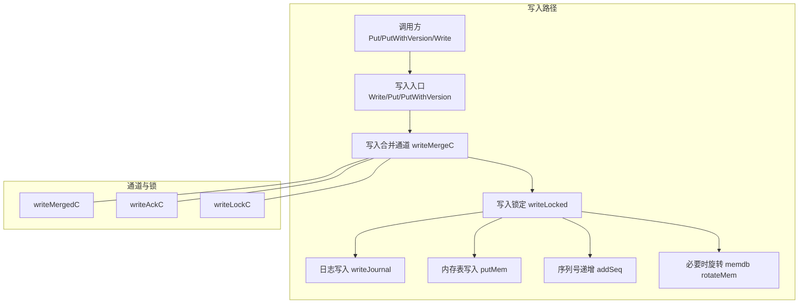
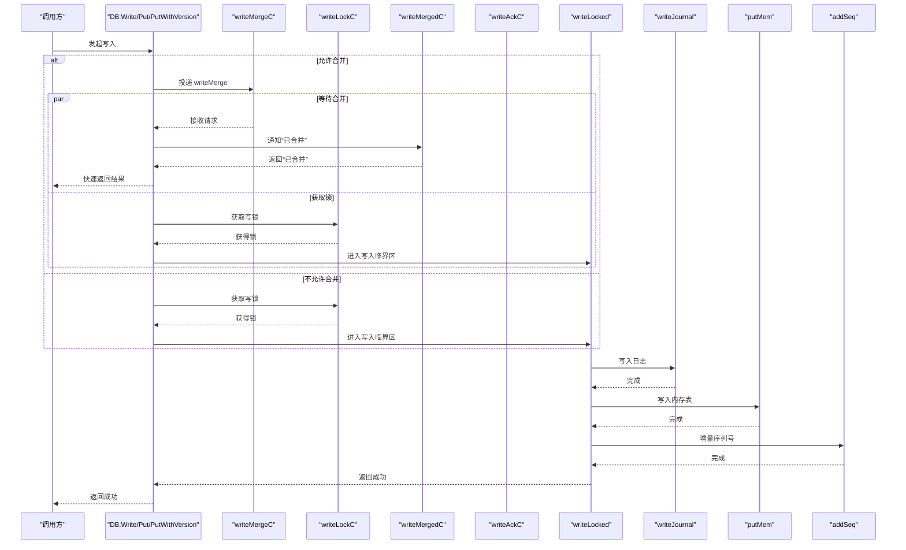
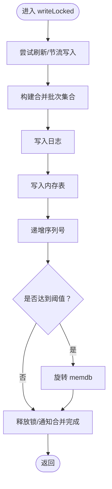
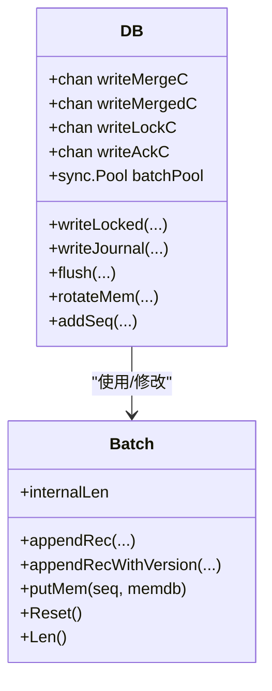

# 写入合并机制

<cite>
**本文引用的文件列表**
- [leveldb/db_write.go](file://leveldb/db_write.go)
- [leveldb/db.go](file://leveldb/db.go)
- [leveldb/batch.go](file://leveldb/batch.go)
- [leveldb/db_test.go](file://leveldb/db_test.go)
</cite>

## 目录
1. [引言](#引言)
2. [项目结构](#项目结构)
3. [核心组件](#核心组件)
4. [架构总览](#架构总览)
5. [详细组件分析](#详细组件分析)
6. [依赖关系分析](#依赖关系分析)
7. [性能考量](#性能考量)
8. [故障排查指南](#故障排查指南)
9. [结论](#结论)

## 引言
本技术文档聚焦于 avccDB 的写入合并（write merge）机制，系统性解析 writeMerge 结构体的设计、writeMergeC 通道如何在高并发场景下协调多个写入请求的合并、sync 字段如何确保同步写入的一致性，以及 version 字段如何支持版本化数据的原子写入。文档通过流程图与序列图展示从多个 Put 请求被合并为单个批量写入的完整过程，并结合 db_write.go 中的 writeLocked 方法说明合并后的写入如何被原子提交。

## 项目结构
本次分析涉及的核心文件：
- 写入合并与锁协调：leveldb/db_write.go
- 数据库结构与通道定义：leveldb/db.go
- 批处理与内部键生成：leveldb/batch.go
- 并发一致性测试参考：leveldb/db_test.go

图表来源
- [leveldb/db_write.go](file://leveldb/db_write.go#L133-L266)
- [leveldb/db.go](file://leveldb/db.go#L67-L76)

章节来源
- [leveldb/db_write.go](file://leveldb/db_write.go#L133-L266)
- [leveldb/db.go](file://leveldb/db.go#L67-L76)

## 核心组件
- writeMerge 结构体：承载一次写入请求的元信息，包括是否需要同步、批量或单条记录、键类型、键值、版本号等。
- writeMergeC 通道：用于收集可合并的写入请求，实现“多路聚合”。
- writeMergedC 通道：用于通知发起者“写入已被合并”，从而快速返回。
- writeAckC 通道：用于向所有参与合并的写入请求发送最终结果。
- writeLockC 通道：用于串行化写入，避免竞争。
- writeLocked 方法：执行合并后的批量写入，保证原子性与一致性。

章节来源
- [leveldb/db_write.go](file://leveldb/db_write.go#L133-L152)
- [leveldb/db_write.go](file://leveldb/db_write.go#L154-L266)
- [leveldb/db.go](file://leveldb/db.go#L67-L76)

## 架构总览
写入合并的整体流程如下：
- 调用方通过 Write/Put/PutWithVersion 发起写入。
- 若允许合并且未关闭写入合并，则尝试将请求投递到 writeMergeC；否则直接获取 writeLockC。
- 在 writeLocked 中循环从 writeMergeC 消费请求，构建合并后的批次集合。
- 将合并后的批次写入日志并写入内存表，最后统一递增序列号并按需旋转 memdb。
- 通过 writeMergedC 与 writeAckC 向所有参与者返回结果。

图表来源
- [leveldb/db_write.go](file://leveldb/db_write.go#L268-L439)
- [leveldb/db_write.go](file://leveldb/db_write.go#L154-L266)

## 详细组件分析

### writeMerge 结构体设计
writeMerge 是写入合并的核心载体，包含以下字段：
- sync：布尔标志，表示该写入是否需要同步落盘。
- batch：批量对象指针，当为非空时表示合并一个 Batch。
- keyType/key/value：当 batch 为空时，表示一条单条 Put/Delete 记录。
- version：版本号，用于支持版本化数据的写入。

设计要点：
- 单条写入与批量写入共享同一通道，通过 batch 是否为空进行区分。
- 版本号字段支持 PutWithVersion 的语义，便于后续排序与查询。

章节来源
- [leveldb/db_write.go](file://leveldb/db_write.go#L133-L139)

### writeMergeC 通道的合并协调
writeMergeC 作为“写入合并收集器”，在 writeLocked 中以 select 循环消费：
- 对于批量请求：若合并后总长度仍小于剩余容量，则加入批次集合。
- 对于单条请求：计算其内部长度（含键、值、内部键头），若不超过剩余容量则追加到临时 Batch。
- 合并过程中会累积合并数量与更新 sync 标志（任一请求要求同步都会触发同步）。
- 通过 writeMergedC 通知发起者“已合并”，随后通过 writeAckC 返回结果。

性能优化点：
- 合并上限基于当前 memdb 可用空间与阈值动态计算，避免过度合并导致内存压力。
- 使用 select 非阻塞轮询，尽可能在短时间内聚合更多请求。

章节来源
- [leveldb/db_write.go](file://leveldb/db_write.go#L171-L229)

### sync 字段与同步一致性
- 合并期间，若任意请求要求同步（sync=true），则最终写入会强制同步落盘。
- 日志写入阶段根据 sync 参数决定是否调用底层同步接口。
- 这确保了在高并发合并场景下，只要有一个请求要求强一致，整批合并写入都会满足同步约束。

章节来源
- [leveldb/db_write.go](file://leveldb/db_write.go#L180-L223)
- [leveldb/db_write.go](file://leveldb/db_write.go#L18-L33)

### version 字段与版本化原子写入
- 当 version > 0 时，appendRecWithVersion 会在 Batch 中记录版本信息，并相应调整 internalLen。
- writeLocked 在写入内存表时，会使用带版本的内部键生成逻辑，确保版本化记录的正确性。
- 合并后的批次在写入内存表时，按批次内顺序依次分配序列号，保证版本化写入的原子性与顺序性。

章节来源
- [leveldb/batch.go](file://leveldb/batch.go#L98-L136)
- [leveldb/batch.go](file://leveldb/batch.go#L244-L257)
- [leveldb/db_write.go](file://leveldb/db_write.go#L196-L219)

### writeLocked 的原子提交流程
writeLocked 是合并后写入的唯一入口，负责：
- 刷新 memdb 并进行写入节流（flush），避免写入过快导致 compaction 无法跟上。
- 写入日志（writeJournal），确保崩溃恢复能力。
- 将合并后的批次逐个写入内存表（putMem），并按批次长度推进序列号。
- 最后递增全局序列号（addSeq），并在必要时旋转 memdb（rotateMem）。

图表来源
- [leveldb/db_write.go](file://leveldb/db_write.go#L154-L266)

章节来源
- [leveldb/db_write.go](file://leveldb/db_write.go#L154-L266)

### 并发一致性与通道交互
- writeLockC 为有界缓冲通道（大小为1），确保同一时刻仅有一个写入线程处于临界区。
- writeMergedC 用于通知发起者“写入已被合并”，避免重复获取锁。
- writeAckC 用于向所有参与合并的写入请求返回最终错误状态，保证所有参与者都能感知结果。
- unlockWrite 统一处理溢出与锁释放逻辑，避免死锁。

章节来源
- [leveldb/db_write.go](file://leveldb/db_write.go#L141-L152)
- [leveldb/db.go](file://leveldb/db.go#L67-L76)

### Put/PutWithVersion/Write 的入口行为
- Write：若批量过大且允许大批次事务，则转为事务路径；否则走合并路径。
- Put/PutWithVersion：构造单条记录并走合并路径；PutWithVersion 会携带版本号。
- 三者均会根据 WriteOptions 与全局选项决定是否启用合并与同步。

章节来源
- [leveldb/db_write.go](file://leveldb/db_write.go#L268-L439)

## 依赖关系分析
- DB 结构体持有写入相关的通道与池化资源，包括 writeMergeC、writeMergedC、writeLockC、writeAckC、batchPool。
- writeLocked 依赖 flush、writeJournal、putMem、addSeq、rotateMem 等方法。
- Batch 提供 appendRec/appendRecWithVersion、putMem 等能力，支撑版本化与批量写入。

图表来源
- [leveldb/db.go](file://leveldb/db.go#L67-L76)
- [leveldb/batch.go](file://leveldb/batch.go#L62-L136)
- [leveldb/batch.go](file://leveldb/batch.go#L244-L257)
- [leveldb/db_write.go](file://leveldb/db_write.go#L154-L266)

章节来源
- [leveldb/db.go](file://leveldb/db.go#L67-L76)
- [leveldb/batch.go](file://leveldb/batch.go#L62-L136)
- [leveldb/batch.go](file://leveldb/batch.go#L244-L257)
- [leveldb/db_write.go](file://leveldb/db_write.go#L154-L266)

## 性能考量
- 合并窗口控制：writeLocked 通过合并上限与 memdb 可用空间限制合并规模，避免内存峰值。
- 非阻塞聚合：select 默认分支使合并循环在无可用请求时及时退出，降低等待成本。
- 池化复用：Batch 通过 sync.Pool 复用，减少频繁分配带来的 GC 压力。
- 大批量路径：Write 对超大批量采用事务路径，跳过日志写入，提高吞吐。
- 同步策略：仅在任一请求要求同步时才进行同步落盘，平衡一致性与性能。

章节来源
- [leveldb/db_write.go](file://leveldb/db_write.go#L171-L229)
- [leveldb/db_write.go](file://leveldb/db_write.go#L268-L330)
- [leveldb/batch.go](file://leveldb/batch.go#L62-L96)

## 故障排查指南
- 合并失败或溢出：若合并请求导致超出剩余容量，writeLocked 会设置溢出标记并通过 writeMergedC 通知下一个写入接管锁，避免死锁。
- 错误传播：unlockWrite 会向所有合并参与者发送错误，确保调用方感知异常。
- 并发读写冲突：确保通过 writeLockC 串行化写入，避免与读取/压缩等操作产生竞态。
- 版本化一致性：确认 Batch 的版本号与内部键生成逻辑一致，避免版本错乱。

章节来源
- [leveldb/db_write.go](file://leveldb/db_write.go#L141-L152)
- [leveldb/db_write.go](file://leveldb/db_write.go#L184-L229)

## 结论
writeMerge 机制通过 writeMergeC 通道在高并发场景下高效聚合多个写入请求，结合 writeLocked 的原子提交流程，实现了高性能、低延迟且强一致性的写入路径。sync 字段确保了强一致需求的满足，version 字段为版本化数据提供了基础能力。整体设计在保证正确性的同时，兼顾了吞吐与内存占用的平衡。