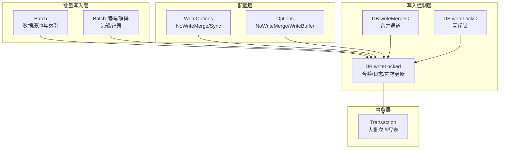
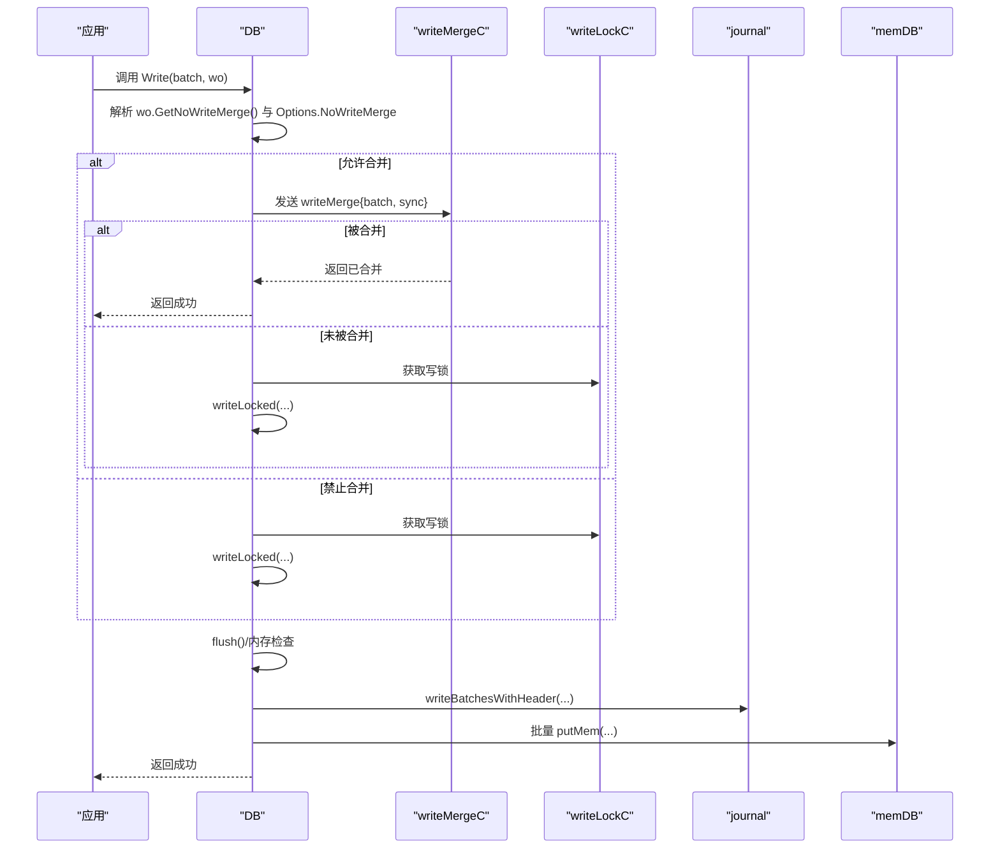
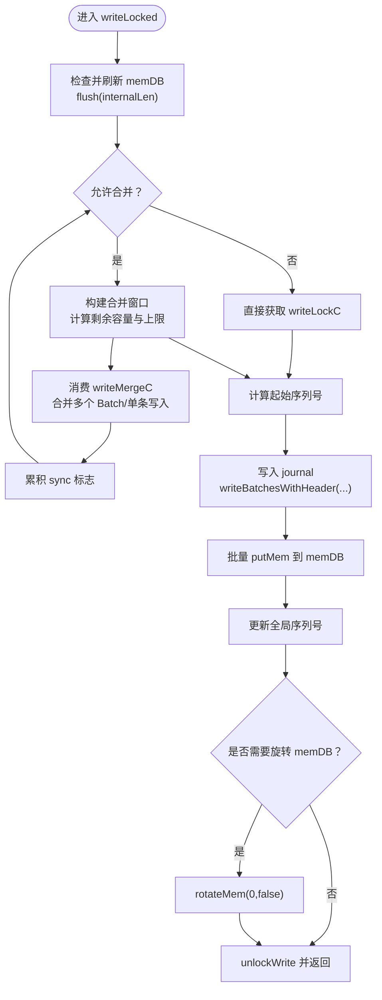
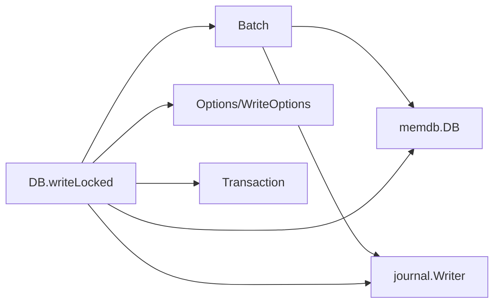

# 批量写入优化

<cite>
**本文引用的文件**
- [leveldb/batch.go](file://leveldb/batch.go)
- [leveldb/db_write.go](file://leveldb/db_write.go)
- [leveldb/opt/options.go](file://leveldb/opt/options.go)
- [leveldb/db_transaction.go](file://leveldb/db_transaction.go)
- [leveldb/db.go](file://leveldb/db.go)
- [leveldb/batch_test.go](file://leveldb/batch_test.go)
</cite>

## 目录
1. [简介](#简介)
2. [项目结构](#项目结构)
3. [核心组件](#核心组件)
4. [架构总览](#架构总览)
5. [详细组件分析](#详细组件分析)
6. [依赖关系分析](#依赖关系分析)
7. [性能考量](#性能考量)
8. [故障排查指南](#故障排查指南)
9. [结论](#结论)

## 简介
本指南围绕 avccDB 的批量写入（Batch）机制与写入合并（write merge）进行系统化剖析，目标是帮助读者理解：
- Batch 结构体的设计与内部缓冲区、索引与内部长度字段的作用
- WriteOptions 中 NoWriteMerge 选项如何影响写入合并行为
- 如何通过配置 WriteOptions 启用或禁用写入合并
- 批量写入的原子性保证机制
- 在高并发场景下，写入合并如何提升吞吐量
- 结合 db_write.go 中 writeLocked 方法，解析批量写入的完整流程：内存检查、日志写入与内存数据库更新

## 项目结构
与批量写入优化直接相关的模块主要集中在以下文件：
- 批量写入与编码解码：leveldb/batch.go
- 写入合并与写入流程控制：leveldb/db_write.go
- 配置项与选项读取：leveldb/opt/options.go
- 事务写入路径（大批次优化）：leveldb/db_transaction.go
- 数据库实例与通道协作：leveldb/db.go
- 批量写入行为验证与基准测试：leveldb/batch_test.go

图表来源
- [leveldb/batch.go](file://leveldb/batch.go#L63-L136)
- [leveldb/db_write.go](file://leveldb/db_write.go#L133-L266)
- [leveldb/opt/options.go](file://leveldb/opt/options.go#L366-L400)
- [leveldb/db_transaction.go](file://leveldb/db_transaction.go#L118-L167)
- [leveldb/db.go](file://leveldb/db.go#L68-L76)

章节来源
- [leveldb/batch.go](file://leveldb/batch.go#L63-L136)
- [leveldb/db_write.go](file://leveldb/db_write.go#L133-L266)
- [leveldb/opt/options.go](file://leveldb/opt/options.go#L366-L400)
- [leveldb/db_transaction.go](file://leveldb/db_transaction.go#L118-L167)
- [leveldb/db.go](file://leveldb/db.go#L68-L76)

## 核心组件
- Batch 结构体
  - data：字节缓冲区，存储序列化的记录（含变长键值、类型等）
  - index：batchIndex 数组，记录每条记录在 data 中的位置与长度，便于零拷贝访问
  - internalLen：累计“内部键长度”（包含键/值长度与固定开销），用于快速评估写入规模
  - growLimit：增长阈值，控制缓冲区扩容策略，避免频繁分配
- writeMerge 结构体
  - 用于在合并通道中传递单条写入或一个 Batch，以及同步标志
- DB 写入通道与锁
  - writeMergeC：写入合并通道
  - writeLockC：写入互斥锁
  - writeMergedC/writeAckC：合并确认与错误回传通道

章节来源
- [leveldb/batch.go](file://leveldb/batch.go#L44-L75)
- [leveldb/db_write.go](file://leveldb/db_write.go#L133-L152)
- [leveldb/db.go](file://leveldb/db.go#L68-L76)

## 架构总览
批量写入从应用侧发起，经过 WriteOptions 与 Options 的双重控制，进入 DB.writeLocked 流程。该流程会尝试合并多个写入请求，先进行内存可用性检查与限流，再统一写入日志，最后批量更新内存数据库。若单个 Batch 过大，DB.Write 会自动切换到事务模式，绕过日志直接写入表，从而降低写放大。

图表来源
- [leveldb/db_write.go](file://leveldb/db_write.go#L268-L330)
- [leveldb/db_write.go](file://leveldb/db_write.go#L155-L266)
- [leveldb/db_write.go](file://leveldb/db_write.go#L18-L33)

## 详细组件分析

### Batch 结构体设计与内部缓冲区
- 字段作用
  - data：按记录顺序拼接的二进制缓冲区，记录包含类型、键、可选值、版本号等
  - index：batchIndex 列表，记录每条记录在 data 中的偏移与长度，支持 O(1) 访问
  - internalLen：累计内部键长度，用于快速评估写入规模与合并限制
  - growLimit：缓冲区扩容阈值，避免小批次频繁扩容
- 关键方法
  - Put/Delete/PutWithVersion：追加记录，同时维护 index 与 internalLen
  - appendRec/appendRecWithVersion：计算记录大小并预留空间，写入类型、键、值、版本
  - grow：根据 growLimit 动态扩容，采用分阶段增长策略
  - putMem：将 Batch 序列化为内部键后写入 memdb
  - Replay/Dump/Load：支持重放与序列化传输
- 复杂度与性能
  - 追加写入摊还复杂度接近 O(1)，index 提供 O(1) 随机访问
  - growLimit 控制扩容节奏，减少内存碎片与分配次数

章节来源
- [leveldb/batch.go](file://leveldb/batch.go#L44-L75)
- [leveldb/batch.go](file://leveldb/batch.go#L77-L136)
- [leveldb/batch.go](file://leveldb/batch.go#L138-L156)
- [leveldb/batch.go](file://leveldb/batch.go#L191-L224)
- [leveldb/batch.go](file://leveldb/batch.go#L244-L257)
- [leveldb/batch.go](file://leveldb/batch.go#L263-L302)
- [leveldb/batch.go](file://leveldb/batch.go#L304-L344)
- [leveldb/batch.go](file://leveldb/batch.go#L346-L393)
- [leveldb/batch.go](file://leveldb/batch.go#L394-L413)

### 写入合并（write merge）与 NoWriteMerge 选项
- 合并通道与锁
  - writeMergeC：接收来自 Write/Put/Delete 的 writeMerge 请求
  - writeLockC：串行化写入，避免竞争
  - writeMergedC/writeAckC：合并确认与错误回传
- 合并策略
  - writeLocked 会基于 batch.internalLen 与 memDB 剩余容量计算合并上限
  - 支持合并多个 Batch 或多个单条写入（Put/Delete），动态扩展临时 Batch
  - 合并过程中累积 sync 标志，确保最终落盘策略正确
- NoWriteMerge 选项
  - WriteOptions.NoWriteMerge：仅影响当前调用的写入行为
  - Options.NoWriteMerge：全局禁用写入合并
  - 两者均为真时才完全禁用合并；否则允许合并
- 大批量优化
  - 当 Batch.internalLen 超过 Options.WriteBuffer 且未禁用大批次事务时，DB.Write 自动切换到事务模式，跳过日志直接写入表，降低写放大

章节来源
- [leveldb/db_write.go](file://leveldb/db_write.go#L133-L152)
- [leveldb/db_write.go](file://leveldb/db_write.go#L155-L266)
- [leveldb/db_write.go](file://leveldb/db_write.go#L268-L330)
- [leveldb/opt/options.go](file://leveldb/opt/options.go#L366-L400)
- [leveldb/opt/options.go](file://leveldb/opt/options.go#L628-L634)
- [leveldb/opt/options.go](file://leveldb/opt/options.go#L746-L758)
- [leveldb/db_transaction.go](file://leveldb/db_transaction.go#L118-L167)

### 批量写入的原子性保证机制
- 日志先行
  - writeLocked 先将合并后的多个 Batch 写入 journal，再批量更新 memDB
  - journal 写入成功后，才进行内存更新，确保崩溃恢复时不会丢记录
- 序列号与顺序
  - 每个 Batch 分配连续的内部序列号，保证多 Batch 合并后的顺序一致性
- 错误处理
  - 任一步骤失败，都会通过 unlockWrite 回收资源并广播错误给等待合并的写入
- 事务路径
  - 对于超大批量，DB.Write 选择事务路径，直接写入表，避免日志开销，同时保持事务语义

章节来源
- [leveldb/db_write.go](file://leveldb/db_write.go#L18-L33)
- [leveldb/db_write.go](file://leveldb/db_write.go#L236-L266)
- [leveldb/db_write.go](file://leveldb/db_write.go#L141-L152)
- [leveldb/db_transaction.go](file://leveldb/db_transaction.go#L118-L167)

### 高并发下的吞吐量提升
- 合并窗口
  - writeLocked 在获取锁后，持续从 writeMergeC 消费可合并的写入，直到达到合并上限或无可用写入
- 批处理收益
  - 减少日志写入次数与内存更新次数，显著降低系统调用与锁竞争
- 内存检查与限流
  - flush() 会根据 L0 表数量与 memDB 剩余容量决定是否延迟或旋转 memDB，避免写入过快导致堆积

章节来源
- [leveldb/db_write.go](file://leveldb/db_write.go#L155-L266)

### 完整写入流程（结合 writeLocked）

图表来源
- [leveldb/db_write.go](file://leveldb/db_write.go#L155-L266)
- [leveldb/db_write.go](file://leveldb/db_write.go#L18-L33)

## 依赖关系分析
- Batch 依赖
  - memdb.DB：用于 putMem 写入
  - storage/journal：用于写入日志
- DB 写入路径依赖
  - Options/WriteOptions：控制 NoWriteMerge、Sync、WriteBuffer 等
  - Transaction：大批次优化路径
  - flush/rotateMem：内存与 L0 表压力控制

图表来源
- [leveldb/batch.go](file://leveldb/batch.go#L244-L257)
- [leveldb/db_write.go](file://leveldb/db_write.go#L18-L33)
- [leveldb/db_write.go](file://leveldb/db_write.go#L268-L330)
- [leveldb/db_transaction.go](file://leveldb/db_transaction.go#L118-L167)
- [leveldb/opt/options.go](file://leveldb/opt/options.go#L366-L400)

章节来源
- [leveldb/batch.go](file://leveldb/batch.go#L244-L257)
- [leveldb/db_write.go](file://leveldb/db_write.go#L18-L33)
- [leveldb/db_write.go](file://leveldb/db_write.go#L268-L330)
- [leveldb/db_transaction.go](file://leveldb/db_transaction.go#L118-L167)
- [leveldb/opt/options.go](file://leveldb/opt/options.go#L366-L400)

## 性能考量
- 批量写入的优势
  - 合并写入减少磁盘与内存操作次数，提高吞吐量
  - 大批次自动走事务路径，避免日志写入，降低写放大
- 内存与 L0 压力
  - flush() 会根据 L0 表数量与 memDB 剩余容量进行限流或暂停，防止写入过快
- 扩容策略
  - growLimit 控制 Batch 缓冲区扩容节奏，避免频繁分配
- 建议
  - 对高频小写入场景，优先使用 Batch 并开启合并
  - 对超大批量写入，考虑增大 WriteBuffer 或允许自动切换事务路径
  - 在严格一致性要求下，适当提高 Sync 频率但注意性能影响

[本节提供通用指导，无需特定文件分析]

## 故障排查指南
- 合并未生效
  - 检查 WriteOptions.NoWriteMerge 是否为真
  - 检查 Options.NoWriteMerge 是否为真
  - 确认 writeMergeC 是否被其他写入占用
- 写入阻塞
  - 观察 writeLockC 是否被长时间持有
  - 检查 flush() 是否因 L0 表过多而触发暂停
- 崩溃恢复异常
  - 确认 journal 写入是否成功
  - 检查 Batch 内部长度与记录数是否一致
- 大批次写入
  - 若 Batch.internalLen 接近或超过 WriteBuffer，DB.Write 会自动切换到事务路径
  - 可通过 Options.DisableLargeBatchTransaction 禁用该行为

章节来源
- [leveldb/db_write.go](file://leveldb/db_write.go#L268-L330)
- [leveldb/db_write.go](file://leveldb/db_write.go#L155-L266)
- [leveldb/opt/options.go](file://leveldb/opt/options.go#L310-L316)
- [leveldb/batch_test.go](file://leveldb/batch_test.go#L1-L179)

## 结论
avccDB 的批量写入通过 Batch 的高效编码与索引、write merge 的合并策略、以及 writeLocked 的统一写入流程，实现了在高并发场景下的高性能与强一致性。WriteOptions 与 Options 的 NoWriteMerge 配置提供了灵活的开关，既可最大化吞吐，也可满足严格的顺序与一致性需求。对于超大批量写入，事务路径进一步降低了写放大，提升了整体稳定性。