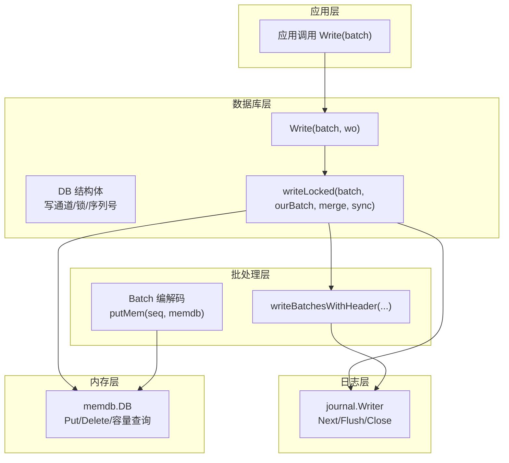
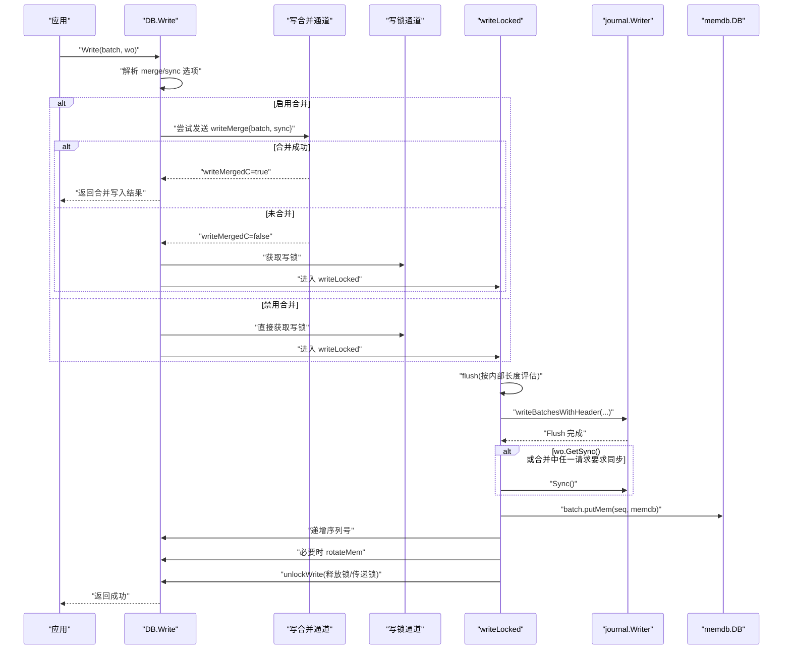
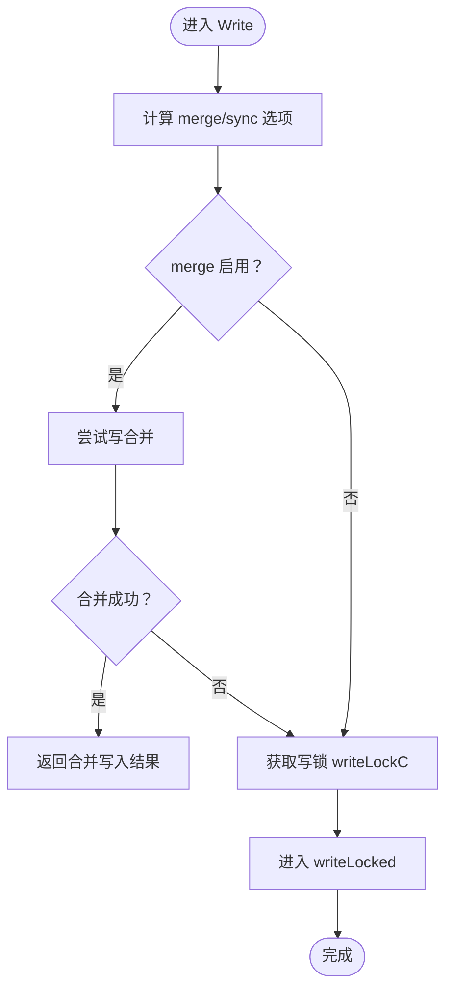
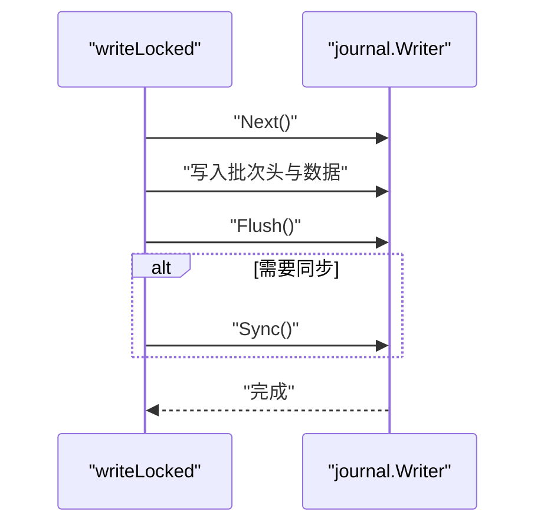
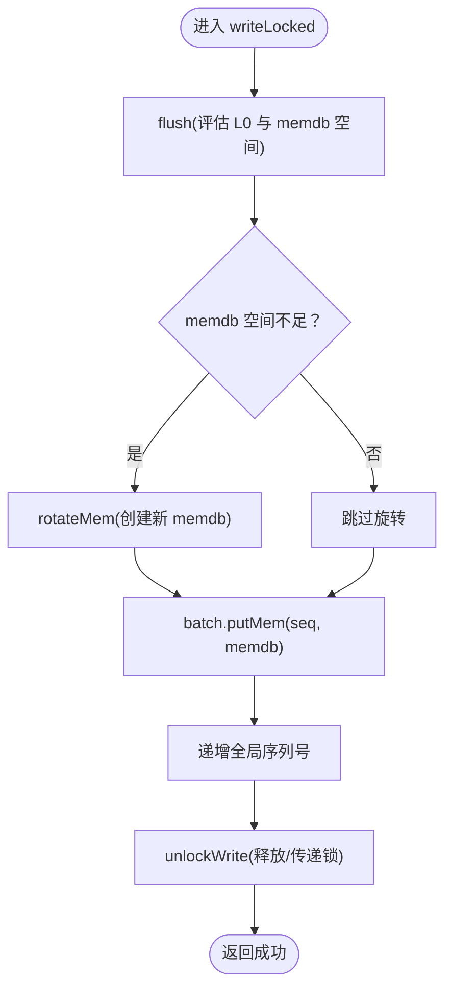
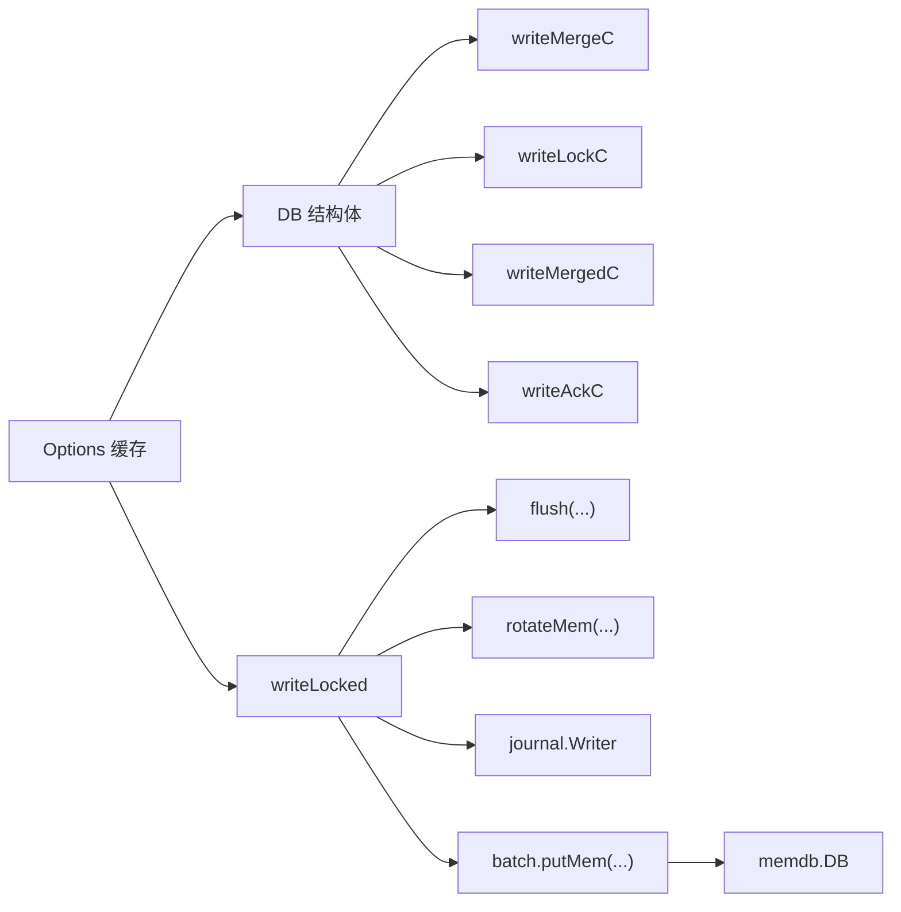

# 批量写入流程

<cite>
**本文引用的文件列表**
- [db_write.go](file://leveldb/db_write.go)
- [db.go](file://leveldb/db.go)
- [batch.go](file://leveldb/batch.go)
- [memdb.go](file://leveldb/memdb/memdb.go)
- [journal.go](file://leveldb/journal/journal.go)
- [options.go](file://leveldb/options.go)
</cite>

## 目录
1. [简介](#简介)
2. [项目结构](#项目结构)
3. [核心组件](#核心组件)
4. [架构总览](#架构总览)
5. [详细组件分析](#详细组件分析)
6. [依赖关系分析](#依赖关系分析)
7. [性能考量](#性能考量)
8. [故障排查指南](#故障排查指南)
9. [结论](#结论)

## 简介
本指南围绕 avccDB 的批量写入端到端流程展开，聚焦于从应用层调用 Write(batch) 开始，到数据最终持久化到内存数据库（memdb）的全过程。文档重点解释：
- 写入锁的竞争与获取：merge 路径与直入锁路径的差异
- journal 日志的写入与刷新：何时同步刷盘
- 内存检查与 memdb 更新：flush、rotate、putMem 等关键步骤
- NoWriteMerge 选项如何绕过合并机制直接进入写入锁定流程
- sync 参数如何影响持久化行为（journal 刷新与 fsync）

通过时序图与流程图，帮助读者建立对整体写入链路的直观理解。

## 项目结构
与批量写入相关的模块分布如下：
- 数据库入口与并发控制：db.go 中的 DB 结构体及写通道
- 批量写入主流程：db_write.go 中 Write 与 writeLocked
- 批处理编码与写入：batch.go 中 Batch 编解码、putMem、writeBatchesWithHeader
- 内存数据库：memdb/memdb.go 中 Put/Delete/容量查询等
- 日志记录器：journal/journal.go 中 Writer/Reader 的块与校验逻辑
- 选项配置：options.go 中缓存与默认值

图表来源
- [db_write.go](file://leveldb/db_write.go#L268-L330)
- [batch.go](file://leveldb/batch.go#L244-L257)
- [journal.go](file://leveldb/journal/journal.go#L343-L536)
- [memdb.go](file://leveldb/memdb/memdb.go#L273-L315)
- [db.go](file://leveldb/db.go#L33-L120)

章节来源
- [db_write.go](file://leveldb/db_write.go#L268-L330)
- [db.go](file://leveldb/db.go#L33-L120)

## 核心组件
- DB 写通道与锁
  - writeMergeC：用于 merge 路径的写合并通道
  - writeLockC：互斥写锁通道（容量为1）
  - writeMergedC：合并结果确认通道
  - writeAckC：合并成功后的返回通道
- writeLocked：实际执行写入的主流程函数
- writeJournal：封装 journal 写入、Flush 与可选 Sync
- flush：根据 L0 压力与 memdb 可用空间决定是否需要旋转或等待
- rotateMem：创建新 memdb 并触发后台 compaction
- Batch.putMem：将批内记录转换为内部键并写入 memdb
- memdb.DB.Put：线程安全地插入键值

章节来源
- [db.go](file://leveldb/db.go#L33-L120)
- [db_write.go](file://leveldb/db_write.go#L18-L33)
- [db_write.go](file://leveldb/db_write.go#L154-L266)
- [batch.go](file://leveldb/batch.go#L244-L257)
- [memdb.go](file://leveldb/memdb/memdb.go#L273-L315)

## 架构总览
下图展示了从 Write 到最终写入 memdb 的关键交互与数据流。

图表来源
- [db_write.go](file://leveldb/db_write.go#L268-L330)
- [db_write.go](file://leveldb/db_write.go#L154-L266)
- [batch.go](file://leveldb/batch.go#L402-L412)
- [journal.go](file://leveldb/journal/journal.go#L435-L448)
- [memdb.go](file://leveldb/memdb/memdb.go#L273-L315)

## 详细组件分析

### 组件A：Write 与 writeLocked 的竞争与合并
- 合并开关
  - merge 条件：!wo.GetNoWriteMerge() && !db.s.o.GetNoWriteMerge()
  - 当启用合并且 batch.size 较小，Write 会优先尝试将当前请求与后续请求合并
- 锁竞争
  - 合并路径：先向 writeMergeC 发送请求；若对方返回 writeMergedC=true，则直接返回合并结果；否则返回 false 表示未合并，随后获取 writeLockC
  - 直入锁路径：直接向 writeLockC 发送写锁请求
- 合并策略
  - 计算合并上限：基于 batch.internalLen 与 memdb.Free() 的剩余容量
  - 支持两类合并对象：Batch 与单条 Put/Delete（带版本号时额外计算长度）
  - 合并过程中累积 sync 标志，最终决定是否触发 journal.Sync()

图表来源
- [db_write.go](file://leveldb/db_write.go#L268-L330)
- [db_write.go](file://leveldb/db_write.go#L154-L266)

章节来源
- [db_write.go](file://leveldb/db_write.go#L268-L330)
- [db_write.go](file://leveldb/db_write.go#L154-L266)

### 组件B：journal 写入与同步
- 写入流程
  - writeJournal：通过 journal.Next() 获取写入器，写入批次头与所有 batch 的原始数据，随后 Flush
  - 若 wo.GetSync() 为真或合并过程中任一请求要求同步，则在 flush 后执行 journal.Sync()
- 同步语义
  - sync=true 时，journal.Writer.Flush 后再执行底层 writer 的 Sync，确保落盘
  - 若未设置 sync，仅保证 journal 文件块写入，不强制 fsync

图表来源
- [db_write.go](file://leveldb/db_write.go#L18-L33)
- [journal.go](file://leveldb/journal/journal.go#L435-L448)

章节来源
- [db_write.go](file://leveldb/db_write.go#L18-L33)
- [journal.go](file://leveldb/journal/journal.go#L435-L448)

### 组件C：内存检查与 memdb 更新
- flush 策略
  - 根据 L0 深度与阈值决定是否延迟、暂停写入或主动触发 compaction
  - 若 memdb 可用空间不足，可能触发 rotateMem 创建新 memdb
- rotateMem
  - 创建新 memdb 并准备 journal，随后调度后台 memdb compaction
- putMem
  - 将每个 batch 的记录转换为内部键（含序列号），逐条写入 memdb
- 序列号管理
  - 为每个 batch 分配连续的序列号，并在完成后递增全局 seq

图表来源
- [db_write.go](file://leveldb/db_write.go#L66-L131)
- [db_write.go](file://leveldb/db_write.go#L154-L266)
- [batch.go](file://leveldb/batch.go#L244-L257)
- [memdb.go](file://leveldb/memdb/memdb.go#L273-L315)

章节来源
- [db_write.go](file://leveldb/db_write.go#L66-L131)
- [db_write.go](file://leveldb/db_write.go#L154-L266)
- [batch.go](file://leveldb/batch.go#L244-L257)
- [memdb.go](file://leveldb/memdb/memdb.go#L273-L315)

### 组件D：NoWriteMerge 与 sync 的作用
- NoWriteMerge
  - 当 wo.GetNoWriteMerge() 或 db.s.o.GetNoWriteMerge() 为真时，Write 不参与合并，直接走直入锁路径
  - 这样可以避免合并带来的额外开销，适合大批次或严格顺序写入场景
- sync
  - 若 wo.GetSync() 为真且 db.s.o.GetNoSync() 为假，则在 writeLocked 中：
    - 合并阶段会累积任一请求的 sync 标志
    - journal 写入后，若存在 sync，则执行 Sync() 强制落盘
  - 该选项直接影响持久化可靠性与性能权衡

章节来源
- [db_write.go](file://leveldb/db_write.go#L295-L296)
- [db_write.go](file://leveldb/db_write.go#L171-L229)
- [db_write.go](file://leveldb/db_write.go#L240-L243)
- [journal.go](file://leveldb/journal/journal.go#L435-L448)

## 依赖关系分析
- DB 写通道与锁
  - writeMergeC、writeLockC、writeMergedC、writeAckC 在 DB 初始化时创建
- writeLocked 对外部组件的依赖
  - flush/rotateMem：依赖 DB 的 L0 触发与 memdb 管理
  - writeJournal：依赖 journal.Writer 的 Next/Flush/Sync
  - batch.putMem：依赖 memdb.DB 的 Put
- 选项配置
  - NoWriteMerge、NoSync、WriteBuffer 等来自 options 缓存，影响 Write 的分支选择与阈值

图表来源
- [db.go](file://leveldb/db.go#L33-L120)
- [db_write.go](file://leveldb/db_write.go#L66-L131)
- [db_write.go](file://leveldb/db_write.go#L154-L266)
- [batch.go](file://leveldb/batch.go#L244-L257)
- [journal.go](file://leveldb/journal/journal.go#L343-L536)
- [options.go](file://leveldb/options.go#L25-L44)

章节来源
- [db.go](file://leveldb/db.go#L33-L120)
- [db_write.go](file://leveldb/db_write.go#L66-L131)
- [db_write.go](file://leveldb/db_write.go#L154-L266)
- [batch.go](file://leveldb/batch.go#L244-L257)
- [journal.go](file://leveldb/journal/journal.go#L343-L536)
- [options.go](file://leveldb/options.go#L25-L44)

## 性能考量
- 合并优化
  - 合并路径可减少 journal 写入次数与 memdb 插入次数，提高吞吐
  - 合并上限受 batch.size 与 memdb.Free() 共同限制，避免过度合并导致内存压力
- L0 压力控制
  - flush 会在 L0 达到阈值时触发等待或暂停写入，避免写放大
  - 适当增大 WriteBuffer 可引导大批次走事务路径，跳过 journal，进一步降低写放大
- 同步策略
  - sync=true 会显著增加 IO 成本，建议在关键一致性场景使用
  - 合并过程中任一请求要求同步也会触发 Sync，注意避免频繁同步

## 故障排查指南
- 合并失败或锁竞争异常
  - 检查 writeMergeC 是否被阻塞，确认是否有大量小请求堆积
  - 若启用 NoWriteMerge，确认是否期望直入锁路径
- journal 写入失败
  - 检查 journal.Writer.Flush/Sync 返回错误
  - 关注磁盘空间与权限问题
- memdb 写入失败
  - 检查 batch.putMem 的内部键构造是否正确
  - 确认 memdb.DB 的 Put 是否抛出异常
- L0 压力导致写入暂停
  - 查看 flush 的等待与暂停逻辑，必要时调整阈值或触发手动 Compact

章节来源
- [db_write.go](file://leveldb/db_write.go#L66-L131)
- [db_write.go](file://leveldb/db_write.go#L154-L266)
- [journal.go](file://leveldb/journal/journal.go#L435-L448)
- [memdb.go](file://leveldb/memdb/memdb.go#L273-L315)

## 结论
avccDB 的批量写入通过“写合并 + 写锁”的双路径设计，在保证高吞吐的同时兼顾可靠性。Write 的选项（NoWriteMerge、NoSync）与 flush/rotateMem 的内存检查共同构成了完整的写入控制闭环。journal 的写入与同步策略则在性能与持久化之间提供了灵活的平衡点。理解上述组件与流程，有助于在不同业务场景下做出更优的配置与调优决策。