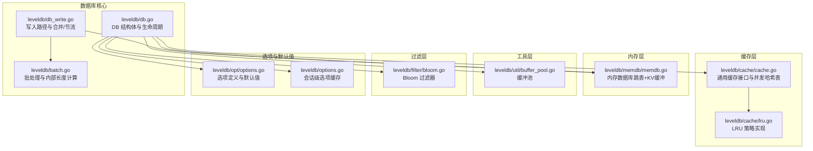
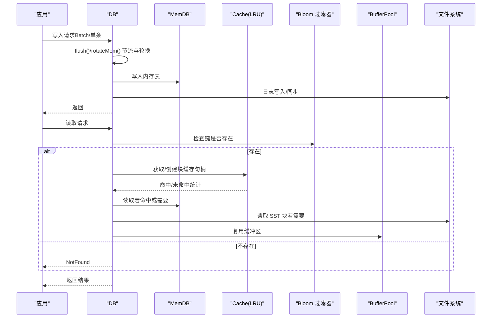
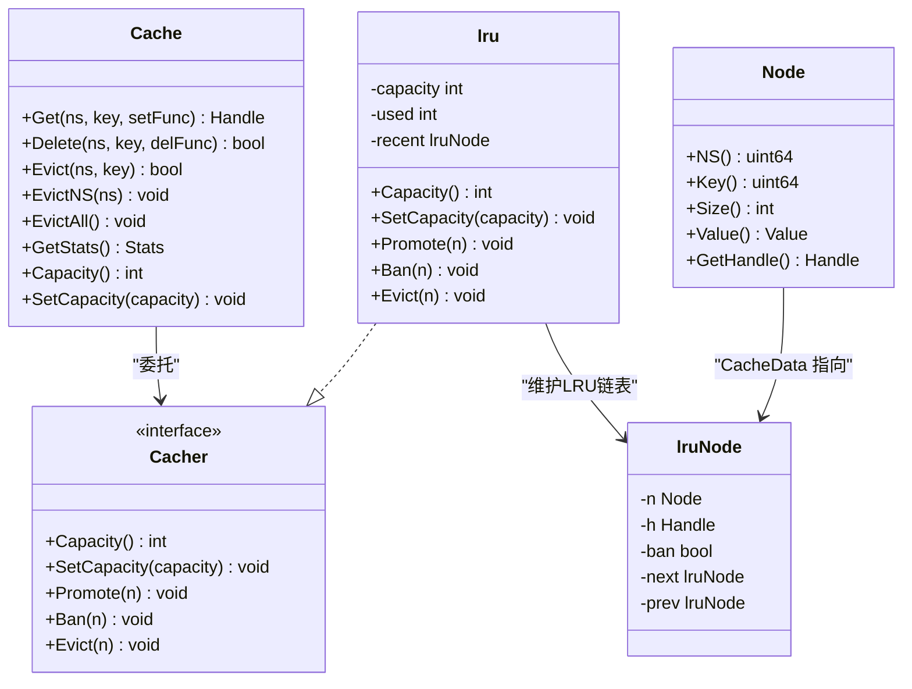
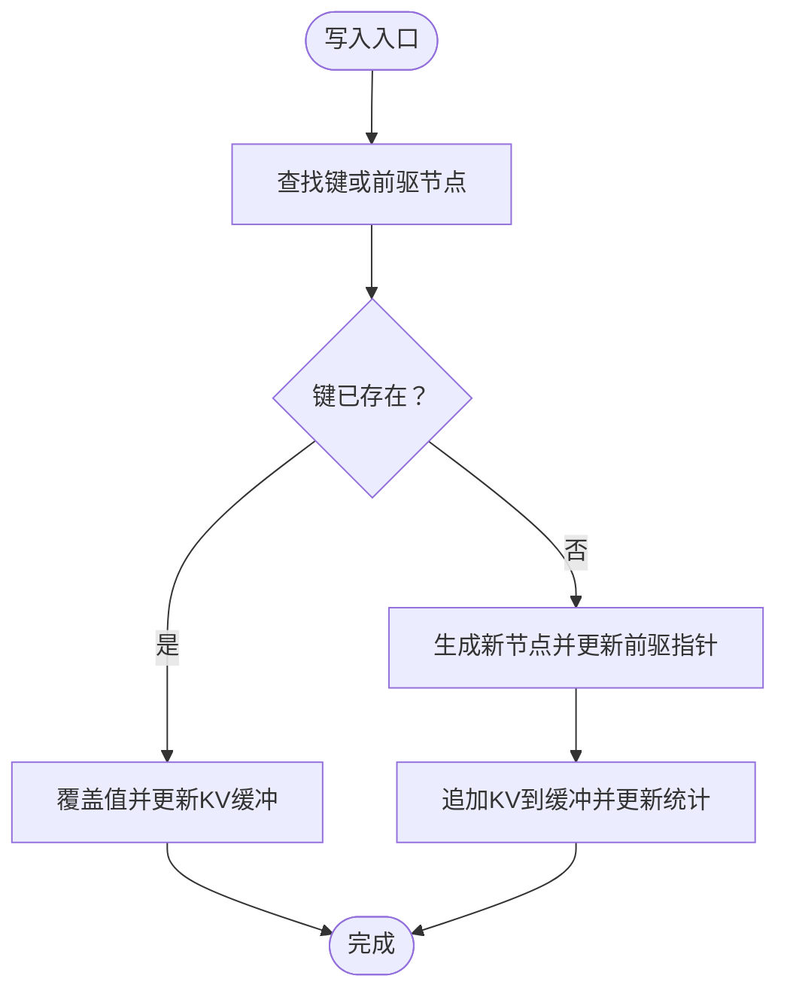
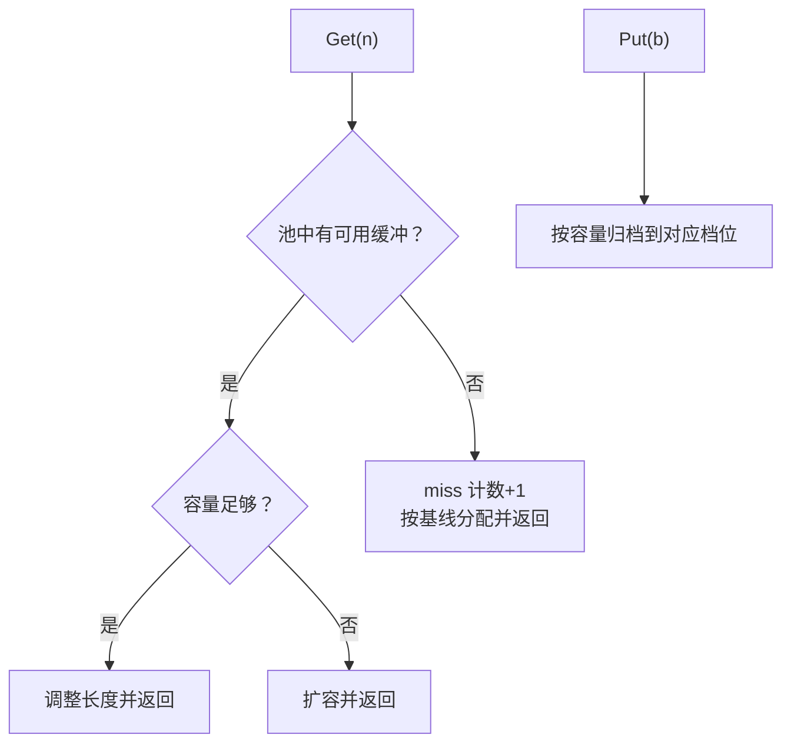
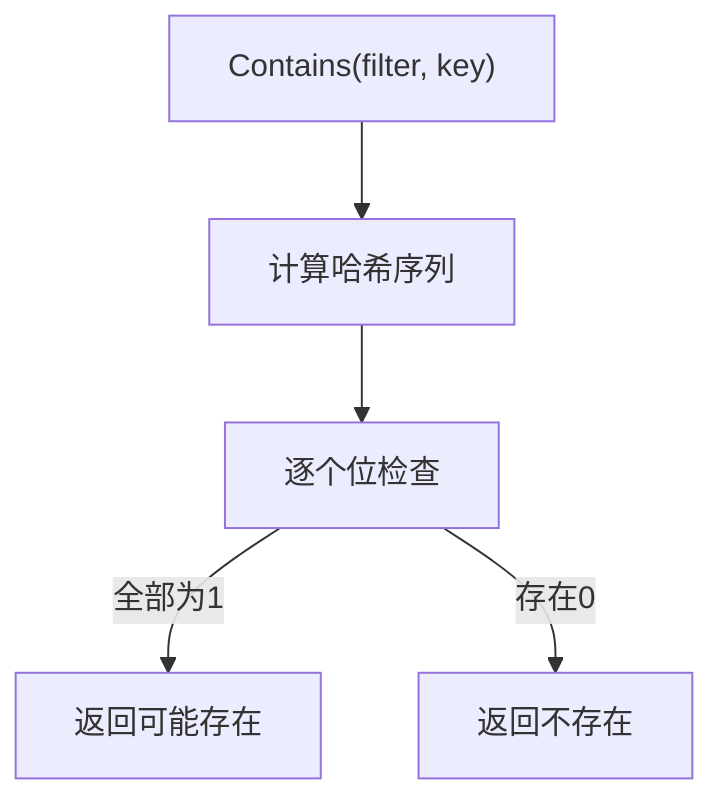
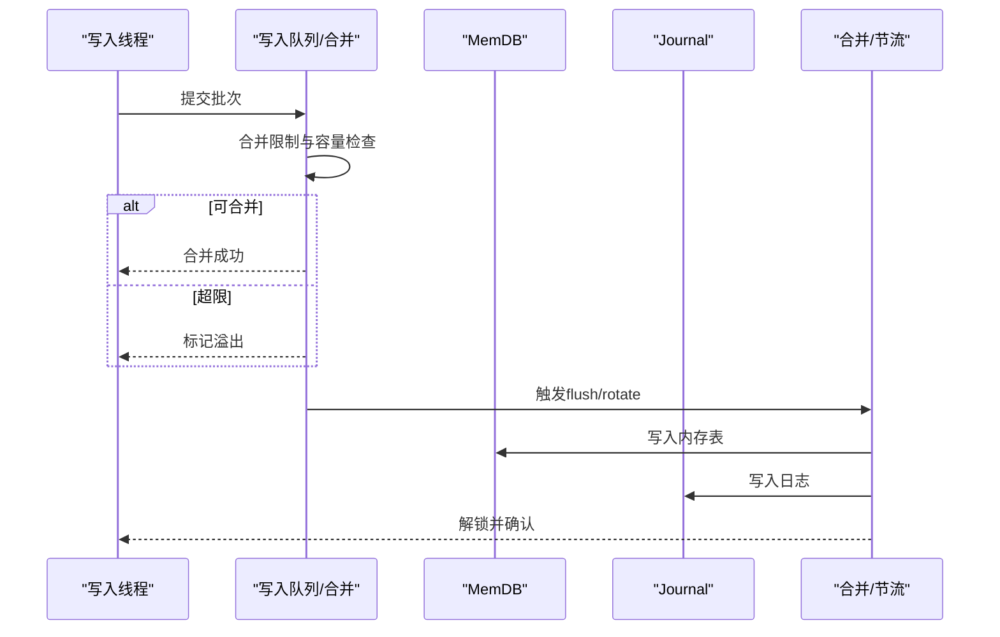
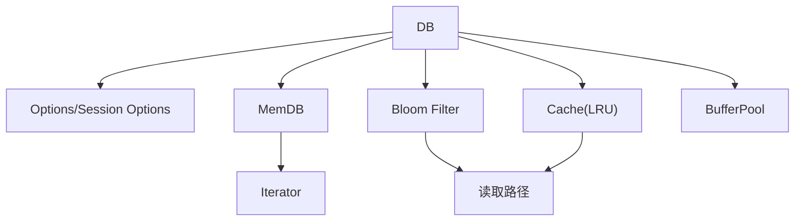

# 性能优化

<cite>
**本文引用的文件**
- [leveldb/cache/cache.go](file://leveldb/cache/cache.go)
- [leveldb/cache/lru.go](file://leveldb/cache/lru.go)
- [leveldb/memdb/memdb.go](file://leveldb/memdb/memdb.go)
- [leveldb/util/buffer_pool.go](file://leveldb/util/buffer_pool.go)
- [leveldb/filter/bloom.go](file://leveldb/filter/bloom.go)
- [leveldb/options.go](file://leveldb/options.go)
- [leveldb/opt/options.go](file://leveldb/opt/options.go)
- [leveldb/db.go](file://leveldb/db.go)
- [leveldb/db_write.go](file://leveldb/db_write.go)
- [leveldb/batch.go](file://leveldb/batch.go)
- [leveldb/bench_test.go](file://leveldb/bench_test.go)
- [manualtest/dbstress/main.go](file://manualtest/dbstress/main.go)
</cite>

## 目录
1. [简介](#简介)
2. [项目结构](#项目结构)
3. [核心组件](#核心组件)
4. [架构总览](#架构总览)
5. [详细组件分析](#详细组件分析)
6. [依赖关系分析](#依赖关系分析)
7. [性能考量与优化建议](#性能考量与优化建议)
8. [故障排查指南](#故障排查指南)
9. [结论](#结论)
10. [附录：基准测试与监控指标](#附录：基准测试与监控指标)

## 简介
本专项文档聚焦于 avccDB 的性能优化，围绕内存管理与缓存策略展开，系统性解析以下主题：
- LRU 缓存（leveldb/cache/cache.go 与 leveldb/cache/lru.go）的工作原理与配置方法，以及其对读取性能的提升效果
- 内存数据库（MemDB，leveldb/memdb/memdb.go）的实现机制及其在写入缓冲中的作用
- 缓冲池（leveldb/util/buffer_pool.go）如何降低频繁内存分配带来的开销
- 写入优化（批量提交、合理设置 WriteBuffer）与读取优化（Bloom 过滤器调优、迭代器使用技巧）
- 性能基准测试方法与监控指标，帮助定位瓶颈

## 项目结构
avccDB 的性能相关模块主要分布在以下子目录：
- cache：通用缓存接口与 LRU 实现
- memdb：内存键值存储实现
- util：通用工具，含缓冲池
- filter：内置 Bloom 过滤器
- opt：选项与默认参数
- db 相关：数据库主流程、写入路径、批处理等

图表来源
- [leveldb/cache/cache.go](file://leveldb/cache/cache.go#L1-L120)
- [leveldb/cache/lru.go](file://leveldb/cache/lru.go#L1-L80)
- [leveldb/memdb/memdb.go](file://leveldb/memdb/memdb.go#L1-L120)
- [leveldb/util/buffer_pool.go](file://leveldb/util/buffer_pool.go#L1-L60)
- [leveldb/filter/bloom.go](file://leveldb/filter/bloom.go#L1-L60)
- [leveldb/opt/options.go](file://leveldb/opt/options.go#L1-L60)
- [leveldb/options.go](file://leveldb/options.go#L1-L60)
- [leveldb/db.go](file://leveldb/db.go#L1-L120)
- [leveldb/db_write.go](file://leveldb/db_write.go#L1-L120)
- [leveldb/batch.go](file://leveldb/batch.go#L1-L120)

章节来源
- [leveldb/cache/cache.go](file://leveldb/cache/cache.go#L1-L120)
- [leveldb/cache/lru.go](file://leveldb/cache/lru.go#L1-L80)
- [leveldb/memdb/memdb.go](file://leveldb/memdb/memdb.go#L1-L120)
- [leveldb/util/buffer_pool.go](file://leveldb/util/buffer_pool.go#L1-L60)
- [leveldb/filter/bloom.go](file://leveldb/filter/bloom.go#L1-L60)
- [leveldb/opt/options.go](file://leveldb/opt/options.go#L1-L120)
- [leveldb/options.go](file://leveldb/options.go#L1-L120)
- [leveldb/db.go](file://leveldb/db.go#L1-L120)
- [leveldb/db_write.go](file://leveldb/db_write.go#L1-L120)
- [leveldb/batch.go](file://leveldb/batch.go#L1-L120)

## 核心组件
- 缓存（Cache + LRU）
  - Cache 提供命名空间化、并发安全的缓存映射，支持命中/未命中统计、容量控制与淘汰回调
  - LRU 通过双向链表维护最近使用顺序，按节点大小进行容量配额控制
- 内存数据库（MemDB）
  - 基于跳表的内存键值存储，Append-only KV 缓冲，支持高效插入、删除与迭代
- 缓冲池（BufferPool）
  - 针对固定尺寸段的缓冲区复用，显著降低频繁分配/释放的 GC 压力
- Bloom 过滤器
  - 用于快速判定键是否可能存在于 SST 文件中，减少不必要的磁盘访问
- 选项与默认值
  - 定义块缓存、写缓冲、压缩、迭代采样率等关键参数的默认值与可配置项
- 数据库写入与批处理
  - 写入路径包含日志写入、内存表轮换、写入节流与合并；批处理负责内部长度估算与增长策略

章节来源
- [leveldb/cache/cache.go](file://leveldb/cache/cache.go#L360-L520)
- [leveldb/cache/lru.go](file://leveldb/cache/lru.go#L40-L120)
- [leveldb/memdb/memdb.go](file://leveldb/memdb/memdb.go#L180-L260)
- [leveldb/util/buffer_pool.go](file://leveldb/util/buffer_pool.go#L1-L80)
- [leveldb/filter/bloom.go](file://leveldb/filter/bloom.go#L1-L80)
- [leveldb/opt/options.go](file://leveldb/opt/options.go#L1-L120)
- [leveldb/db_write.go](file://leveldb/db_write.go#L1-L120)
- [leveldb/batch.go](file://leveldb/batch.go#L60-L120)

## 架构总览
下图展示从应用到底层存储的关键路径，突出缓存、内存与缓冲池在读写过程中的作用。

图表来源
- [leveldb/db_write.go](file://leveldb/db_write.go#L1-L120)
- [leveldb/memdb/memdb.go](file://leveldb/memdb/memdb.go#L270-L360)
- [leveldb/cache/cache.go](file://leveldb/cache/cache.go#L460-L560)
- [leveldb/cache/lru.go](file://leveldb/cache/lru.go#L80-L140)
- [leveldb/filter/bloom.go](file://leveldb/filter/bloom.go#L20-L60)
- [leveldb/util/buffer_pool.go](file://leveldb/util/buffer_pool.go#L30-L80)

## 详细组件分析

### LRU 缓存（Cache + LRU）
- 并发缓存映射
  - 使用动态分桶哈希表，按命名空间与键查找节点，支持原子创建与引用计数
  - 统计命中/未命中、设置/删除次数，便于评估缓存效果
- LRU 淘汰策略
  - 双向链表维护最近使用顺序，Promote 将节点移动至头部，Ban 标记禁止再次进入，Evict 主动移除
  - 当新增节点导致占用超过容量时，持续驱逐尾部节点，直至满足容量上限
- 配置与使用
  - 通过选项系统为块缓存选择 LRU 策略，并设置容量
  - 在读取路径中，优先从缓存获取，未命中则通过 setFunc 创建并写入缓存

图表来源
- [leveldb/cache/cache.go](file://leveldb/cache/cache.go#L360-L520)
- [leveldb/cache/lru.go](file://leveldb/cache/lru.go#L40-L120)

章节来源
- [leveldb/cache/cache.go](file://leveldb/cache/cache.go#L360-L520)
- [leveldb/cache/lru.go](file://leveldb/cache/lru.go#L40-L120)
- [leveldb/opt/options.go](file://leveldb/opt/options.go#L1-L120)

### 内存数据库（MemDB）
- 数据结构
  - 跳表结构，每层保存“下一个节点”索引；KV 数据以 Append-only 方式存储，节点元数据记录偏移、键长、值长与高度
- 写入与删除
  - Put：若键存在则覆盖值；否则生成新节点并更新前驱指针，同时更新 KV 缓冲与大小统计
  - Delete：定位节点后，沿各层更新前驱指针，减少 KV 缓冲占用但不回收内存
- 迭代器
  - 支持正向/反向遍历、First/Last/Seek/Next/Prev，基于 Range 切片限制范围
- 写入缓冲中的作用
  - 作为写入路径的暂存区，承担高频写入的低延迟缓冲；当达到阈值或触发合并时，由写入路径将其刷写到磁盘

图表来源
- [leveldb/memdb/memdb.go](file://leveldb/memdb/memdb.go#L270-L360)

章节来源
- [leveldb/memdb/memdb.go](file://leveldb/memdb/memdb.go#L180-L360)
- [leveldb/db_write.go](file://leveldb/db_write.go#L1-L120)

### 缓冲池（BufferPool）
- 设计目标
  - 针对常见尺寸的缓冲区进行池化复用，避免频繁分配与 GC 抖动
- 工作机制
  - 基线数组定义多个尺寸档位，Get 按需返回合适容量的缓冲；Put 将缓冲放回对应档位
  - 统计 get/put、命中/不足/超额、miss 等指标，便于观察命中率与碎片情况
- 性能收益
  - 显著降低小对象频繁分配造成的内存压力与停顿时间

图表来源
- [leveldb/util/buffer_pool.go](file://leveldb/util/buffer_pool.go#L1-L80)

章节来源
- [leveldb/util/buffer_pool.go](file://leveldb/util/buffer_pool.go#L1-L80)

### Bloom 过滤器（读取优化）
- 原理
  - 通过多哈希函数标记位图，快速判断键是否可能存在于某 SST 中；未命中可直接跳过该文件
- 参数
  - bitsPerKey 决定位图大小与误判率；生成器根据键集合计算最优哈希次数
- 使用场景
  - 读取前先检查过滤器，未命中的文件直接跳过，减少磁盘 IO 与解码成本

图表来源
- [leveldb/filter/bloom.go](file://leveldb/filter/bloom.go#L20-L60)

章节来源
- [leveldb/filter/bloom.go](file://leveldb/filter/bloom.go#L1-L117)

### 写入优化（批量提交与 WriteBuffer）
- 批量提交
  - 批处理（Batch）累积多条写入，减少系统调用与日志写入次数；内部长度估算避免过度扩容
- 合并与节流
  - 写入路径尝试合并相邻写入，受 memdb 剩余空间与阈值限制；当 L0 表数量达到慢速/暂停阈值时进行节流或等待合并
- WriteBuffer
  - 通过选项设置写缓冲大小，影响内存占用与刷写频率；过大可能导致内存压力，过小增加刷写频次

图表来源
- [leveldb/db_write.go](file://leveldb/db_write.go#L120-L200)
- [leveldb/batch.go](file://leveldb/batch.go#L60-L120)
- [leveldb/opt/options.go](file://leveldb/opt/options.go#L20-L60)

章节来源
- [leveldb/db_write.go](file://leveldb/db_write.go#L1-L200)
- [leveldb/batch.go](file://leveldb/batch.go#L1-L120)
- [leveldb/opt/options.go](file://leveldb/opt/options.go#L1-L120)

## 依赖关系分析
- 缓存依赖
  - DB 通过会话选项设置块缓存与文件缓存；LRU 作为默认块缓存策略
- 内存依赖
  - 写入路径依赖 MemDB 作为写缓冲；迭代器依赖 MemDB 的跳表结构
- 工具依赖
  - 缓冲池被表读写与过滤器生成使用，降低临时缓冲分配
- 过滤器依赖
  - Bloom 过滤器在读取路径中被调用，减少无效 IO

图表来源
- [leveldb/db.go](file://leveldb/db.go#L1-L120)
- [leveldb/options.go](file://leveldb/options.go#L1-L60)
- [leveldb/opt/options.go](file://leveldb/opt/options.go#L1-L120)
- [leveldb/memdb/memdb.go](file://leveldb/memdb/memdb.go#L380-L420)
- [leveldb/cache/cache.go](file://leveldb/cache/cache.go#L360-L460)
- [leveldb/filter/bloom.go](file://leveldb/filter/bloom.go#L1-L60)
- [leveldb/util/buffer_pool.go](file://leveldb/util/buffer_pool.go#L1-L60)

章节来源
- [leveldb/db.go](file://leveldb/db.go#L1-L120)
- [leveldb/options.go](file://leveldb/options.go#L1-L120)
- [leveldb/opt/options.go](file://leveldb/opt/options.go#L1-L120)
- [leveldb/memdb/memdb.go](file://leveldb/memdb/memdb.go#L380-L420)
- [leveldb/cache/cache.go](file://leveldb/cache/cache.go#L360-L460)
- [leveldb/filter/bloom.go](file://leveldb/filter/bloom.go#L1-L60)
- [leveldb/util/buffer_pool.go](file://leveldb/util/buffer_pool.go#L1-L60)

## 性能考量与优化建议

### 内存管理与缓存策略
- LRU 容量配置
  - 建议将块缓存容量设置为总内存预算的 10%-30%，结合实际工作集大小与命中率进行微调
  - 通过缓存统计（命中/未命中、节点数、大小）评估效果，避免过度占用导致内存压力
- 命名空间隔离
  - 使用命名空间 Getter 对不同模块（如表块、文件句柄）分别缓存，减少相互干扰
- 缓存淘汰策略
  - 对热点数据启用 LRU，对一次性数据可考虑禁用或使用较小容量，降低内存占用

章节来源
- [leveldb/cache/cache.go](file://leveldb/cache/cache.go#L420-L520)
- [leveldb/cache/lru.go](file://leveldb/cache/lru.go#L40-L120)
- [leveldb/opt/options.go](file://leveldb/opt/options.go#L1-L120)

### 内存数据库（MemDB）优化
- 写入缓冲大小
  - 合理设置 WriteBuffer，避免过大导致内存峰值过高；过小会增加刷写频率
  - 结合业务写入模式（批量/随机）选择合适的阈值
- 迭代器使用
  - 使用切片（Range）限制迭代范围，减少扫描开销
  - 注意迭代器生命周期与并发安全，避免跨 goroutine 共享未受保护的迭代器

章节来源
- [leveldb/memdb/memdb.go](file://leveldb/memdb/memdb.go#L380-L420)
- [leveldb/opt/options.go](file://leveldb/opt/options.go#L20-L60)
- [leveldb/db_write.go](file://leveldb/db_write.go#L1-L120)

### 缓冲池（BufferPool）优化
- 基线尺寸
  - 根据常见数据块大小设置基线，提高命中率；定期观察 miss 指标，必要时调整基线
- 复用策略
  - 在表读写、过滤器生成等高频路径中统一使用缓冲池，减少临时分配

章节来源
- [leveldb/util/buffer_pool.go](file://leveldb/util/buffer_pool.go#L1-L80)

### 读取优化
- Bloom 过滤器调优
  - 根据预期键分布设置 bitsPerKey，平衡误判率与内存占用
  - 对冷数据或稀疏键空间适当降低 bitsPerKey，避免过度内存消耗
- 迭代器技巧
  - 使用 First/Last/Seek/Next/Prev 组合，尽量减少全表扫描
  - 合理设置 Range，仅扫描所需区间

章节来源
- [leveldb/filter/bloom.go](file://leveldb/filter/bloom.go#L1-L117)
- [leveldb/memdb/memdb.go](file://leveldb/memdb/memdb.go#L1-L120)

### 写入优化
- 批量提交
  - 使用 Batch 累积写入，减少日志写入与系统调用次数
  - 控制批大小，避免超过 memdb 剩余空间导致溢出与回退
- 合并与节流
  - 利用写入合并通道减少竞争；在高写入速率下启用节流，避免 L0 表堆积

章节来源
- [leveldb/batch.go](file://leveldb/batch.go#L60-L120)
- [leveldb/db_write.go](file://leveldb/db_write.go#L120-L200)

## 故障排查指南
- 缓存命中率低
  - 检查缓存容量是否过小；查看缓存统计（命中/未命中、节点数、大小）与 LRU 驱逐情况
- 写入延迟高
  - 关注写入延迟计数与累计时长，检查是否因 L0 表过多触发暂停或慢速
- 内存占用异常
  - 检查 WriteBuffer 设置、MemDB 大小与缓冲池 miss 情况
- 迭代器泄漏
  - 确保迭代器正确释放，避免持有过多活跃快照或迭代器

章节来源
- [leveldb/db.go](file://leveldb/db.go#L1320-L1360)
- [leveldb/cache/cache.go](file://leveldb/cache/cache.go#L420-L460)
- [leveldb/memdb/memdb.go](file://leveldb/memdb/memdb.go#L1-L120)

## 结论
通过对缓存、内存数据库、缓冲池与过滤器的系统性优化，可在读取延迟、写入吞吐与内存占用之间取得良好平衡。建议以监控指标为依据，逐步调整缓存容量、WriteBuffer 与 Bloom 参数，并结合批量提交与迭代器使用技巧，持续优化整体性能。

## 附录：基准测试与监控指标

### 基准测试方法
- 写入基准
  - 使用测试框架构造大量键值，按批大小分组写入，测量吞吐与延迟
- 读取基准
  - 预热缓存后进行随机/顺序读取，统计命中率与延迟
- 批处理与合并
  - 测试不同批大小与合并策略下的写入性能差异

章节来源
- [leveldb/bench_test.go](file://leveldb/bench_test.go#L140-L200)

### 监控指标
- 缓存与文件缓存
  - 命中/未命中、节点数、缓存大小
- 写入与延迟
  - 写入延迟次数与累计时长、是否暂停
- 迭代器与快照
  - 活跃迭代器数、活跃快照数
- IO 统计
  - 读/写字节数
- 表与块
  - 打开的表数、块缓存大小、块缓冲池状态

章节来源
- [leveldb/db.go](file://leveldb/db.go#L1320-L1360)
- [manualtest/dbstress/main.go](file://manualtest/dbstress/main.go#L432-L448)