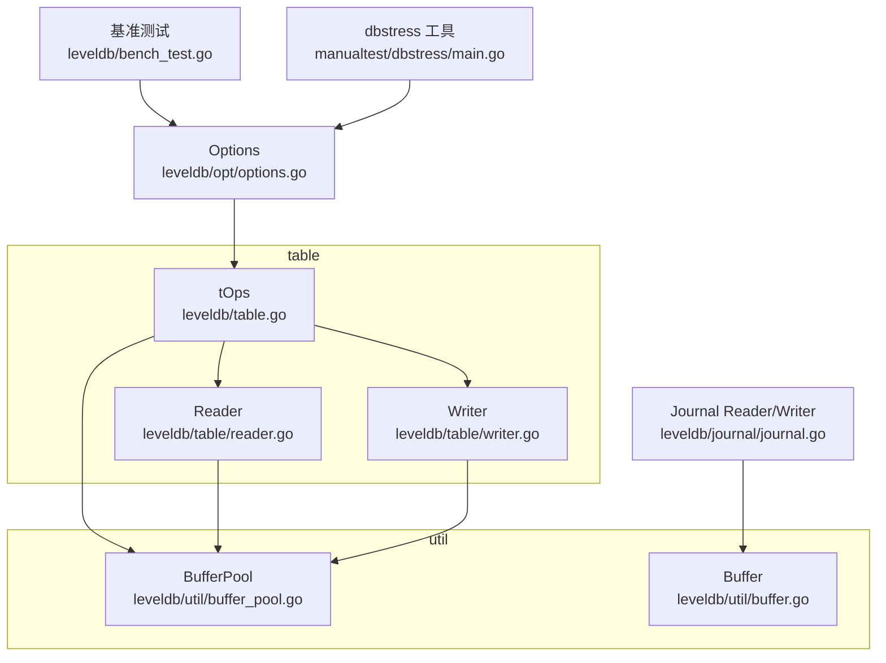
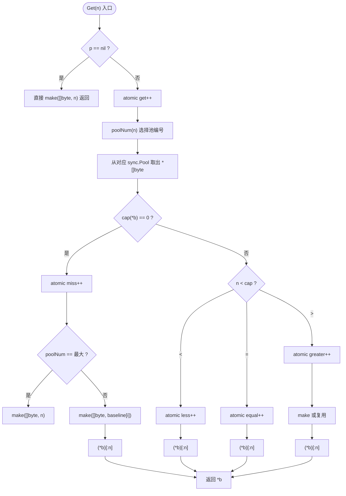
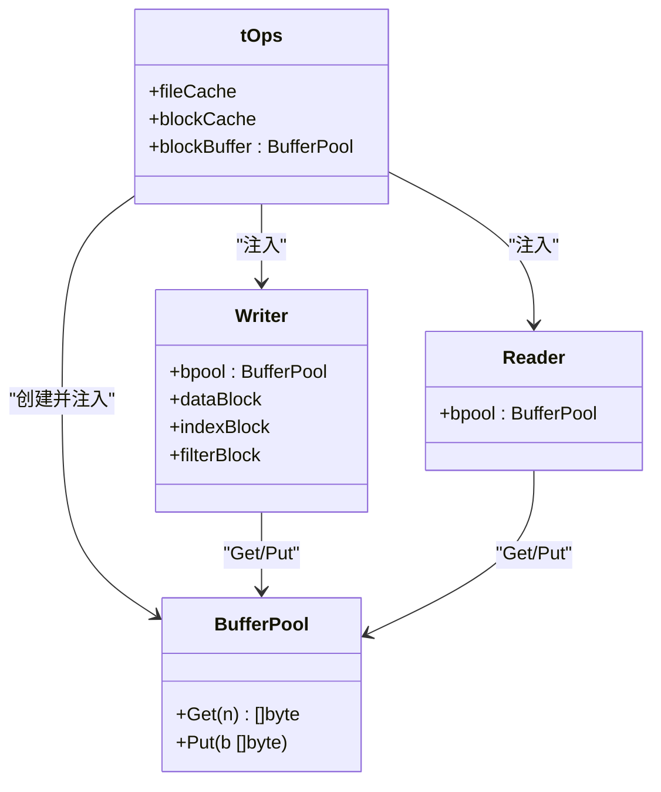
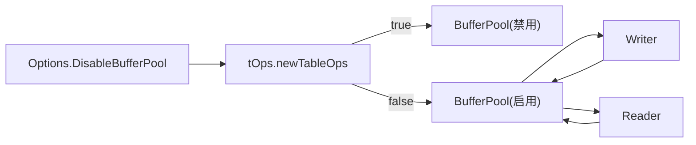

# 缓冲池

<cite>
**本文引用的文件**
- [leveldb/util/buffer_pool.go](file://leveldb/util/buffer_pool.go)
- [leveldb/util/buffer.go](file://leveldb/util/buffer.go)
- [leveldb/opt/options.go](file://leveldb/opt/options.go)
- [leveldb/table.go](file://leveldb/table.go)
- [leveldb/table/reader.go](file://leveldb/table/reader.go)
- [leveldb/table/writer.go](file://leveldb/table/writer.go)
- [leveldb/journal/journal.go](file://leveldb/journal/journal.go)
- [leveldb/bench_test.go](file://leveldb/bench_test.go)
- [manualtest/dbstress/main.go](file://manualtest/dbstress/main.go)
</cite>

## 目录
1. [简介](#简介)
2. [项目结构](#项目结构)
3. [核心组件](#核心组件)
4. [架构总览](#架构总览)
5. [详细组件分析](#详细组件分析)
6. [依赖关系分析](#依赖关系分析)
7. [性能考量](#性能考量)
8. [故障排查指南](#故障排查指南)
9. [结论](#结论)
10. [附录](#附录)

## 简介
本文件系统性阐述 avccDB 中 util.BufferPool 的缓冲池机制，解释其如何通过对象复用显著降低内存分配与 GC 压力；覆盖内部 I/O 场景（日志写入、块读取）中的应用；说明 DisableBufferPool 选项的使用场景与性能影响；并给出容量管理策略与基准测试方法，帮助用户在高并发场景下正确评估与选择缓冲池带来的收益。

## 项目结构
围绕缓冲池的关键代码分布于以下模块：
- util：缓冲池实现与通用缓冲区封装
- table：表读写器与块迭代器，直接消费缓冲池
- opt：全局选项，包含 DisableBufferPool 控制开关
- journal：日志读写器，使用固定大小缓冲区进行块级 I/O
- bench_test：基准测试入口，可输出缓冲池统计信息
- manualtest/dbstress：手动压测工具，支持开启/关闭缓冲池



图表来源
- [leveldb/util/buffer_pool.go](file://leveldb/util/buffer_pool.go#L1-L135)
- [leveldb/util/buffer.go](file://leveldb/util/buffer.go#L1-L315)
- [leveldb/opt/options.go](file://leveldb/opt/options.go#L280-L320)
- [leveldb/table.go](file://leveldb/table.go#L348-L565)
- [leveldb/table/reader.go](file://leveldb/table/reader.go#L50-L120)
- [leveldb/table/writer.go](file://leveldb/table/writer.go#L148-L176)
- [leveldb/journal/journal.go](file://leveldb/journal/journal.go#L140-L200)
- [leveldb/bench_test.go](file://leveldb/bench_test.go#L240-L265)
- [manualtest/dbstress/main.go](file://manualtest/dbstress/main.go#L80-L93)

章节来源
- [leveldb/util/buffer_pool.go](file://leveldb/util/buffer_pool.go#L1-L135)
- [leveldb/util/buffer.go](file://leveldb/util/buffer.go#L1-L315)
- [leveldb/opt/options.go](file://leveldb/opt/options.go#L280-L320)
- [leveldb/table.go](file://leveldb/table.go#L348-L565)
- [leveldb/table/reader.go](file://leveldb/table/reader.go#L50-L120)
- [leveldb/table/writer.go](file://leveldb/table/writer.go#L148-L176)
- [leveldb/journal/journal.go](file://leveldb/journal/journal.go#L140-L200)
- [leveldb/bench_test.go](file://leveldb/bench_test.go#L240-L265)
- [manualtest/dbstress/main.go](file://manualtest/dbstress/main.go#L80-L93)

## 核心组件
- BufferPool：基于 sync.Pool 的字节切片池，按“基线”分档缓存，减少频繁分配与拷贝
- Buffer：可变长字节缓冲区，提供高效读写与扩容策略，配合缓冲池减少临时分配
- Options.DisableBufferPool：全局开关，控制是否启用缓冲池
- tOps/tWriter/tReader：表层组件，按需注入 BufferPool 实例，用于块读写与过滤器生成
- Journal Reader/Writer：日志层使用固定大小缓冲区进行块级 I/O

章节来源
- [leveldb/util/buffer_pool.go](file://leveldb/util/buffer_pool.go#L1-L135)
- [leveldb/util/buffer.go](file://leveldb/util/buffer.go#L1-L315)
- [leveldb/opt/options.go](file://leveldb/opt/options.go#L280-L320)
- [leveldb/table.go](file://leveldb/table.go#L348-L565)
- [leveldb/table/reader.go](file://leveldb/table/reader.go#L50-L120)
- [leveldb/table/writer.go](file://leveldb/table/writer.go#L148-L176)
- [leveldb/journal/journal.go](file://leveldb/journal/journal.go#L140-L200)

## 架构总览
缓冲池贯穿表层 I/O 路径，主要流程如下：
- 初始化阶段：根据 Options 创建 tOps，若未禁用则创建 BufferPool 并注入到 Writer/Reader
- 写入路径：Writer 使用 Buffer 与压缩/校验，必要时从 BufferPool 获取临时缓冲
- 读取路径：Reader 在加载块/索引/过滤器时，从 BufferPool 获取缓冲，释放时归还
- 日志路径：Journal Reader 使用固定大小块缓冲进行读取，避免额外分配

```mermaid
sequenceDiagram
participant Opt as "Options"
participant Ops as "tOps"
participant W as "Writer"
participant R as "Reader"
participant BP as "BufferPool"
participant J as "Journal"
Opt->>Ops : "创建实例并检查 DisableBufferPool"
Ops->>BP : "NewBufferPool(BlockSize + 5)"
Ops->>W : "注入 bpool"
Ops->>R : "注入 bpool"
W->>BP : "Get(n)"
BP-->>W : "返回[]byte"
W->>W : "写入/压缩/校验"
W->>BP : "Put(b)"
R->>BP : "Get(n)"
BP-->>R : "返回[]byte"
R->>R : "解析块/索引/过滤器"
R->>BP : "Put(b)"
J->>J : "使用固定块缓冲读取"
```

图表来源
- [leveldb/table.go](file://leveldb/table.go#L541-L565)
- [leveldb/table/writer.go](file://leveldb/table/writer.go#L148-L176)
- [leveldb/table/reader.go](file://leveldb/table/reader.go#L50-L120)
- [leveldb/util/buffer_pool.go](file://leveldb/util/buffer_pool.go#L37-L103)
- [leveldb/journal/journal.go](file://leveldb/journal/journal.go#L140-L200)

## 详细组件分析

### BufferPool 组件
- 结构与分档
  - 6 个 sync.Pool，对应 5 个“基线”阈值，按请求长度选择最合适的池
  - 提供 Get/Put 接口，原子计数统计命中/miss/resize 等指标
- Get 行为
  - 若池中已有切片且容量足够，按需调整长度后返回
  - 若容量不足或为空，则按基线分配合适容量并截断到请求长度
  - 记录 less/equal/greater/miss 统计，便于观测命中率
- Put 行为
  - 按容量归属相应池，归还给 sync.Pool
- 字符串化
  - 输出基线、get/put、less/equal/greater/miss 等统计，便于监控



图表来源
- [leveldb/util/buffer_pool.go](file://leveldb/util/buffer_pool.go#L28-L103)

章节来源
- [leveldb/util/buffer_pool.go](file://leveldb/util/buffer_pool.go#L1-L135)

### Buffer 组件
- 功能要点
  - 可增长的字节缓冲区，提供 Write/Read/Alloc/Grow 等方法
  - 小容量优化与扩容策略，尽量通过 reslice 避免复制
  - 读写分离的 off 指针，支持多次读写循环
- 与缓冲池的关系
  - BufferPool 主要服务于表层块/索引/过滤器等一次性大块数据的临时缓冲
  - Buffer 更偏向于流式累积与重用，两者互补

章节来源
- [leveldb/util/buffer.go](file://leveldb/util/buffer.go#L1-L315)

### 表层 I/O 中的缓冲池应用
- Writer
  - Writer 内部有 blockWriter/filterWriter 等，使用 Buffer 累积数据
  - 在压缩/校验/落盘过程中，可能需要临时缓冲，可结合 BufferPool 复用
- Reader
  - Reader 加载块/索引/过滤器时，从 BufferPool 获取缓冲，使用完毕后归还
  - 过滤器块释放时显式调用 Put 归还
- tOps 初始化
  - 当未禁用缓冲池时，按 BlockSize + 5 设置基线，创建 BufferPool 注入到 Writer/Reader



图表来源
- [leveldb/table.go](file://leveldb/table.go#L348-L565)
- [leveldb/table/writer.go](file://leveldb/table/writer.go#L148-L176)
- [leveldb/table/reader.go](file://leveldb/table/reader.go#L50-L120)
- [leveldb/util/buffer_pool.go](file://leveldb/util/buffer_pool.go#L37-L103)

章节来源
- [leveldb/table.go](file://leveldb/table.go#L348-L565)
- [leveldb/table/writer.go](file://leveldb/table/writer.go#L148-L176)
- [leveldb/table/reader.go](file://leveldb/table/reader.go#L457-L523)

### 日志写入与块读取中的缓冲池
- 日志层
  - Journal Reader 使用固定大小块缓冲进行读取，避免额外分配
  - Journal Writer 将记录按块写入，块内按记录头/体组织
- 与缓冲池的关系
  - 日志层不直接使用 BufferPool，但其固定块缓冲策略与 BufferPool 的“按需复用”理念一致
  - 在表层 Writer/Reader 中，缓冲池承担了块级临时缓冲的复用职责

章节来源
- [leveldb/journal/journal.go](file://leveldb/journal/journal.go#L140-L200)

## 依赖关系分析
- 选项驱动
  - Options.DisableBufferPool 控制是否创建 BufferPool
  - tOps 在初始化时依据该选项决定是否注入 BufferPool
- 组件耦合
  - tOps 与 Writer/Reader 强耦合，统一持有 BufferPool
  - Reader/Writer 对 BufferPool 的使用集中在块加载/生成阶段
- 外部依赖
  - sync.Pool 提供无锁/低竞争的池化能力
  - Journal 层使用固定大小缓冲，减少对池化的需求



图表来源
- [leveldb/opt/options.go](file://leveldb/opt/options.go#L280-L320)
- [leveldb/table.go](file://leveldb/table.go#L541-L565)

章节来源
- [leveldb/opt/options.go](file://leveldb/opt/options.go#L280-L320)
- [leveldb/table.go](file://leveldb/table.go#L541-L565)

## 性能考量
- 减少分配与 GC 压力
  - 通过 sync.Pool 复用切片，降低频繁 make/回收带来的 GC 抖动
  - BufferPool 的基线分档使不同尺寸的请求命中更稳定
- 命中率与统计
  - BufferPool 提供 less/equal/greater/miss 统计，可用于评估命中率与基线设置
  - 基线通常设为 BlockSize 的倍数，以贴合表层块大小
- 基准测试与观测
  - 基准测试可在结束时打印“leveldb.blockpool”属性，显示缓冲池统计
  - 手动压测工具支持命令行开关启用/禁用缓冲池，便于对比

章节来源
- [leveldb/util/buffer_pool.go](file://leveldb/util/buffer_pool.go#L97-L103)
- [leveldb/bench_test.go](file://leveldb/bench_test.go#L240-L265)
- [manualtest/dbstress/main.go](file://manualtest/dbstress/main.go#L80-L93)

## 故障排查指南
- 启用/禁用缓冲池
  - 通过 Options.DisableBufferPool 控制，默认 false（启用）
  - 在高并发/低延迟场景建议启用；在调试/定位内存问题时可临时禁用
- 观察统计
  - 使用基准测试或手动压测工具查看“leveldb.blockpool”输出
  - 关注 miss 比例，过高可能意味着基线过小或尺寸分布过于分散
- 常见问题
  - 忘记归还缓冲：确保 Reader/Writer 在释放块/过滤器时调用 Put
  - 基线设置不当：BlockSize 较小时应适当增大基线，避免频繁 make
  - 并发安全：BufferPool 本身是线程安全的，但使用者需保证生命周期管理

章节来源
- [leveldb/table/reader.go](file://leveldb/table/reader.go#L457-L523)
- [leveldb/table/writer.go](file://leveldb/table/writer.go#L148-L176)
- [leveldb/bench_test.go](file://leveldb/bench_test.go#L240-L265)

## 结论
util.BufferPool 通过“按需复用 + 基线分档”的策略，在表层 I/O（块读取/写入、过滤器生成）中显著降低了内存分配与 GC 压力。结合 Options.DisableBufferPool，用户可在不同场景下灵活权衡性能与调试便利性。通过统计与基准测试，可以量化启用缓冲池带来的收益，并据此优化基线与容量策略。

## 附录

### 使用 DisableBufferPool 的场景与影响
- 场景
  - 调试阶段：禁用可简化内存流向，便于定位泄漏或越界问题
  - 特殊环境：极端内存受限或容器资源紧张时，可暂时禁用以规避突发分配
- 影响
  - 启用：减少分配次数，降低 GC 压力，提升吞吐
  - 禁用：分配成本上升，GC 压力增大，吞吐下降

章节来源
- [leveldb/opt/options.go](file://leveldb/opt/options.go#L280-L320)
- [leveldb/table.go](file://leveldb/table.go#L541-L565)

### 缓冲池容量管理策略
- 基线设置
  - 以 BlockSize 为中心，设置多个基线（如 0.25/0.5/1/2/4 倍），覆盖常见块尺寸
  - 初期可参考默认策略，后续根据 miss 统计微调
- 容量上限
  - sync.Pool 本身无显式上限，但可通过业务并发与峰值内存限制间接约束
  - 建议结合压测观察 miss 与内存占用，动态调整基线

章节来源
- [leveldb/util/buffer_pool.go](file://leveldb/util/buffer_pool.go#L105-L135)
- [leveldb/table.go](file://leveldb/table.go#L541-L565)

### 性能基准测试方法
- 方法一：使用内置基准测试
  - 运行基准测试，结束后会打印“leveldb.blockpool”统计
  - 可对比启用/禁用缓冲池的吞吐与延迟差异
- 方法二：使用手动压测工具
  - 通过命令行参数启用/禁用缓冲池，运行相同工作负载
  - 对比 QPS、P99 延迟、GC 次数与暂停时间等指标

章节来源
- [leveldb/bench_test.go](file://leveldb/bench_test.go#L240-L265)
- [manualtest/dbstress/main.go](file://manualtest/dbstress/main.go#L80-L93)