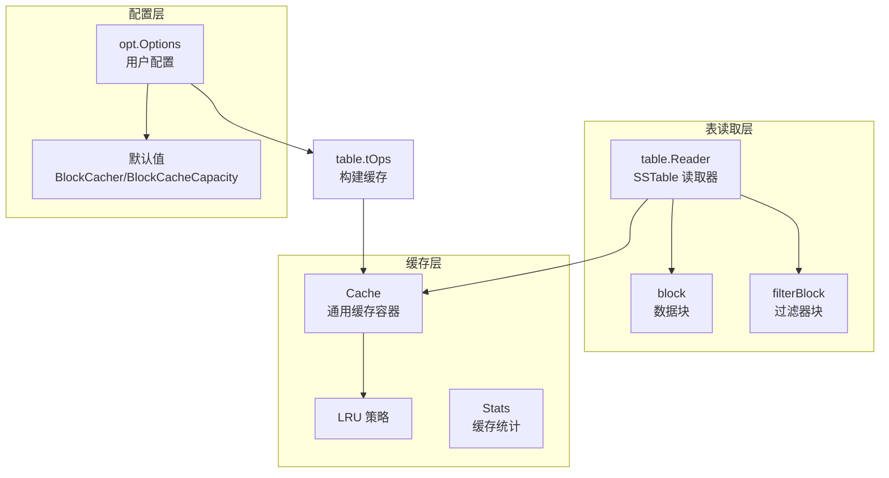
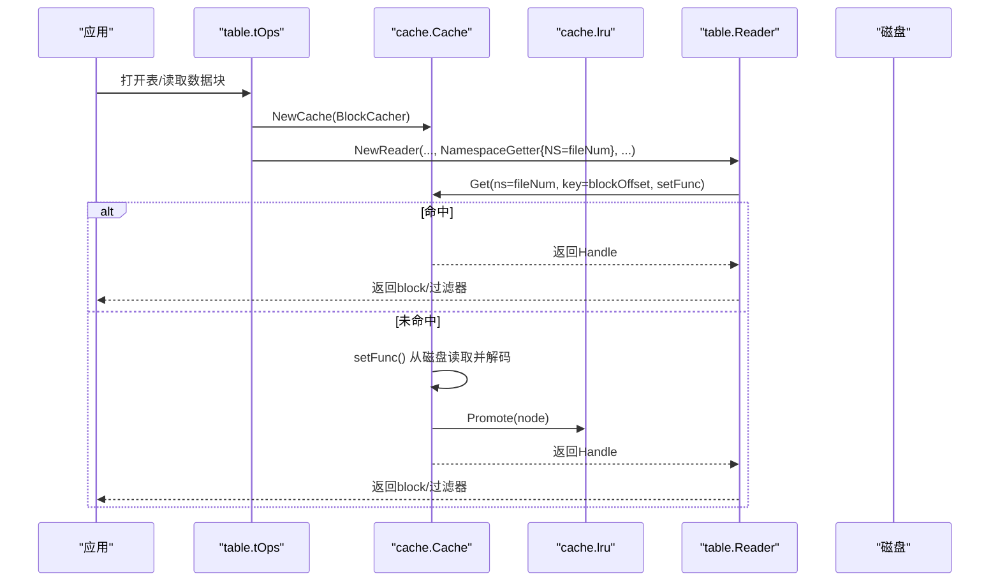
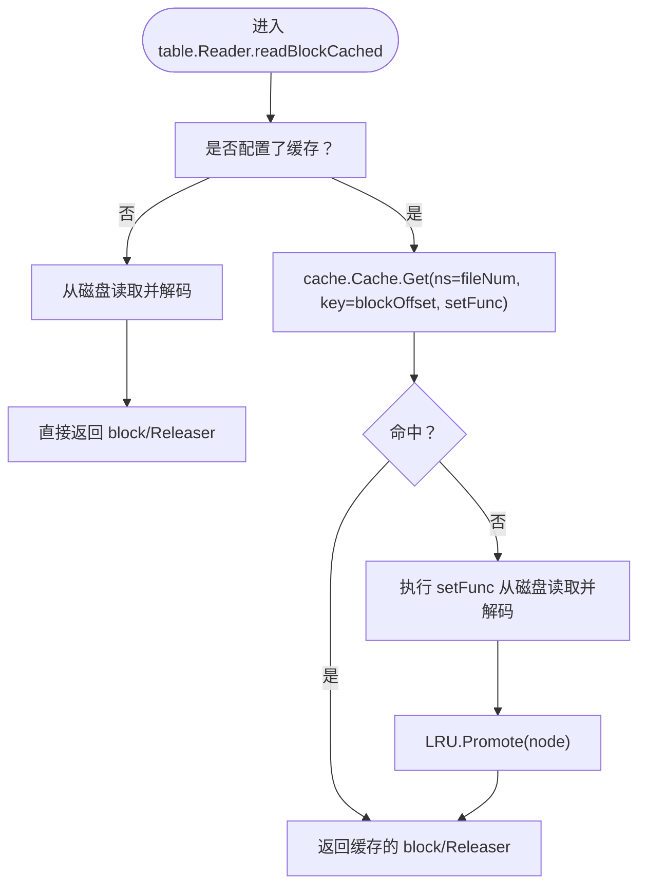
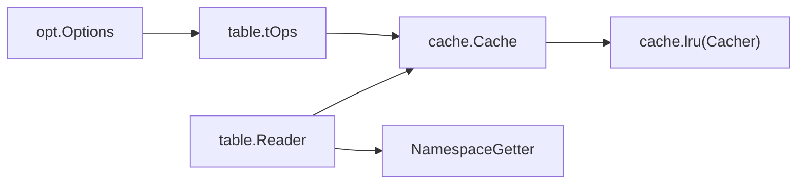

# BlockCache机制

<cite>
**本文引用的文件**
- [cache.go](file://leveldb/cache/cache.go)
- [lru.go](file://leveldb/cache/lru.go)
- [options.go](file://leveldb/opt/options.go)
- [reader.go](file://leveldb/table/reader.go)
- [table.go](file://leveldb/table/table.go)
- [cache_test.go](file://leveldb/cache/cache_test.go)
</cite>

## 目录
1. [引言](#引言)
2. [项目结构](#项目结构)
3. [核心组件](#核心组件)
4. [架构总览](#架构总览)
5. [详细组件分析](#详细组件分析)
6. [依赖关系分析](#依赖关系分析)
7. [性能考量](#性能考量)
8. [故障排查指南](#故障排查指南)
9. [结论](#结论)

## 引言
本文件系统性阐述 avccDB 中的 BlockCache 机制，聚焦于其在 SSTable 块数据缓存中的作用。内容覆盖：
- 如何通过 Options 结构中的 BlockCacher 和 BlockCacheCapacity 参数配置块缓存；
- 在 leveldb/cache/cache.go 中实现的通用缓存框架与 Stats 统计；
- 在 leveldb/cache/lru.go 中实现的 LRU 策略；
- 读取路径中缓存命中对性能的影响；
- 实际代码示例展示缓存获取流程（Get 方法）与缓存统计信息（Stats 结构）的使用；
- 缓存淘汰策略、并发安全设计以及 mHead 哈希表的动态扩容机制。

## 项目结构
围绕 BlockCache 的关键模块分布如下：
- 缓存框架：leveldb/cache/cache.go 提供通用缓存容器、节点管理、命名空间封装、统计与并发控制；
- LRU 策略：leveldb/cache/lru.go 提供基于双向链表的 LRU 淘汰；
- 表读取器：leveldb/table/reader.go 在读取 SSTable 数据块时使用缓存；
- 表操作与缓存装配：leveldb/table/table.go 在打开表时根据 Options 配置构建 BlockCache；
- 选项配置：leveldb/opt/options.go 定义默认值与用户可调参数；
- 测试与基准：leveldb/cache/cache_test.go 展示缓存行为与统计使用。

图表来源
- [cache.go](file://leveldb/cache/cache.go#L350-L438)
- [lru.go](file://leveldb/cache/lru.go#L41-L159)
- [reader.go](file://leveldb/table/reader.go#L624-L714)
- [table.go](file://leveldb/table/table.go#L538-L565)
- [options.go](file://leveldb/opt/options.go#L18-L45)

章节来源
- [cache.go](file://leveldb/cache/cache.go#L350-L438)
- [lru.go](file://leveldb/cache/lru.go#L41-L159)
- [reader.go](file://leveldb/table/reader.go#L624-L714)
- [table.go](file://leveldb/table/table.go#L538-L565)
- [options.go](file://leveldb/opt/options.go#L18-L45)

## 核心组件
- Cache：通用缓存容器，支持命名空间键控、并发安全、容量控制与统计。
- Cacher 接口：抽象缓存策略（如 LRU），定义 Capacity/SetCapacity/Promote/Ban/Evict 等能力。
- LRU：基于双向链表的最近最少使用策略，按字节大小进行容量控制与淘汰。
- Stats：缓存运行期统计，包括桶数量、节点数、总大小、命中/未命中、设置/删除次数等。
- table.Reader：在读取 SSTable 数据块与过滤器块时，通过 NamespaceGetter 将不同文件的块放入独立命名空间，避免跨文件污染。
- tOps：在打开表时根据 Options 构建文件缓存与块缓存，并为每个文件创建独立的命名空间。

章节来源
- [cache.go](file://leveldb/cache/cache.go#L19-L51)
- [cache.go](file://leveldb/cache/cache.go#L350-L438)
- [lru.go](file://leveldb/cache/lru.go#L41-L159)
- [reader.go](file://leveldb/table/reader.go#L624-L714)
- [table.go](file://leveldb/table/table.go#L538-L565)

## 架构总览
BlockCache 在 avccDB 中的职责是缓存 SSTable 的数据块与过滤器块，以减少磁盘 IO 并提升读取性能。整体流程：
- 打开表时，table.tOps 根据 Options 创建 BlockCache（可选禁用）；
- 为每个文件创建独立命名空间（NamespaceGetter），确保不同文件块不会互相影响；
- 读取数据块或过滤器块时，table.Reader 使用缓存；若命中则直接返回，未命中则从磁盘解码并写入缓存；
- LRU 策略根据容量阈值进行淘汰，保持缓存占用在合理范围；
- 通过 Stats 可观测命中率、节点数、总大小等指标。

图表来源
- [table.go](file://leveldb/table/table.go#L538-L565)
- [reader.go](file://leveldb/table/reader.go#L624-L714)
- [cache.go](file://leveldb/cache/cache.go#L464-L518)
- [lru.go](file://leveldb/cache/lru.go#L82-L116)

## 详细组件分析

### 1) Options 中的 BlockCache 配置
- BlockCacher：指定块缓存使用的算法实例（默认 LRU）。可通过自定义 Cacher 或共享已有实例实现多 DB 共享缓存。
- BlockCacheCapacity：块缓存容量（字节）。当为负数时等效于禁用缓存；为 0 时采用默认值。
- BlockCacheEvictRemoved：启用后对已移除的 SSTable 所属块强制驱逐。
- DisableBlockCache：显式禁用块缓存。

章节来源
- [options.go](file://leveldb/opt/options.go#L18-L45)
- [options.go](file://leveldb/opt/options.go#L176-L206)
- [options.go](file://leveldb/opt/options.go#L433-L447)

### 2) 缓存框架与 Stats 统计
- Cache 提供 Get/Delete/Evict/EvictNS/EvictAll/Close 等接口，内部维护 mHead 动态哈希表、节点计数与大小统计。
- Stats 字段包含：Buckets、Nodes、Size、GrowCount、ShrinkCount、HitCount、MissCount、SetCount、DelCount。
- GetStats 返回当前统计快照，用于监控缓存命中率与容量使用情况。

章节来源
- [cache.go](file://leveldb/cache/cache.go#L350-L438)
- [cache_test.go](file://leveldb/cache/cache_test.go#L246-L247)

### 3) LRU 策略实现
- LRU 使用双向链表维护“最近使用”顺序，Promote 将节点插入最近端；Ban 标记禁止再次提升；Evict 移除节点并释放句柄。
- SetCapacity 会按容量阈值从最久未使用端淘汰，直到 used ≤ capacity。
- LRU 仅按节点 Size 计算 used，不区分不同文件，但通过 NamespaceGetter 保证不同文件的块互不影响。

章节来源
- [lru.go](file://leveldb/cache/lru.go#L41-L159)

### 4) 读取路径中的缓存获取流程（Get 方法）
- table.Reader 在读取数据块与过滤器块时，优先尝试缓存命中；未命中则通过 setFunc 从磁盘读取并解码，随后写入缓存并触发 LRU Promote。
- 通过 NamespaceGetter 将不同文件的块放入独立命名空间，避免跨文件键冲突。

图表来源
- [reader.go](file://leveldb/table/reader.go#L624-L714)
- [cache.go](file://leveldb/cache/cache.go#L464-L518)
- [lru.go](file://leveldb/cache/lru.go#L82-L116)

章节来源
- [reader.go](file://leveldb/table/reader.go#L624-L714)
- [cache.go](file://leveldb/cache/cache.go#L464-L518)
- [lru.go](file://leveldb/cache/lru.go#L82-L116)

### 5) mHead 哈希表的动态扩容机制
- mHead 内部维护多个桶（mBucket），通过位掩码索引定位桶；初始大小固定，当节点数或溢出阈值达到条件时触发扩容/缩容。
- 扩容/缩容通过原子交换 mHead 指针完成，新旧头指针之间通过 predecessor 关联，后台异步初始化新桶。
- 桶状态包括未初始化、已初始化、冻结；冻结后不再插入新节点，防止并发冲突。

章节来源
- [cache.go](file://leveldb/cache/cache.go#L121-L189)
- [cache.go](file://leveldb/cache/cache.go#L191-L259)
- [cache.go](file://leveldb/cache/cache.go#L262-L318)
- [cache.go](file://leveldb/cache/cache.go#L319-L348)

### 6) 并发安全设计
- Cache 对外提供 RWMutex 保护；内部 mHead 通过原子指针切换实现无锁扩容/缩容。
- 每个桶内部使用互斥锁保护节点列表；节点自身也使用互斥锁保护字段访问。
- Handle 作为轻量级句柄，持有指向 Node 的指针，Release 时通过原子 CAS 清空并触发 unRef 外部逻辑。

章节来源
- [cache.go](file://leveldb/cache/cache.go#L362-L377)
- [cache.go](file://leveldb/cache/cache.go#L672-L782)

### 7) 缓存命中对读取性能的影响
- 命中可显著降低磁盘 IO 与解码开销，提升读取延迟与吞吐；
- 通过 GetStats 的 HitCount/MissCount 可评估命中率，结合 Nodes/Size 判断缓存规模是否合适；
- LRU 能够自动淘汰冷数据，维持热点块在缓存中，避免内存膨胀。

章节来源
- [cache.go](file://leveldb/cache/cache.go#L424-L438)
- [cache_test.go](file://leveldb/cache/cache_test.go#L356-L358)

## 依赖关系分析
- table.Reader 依赖 cache.Cache 与 NamespaceGetter 进行块缓存；
- table.tOps 依据 Options 构建缓存策略与缓存实例；
- LRU 作为 Cacher 实现被注入到 Cache；
- Options 提供默认策略与容量配置。

图表来源
- [options.go](file://leveldb/opt/options.go#L176-L206)
- [table.go](file://leveldb/table/table.go#L538-L565)
- [cache.go](file://leveldb/cache/cache.go#L362-L377)
- [lru.go](file://leveldb/cache/lru.go#L154-L159)
- [reader.go](file://leveldb/table/reader.go#L624-L714)

章节来源
- [options.go](file://leveldb/opt/options.go#L176-L206)
- [table.go](file://leveldb/table/table.go#L538-L565)
- [cache.go](file://leveldb/cache/cache.go#L362-L377)
- [lru.go](file://leveldb/cache/lru.go#L154-L159)
- [reader.go](file://leveldb/table/reader.go#L624-L714)

## 性能考量
- 命中率优化：增大 BlockCacheCapacity 可提高命中率，但需权衡内存占用；合理设置 BlockRestartInterval 有助于索引效率。
- LRU 容量控制：SetCapacity 会在超过阈值时主动淘汰，建议结合业务访问模式调整容量。
- 并发读取：mHead 的无锁扩容/缩容与桶内互斥锁配合，适合高并发场景；但热点文件过多可能导致单桶竞争。
- 缓存粒度：NamespaceGetter 将不同文件块隔离，避免跨文件键冲突，同时 LRU 不区分文件，需关注热点文件的块大小分布。

## 故障排查指南
- 命中率低：检查 BlockCacheCapacity 是否过小；确认是否启用了 BlockCache（DisableBlockCache=false）；观察 GetStats 中 MissCount/HitCount 比例。
- 内存占用异常：查看 Nodes/Size 与 Capacity 的关系；确认 LRU 是否正确淘汰；必要时调小容量或增加容量。
- 缓存未生效：确认 Options 中 BlockCacheCapacity > 0 且 BlockCacher 非空；检查 table.tOps 是否成功创建 blockCache。
- 并发问题：若出现死锁或竞态，检查是否在持有 Cache.mu/RWMutex 期间调用外部阻塞操作；确保 Handle.Release 仅在必要时调用。

章节来源
- [cache.go](file://leveldb/cache/cache.go#L424-L438)
- [cache_test.go](file://leveldb/cache/cache_test.go#L246-L247)
- [table.go](file://leveldb/table/table.go#L538-L565)

## 结论
avccDB 的 BlockCache 通过通用缓存框架与 LRU 策略，在 SSTable 数据块与过滤器块读取中实现了高效的缓存命中与淘汰控制。借助 Options 的灵活配置与 NamespaceGetter 的文件隔离，系统在高并发场景下仍能保持良好的性能与稳定性。通过 Stats 统计可量化缓存效果，指导容量与策略的进一步优化。