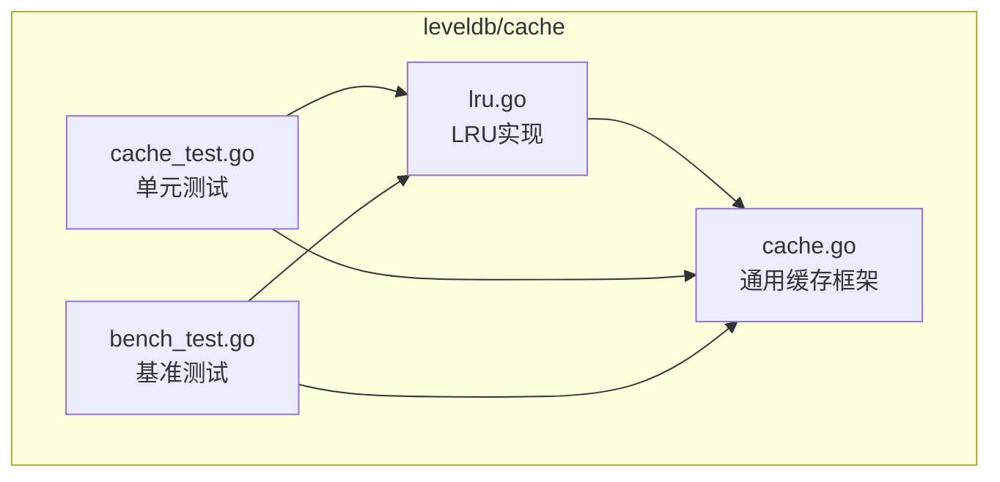
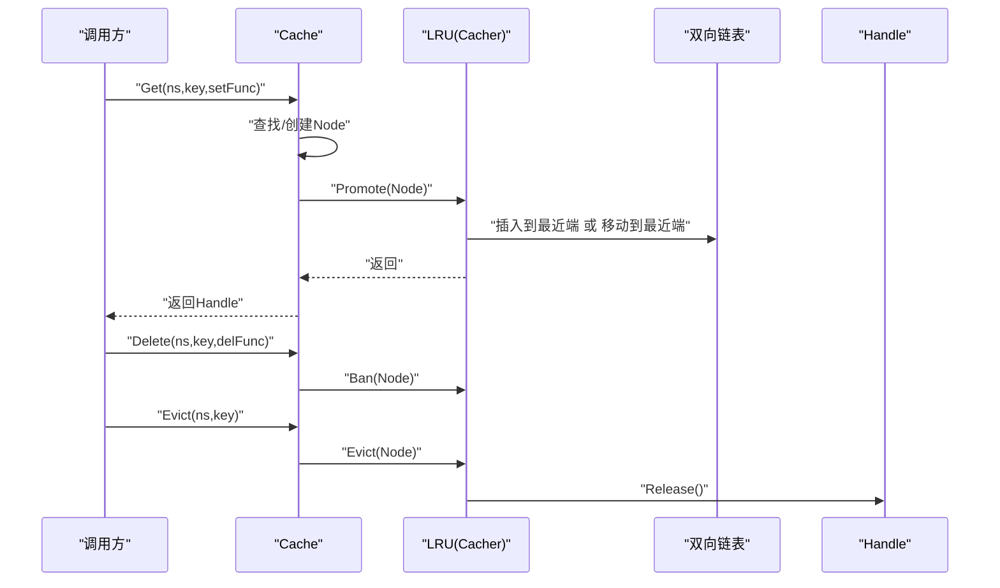
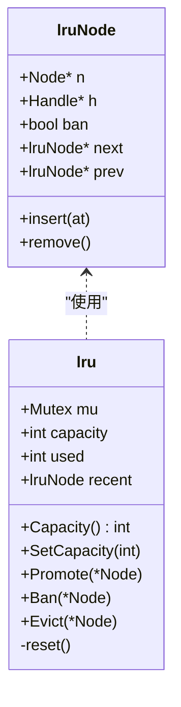
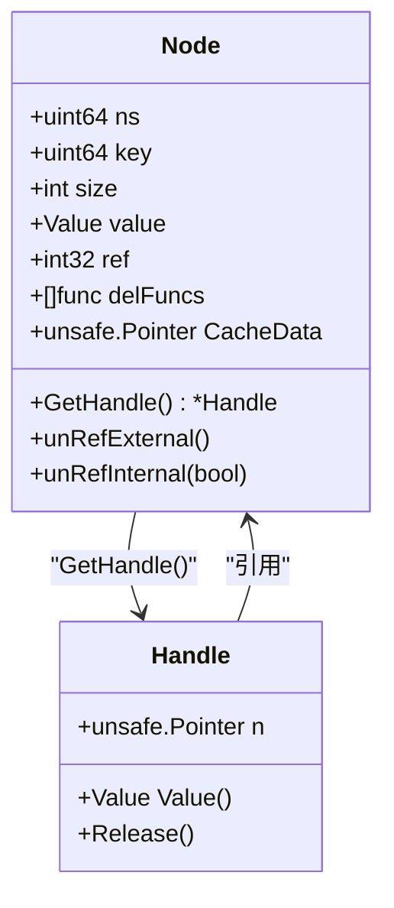
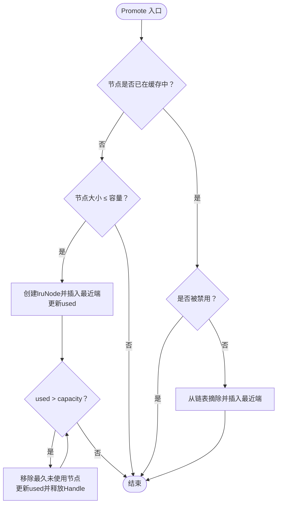
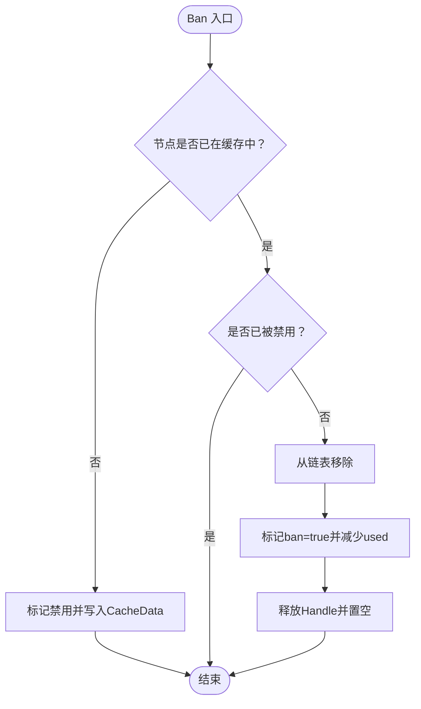
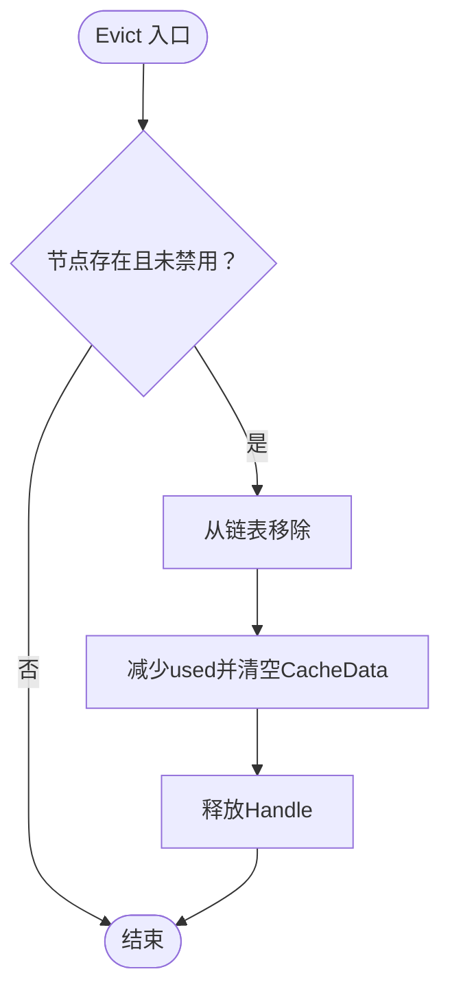
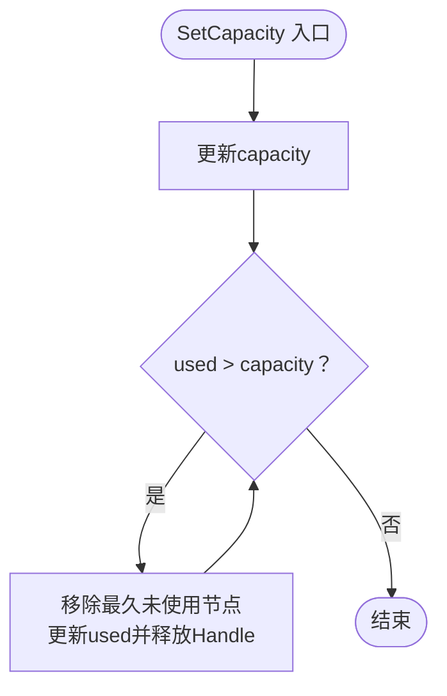
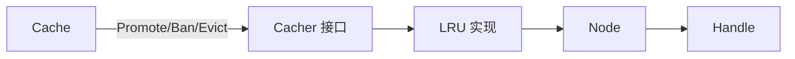

# LRU算法实现

<cite>
**本文引用的文件**
- [lru.go](file://leveldb/cache/lru.go)
- [cache.go](file://leveldb/cache/cache.go)
- [cache_test.go](file://leveldb/cache/cache_test.go)
- [bench_test.go](file://leveldb/cache/bench_test.go)
</cite>

## 目录
1. [简介](#简介)
2. [项目结构](#项目结构)
3. [核心组件](#核心组件)
4. [架构总览](#架构总览)
5. [详细组件分析](#详细组件分析)
6. [依赖关系分析](#依赖关系分析)
7. [性能考量](#性能考量)
8. [故障排查指南](#故障排查指南)
9. [结论](#结论)
10. [附录](#附录)

## 简介
本文件围绕 avccDB 中 leveldb/cache/lru.go 的 LRU 缓存实现进行系统化技术文档化，重点剖析：
- Cacher 接口的 Promote、Evict、Ban 方法如何协同实现“最近最少使用”的缓存语义；
- Node 节点在双向链表与哈希表中的组织方式；
- 在高并发场景下如何通过互斥锁与原子操作保证正确性与性能；
- 结合测试用例与基准测试，说明缓存项插入、访问、淘汰的完整流程；
- 时间复杂度与空间开销分析。

## 项目结构
LRU 缓存位于 leveldb/cache 子包内，核心文件包括：
- lru.go：LRU 缓存的具体实现，包含 lruNode、lru 结构体及 Promote/Evict/Ban/SetCapacity/Capacity 等方法；
- cache.go：通用缓存框架，定义 Cacher 接口、Node/Handle/Cache 等类型，以及与 LRU 的集成；
- cache_test.go：覆盖容量调整、淘汰、命中/未命中、删除禁用等行为的单元测试；
- bench_test.go：提供多类并发与串行基准测试，辅助评估性能特征。

图表来源
- [lru.go](file://leveldb/cache/lru.go#L1-L159)
- [cache.go](file://leveldb/cache/cache.go#L1-L200)

章节来源
- [lru.go](file://leveldb/cache/lru.go#L1-L159)
- [cache.go](file://leveldb/cache/cache.go#L1-L200)

## 核心组件
- Cacher 接口：定义容量查询、容量设置、提升、禁用、驱逐等能力，要求实现可并发安全；
- lru 结构体：维护容量、已用空间、最近访问的循环双向链表头节点；
- lruNode：封装 Node 指针、Handle 引用、禁用标记，以及前后指针，用于双向链表；
- Node：缓存节点，持有命名空间、键、大小、值、引用计数、外部删除回调等；
- Handle：对 Node 的轻量句柄，负责引用计数与释放；
- Cache：缓存映射层，负责哈希分桶、节点查找/创建、统计与与 Cacher 的交互。

章节来源
- [cache.go](file://leveldb/cache/cache.go#L19-L36)
- [cache.go](file://leveldb/cache/cache.go#L672-L782)
- [lru.go](file://leveldb/cache/lru.go#L41-L52)

## 架构总览
LRU 作为 Cacher 的具体实现，被 Cache 层调用以管理节点的生命周期与淘汰策略。整体流程如下：
- Cache.Get 触发节点查找或创建，成功后调用 Cacher.Promote；
- Cache.Delete 对节点执行禁用（Ban），阻止后续提升；
- Cache.Evict 对节点执行驱逐；
- Cache.SetCapacity 调整 LRU 容量，触发必要的淘汰；
- LRU 内部通过互斥锁保护链表与计数，必要时释放底层 Handle。

图表来源
- [cache.go](file://leveldb/cache/cache.go#L464-L518)
- [cache.go](file://leveldb/cache/cache.go#L520-L563)
- [cache.go](file://leveldb/cache/cache.go#L565-L594)
- [lru.go](file://leveldb/cache/lru.go#L82-L116)
- [lru.go](file://leveldb/cache/lru.go#L118-L136)
- [lru.go](file://leveldb/cache/lru.go#L138-L151)

## 详细组件分析

### LRU 数据结构与链表组织
- lruNode 字段：
  - n：指向 Node；
  - h：指向 Node.GetHandle() 返回的 Handle；
  - ban：禁用标记；
  - next/prev：双向链表指针。
- lru 字段：
  - mu：互斥锁；
  - capacity：容量；
  - used：已用空间；
  - recent：循环双向链表头节点（哨兵）。

lruNode 的插入与移除：
- insert：在 at 之后插入当前节点，维护 prev/next；
- remove：从链表中摘除当前节点，清空前后指针。

图表来源
- [lru.go](file://leveldb/cache/lru.go#L14-L28)
- [lru.go](file://leveldb/cache/lru.go#L41-L52)

章节来源
- [lru.go](file://leveldb/cache/lru.go#L14-L28)
- [lru.go](file://leveldb/cache/lru.go#L41-L52)

### Cacher 接口与方法语义
- Capacity()：返回当前容量；
- SetCapacity(int)：设置新容量，并按需淘汰超出部分；
- Promote(*Node)：提升节点至最近端；若节点首次加入且大小不超过容量，则插入链表并更新 used；若节点已在缓存中但未被禁用，则将其移动到最近端；
- Ban(*Node)：禁用节点，从链表移除并释放底层 Handle，防止后续提升；
- Evict(*Node)：驱逐节点，从链表移除并释放底层 Handle。

章节来源
- [cache.go](file://leveldb/cache/cache.go#L19-L36)
- [lru.go](file://leveldb/cache/lru.go#L54-L80)
- [lru.go](file://leveldb/cache/lru.go#L82-L116)
- [lru.go](file://leveldb/cache/lru.go#L118-L136)
- [lru.go](file://leveldb/cache/lru.go#L138-L151)

### Node 与 Handle 的协作
- Node 持有缓存数据的元信息（大小、值、引用计数、外部删除回调）；
- Node.CacheData 保存 LRU 的 lruNode 指针（unsafe.Pointer），用于快速定位链表节点；
- Handle 是 Node 的轻量包装，负责引用计数与释放，释放时会触发 Node 的 unRefExternal 流程；
- Cache.Get 成功后，若存在 Cacher 则调用 Promote，从而将节点纳入 LRU 链表。

图表来源
- [cache.go](file://leveldb/cache/cache.go#L672-L782)

章节来源
- [cache.go](file://leveldb/cache/cache.go#L672-L782)

### Promote 流程详解
- 若节点未在缓存中（CacheData 为空）：
  - 若节点大小不超过容量，则创建 lruNode，插入 recent 之后，更新 used；
  - 当 used 超过 capacity 时，持续从链表尾部（最久未使用）移除节点，直到 used 不超过容量；
  - 每次移除节点时，释放其底层 Handle；
- 若节点已在缓存中且未被禁用：
  - 将其从链表中摘除并重新插入到最近端。

图表来源
- [lru.go](file://leveldb/cache/lru.go#L82-L116)

章节来源
- [lru.go](file://leveldb/cache/lru.go#L82-L116)

### Ban 流程详解
- 若节点未在缓存中：直接标记为禁用；
- 若节点已在缓存中且未被禁用：从链表移除，标记 ban=true，减少 used，释放底层 Handle 并置空。

图表来源
- [lru.go](file://leveldb/cache/lru.go#L118-L136)

章节来源
- [lru.go](file://leveldb/cache/lru.go#L118-L136)

### Evict 流程详解
- 若节点不在缓存中或已被禁用：直接返回；
- 否则从链表移除，减少 used，清空 CacheData，释放底层 Handle。

图表来源
- [lru.go](file://leveldb/cache/lru.go#L138-L151)

章节来源
- [lru.go](file://leveldb/cache/lru.go#L138-L151)

### SetCapacity 流程详解
- 设置新容量后，若 used 超过新容量，从链表尾部持续移除节点，直至 used 不超过容量；
- 每次移除节点时，释放其底层 Handle。

图表来源
- [lru.go](file://leveldb/cache/lru.go#L60-L80)

章节来源
- [lru.go](file://leveldb/cache/lru.go#L60-L80)

### 与 Cache 的集成与并发控制
- Cache.Get：在节点创建或命中后，若存在 Cacher 则调用 Promote；
- Cache.Delete：对节点执行 Ban；
- Cache.Evict：对节点执行 Evict；
- Cache.SetCapacity：委托给 Cacher.SetCapacity；
- Cache 内部使用读写锁保护哈希分桶与状态，LRU 使用互斥锁保护链表与计数；
- Node.GetHandle 增加引用计数，Handle.Release 减少引用计数并在归零时触发删除流程。

章节来源
- [cache.go](file://leveldb/cache/cache.go#L464-L518)
- [cache.go](file://leveldb/cache/cache.go#L520-L563)
- [cache.go](file://leveldb/cache/cache.go#L565-L594)
- [cache.go](file://leveldb/cache/cache.go#L672-L782)

## 依赖关系分析
LRU 与 Cache 的依赖关系如下：
- Cache 通过 Cacher 接口抽象与 LRU 解耦；
- LRU 仅依赖 Node/Handle 的基本接口（如 GetHandle、Size、CacheData）；
- Cache 内部的哈希分桶与 LRU 的链表组织相互独立，通过 CacheData 关联。

图表来源
- [cache.go](file://leveldb/cache/cache.go#L19-L36)
- [cache.go](file://leveldb/cache/cache.go#L464-L518)
- [lru.go](file://leveldb/cache/lru.go#L82-L116)

章节来源
- [cache.go](file://leveldb/cache/cache.go#L19-L36)
- [cache.go](file://leveldb/cache/cache.go#L464-L518)
- [lru.go](file://leveldb/cache/lru.go#L82-L116)

## 性能考量
- 时间复杂度
  - Promote：O(1) 均摊（插入/移动到最近端），最坏情况下可能多次驱逐，每次 O(1)，总体 O(k)，k 为本次驱逐数量；
  - Ban：O(1)（摘除、标记、释放 Handle）；
  - Evict：O(1)（摘除、释放 Handle）；
  - SetCapacity：O(k)，k 为需要驱逐的数量；
  - Cache.Get：O(1) 均摊（哈希分桶查找，Promote O(1)）。
- 空间开销
  - LRU 链表每个节点占用常数额外空间（lruNode）；
  - Node.CacheData 保存 lruNode 指针，避免额外映射；
  - used 与 capacity 为整型计数，空间常数级；
  - Cache 的哈希分桶与节点存储由 Cache 层负责，LRU 不重复存储键信息。
- 并发与正确性
  - LRU 使用互斥锁保护链表与计数，避免竞态；
  - Cache 使用读写锁保护分桶与状态，Handle 的 Release 使用原子 CAS 保证引用计数安全；
  - 测试覆盖了并发插入、查找、删除、禁用、驱逐等场景，验证正确性与性能。

章节来源
- [cache_test.go](file://leveldb/cache/cache_test.go#L291-L358)
- [cache_test.go](file://leveldb/cache/cache_test.go#L426-L458)
- [cache_test.go](file://leveldb/cache/cache_test.go#L460-L498)
- [cache_test.go](file://leveldb/cache/cache_test.go#L500-L557)
- [bench_test.go](file://leveldb/cache/bench_test.go#L1-L202)

## 故障排查指南
- 常见问题与定位
  - 驱逐异常或容量不一致：检查 SetCapacity 是否正确触发驱逐，确认 used 与 capacity 的一致性；
  - 禁用后仍被提升：确认 Ban 是否正确设置 ban 标记并移除链表节点；
  - 访问延迟过高：关注并发压力与热点键导致的频繁驱逐；
  - 资源泄漏：确认 Handle.Release 是否被调用，以及 Evict/Ban 是否释放底层 Handle。
- 单元测试参考
  - 容量调整与节点数量/大小变化：参考容量测试用例；
  - 命中/未命中与禁用行为：参考命中/未命中与删除禁用测试；
  - 驱逐与全量驱逐：参考驱逐测试；
  - 并发与延迟：参考获取延迟测试与基准测试。

章节来源
- [cache_test.go](file://leveldb/cache/cache_test.go#L262-L279)
- [cache_test.go](file://leveldb/cache/cache_test.go#L360-L424)
- [cache_test.go](file://leveldb/cache/cache_test.go#L426-L498)
- [cache_test.go](file://leveldb/cache/cache_test.go#L499-L557)
- [bench_test.go](file://leveldb/cache/bench_test.go#L1-L202)

## 结论
LRU 在 avccDB 中通过简洁的双向链表与互斥锁实现了高效的最近最少使用缓存策略。Promote/Evict/Ban 三者协同，既能满足高并发下的正确性，又能在容量受限时自动淘汰最久未使用的节点。配合 Cache 的哈希分桶与 Handle 的引用计数机制，整体架构清晰、扩展性强，适合在高并发场景下稳定运行。

## 附录
- 关键路径参考
  - Promote：[lru.go](file://leveldb/cache/lru.go#L82-L116)
  - Ban：[lru.go](file://leveldb/cache/lru.go#L118-L136)
  - Evict：[lru.go](file://leveldb/cache/lru.go#L138-L151)
  - SetCapacity：[lru.go](file://leveldb/cache/lru.go#L60-L80)
  - Cache.Get/Promote 集成：[cache.go](file://leveldb/cache/cache.go#L464-L518)
  - Cache.Delete/Ban 集成：[cache.go](file://leveldb/cache/cache.go#L520-L563)
  - Cache.Evict/EvictAll 集成：[cache.go](file://leveldb/cache/cache.go#L565-L632)
  - Node/Handle 定义与引用计数：[cache.go](file://leveldb/cache/cache.go#L672-L782)
- 行为验证参考
  - 容量与淘汰：[cache_test.go](file://leveldb/cache/cache_test.go#L262-L279)
  - 命中/未命中与禁用：[cache_test.go](file://leveldb/cache/cache_test.go#L360-L424)
  - 驱逐与全量驱逐：[cache_test.go](file://leveldb/cache/cache_test.go#L426-L498)
  - 并发与延迟：[cache_test.go](file://leveldb/cache/cache_test.go#L291-L358)
  - 基准测试：[bench_test.go](file://leveldb/cache/bench_test.go#L1-L202)