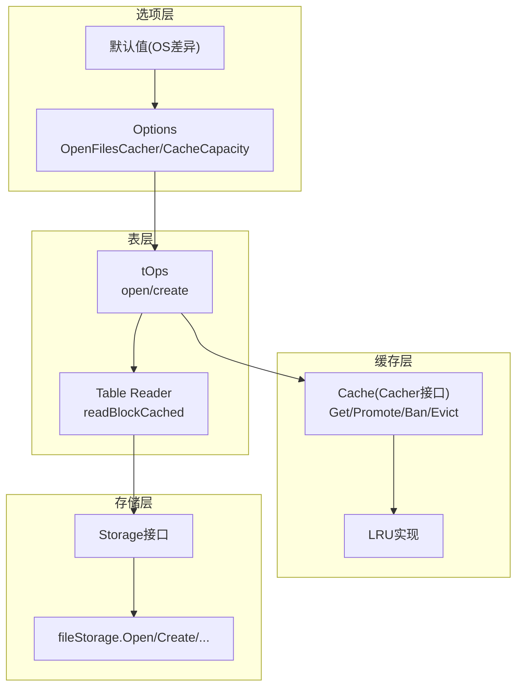
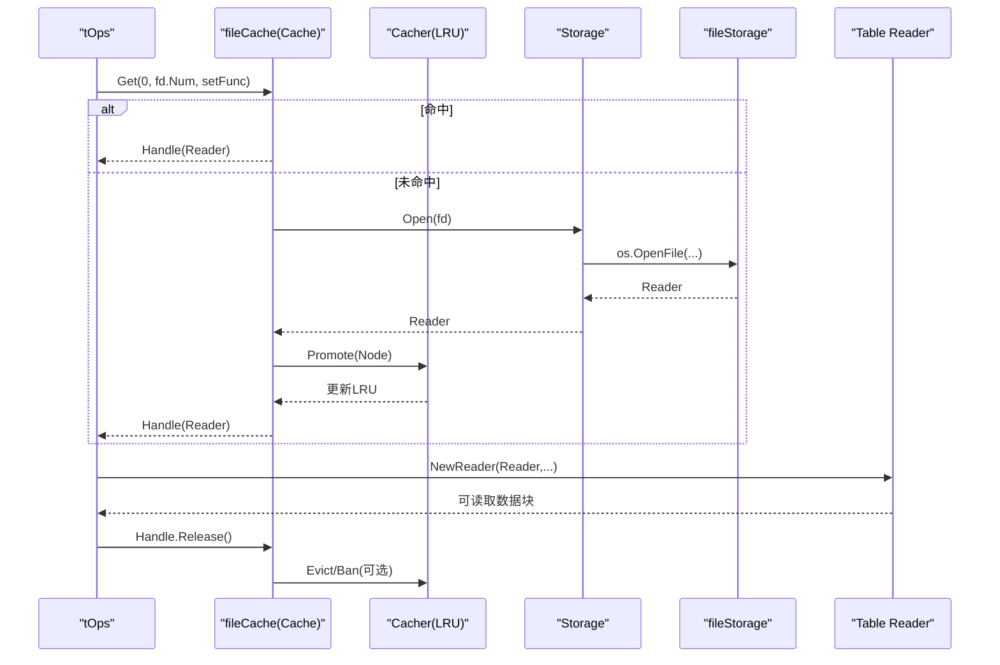
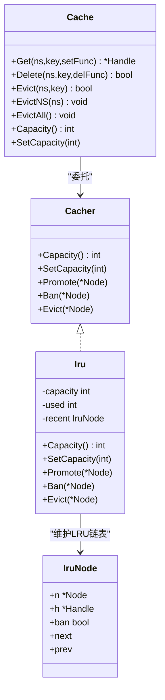
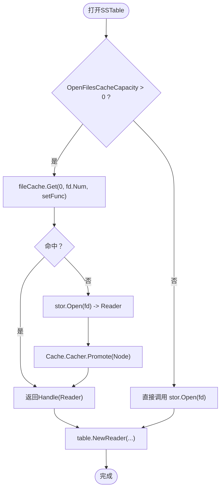

# OpenFilesCache机制

<cite>
**本文引用的文件列表**
- [options.go](file://leveldb/opt/options.go)
- [options_darwin.go](file://leveldb/opt/options_darwin.go)
- [options_default.go](file://leveldb/opt/options_default.go)
- [cache.go](file://leveldb/cache/cache.go)
- [lru.go](file://leveldb/cache/lru.go)
- [table.go](file://leveldb/table.go)
- [reader.go](file://leveldb/table/reader.go)
- [file_storage.go](file://leveldb/storage/file_storage.go)
- [storage.go](file://leveldb/storage/storage.go)
- [db.go](file://leveldb/db.go)
- [session.go](file://leveldb/session.go)
</cite>

## 目录
1. [引言](#引言)
2. [项目结构](#项目结构)
3. [核心组件](#核心组件)
4. [架构总览](#架构总览)
5. [详细组件分析](#详细组件分析)
6. [依赖关系分析](#依赖关系分析)
7. [性能考量](#性能考量)
8. [故障排查指南](#故障排查指南)
9. [结论](#结论)
10. [附录：配置最佳实践](#附录配置最佳实践)

## 引言
本文件围绕 avccDB 中的 OpenFilesCache 机制展开，系统性阐述其在文件描述符（文件句柄）管理中的关键作用、配置方式、与 BlockCache 共享 LRU 算法的实现细节，以及如何通过缓存显著降低文件系统调用开销、提升大量文件并发访问场景下的性能表现。同时给出容量设置建议与系统文件描述符限制的关系说明，帮助读者在不同平台与工作负载下做出合理配置。

## 项目结构
OpenFilesCache 的实现横跨选项配置、通用缓存框架、表读取器、存储层等多个模块：
- 选项层：定义 OpenFilesCacher 与 OpenFilesCacheCapacity 参数及其默认值
- 缓存层：提供通用 Cache 接口与 LRU 实现
- 表层：在打开 SSTable 时使用 OpenFilesCache 缓存文件 Reader
- 存储层：封装底层文件系统操作（Open/Create/Remove/Rename/Close）
- 会话层：负责初始化表操作对象，注入 OpenFilesCache



图表来源
- [options.go](file://leveldb/opt/options.go#L371-L382)
- [options_darwin.go](file://leveldb/opt/options_darwin.go#L1-L8)
- [options_default.go](file://leveldb/opt/options_default.go#L1-L8)
- [cache.go](file://leveldb/cache/cache.go#L19-L36)
- [lru.go](file://leveldb/cache/lru.go#L41-L159)
- [table.go](file://leveldb/table.go#L540-L565)
- [reader.go](file://leveldb/table/reader.go#L624-L656)
- [storage.go](file://leveldb/storage/storage.go#L157-L188)
- [file_storage.go](file://leveldb/storage/file_storage.go#L473-L517)

章节来源
- [options.go](file://leveldb/opt/options.go#L371-L382)
- [options_darwin.go](file://leveldb/opt/options_darwin.go#L1-L8)
- [options_default.go](file://leveldb/opt/options_default.go#L1-L8)
- [cache.go](file://leveldb/cache/cache.go#L19-L36)
- [lru.go](file://leveldb/cache/lru.go#L41-L159)
- [table.go](file://leveldb/table.go#L540-L565)
- [reader.go](file://leveldb/table/reader.go#L624-L656)
- [storage.go](file://leveldb/storage/storage.go#L157-L188)
- [file_storage.go](file://leveldb/storage/file_storage.go#L473-L517)

## 核心组件
- Options 中的 OpenFilesCacher 与 OpenFilesCacheCapacity
  - OpenFilesCacher：指定用于“打开文件”缓存的缓存算法，默认为 LRU
  - OpenFilesCacheCapacity：打开文件缓存容量；-1 等价于禁用缓存
- Cache 与 Cacher 接口
  - Cache 提供 Get/Promote/Ban/Evict 等方法，支持命名空间隔离
  - Cacher 定义 Capacity/SetCapacity/Promote/Ban/Evict
- LRU 实现
  - 维护最近使用链表，按容量上限淘汰最久未使用项
- 表层集成
  - tOps 在创建时根据 Options 构建 fileCache（NamespaceGetter），并在打开表时通过 Cache.Get 获取 Reader 并自动 Promote
- 存储层
  - Storage.Open 返回 Reader，fileStorage.Open 调用底层 os.OpenFile，维护已打开文件计数

章节来源
- [options.go](file://leveldb/opt/options.go#L371-L382)
- [options.go](file://leveldb/opt/options.go#L635-L650)
- [cache.go](file://leveldb/cache/cache.go#L19-L36)
- [lru.go](file://leveldb/cache/lru.go#L41-L159)
- [table.go](file://leveldb/table.go#L540-L565)
- [reader.go](file://leveldb/table/reader.go#L624-L656)
- [storage.go](file://leveldb/storage/storage.go#L157-L188)
- [file_storage.go](file://leveldb/storage/file_storage.go#L473-L517)

## 架构总览
OpenFilesCache 的整体流程如下：
- 初始化阶段：tOps 根据 Options 创建 fileCache（NamespaceGetter），内部持有 Cacher（默认 LRU）
- 访问阶段：打开 SSTable 时，tOps.open 使用 fileCache.Get(0, fd.Num, ...) 拉起 Reader；若缺失则通过 setFunc 执行存储层 Open，得到 Reader 后返回给 Cache，随后由 Cache 的 Cacher（LRU）Promote
- 命名空间：NamespaceGetter 将不同文件（fd.Num）隔离到独立命名空间，避免跨文件污染
- 释放阶段：Reader.Release 会关闭底层 Reader 并清理缓存引用



图表来源
- [table.go](file://leveldb/table.go#L540-L565)
- [table.go](file://leveldb/table.go#L403-L431)
- [cache.go](file://leveldb/cache/cache.go#L464-L518)
- [lru.go](file://leveldb/cache/lru.go#L82-L116)
- [storage.go](file://leveldb/storage/storage.go#L166-L174)
- [file_storage.go](file://leveldb/storage/file_storage.go#L473-L496)
- [reader.go](file://leveldb/table/reader.go#L1185-L1189)

## 详细组件分析

### 选项与默认值
- OpenFilesCacher 默认使用 LRUCacher
- OpenFilesCacheCapacity 默认值随操作系统而异：
  - macOS：200
  - 非 macOS：500
- 当 OpenFilesCacheCapacity 设置为 -1 或 0 时，等价于禁用 OpenFilesCache

章节来源
- [options.go](file://leveldb/opt/options.go#L371-L382)
- [options.go](file://leveldb/opt/options.go#L635-L650)
- [options_darwin.go](file://leveldb/opt/options_darwin.go#L1-L8)
- [options_default.go](file://leveldb/opt/options_default.go#L1-L8)

### 缓存框架与 LRU 算法
- Cache 接口
  - Capacity/SetCapacity/Promote/Ban/Evict
  - Get/Put/Delete/EvictNS/EvictAll
- LRU 实现要点
  - 使用双向链表维护最近使用顺序
  - Promote 时插入到最近位置；当 used 超过 capacity 时从尾部逐出
  - Ban 标记禁止后续 Promote，Evict 直接移除
  - SetCapacity 动态调整容量并触发逐出



图表来源
- [cache.go](file://leveldb/cache/cache.go#L19-L36)
- [cache.go](file://leveldb/cache/cache.go#L450-L518)
- [lru.go](file://leveldb/cache/lru.go#L41-L159)

章节来源
- [cache.go](file://leveldb/cache/cache.go#L19-L36)
- [cache.go](file://leveldb/cache/cache.go#L450-L518)
- [lru.go](file://leveldb/cache/lru.go#L41-L159)

### 表层集成与文件缓存
- tOps 初始化
  - 若 OpenFilesCacheCapacity > 0，则创建 fileCache（NamespaceGetter），并传入 Cacher.New(capacity)
- 打开表
  - tOps.open 使用 fileCache.Get(0, fd.Num, setFunc)，setFunc 内部调用 s.stor.Open(fd) 获取 Reader
  - Cache 在命中后调用 Cacher.Promote，使该 Reader 成为最近使用的条目
- 命名空间隔离
  - NamespaceGetter 将每个文件的 fd.Num 作为命名空间，确保不同文件的缓存互不干扰



图表来源
- [table.go](file://leveldb/table.go#L540-L565)
- [table.go](file://leveldb/table.go#L403-L431)
- [cache.go](file://leveldb/cache/cache.go#L464-L518)

章节来源
- [table.go](file://leveldb/table.go#L540-L565)
- [table.go](file://leveldb/table.go#L403-L431)
- [cache.go](file://leveldb/cache/cache.go#L464-L518)

### 存储层与文件描述符管理
- Storage 接口定义了 Open/Create/Remove/Rename/Close 等方法
- fileStorage.Open 调用 os.OpenFile 打开文件，维护 open 计数
- fileStorage.Close 将 open 置为负值以标记关闭状态，并释放锁

章节来源
- [storage.go](file://leveldb/storage/storage.go#L157-L188)
- [file_storage.go](file://leveldb/storage/file_storage.go#L473-L517)
- [file_storage.go](file://leveldb/storage/file_storage.go#L565-L582)

### 与 BlockCache 的关系
- BlockCache 用于缓存 SSTable 的数据块，同样基于 Cache/Cacher
- OpenFilesCache 与 BlockCache 分别服务于“文件级”和“块级”，二者共享相同的 LRU 算法抽象，但各自独立运行
- 在高并发场景下，两者协同工作：OpenFilesCache 减少文件系统调用次数，BlockCache 减少磁盘块读取次数

章节来源
- [table.go](file://leveldb/table.go#L540-L565)
- [reader.go](file://leveldb/table/reader.go#L624-L656)

## 依赖关系分析
- Options 依赖 Cacher/NewLRU/LRUCacher
- tOps 依赖 Options 与 Cache，构造 fileCache
- Cache 依赖 Cacher（默认 LRU）
- LRU 依赖 Node/Handle 生命周期管理
- Table Reader 依赖 Storage 与 BufferPool
- Storage 依赖 fileStorage/os 文件系统

```mermaid
graph LR
Opt["Options"] --> |GetOpenFilesCacher/GetOpenFilesCacheCapacity| T["tOps"]
T --> |NewCache| C["Cache"]
C --> |Cacher| L["LRU"]
T --> |Open(fd)| S["Storage"]
S --> FS["fileStorage"]
T --> TR["Table Reader"]
TR --> S
```

图表来源
- [options.go](file://leveldb/opt/options.go#L371-L382)
- [options.go](file://leveldb/opt/options.go#L635-L650)
- [table.go](file://leveldb/table.go#L540-L565)
- [cache.go](file://leveldb/cache/cache.go#L379-L418)
- [lru.go](file://leveldb/cache/lru.go#L153-L159)
- [storage.go](file://leveldb/storage/storage.go#L157-L188)
- [file_storage.go](file://leveldb/storage/file_storage.go#L473-L496)
- [reader.go](file://leveldb/table/reader.go#L1185-L1189)

章节来源
- [options.go](file://leveldb/opt/options.go#L371-L382)
- [table.go](file://leveldb/table.go#L540-L565)
- [cache.go](file://leveldb/cache/cache.go#L379-L418)
- [lru.go](file://leveldb/cache/lru.go#L153-L159)
- [storage.go](file://leveldb/storage/storage.go#L157-L188)
- [file_storage.go](file://leveldb/storage/file_storage.go#L473-L496)
- [reader.go](file://leveldb/table/reader.go#L1185-L1189)

## 性能考量
- 减少文件系统调用
  - 通过 OpenFilesCache 缓存 Reader，避免频繁调用底层 os.OpenFile，从而降低系统调用开销
- LRU 策略
  - 最近使用的文件优先保留，淘汰最久未使用的文件，提高命中率
- 命名空间隔离
  - 不同文件的缓存相互独立，避免跨文件竞争导致的抖动
- 与 BlockCache 协同
  - 文件级缓存与块级缓存共同作用，进一步降低磁盘 IO
- 平台差异
  - macOS 默认容量较小（200），非 macOS 默认较大（500），需结合系统资源与并发需求选择

章节来源
- [options_darwin.go](file://leveldb/opt/options_darwin.go#L1-L8)
- [options_default.go](file://leveldb/opt/options_default.go#L1-L8)
- [table.go](file://leveldb/table.go#L540-L565)
- [cache.go](file://leveldb/cache/cache.go#L464-L518)

## 故障排查指南
- 打开文件失败
  - 检查 OpenFilesCache 是否被禁用（Capacity=-1 或 0）
  - 检查存储层是否返回错误（fileStorage.Open）
- 缓存未生效
  - 确认 Options 中 OpenFilesCacher 已正确设置为 LRU 或自定义 Cacher
  - 确认 OpenFilesCacheCapacity 大于 0
- 内存占用异常
  - 检查 LRU 容量是否过大，导致内存压力
  - 观察 Cache.GetStats 输出（节点数、大小、命中/未命中统计）
- 文件句柄泄漏
  - 确保 Reader 正确释放（Release），避免 Handle 未释放导致缓存节点无法回收
- 并发访问冲突
  - 确认 Cache 的并发安全（Get/Promote/Ban/Evict 均为线程安全）

章节来源
- [options.go](file://leveldb/opt/options.go#L371-L382)
- [options.go](file://leveldb/opt/options.go#L635-L650)
- [cache.go](file://leveldb/cache/cache.go#L424-L437)
- [cache.go](file://leveldb/cache/cache.go#L634-L670)
- [file_storage.go](file://leveldb/storage/file_storage.go#L473-L517)
- [reader.go](file://leveldb/table/reader.go#L1159-L1183)

## 结论
OpenFilesCache 通过在文件级引入 LRU 缓存，有效减少了频繁打开/关闭文件带来的系统调用开销，尤其在大量文件并发访问场景下效果显著。它与 BlockCache 共享同一套 LRU 抽象，分别覆盖“文件句柄”和“数据块”的缓存，形成互补的缓存策略。合理配置 OpenFilesCacheCapacity 并结合系统文件描述符限制，可在保证稳定性的同时获得最佳性能。

## 附录：配置最佳实践
- 默认容量
  - macOS：200
  - 非 macOS：500
- 容量设置建议
  - 低并发：可按默认值起步
  - 高并发/多文件：根据文件数量与访问模式适当上调；若内存紧张，保持默认或下调
  - 禁用缓存：将 OpenFilesCacheCapacity 设为 -1 或 0
- 与系统文件描述符限制的关系
  - 操作系统对单进程可打开文件数有限制（ulimit/系统级限制）
  - OpenFilesCacheCapacity 应小于等于系统允许的最大文件描述符数，避免因缓存过多文件导致句柄耗尽
  - 建议监控系统文件描述符使用情况，结合业务峰值并发进行压测与调优
- 与其他缓存的协同
  - BlockCache 与 OpenFilesCache 可并行启用，分别优化块级与文件级访问
  - 若 BlockCache 已占较大内存，可适当降低 OpenFilesCacheCapacity 以平衡内存占用

章节来源
- [options_darwin.go](file://leveldb/opt/options_darwin.go#L1-L8)
- [options_default.go](file://leveldb/opt/options_default.go#L1-L8)
- [options.go](file://leveldb/opt/options.go#L371-L382)
- [options.go](file://leveldb/opt/options.go#L635-L650)
- [table.go](file://leveldb/table.go#L540-L565)