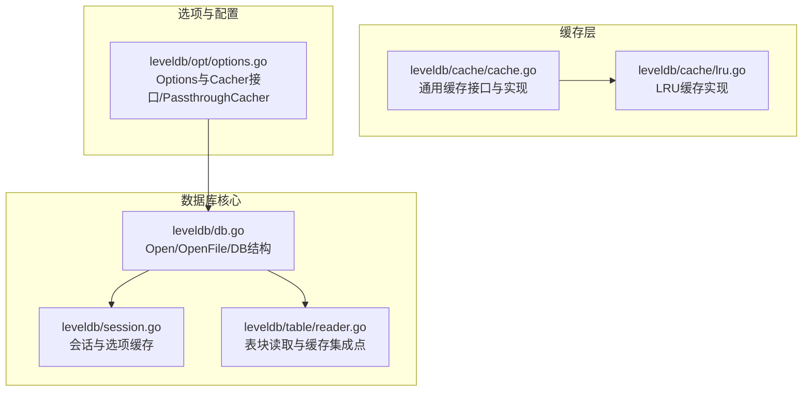
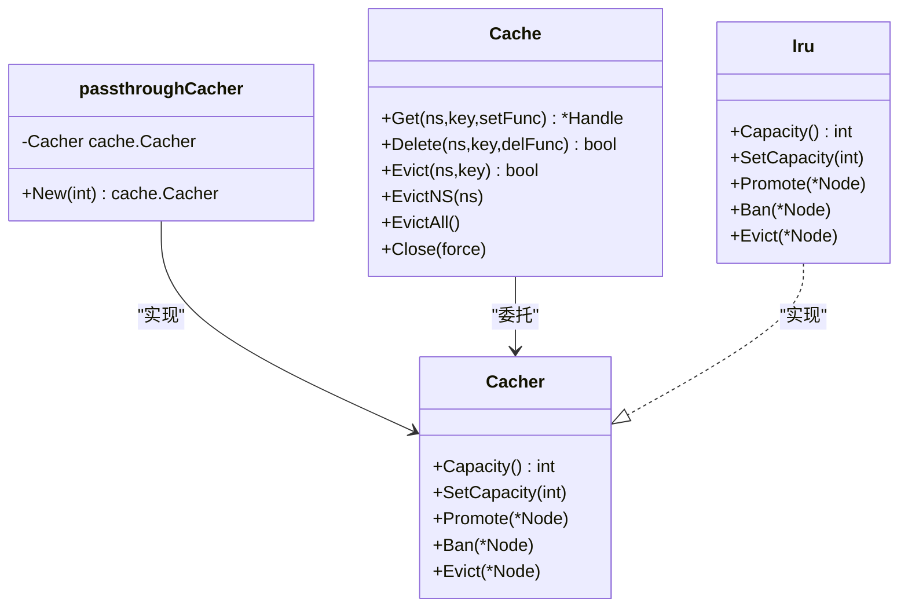
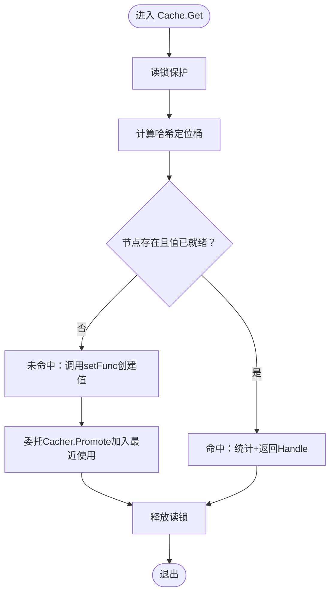
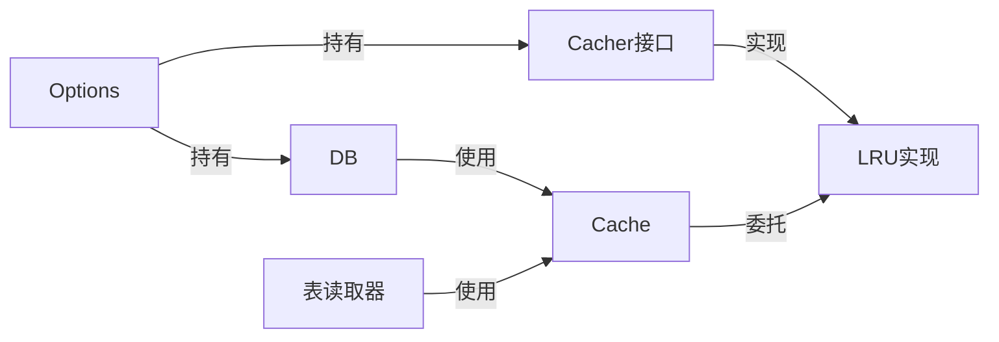

# 缓存共享与PassthroughCacher

<cite>
**本文引用的文件列表**
- [leveldb/cache/cache.go](file://leveldb/cache/cache.go)
- [leveldb/cache/lru.go](file://leveldb/cache/lru.go)
- [leveldb/opt/options.go](file://leveldb/opt/options.go)
- [leveldb/db.go](file://leveldb/db.go)
- [leveldb/session.go](file://leveldb/session.go)
- [leveldb/table/reader.go](file://leveldb/table/reader.go)
- [README.md](file://README.md)
</cite>

## 目录
1. [简介](#简介)
2. [项目结构](#项目结构)
3. [核心组件](#核心组件)
4. [架构总览](#架构总览)
5. [详细组件分析](#详细组件分析)
6. [依赖关系分析](#依赖关系分析)
7. [性能考量](#性能考量)
8. [故障排查指南](#故障排查指南)
9. [结论](#结论)
10. [附录](#附录)

## 简介
本文件围绕 avccDB 的缓存共享机制展开，重点阐述 PassthroughCacher 的实现原理与使用场景，并结合 leveldb/opt/options.go 中的代码示例，说明如何预初始化缓存实例并通过 Options 配置实现跨多个 DB 实例共享同一缓存实例（如 LRU 缓存）。文档还分析了共享缓存的生命周期管理、线程安全保证以及潜在性能瓶颈与调优策略，帮助读者在多实例部署中优化内存利用率并提升整体性能。

## 项目结构
本仓库采用按功能域分层的组织方式：
- leveldb/cache：通用缓存接口与实现（含 LRU）
- leveldb/opt：数据库选项与缓存算法选择器
- leveldb：数据库核心实现（Open/OpenFile、会话、表读写等）
- leveldb/table：表块读取与迭代器
- 根目录 README 提供基本使用说明



图表来源
- [leveldb/cache/cache.go](file://leveldb/cache/cache.go#L1-L120)
- [leveldb/cache/lru.go](file://leveldb/cache/lru.go#L1-L60)
- [leveldb/opt/options.go](file://leveldb/opt/options.go#L47-L106)
- [leveldb/db.go](file://leveldb/db.go#L177-L243)
- [leveldb/session.go](file://leveldb/session.go#L70-L121)
- [leveldb/table/reader.go](file://leveldb/table/reader.go#L1-L60)

章节来源
- [README.md](file://README.md#L1-L30)
- [leveldb/cache/cache.go](file://leveldb/cache/cache.go#L1-L120)
- [leveldb/cache/lru.go](file://leveldb/cache/lru.go#L1-L60)
- [leveldb/opt/options.go](file://leveldb/opt/options.go#L47-L106)
- [leveldb/db.go](file://leveldb/db.go#L177-L243)
- [leveldb/session.go](file://leveldb/session.go#L70-L121)
- [leveldb/table/reader.go](file://leveldb/table/reader.go#L1-L60)

## 核心组件
- 通用缓存接口与实现
  - Cacher 接口定义容量查询、设置、节点提升、封禁与驱逐等能力，要求实现并发安全。
  - Cache 提供命名空间化的缓存映射，内部以哈希桶数组组织节点，支持统计与生命周期管理。
  - LRU 缓存实现基于双向链表维护最近使用顺序，按容量上限进行淘汰。
- 选项与缓存算法选择
  - Options 持有 BlockCacher、OpenFilesCacher 等字段，用于指定块缓存与打开文件缓存的算法与容量。
  - Cacher 接口抽象算法工厂；PassthroughCacher 将已预初始化的缓存实例“透传”给多个 DB 实例共享。
- 数据库核心
  - Open/OpenFile 负责打开或创建数据库；会话负责加载/恢复元数据与应用选项。
  - 表读取器在读取块时可利用缓存，减少磁盘 IO 并提升命中率。

章节来源
- [leveldb/cache/cache.go](file://leveldb/cache/cache.go#L19-L63)
- [leveldb/cache/cache.go](file://leveldb/cache/cache.go#L362-L463)
- [leveldb/cache/lru.go](file://leveldb/cache/lru.go#L41-L159)
- [leveldb/opt/options.go](file://leveldb/opt/options.go#L176-L210)
- [leveldb/opt/options.go](file://leveldb/opt/options.go#L372-L383)
- [leveldb/db.go](file://leveldb/db.go#L177-L243)
- [leveldb/session.go](file://leveldb/session.go#L70-L121)
- [leveldb/table/reader.go](file://leveldb/table/reader.go#L1-L60)

## 架构总览
下图展示了通过 PassthroughCacher 在多个 DB 实例之间共享同一缓存实例的关键交互路径：应用层预初始化缓存实例，将其注入 Options 的 BlockCacher/OpenFilesCacher 字段，随后每个 DB 实例在启动时复用该实例，从而实现跨实例共享。

```mermaid
sequenceDiagram
participant App as "应用"
participant Opt as "Options"
participant DB1 as "DB实例1"
participant DB2 as "DB实例2"
participant Cache as "共享缓存实例(LRU)"
participant Table as "表读取器"
App->>Opt : 设置 BlockCacher/OpenFilesCacher 为共享缓存实例
App->>DB1 : Open/OpenFile(options)
DB1->>DB1 : 初始化会话/加载选项
DB1->>Cache : 使用缓存进行块/文件缓存
App->>DB2 : Open/OpenFile(options)
DB2->>DB2 : 初始化会话/加载选项
DB2->>Cache : 复用同一缓存实例
Table->>Cache : 命中/未命中时Promote/Evict/Ban
Cache-->>Table : 返回缓存对象或触发淘汰
```

图表来源
- [leveldb/opt/options.go](file://leveldb/opt/options.go#L75-L98)
- [leveldb/db.go](file://leveldb/db.go#L177-L243)
- [leveldb/session.go](file://leveldb/session.go#L70-L121)
- [leveldb/table/reader.go](file://leveldb/table/reader.go#L1-L60)

## 详细组件分析

### PassthroughCacher 实现与使用
- 设计目标
  - 允许用户预初始化一个缓存实例（例如 LRU），并通过 PassthroughCacher 将其“透传”给多个 DB 实例共享，避免重复分配与浪费内存。
- 关键实现
  - passthroughCacher 结构体持有已初始化的 cache.Cacher 实例。
  - New(capacity int) 直接返回该已存在的实例，不创建新实例，从而实现共享。
  - 示例注释展示了如何将预初始化的 fileCache 与 blockCache 注入 Options，然后分别打开多个 DB 实例共享这些缓存。
- 使用建议
  - 对于多实例部署，优先使用 PassthroughCacher 包装预初始化的 LRU 实例，统一控制容量与行为。
  - 若需完全禁用某类缓存，可使用 NoCacher 或将对应 Cacher 字段设为 nil。



图表来源
- [leveldb/cache/cache.go](file://leveldb/cache/cache.go#L19-L63)
- [leveldb/cache/lru.go](file://leveldb/cache/lru.go#L41-L159)
- [leveldb/opt/options.go](file://leveldb/opt/options.go#L66-L98)

章节来源
- [leveldb/opt/options.go](file://leveldb/opt/options.go#L66-L98)
- [leveldb/opt/options.go](file://leveldb/opt/options.go#L75-L98)

### 缓存生命周期与线程安全
- 生命周期
  - 创建：通过 NewCache 可选地传入 Cacher 实例，Cache 内部保存该实例并在 Get/Delete/Evict 等操作中委托。
  - 运行期：Get 时若未命中则调用 setFunc 创建节点值并由 Cacher.Promote 加入最近使用队列；Delete/Evict 触发 Ban/Evict，必要时释放资源。
  - 关闭：Close(force) 会遍历所有节点，强制驱逐并调用最终化逻辑，确保资源回收。
- 线程安全
  - Cache 内部使用 RWMutex 保护关键状态，Get/Delete/Evict 等方法在读锁下执行，保证并发安全。
  - LRU 实现使用互斥锁保护链表与容量计数，Promote/SetCapacity/Ban/Evict 等均在互斥锁内完成，避免竞态。
  - Node 的引用计数通过原子操作更新，Handle.Release 通过 CAS 保证幂等释放。



图表来源
- [leveldb/cache/cache.go](file://leveldb/cache/cache.go#L464-L518)
- [leveldb/cache/cache.go](file://leveldb/cache/cache.go#L519-L594)
- [leveldb/cache/lru.go](file://leveldb/cache/lru.go#L82-L116)

章节来源
- [leveldb/cache/cache.go](file://leveldb/cache/cache.go#L362-L463)
- [leveldb/cache/cache.go](file://leveldb/cache/cache.go#L464-L594)
- [leveldb/cache/lru.go](file://leveldb/cache/lru.go#L41-L116)

### 与数据库的集成点
- 打开数据库
  - Open/OpenFile 调用 newSession 并恢复/创建会话，期间会加载 Options 并应用到后续流程。
- 选项与缓存
  - Options.GetBlockCacher/GetOpenFilesCacher 提供默认算法与容量，也可被用户通过 PassthroughCacher 自定义。
- 表读取与缓存
  - 表读取器在读取块时可利用缓存（例如块过滤器、块数据等），命中后由 Cacher.Promote 更新最近使用，未命中则由 setFunc 加载并加入缓存。

```mermaid
sequenceDiagram
participant App as "应用"
participant DB as "DB"
participant Sess as "Session"
participant Opt as "Options"
participant Cache as "共享缓存"
participant Table as "表读取器"
App->>DB : Open/OpenFile(options)
DB->>Sess : newSession()
Sess->>Opt : setOptions()/加载选项
DB->>DB : 打开成功
Table->>Cache : 读取块时查询/插入
Cache-->>Table : 命中/未命中处理
```

图表来源
- [leveldb/db.go](file://leveldb/db.go#L177-L243)
- [leveldb/session.go](file://leveldb/session.go#L70-L121)
- [leveldb/opt/options.go](file://leveldb/opt/options.go#L176-L210)
- [leveldb/table/reader.go](file://leveldb/table/reader.go#L1-L60)

章节来源
- [leveldb/db.go](file://leveldb/db.go#L177-L243)
- [leveldb/session.go](file://leveldb/session.go#L70-L121)
- [leveldb/opt/options.go](file://leveldb/opt/options.go#L176-L210)
- [leveldb/table/reader.go](file://leveldb/table/reader.go#L1-L60)

## 依赖关系分析
- 组件耦合
  - Cache 依赖 Cacher 接口，具体算法（如 LRU）通过实现该接口接入。
  - Options 通过 Cacher 接口抽象算法工厂，PassthroughCacher 则直接返回共享实例。
  - DB 在打开阶段加载 Options，间接决定缓存策略。
- 外部依赖
  - 表读取器在读取块时可能访问缓存，形成对 Cache 的调用链。
- 循环依赖
  - 未发现循环依赖迹象；各模块职责清晰，接口边界明确。



图表来源
- [leveldb/opt/options.go](file://leveldb/opt/options.go#L47-L106)
- [leveldb/cache/cache.go](file://leveldb/cache/cache.go#L19-L63)
- [leveldb/cache/lru.go](file://leveldb/cache/lru.go#L41-L159)
- [leveldb/table/reader.go](file://leveldb/table/reader.go#L1-L60)

章节来源
- [leveldb/opt/options.go](file://leveldb/opt/options.go#L47-L106)
- [leveldb/cache/cache.go](file://leveldb/cache/cache.go#L19-L63)
- [leveldb/cache/lru.go](file://leveldb/cache/lru.go#L41-L159)
- [leveldb/table/reader.go](file://leveldb/table/reader.go#L1-L60)

## 性能考量
- 共享缓存的优势
  - 减少重复缓存实例占用的内存，尤其在多实例场景下显著降低总体内存峰值。
  - 统一的 LRU 策略可提升跨实例的缓存命中率，减少重复加载。
- 潜在瓶颈与调优
  - LRU 锁竞争：大量并发 Get/Evict 时，LRU 的互斥锁可能成为热点。可通过合理设置容量、减少频繁扩容/缩容、避免过度并发写入等方式缓解。
  - 哈希桶扩容：Cache 的动态哈希桶在高并发下可能触发 resize，影响性能。可通过预估负载与容量，减少扩容次数。
  - 读写锁竞争：Cache.Get/Delete/Evict 使用读锁，若写路径频繁，可能造成读锁等待。可考虑将热点键空间拆分或调整并发模式。
  - 表块缓存命中：表读取器命中缓存可显著降低磁盘 IO，未命中时应评估 setFunc 的成本与缓存大小是否匹配。

[本节为通用性能讨论，无需列出具体文件来源]

## 故障排查指南
- 常见问题
  - 缓存未生效：检查 Options 中 BlockCacher/OpenFilesCacher 是否正确设置为 PassthroughCacher 或 LRU 工厂函数。
  - 多实例内存异常增长：确认是否为多个独立缓存实例导致，应改为共享实例。
  - 释放异常：Handle.Release 应仅调用一次，多次释放不会报错但可能导致悬挂引用，需确保调用路径正确。
  - 关闭时资源未释放：Close(force) 会强制驱逐并调用最终化逻辑，若仍残留，检查是否有外部强引用未释放。
- 定位手段
  - 通过 Cache.GetStats 获取命中/未命中/节点数/大小等统计信息，辅助判断缓存命中率与容量设置是否合理。
  - 在并发场景下观察 LRU 与 Cache 的锁争用情况，必要时降低并发或调整容量。

章节来源
- [leveldb/cache/cache.go](file://leveldb/cache/cache.go#L424-L437)
- [leveldb/cache/cache.go](file://leveldb/cache/cache.go#L634-L670)
- [leveldb/cache/lru.go](file://leveldb/cache/lru.go#L41-L116)

## 结论
通过 PassthroughCacher，avccDB 能够在多个 DB 实例之间共享同一缓存实例，从而在多实例部署中显著提升内存利用率与缓存命中率。配合 Options 的灵活配置与 Cache/LRU 的线程安全实现，系统可在高并发场景下保持稳定性能。实践中建议：
- 预初始化共享缓存实例并注入 Options；
- 合理设置容量与并发度，避免频繁扩容/缩容与锁争用；
- 使用统计接口持续监控命中率与内存占用，动态调优。

[本节为总结性内容，无需列出具体文件来源]

## 附录
- 快速上手
  - 参考 README 的基础使用说明，了解 Open/OpenFile 的基本流程。
- 配置要点
  - BlockCacher/OpenFilesCacher：通过 PassthroughCacher 或 NewLRU 设置算法与容量。
  - BlockCacheCapacity/OpenFilesCacheCapacity：控制块缓存与打开文件缓存的容量。

章节来源
- [README.md](file://README.md#L1-L30)
- [leveldb/opt/options.go](file://leveldb/opt/options.go#L176-L210)
- [leveldb/opt/options.go](file://leveldb/opt/options.go#L372-L383)