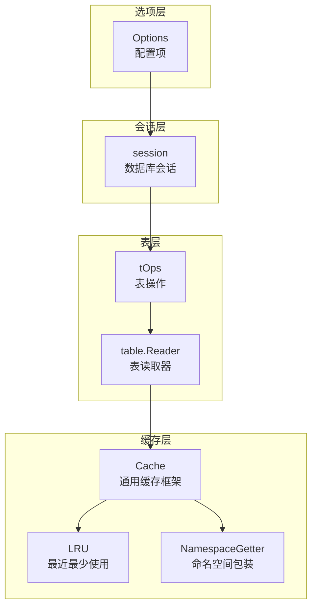
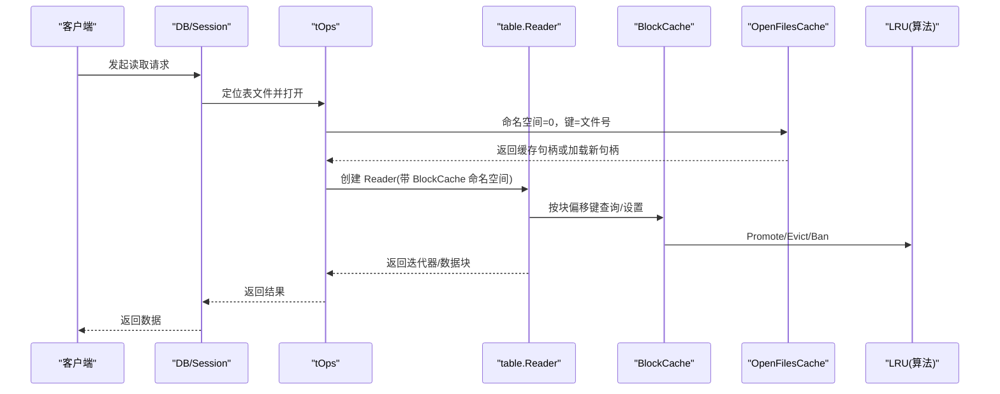
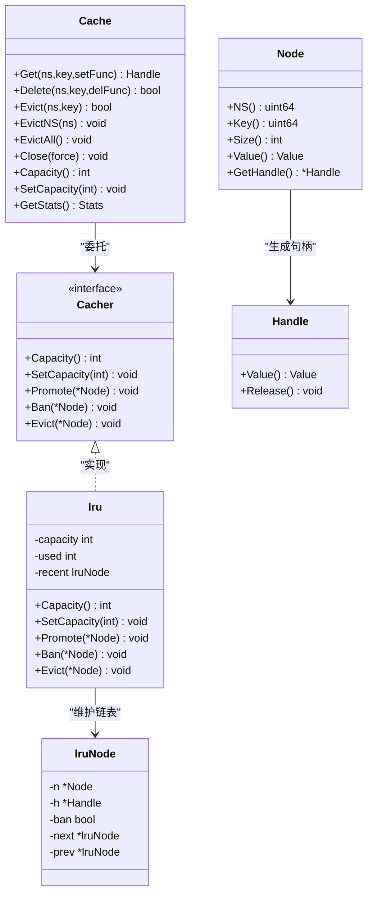
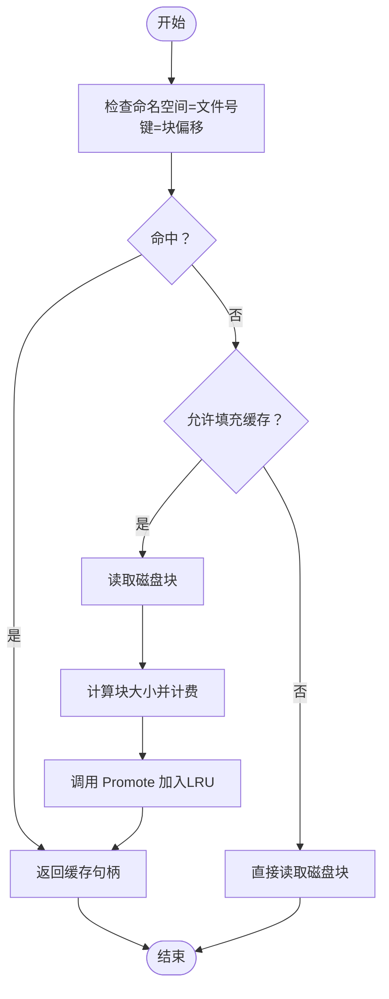
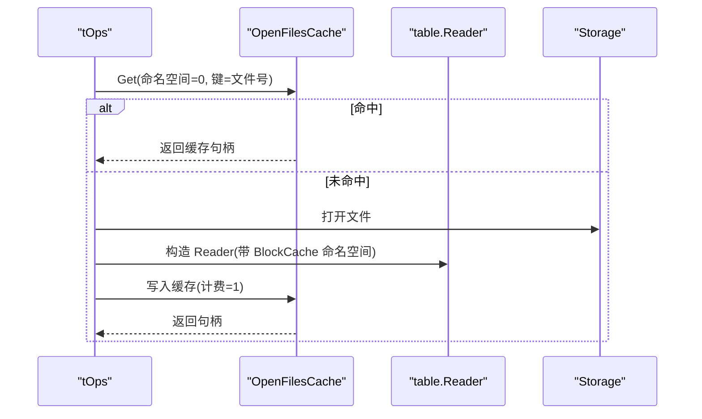
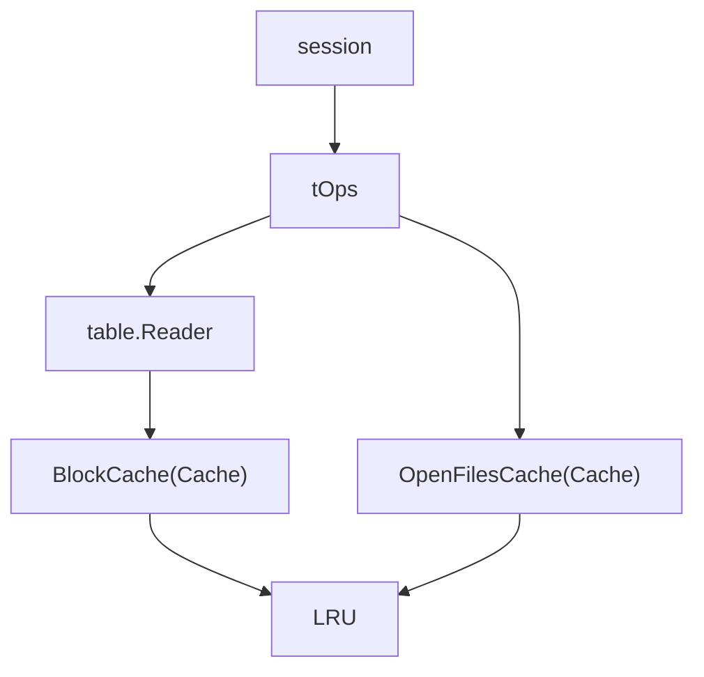

# 缓存策略

<cite>
**本文引用的文件**
- [leveldb/cache/cache.go](file://leveldb/cache/cache.go)
- [leveldb/cache/lru.go](file://leveldb/cache/lru.go)
- [leveldb/opt/options.go](file://leveldb/opt/options.go)
- [leveldb/table/reader.go](file://leveldb/table/reader.go)
- [leveldb/table.go](file://leveldb/table.go)
- [leveldb/session.go](file://leveldb/session.go)
- [leveldb/cache/cache_test.go](file://leveldb/cache/cache_test.go)
</cite>

## 目录
1. [引言](#引言)
2. [项目结构](#项目结构)
3. [核心组件](#核心组件)
4. [架构总览](#架构总览)
5. [详细组件分析](#详细组件分析)
6. [依赖关系分析](#依赖关系分析)
7. [性能考量](#性能考量)
8. [故障排查指南](#故障排查指南)
9. [结论](#结论)

## 引言
本文件系统性阐述 avccDB 的缓存策略与实现，重点围绕 leveldb/cache/cache.go 中的通用缓存框架与 LRU 算法实现（leveldb/cache/lru.go），并结合选项配置（leveldb/opt/options.go）解释 BlockCache 与 OpenFilesCache 的工作机制。文档还覆盖缓存命中率对读取性能的影响、缓存共享（PassthroughCacher）的高级用法，以及如何在多个 DB 实例之间共享缓存以优化资源利用。

## 项目结构
与缓存相关的核心模块分布如下：
- 缓存框架与 LRU：leveldb/cache/cache.go、leveldb/cache/lru.go
- 选项与默认值：leveldb/opt/options.go
- 表块读取与缓存接入：leveldb/table/reader.go
- 表操作与缓存初始化：leveldb/table.go
- 会话与缓存生命周期：leveldb/session.go
- 缓存行为测试：leveldb/cache/cache_test.go

图表来源
- [leveldb/cache/cache.go](file://leveldb/cache/cache.go#L362-L828)
- [leveldb/cache/lru.go](file://leveldb/cache/lru.go#L1-L159)
- [leveldb/opt/options.go](file://leveldb/opt/options.go#L176-L424)
- [leveldb/table/reader.go](file://leveldb/table/reader.go#L512-L780)
- [leveldb/table.go](file://leveldb/table.go#L538-L565)
- [leveldb/session.go](file://leveldb/session.go#L70-L120)

章节来源
- [leveldb/cache/cache.go](file://leveldb/cache/cache.go#L362-L828)
- [leveldb/cache/lru.go](file://leveldb/cache/lru.go#L1-L159)
- [leveldb/opt/options.go](file://leveldb/opt/options.go#L176-L424)
- [leveldb/table/reader.go](file://leveldb/table/reader.go#L512-L780)
- [leveldb/table.go](file://leveldb/table.go#L538-L565)
- [leveldb/session.go](file://leveldb/session.go#L70-L120)

## 核心组件
- 通用缓存框架（Cache）
  - 提供键值映射、并发安全、容量控制、统计信息等能力；通过 Cacher 接口注入具体缓存算法（如 LRU）。
  - 支持命名空间（NamespaceGetter）隔离不同对象集合，便于按表或文件维度管理缓存。
- LRU 算法（lru）
  - 双向链表维护访问顺序，Promote 将节点插入最近侧，Ban/Evict 控制淘汰与禁用，SetCapacity 动态调整容量并触发释放。
- 表块缓存（BlockCache）
  - 由 table.Reader 在读取数据块时通过 NamespaceGetter 访问缓存，支持按块偏移作为键，按块大小计费。
- 打开文件缓存（OpenFilesCache）
  - 由 tOps 初始化，用于缓存打开的表文件句柄，避免重复打开与元数据加载。

章节来源
- [leveldb/cache/cache.go](file://leveldb/cache/cache.go#L362-L828)
- [leveldb/cache/lru.go](file://leveldb/cache/lru.go#L1-L159)
- [leveldb/table/reader.go](file://leveldb/table/reader.go#L624-L714)
- [leveldb/table.go](file://leveldb/table.go#L538-L565)

## 架构总览
下图展示从读取请求到缓存命中/未命中的完整流程，以及缓存与表层、选项层、会话层的交互。

图表来源
- [leveldb/table.go](file://leveldb/table.go#L403-L431)
- [leveldb/table/reader.go](file://leveldb/table/reader.go#L624-L714)
- [leveldb/cache/cache.go](file://leveldb/cache/cache.go#L464-L594)
- [leveldb/cache/lru.go](file://leveldb/cache/lru.go#L82-L151)

## 详细组件分析

### 通用缓存框架（Cache）与 LRU 算法
- Cache 结构
  - 维护桶数组（mHead/mBucket）、并发统计（命中/缺失/删除计数）、可选 Cacher 接口。
  - 通过哈希定位桶，支持动态扩容/缩容，保证高并发下的查找与插入效率。
- Cacher 接口
  - Capacity/SetCapacity/Promote/Ban/Evict 定义缓存算法契约，LRU 通过双向链表实现。
- LRU 算法
  - Promote：首次加入时按节点大小计费，超过容量则从尾部逐出；再次访问仅更新链表位置。
  - Ban：标记节点为禁用，立即释放其句柄，防止后续被 Promote。
  - Evict：从链表摘除并释放，清空计费。
  - SetCapacity：动态调整容量，必要时触发逐出并释放句柄。

图表来源
- [leveldb/cache/cache.go](file://leveldb/cache/cache.go#L362-L828)
- [leveldb/cache/lru.go](file://leveldb/cache/lru.go#L1-L159)

章节来源
- [leveldb/cache/cache.go](file://leveldb/cache/cache.go#L362-L828)
- [leveldb/cache/lru.go](file://leveldb/cache/lru.go#L1-L159)

### BlockCache（表块缓存）工作方式
- 命名空间隔离
  - table.Reader 使用 NamespaceGetter，将“表文件号”作为命名空间，块偏移作为键，实现按表隔离的块缓存。
- 读取路径
  - 读取数据块时优先尝试缓存命中；若未命中且允许填充缓存，则异步加载后写入缓存并返回句柄。
  - 迭代器在访问数据块时同样可选择是否填充缓存。
- 配置入口
  - 通过 Options.BlockCacheCapacity 设置容量；BlockCacheCapacity=0 禁用块缓存；BlockCacheCapacity=-1 视为禁用。
  - BlockCacher 默认使用 LRU 算法；可通过自定义 Cacher 替换。

图表来源
- [leveldb/table/reader.go](file://leveldb/table/reader.go#L624-L714)
- [leveldb/cache/cache.go](file://leveldb/cache/cache.go#L464-L594)
- [leveldb/cache/lru.go](file://leveldb/cache/lru.go#L82-L151)

章节来源
- [leveldb/table/reader.go](file://leveldb/table/reader.go#L624-L714)
- [leveldb/opt/options.go](file://leveldb/opt/options.go#L185-L203)
- [leveldb/opt/options.go](file://leveldb/opt/options.go#L433-L447)

### OpenFilesCache（打开文件缓存）工作方式
- 初始化
  - tOps 在构建时根据 Options.OpenFilesCacheCapacity 与 OpenFilesCacher 创建 OpenFilesCache；当容量>0 时启用。
- 命名空间
  - 命名空间固定为 0，键为表文件号（fd.Num），值为 table.Reader 实例。
- 生命周期
  - 删除表文件时，通过 Delete 带入回调，确保底层存储删除与块缓存按表清理（可选）。
  - 关闭时，可强制关闭所有缓存节点并触发最终释放。

图表来源
- [leveldb/table.go](file://leveldb/table.go#L403-L431)
- [leveldb/table.go](file://leveldb/table.go#L538-L565)
- [leveldb/cache/cache.go](file://leveldb/cache/cache.go#L520-L594)

章节来源
- [leveldb/table.go](file://leveldb/table.go#L403-L431)
- [leveldb/table.go](file://leveldb/table.go#L538-L565)
- [leveldb/opt/options.go](file://leveldb/opt/options.go#L372-L382)
- [leveldb/opt/options.go](file://leveldb/opt/options.go#L636-L649)

### 选项配置与默认值
- BlockCache 相关
  - BlockCacher：缓存算法提供者，默认 LRUCacher。
  - BlockCacheCapacity：块缓存容量，默认 8 MiB；<=0 视为禁用。
  - BlockCacheEvictRemoved：删除表时是否强制驱逐对应块缓存。
- OpenFilesCache 相关
  - OpenFilesCacher：打开文件缓存算法，默认 LRUCacher。
  - OpenFilesCacheCapacity：打开文件缓存容量，默认 200（macOS）或 500（其他平台）。
- 其他
  - DisableBlockCache：整体禁用块缓存。
  - DisableBufferPool：禁用缓冲池。
  - BlockSize：块大小，影响块缓存计费与读取性能。

章节来源
- [leveldb/opt/options.go](file://leveldb/opt/options.go#L185-L203)
- [leveldb/opt/options.go](file://leveldb/opt/options.go#L372-L382)
- [leveldb/opt/options.go](file://leveldb/opt/options.go#L433-L447)
- [leveldb/opt/options.go](file://leveldb/opt/options.go#L636-L649)
- [leveldb/opt/options_darwin.go](file://leveldb/opt/options_darwin.go#L1-L8)
- [leveldb/opt/options_default.go](file://leveldb/opt/options_default.go#L1-L8)

### 缓存共享（PassthroughCacher）与多实例共享
- PassthroughCacher
  - 将已初始化的 Cacher 实例透传给多个 Options，从而实现跨 DB 实例共享同一 LRU 缓存。
- 使用场景
  - 多个 DB 实例共享 BlockCache 或 OpenFilesCache，降低内存占用与重复加载成本。
- 注意事项
  - 共享缓存需统一容量与算法；删除表时需谨慎处理块缓存的按表清理（见 OpenFilesCache 删除回调）。

章节来源
- [leveldb/opt/options.go](file://leveldb/opt/options.go#L67-L94)
- [leveldb/opt/options.go](file://leveldb/opt/options.go#L95-L98)
- [leveldb/table.go](file://leveldb/table.go#L511-L526)

### 缓存命中率对读取性能的影响
- 命中率提升
  - BlockCache 命中减少磁盘 IO，显著降低读取延迟；OpenFilesCache 命中减少文件句柄打开与元数据加载开销。
- 统计与观测
  - Cache.GetStats 提供命中/缺失/设置/删除计数，可用于评估命中率与容量配置效果。
- 测试验证
  - 缓存测试覆盖了 LRU 能力、容量调整、逐出与删除行为，可作为配置调优参考。

章节来源
- [leveldb/cache/cache.go](file://leveldb/cache/cache.go#L424-L437)
- [leveldb/cache/cache_test.go](file://leveldb/cache/cache_test.go#L249-L279)
- [leveldb/cache/cache_test.go](file://leveldb/cache/cache_test.go#L426-L498)

## 依赖关系分析
- 会话层（session）负责创建与管理缓存实例，依据 Options 决定是否启用 OpenFilesCache 与 BlockCache。
- 表层（table.Reader/tOps）在读取路径中接入缓存，按表号命名空间隔离块缓存。
- 缓存层（Cache/LRU）提供统一接口与算法实现，支持并发与动态容量调整。

图表来源
- [leveldb/session.go](file://leveldb/session.go#L70-L120)
- [leveldb/table.go](file://leveldb/table.go#L538-L565)
- [leveldb/table/reader.go](file://leveldb/table/reader.go#L512-L780)
- [leveldb/cache/cache.go](file://leveldb/cache/cache.go#L362-L828)
- [leveldb/cache/lru.go](file://leveldb/cache/lru.go#L1-L159)

章节来源
- [leveldb/session.go](file://leveldb/session.go#L70-L120)
- [leveldb/table.go](file://leveldb/table.go#L538-L565)
- [leveldb/table/reader.go](file://leveldb/table/reader.go#L512-L780)
- [leveldb/cache/cache.go](file://leveldb/cache/cache.go#L362-L828)
- [leveldb/cache/lru.go](file://leveldb/cache/lru.go#L1-L159)

## 性能考量
- 容量与计费
  - BlockCache 以块大小计费，容量过小会导致频繁逐出；过大可能挤占其他用途内存。
  - OpenFilesCache 以文件计费（计费=1），容量过小会频繁重建 Reader。
- 并发与热点
  - Cache 采用分桶与动态扩容，适合高并发场景；热点键可能导致局部竞争，建议合理划分命名空间。
- 读取模式
  - 顺序扫描应开启填充缓存（fillCache=true），随机访问可按需关闭以节省内存。
- 平台差异
  - OpenFilesCache 默认容量在 macOS 与其他平台不同，需结合实际部署环境调整。

## 故障排查指南
- 常见问题
  - 缓存未生效：确认 Options.BlockCacheCapacity > 0 且未设置 DisableBlockCache；OpenFilesCache 同理。
  - 命中率低：检查读取模式是否连续、是否启用了 fillCache；适当增大容量。
  - 内存占用异常：检查是否启用了共享缓存且多实例同时运行；核对容量与计费单位。
- 关键接口与行为
  - Cache.Get/GetStats/Delete/Evict/EvictNS/EvictAll/Close：用于诊断与清理。
  - LRU.SetCapacity/Promote/Ban/Evict：用于动态调整与逐出。
  - table.Reader 的块缓存读取路径：确认命名空间与键是否正确。

章节来源
- [leveldb/cache/cache.go](file://leveldb/cache/cache.go#L424-L437)
- [leveldb/cache/cache.go](file://leveldb/cache/cache.go#L520-L670)
- [leveldb/cache/lru.go](file://leveldb/cache/lru.go#L60-L151)
- [leveldb/table/reader.go](file://leveldb/table/reader.go#L624-L714)

## 结论
avccDB 的缓存体系以通用缓存框架为核心，通过 LRU 算法实现高效的块与文件级缓存。BlockCache 与 OpenFilesCache 分别针对表块与打开文件进行优化，配合 Options 的灵活配置与 PassthroughCacher 的共享能力，可在多实例场景下显著降低内存占用并提升读取性能。实践中应结合读取模式、数据规模与平台特性，合理设置容量与填充策略，并通过统计指标持续优化。