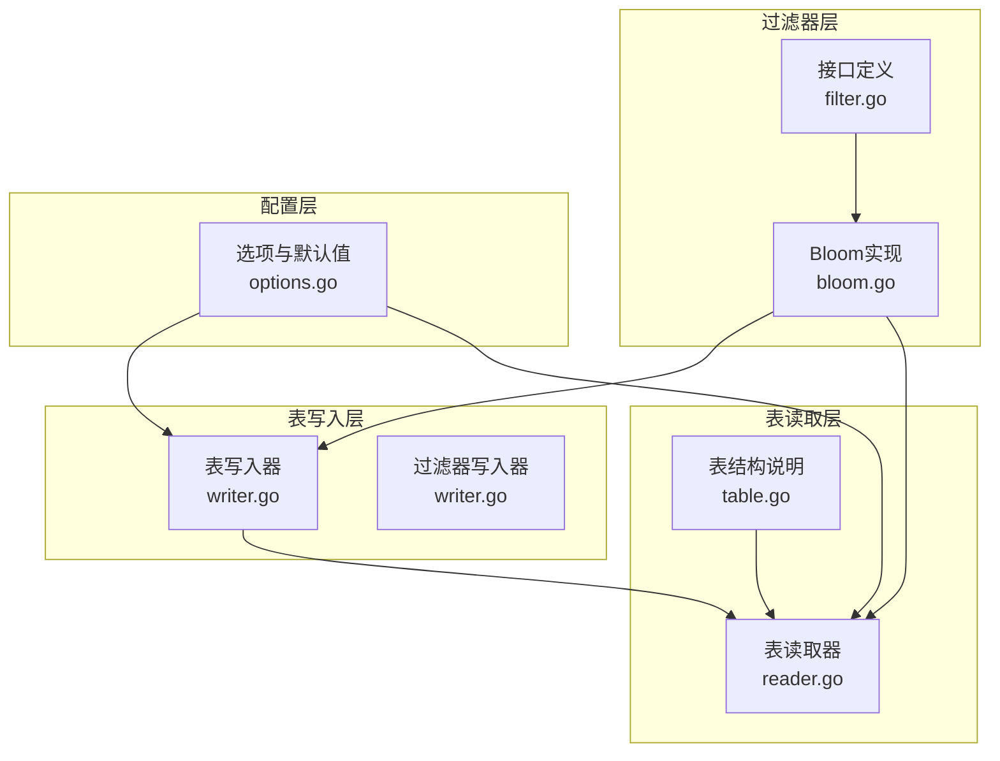
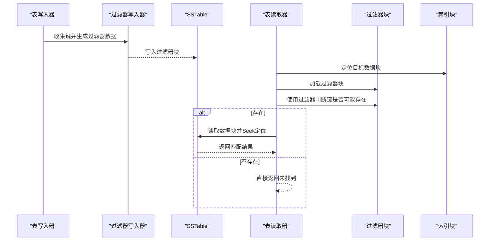
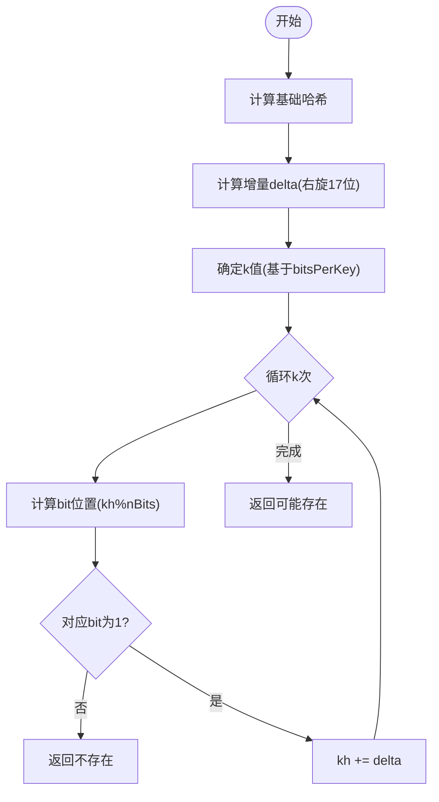
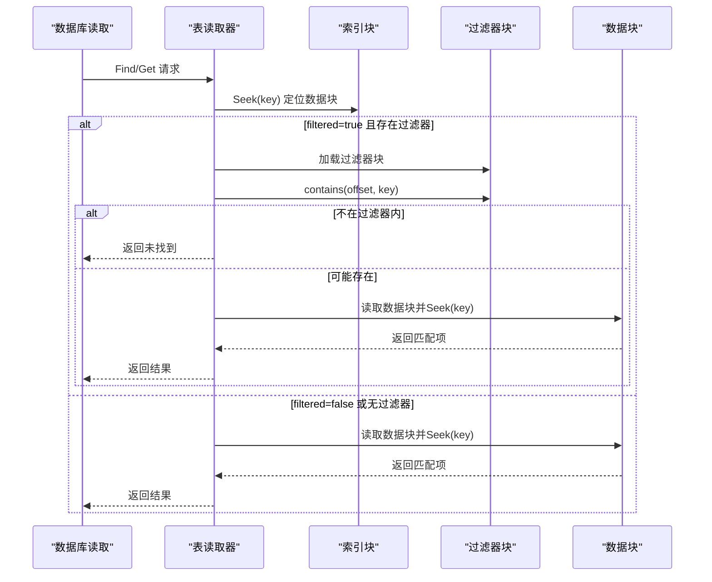
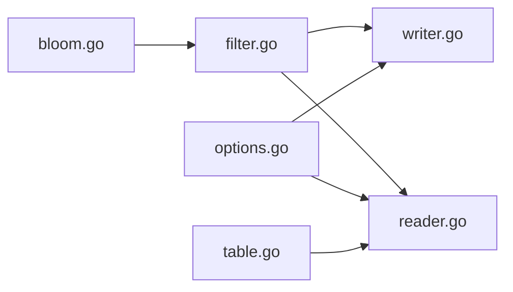

# Bloom过滤器优化

<cite>
**本文引用的文件**
- [leveldb/filter/bloom.go](file://leveldb/filter/bloom.go)
- [leveldb/filter/filter.go](file://leveldb/filter/filter.go)
- [leveldb/filter/bloom_test.go](file://leveldb/filter/bloom_test.go)
- [leveldb/table/table.go](file://leveldb/table/table.go)
- [leveldb/table/writer.go](file://leveldb/table/writer.go)
- [leveldb/table/reader.go](file://leveldb/table/reader.go)
- [leveldb/opt/options.go](file://leveldb/opt/options.go)
- [leveldb/db.go](file://leveldb/db.go)
</cite>

## 目录
1. [引言](#引言)
2. [项目结构](#项目结构)
3. [核心组件](#核心组件)
4. [架构总览](#架构总览)
5. [详细组件分析](#详细组件分析)
6. [依赖关系分析](#依赖关系分析)
7. [性能考量](#性能考量)
8. [故障排查指南](#故障排查指南)
9. [结论](#结论)
10. [附录：配置与调优建议](#附录配置与调优建议)

## 引言
本文件系统性解析 avccDB 中基于 LevelDB 的 Bloom 过滤器实现，重点覆盖以下方面：
- Bloom 过滤器在 leveldb/filter/bloom.go 中的实现细节（哈希函数、位数组管理、误判率控制）
- FilterBaseLg 参数对过滤器内存占用与查询效率的影响
- 在 SSTable 查找过程中的应用流程（如何通过过滤器避免不必要的磁盘访问）
- 如何通过 Options 启用与定制过滤器
- 减少磁盘 I/O 的效果与适用场景

## 项目结构
围绕 Bloom 过滤器的相关模块分布如下：
- 过滤器接口与实现：leveldb/filter/filter.go、leveldb/filter/bloom.go
- 表写入阶段生成过滤器块：leveldb/table/writer.go
- 表读取阶段加载与使用过滤器块：leveldb/table/reader.go、leveldb/table/table.go
- 全局选项与默认值：leveldb/opt/options.go
- 数据库入口与读取路径：leveldb/db.go

图表来源
- [leveldb/filter/filter.go](file://leveldb/filter/filter.go#L1-L61)
- [leveldb/filter/bloom.go](file://leveldb/filter/bloom.go#L1-L117)
- [leveldb/table/writer.go](file://leveldb/table/writer.go#L96-L156)
- [leveldb/table/reader.go](file://leveldb/table/reader.go#L826-L900)
- [leveldb/table/table.go](file://leveldb/table/table.go#L118-L142)
- [leveldb/opt/options.go](file://leveldb/opt/options.go#L413-L424)

章节来源
- [leveldb/filter/filter.go](file://leveldb/filter/filter.go#L1-L61)
- [leveldb/filter/bloom.go](file://leveldb/filter/bloom.go#L1-L117)
- [leveldb/table/writer.go](file://leveldb/table/writer.go#L96-L156)
- [leveldb/table/reader.go](file://leveldb/table/reader.go#L826-L900)
- [leveldb/table/table.go](file://leveldb/table/table.go#L118-L142)
- [leveldb/opt/options.go](file://leveldb/opt/options.go#L413-L424)

## 核心组件
- 过滤器接口与缓冲区抽象：定义了 Filter 与 FilterGenerator 接口，以及 Buffer 抽象，用于生成与校验过滤器数据。
- Bloom 过滤器实现：包含哈希函数选择、位数组分配与设置、k 值计算与探测序列生成、过滤器序列化与反序列化。
- 表写入器的过滤器写入器：按 FilterBaseLg 划分数据块，为每个块生成过滤器数据并写入过滤器块。
- 表读取器的过滤器块加载与匹配：根据索引定位数据块，使用过滤器块快速判断目标键是否可能存在于该块，从而避免读取数据块。

章节来源
- [leveldb/filter/filter.go](file://leveldb/filter/filter.go#L1-L61)
- [leveldb/filter/bloom.go](file://leveldb/filter/bloom.go#L1-L117)
- [leveldb/table/writer.go](file://leveldb/table/writer.go#L96-L156)
- [leveldb/table/reader.go](file://leveldb/table/reader.go#L826-L900)

## 架构总览
下图展示了从写入到读取的完整链路，突出 Bloom 过滤器在 SSTable 中的位置与作用。

图表来源
- [leveldb/table/writer.go](file://leveldb/table/writer.go#L96-L156)
- [leveldb/table/writer.go](file://leveldb/table/writer.go#L386-L396)
- [leveldb/table/reader.go](file://leveldb/table/reader.go#L826-L900)
- [leveldb/table/table.go](file://leveldb/table/table.go#L118-L142)

## 详细组件分析

### Bloom 过滤器实现（leveldb/filter/bloom.go）
- 哈希函数选择
  - 使用 util.Hash(key, 0xbc9f1d34) 作为基础哈希，再配合旋转位移生成二次增量 delta，形成双哈希探测序列，降低冲突概率。
- 位数组管理
  - 生成阶段：按 keys 数量与 bitsPerKey 计算位数，最小长度保护，按字节对齐，最后一位存储 k 值。
  - 查询阶段：读取 filter 尾部 k 值，逐个探测位，若任一位为 0 则判定不存在；否则判定可能存在。
- 误判率控制
  - k 值近似为 bitsPerKey × ln(2)，在生成阶段向下取整以降低探测成本；同时对 k 做上限保护。
  - 测试用例验证了不同键集合规模下的误判率与过滤器长度，确保在合理范围内。
- 参数兼容性
  - bitsPerKey 持久化存储于过滤器序列化中，允许参数变更时仍可读取旧过滤器，向后兼容。

图表来源
- [leveldb/filter/bloom.go](file://leveldb/filter/bloom.go#L26-L52)
- [leveldb/filter/bloom.go](file://leveldb/filter/bloom.go#L54-L66)
- [leveldb/filter/bloom.go](file://leveldb/filter/bloom.go#L81-L104)

章节来源
- [leveldb/filter/bloom.go](file://leveldb/filter/bloom.go#L1-L117)
- [leveldb/filter/bloom_test.go](file://leveldb/filter/bloom_test.go#L1-L143)

### 过滤器接口与缓冲区（leveldb/filter/filter.go）
- Buffer 抽象：提供 Alloc、Write、WriteByte 等方法，供过滤器生成器写入二进制数据。
- Filter 接口：定义 Name、NewGenerator、Contains 方法，统一不同过滤器策略。
- FilterGenerator 接口：Add 用于收集键，Generate 用于生成过滤器数据并写入 Buffer。

章节来源
- [leveldb/filter/filter.go](file://leveldb/filter/filter.go#L1-L61)

### 表写入阶段的过滤器生成（leveldb/table/writer.go）
- 过滤器写入器 filterWriter
  - 维护 generator、buf、nKeys、offsets、baseLg 字段。
  - add(key)：当存在有效 generator 时记录键，计数 nKeys。
  - flush(offset)：按 1<<baseLg 划分数据块，超过阈值时触发 generate。
  - finish()：收尾阶段生成剩余键，写入偏移表与 baseLg 字节，形成过滤器块。
  - generate()：记录当前偏移，调用 generator.Generate 将过滤器数据追加到 buf。
- Writer 结构持有 filter 字段，构造时注入外部 Filter 实例（如 Bloom）。
- 写入过滤器块：在表写入完成后，将过滤器块写入文件并记录块句柄。

章节来源
- [leveldb/table/writer.go](file://leveldb/table/writer.go#L96-L156)
- [leveldb/table/writer.go](file://leveldb/table/writer.go#L386-L396)

### 表读取阶段的过滤器应用（leveldb/table/reader.go）
- 过滤器块结构与加载
  - readFilterBlock：解析过滤器块数据，提取偏移表与 baseLg。
  - readFilterBlockCached：带缓存的过滤器块读取。
- 查找流程中的过滤器匹配
  - find(key, filtered, ro, noValue)：先通过索引定位数据块；当 filtered 为真且存在过滤器时，加载过滤器块并调用 contains 判断键是否可能存在于该块；若不存在则直接返回未找到，避免读取数据块。
- 表结构说明
  - table.go 明确了 SSTable 的组成：数据块、可选的过滤器块、元信息块、索引块与页脚；过滤器块包含若干过滤器数据与 trailer，trailer 包含偏移表与 baseLg。

图表来源
- [leveldb/table/reader.go](file://leveldb/table/reader.go#L826-L900)
- [leveldb/table/table.go](file://leveldb/table/table.go#L118-L142)

章节来源
- [leveldb/table/reader.go](file://leveldb/table/reader.go#L826-L900)
- [leveldb/table/table.go](file://leveldb/table/table.go#L118-L142)

### FilterBaseLg 参数与内存/查询效率
- FilterBaseLg 的含义
  - 以 2 的幂划分数据块大小，决定每个过滤器块覆盖的数据范围。例如 FilterBaseLg=11 表示每个过滤器块覆盖约 2^11 字节的数据块。
- 对内存占用的影响
  - 更大的 FilterBaseLg 意味着更小的过滤器块数量，但每个过滤器块内的过滤器数据更集中；更小的 FilterBaseLg 会增加过滤器块数量，但单块过滤器更稀疏。
- 对查询效率的影响
  - 更小的 FilterBaseLg 提高过滤精度，减少误判，但需要加载更多过滤器块；更大的 FilterBaseLg 降低过滤器块数量，减少额外 IO，但可能提高误判率。
- 默认值与可配置性
  - 默认 FilterBaseLg=11（2KB），可通过 Options.FilterBaseLg 调整。

章节来源
- [leveldb/opt/options.go](file://leveldb/opt/options.go#L413-L424)
- [leveldb/table/writer.go](file://leveldb/table/writer.go#L96-L156)

### 在 SSTable 查找过程中的应用流程
- 写入阶段：Writer 在写入数据块时，按 FilterBaseLg 计算偏移，触发过滤器生成；finish 阶段写入过滤器块。
- 读取阶段：Reader 通过索引定位数据块，若开启 filtered，则加载过滤器块并进行 contains 判断；若返回“不存在”，直接返回未找到；否则才读取数据块进行精确查找。

章节来源
- [leveldb/table/writer.go](file://leveldb/table/writer.go#L96-L156)
- [leveldb/table/reader.go](file://leveldb/table/reader.go#L826-L900)

### 通过 Options 启用与定制过滤器
- 启用过滤器
  - 在 Options.Filter 中设置有效的 Filter 实例（如 NewBloomFilter），即可在写入阶段生成过滤器块。
- 替代过滤器
  - Options.AltFilters 可提供备用过滤器策略，在主过滤器不匹配时尝试替代策略。
- 过滤器块粒度
  - 通过 Options.FilterBaseLg 控制过滤器块大小（即数据块粒度），影响过滤器精度与内存占用。
- 读取行为
  - 读取接口（如 Reader.Find/Get）支持 filtered 参数，用于启用过滤器短路判断。

章节来源
- [leveldb/opt/options.go](file://leveldb/opt/options.go#L176-L206)
- [leveldb/opt/options.go](file://leveldb/opt/options.go#L338-L351)
- [leveldb/opt/options.go](file://leveldb/opt/options.go#L413-L424)
- [leveldb/table/reader.go](file://leveldb/table/reader.go#L917-L943)

## 依赖关系分析
- 组件耦合
  - Bloom 实现依赖 util.Hash 与 Buffer 抽象；Filter 接口解耦具体策略。
  - Writer 依赖 Filter 接口生成过滤器数据；Reader 依赖 Filter 接口进行 contains 判断。
- 外部依赖
  - 缓存层：Reader 支持过滤器块与数据块的缓存，减少重复 IO。
  - 选项层：Options.Filter、Options.AltFilters、Options.FilterBaseLg 影响过滤器行为与资源占用。

图表来源
- [leveldb/filter/bloom.go](file://leveldb/filter/bloom.go#L1-L117)
- [leveldb/filter/filter.go](file://leveldb/filter/filter.go#L1-L61)
- [leveldb/table/writer.go](file://leveldb/table/writer.go#L96-L156)
- [leveldb/table/reader.go](file://leveldb/table/reader.go#L826-L900)
- [leveldb/table/table.go](file://leveldb/table/table.go#L118-L142)
- [leveldb/opt/options.go](file://leveldb/opt/options.go#L176-L206)

章节来源
- [leveldb/filter/bloom.go](file://leveldb/filter/bloom.go#L1-L117)
- [leveldb/filter/filter.go](file://leveldb/filter/filter.go#L1-L61)
- [leveldb/table/writer.go](file://leveldb/table/writer.go#L96-L156)
- [leveldb/table/reader.go](file://leveldb/table/reader.go#L826-L900)
- [leveldb/table/table.go](file://leveldb/table/table.go#L118-L142)
- [leveldb/opt/options.go](file://leveldb/opt/options.go#L176-L206)

## 性能考量
- 误判率与内存占用权衡
  - 更高的 bitsPerKey（或更大的 FilterBaseLg）通常降低误判率，但增加过滤器块数量与内存占用。
- 磁盘 I/O 减少
  - Bloom 过滤器可在绝大多数“不存在”的键上避免读取数据块，显著减少随机读取次数。
- CPU 成本
  - 过滤器探测为 O(k)，k 由 bitsPerKey 决定；在高并发读取场景下，适度增大 k 可提升命中率，但需评估 CPU 开销。
- 缓存与预热
  - 过滤器块与数据块均可缓存，合理设置 BlockCache 与 OpenFilesCache 可进一步降低延迟。

## 故障排查指南
- 过滤器块损坏
  - 读取器在解析过滤器块时会检查长度与偏移，若损坏将返回错误；可参考 ErrCorrupted 类型定位问题。
- 误判率异常升高
  - 检查 FilterBaseLg 是否过小导致过滤器过于稀疏；或确认键分布是否极端，必要时调整 bitsPerKey。
- 读取性能未达预期
  - 确认 filtered 参数已启用；检查过滤器块是否被缓存；核对索引块与过滤器块的加载路径。

章节来源
- [leveldb/table/reader.go](file://leveldb/table/reader.go#L658-L680)
- [leveldb/table/reader.go](file://leveldb/table/reader.go#L826-L900)

## 结论
avccDB 的 Bloom 过滤器通过“键集合→位数组”的概率型数据结构，在 SSTable 查找中实现了高效的“存在性”判断，显著减少了不必要的磁盘 I/O。其实现具备良好的参数兼容性与测试验证，配合 FilterBaseLg 与 Options.Filter 可灵活调优，满足不同工作负载下的性能与内存需求。

## 附录：配置与调优建议
- 默认与常用设置
  - FilterBaseLg 默认 11（2KB），适合大多数场景；可根据数据块大小与键分布微调。
  - 使用 NewBloomFilter(bitsPerKey) 创建过滤器实例，推荐 bitsPerKey 在 10~20 之间取得较好的误判率与内存平衡。
- 工作负载建议
  - 高误判敏感场景（如在线服务）：适当增大 bitsPerKey 或减小 FilterBaseLg，以降低误判率。
  - 低内存预算场景：减小 bitsPerKey 或增大 FilterBaseLg，减少过滤器块数量。
  - 大量随机读取场景：启用 filtered 并确保过滤器块缓存开启，最大化短路收益。
- 验证与监控
  - 通过测试用例验证误判率与过滤器长度；结合数据库指标观察磁盘 I/O 与读取延迟变化。

章节来源
- [leveldb/opt/options.go](file://leveldb/opt/options.go#L413-L424)
- [leveldb/filter/bloom_test.go](file://leveldb/filter/bloom_test.go#L102-L143)
- [leveldb/filter/bloom.go](file://leveldb/filter/bloom.go#L106-L117)