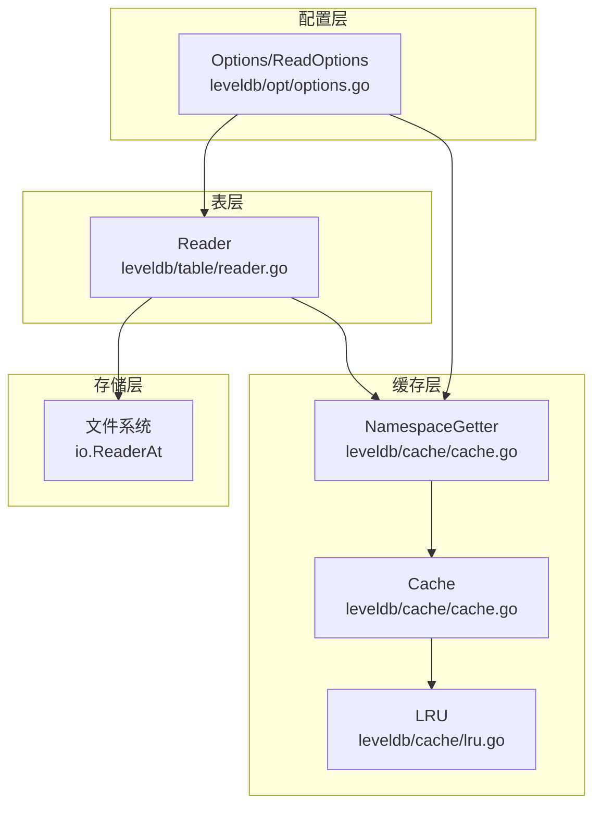
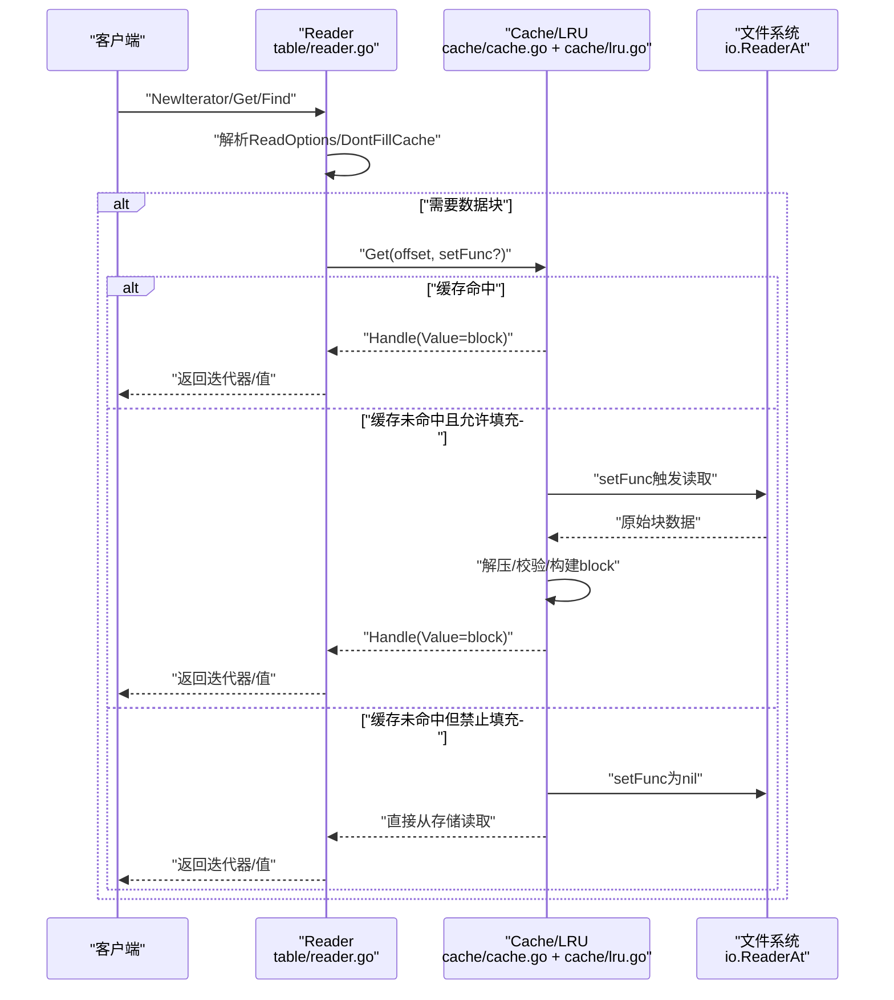
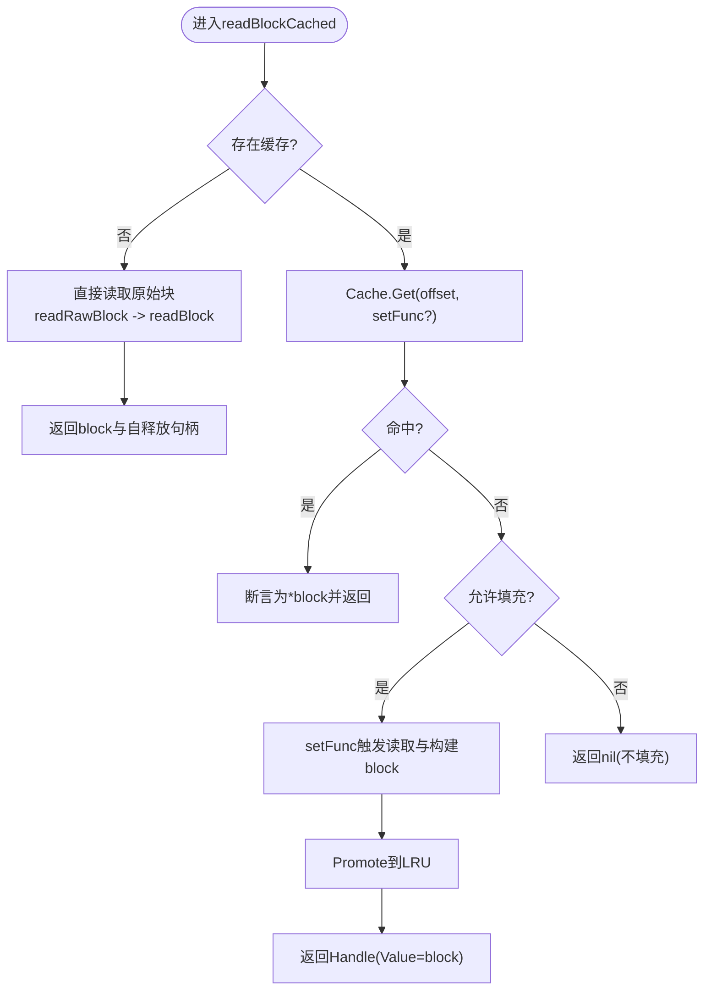
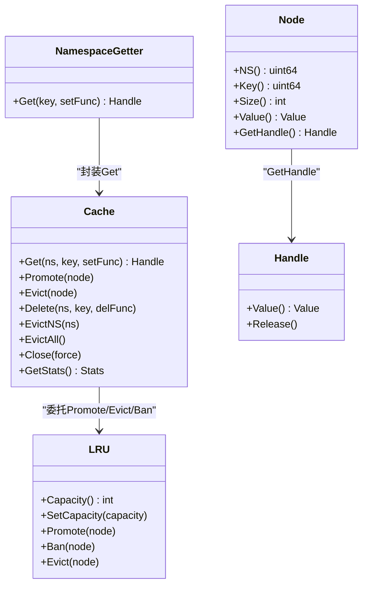
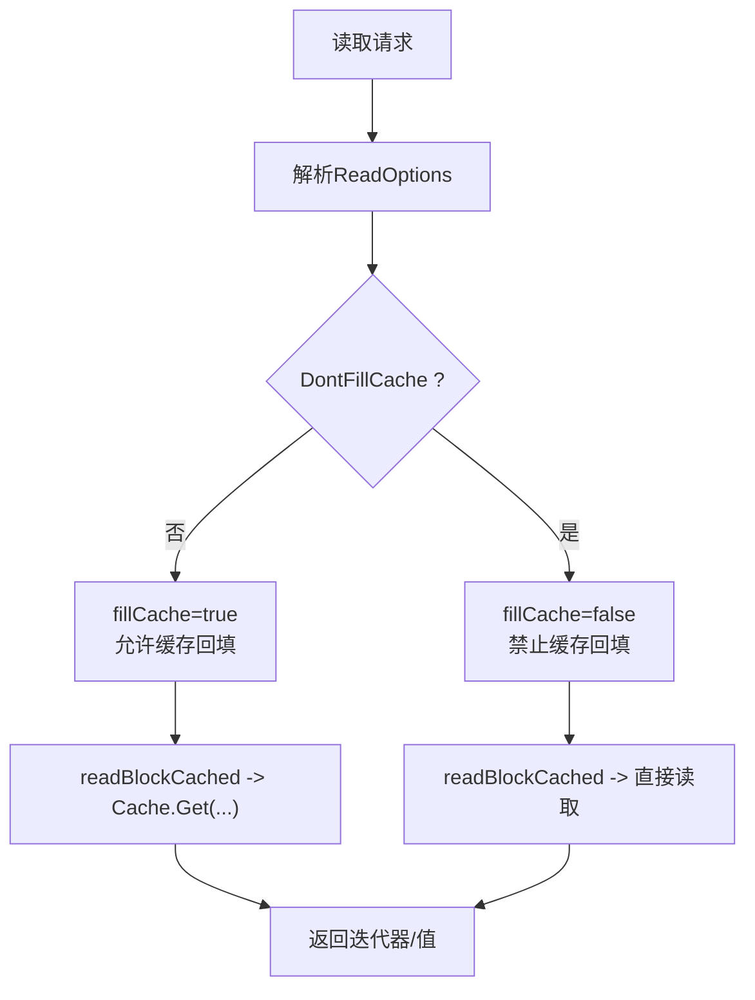
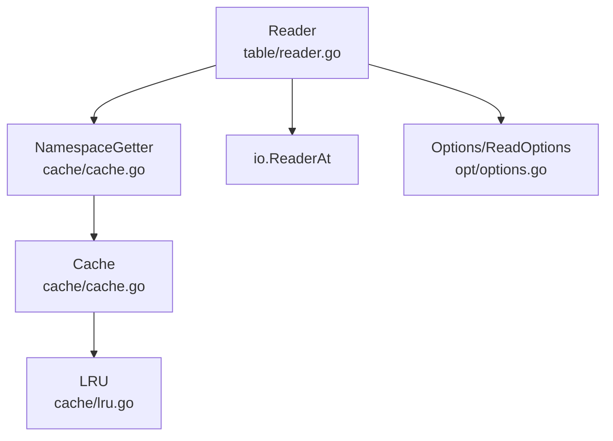

# 块缓存机制

<cite>
**本文引用的文件**
- [leveldb/table/reader.go](file://leveldb/table/reader.go)
- [leveldb/cache/cache.go](file://leveldb/cache/cache.go)
- [leveldb/cache/lru.go](file://leveldb/cache/lru.go)
- [leveldb/opt/options.go](file://leveldb/opt/options.go)
- [leveldb/cache/cache_test.go](file://leveldb/cache/cache_test.go)
</cite>

## 目录
1. [简介](#简介)
2. [项目结构](#项目结构)
3. [核心组件](#核心组件)
4. [架构总览](#架构总览)
5. [详细组件分析](#详细组件分析)
6. [依赖关系分析](#依赖关系分析)
7. [性能考量](#性能考量)
8. [故障排查指南](#故障排查指南)
9. [结论](#结论)
10. [附录](#附录)

## 简介
本文件围绕LevelDB中SSTable块缓存（Block Cache）的工作原理展开，重点说明：
- 数据块加载流程与缓存如何减少重复磁盘I/O
- 缓存实现（LRU）的条目管理、淘汰策略与并发控制
- DontFillCache选项在全表扫描等场景下的应用价值
- 基于Options的Cache参数进行容量规划与性能调优建议

## 项目结构
与块缓存直接相关的模块位于以下路径：
- 表读取器：leveldb/table/reader.go
- 缓存框架：leveldb/cache/cache.go
- LRU实现：leveldb/cache/lru.go
- 选项与配置：leveldb/opt/options.go
- 缓存单元测试：leveldb/cache/cache_test.go

图表来源
- [leveldb/table/reader.go](file://leveldb/table/reader.go#L512-L570)
- [leveldb/cache/cache.go](file://leveldb/cache/cache.go#L40-L120)
- [leveldb/cache/lru.go](file://leveldb/cache/lru.go#L41-L159)
- [leveldb/opt/options.go](file://leveldb/opt/options.go#L694-L721)

章节来源
- [leveldb/table/reader.go](file://leveldb/table/reader.go#L512-L570)
- [leveldb/cache/cache.go](file://leveldb/cache/cache.go#L40-L120)
- [leveldb/cache/lru.go](file://leveldb/cache/lru.go#L41-L159)
- [leveldb/opt/options.go](file://leveldb/opt/options.go#L694-L721)

## 核心组件
- Reader：负责SSTable的索引块、数据块、过滤块的读取与迭代，并通过缓存接口按需加载与复用块。
- NamespaceGetter/Cache/LRU：提供命名空间化的缓存容器与LRU淘汰策略，支持并发安全的Get/Promote/Evict/Ban。
- Options/ReadOptions：提供BlockCacheCapacity、BlockCacher、DontFillCache等配置项，影响缓存行为与容量。

章节来源
- [leveldb/table/reader.go](file://leveldb/table/reader.go#L512-L570)
- [leveldb/cache/cache.go](file://leveldb/cache/cache.go#L362-L595)
- [leveldb/cache/lru.go](file://leveldb/cache/lru.go#L41-L159)
- [leveldb/opt/options.go](file://leveldb/opt/options.go#L176-L206)

## 架构总览
下图展示了从读请求到块缓存命中/回填的关键路径，以及DontFillCache如何影响缓存写入。

图表来源
- [leveldb/table/reader.go](file://leveldb/table/reader.go#L800-L824)
- [leveldb/table/reader.go](file://leveldb/table/reader.go#L826-L915)
- [leveldb/table/reader.go](file://leveldb/table/reader.go#L624-L656)
- [leveldb/cache/cache.go](file://leveldb/cache/cache.go#L464-L518)
- [leveldb/cache/lru.go](file://leveldb/cache/lru.go#L82-L116)

## 详细组件分析

### 组件A：Reader的数据块加载与缓存交互
- 关键点
  - 通过readBlockCached统一入口加载数据块，支持是否填充缓存的分支。
  - 读取原始块后进行校验与解压，再封装为block对象。
  - 迭代器创建时复用已缓存的block或通过缓存回填新块。
  - IndexIter在首尾块时会传递fillCache标志给底层数据块迭代器。

图表来源
- [leveldb/table/reader.go](file://leveldb/table/reader.go#L624-L656)
- [leveldb/table/reader.go](file://leveldb/table/reader.go#L568-L623)
- [leveldb/cache/cache.go](file://leveldb/cache/cache.go#L464-L518)
- [leveldb/cache/lru.go](file://leveldb/cache/lru.go#L82-L116)

章节来源
- [leveldb/table/reader.go](file://leveldb/table/reader.go#L568-L656)
- [leveldb/table/reader.go](file://leveldb/table/reader.go#L770-L776)
- [leveldb/table/reader.go](file://leveldb/table/reader.go#L800-L824)

### 组件B：缓存框架与LRU实现
- 缓存框架
  - Cache提供Get/Promote/Evict/Delete/Close等能力；内部采用哈希分桶+可扩容的mHead/mBucket结构，支持并发查找与动态扩容/收缩。
  - NamespaceGetter提供按命名空间的便捷包装，便于Reader以offset作为key进行缓存。
  - Stats统计命中/未命中/节点数/大小等指标，便于观测缓存效果。
- LRU实现
  - 使用双向链表维护最近使用顺序，Promote时插入头部；当容量超限时从尾部逐出最久未使用项。
  - Ban标记用于禁止某节点再次被Promote，Evict用于主动驱逐；SetCapacity支持动态调整容量并触发批量驱逐。

图表来源
- [leveldb/cache/cache.go](file://leveldb/cache/cache.go#L362-L595)
- [leveldb/cache/cache.go](file://leveldb/cache/cache.go#L760-L783)
- [leveldb/cache/lru.go](file://leveldb/cache/lru.go#L41-L159)

章节来源
- [leveldb/cache/cache.go](file://leveldb/cache/cache.go#L362-L595)
- [leveldb/cache/lru.go](file://leveldb/cache/lru.go#L41-L159)

### 组件C：DontFillCache选项与全表扫描优化
- 作用
  - 当ReadOptions.DontFillCache为true时，本次读取不会将新块写入缓存，避免污染热点数据。
- 典型场景
  - 全表扫描：大量顺序读取，若将每个数据块都写入缓存，可能挤掉后续查询的热点块，导致整体命中率下降。
- 实现要点
  - Reader在NewIterator/Get/Find等路径上根据ReadOptions决定fillCache标志，进而影响readBlockCached的行为。
  - 对于索引块与过滤块，通常仍会填充缓存以提升后续定位效率。

图表来源
- [leveldb/table/reader.go](file://leveldb/table/reader.go#L800-L824)
- [leveldb/table/reader.go](file://leveldb/table/reader.go#L826-L915)
- [leveldb/opt/options.go](file://leveldb/opt/options.go#L694-L721)

章节来源
- [leveldb/table/reader.go](file://leveldb/table/reader.go#L800-L824)
- [leveldb/table/reader.go](file://leveldb/table/reader.go#L826-L915)
- [leveldb/opt/options.go](file://leveldb/opt/options.go#L694-L721)

### 组件D：Options中的Cache参数与容量规划
- 关键配置
  - BlockCacher：块缓存算法，默认LRU。
  - BlockCacheCapacity：块缓存容量，默认8MiB。
  - DisableBlockCache：禁用块缓存。
  - BlockCacheEvictRemoved：移除SST时强制驱逐对应缓存。
- 容量规划建议
  - 评估工作集大小：估算热点数据块的总字节数，建议设置为工作集的1.2~2倍以平衡冷热数据。
  - 调整策略：小内存机器可适当降低容量；大内存机器可提高容量以提升命中率。
  - 避免过度：容量过大可能导致频繁驱逐与抖动，反而降低命中率。
- 性能调优
  - 结合业务读模式：随机读多则提高容量；顺序扫描多则考虑DontFillCache以避免污染。
  - 观测指标：关注Cache.GetStats中的命中/未命中、节点数与大小变化。

章节来源
- [leveldb/opt/options.go](file://leveldb/opt/options.go#L176-L206)
- [leveldb/opt/options.go](file://leveldb/opt/options.go#L433-L447)
- [leveldb/cache/cache.go](file://leveldb/cache/cache.go#L424-L437)

## 依赖关系分析
- Reader依赖
  - 缓存：通过NamespaceGetter与Cache交互，按offset作为键缓存block。
  - 存储：通过io.ReaderAt按块偏移读取原始数据。
  - 比较器/过滤器/选项：用于键比较、过滤与严格性校验。
- 缓存依赖
  - LRU实现具体淘汰策略；Cache提供并发安全与统计。
- 选项依赖
  - Options决定默认缓存算法与容量；ReadOptions在单次读取中覆盖行为。

图表来源
- [leveldb/table/reader.go](file://leveldb/table/reader.go#L512-L570)
- [leveldb/cache/cache.go](file://leveldb/cache/cache.go#L40-L120)
- [leveldb/cache/lru.go](file://leveldb/cache/lru.go#L41-L159)
- [leveldb/opt/options.go](file://leveldb/opt/options.go#L694-L721)

章节来源
- [leveldb/table/reader.go](file://leveldb/table/reader.go#L512-L570)
- [leveldb/cache/cache.go](file://leveldb/cache/cache.go#L40-L120)
- [leveldb/cache/lru.go](file://leveldb/cache/lru.go#L41-L159)
- [leveldb/opt/options.go](file://leveldb/opt/options.go#L694-L721)

## 性能考量
- 命中率与延迟
  - 命中率高可显著降低磁盘I/O，但过高的容量可能引发频繁驱逐，增加开销。
  - LRU在Promote/Evict时有锁保护，应避免在高频路径中频繁创建/释放Handle。
- 并发与竞争
  - Cache内部采用RWMutex与原子计数，Get/Promote/Evict等路径尽量缩短临界区。
  - 分桶结构支持并发查找，但热点key仍可能产生竞争。
- I/O与解压
  - 原始块读取后需校验与解压，耗时取决于压缩算法与块大小；合理设置块大小可提升缓存命中与I/O吞吐。
- 扫描场景
  - 使用DontFillCache避免将扫描产生的临时数据写入缓存，保持热点块稳定。

[本节为通用指导，无需列出具体文件来源]

## 故障排查指南
- 常见问题
  - 读取缓慢：检查缓存命中率与容量是否匹配工作集；确认是否存在大量顺序扫描未使用DontFillCache。
  - 内存占用异常：核对BlockCacheCapacity与实际工作集大小；观察Cache.GetStats统计。
  - 缓存污染：在全表扫描等场景启用DontFillCache；必要时使用EvictNS/EvictAll清理。
- 排查步骤
  - 启用严格校验（StrictBlockChecksum）以尽早发现损坏块。
  - 在Reader构造时传入合适的Options，确保BlockCacher与BlockCacheCapacity符合预期。
  - 使用单元测试思路验证缓存行为：如命中/未命中、容量限制、删除与关闭后的资源回收。

章节来源
- [leveldb/cache/cache_test.go](file://leveldb/cache/cache_test.go#L249-L279)
- [leveldb/cache/cache_test.go](file://leveldb/cache/cache_test.go#L426-L498)
- [leveldb/opt/options.go](file://leveldb/opt/options.go#L130-L171)

## 结论
- 块缓存通过“缓存命中优先、必要时回填”的策略，有效减少了SSTable数据块的重复磁盘I/O。
- LRU实现提供了稳定的淘汰与并发控制，配合NamespaceGetter实现了按offset的高效缓存。
- DontFillCache在全表扫描等场景至关重要，可避免热点数据被临时扫描流量污染。
- 通过Options的BlockCacher与BlockCacheCapacity进行容量规划，并结合统计指标持续优化，可在不同业务负载下获得稳定且高效的读取性能。

[本节为总结，无需列出具体文件来源]

## 附录
- 术语
  - 块（block）：SSTable中最小可寻址的数据单元。
  - 命名空间（namespace）：缓存键的前缀，Reader使用SST文件的offset作为键，实现按块粒度缓存。
  - 缓存句柄（Handle）：持有缓存节点的引用，Release时自动减少引用计数并触发回收。

[本节为补充说明，无需列出具体文件来源]