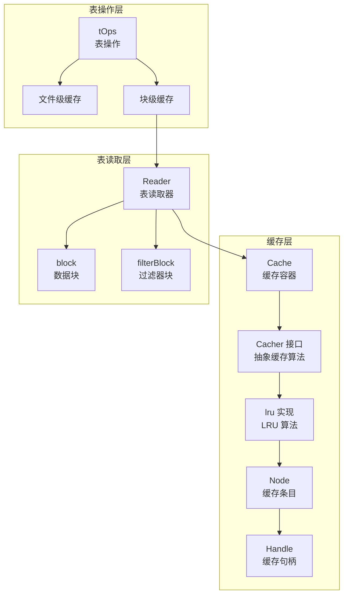
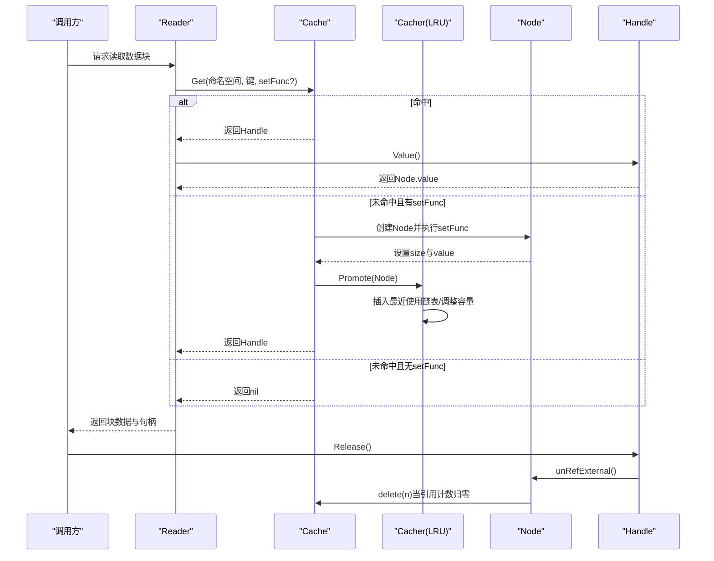
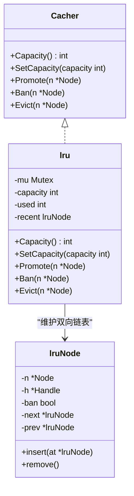
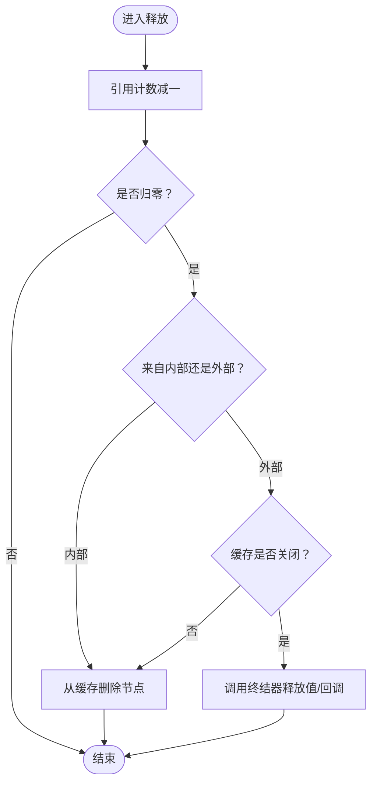
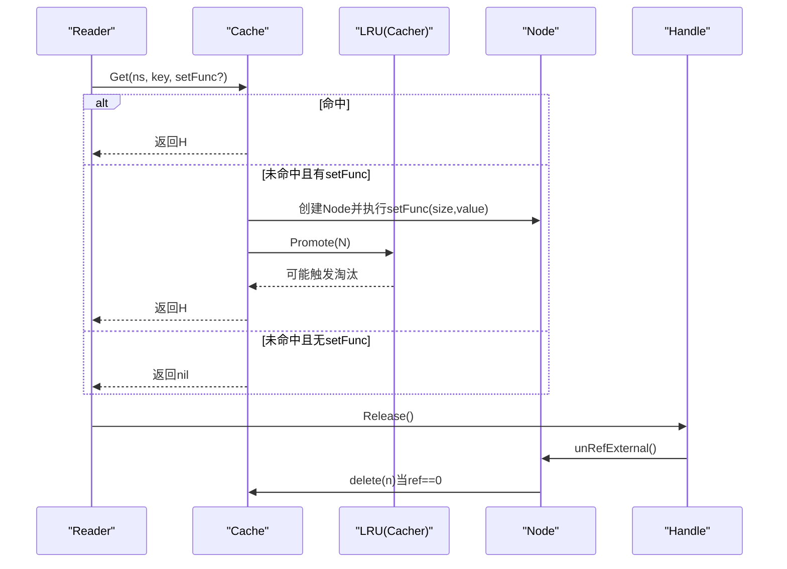
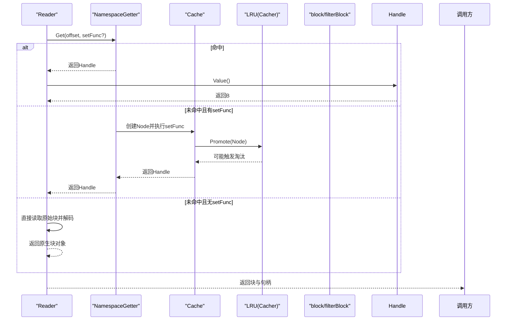
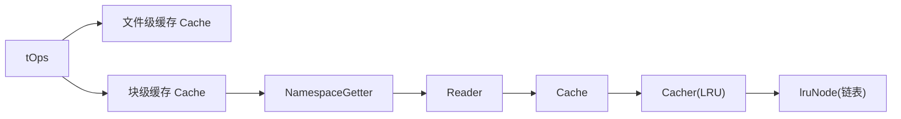

# 缓存策略

<cite>
**本文引用的文件列表**
- [cache.go](file://leveldb/cache/cache.go)
- [lru.go](file://leveldb/cache/lru.go)
- [reader.go](file://leveldb/table/reader.go)
- [table.go](file://leveldb/table/table.go)
- [cache_test.go](file://leveldb/cache/cache_test.go)
</cite>

## 目录
1. [引言](#引言)
2. [项目结构](#项目结构)
3. [核心组件](#核心组件)
4. [架构总览](#架构总览)
5. [详细组件分析](#详细组件分析)
6. [依赖关系分析](#依赖关系分析)
7. [性能考量](#性能考量)
8. [故障排查指南](#故障排查指南)
9. [结论](#结论)

## 引言
本文件围绕SSTable块缓存策略进行系统化文档化，重点阐述：
- LRU（最近最少使用）淘汰算法在cache.go中的协作方式与实现要点
- 缓存条目（Node）的引用计数管理与并发访问控制机制
- 命中与未命中的处理流程
- 当缓存满时，Cacher接口如何与底层缓存算法协同淘汰旧条目
- 结合reader.go中readBlockCached方法的调用逻辑，说明数据块加载与缓存交互，确保缓存一致性

## 项目结构
与缓存策略直接相关的代码分布在以下模块：
- 缓存框架与LRU实现：leveldb/cache/cache.go、leveldb/cache/lru.go
- 表读取器与块缓存交互：leveldb/table/reader.go
- 表操作初始化与缓存配置：leveldb/table/table.go
- 缓存行为与LRU测试：leveldb/cache/cache_test.go

图表来源
- [cache.go](file://leveldb/cache/cache.go#L362-L782)
- [lru.go](file://leveldb/cache/lru.go#L41-L159)
- [reader.go](file://leveldb/table/reader.go#L624-L776)
- [table.go](file://leveldb/table/table.go#L403-L565)

章节来源
- [cache.go](file://leveldb/cache/cache.go#L362-L782)
- [lru.go](file://leveldb/cache/lru.go#L41-L159)
- [reader.go](file://leveldb/table/reader.go#L624-L776)
- [table.go](file://leveldb/table/table.go#L403-L565)

## 核心组件
- Cache：通用缓存容器，提供命名空间隔离、并发安全的节点查找、创建、删除与统计功能；可选绑定Cacher实现具体淘汰策略。
- Cacher：缓存算法抽象接口，定义容量查询/设置、提升（Promote）、封禁（Ban）、驱逐（Evict）等能力。
- lru：LRU算法的具体实现，维护双向链表记录最近使用顺序，按容量阈值自动淘汰最久未使用条目。
- Node：缓存条目，包含命名空间、键、大小、值、引用计数、删除回调等字段，并通过CacheData指针与具体缓存实现关联。
- Handle：缓存句柄，持有对Node的引用，负责对外暴露值并最终释放引用。
- Reader：表读取器，支持从存储读取原始块数据，必要时通过缓存获取已解码的块对象，避免重复解码与分配。
- tOps：表操作封装，负责打开表文件、构建表读取器、配置文件级与块级缓存。

章节来源
- [cache.go](file://leveldb/cache/cache.go#L362-L782)
- [lru.go](file://leveldb/cache/lru.go#L41-L159)
- [reader.go](file://leveldb/table/reader.go#L624-L776)
- [table.go](file://leveldb/table/table.go#L403-L565)

## 架构总览
下图展示缓存策略在系统中的位置与交互路径，强调LRU与Cache、Reader之间的协作。

图表来源
- [cache.go](file://leveldb/cache/cache.go#L464-L518)
- [lru.go](file://leveldb/cache/lru.go#L82-L116)
- [reader.go](file://leveldb/table/reader.go#L624-L656)

## 详细组件分析

### LRU 淘汰算法与Cacher接口协作
- Cacher接口职责
  - 容量查询与设置：用于动态调整缓存上限。
  - Promote：当缓存命中或新插入条目时，将其标记为“最近使用”。
  - Ban：封禁特定条目，禁止其再次被Promote，同时从LRU链表移除。
  - Evict：显式驱逐指定条目，从LRU链表移除并释放句柄。
- LRU实现要点
  - 使用双向链表维护最近使用顺序，recent哨兵节点简化插入/删除。
  - used计数跟踪当前占用大小，超过capacity时从尾部（最久未使用）开始淘汰。
  - Promote时若条目已在链表中，仅更新其位置；若不在链表中且条目大小不超过capacity，则插入链表头部。
  - Ban会将条目标记为ban状态并从链表移除，同时减少used计数。
  - Evict直接从链表移除并释放句柄，不触发setFunc创建。

图表来源
- [cache.go](file://leveldb/cache/cache.go#L19-L36)
- [lru.go](file://leveldb/cache/lru.go#L41-L159)

章节来源
- [cache.go](file://leveldb/cache/cache.go#L19-L36)
- [lru.go](file://leveldb/cache/lru.go#L41-L159)

### 缓存条目（Node）的引用计数管理
- 引用计数字段ref：原子计数，初始为1，每次GetHandle增加1，每次Release减少1。
- GetHandle：在外部获取句柄时增加引用，若引用为0则抛出错误，防止非法使用。
- unRefInternal/unRefExternal：内部/外部释放逻辑，当引用计数降至0时，尝试从缓存删除该节点，并触发统计更新。
- 删除流程：delete方法在桶内定位节点并检查引用计数，若为0则清理值（调用util.Releaser.Release）与回调函数，更新统计并可能触发扩容/缩容。

图表来源
- [cache.go](file://leveldb/cache/cache.go#L738-L782)

章节来源
- [cache.go](file://leveldb/cache/cache.go#L672-L782)

### 并发访问控制机制
- Cache整体读写锁：Get/Delete/Evict等方法在进入后立即获取读锁，保证并发安全。
- 桶级互斥：每个mBucket拥有独立互斥锁，节点查找、创建、删除均在桶内加锁，降低热点竞争。
- 哈希头迁移：mHead支持动态扩容/缩容，resizeInProgress原子位防止并发重入，initBucket按需冻结/分裂/合并节点集合。
- LRU互斥：LRU内部使用互斥锁保护链表与used计数，SetCapacity/Promote/Ban/Evict均为互斥段。

章节来源
- [cache.go](file://leveldb/cache/cache.go#L362-L463)
- [cache.go](file://leveldb/cache/cache.go#L121-L189)
- [cache.go](file://leveldb/cache/cache.go#L191-L259)
- [lru.go](file://leveldb/cache/lru.go#L41-L80)

### 命中与未命中的处理流程
- 命中：桶内找到节点，引用计数+1，返回Handle；随后由上层调用者决定是否调用setFunc。
- 未命中且有setFunc：创建Node，执行setFunc生成size与value，更新统计，调用Cacher.Promote，返回Handle。
- 未命中且无setFunc：直接返回nil，不创建节点。
- 删除与封禁：Delete会先查找节点，若存在则Ban并unRef；Evict直接驱逐。

图表来源
- [cache.go](file://leveldb/cache/cache.go#L464-L518)
- [lru.go](file://leveldb/cache/lru.go#L82-L116)

章节来源
- [cache.go](file://leveldb/cache/cache.go#L464-L518)

### 数据块加载与缓存交互（readBlockCached）
- 调用入口：Reader.readBlockCached与readFilterBlockCached分别用于数据块与过滤器块的缓存读取。
- 填充缓存：fillCache=true时，调用NamespaceGetter.Get(ns,key,setFunc)，其中setFunc负责实际读取原始块并解码为内存块对象，返回size与value。
- 命中处理：若缓存命中，Handle.Value()返回对应块对象；若类型不匹配则释放句柄并报错。
- 未命中：直接读取原始块并解码，返回原生块对象作为句柄（NoopReleaser）。
- 一致性保障：Handle在释放时调用unRefExternal，确保引用计数正确递减并在归零时删除节点，避免悬挂引用。

图表来源
- [reader.go](file://leveldb/table/reader.go#L624-L714)
- [cache.go](file://leveldb/cache/cache.go#L464-L518)
- [lru.go](file://leveldb/cache/lru.go#L82-L116)

章节来源
- [reader.go](file://leveldb/table/reader.go#L624-L714)

### 缓存满时的淘汰与容量调整
- 容量设置：Cache.SetCapacity委托给Cacher.SetCapacity；LRU实现中，SetCapacity会循环移除尾部节点直到used不超过capacity，并逐个释放句柄。
- 插入与提升：Promote在插入新节点或提升已有节点时，若used超过capacity则持续淘汰尾部节点，直至满足约束。
- 封禁与驱逐：Ban将节点标记为ban并从链表移除，减少used；Evict直接移除并释放句柄，不触发setFunc。

章节来源
- [cache.go](file://leveldb/cache/cache.go#L457-L462)
- [lru.go](file://leveldb/cache/lru.go#L60-L116)

### 测试验证与行为特性
- 容量与节点/大小统计：测试覆盖容量变更、节点数量与总大小统计。
- 命中/未命中：验证同一命名空间内不同键的命中/未命中行为。
- 淘汰顺序：验证LRU淘汰顺序与Promote提升行为。
- 驱逐与封禁：Evict/EvictNS/EvictAll/Delete的行为与回调执行。
- 关闭与资源回收：Close时强制释放与回调执行。

章节来源
- [cache_test.go](file://leveldb/cache/cache_test.go#L262-L279)
- [cache_test.go](file://leveldb/cache/cache_test.go#L360-L424)
- [cache_test.go](file://leveldb/cache/cache_test.go#L426-L498)
- [cache_test.go](file://leveldb/cache/cache_test.go#L500-L557)

## 依赖关系分析
- 表操作层（tOps）根据配置创建文件级与块级缓存，并在打开表时为块缓存设置命名空间，使不同表的块缓存相互隔离。
- Reader通过NamespaceGetter访问块缓存，按块偏移作为键进行缓存读取。
- Cache与Cacher之间为组合关系，Cache在命中/未命中时调用Cacher.Promote；在删除/驱逐时调用Cacher.Ban/Evict。

图表来源
- [table.go](file://leveldb/table/table.go#L403-L565)
- [reader.go](file://leveldb/table/reader.go#L624-L714)
- [cache.go](file://leveldb/cache/cache.go#L362-L463)
- [lru.go](file://leveldb/cache/lru.go#L41-L116)

章节来源
- [table.go](file://leveldb/table/table.go#L403-L565)
- [reader.go](file://leveldb/table/reader.go#L624-L714)
- [cache.go](file://leveldb/cache/cache.go#L362-L463)
- [lru.go](file://leveldb/cache/lru.go#L41-L116)

## 性能考量
- 哈希分桶与桶级锁：通过mHead与mBucket的分桶设计，降低热点竞争，提高并发吞吐。
- 动态扩容/缩容：基于阈值与溢出计数的自适应扩容/缩容，平衡内存与查找效率。
- LRU链表常数时间操作：插入/删除/提升均为O(1)，适合高频访问场景。
- 原子计数与最小锁粒度：引用计数与统计使用原子操作，减少锁竞争。
- 缓存命中避免重复解码：通过缓存块对象，显著降低CPU与内存分配开销。

## 故障排查指南
- 常见问题
  - 句柄释放多次：Handle.Release幂等，但重复释放不会造成崩溃；若出现异常行为，检查调用方是否在多处持有同一句柄。
  - 类型不一致：当缓存命中但值类型不符（例如期望block却得到filterBlock），会返回错误；检查命名空间与键是否正确。
  - 删除回调未执行：确认Delete传入了delFunc，并确保节点在删除前引用计数为0。
  - 关闭后访问：Cache.Close后所有方法为no-op，若仍访问可能导致nil返回或错误。
- 定位手段
  - 查看Cache.GetStats统计命中/未命中/删除次数，辅助判断缓存命中率与淘汰频率。
  - 在Reader侧检查fillCache参数，确认是否期望填充缓存。
  - 在LRU侧检查used/capacity变化，确认容量设置与淘汰是否符合预期。

章节来源
- [cache.go](file://leveldb/cache/cache.go#L424-L463)
- [reader.go](file://leveldb/table/reader.go#L624-L714)
- [cache_test.go](file://leveldb/cache/cache_test.go#L500-L557)

## 结论
本缓存策略通过Cache容器与Cacher接口解耦，以LRU为核心实现高效、可扩展的块缓存。Node的引用计数与Handle的生命周期管理确保了并发安全与资源回收的一致性；Reader在数据块加载时与缓存紧密协作，既避免重复解码，又通过命名空间隔离实现了跨表缓存的独立性。在缓存满时，Cacher.SetCapacity与Promote/Evict/Ban协同工作，维持容量约束与命中率的平衡。测试覆盖了关键行为，为稳定性提供了保障。