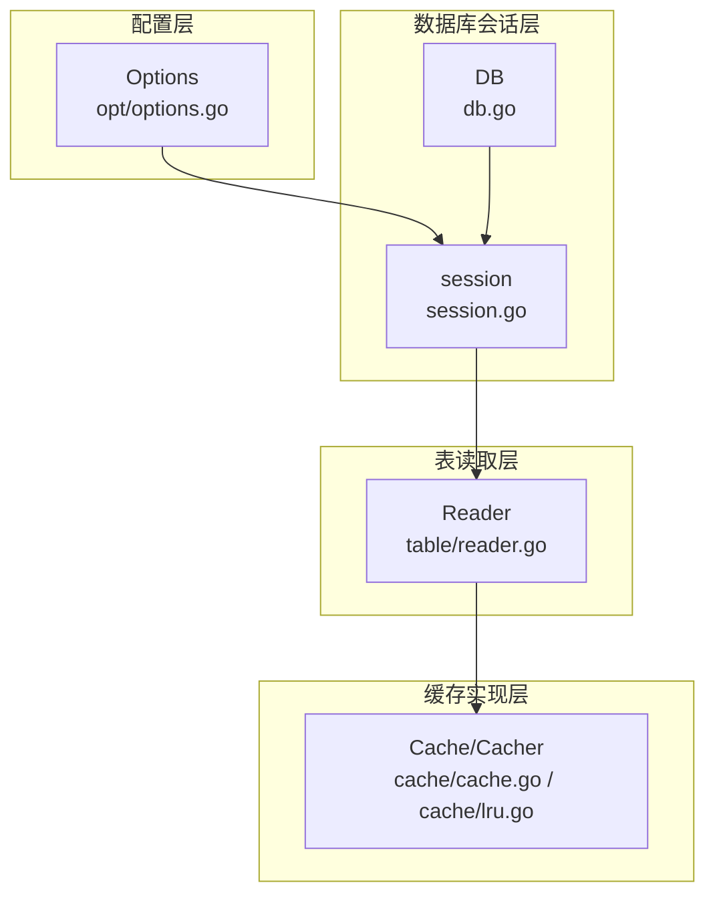
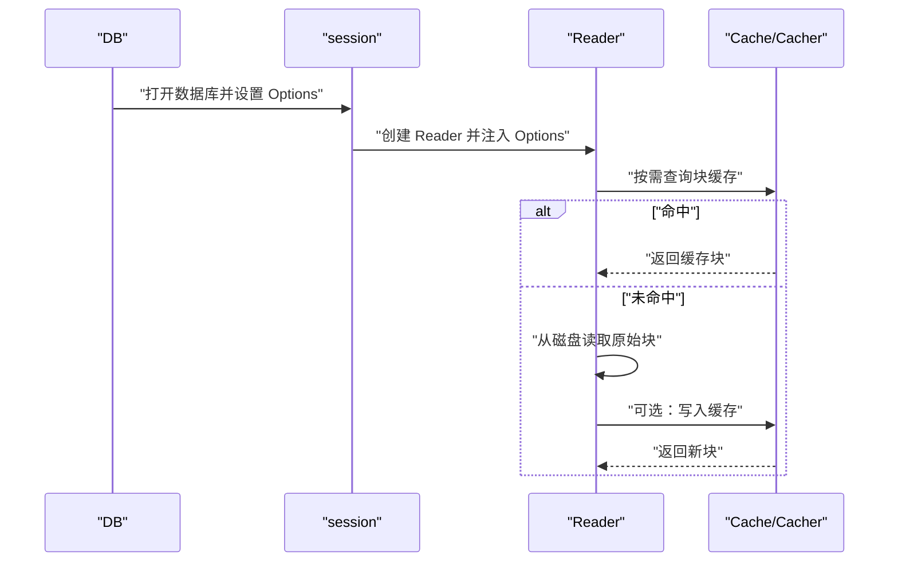
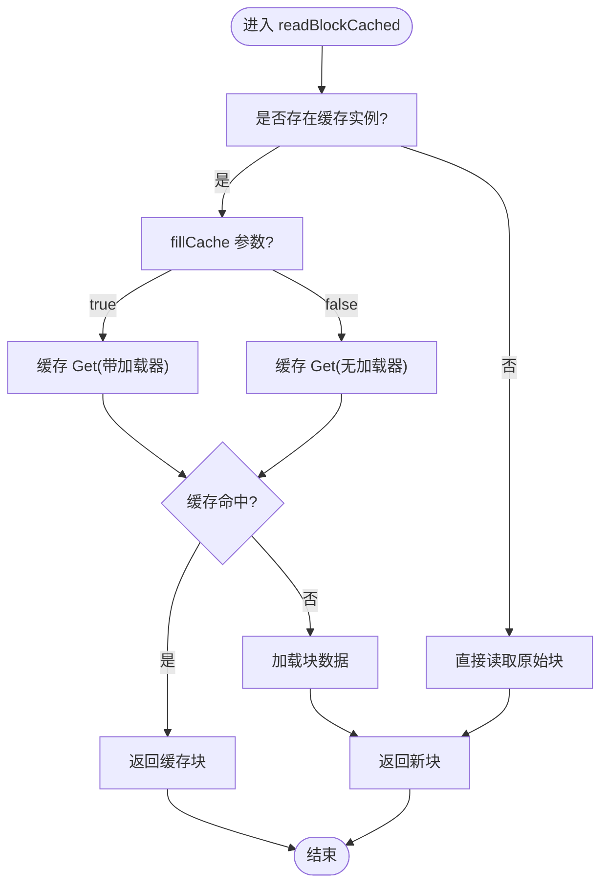
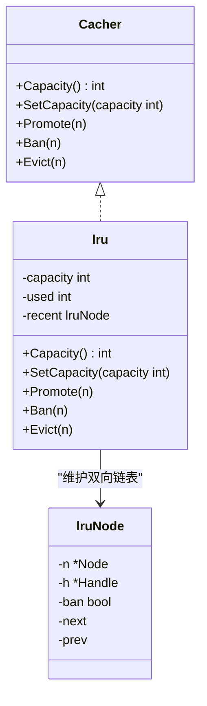
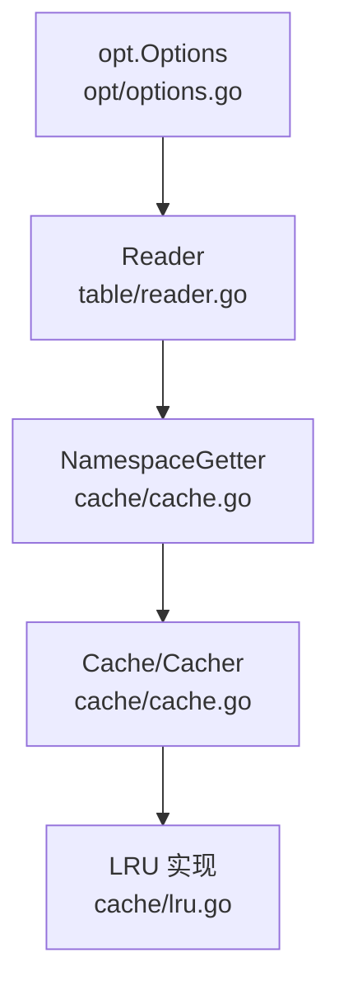

# 缓存配置

<cite>
**本文引用的文件列表**
- [options.go](file://leveldb/opt/options.go)
- [reader.go](file://leveldb/table/reader.go)
- [cache.go](file://leveldb/cache/cache.go)
- [lru.go](file://leveldb/cache/lru.go)
- [db.go](file://leveldb/db.go)
- [session.go](file://leveldb/session.go)
- [options.go（leveldb/options.go）](file://leveldb/options.go)
</cite>

## 目录
1. [简介](#简介)
2. [项目结构与定位](#项目结构与定位)
3. [核心组件与配置项总览](#核心组件与配置项总览)
4. [架构概览](#架构概览)
5. [详细组件分析](#详细组件分析)
6. [依赖关系分析](#依赖关系分析)
7. [性能考量与调优建议](#性能考量与调优建议)
8. [故障排查指南](#故障排查指南)
9. [结论](#结论)

## 简介
本文件围绕块缓存（Block Cache）的配置选项及其对性能的影响进行系统化说明，重点基于 options.go 中的 Options 结构体，解释 BlockCacher、BlockCacheCapacity、DisableBlockCache 的用途与默认值；并结合 table/reader.go 中的读取路径，说明 DontFillCache 在 reader.go 中的应用，以及在全表扫描等场景下避免污染热点数据缓存的价值。最后给出调整缓存容量与启用/禁用缓存的实践方法与最佳实践。

## 项目结构与定位
- 缓存配置集中在 opt 包的 Options 结构体中，包含块缓存算法选择、容量、是否禁用等关键参数。
- 表块读取逻辑位于 table 包的 Reader 中，负责从磁盘读取块并按需写入或跳过块缓存。
- 缓存实现位于 cache 包，提供通用缓存接口与 LRU 实现，供 Reader 使用。
- 数据库会话层在 session 层设置 Options 并传递给上层使用。

图表来源
- [options.go](file://leveldb/opt/options.go#L176-L210)
- [reader.go](file://leveldb/table/reader.go#L512-L534)
- [cache.go](file://leveldb/cache/cache.go#L19-L41)
- [lru.go](file://leveldb/cache/lru.go#L41-L159)
- [session.go](file://leveldb/session.go#L25-L47)
- [db.go](file://leveldb/db.go#L177-L200)

章节来源
- [options.go](file://leveldb/opt/options.go#L176-L210)
- [reader.go](file://leveldb/table/reader.go#L512-L534)
- [cache.go](file://leveldb/cache/cache.go#L19-L41)
- [lru.go](file://leveldb/cache/lru.go#L41-L159)
- [session.go](file://leveldb/session.go#L25-L47)
- [db.go](file://leveldb/db.go#L177-L200)

## 核心组件与配置项总览
- BlockCacher：指定块缓存使用的算法，默认为 LRU 算法；可通过传入自定义 Cacher 或使用 NoCacher 禁用缓存。
- BlockCacheCapacity：块缓存容量，默认 8 MiB；当设置为负数时会被视为禁用缓存。
- DisableBlockCache：显式禁用块缓存，优先级高于 BlockCacher 和 BlockCacheCapacity。
- DontFillCache：读取选项，控制本次读取是否将块写入缓存；默认 false，即默认写入缓存。

章节来源
- [options.go](file://leveldb/opt/options.go#L176-L210)
- [options.go](file://leveldb/opt/options.go#L433-L447)
- [options.go](file://leveldb/opt/options.go#L564-L569)
- [options.go](file://leveldb/opt/options.go#L694-L721)

## 架构概览
块缓存在读取流程中的位置如下：
- DB 打开后创建 session 并设置 Options。
- Reader 在读取表块时，根据 Options 决定是否启用缓存及使用何种算法。
- Reader 调用缓存的 NamespaceGetter.Get 接口，按需加载块数据并决定是否写入缓存。
- LRU 算法根据容量进行淘汰与提升。

图表来源
- [session.go](file://leveldb/session.go#L70-L97)
- [reader.go](file://leveldb/table/reader.go#L624-L656)
- [cache.go](file://leveldb/cache/cache.go#L43-L52)
- [lru.go](file://leveldb/cache/lru.go#L82-L116)

## 详细组件分析

### 配置项详解与默认值
- BlockCacher
  - 作用：指定块缓存算法；默认使用 LRU 算法；也可传入 NoCacher 来禁用缓存。
  - 默认值：LRUCacher。
  - 获取逻辑：若 Options 未设置或为空，则回退到默认值。
- BlockCacheCapacity
  - 作用：块缓存容量；默认 8 MiB；当设置为负数时被视为禁用缓存。
  - 获取逻辑：若为 0 则使用默认值；若为负数则视为 0。
- DisableBlockCache
  - 作用：显式禁用块缓存；优先级最高。
  - 获取逻辑：若开启则直接禁用缓存。
- DontFillCache（ReadOptions）
  - 作用：控制本次读取是否写入缓存；默认 false，即写入缓存。
  - 获取逻辑：若为 nil 则返回 false。

章节来源
- [options.go](file://leveldb/opt/options.go#L433-L447)
- [options.go](file://leveldb/opt/options.go#L564-L569)
- [options.go](file://leveldb/opt/options.go#L694-L721)

### 读取路径与缓存写入决策
Reader 在读取块时，会根据是否启用缓存与是否允许写入缓存来决定行为：
- 若启用缓存且允许写入缓存，则通过缓存的 Get 接口加载块并写入缓存。
- 若启用缓存但禁止写入缓存，则通过缓存的 Get 接口仅读取不写入。
- 若禁用缓存，则直接从磁盘读取原始块并返回。

图表来源
- [reader.go](file://leveldb/table/reader.go#L624-L656)

章节来源
- [reader.go](file://leveldb/table/reader.go#L624-L656)

### LRU 缓存实现要点
- 容量管理：SetCapacity 会根据当前使用量与容量阈值触发淘汰。
- 提升策略：Promote 将最近访问的节点插入链表头部并更新已使用容量。
- 淘汰与禁用：Evict/EvictNS/EvictAll 用于主动淘汰；Ban 可阻止后续提升。

图表来源
- [cache.go](file://leveldb/cache/cache.go#L19-L41)
- [lru.go](file://leveldb/cache/lru.go#L41-L159)

章节来源
- [cache.go](file://leveldb/cache/cache.go#L19-L41)
- [lru.go](file://leveldb/cache/lru.go#L41-L159)

### 与数据库会话的关系
- DB 打开时创建 session，并将用户提供的 Options 复制一份，设置比较器、过滤器等，随后由上层使用。
- Options 的获取方法会处理默认值与边界情况（如负数容量视为禁用）。

章节来源
- [db.go](file://leveldb/db.go#L177-L200)
- [session.go](file://leveldb/session.go#L25-L47)
- [options.go（leveldb/options.go）](file://leveldb/options.go#L14-L23)

## 依赖关系分析
- Options 依赖 opt 包的常量与类型定义，提供默认值与获取方法。
- Reader 依赖 cache 包的 NamespaceGetter 与 Cacher 接口，实现块缓存的读取与写入。
- LRU 实现依赖 Node/Handle 生命周期管理，确保缓存对象释放与引用计数正确。

图表来源
- [options.go](file://leveldb/opt/options.go#L176-L210)
- [reader.go](file://leveldb/table/reader.go#L512-L534)
- [cache.go](file://leveldb/cache/cache.go#L43-L52)
- [lru.go](file://leveldb/cache/lru.go#L41-L159)

章节来源
- [options.go](file://leveldb/opt/options.go#L176-L210)
- [reader.go](file://leveldb/table/reader.go#L512-L534)
- [cache.go](file://leveldb/cache/cache.go#L43-L52)
- [lru.go](file://leveldb/cache/lru.go#L41-L159)

## 性能考量与调优建议
- 块缓存容量（BlockCacheCapacity）
  - 适合热数据集：适当增大容量以提升命中率，减少磁盘 IO。
  - 适合内存受限环境：减小容量，避免频繁淘汰导致抖动。
  - 注意：当容量为负数时会被视为禁用缓存。
- 禁用块缓存（DisableBlockCache）
  - 全表扫描、批量导入等场景可考虑禁用，避免污染热点块缓存。
  - 对于只读长任务，可配合 DontFillCache 控制写入缓存。
- 算法选择（BlockCacher）
  - 默认 LRU 已覆盖大多数场景；若需要共享缓存实例，可使用 PassthroughCacher。
- 读取选项（DontFillCache）
  - 在全表扫描、备份导出等场景设置为 true，避免将扫描数据写入缓存，保护热点键的缓存命中。
- 与其他参数协同
  - BlockSize、BlockRestartInterval 影响单块大小与索引重启点，间接影响缓存命中与压缩比。
  - 过大的 BlockSize 会降低缓存局部性；过小的 BlockSize 会增加元数据开销。

章节来源
- [options.go](file://leveldb/opt/options.go#L433-L447)
- [options.go](file://leveldb/opt/options.go#L564-L569)
- [options.go](file://leveldb/opt/options.go#L694-L721)
- [reader.go](file://leveldb/table/reader.go#L624-L656)

## 故障排查指南
- 缓存未生效
  - 检查是否设置了 DisableBlockCache；若为 true，缓存将被禁用。
  - 检查 BlockCacheCapacity 是否为负数或 0；负数会被视为禁用。
  - 检查 BlockCacher 是否被设置为 NoCacher。
- 命中率低
  - 调整 BlockCacheCapacity，观察命中率变化。
  - 检查热点键是否被大量扫描写入缓存，必要时使用 DontFillCache。
- 性能抖动
  - 容量过大导致频繁淘汰：适当降低容量。
  - 容量过小导致频繁未命中：适当提高容量。
- 读取路径异常
  - 确认 Reader 的 fillCache 参数是否符合预期（受 ReadOptions.DontFillCache 影响）。

章节来源
- [options.go](file://leveldb/opt/options.go#L433-L447)
- [options.go](file://leveldb/opt/options.go#L564-L569)
- [options.go](file://leveldb/opt/options.go#L694-L721)
- [reader.go](file://leveldb/table/reader.go#L624-L656)

## 结论
- BlockCacher、BlockCacheCapacity、DisableBlockCache 是控制块缓存的核心配置项，分别负责算法选择、容量与禁用开关。
- DontFillCache 在读取路径中起到“写入缓存与否”的关键作用，尤其适用于全表扫描等场景，避免污染热点数据缓存。
- 通过合理设置这些参数并结合业务特征（热数据规模、扫描模式、内存限制），可以显著提升读取性能与稳定性。