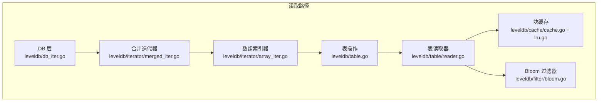
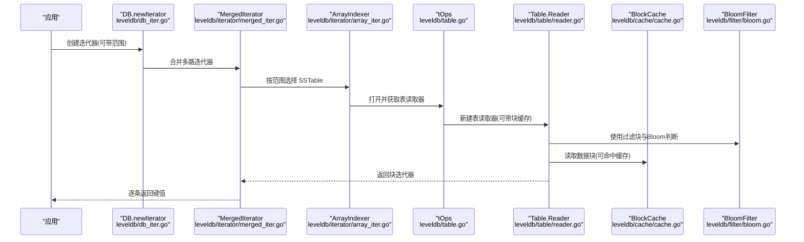
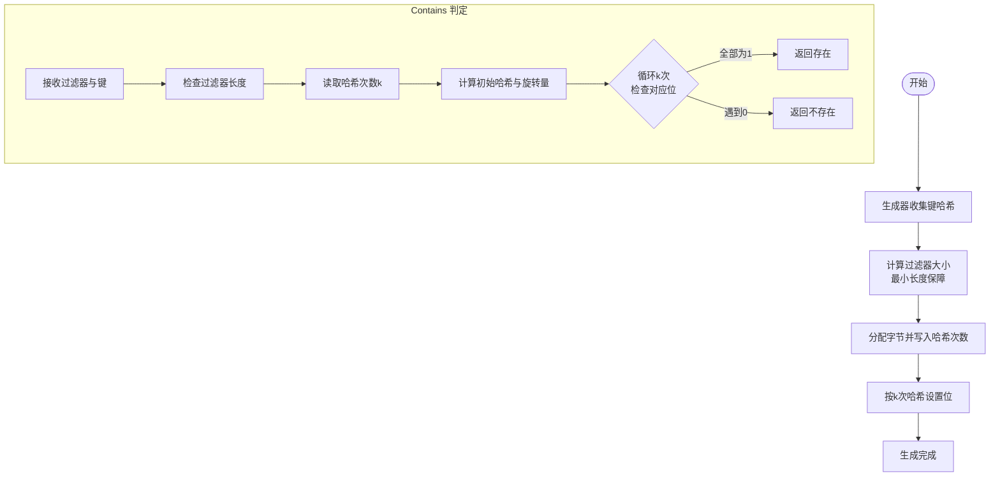
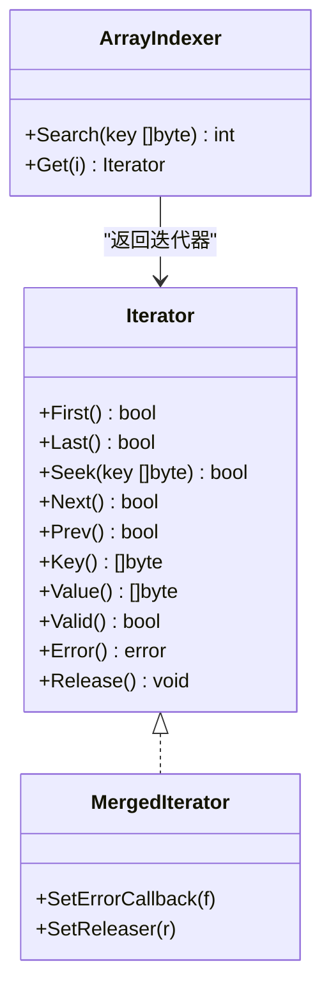
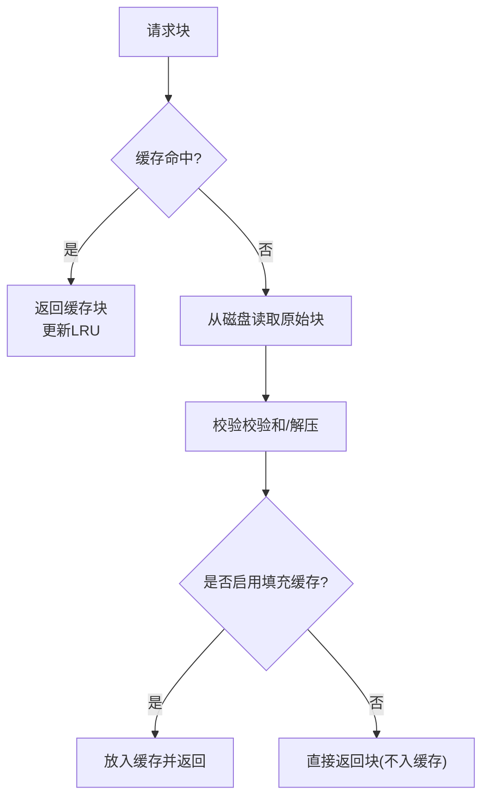
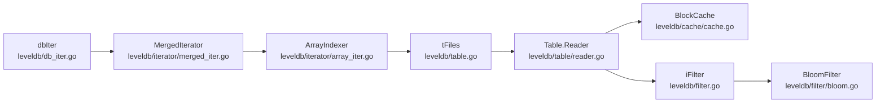

# 读取优化

<cite>
**本文引用的文件**
- [leveldb/filter/bloom.go](file://leveldb/filter/bloom.go)
- [leveldb/filter.go](file://leveldb/filter.go)
- [leveldb/table/reader.go](file://leveldb/table/reader.go)
- [leveldb/cache/cache.go](file://leveldb/cache/cache.go)
- [leveldb/cache/lru.go](file://leveldb/cache/lru.go)
- [leveldb/iterator/iter.go](file://leveldb/iterator/iter.go)
- [leveldb/iterator/array_iter.go](file://leveldb/iterator/array_iter.go)
- [leveldb/iterator/merged_iter.go](file://leveldb/iterator/merged_iter.go)
- [leveldb/db_iter.go](file://leveldb/db_iter.go)
- [leveldb/table.go](file://leveldb/table.go)
- [leveldb/options.go](file://leveldb/options.go)
- [leveldb/filter/bloom_test.go](file://leveldb/filter/bloom_test.go)
- [leveldb/cache/cache_test.go](file://leveldb/cache/cache_test.go)
</cite>

## 目录
1. [引言](#引言)
2. [项目结构](#项目结构)
3. [核心组件](#核心组件)
4. [架构总览](#架构总览)
5. [详细组件分析](#详细组件分析)
6. [依赖关系分析](#依赖关系分析)
7. [性能考量与优化建议](#性能考量与优化建议)
8. [故障排查指南](#故障排查指南)
9. [结论](#结论)

## 引言
本文件聚焦于 avccDB 的读取路径优化，系统性梳理并解释以下机制：
- Bloom 过滤器的原理、实现与参数调优（特别是 FilterBaseLg 参数）
- 迭代器（Iterator）的使用技巧：范围查询、方向控制、错误处理与资源管理
- SSTable 块缓存（Block Cache）如何降低磁盘 I/O，以及 DontFillCache 选项的应用场景
- 读取路径的性能分析方法与最佳实践

目标是帮助读者在不深入源码的前提下，也能理解并正确配置与使用这些优化手段。

## 项目结构
围绕读取优化的相关模块主要分布在以下子包：
- 过滤器：leveldb/filter 与 leveldb/filter.go
- 表读取：leveldb/table/reader.go
- 缓存：leveldb/cache/cache.go 与 leveldb/cache/lru.go
- 迭代器：leveldb/iterator/* 与 leveldb/db_iter.go
- 表层组织：leveldb/table.go
- 选项与封装：leveldb/options.go
- 测试用例：leveldb/filter/bloom_test.go、leveldb/cache/cache_test.go

图表来源
- [leveldb/db_iter.go](file://leveldb/db_iter.go#L31-L61)
- [leveldb/iterator/merged_iter.go](file://leveldb/iterator/merged_iter.go#L299-L317)
- [leveldb/iterator/array_iter.go](file://leveldb/iterator/array_iter.go#L154-L182)
- [leveldb/table.go](file://leveldb/table.go#L286-L306)
- [leveldb/table/reader.go](file://leveldb/table/reader.go#L716-L787)
- [leveldb/cache/cache.go](file://leveldb/cache/cache.go#L362-L437)
- [leveldb/cache/lru.go](file://leveldb/cache/lru.go#L153-L159)
- [leveldb/filter/bloom.go](file://leveldb/filter/bloom.go#L17-L24)

章节来源
- [leveldb/db_iter.go](file://leveldb/db_iter.go#L31-L61)
- [leveldb/iterator/merged_iter.go](file://leveldb/iterator/merged_iter.go#L299-L317)
- [leveldb/iterator/array_iter.go](file://leveldb/iterator/array_iter.go#L154-L182)
- [leveldb/table.go](file://leveldb/table.go#L286-L306)
- [leveldb/table/reader.go](file://leveldb/table/reader.go#L716-L787)
- [leveldb/cache/cache.go](file://leveldb/cache/cache.go#L362-L437)
- [leveldb/cache/lru.go](file://leveldb/cache/lru.go#L153-L159)
- [leveldb/filter/bloom.go](file://leveldb/filter/bloom.go#L17-L24)

## 核心组件
- Bloom 过滤器：用于快速判定键是否可能存在于某个 SSTable 中，避免不必要的磁盘访问。
- 表读取器（Table Reader）：负责从 SSTable 中读取数据块、索引块、过滤块等，并支持范围切片与缓存。
- 块缓存（Block Cache）：对数据块与过滤块进行缓存，显著降低重复读取带来的 I/O 开销。
- 合并迭代器（Merged Iterator）：将多个底层迭代器（内存、冻结内存、SSTable 等）合并为一个有序迭代器。
- 数组索引器（Array Indexer）：基于表集合的索引，按范围快速定位需要扫描的 SSTable。
- DB 迭代器（dbIter）：面向上层的数据库级迭代器，负责版本过滤、方向控制与采样触发。

章节来源
- [leveldb/filter/bloom.go](file://leveldb/filter/bloom.go#L17-L24)
- [leveldb/table/reader.go](file://leveldb/table/reader.go#L716-L787)
- [leveldb/cache/cache.go](file://leveldb/cache/cache.go#L362-L437)
- [leveldb/iterator/merged_iter.go](file://leveldb/iterator/merged_iter.go#L299-L317)
- [leveldb/iterator/array_iter.go](file://leveldb/iterator/array_iter.go#L154-L182)
- [leveldb/db_iter.go](file://leveldb/db_iter.go#L63-L91)

## 架构总览
读取流程自上而下如下：
- 上层通过 DB.NewIterator 获取数据库级迭代器
- dbIter 将内存、冻结内存、SSTable 等多路迭代器合并为单一有序流
- 数组索引器根据范围快速筛选需要扫描的 SSTable
- 表读取器按需加载数据块与过滤块，结合块缓存与 Bloom 过滤器
- Bloom 过滤器用于快速判断键是否可能存在于某块或某表中

图表来源
- [leveldb/db_iter.go](file://leveldb/db_iter.go#L63-L91)
- [leveldb/iterator/merged_iter.go](file://leveldb/iterator/merged_iter.go#L299-L317)
- [leveldb/iterator/array_iter.go](file://leveldb/iterator/array_iter.go#L154-L182)
- [leveldb/table.go](file://leveldb/table.go#L403-L509)
- [leveldb/table/reader.go](file://leveldb/table/reader.go#L716-L787)
- [leveldb/cache/cache.go](file://leveldb/cache/cache.go#L362-L437)
- [leveldb/filter/bloom.go](file://leveldb/filter/bloom.go#L17-L24)

## 详细组件分析

### Bloom 过滤器原理与实现
- 名称与接口：Bloom 过滤器实现了一个稳定的名称字符串，便于序列化与兼容性。
- Contains 判定：通过预计算的位数与哈希次数，对给定键进行多次位检查；若任一位为 0，则一定不存在；否则可能存在（允许误判）。
- 生成器：根据输入键集合生成过滤器，内部会计算最小长度以保证较低误判率。
- 与表过滤块的配合：表读取器维护过滤块，按 baseLg 计算偏移，再由 Bloom 过滤器执行 Contains 判断。

图表来源
- [leveldb/filter/bloom.go](file://leveldb/filter/bloom.go#L17-L24)
- [leveldb/filter/bloom.go](file://leveldb/filter/bloom.go#L26-L52)
- [leveldb/filter/bloom.go](file://leveldb/filter/bloom.go#L54-L66)
- [leveldb/filter/bloom.go](file://leveldb/filter/bloom.go#L81-L104)

章节来源
- [leveldb/filter/bloom.go](file://leveldb/filter/bloom.go#L17-L24)
- [leveldb/filter/bloom.go](file://leveldb/filter/bloom.go#L26-L52)
- [leveldb/filter/bloom.go](file://leveldb/filter/bloom.go#L54-L66)
- [leveldb/filter/bloom.go](file://leveldb/filter/bloom.go#L81-L104)
- [leveldb/filter/bloom_test.go](file://leveldb/filter/bloom_test.go#L102-L143)

### FilterBaseLg 参数调优
- 定义与作用：表过滤块包含若干子过滤器，每个子过滤器覆盖一段键空间。baseLg 决定了子过滤器的跨度（以 2 的幂表示），影响过滤精度与内存占用。
- 调优策略：
  - 较小 baseLg：子过滤器更细密，命中率更高，但过滤块更大，内存占用增加。
  - 较大 baseLg：子过滤器更稀疏，内存节省，但可能漏掉部分存在键，导致更多磁盘访问。
- 实践建议：
  - 在写入量大、键分布均匀时，适当增大 baseLg 以节省内存。
  - 在读取热点明显、键分布集中时，适当减小 baseLg 提高命中率。
  - 结合 Bloom 过滤器的 bitsPerKey 参数与实际误判率测试结果综合评估。

章节来源
- [leveldb/table/reader.go](file://leveldb/table/reader.go#L457-L484)
- [leveldb/table/reader.go](file://leveldb/table/reader.go#L658-L714)
- [leveldb/filter/bloom.go](file://leveldb/filter/bloom.go#L106-L117)

### 迭代器使用技巧与资源管理
- 接口与方向控制：
  - 支持 First、Last、Seek、Next、Prev 等方法，方向状态机确保正确的遍历顺序。
  - 错误处理：迭代器在遇到错误时会停止并暴露 Error 方法；Release 必须调用以释放资源。
- 范围查询：
  - 通过 ArrayIndexer 与表集合的范围搜索，快速确定需要扫描的 SSTable 子集。
  - 表读取器在构建块迭代器时，可传入 Range 切片，仅遍历指定范围内的键。
- 资源管理：
  - 迭代器实现 util.Releaser 与 util.ReleaseSetter，确保在不再使用时及时释放。
  - 合并迭代器在 Release 时会释放其内部所有子迭代器。
- 版本过滤与严格模式：
  - DB 层迭代器会对内部键进行解析，按序列号与类型过滤，支持严格模式下的错误传播。

图表来源
- [leveldb/iterator/iter.go](file://leveldb/iterator/iter.go#L83-L133)
- [leveldb/iterator/merged_iter.go](file://leveldb/iterator/merged_iter.go#L299-L317)
- [leveldb/iterator/array_iter.go](file://leveldb/iterator/array_iter.go#L154-L182)
- [leveldb/db_iter.go](file://leveldb/db_iter.go#L31-L61)

章节来源
- [leveldb/iterator/iter.go](file://leveldb/iterator/iter.go#L83-L133)
- [leveldb/iterator/merged_iter.go](file://leveldb/iterator/merged_iter.go#L299-L317)
- [leveldb/iterator/array_iter.go](file://leveldb/iterator/array_iter.go#L154-L182)
- [leveldb/db_iter.go](file://leveldb/db_iter.go#L31-L61)

### SSTable 块缓存与 DontFillCache
- 块缓存的作用：对数据块与过滤块进行缓存，避免重复解压与磁盘 I/O。
- 命中与未命中：
  - 命中：直接从缓存句柄返回块对象，减少读取与解压成本。
  - 未命中：从磁盘读取原始块，校验校验和，解压后放入缓存并返回。
- DontFillCache（fillCache=false）：
  - 在某些场景（如一次性扫描大量数据、临时查询）下，可禁用填充缓存，避免污染缓存空间。
  - 对于热点数据，应启用填充缓存以提升后续访问性能。
- 缓存算法：默认采用 LRU，支持容量设置、淘汰与删除等操作。

图表来源
- [leveldb/table/reader.go](file://leveldb/table/reader.go#L624-L656)
- [leveldb/table/reader.go](file://leveldb/table/reader.go#L682-L714)
- [leveldb/cache/cache.go](file://leveldb/cache/cache.go#L464-L518)
- [leveldb/cache/lru.go](file://leveldb/cache/lru.go#L118-L152)

章节来源
- [leveldb/table/reader.go](file://leveldb/table/reader.go#L624-L656)
- [leveldb/table/reader.go](file://leveldb/table/reader.go#L682-L714)
- [leveldb/cache/cache.go](file://leveldb/cache/cache.go#L464-L518)
- [leveldb/cache/lru.go](file://leveldb/cache/lru.go#L118-L152)

### 读取路径性能分析方法
- 关键指标：
  - 命中率：块缓存命中数/总访问数；可通过缓存统计接口获取。
  - 误判率：Bloom 过滤器导致的“存在”误报比例；可通过测试用例评估。
  - I/O 次数：磁盘读取次数与字节数；结合 SSTable 文件大小与块大小估算。
- 分析步骤：
  - 启用缓存统计与日志，观察命中率变化趋势。
  - 针对不同范围查询，对比启用/禁用 Bloom 与填充缓存的差异。
  - 对热点键与范围进行压力测试，记录平均延迟与吞吐。
- 优化建议：
  - 提升块缓存容量与合适的 LRU 策略，优先保留热块。
  - 调整 Bloom bitsPerKey 与 baseLg，平衡内存与命中率。
  - 对一次性扫描场景使用 DontFillCache，避免污染缓存。

章节来源
- [leveldb/cache/cache.go](file://leveldb/cache/cache.go#L424-L437)
- [leveldb/filter/bloom_test.go](file://leveldb/filter/bloom_test.go#L102-L143)
- [leveldb/table.go](file://leveldb/table.go#L403-L509)

## 依赖关系分析
- DB 迭代器依赖合并迭代器与数组索引器，后者依赖表集合与比较器。
- 表读取器依赖块缓存与过滤器，过滤器又依赖 Bloom 实现。
- 选项封装（iFilter）将内部键转换为用户键后再交给过滤器判断。

图表来源
- [leveldb/db_iter.go](file://leveldb/db_iter.go#L63-L91)
- [leveldb/iterator/merged_iter.go](file://leveldb/iterator/merged_iter.go#L299-L317)
- [leveldb/iterator/array_iter.go](file://leveldb/iterator/array_iter.go#L154-L182)
- [leveldb/table.go](file://leveldb/table.go#L286-L306)
- [leveldb/table/reader.go](file://leveldb/table/reader.go#L716-L787)
- [leveldb/filter.go](file://leveldb/filter.go#L13-L32)
- [leveldb/filter/bloom.go](file://leveldb/filter/bloom.go#L17-L24)

章节来源
- [leveldb/db_iter.go](file://leveldb/db_iter.go#L63-L91)
- [leveldb/iterator/merged_iter.go](file://leveldb/iterator/merged_iter.go#L299-L317)
- [leveldb/iterator/array_iter.go](file://leveldb/iterator/array_iter.go#L154-L182)
- [leveldb/table.go](file://leveldb/table.go#L286-L306)
- [leveldb/table/reader.go](file://leveldb/table/reader.go#L716-L787)
- [leveldb/filter.go](file://leveldb/filter.go#L13-L32)
- [leveldb/filter/bloom.go](file://leveldb/filter/bloom.go#L17-L24)

## 性能考量与优化建议
- Bloom 与过滤块：
  - 适度提高 bitsPerKey 可降低误判率，但会增加过滤块体积；baseLg 影响子过滤器粒度，需结合工作负载权衡。
  - 可参考测试用例对不同长度与误判率进行评估。
- 块缓存：
  - LRU 容量应与可用内存与热点数据规模匹配；对热数据启用填充缓存，冷数据禁用。
  - 对批量扫描场景，优先考虑 DontFillCache，避免缓存抖动。
- 迭代器：
  - 合理使用范围查询，减少不必要的 SSTable 扫描。
  - 注意迭代器生命周期，确保 Release 被调用，避免资源泄漏。
- 严格模式：
  - 在需要强一致性的场景启用严格模式，以便尽早发现数据异常。

章节来源
- [leveldb/filter/bloom_test.go](file://leveldb/filter/bloom_test.go#L102-L143)
- [leveldb/cache/cache_test.go](file://leveldb/cache/cache_test.go#L262-L279)
- [leveldb/table/reader.go](file://leveldb/table/reader.go#L716-L787)
- [leveldb/db_iter.go](file://leveldb/db_iter.go#L31-L61)

## 故障排查指南
- 常见问题与定位：
  - 读取缓慢：检查块缓存命中率与 Bloom 误判率；确认是否启用了 DontFillCache 导致缓存未命中。
  - 迭代器提前结束：查看迭代器 Error 输出，确认是否存在损坏块或错误回调被触发。
  - 资源泄漏：确认迭代器与缓存句柄均被正确 Release。
- 排查要点：
  - 启用缓存统计，观察命中/未命中计数与淘汰事件。
  - 使用严格模式捕获损坏块，必要时重建或恢复表。
  - 对热点键进行压力测试，验证 Bloom 与缓存配置的有效性。

章节来源
- [leveldb/cache/cache.go](file://leveldb/cache/cache.go#L424-L437)
- [leveldb/iterator/merged_iter.go](file://leveldb/iterator/merged_iter.go#L50-L61)
- [leveldb/table/reader.go](file://leveldb/table/reader.go#L550-L566)

## 结论
通过 Bloom 过滤器、块缓存与高效的迭代器组合，avccDB 在读取路径上实现了显著的性能优化。合理配置 FilterBaseLg、bitsPerKey 与块缓存容量，并在不同场景下选择合适的填充策略，能够有效降低磁盘 I/O、提升命中率并稳定延迟。同时，规范的迭代器使用与资源管理是保障系统稳定运行的关键。