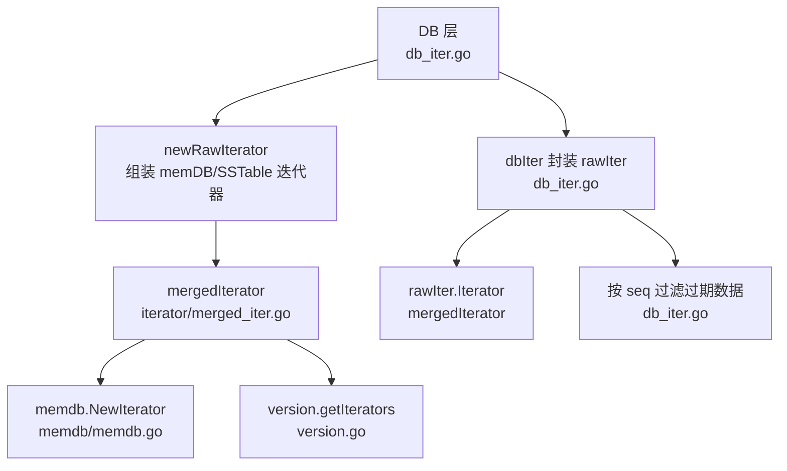
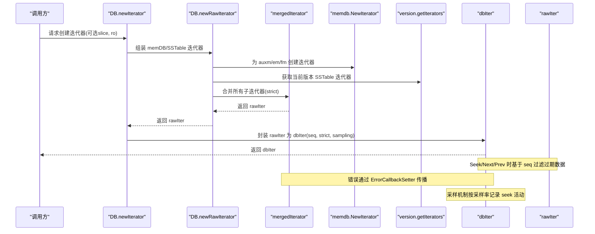
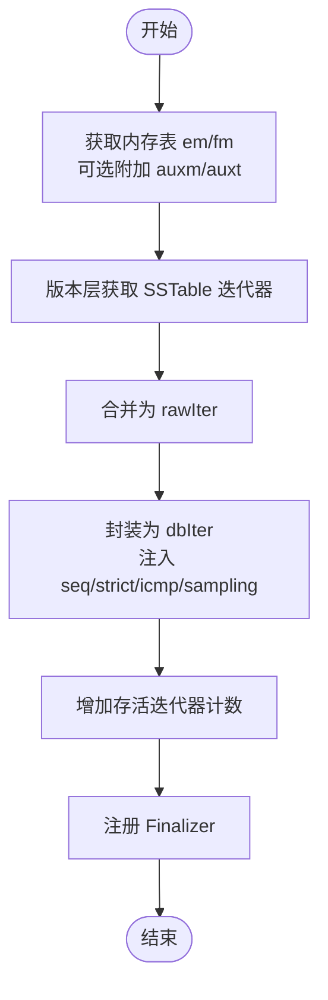
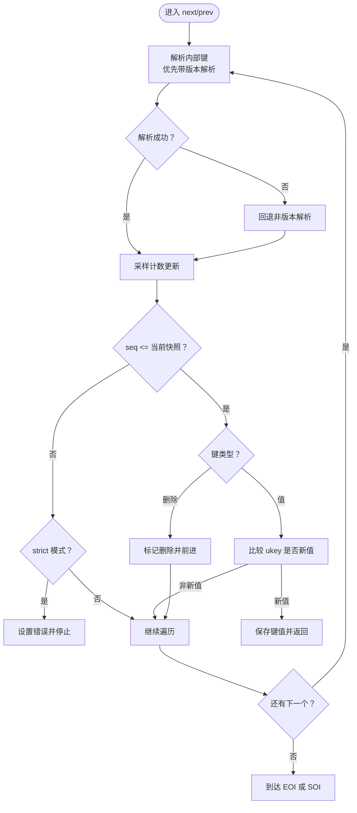
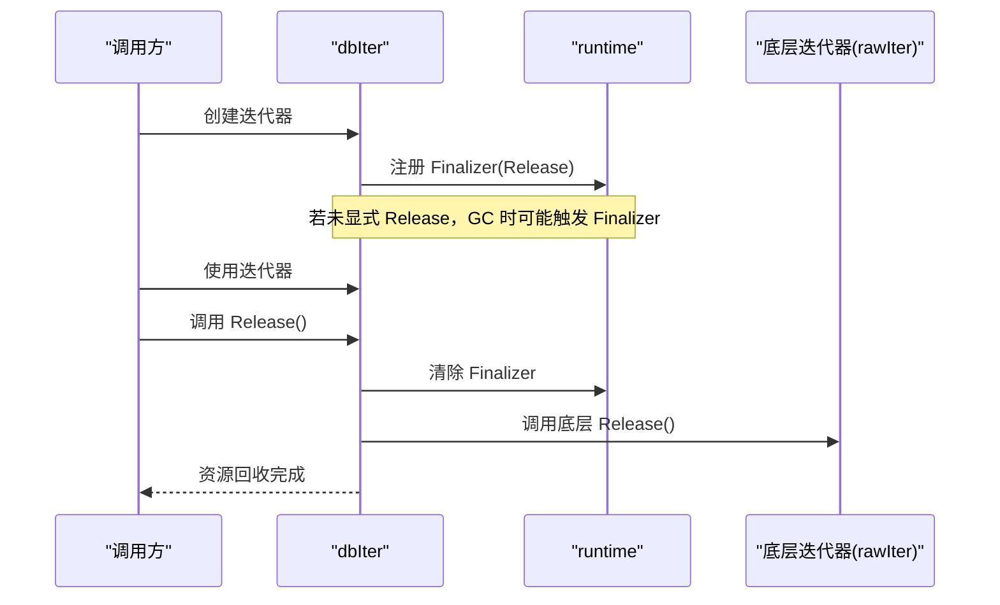
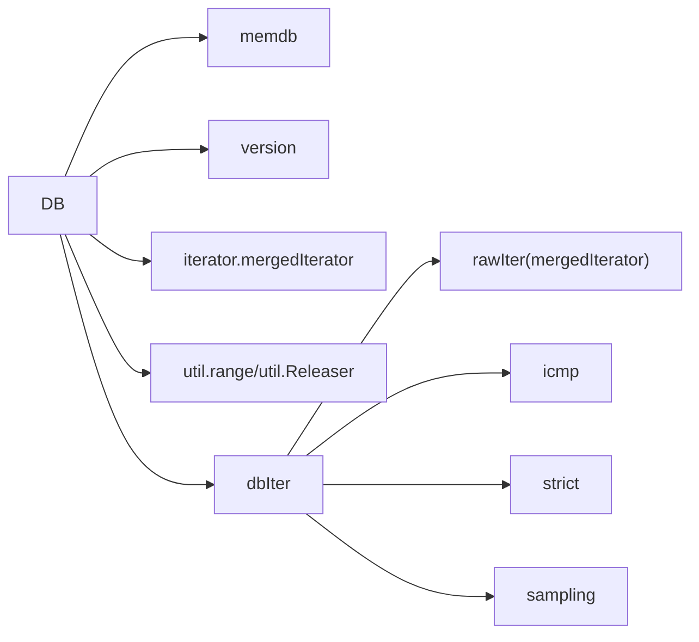

# 迭代器使用实践

<cite>
**本文引用的文件**
- [leveldb/db_iter.go](file://leveldb/db_iter.go)
- [leveldb/db_snapshot.go](file://leveldb/db_snapshot.go)
- [leveldb/db_transaction.go](file://leveldb/db_transaction.go)
- [leveldb/memdb/memdb.go](file://leveldb/memdb/memdb.go)
- [leveldb/version.go](file://leveldb/version.go)
- [leveldb/iterator/merged_iter.go](file://leveldb/iterator/merged_iter.go)
- [leveldb/iterator/iter.go](file://leveldb/iterator/iter.go)
- [leveldb/util/range.go](file://leveldb/util/range.go)
- [leveldb/util/util.go](file://leveldb/util/util.go)
- [leveldb/db_test.go](file://leveldb/db_test.go)
</cite>

## 目录
1. [简介](#简介)
2. [项目结构与定位](#项目结构与定位)
3. [核心组件](#核心组件)
4. [架构总览](#架构总览)
5. [详细组件分析](#详细组件分析)
6. [依赖关系分析](#依赖关系分析)
7. [性能考量](#性能考量)
8. [故障排查指南](#故障排查指南)
9. [结论](#结论)

## 简介
本指南围绕 avccDB 的迭代器体系，系统阐述如何在数据库层通过 newRawIterator 和 newIterator 组装内存表（memDB）与 SSTable 迭代器，形成统一的遍历视图；详解 dbIter 如何封装底层 rawIter 并通过 seq 字段实现版本快照隔离；给出 Range 范围查询的正确用法与边界条件处理；强调资源管理最佳实践（显式调用 Release 避免 runtime.SetFinalizer 带来的不确定性）；说明 ErrorCallbackSetter 在错误传播中的作用，并解释采样机制（sampleSeek）对性能监控的支持。

## 项目结构与定位
- 数据库层迭代器入口位于 leveldb/db_iter.go，负责将内存表与 SSTable 迭代器合并为单一视图，并在上层提供带版本隔离的 dbIter。
- 内存表迭代器来自 leveldb/memdb/memdb.go，提供有序键值遍历与范围裁剪。
- 版本层（version）负责选择与合并 SSTable 迭代器，见 leveldb/version.go。
- 合并迭代器来自 leveldb/iterator/merged_iter.go，用于将多个子迭代器按顺序合并输出。
- 错误回调接口定义于 leveldb/iterator/iter.go，支持设置错误回调以便传播底层错误。
- 范围切片结构定义于 leveldb/util/range.go，用于限定迭代范围。
- 资源释放接口与工具位于 leveldb/util/util.go。
- 快照与事务创建迭代器的示例与行为验证见 leveldb/db_snapshot.go、leveldb/db_transaction.go 与 leveldb/db_test.go。

图表来源
- [leveldb/db_iter.go](file://leveldb/db_iter.go#L31-L61)
- [leveldb/iterator/merged_iter.go](file://leveldb/iterator/merged_iter.go#L299-L308)
- [leveldb/memdb/memdb.go](file://leveldb/memdb/memdb.go#L1-L200)
- [leveldb/version.go](file://leveldb/version.go#L1-L200)

章节来源
- [leveldb/db_iter.go](file://leveldb/db_iter.go#L31-L61)
- [leveldb/iterator/merged_iter.go](file://leveldb/iterator/merged_iter.go#L299-L308)
- [leveldb/memdb/memdb.go](file://leveldb/memdb/memdb.go#L1-L200)
- [leveldb/version.go](file://leveldb/version.go#L1-L200)

## 核心组件
- newRawIterator：将内存表（auxm、em、fm）与 SSTable（auxt、version.getIterators）的迭代器收集并合并，返回一个统一的底层迭代器 rawIter。
- newIterator：在 rawIter 基础上封装为 dbIter，注入版本快照 seq、比较器 icmp、严格模式 strict、采样开关 disableSampling 等状态。
- dbIter：对外暴露 First/Last/Seek/Next/Prev/Key/Value/Error/Release 等方法，内部通过 next/prev 实现版本过滤与方向控制。
- ErrorCallbackSetter：允许为合并迭代器设置错误回调，便于传播底层读取错误。
- Range：用于限制迭代范围，Start 包含，Limit 不包含。

章节来源
- [leveldb/db_iter.go](file://leveldb/db_iter.go#L31-L91)
- [leveldb/iterator/iter.go](file://leveldb/iterator/iter.go#L79-L119)
- [leveldb/util/range.go](file://leveldb/util/range.go#L1-L32)

## 架构总览
下图展示从 DB 创建迭代器到最终输出一致键值对的关键流程，包括内存表与 SSTable 的合并、版本快照隔离、错误传播与采样监控。

图表来源
- [leveldb/db_iter.go](file://leveldb/db_iter.go#L31-L91)
- [leveldb/iterator/merged_iter.go](file://leveldb/iterator/merged_iter.go#L299-L308)
- [leveldb/memdb/memdb.go](file://leveldb/memdb/memdb.go#L1-L200)
- [leveldb/version.go](file://leveldb/version.go#L1-L200)

## 详细组件分析

### 组件一：newRawIterator 与 newIterator 的装配流程
- newRawIterator 负责：
  - 获取当前内存表（em、fm），必要时附加 auxm 与 auxt；
  - 通过版本层获取 SSTable 迭代器；
  - 将所有子迭代器传入 NewMergedIterator，得到 rawIter；
  - 为每个子迭代器设置 Releaser，确保资源释放链路完整。
- newIterator 负责：
  - 将用户提供的 Range 转换为内部键（keyMaxSeq 作为通配），以适配 Seek 行为；
  - 基于 rawIter 创建 dbIter，注入 seq、strict、icmp、采样参数；
  - 增加存活迭代器计数，并注册 Finalizer（见资源管理章节）。

图表来源
- [leveldb/db_iter.go](file://leveldb/db_iter.go#L31-L91)

章节来源
- [leveldb/db_iter.go](file://leveldb/db_iter.go#L31-L91)

### 组件二：dbIter 的版本快照隔离与遍历逻辑
- 关键字段：
  - seq：版本快照号，用于过滤过期数据；
  - strict：严格模式，遇到解析错误是否中断；
  - dir：方向状态（SOI/EOI/Forward/Backward）；
  - key/value：当前可见键值；
  - err：累积的错误；
  - samplingGap/disableSampling：采样相关。
- 遍历要点：
  - First/Last/Next/Prev 内部通过 next/prev 实现；
  - next/prev 对底层迭代器返回的内部键进行解析，优先尝试带版本解析，失败则回退非版本解析；
  - 当键类型为删除且 seq 超出或等于当前快照时，跳过该键；
  - 当键类型为值且 seq <= 当前快照时，保留最新可见值；
  - 严格模式下，解析失败直接设置错误并停止；
  - 采样机制按采样率记录 seek 活动，用于性能监控。

图表来源
- [leveldb/db_iter.go](file://leveldb/db_iter.go#L149-L344)
- [leveldb/db_iter.go](file://leveldb/db_iter.go#L124-L135)

章节来源
- [leveldb/db_iter.go](file://leveldb/db_iter.go#L124-L135)
- [leveldb/db_iter.go](file://leveldb/db_iter.go#L149-L344)

### 组件三：Range 范围查询与边界条件
- Range 定义：Start 包含，Limit 不包含。
- Seek(key) 的内部行为：
  - 将用户 key 转换为内部键（内部键携带目标快照 seq 与 Seek 类型），再调用底层迭代器 Seek；
  - 之后通过 next/prev 过滤过期数据，直到找到满足条件的可见键或到达边界。
- 边界条件建议：
  - 使用 util.BytesPrefix(prefix) 生成 Range，确保 Limit 正确计算；
  - 若仅需前缀扫描，优先使用 BytesPrefix，避免手动构造不一致的 Range；
  - 注意空 Range 的语义：nil Start 视为最前，nil Limit 视为最后。

章节来源
- [leveldb/util/range.go](file://leveldb/util/range.go#L1-L32)
- [leveldb/db_iter.go](file://leveldb/db_iter.go#L63-L91)
- [leveldb/db_iter.go](file://leveldb/db_iter.go#L186-L202)

### 组件四：错误传播与 ErrorCallbackSetter
- 合并迭代器支持 SetErrorCallback，当底层迭代器出现错误时，可通过回调传播；
- dbIter 在遍历过程中会调用底层迭代器的 Error() 并设置自身错误；
- 建议在业务侧：
  - 对合并迭代器设置错误回调，及时感知底层异常；
  - 在遍历循环中检查 Error()，避免继续使用已失效的状态。

章节来源
- [leveldb/iterator/iter.go](file://leveldb/iterator/iter.go#L79-L119)
- [leveldb/iterator/merged_iter.go](file://leveldb/iterator/merged_iter.go#L291-L294)
- [leveldb/db_iter.go](file://leveldb/db_iter.go#L143-L147)

### 组件五：采样机制（sampleSeek）与性能监控
- 采样策略：
  - 计算采样间隔 samplingGap，每次 Seek 时根据键值长度减少 gap；
  - 当 gap 小于 0 时，按随机采样率重置 gap，并调用数据库层的 sampleSeek 回调；
  - 可通过配置禁用采样（如关闭采样率或禁止 compaction 寻路）。
- 性能意义：
  - 采样可用于统计热点访问、评估 seek 开销，辅助优化读路径与 compaction 策略。

章节来源
- [leveldb/db_iter.go](file://leveldb/db_iter.go#L93-L95)
- [leveldb/db_iter.go](file://leveldb/db_iter.go#L124-L135)

### 组件六：资源管理与 Finalizer 的替代方案
- dbIter 在创建时会增加存活迭代器计数，并注册 runtime.SetFinalizer；
- 推荐做法：
  - 显式调用 Release() 释放迭代器，避免依赖 Finalizer 的不确定性；
  - Release() 会清理 Finalizer、调用底层迭代器 Release、清空状态并减少计数；
- 其他资源：
  - memdbReleaser 会在 memDB 迭代器释放时减少引用计数；
  - 版本层通过 versionReleaser 释放版本引用。

图表来源
- [leveldb/db_iter.go](file://leveldb/db_iter.go#L360-L393)
- [leveldb/db_iter.go](file://leveldb/db_iter.go#L88-L91)

章节来源
- [leveldb/db_iter.go](file://leveldb/db_iter.go#L360-L393)
- [leveldb/db_iter.go](file://leveldb/db_iter.go#L88-L91)
- [leveldb/util/util.go](file://leveldb/util/util.go#L1-L74)

### 组件七：快照与事务中的迭代器
- 快照 NewIterator：通过 newIterator 传入快照的 seq，保证遍历视图稳定；
- 事务 NewIterator：传入事务的 mem 与已提交的 SSTable，同时使用事务的 seq；
- 两者均要求显式 Release，避免资源泄漏。

章节来源
- [leveldb/db_snapshot.go](file://leveldb/db_snapshot.go#L133-L166)
- [leveldb/db_transaction.go](file://leveldb/db_transaction.go#L61-L90)
- [leveldb/db_test.go](file://leveldb/db_test.go#L2450-L2479)

## 依赖关系分析
- DB 层依赖：
  - memdb：提供内存表迭代器；
  - version：提供 SSTable 迭代器集合；
  - iterator：合并迭代器；
  - util：范围、释放器接口与工具。
- dbIter 依赖：
  - 底层 rawIter（mergedIterator）；
  - 比较器 icmp；
  - 严格模式 strict；
  - 采样参数 disableSampling/samplingGap。

图表来源
- [leveldb/db_iter.go](file://leveldb/db_iter.go#L31-L91)
- [leveldb/iterator/merged_iter.go](file://leveldb/iterator/merged_iter.go#L299-L308)
- [leveldb/memdb/memdb.go](file://leveldb/memdb/memdb.go#L1-L200)
- [leveldb/version.go](file://leveldb/version.go#L1-L200)
- [leveldb/util/range.go](file://leveldb/util/range.go#L1-L32)
- [leveldb/util/util.go](file://leveldb/util/util.go#L1-L74)

章节来源
- [leveldb/db_iter.go](file://leveldb/db_iter.go#L31-L91)
- [leveldb/iterator/merged_iter.go](file://leveldb/iterator/merged_iter.go#L299-L308)
- [leveldb/memdb/memdb.go](file://leveldb/memdb/memdb.go#L1-L200)
- [leveldb/version.go](file://leveldb/version.go#L1-L200)
- [leveldb/util/range.go](file://leveldb/util/range.go#L1-L32)
- [leveldb/util/util.go](file://leveldb/util/util.go#L1-L74)

## 性能考量
- 范围扫描最小化：
  - 使用 Range 限定起止范围，减少跨层级扫描；
  - 对前缀扫描使用 util.BytesPrefix，确保 Limit 正确；
  - 避免全库扫描，尽量提供合理 Start/Limit。
- 版本过滤成本：
  - next/prev 中的键解析与过滤是常量开销，但可避免返回过期数据；
  - 严格模式下解析失败即停止，有助于快速发现数据损坏。
- 采样监控：
  - 采样率与随机 gap 控制采样频率，避免高频采样带来的额外开销；
  - 采样回调可用于统计热点访问，指导缓存与 compaction 策略。

[本节为通用性能建议，无需特定文件引用]

## 故障排查指南
- 常见问题与处理：
  - 迭代器未释放：导致存活迭代器计数不降，引发资源泄漏；务必显式调用 Release()；
  - Finalizer 未触发：若长时间未释放，GC 时机不确定；建议显式释放；
  - 解析错误：严格模式下解析失败会设置错误；检查底层数据一致性；
  - Range 边界：Start 包含，Limit 不包含；使用 BytesPrefix 生成 Range；
  - Seek 性能：大范围扫描代价高；结合采样与 Range 优化。
- 验证参考：
  - 测试中对迭代器的 Last/Next、Error 检查与 Release 调用有明确示范。

章节来源
- [leveldb/db_iter.go](file://leveldb/db_iter.go#L360-L393)
- [leveldb/util/util.go](file://leveldb/util/util.go#L1-L74)
- [leveldb/db_test.go](file://leveldb/db_test.go#L2450-L2479)

## 结论
- newRawIterator 与 newIterator 协作，将内存表与 SSTable 迭代器合并为统一视图；
- dbIter 通过 seq 实现版本快照隔离，next/prev 逻辑确保只返回可见键值；
- Range 与 BytesPrefix 提供高效范围扫描能力；
- 显式调用 Release() 是资源管理的关键，避免 Finalizer 的不确定性；
- ErrorCallbackSetter 支持错误传播，sampleSeek 为性能监控提供采样数据。