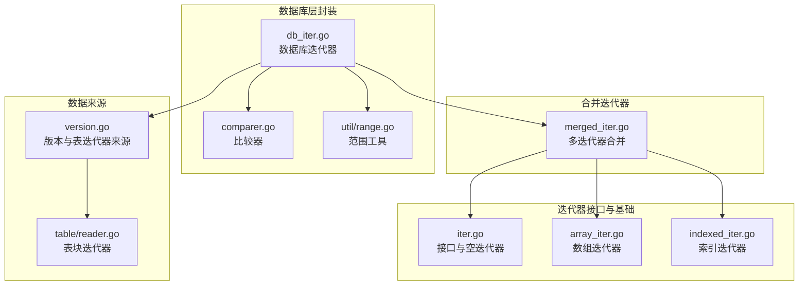
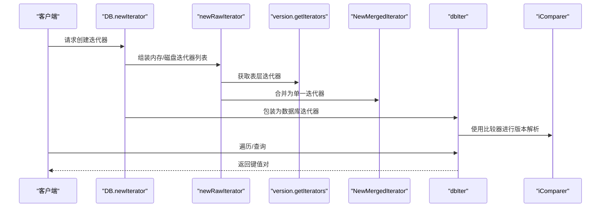
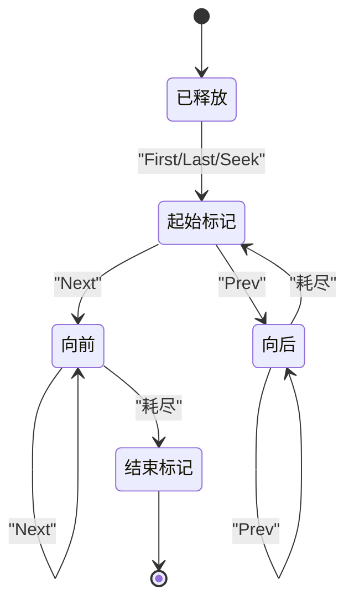
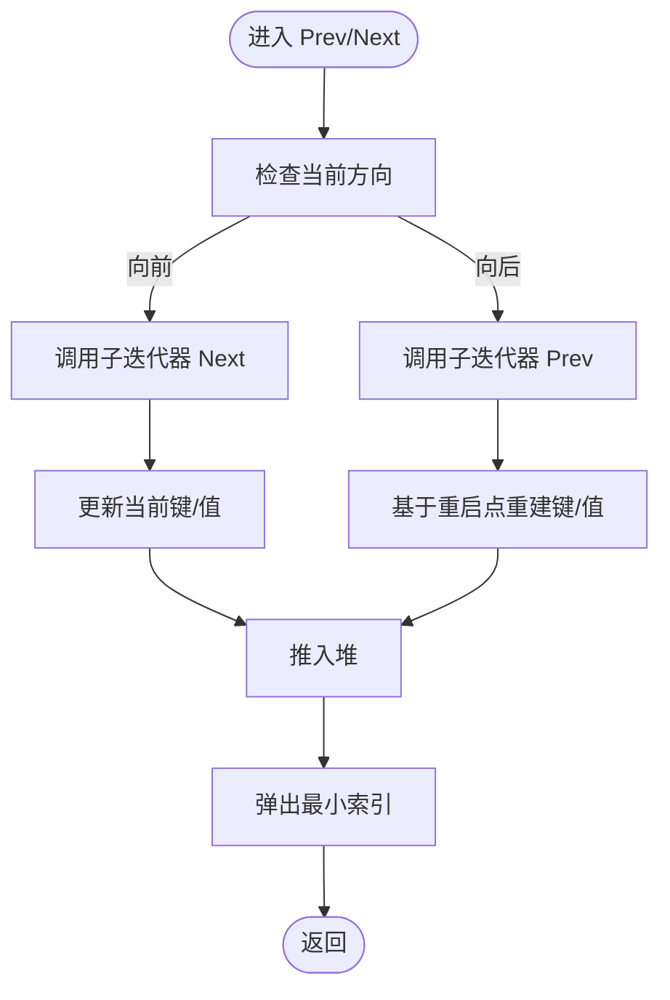
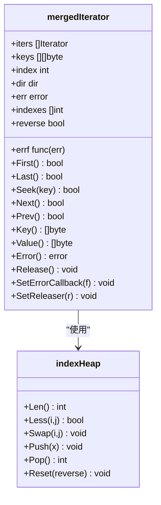
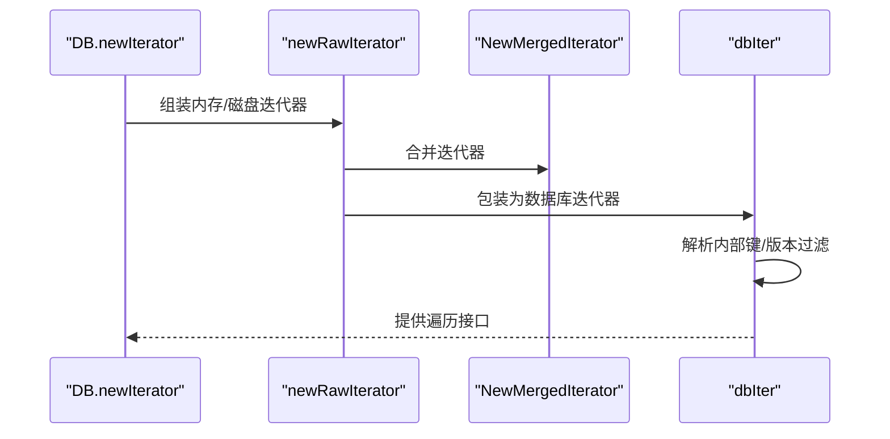
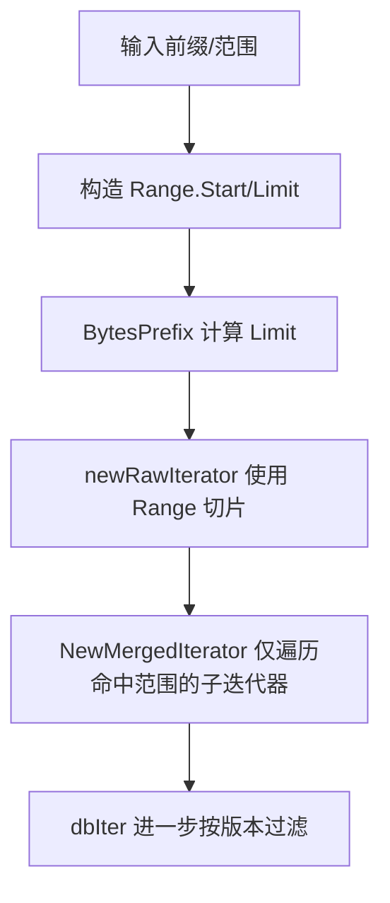
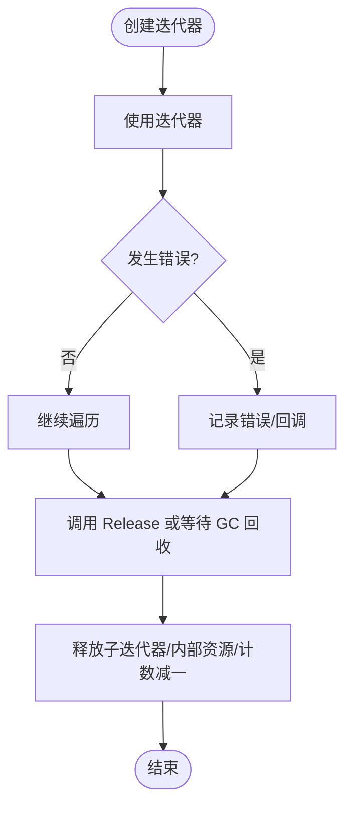
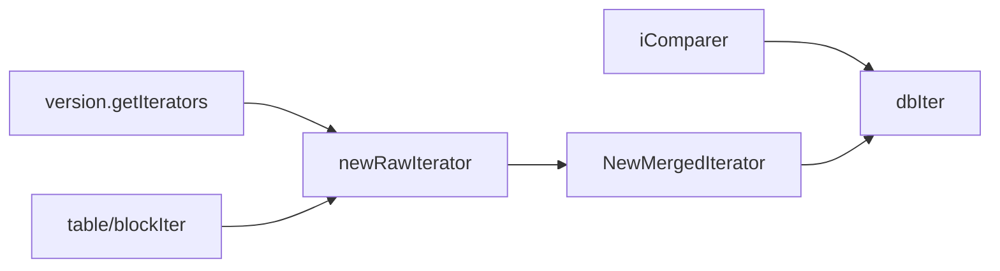

# 迭代器性能优化

<cite>
**本文引用的文件列表**
- [leveldb/iterator/iter.go](file://leveldb/iterator/iter.go)
- [leveldb/iterator/merged_iter.go](file://leveldb/iterator/merged_iter.go)
- [leveldb/iterator/array_iter.go](file://leveldb/iterator/array_iter.go)
- [leveldb/iterator/indexed_iter.go](file://leveldb/iterator/indexed_iter.go)
- [leveldb/db_iter.go](file://leveldb/db_iter.go)
- [leveldb/comparer.go](file://leveldb/comparer.go)
- [leveldb/util/range.go](file://leveldb/util/range.go)
- [leveldb/version.go](file://leveldb/version.go)
- [leveldb/table/reader.go](file://leveldb/table/reader.go)
- [leveldb/iterator/merged_iter_test.go](file://leveldb/iterator/merged_iter_test.go)
- [leveldb/testutil/iter.go](file://leveldb/testutil/iter.go)
</cite>

## 目录
1. [引言](#引言)
2. [项目结构](#项目结构)
3. [核心组件](#核心组件)
4. [架构总览](#架构总览)
5. [详细组件分析](#详细组件分析)
6. [依赖关系分析](#依赖关系分析)
7. [性能考量](#性能考量)
8. [故障排查指南](#故障排查指南)
9. [结论](#结论)
10. [附录](#附录)

## 引言
本文件围绕 avccDB 的迭代器体系，系统阐述以下主题：
- iter.go 中迭代器接口与状态机设计
- merged_iter.go 中多迭代器合并的堆式选择与方向控制
- 跨层级（内存与磁盘）一致性遍历的实现思路
- 范围查询最佳实践与边界条件设置
- 资源管理与生命周期控制、错误处理与自动释放策略
- 数据库层 db_iter.go 如何封装与调度底层迭代器

## 项目结构
与迭代器相关的代码主要分布在以下模块：
- 接口与通用实现：leveldb/iterator/iter.go
- 多迭代器合并：leveldb/iterator/merged_iter.go
- 基础数组迭代器：leveldb/iterator/array_iter.go
- 索引迭代器：leveldb/iterator/indexed_iter.go
- 数据库层迭代器封装：leveldb/db_iter.go
- 比较器与键解析：leveldb/comparer.go
- 范围工具：leveldb/util/range.go
- 版本与表迭代器来源：leveldb/version.go
- 表块迭代器（磁盘层）：leveldb/table/reader.go
- 测试与基准：leveldb/iterator/merged_iter_test.go、leveldb/testutil/iter.go

图表来源
- [leveldb/iterator/iter.go](file://leveldb/iterator/iter.go#L1-L133)
- [leveldb/iterator/merged_iter.go](file://leveldb/iterator/merged_iter.go#L1-L351)
- [leveldb/iterator/array_iter.go](file://leveldb/iterator/array_iter.go#L1-L182)
- [leveldb/iterator/indexed_iter.go](file://leveldb/iterator/indexed_iter.go#L1-L242)
- [leveldb/db_iter.go](file://leveldb/db_iter.go#L1-L393)
- [leveldb/comparer.go](file://leveldb/comparer.go#L1-L122)
- [leveldb/util/range.go](file://leveldb/util/range.go#L1-L33)
- [leveldb/version.go](file://leveldb/version.go#L1-L200)
- [leveldb/table/reader.go](file://leveldb/table/reader.go#L312-L370)

章节来源
- [leveldb/iterator/iter.go](file://leveldb/iterator/iter.go#L1-L133)
- [leveldb/iterator/merged_iter.go](file://leveldb/iterator/merged_iter.go#L1-L351)
- [leveldb/db_iter.go](file://leveldb/db_iter.go#L1-L393)

## 核心组件
- 迭代器接口族：定义统一的遍历能力与资源释放契约
- 合并迭代器：基于堆的多路归并，支持严格模式下的错误传播
- 数组迭代器：面向有序数组的快速遍历
- 索引迭代器：按索引逐段返回数据迭代器
- 数据库迭代器：对底层迭代器进行版本过滤与采样
- 比较器：用户键比较与内部键解析
- 范围工具：前缀范围构造与边界计算

章节来源
- [leveldb/iterator/iter.go](file://leveldb/iterator/iter.go#L21-L133)
- [leveldb/iterator/merged_iter.go](file://leveldb/iterator/merged_iter.go#L17-L61)
- [leveldb/iterator/array_iter.go](file://leveldb/iterator/array_iter.go#L13-L182)
- [leveldb/iterator/indexed_iter.go](file://leveldb/iterator/indexed_iter.go#L14-L242)
- [leveldb/db_iter.go](file://leveldb/db_iter.go#L97-L122)
- [leveldb/comparer.go](file://leveldb/comparer.go#L13-L122)
- [leveldb/util/range.go](file://leveldb/util/range.go#L9-L33)

## 架构总览
数据库层通过版本系统收集来自内存与磁盘的多个迭代器，使用合并迭代器将它们按全局顺序输出；数据库迭代器在合并结果上再做版本过滤与采样，最终对外提供一致的遍历视图。

图表来源
- [leveldb/db_iter.go](file://leveldb/db_iter.go#L31-L61)
- [leveldb/db_iter.go](file://leveldb/db_iter.go#L63-L91)
- [leveldb/version.go](file://leveldb/version.go#L91-L140)
- [leveldb/iterator/merged_iter.go](file://leveldb/iterator/merged_iter.go#L299-L318)
- [leveldb/comparer.go](file://leveldb/comparer.go#L33-L101)

## 详细组件分析

### 状态机与方向控制（dirForward/dirBackward）
- merged_iter.go 定义了方向枚举：已释放、起止标记、向前、向后，并在关键方法中维护该状态，确保遍历过程的确定性与边界处理。
- db_iter.go 采用相同的枚举类型，用于数据库层迭代器的状态推进与边界判断。
- 方向状态贯穿 First/Last/Seek/Next/Prev，避免重复初始化与无效操作。

图表来源
- [leveldb/iterator/merged_iter.go](file://leveldb/iterator/merged_iter.go#L17-L26)
- [leveldb/db_iter.go](file://leveldb/db_iter.go#L97-L106)

章节来源
- [leveldb/iterator/merged_iter.go](file://leveldb/iterator/merged_iter.go#L17-L26)
- [leveldb/db_iter.go](file://leveldb/db_iter.go#L97-L106)

### 偏移量管理机制
- 表块迭代器在反向移动时，利用重启点与缓存记录 prevNode、prevKeys 等，通过 offset 与 restartIndex 精确回退到上一个重启点或中间项，减少重复解码。
- 这种机制在 merged_iter 的 prev/Next 循环中配合堆式选择，避免对每个子迭代器执行全量扫描。

图表来源
- [leveldb/iterator/merged_iter.go](file://leveldb/iterator/merged_iter.go#L145-L187)
- [leveldb/iterator/merged_iter.go](file://leveldb/iterator/merged_iter.go#L189-L245)
- [leveldb/table/reader.go](file://leveldb/table/reader.go#L312-L370)

章节来源
- [leveldb/iterator/merged_iter.go](file://leveldb/iterator/merged_iter.go#L145-L245)
- [leveldb/table/reader.go](file://leveldb/table/reader.go#L312-L370)

### 合并迭代器（多路归并）
- 堆式选择：indexHeap 实现堆接口，按比较器排序各子迭代器当前位置的键，每次弹出最小者作为当前输出。
- 错误传播：iterErr 在子迭代器报错时根据严格模式决定是否中断；SetErrorCallback 可将错误回调给上层。
- 生命周期：Release 会释放所有子迭代器并清理资源；SetReleaser 支持附加释放器。

图表来源
- [leveldb/iterator/merged_iter.go](file://leveldb/iterator/merged_iter.go#L27-L61)
- [leveldb/iterator/merged_iter.go](file://leveldb/iterator/merged_iter.go#L299-L351)

章节来源
- [leveldb/iterator/merged_iter.go](file://leveldb/iterator/merged_iter.go#L63-L117)
- [leveldb/iterator/merged_iter.go](file://leveldb/iterator/merged_iter.go#L119-L187)
- [leveldb/iterator/merged_iter.go](file://leveldb/iterator/merged_iter.go#L189-L245)
- [leveldb/iterator/merged_iter.go](file://leveldb/iterator/merged_iter.go#L261-L294)
- [leveldb/iterator/merged_iter.go](file://leveldb/iterator/merged_iter.go#L299-L351)

### 数据库层迭代器封装与调度
- dbIter 将底层迭代器包装为带版本语义的迭代器，负责：
  - 内部键解析与版本过滤（仅返回小于等于目标序列号的最新可见版本）
  - 正向/反向遍历的边界与状态推进
  - 采样策略（按随机间隔触发采样，降低开销）
  - 资源释放与存活计数
- newRawIterator 从版本系统与内存层收集迭代器，构建合并迭代器并设置版本释放器。

图表来源
- [leveldb/db_iter.go](file://leveldb/db_iter.go#L31-L61)
- [leveldb/db_iter.go](file://leveldb/db_iter.go#L63-L91)
- [leveldb/db_iter.go](file://leveldb/db_iter.go#L149-L244)
- [leveldb/db_iter.go](file://leveldb/db_iter.go#L246-L344)

章节来源
- [leveldb/db_iter.go](file://leveldb/db_iter.go#L31-L61)
- [leveldb/db_iter.go](file://leveldb/db_iter.go#L63-L91)
- [leveldb/db_iter.go](file://leveldb/db_iter.go#L149-L344)

### 范围查询最佳实践
- 使用 util.Range 设置 Start/Limit 边界，Limit 不包含在范围内，可有效缩小扫描范围。
- 对于前缀查询，使用 BytesPrefix 构造范围，能精确覆盖前缀区间。
- 在数据库层，db_iter 会将外部请求键转换为内部键（含序列号与类型），确保范围查询与版本语义一致。

图表来源
- [leveldb/util/range.go](file://leveldb/util/range.go#L9-L33)
- [leveldb/db_iter.go](file://leveldb/db_iter.go#L63-L74)
- [leveldb/version.go](file://leveldb/version.go#L91-L140)

章节来源
- [leveldb/util/range.go](file://leveldb/util/range.go#L9-L33)
- [leveldb/db_iter.go](file://leveldb/db_iter.go#L63-L74)
- [leveldb/version.go](file://leveldb/version.go#L91-L140)

### 资源管理与生命周期控制
- 迭代器接口统一支持 Release 与 SetReleaser，确保资源及时回收。
- merged_iter.Release 会释放所有子迭代器并清空内部结构；dbIter.Release 清理自身状态并减少存活计数。
- emptyIterator 在释放后返回特定错误，防止重复使用。
- finalizer 与原子计数用于检测泄漏与保证释放。

图表来源
- [leveldb/iterator/iter.go](file://leveldb/iterator/iter.go#L107-L133)
- [leveldb/iterator/merged_iter.go](file://leveldb/iterator/merged_iter.go#L261-L294)
- [leveldb/db_iter.go](file://leveldb/db_iter.go#L360-L393)

章节来源
- [leveldb/iterator/iter.go](file://leveldb/iterator/iter.go#L107-L133)
- [leveldb/iterator/merged_iter.go](file://leveldb/iterator/merged_iter.go#L261-L294)
- [leveldb/db_iter.go](file://leveldb/db_iter.go#L360-L393)

## 依赖关系分析
- 比较器 iComparer 负责内部键解析与比较，确保版本与用户键的正确排序。
- 版本系统 version 提供表层迭代器集合，newRawIterator 将内存与磁盘迭代器统一纳入合并。
- 表块迭代器 table/blockIter 通过重启点与缓存实现高效的反向遍历与偏移管理。

图表来源
- [leveldb/comparer.go](file://leveldb/comparer.go#L33-L101)
- [leveldb/version.go](file://leveldb/version.go#L91-L140)
- [leveldb/db_iter.go](file://leveldb/db_iter.go#L31-L61)
- [leveldb/iterator/merged_iter.go](file://leveldb/iterator/merged_iter.go#L299-L318)

章节来源
- [leveldb/comparer.go](file://leveldb/comparer.go#L33-L101)
- [leveldb/version.go](file://leveldb/version.go#L91-L140)
- [leveldb/db_iter.go](file://leveldb/db_iter.go#L31-L61)
- [leveldb/iterator/merged_iter.go](file://leveldb/iterator/merged_iter.go#L299-L318)

## 性能考量
- 多路归并的堆式选择将复杂度控制在 O(log k) 每步（k 为子迭代器数量），适合跨层级合并。
- 表块迭代器的重启点与缓存避免了重复解码，显著降低反向遍历成本。
- 数据库层的采样策略按随机间隔触发，平衡遍历开销与统计准确性。
- 范围切片与前缀范围能有效缩小扫描窗口，减少不必要的 IO 与 CPU 开销。
- 严格模式下错误快速传播，避免无意义的后续遍历。

[本节为通用性能讨论，不直接分析具体文件]

## 故障排查指南
- 常见错误来源
  - 子迭代器错误：merged_iter.iterErr 根据严格模式决定是否中断；可通过 SetErrorCallback 获取错误回调。
  - 释放后使用：emptyIterator 与 dbIter/merged_iter 在释放后访问会返回特定错误，应避免重复使用。
  - 范围不匹配：Range 的 Limit 不包含在内，若出现“越界”现象需检查边界设置。
- 调试建议
  - 使用测试工具链验证遍历行为与边界（参考测试工具与基准）。
  - 关注 Finalizer 与 aliveIters 计数，确认迭代器被正确释放。
  - 在严格模式下观察错误传播路径，定位问题来源。

章节来源
- [leveldb/iterator/merged_iter.go](file://leveldb/iterator/merged_iter.go#L50-L61)
- [leveldb/iterator/merged_iter.go](file://leveldb/iterator/merged_iter.go#L291-L294)
- [leveldb/iterator/iter.go](file://leveldb/iterator/iter.go#L107-L133)
- [leveldb/db_iter.go](file://leveldb/db_iter.go#L360-L393)
- [leveldb/testutil/iter.go](file://leveldb/testutil/iter.go#L1-L328)

## 结论
- 状态机与方向控制确保遍历过程的确定性与边界安全。
- 堆式多路归并与重启点缓存共同实现了跨层级的一致性高效遍历。
- 范围查询与严格模式相结合，既能精准限定扫描范围，又能可靠处理异常。
- 完备的资源管理与错误处理机制，保障迭代器生命周期可控、避免泄漏。

[本节为总结，不直接分析具体文件]

## 附录
- 测试与基准参考
  - 合并迭代器测试与基准：验证正确性与性能
  - 迭代器测试工具：覆盖 First/Last/Next/Prev/Seek 等动作序列
  - 并发迭代器测试：验证多线程安全性

章节来源
- [leveldb/iterator/merged_iter_test.go](file://leveldb/iterator/merged_iter_test.go#L1-L82)
- [leveldb/testutil/iter.go](file://leveldb/testutil/iter.go#L1-L328)