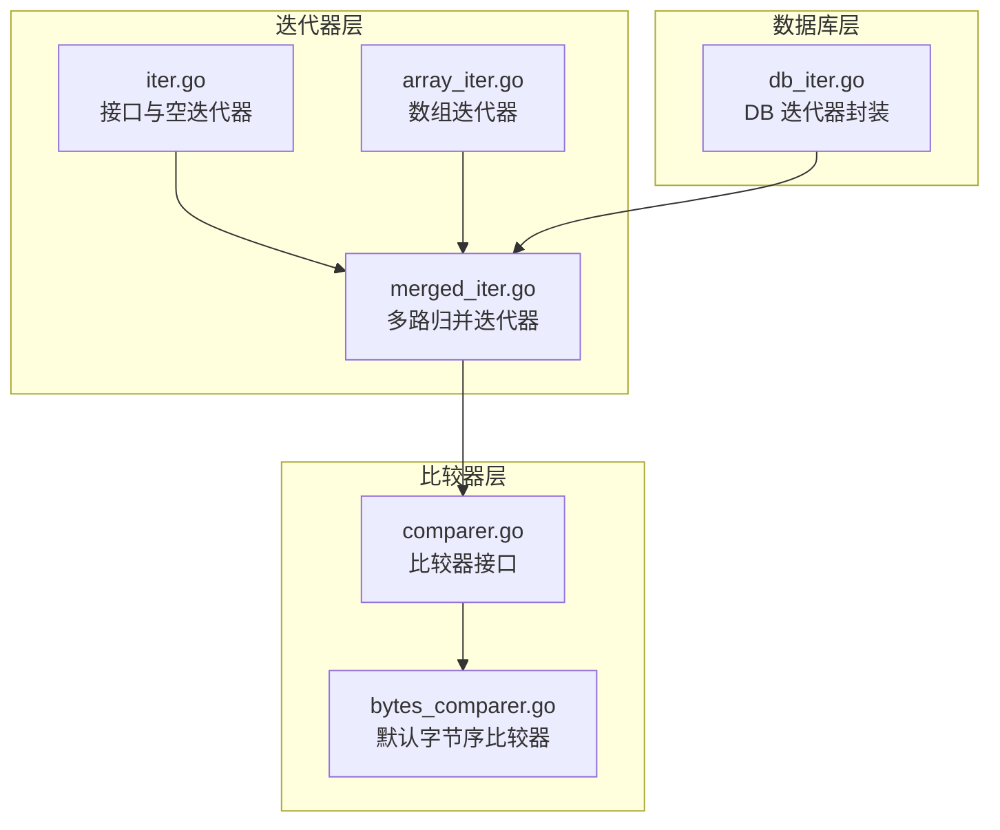
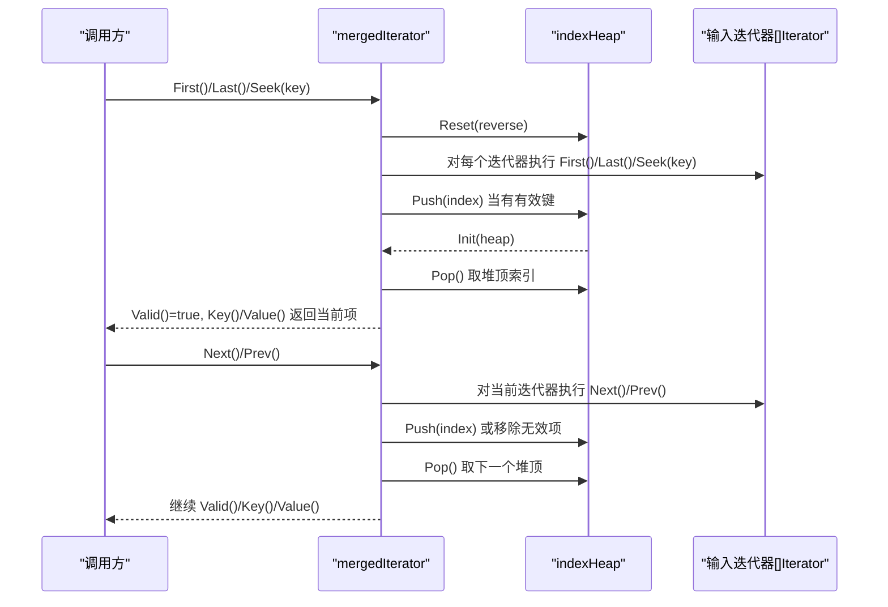
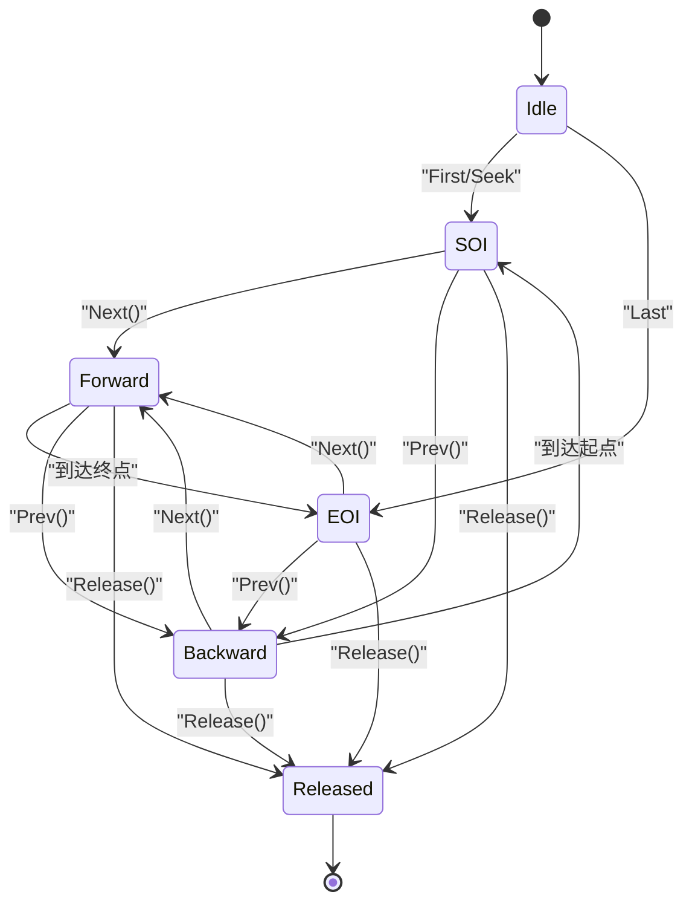
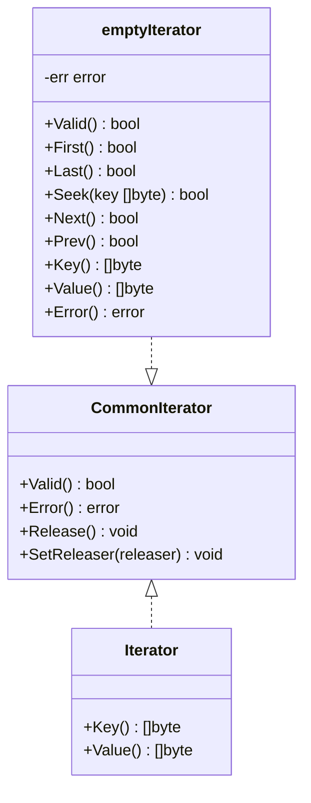
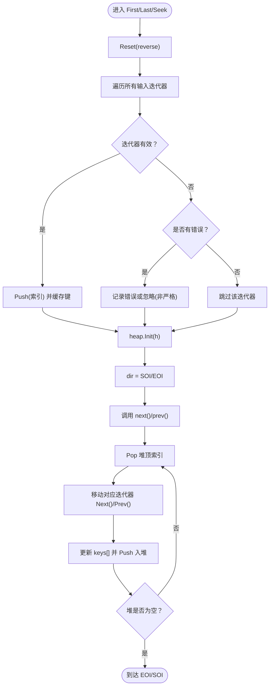
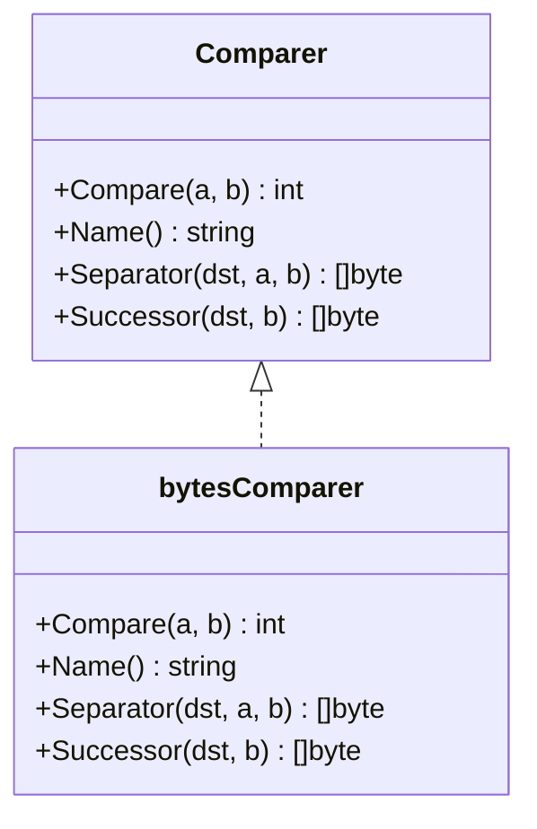
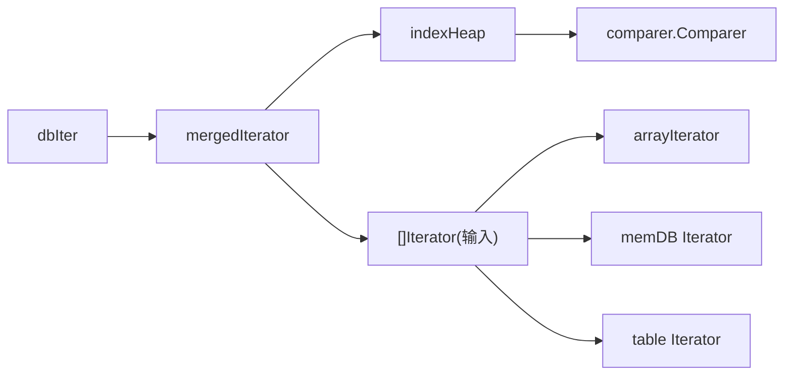

# 迭代器核心机制

<cite>
**本文引用的文件**
- [leveldb/iterator/iter.go](file://leveldb/iterator/iter.go)
- [leveldb/iterator/merged_iter.go](file://leveldb/iterator/merged_iter.go)
- [leveldb/comparer/comparer.go](file://leveldb/comparer/comparer.go)
- [leveldb/comparer/bytes_comparer.go](file://leveldb/comparer/bytes_comparer.go)
- [leveldb/iterator/array_iter.go](file://leveldb/iterator/array_iter.go)
- [leveldb/db_iter.go](file://leveldb/db_iter.go)
- [leveldb/iterator/merged_iter_test.go](file://leveldb/iterator/merged_iter_test.go)
</cite>

## 目录
1. [引言](#引言)
2. [项目结构](#项目结构)
3. [核心组件](#核心组件)
4. [架构总览](#架构总览)
5. [详细组件分析](#详细组件分析)
6. [依赖关系分析](#依赖关系分析)
7. [性能考量](#性能考量)
8. [故障排查指南](#故障排查指南)
9. [结论](#结论)

## 引言
本文件聚焦于 avccDB 的迭代器子系统，特别是迭代器状态机与多路归并的设计。我们将深入解析：
- dir 枚举类型（dirForward/dirBackward/dirSOI/dirEOI）在控制遍历方向与位置中的作用
- iter.go 中 Iterator 接口的 Valid()/Error()/Release() 等方法的契约规范，以及 emptyIterator 的错误传播机制
- merged_iter.go 中 mergedIterator 如何利用 container/heap 实现多路归并，indexHeap 的 Less 方法如何结合 comparer.Comparer 确保跨层级数据有序性
- First/Last/Seek 在 mergedIterator 中的初始化流程，以及 next()/prev() 如何维护堆结构以实现高效数据流合并

## 项目结构
本次文档关注的迭代器相关代码主要位于 leveldb/iterator 目录，并与 comparer、db 层的迭代器封装协同工作。

图表来源
- [leveldb/iterator/iter.go](file://leveldb/iterator/iter.go#L1-L133)
- [leveldb/iterator/merged_iter.go](file://leveldb/iterator/merged_iter.go#L1-L351)
- [leveldb/comparer/comparer.go](file://leveldb/comparer/comparer.go#L1-L58)
- [leveldb/comparer/bytes_comparer.go](file://leveldb/comparer/bytes_comparer.go#L1-L52)
- [leveldb/iterator/array_iter.go](file://leveldb/iterator/array_iter.go#L1-L182)
- [leveldb/db_iter.go](file://leveldb/db_iter.go#L1-L393)

章节来源
- [leveldb/iterator/iter.go](file://leveldb/iterator/iter.go#L1-L133)
- [leveldb/iterator/merged_iter.go](file://leveldb/iterator/merged_iter.go#L1-L351)
- [leveldb/comparer/comparer.go](file://leveldb/comparer/comparer.go#L1-L58)
- [leveldb/comparer/bytes_comparer.go](file://leveldb/comparer/bytes_comparer.go#L1-L52)
- [leveldb/iterator/array_iter.go](file://leveldb/iterator/array_iter.go#L1-L182)
- [leveldb/db_iter.go](file://leveldb/db_iter.go#L1-L393)

## 核心组件
- 迭代器接口族：IteratorSeeker/CommonIterator/Iterator 定义了统一的遍历能力与资源释放契约
- emptyIterator：提供一个“空”迭代器，用于占位或错误传播
- mergedIterator：基于堆的多路归并，按比较器顺序输出键值对
- indexHeap：作为 container/heap.Interface 的实现，驱动堆的比较逻辑
- bytesComparer：默认的字节序比较器，提供 Compare/Separator/Successor 能力

章节来源
- [leveldb/iterator/iter.go](file://leveldb/iterator/iter.go#L21-L133)
- [leveldb/iterator/merged_iter.go](file://leveldb/iterator/merged_iter.go#L17-L41)
- [leveldb/comparer/bytes_comparer.go](file://leveldb/comparer/bytes_comparer.go#L1-L52)

## 架构总览
mergedIterator 将多个底层 Iterator 输入合并为单一有序序列。其核心是使用 container/heap 维护“当前最小候选”的索引集合，每次弹出堆顶元素即为下一步输出。比较器 comparer.Comparer 决定堆的排序关系；dir 枚举型状态机控制遍历方向与边界（SOI/EOI），并避免无效调用。

图表来源
- [leveldb/iterator/merged_iter.go](file://leveldb/iterator/merged_iter.go#L63-L187)
- [leveldb/iterator/merged_iter.go](file://leveldb/iterator/merged_iter.go#L189-L245)
- [leveldb/iterator/merged_iter.go](file://leveldb/iterator/merged_iter.go#L295-L351)

## 详细组件分析

### 状态机与 dir 枚举
mergedIterator 使用 dir 枚举型状态机管理遍历方向与边界：
- dirSOI：起始边界（Start of Iteration）
- dirEOI：结束边界（End of Iteration）
- dirForward：正向移动
- dirBackward：反向移动
- dirReleased：已释放

这些状态贯穿 First/Last/Seek/Next/Prev 的入口检查与边界处理，确保：
- 在 EOI/SOI 边界时不会继续推进
- 已释放状态下访问会返回错误
- Prev/Next 在不同方向下采用不同的初始化策略

图表来源
- [leveldb/iterator/merged_iter.go](file://leveldb/iterator/merged_iter.go#L17-L25)
- [leveldb/iterator/merged_iter.go](file://leveldb/iterator/merged_iter.go#L63-L91)
- [leveldb/iterator/merged_iter.go](file://leveldb/iterator/merged_iter.go#L93-L117)
- [leveldb/iterator/merged_iter.go](file://leveldb/iterator/merged_iter.go#L119-L143)
- [leveldb/iterator/merged_iter.go](file://leveldb/iterator/merged_iter.go#L156-L187)
- [leveldb/iterator/merged_iter.go](file://leveldb/iterator/merged_iter.go#L189-L245)
- [leveldb/iterator/merged_iter.go](file://leveldb/iterator/merged_iter.go#L261-L275)

章节来源
- [leveldb/iterator/merged_iter.go](file://leveldb/iterator/merged_iter.go#L17-L25)
- [leveldb/iterator/merged_iter.go](file://leveldb/iterator/merged_iter.go#L63-L91)
- [leveldb/iterator/merged_iter.go](file://leveldb/iterator/merged_iter.go#L93-L117)
- [leveldb/iterator/merged_iter.go](file://leveldb/iterator/merged_iter.go#L119-L143)
- [leveldb/iterator/merged_iter.go](file://leveldb/iterator/merged_iter.go#L156-L187)
- [leveldb/iterator/merged_iter.go](file://leveldb/iterator/merged_iter.go#L189-L245)
- [leveldb/iterator/merged_iter.go](file://leveldb/iterator/merged_iter.go#L261-L275)

### 接口契约与 emptyIterator 错误传播
Iterator 接口族定义了统一的遍历与资源释放契约：
- Valid()/Key()/Value()：当前项有效性与读取
- First()/Last()/Seek()/Next()/Prev()：定位与推进
- Error()：累积错误查询
- Release()/SetReleaser()/SetErrorCallback()：资源释放与回调设置

emptyIterator 提供一个“空”迭代器，当被访问时会触发错误传播：
- 若已释放，则返回 ErrIterReleased
- 所有访问方法均返回 false，并保留错误状态
- Error() 返回累积的错误

图表来源
- [leveldb/iterator/iter.go](file://leveldb/iterator/iter.go#L51-L133)

章节来源
- [leveldb/iterator/iter.go](file://leveldb/iterator/iter.go#L21-L133)

### 多路归并与堆结构：mergedIterator 与 indexHeap
mergedIterator 的核心是“当前最小候选”的堆化管理：
- 每个输入迭代器维护一个当前位置的键缓存 keys[]
- indexHeap 是一个 container/heap.Interface 的实现，存储迭代器索引
- Less 方法通过 comparer.Compare(keys[i], keys[j]) 判定堆序，reverse 控制最大/最小堆
- Reset(reverse) 重置堆方向与容量，Init 后堆顶即为当前最小键

初始化流程（First/Last/Seek）：
- 针对每个输入迭代器执行 First()/Last()/Seek(key)
- 若迭代器有效则将索引入堆，否则记录错误或忽略
- heap.Init(h) 完成堆化
- dir 置为 SOI/EOI，随后调用 next()/prev() 获取首个有效项

推进流程（Next/Prev）：
- Next：弹出堆顶，移动对应迭代器到下一位置，更新 keys[] 并重新入堆
- Prev：在 EOI 方向时，需要重新计算堆以保证“前一项”正确；弹出堆顶后移动对应迭代器到上一位置，更新 keys[] 并重新入堆

图表来源
- [leveldb/iterator/merged_iter.go](file://leveldb/iterator/merged_iter.go#L63-L91)
- [leveldb/iterator/merged_iter.go](file://leveldb/iterator/merged_iter.go#L93-L117)
- [leveldb/iterator/merged_iter.go](file://leveldb/iterator/merged_iter.go#L119-L143)
- [leveldb/iterator/merged_iter.go](file://leveldb/iterator/merged_iter.go#L145-L187)
- [leveldb/iterator/merged_iter.go](file://leveldb/iterator/merged_iter.go#L189-L245)
- [leveldb/iterator/merged_iter.go](file://leveldb/iterator/merged_iter.go#L295-L351)

章节来源
- [leveldb/iterator/merged_iter.go](file://leveldb/iterator/merged_iter.go#L17-L41)
- [leveldb/iterator/merged_iter.go](file://leveldb/iterator/merged_iter.go#L63-L187)
- [leveldb/iterator/merged_iter.go](file://leveldb/iterator/merged_iter.go#L189-L245)
- [leveldb/iterator/merged_iter.go](file://leveldb/iterator/merged_iter.go#L295-L351)

### 比较器与键序一致性
比较器 comparer.Comparer 决定了堆的排序关系：
- Less(i, j) 通过 comparer.Compare(keys[i], keys[j]) 判断
- reverse=true 时为最大堆，false 时为最小堆
- 默认使用 bytesComparer，提供字节序比较与分隔符/后继生成能力

图表来源
- [leveldb/comparer/comparer.go](file://leveldb/comparer/comparer.go#L1-L58)
- [leveldb/comparer/bytes_comparer.go](file://leveldb/comparer/bytes_comparer.go#L1-L52)

章节来源
- [leveldb/comparer/comparer.go](file://leveldb/comparer/comparer.go#L1-L58)
- [leveldb/comparer/bytes_comparer.go](file://leveldb/comparer/bytes_comparer.go#L1-L52)

### 与数组迭代器的协作
数组迭代器 arrayIterator 作为输入之一参与多路归并：
- 支持 First/Last/Seek/Next/Prev 的基本遍历
- Key()/Value() 返回当前项，内部通过数组索引更新键值
- 与 mergedIterator 的 keys[] 缓存配合，形成稳定的堆比较基础

章节来源
- [leveldb/iterator/array_iter.go](file://leveldb/iterator/array_iter.go#L1-L182)

### 数据库层迭代器封装
dbIter 在 mergedIterator 之上进一步封装：
- 将内部键转换为对外可见的用户键，过滤版本信息与删除标记
- 保持与 mergedIterator 相同的状态机 dir（SOI/EOI/Forward/Backward/Released）
- 通过 Strict 模式决定是否传播底层错误

章节来源
- [leveldb/db_iter.go](file://leveldb/db_iter.go#L97-L106)
- [leveldb/db_iter.go](file://leveldb/db_iter.go#L149-L184)
- [leveldb/db_iter.go](file://leveldb/db_iter.go#L186-L202)
- [leveldb/db_iter.go](file://leveldb/db_iter.go#L204-L244)
- [leveldb/db_iter.go](file://leveldb/db_iter.go#L246-L304)
- [leveldb/db_iter.go](file://leveldb/db_iter.go#L346-L393)

## 依赖关系分析
- mergedIterator 依赖 comparer.Comparer 进行键比较
- indexHeap 作为 container/heap.Interface 的具体实现，依赖 comparer.Compare 与 reverse 控制堆方向
- mergedIterator 依赖多个底层 Iterator 输入，这些输入可能来自内存表、磁盘表、数组等
- dbIter 在 DB 层对 mergedIterator 进行二次封装，增加版本解析与过滤

图表来源
- [leveldb/iterator/merged_iter.go](file://leveldb/iterator/merged_iter.go#L295-L351)
- [leveldb/comparer/comparer.go](file://leveldb/comparer/comparer.go#L1-L58)
- [leveldb/iterator/array_iter.go](file://leveldb/iterator/array_iter.go#L1-L182)
- [leveldb/db_iter.go](file://leveldb/db_iter.go#L31-L61)

章节来源
- [leveldb/iterator/merged_iter.go](file://leveldb/iterator/merged_iter.go#L295-L351)
- [leveldb/comparer/comparer.go](file://leveldb/comparer/comparer.go#L1-L58)
- [leveldb/iterator/array_iter.go](file://leveldb/iterator/array_iter.go#L1-L182)
- [leveldb/db_iter.go](file://leveldb/db_iter.go#L31-L61)

## 性能考量
- 时间复杂度
  - 初始化：O(k log k)，k 为活跃输入迭代器数量（堆化）
  - 每次推进：O(log k)，包含一次 Pop/Push
  - 整体遍历：O(N log k)，N 为总键数
- 空间复杂度
  - keys[] 缓存：O(k)
  - indexHeap：O(k)
- 优化建议
  - 减少无效输入：在构造 mergedIterator 前剔除空迭代器
  - 选择合适的比较器：默认字节序比较器通常足够高效
  - 严格模式：strict=true 时遇到底层错误立即停止，避免无意义的推进

[本节为通用性能讨论，不直接分析具体文件]

## 故障排查指南
- 访问已释放迭代器
  - 现象：返回 false，Error() 返回 ErrIterReleased
  - 排查：确认 Release() 是否被提前调用
  - 参考路径：[leveldb/iterator/merged_iter.go](file://leveldb/iterator/merged_iter.go#L261-L275)、[leveldb/iterator/iter.go](file://leveldb/iterator/iter.go#L107-L133)
- 底层迭代器错误传播
  - 现象：iter.Error() 非空，后续操作返回 false
  - 排查：检查 strict 模式与错误类型（如 IsCorrupted）
  - 参考路径：[leveldb/iterator/merged_iter.go](file://leveldb/iterator/merged_iter.go#L50-L61)
- 归并结果异常
  - 现象：键序错乱或重复
  - 排查：确认 comparer.Compare 行为与 keys[] 更新逻辑
  - 参考路径：[leveldb/iterator/merged_iter.go](file://leveldb/iterator/merged_iter.go#L323-L330)
- 边界行为
  - 现象：在 EOI/SOI 边界仍推进
  - 排查：检查 dir 状态与 next()/prev() 的返回值
  - 参考路径：[leveldb/iterator/merged_iter.go](file://leveldb/iterator/merged_iter.go#L63-L91)、[leveldb/iterator/merged_iter.go](file://leveldb/iterator/merged_iter.go#L189-L217)

章节来源
- [leveldb/iterator/merged_iter.go](file://leveldb/iterator/merged_iter.go#L50-L61)
- [leveldb/iterator/merged_iter.go](file://leveldb/iterator/merged_iter.go#L63-L91)
- [leveldb/iterator/merged_iter.go](file://leveldb/iterator/merged_iter.go#L189-L217)
- [leveldb/iterator/merged_iter.go](file://leveldb/iterator/merged_iter.go#L261-L275)
- [leveldb/iterator/iter.go](file://leveldb/iterator/iter.go#L107-L133)

## 结论
mergedIterator 通过 dir 状态机与 container/heap 的组合，实现了高效的多路归并。dir 枚举型状态机清晰地刻画了遍历方向与边界，避免了无效调用与竞态；indexHeap 的 Less 方法借助 comparer.Comparer 保证了跨层级数据的全局有序性。在 First/Last/Seek 初始化阶段完成堆化，在 Next/Prev 推进阶段维持堆结构，整体时间复杂度与可维护性达到良好平衡。结合 emptyIterator 的错误传播与 dbIter 的版本解析封装，形成了从底层到高层的一致迭代体验。