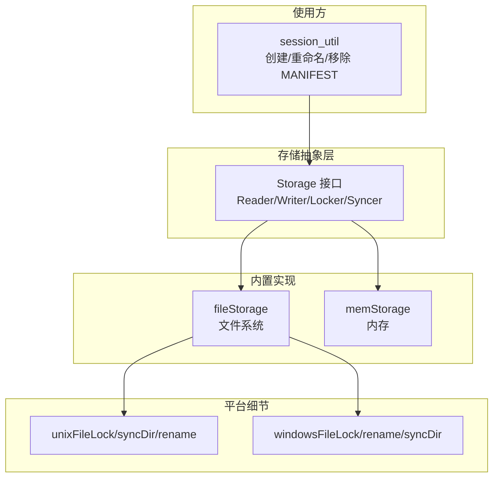
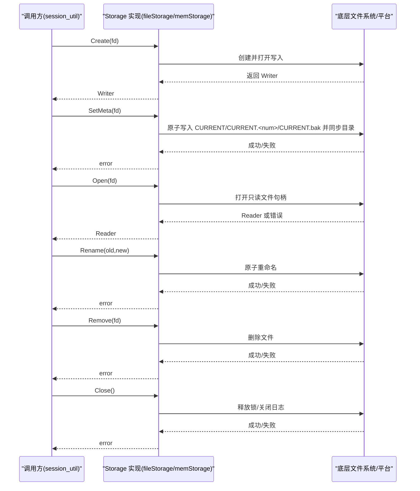
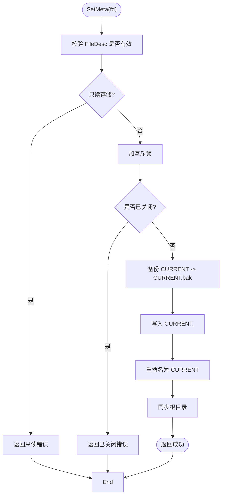
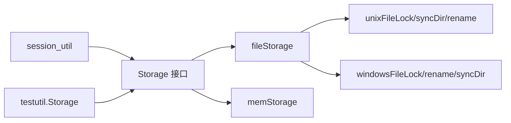

# 存储后端扩展

<cite>
**本文引用的文件列表**
- [storage.go](file://leveldb/storage/storage.go)
- [file_storage.go](file://leveldb/storage/file_storage.go)
- [mem_storage.go](file://leveldb/storage/mem_storage.go)
- [file_storage_unix.go](file://leveldb/storage/file_storage_unix.go)
- [file_storage_windows.go](file://leveldb/storage/file_storage_windows.go)
- [file_storage_test.go](file://leveldb/storage/file_storage_test.go)
- [mem_storage_test.go](file://leveldb/storage/mem_storage_test.go)
- [storage.go（测试工具）](file://leveldb/testutil/storage.go)
- [session_util.go](file://leveldb/session_util.go)
</cite>

## 目录
1. [简介](#简介)
2. [项目结构](#项目结构)
3. [核心组件](#核心组件)
4. [架构总览](#架构总览)
5. [详细组件分析](#详细组件分析)
6. [依赖关系分析](#依赖关系分析)
7. [性能考量](#性能考量)
8. [故障排查指南](#故障排查指南)
9. [结论](#结论)
10. [附录：自定义存储后端实现要点](#附录自定义存储后端实现要点)

## 简介
本文件面向希望为 avccDB 扩展自定义存储后端的开发者，系统性解析 Storage 接口及其契约，并结合内置的文件系统与内存存储实现，给出可复用的设计模式、并发控制策略、原子性元数据更新流程以及错误处理规范。同时提供基于现有实现的参考路径，帮助你快速实现云存储适配器或加密文件系统等扩展。

## 项目结构
围绕存储后端的核心代码位于 leveldb/storage 目录，包含：
- 接口与通用类型定义：storage.go
- 文件系统存储实现：file_storage.go 及平台特定文件锁与目录同步：file_storage_unix.go、file_storage_windows.go
- 内存存储实现：mem_storage.go
- 单元测试：file_storage_test.go、mem_storage_test.go
- 测试工具包装器：leveldb/testutil/storage.go（用于模拟/统计/节流）
- 使用方集成点：leveldb/session_util.go（会调用 Storage 的 Create/Open/Rename/Remove 等）

图表来源
- [storage.go](file://leveldb/storage/storage.go#L139-L189)
- [file_storage.go](file://leveldb/storage/file_storage.go#L71-L145)
- [mem_storage.go](file://leveldb/storage/mem_storage.go#L34-L60)
- [file_storage_unix.go](file://leveldb/storage/file_storage_unix.go#L17-L61)
- [file_storage_windows.go](file://leveldb/storage/file_storage_windows.go#L24-L76)
- [session_util.go](file://leveldb/session_util.go#L404-L455)

章节来源
- [storage.go](file://leveldb/storage/storage.go#L139-L189)
- [file_storage.go](file://leveldb/storage/file_storage.go#L71-L145)
- [mem_storage.go](file://leveldb/storage/mem_storage.go#L34-L60)
- [file_storage_unix.go](file://leveldb/storage/file_storage_unix.go#L17-L61)
- [file_storage_windows.go](file://leveldb/storage/file_storage_windows.go#L24-L76)
- [session_util.go](file://leveldb/session_util.go#L404-L455)

## 核心组件
- Storage 接口：定义了锁、日志、元数据、文件列举、打开/创建/删除/重命名、关闭等能力，并要求实现对并发安全。
- Reader/Writer/Syncer/Locker：分别封装只读/写入/同步/解锁等最小能力集合，便于组合。
- FileDesc：统一描述文件类型与编号，配合 FileDescOk 校验。
- 常见错误：ErrClosed、ErrLocked、ErrInvalidFile、ErrCorrupted（包装原生 os.ErrNotExist）。

章节来源
- [storage.go](file://leveldb/storage/storage.go#L14-L48)
- [storage.go](file://leveldb/storage/storage.go#L74-L93)
- [storage.go](file://leveldb/storage/storage.go#L100-L138)
- [storage.go](file://leveldb/storage/storage.go#L139-L189)

## 架构总览
Storage 抽象向上提供一致的文件操作语义，向下由具体实现负责平台差异与一致性保证。典型工作流如下：

图表来源
- [file_storage.go](file://leveldb/storage/file_storage.go#L498-L564)
- [file_storage.go](file://leveldb/storage/file_storage.go#L286-L300)
- [file_storage.go](file://leveldb/storage/file_storage.go#L473-L496)
- [mem_storage.go](file://leveldb/storage/mem_storage.go#L111-L131)
- [mem_storage.go](file://leveldb/storage/mem_storage.go#L148-L171)
- [mem_storage.go](file://leveldb/storage/mem_storage.go#L133-L146)
- [session_util.go](file://leveldb/session_util.go#L404-L455)

## 详细组件分析

### Storage 接口方法契约与行为
- Lock
  - 同一存储实例仅允许一个锁持有者；重复加锁应返回锁定错误。
  - 关闭后加锁应返回已关闭错误。
  - 只读存储可返回空锁对象（不阻塞其他读取）。
- Log
  - 日志输出实现可忽略或写入文件/标准输出。
- SetMeta
  - 必须原子性地更新元数据文件，避免中间态导致崩溃恢复时误判。
  - 元数据文件名格式与解析规则见文件名生成/解析函数。
- GetMeta
  - 支持从 CURRENT、CURRENT.<num>（降序）、CURRENT.bak 中选择最新有效元数据。
  - 若目标文件不存在或内容损坏，返回对应错误。
- List
  - 列举指定类型的文件，按名称解析为 FileDesc 并过滤无效项。
- Open
  - 只读打开；若旧文件名存在且当前类型支持回退，尝试打开旧名。
  - 返回已打开计数+1，确保并发安全。
- Create
  - 截断已存在文件并写入打开；返回已打开计数+1。
- Remove
  - 删除新名；若旧名存在且类型支持回退，尝试删除旧名。
- Rename
  - 原子重命名；类型为表文件时支持旧名回退。
- Close
  - 多次调用有效；禁止在关闭后继续使用；释放锁资源。

章节来源
- [storage.go](file://leveldb/storage/storage.go#L139-L189)
- [file_storage.go](file://leveldb/storage/file_storage.go#L147-L161)
- [file_storage.go](file://leveldb/storage/file_storage.go#L302-L446)
- [file_storage.go](file://leveldb/storage/file_storage.go#L448-L471)
- [file_storage.go](file://leveldb/storage/file_storage.go#L473-L517)
- [file_storage.go](file://leveldb/storage/file_storage.go#L519-L564)
- [file_storage.go](file://leveldb/storage/file_storage.go#L565-L582)
- [mem_storage.go](file://leveldb/storage/mem_storage.go#L49-L69)
- [mem_storage.go](file://leveldb/storage/mem_storage.go#L72-L79)
- [mem_storage.go](file://leveldb/storage/mem_storage.go#L81-L91)
- [mem_storage.go](file://leveldb/storage/mem_storage.go#L94-L110)
- [mem_storage.go](file://leveldb/storage/mem_storage.go#L111-L131)
- [mem_storage.go](file://leveldb/storage/mem_storage.go#L133-L146)
- [mem_storage.go](file://leveldb/storage/mem_storage.go#L148-L171)
- [mem_storage.go](file://leveldb/storage/mem_storage.go#L173-L173)

### 文件系统存储实现（fileStorage）
- 锁策略
  - 使用平台文件锁实现进程级互斥；只读模式下返回空锁对象。
- 日志与目录滚动
  - LOG 文件大小阈值触发滚动；目录同步以保证元数据持久化。
- 原子元数据更新
  - 通过 CURRENT.<num> 预提交、备份 CURRENT、替换 CURRENT 并同步根目录，确保崩溃安全。
- 文件名生成/解析
  - 支持新旧文件名映射（表文件类型），兼容历史版本。
- 并发与打开计数
  - 使用互斥锁保护状态；维护打开文件计数，关闭时清理并记录警告。
- Writer 同步
  - Manifest 文件写入后同步父目录，确保元数据落盘。

图表来源
- [file_storage.go](file://leveldb/storage/file_storage.go#L247-L284)
- [file_storage.go](file://leveldb/storage/file_storage.go#L286-L300)
- [file_storage_unix.go](file://leveldb/storage/file_storage_unix.go#L82-L100)
- [file_storage_windows.go](file://leveldb/storage/file_storage_windows.go#L72-L79)

章节来源
- [file_storage.go](file://leveldb/storage/file_storage.go#L247-L284)
- [file_storage.go](file://leveldb/storage/file_storage.go#L286-L300)
- [file_storage.go](file://leveldb/storage/file_storage.go#L584-L620)
- [file_storage_unix.go](file://leveldb/storage/file_storage_unix.go#L82-L100)
- [file_storage_windows.go](file://leveldb/storage/file_storage_windows.go#L72-L79)

### 内存存储实现（memStorage）
- 锁策略
  - 进程内互斥，不允许重复加锁。
- 元数据
  - 直接保存在内存中，GetMeta 为空则返回“不存在”。
- 文件管理
  - 以打包键（类型+编号）索引内存缓冲区；Open/Close 维护打开状态，避免并发重复打开。
- 原子性
  - SetMeta 为单次赋值，无需跨进程持久化，但需保持并发安全。

章节来源
- [mem_storage.go](file://leveldb/storage/mem_storage.go#L34-L60)
- [mem_storage.go](file://leveldb/storage/mem_storage.go#L61-L70)
- [mem_storage.go](file://leveldb/storage/mem_storage.go#L72-L79)
- [mem_storage.go](file://leveldb/storage/mem_storage.go#L94-L110)
- [mem_storage.go](file://leveldb/storage/mem_storage.go#L111-L131)
- [mem_storage.go](file://leveldb/storage/mem_storage.go#L133-L146)
- [mem_storage.go](file://leveldb/storage/mem_storage.go#L148-L171)
- [mem_storage.go](file://leveldb/storage/mem_storage.go#L173-L214)

### Reader/Writer 接口与实现
- Reader
  - 聚合 io.ReadSeeker、io.ReaderAt、io.Closer，满足只读场景。
- Writer
  - 聚合 io.WriteCloser 与 Syncer，满足写入与同步。
- fileWrap
  - 包装底层 os.File，实现 Sync（Manifest 类型额外同步目录）与 Close（维护打开计数与日志）。
- memReader/memWriter
  - 包装 bytes.Reader 与内存缓冲，实现 Close 时更新打开状态。

章节来源
- [storage.go](file://leveldb/storage/storage.go#L80-L93)
- [file_storage.go](file://leveldb/storage/file_storage.go#L584-L620)
- [mem_storage.go](file://leveldb/storage/mem_storage.go#L175-L214)

### 平台差异与文件锁
- Unix/Linux
  - 使用 flock 实现共享/独占锁；目录同步通过打开目录并同步。
- Windows
  - 使用 CreateFile/MoveFileEx 实现锁与重命名；目录同步为空操作。

章节来源
- [file_storage_unix.go](file://leveldb/storage/file_storage_unix.go#L17-L61)
- [file_storage_unix.go](file://leveldb/storage/file_storage_unix.go#L82-L100)
- [file_storage_windows.go](file://leveldb/storage/file_storage_windows.go#L24-L76)

### 使用方集成点（会话管理）
- 新建 MANIFEST 时，先 Create，再写入 Journal，Flush 后进行原子替换与清理。
- 该流程体现了 SetMeta/Rename/Remove 的协作，确保崩溃安全。

章节来源
- [session_util.go](file://leveldb/session_util.go#L404-L455)

## 依赖关系分析
- Storage 接口被上层模块广泛依赖（如会话管理、写入流程）。
- fileStorage 依赖平台文件锁与目录同步实现。
- memStorage 作为测试/演示用途，不依赖平台细节。
- 测试工具 storage.go 提供对 Storage 的包装，便于注入错误、节流与统计。

图表来源
- [storage.go](file://leveldb/storage/storage.go#L139-L189)
- [file_storage.go](file://leveldb/storage/file_storage.go#L71-L145)
- [mem_storage.go](file://leveldb/storage/mem_storage.go#L34-L60)
- [file_storage_unix.go](file://leveldb/storage/file_storage_unix.go#L17-L61)
- [file_storage_windows.go](file://leveldb/storage/file_storage_windows.go#L24-L76)
- [session_util.go](file://leveldb/session_util.go#L404-L455)
- [storage.go（测试工具）](file://leveldb/testutil/storage.go#L246-L346)

章节来源
- [storage.go](file://leveldb/storage/storage.go#L139-L189)
- [file_storage.go](file://leveldb/storage/file_storage.go#L71-L145)
- [mem_storage.go](file://leveldb/storage/mem_storage.go#L34-L60)
- [file_storage_unix.go](file://leveldb/storage/file_storage_unix.go#L17-L61)
- [file_storage_windows.go](file://leveldb/storage/file_storage_windows.go#L24-L76)
- [session_util.go](file://leveldb/session_util.go#L404-L455)
- [storage.go（测试工具）](file://leveldb/testutil/storage.go#L246-L346)

## 性能考量
- 并发控制
  - fileStorage 使用互斥锁保护关键状态（锁、打开计数、元数据读写），避免竞态。
  - memStorage 同样使用互斥锁，适合小规模/测试场景。
- I/O 模式
  - Manifest 写入后同步目录，确保崩溃恢复一致性，但会增加磁盘写放大。
  - Writer 的 Sync 在 Manifest 类型时额外同步目录，注意批量写入时的同步频率。
- 文件名解析
  - List 时对目录内容进行全量扫描与解析，建议在高并发/大目录场景下配合外部缓存策略。
- 测试工具
  - testutil.Storage 提供节流与随机错误注入，可用于评估在异常条件下的稳定性与性能。

章节来源
- [file_storage.go](file://leveldb/storage/file_storage.go#L71-L87)
- [file_storage.go](file://leveldb/storage/file_storage.go#L584-L620)
- [mem_storage.go](file://leveldb/storage/mem_storage.go#L34-L47)
- [storage.go（测试工具）](file://leveldb/testutil/storage.go#L348-L451)
- [storage.go（测试工具）](file://leveldb/testutil/storage.go#L592-L633)

## 故障排查指南
- 常见错误与返回
  - 已关闭：Close 后继续调用方法返回已关闭错误。
  - 锁冲突：重复加锁返回锁定错误；只读存储加锁失败。
  - 文件不存在：Open/Create/Remove/Rename 对不存在文件返回“不存在”错误。
  - 元数据损坏：GetMeta 解析 CURRENT/CURRENT.<num>/CURRENT.bak 时遇到损坏返回损坏错误。
- 定位手段
  - fileStorage 内部日志记录（如重命名、删除、同步目录等）有助于定位问题。
  - testutil.Storage 可注入错误与节流，辅助复现与验证。
- 平台差异
  - Unix/Linux 与 Windows 的文件锁与重命名行为不同，需关注跨平台兼容性。

章节来源
- [storage.go](file://leveldb/storage/storage.go#L43-L48)
- [file_storage.go](file://leveldb/storage/file_storage.go#L147-L161)
- [file_storage.go](file://leveldb/storage/file_storage.go#L302-L446)
- [file_storage.go](file://leveldb/storage/file_storage.go#L473-L564)
- [file_storage.go](file://leveldb/storage/file_storage.go#L565-L582)
- [storage.go（测试工具）](file://leveldb/testutil/storage.go#L348-L451)

## 结论
Storage 接口提供了清晰、稳定的抽象，fileStorage 与 memStorage 分别覆盖了生产与测试场景。通过严格的并发控制、原子性元数据更新与平台差异处理，avccDB 在崩溃恢复与一致性方面具备良好保障。对于自定义存储后端，建议遵循本文的契约与最佳实践，优先保证原子性、线程安全与错误语义的一致性。

## 附录：自定义存储后端实现要点
- 必须实现的方法
  - Lock/Unlock：进程/实例级互斥；重复加锁应返回锁定错误；只读模式可返回空锁。
  - Log：日志输出可为空实现。
  - SetMeta：必须原子性更新元数据文件，参考 fileStorage 的 CURRENT.<num> 预提交与目录同步策略。
  - GetMeta：支持 CURRENT、CURRENT.<num>、CURRENT.bak 的回退解析；目标文件缺失或内容损坏时返回相应错误。
  - List/Open/Create/Remove/Rename：严格校验 FileDesc；返回正确的标准错误（os.ErrNotExist、ErrClosed）。
  - Close：允许多次调用；关闭后禁止继续使用。
- Reader/Writer
  - Reader：实现 Read/Seek/ReadAt/Close。
  - Writer：实现 Write/Close/Sync；Manifest 类型需要额外同步目录。
- 并发与原子性
  - 使用互斥锁保护内部状态；维护打开计数，防止重复打开。
  - SetMeta 必须保证“预写 -> 备份 -> 替换 -> 目录同步”的顺序，确保崩溃安全。
- 错误处理
  - 正确返回 ErrClosed、os.ErrNotExist、ErrLocked、ErrInvalidFile、ErrCorrupted（包装原生“不存在”）。
- 参考实现路径
  - 文件系统实现：[file_storage.go](file://leveldb/storage/file_storage.go#L247-L284)、[file_storage.go](file://leveldb/storage/file_storage.go#L286-L300)、[file_storage.go](file://leveldb/storage/file_storage.go#L473-L564)
  - 内存实现：[mem_storage.go](file://leveldb/storage/mem_storage.go#L61-L70)、[mem_storage.go](file://leveldb/storage/mem_storage.go#L94-L110)、[mem_storage.go](file://leveldb/storage/mem_storage.go#L111-L131)
  - 平台文件锁与目录同步：[file_storage_unix.go](file://leveldb/storage/file_storage_unix.go#L17-L61)、[file_storage_windows.go](file://leveldb/storage/file_storage_windows.go#L24-L76)
  - 使用方集成：[session_util.go](file://leveldb/session_util.go#L404-L455)