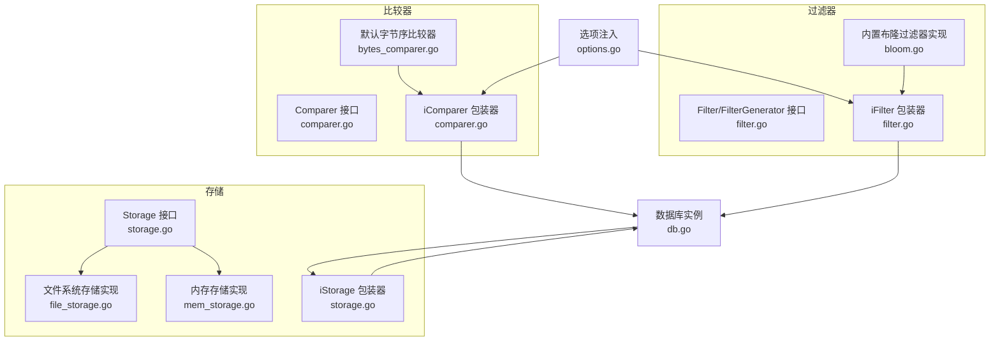
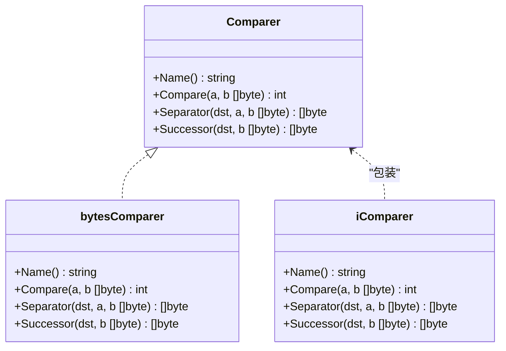
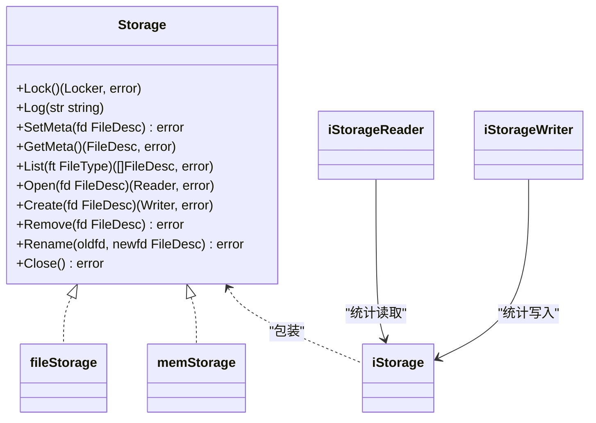
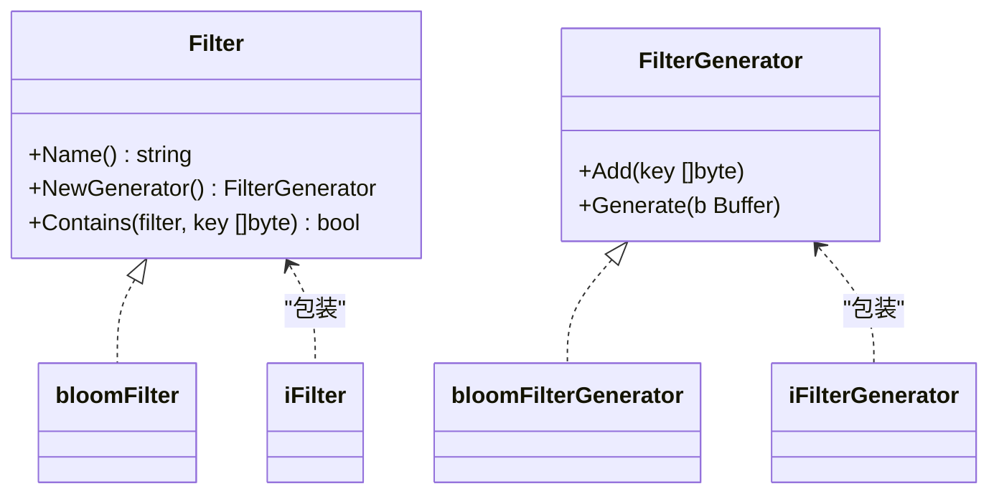
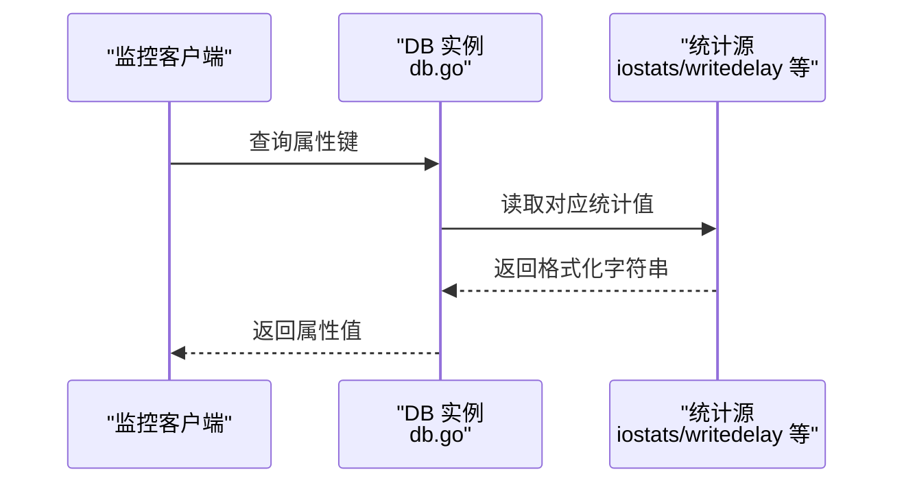
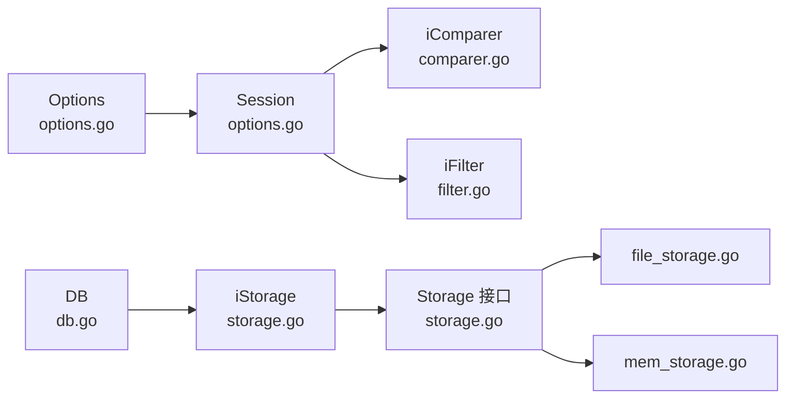

# 扩展与集成

<cite>
**本文引用的文件**
- [leveldb/comparer/comparer.go](file://leveldb/comparer/comparer.go)
- [leveldb/comparer/bytes_comparer.go](file://leveldb/comparer/bytes_comparer.go)
- [leveldb/comparer.go](file://leveldb/comparer.go)
- [leveldb/filter/filter.go](file://leveldb/filter/filter.go)
- [leveldb/filter/bloom.go](file://leveldb/filter/bloom.go)
- [leveldb/filter.go](file://leveldb/filter.go)
- [leveldb/storage/storage.go](file://leveldb/storage/storage.go)
- [leveldb/storage/file_storage.go](file://leveldb/storage/file_storage.go)
- [leveldb/storage/mem_storage.go](file://leveldb/storage/mem_storage.go)
- [leveldb/storage.go](file://leveldb/storage.go)
- [leveldb/options.go](file://leveldb/options.go)
- [leveldb/opt/options.go](file://leveldb/opt/options.go)
- [leveldb/db.go](file://leveldb/db.go)
- [leveldb/db_compaction.go](file://leveldb/db_compaction.go)
</cite>

## 目录
1. [简介](#简介)
2. [项目结构](#项目结构)
3. [核心组件](#核心组件)
4. [架构总览](#架构总览)
5. [详细组件分析](#详细组件分析)
6. [依赖关系分析](#依赖关系分析)
7. [性能考量](#性能考量)
8. [故障排查指南](#故障排查指南)
9. [结论](#结论)
10. [附录](#附录)

## 简介
本指南面向希望在 avccDB 中进行扩展与集成的开发者，围绕以下扩展点提供可操作的指导：
- 自定义比较器：通过实现比较器接口改变键的排序规则，以支持特定数据类型。
- 存储后端扩展：实现 Storage 接口以接入新的存储系统（如云存储）。
- 过滤器扩展：实现 Filter/FilterGenerator 接口，集成其他类型的布隆过滤器或替代过滤策略。
- 监控集成：通过属性查询与统计导出，暴露内部运行时统计信息，便于外部监控系统采集。

## 项目结构
avccDB 的扩展点主要分布在 comparer、filter、storage 三个子系统，并由顶层 options 与 session 在启动阶段注入到数据库实例中。下图给出与扩展相关的核心模块关系概览。



图表来源
- [leveldb/comparer/comparer.go](file://leveldb/comparer/comparer.go#L1-L58)
- [leveldb/comparer/bytes_comparer.go](file://leveldb/comparer/bytes_comparer.go#L1-L52)
- [leveldb/comparer.go](file://leveldb/comparer.go#L1-L122)
- [leveldb/filter/filter.go](file://leveldb/filter/filter.go#L1-L61)
- [leveldb/filter/bloom.go](file://leveldb/filter/bloom.go#L1-L117)
- [leveldb/filter.go](file://leveldb/filter.go#L1-L32)
- [leveldb/storage/storage.go](file://leveldb/storage/storage.go#L1-L189)
- [leveldb/storage/file_storage.go](file://leveldb/storage/file_storage.go#L1-L680)
- [leveldb/storage/mem_storage.go](file://leveldb/storage/mem_storage.go#L1-L222)
- [leveldb/storage.go](file://leveldb/storage.go#L1-L64)
- [leveldb/options.go](file://leveldb/options.go#L1-L108)
- [leveldb/db.go](file://leveldb/db.go#L1-L200)

章节来源
- [leveldb/comparer/comparer.go](file://leveldb/comparer/comparer.go#L1-L58)
- [leveldb/filter/filter.go](file://leveldb/filter/filter.go#L1-L61)
- [leveldb/storage/storage.go](file://leveldb/storage/storage.go#L1-L189)
- [leveldb/options.go](file://leveldb/options.go#L1-L108)

## 核心组件
- 比较器接口与包装器
  - Comparer 定义了键排序、分隔符生成、后继键生成等能力；iComparer 将用户提供的 Comparer 适配为内部使用的排序逻辑，并处理带版本号的键排序细节。
  - 默认实现 bytesComparer 提供按字节序的自然排序。
- 过滤器接口与包装器
  - Filter/FilterGenerator 定义了过滤策略与生成器；iFilter 将用户提供的 Filter 适配为内部键空间（去除版本信息）的过滤。
  - 内置布隆过滤器 BloomFilter 实现了高效的成员检测。
- 存储接口与包装器
  - Storage 抽象了文件元数据、读写、重命名、删除、日志等能力；iStorage 包装底层 Storage，在 Open/Create 时对读写字节数进行原子计数，用于监控。
  - 文件系统实现 fileStorage 与内存实现 memStorage 分别覆盖磁盘与内存场景。

章节来源
- [leveldb/comparer/comparer.go](file://leveldb/comparer/comparer.go#L1-L58)
- [leveldb/comparer/bytes_comparer.go](file://leveldb/comparer/bytes_comparer.go#L1-L52)
- [leveldb/comparer.go](file://leveldb/comparer.go#L1-L122)
- [leveldb/filter/filter.go](file://leveldb/filter/filter.go#L1-L61)
- [leveldb/filter/bloom.go](file://leveldb/filter/bloom.go#L1-L117)
- [leveldb/filter.go](file://leveldb/filter.go#L1-L32)
- [leveldb/storage/storage.go](file://leveldb/storage/storage.go#L1-L189)
- [leveldb/storage.go](file://leveldb/storage.go#L1-L64)

## 架构总览
下图展示了从选项注入到数据库运行期的关键交互路径，体现扩展点如何被集成。

```mermaid
sequenceDiagram
participant App as "应用"
participant Opt as "Options<br/>options.go"
participant Sess as "Session<br/>options.go"
participant DB as "DB 实例<br/>db.go"
participant Icmp as "iComparer<br/>comparer.go"
participant Ifilt as "iFilter<br/>filter.go"
participant Istor as "iStorage<br/>storage.go"
participant Store as "Storage 实现<br/>storage.go"
App->>Opt : 设置 Comparer/Filter/Storage
Opt->>Sess : setOptions(o)
Sess->>Icmp : 使用用户 Comparer 创建包装器
Sess->>Ifilt : 使用用户 Filter 创建包装器
Sess->>DB : 注入已包装的 Comparer/Filter
App->>DB : Open(storage, options)
DB->>Istor : newIStorage(storage)
Istor->>Store : 调用底层 Storage
DB-->>App : 返回可用的 DB 实例
```

图表来源
- [leveldb/options.go](file://leveldb/options.go#L1-L108)
- [leveldb/comparer.go](file://leveldb/comparer.go#L1-L122)
- [leveldb/filter.go](file://leveldb/filter.go#L1-L32)
- [leveldb/storage.go](file://leveldb/storage.go#L1-L64)
- [leveldb/db.go](file://leveldb/db.go#L177-L200)

## 详细组件分析

### 自定义比较器（comparer.go）
- 目标
  - 通过实现 Comparer 接口，改变键的排序规则，以支持特定数据类型（例如复合键、带版本号的键、数值键等）。
- 关键点
  - Name 必须稳定且唯一，一旦实现变更导致相对顺序变化，需更换名称，否则打开旧库会失败。
  - Separator/Successor 用于减少索引块的空间占用，实现时不得修改输入参数。
  - 内部 iComparer 已处理带版本号的键排序细节（版本降序、序列降序），自定义实现应保持与内部排序一致的语义。
- 实现步骤
  1) 定义一个类型实现 Comparer 接口（参考 bytes_comparer.go 的模式）。
  2) 在 Options 中设置 GetComparer 返回你的 Comparer 实例。
  3) 通过 setOptions 注入到 Session，随后 Open DB 即生效。
- 注意事项
  - 不要直接修改传入的键切片，避免内部状态损坏。
  - 若涉及版本号键，确保与内部解析逻辑兼容。



图表来源
- [leveldb/comparer/comparer.go](file://leveldb/comparer/comparer.go#L1-L58)
- [leveldb/comparer/bytes_comparer.go](file://leveldb/comparer/bytes_comparer.go#L1-L52)
- [leveldb/comparer.go](file://leveldb/comparer.go#L1-L122)

章节来源
- [leveldb/comparer/comparer.go](file://leveldb/comparer/comparer.go#L1-L58)
- [leveldb/comparer/bytes_comparer.go](file://leveldb/comparer/bytes_comparer.go#L1-L52)
- [leveldb/comparer.go](file://leveldb/comparer.go#L1-L122)

### 存储后端扩展（Storage 接口）
- 目标
  - 通过实现 Storage 接口，接入新的存储系统（如云存储），满足不同部署环境的需求。
- 关键点
  - Storage 接口抽象了元数据（SetMeta/GetMeta）、文件枚举（List）、文件读写（Open/Create）、删除与重命名、加锁与日志。
  - iStorage 包装器在 Open/Create 时对底层 Reader/Writer 进行包装，统计读写字节数，便于监控。
  - file_storage.go 提供了文件系统实现，mem_storage.go 提供内存实现，均可作为新实现的参考。
- 实现步骤
  1) 实现 Storage 接口的所有方法，确保并发安全与错误处理。
  2) 在 Open 时传入该 Storage 实例，或通过 options 注入。
  3) 如需监控，可使用 iStorage 包装器以启用读写统计。
- 注意事项
  - 元数据一致性：SetMeta 需保证原子性；GetMeta 需能正确解析 CURRENT/CURRENT.bak 等文件。
  - 文件命名与类型：遵循 FileDesc 类型与命名规范，避免与现有类型冲突。
  - 错误类型：返回 ErrClosed/ErrLocked/ErrInvalidFile 等标准错误，便于上层识别。



图表来源
- [leveldb/storage/storage.go](file://leveldb/storage/storage.go#L1-L189)
- [leveldb/storage/file_storage.go](file://leveldb/storage/file_storage.go#L1-L680)
- [leveldb/storage/mem_storage.go](file://leveldb/storage/mem_storage.go#L1-L222)
- [leveldb/storage.go](file://leveldb/storage.go#L1-L64)

章节来源
- [leveldb/storage/storage.go](file://leveldb/storage/storage.go#L1-L189)
- [leveldb/storage/file_storage.go](file://leveldb/storage/file_storage.go#L1-L680)
- [leveldb/storage/mem_storage.go](file://leveldb/storage/mem_storage.go#L1-L222)
- [leveldb/storage.go](file://leveldb/storage.go#L1-L64)

### 过滤器（Filter）接口与集成
- 目标
  - 通过实现 Filter/FilterGenerator 接口，集成自定义过滤策略（如替代布隆过滤器、概率指纹等）。
- 关键点
  - Filter.Name 必须稳定，若编码不兼容需更改名称。
  - Filter.Contains 与 FilterGenerator.Generate 的行为需与内部键空间（去版本）保持一致。
  - iFilter 包装器将用户 Filter 适配为内部键空间，Add/Contains 均基于去版本后的用户键。
- 实现步骤
  1) 实现 Filter/FilterGenerator 接口，参考 bloom.go 的实现模式。
  2) 在 Options 中设置 Filter 或 AltFilters。
  3) setOptions 会将 Filter 包装为 iFilter 并注入到 Session。
- 注意事项
  - 生成器在 Generate 后可能被复用，注意内部状态清理。
  - 生成的过滤器二进制格式需向后兼容，必要时通过名称区分版本。



图表来源
- [leveldb/filter/filter.go](file://leveldb/filter/filter.go#L1-L61)
- [leveldb/filter/bloom.go](file://leveldb/filter/bloom.go#L1-L117)
- [leveldb/filter.go](file://leveldb/filter.go#L1-L32)

章节来源
- [leveldb/filter/filter.go](file://leveldb/filter/filter.go#L1-L61)
- [leveldb/filter/bloom.go](file://leveldb/filter/bloom.go#L1-L117)
- [leveldb/filter.go](file://leveldb/filter.go#L1-L32)

### 监控集成建议（属性查询与统计导出）
- 目标
  - 通过属性查询与统计导出，将内部运行时指标暴露给外部监控系统。
- 可用能力
  - 属性查询：db.go 中提供多种属性键（如 iostats、writedelay、sstables、blockpool、cachedblock、openedtables、alivesnaps、aliveiters 等），可用于快速获取运行状态。
  - 统计导出：DBStats 结构体聚合了 IO、写延迟、快照/迭代器数量、缓存大小、各层级读写与持续时间、各类 Compaction 计数等。
  - 存储统计：iStorage 对读写字节数进行原子计数，可通过 DB 层的统计接口获取。
- 使用建议
  - 在业务侧定期调用属性查询或 Stats 导出，结合外部监控系统（如 Prometheus）进行可视化与告警。
  - 对于高吞吐场景，建议仅在低频周期内拉取统计，避免频繁开销。
- 示例流程（属性查询）



图表来源
- [leveldb/db.go](file://leveldb/db.go#L1322-L1448)
- [leveldb/storage.go](file://leveldb/storage.go#L1-L64)

章节来源
- [leveldb/db.go](file://leveldb/db.go#L1322-L1448)
- [leveldb/storage.go](file://leveldb/storage.go#L1-L64)
- [leveldb/db_compaction.go](file://leveldb/db_compaction.go#L1-L76)

## 依赖关系分析
- 选项注入链路
  - Options 中的 Comparer/Filter/Storage 通过 setOptions 注入到 Session，并最终成为 DB 的内部实现。
- 包装器与适配
  - iComparer/iFilter/iStorage 分别对用户提供的 Comparer/Filter/Storage 进行适配与增强，确保与内部键空间、统计需求一致。
- 文件系统与内存实现
  - file_storage.go 与 mem_storage.go 提供了完整的文件操作与元数据管理，是实现自定义存储的重要参考。



图表来源
- [leveldb/options.go](file://leveldb/options.go#L1-L108)
- [leveldb/comparer.go](file://leveldb/comparer.go#L1-L122)
- [leveldb/filter.go](file://leveldb/filter.go#L1-L32)
- [leveldb/storage.go](file://leveldb/storage.go#L1-L64)
- [leveldb/storage/storage.go](file://leveldb/storage/storage.go#L1-L189)
- [leveldb/storage/file_storage.go](file://leveldb/storage/file_storage.go#L1-L680)
- [leveldb/storage/mem_storage.go](file://leveldb/storage/mem_storage.go#L1-L222)

章节来源
- [leveldb/options.go](file://leveldb/options.go#L1-L108)
- [leveldb/comparer.go](file://leveldb/comparer.go#L1-L122)
- [leveldb/filter.go](file://leveldb/filter.go#L1-L32)
- [leveldb/storage.go](file://leveldb/storage.go#L1-L64)
- [leveldb/storage/storage.go](file://leveldb/storage/storage.go#L1-L189)

## 性能考量
- 比较器
  - Separator/Successor 的实现会影响索引块大小与查找效率，应尽量生成“短而有效”的分隔键。
  - 版本号键排序逻辑复杂，需确保 Compare/Separator/Successor 的一致性。
- 过滤器
  - Bloom 参数（bitsPerKey）影响误判率与存储体积，需根据预期命中率与容量进行权衡。
  - 生成器在大量键时的内存与 CPU 开销较大，建议批量生成并复用 Buffer。
- 存储
  - iStorage 的原子计数开销极小，但在高频读写场景仍建议合并写请求，减少系统调用次数。
  - 文件系统实现中存在目录同步与日志轮转等成本，云存储实现需关注网络延迟与重试策略。
- 监控
  - 属性查询与 Stats 导出应避免在热路径频繁调用，建议异步或周期性采集。

## 故障排查指南
- 比较器相关
  - 若打开数据库报错，检查 Comparer.Name 是否与创建时一致；若实现变更导致排序变化，必须更换名称。
  - 若出现键顺序异常，检查 Separator/Successor 的实现是否修改了输入参数。
- 过滤器相关
  - 若过滤结果异常，确认 Filter.Name 未因编码变化而更改；检查 Contains 与 Add 的键空间是否一致（去版本）。
- 存储相关
  - 若元数据读取失败，检查 SetMeta/GetMeta 的文件命名与内容格式；确认 CURRENT/CURRENT.bak 的解析逻辑。
  - 若并发访问报错，检查 Lock/Unlock 的使用是否正确，避免重复加锁或跨实例共享。
- 监控相关
  - 若统计值异常，确认 iStorage 是否正确包装底层 Reader/Writer；检查属性查询键是否正确。

章节来源
- [leveldb/comparer/comparer.go](file://leveldb/comparer/comparer.go#L1-L58)
- [leveldb/filter/filter.go](file://leveldb/filter/filter.go#L1-L61)
- [leveldb/storage/storage.go](file://leveldb/storage/storage.go#L1-L189)
- [leveldb/db.go](file://leveldb/db.go#L1322-L1448)

## 结论
通过上述扩展点，开发者可以灵活地定制键排序规则、接入新的存储后端、集成多样化的过滤策略，并将内部统计信息暴露给外部监控系统。建议在实现过程中严格遵循接口契约、保持元数据一致性与版本兼容性，并结合性能与可靠性要求进行优化与测试。

## 附录
- 最佳实践清单
  - 比较器：Name 稳定、不修改输入参数、与内部排序语义一致。
  - 过滤器：编码兼容性与名称管理、生成器状态复位、键空间一致性。
  - 存储：元数据原子性、命名规范、并发安全、错误类型标准化。
  - 监控：低频采集、异步导出、指标维度清晰、告警阈值合理。
- 参考实现
  - 字节序比较器：bytes_comparer.go
  - 内置布隆过滤器：bloom.go
  - 文件系统存储：file_storage.go
  - 内存存储：mem_storage.go