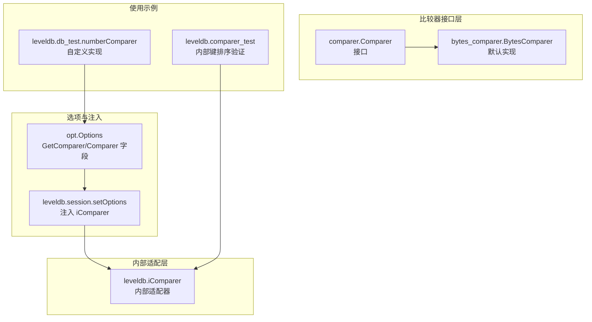
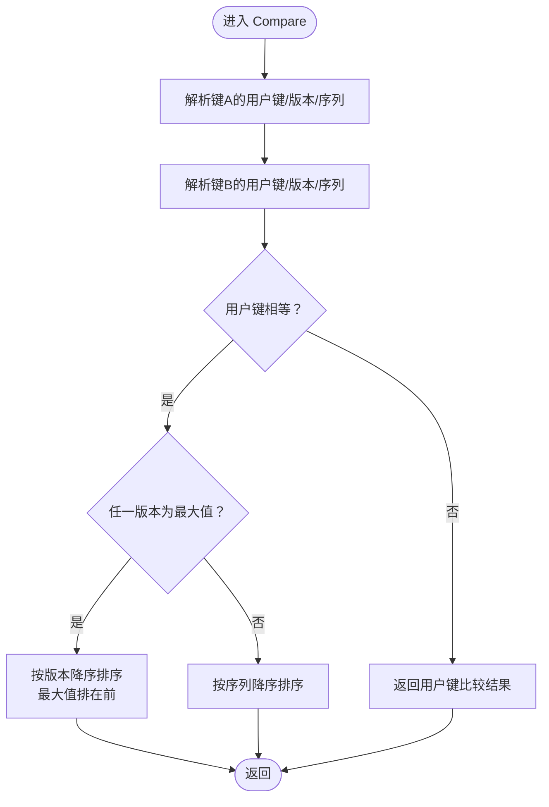
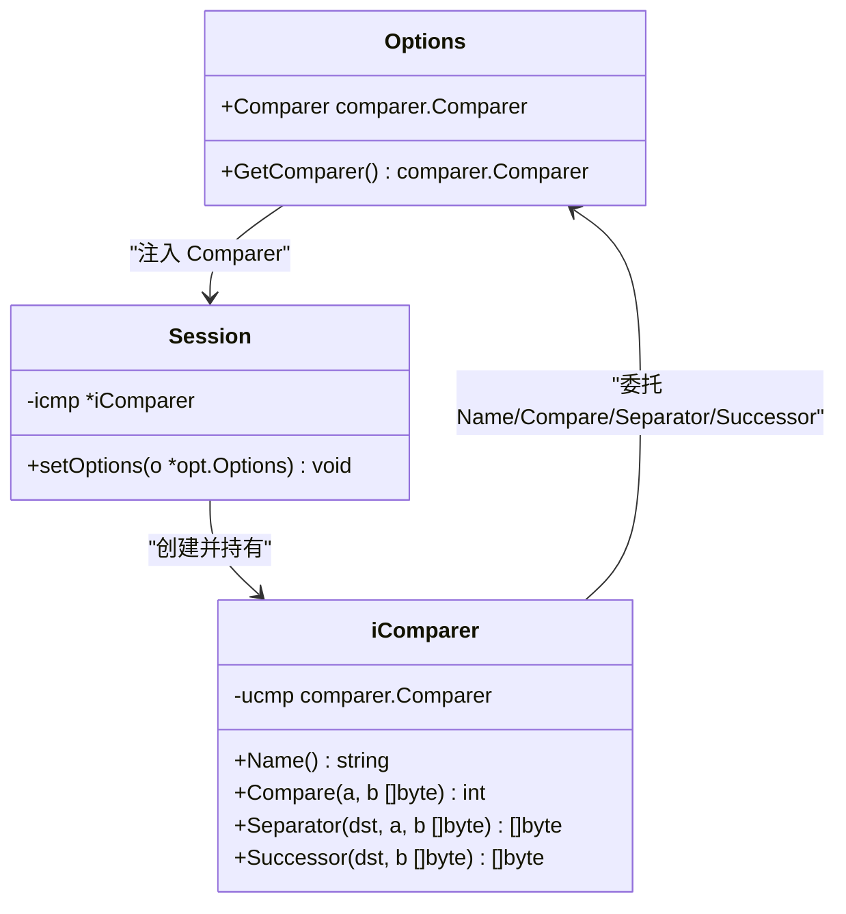
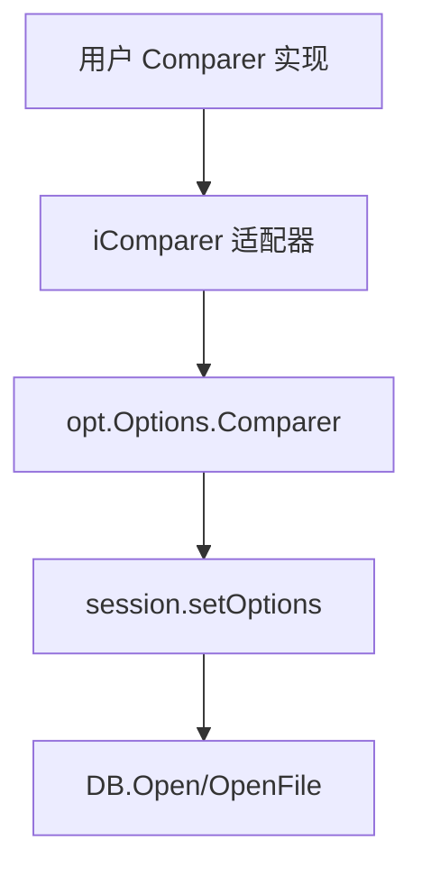

# 自定义比较器

<cite>
**本文引用的文件**
- [comparer.go](file://leveldb/comparer/comparer.go)
- [bytes_comparer.go](file://leveldb/comparer/bytes_comparer.go)
- [comparer.go](file://leveldb/comparer.go)
- [options.go](file://leveldb/opt/options.go)
- [options.go](file://leveldb/options.go)
- [db_test.go](file://leveldb/db_test.go)
- [comparer_test.go](file://leveldb/comparer_test.go)
- [db.go](file://leveldb/db.go)
</cite>

## 目录
1. [简介](#简介)
2. [项目结构](#项目结构)
3. [核心组件](#核心组件)
4. [架构总览](#架构总览)
5. [详细组件分析](#详细组件分析)
6. [依赖关系分析](#依赖关系分析)
7. [性能考量](#性能考量)
8. [故障排查指南](#故障排查指南)
9. [结论](#结论)
10. [附录](#附录)

## 简介
本文件面向 avccDB 的使用者与维护者，系统化阐述如何实现自定义比较器（Comparer）以改变键的排序规则，满足特定数据类型（如数字、逆序等）的排序需求。文档覆盖 Comparer 接口的四个关键方法：Compare、Name、Separator 和 Successor 的实现要求与最佳实践；说明比较器名称在数据库兼容性中的作用；并通过 Options 结构体将自定义比较器注入数据库实例；最后提供常见错误与调试建议，帮助避免因比较器不一致导致的排序问题。

## 项目结构
围绕比较器功能的相关模块分布如下：
- 接口与默认实现：comparer 包提供 Comparer 接口与 bytesComparer 默认实现
- 内部适配器：leveldb/comparer.go 定义 iComparer，封装用户提供的 Comparer 并处理内部键（含版本号与序列号）的排序逻辑
- 选项注入：opt/options.go 提供 Options 结构体及 GetComparer 方法；leveldb/options.go 在会话初始化时将用户 Comparer 转换为内部 iComparer
- 使用示例：leveldb/db_test.go 展示了如何通过 Options 注入自定义比较器；leveldb/comparer_test.go 验证了内部键排序行为



图表来源
- [comparer.go](file://leveldb/comparer/comparer.go#L1-L58)
- [bytes_comparer.go](file://leveldb/comparer/bytes_comparer.go#L1-L52)
- [comparer.go](file://leveldb/comparer.go#L1-L122)
- [options.go](file://leveldb/opt/options.go#L282-L290)
- [options.go](file://leveldb/options.go#L25-L44)
- [db_test.go](file://leveldb/db_test.go#L1609-L1657)
- [comparer_test.go](file://leveldb/comparer_test.go#L1-L50)

章节来源
- [comparer.go](file://leveldb/comparer/comparer.go#L1-L58)
- [bytes_comparer.go](file://leveldb/comparer/bytes_comparer.go#L1-L52)
- [comparer.go](file://leveldb/comparer.go#L1-L122)
- [options.go](file://leveldb/opt/options.go#L282-L290)
- [options.go](file://leveldb/options.go#L25-L44)
- [db_test.go](file://leveldb/db_test.go#L1609-L1657)
- [comparer_test.go](file://leveldb/comparer_test.go#L1-L50)

## 核心组件
- Comparer 接口：定义键排序的总序关系，包含 Compare、Name、Separator、Successor 四个方法
- bytesComparer 默认实现：基于字节序的自然排序，Name 返回保留前缀标识
- iComparer 内部适配器：包装用户 Comparer，负责解析内部键（带版本号与序列号），并按“用户键相等时优先比较版本，再比较序列”的规则进行排序
- Options 注入：通过 opt.Options.Comparer 字段注入用户实现；leveldb/session.setOptions 将其转换为内部 iComparer

章节来源
- [comparer.go](file://leveldb/comparer/comparer.go#L1-L58)
- [bytes_comparer.go](file://leveldb/comparer/bytes_comparer.go#L1-L52)
- [comparer.go](file://leveldb/comparer.go#L1-L122)
- [options.go](file://leveldb/opt/options.go#L282-L290)
- [options.go](file://leveldb/options.go#L25-L44)

## 架构总览
下图展示了从应用到存储引擎的比较器调用链路与职责边界：

```mermaid
sequenceDiagram
participant App as "应用"
participant Opt as "opt.Options"
participant Sess as "leveldb.session"
participant Icmp as "leveldb.iComparer"
participant Ucmp as "用户 Comparer"
participant DB as "leveldb.DB/Open"
App->>Opt : 设置 Comparer 字段
App->>DB : Open/OpenFile(Options)
DB->>Sess : newSession(Options)
Sess->>Sess : setOptions(Options)
Sess->>Icmp : 创建 iComparer{GetComparer()}
Icmp->>Ucmp : 委托 Compare/Separator/Successor/Name
App->>DB : 执行读写/迭代
DB->>Icmp : 比较键/生成分隔键/后继键
Icmp->>Ucmp : 解析用户键并调用用户实现
Ucmp-->>Icmp : 返回比较结果/分隔/后继
Icmp-->>DB : 返回内部键比较结果
```

图表来源
- [options.go](file://leveldb/opt/options.go#L282-L290)
- [options.go](file://leveldb/options.go#L25-L44)
- [comparer.go](file://leveldb/comparer.go#L1-L122)
- [db.go](file://leveldb/db.go#L188-L244)

## 详细组件分析

### Comparer 接口与默认实现
- 接口职责
  - Compare(a, b []byte) int：返回 -1/0/+1，表示 a < = > b；空切片必须小于任何非空切片
  - Name() string：返回比较器名称；数据库磁盘格式会记录该名称，若打开时名称不匹配将报错
  - Separator(dst, a, b []byte) []byte：返回一个位于 a 与 b 之间的中间键，用于索引块优化；不得修改输入
  - Successor(dst, b []byte) []byte：返回大于等于 b 的最小后继键；不得修改输入
- 默认实现 bytesComparer
  - Name 返回保留前缀标识，确保与内置比较器兼容
  - Compare 使用字节序比较
  - Separator/Successor 实现了字节序友好的分隔与后继生成策略

章节来源
- [comparer.go](file://leveldb/comparer/comparer.go#L1-L58)
- [bytes_comparer.go](file://leveldb/comparer/bytes_comparer.go#L1-L52)

### iComparer 内部适配器
- 设计目标：在用户提供的 Comparer 基础上，统一处理内部键（包含版本号与序列号）的排序规则
- 关键行为
  - 解析内部键：区分是否带有版本号，提取用户键、版本号、序列号
  - 排序优先级：先比较用户键；当用户键相等时，优先比较版本号（降序），再比较序列号（降序）
  - 特殊规则：当查询键的版本号为“最大值”时，应排在实际版本之前，以保证 Seek 能找到最新版本
  - 分隔与后继：对用户键调用用户 Comparer 的 Separator/Successor，并在必要时追加“最早可能的数字”以满足范围约束



图表来源
- [comparer.go](file://leveldb/comparer.go#L37-L121)

章节来源
- [comparer.go](file://leveldb/comparer.go#L1-L122)

### Options 注入与会话初始化
- opt.Options
  - Comparer 字段：用于设置自定义比较器
  - GetComparer：若未设置则返回默认比较器
- leveldb/session.setOptions
  - 将 opt.Options.Comparer 转换为内部 iComparer，并写回缓存选项
  - 保证同一数据库生命周期内读写使用相同的比较器



图表来源
- [options.go](file://leveldb/opt/options.go#L282-L290)
- [options.go](file://leveldb/opt/options.go#L543-L548)
- [options.go](file://leveldb/options.go#L25-L44)
- [comparer.go](file://leveldb/comparer.go#L1-L122)

章节来源
- [options.go](file://leveldb/opt/options.go#L282-L290)
- [options.go](file://leveldb/opt/options.go#L543-L548)
- [options.go](file://leveldb/options.go#L25-L44)

### 使用示例：数字比较器与逆序比较器
- 数字比较器
  - 实现思路：将键解析为数字，按数值大小比较
  - 示例路径：leveldb/db_test.go 中的 numberComparer 类型与测试用例
  - 注入方式：通过 opt.Options.Comparer 设置为自定义实现
- 逆序比较器
  - 实现思路：在 Compare 中交换左右参数的比较方向，即可实现逆序
  - 注入方式：同上，通过 Options.Comparer 设置

章节来源
- [db_test.go](file://leveldb/db_test.go#L1609-L1657)
- [options.go](file://leveldb/opt/options.go#L282-L290)

### 测试验证：内部键排序与最大版本行为
- 测试目的：验证当查询键版本为“最大值”时，比较结果应使查询键排在实际版本之前，从而确保 Seek 能找到最新版本
- 测试要点：构造存储键与查询键，断言 Compare 结果与序列号降序排序行为

章节来源
- [comparer_test.go](file://leveldb/comparer_test.go#L1-L50)

## 依赖关系分析
- 比较器接口与默认实现
  - comparer.Comparer 定义排序契约
  - bytes_comparer.BytesComparer 提供默认实现
- 内部适配器与用户实现
  - iComparer 委托用户 Comparer 的 Compare/Separator/Successor/Name
  - iComparer 对内部键进行解析与排序规则增强
- 选项注入
  - opt.Options.Comparer 作为注入点
  - session.setOptions 将 Comparer 包装为 iComparer 并写入缓存



图表来源
- [comparer.go](file://leveldb/comparer/comparer.go#L1-L58)
- [bytes_comparer.go](file://leveldb/comparer/bytes_comparer.go#L1-L52)
- [comparer.go](file://leveldb/comparer.go#L1-L122)
- [options.go](file://leveldb/opt/options.go#L282-L290)
- [options.go](file://leveldb/options.go#L25-L44)
- [db.go](file://leveldb/db.go#L188-L244)

章节来源
- [comparer.go](file://leveldb/comparer/comparer.go#L1-L58)
- [bytes_comparer.go](file://leveldb/comparer/bytes_comparer.go#L1-L52)
- [comparer.go](file://leveldb/comparer.go#L1-L122)
- [options.go](file://leveldb/opt/options.go#L282-L290)
- [options.go](file://leveldb/options.go#L25-L44)
- [db.go](file://leveldb/db.go#L188-L244)

## 性能考量
- Separator 与 Successor 的实现可显著减少索引块的空间占用，提升范围扫描效率
- 自定义比较器应尽量保持 O(1) 或线性但常数较小的时间复杂度，避免在 Compare 中执行昂贵操作
- 当键包含版本号与序列号时，iComparer 已内置解析与排序逻辑，无需在用户实现中重复处理

## 故障排查指南
- 数据库无法打开且提示比较器不匹配
  - 现象：打开数据库时报错，提示比较器名称不一致
  - 原因：数据库磁盘格式记录了创建时的比较器名称，若当前实现名称不同将拒绝打开
  - 处理：确保 Name 返回稳定的字符串；不要使用以“leveldb.”开头的保留名称
- 排序结果异常或 Seek 不命中最新版本
  - 现象：查询键版本为“最大值”时，Seek 未返回最新版本
  - 原因：未遵循内部键排序规则（用户键相等时优先比较版本，再比较序列）
  - 处理：参考 iComparer 的排序逻辑，确保用户键相等时按版本降序、序列降序
- 自定义比较器未生效
  - 现象：读写行为与预期不符
  - 原因：未通过 opt.Options.Comparer 正确注入，或注入后又使用默认比较器
  - 处理：确认 Options.Comparer 已设置为自定义实现，并在 Open/OpenFile 前完成配置

章节来源
- [comparer.go](file://leveldb/comparer/comparer.go#L25-L37)
- [comparer.go](file://leveldb/comparer.go#L37-L121)
- [options.go](file://leveldb/opt/options.go#L282-L290)
- [options.go](file://leveldb/options.go#L25-L44)

## 结论
通过实现 Comparer 接口并正确注入 Options，可以灵活地改变键的排序规则以满足特定业务需求。iComparer 在此基础上提供了对内部键（版本号与序列号）的统一排序增强，确保 Seek 等操作的行为符合预期。务必重视比较器名称的稳定性与兼容性，避免因比较器不一致导致数据库无法打开或排序异常。

## 附录

### 方法实现要求与最佳实践
- Compare
  - 必须满足全序关系：自反、反对称、传递
  - 空切片必须小于任何非空切片
  - 用户键相等时，需按版本降序、序列降序排序
- Name
  - 返回稳定且唯一的字符串，用于数据库兼容性校验
  - 不要使用以“leveldb.”开头的保留名称
- Separator
  - 返回位于 a 与 b 之间的中间键；若无法生成，返回 nil
  - 不得修改输入切片内容
- Successor
  - 返回大于等于 b 的最小后继键；若无法生成，返回 nil
  - 不得修改输入切片内容

章节来源
- [comparer.go](file://leveldb/comparer/comparer.go#L1-L58)
- [bytes_comparer.go](file://leveldb/comparer/bytes_comparer.go#L1-L52)
- [comparer.go](file://leveldb/comparer.go#L37-L121)

### 注入比较器的步骤
- 定义自定义 Comparer 实现（至少实现 Compare 与 Name）
- 通过 opt.Options.Comparer 设置为自定义实现
- 使用 Open 或 OpenFile 打开数据库，内部会自动转换为 iComparer 并生效

章节来源
- [db_test.go](file://leveldb/db_test.go#L1609-L1657)
- [options.go](file://leveldb/opt/options.go#L282-L290)
- [options.go](file://leveldb/options.go#L25-L44)
- [db.go](file://leveldb/db.go#L188-L244)