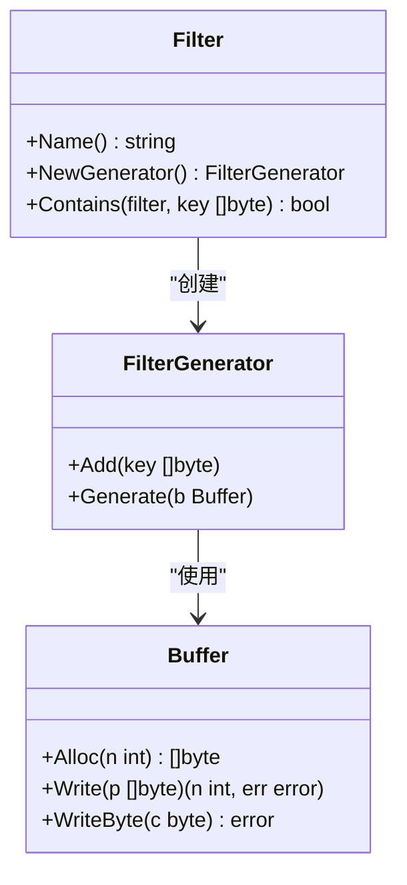
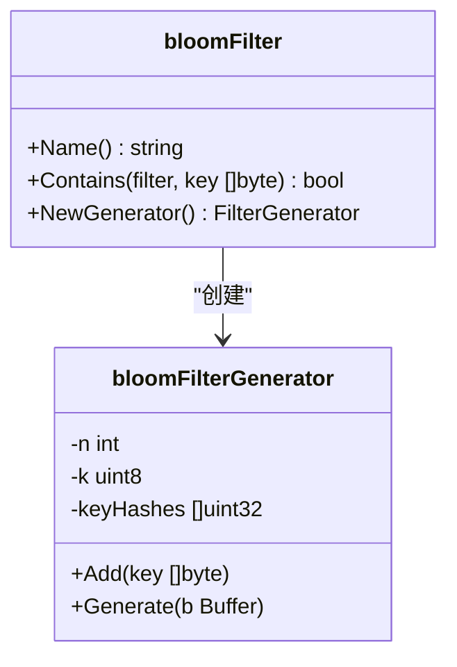
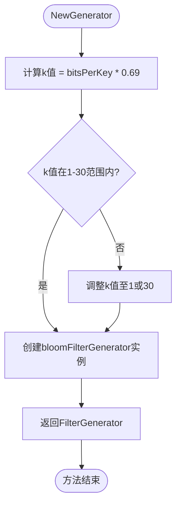
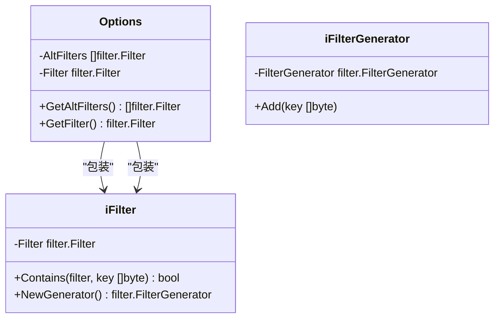
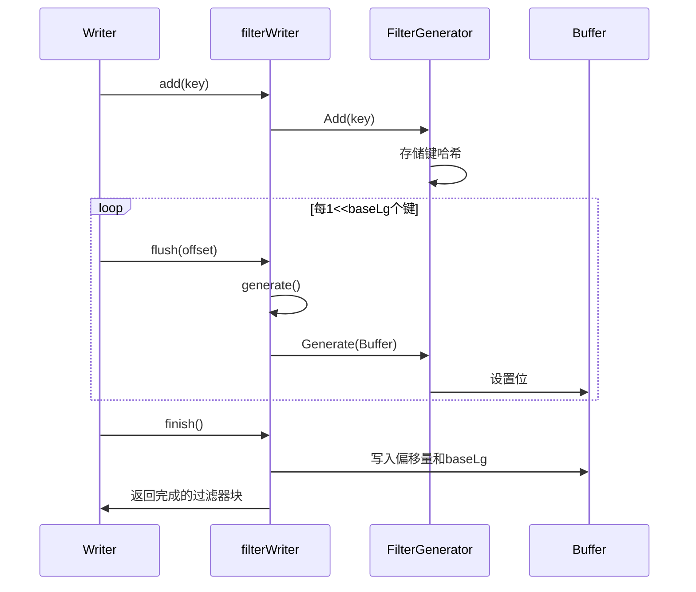
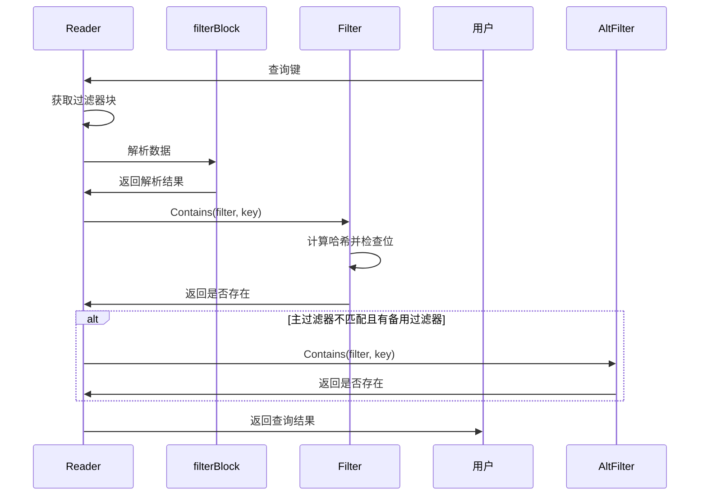

# 过滤器扩展

<cite>
**本文档中引用的文件**   
- [filter.go](file://leveldb/filter/filter.go)
- [bloom.go](file://leveldb/filter/bloom.go)
- [filter.go](file://leveldb/filter.go)
- [options.go](file://leveldb/opt/options.go)
- [writer.go](file://leveldb/table/writer.go)
- [reader.go](file://leveldb/table/reader.go)
- [bloom_test.go](file://leveldb/filter/bloom_test.go)
</cite>

## 目录
1. [引言](#引言)
2. [核心接口分析](#核心接口分析)
3. [布隆过滤器实现](#布隆过滤器实现)
4. [过滤器配置与选项](#过滤器配置与选项)
5. [过滤器工作流程](#过滤器工作流程)
6. [性能权衡分析](#性能权衡分析)
7. [自定义过滤器实现](#自定义过滤器实现)
8. [结论](#结论)

## 引言

avccDB的过滤器扩展功能提供了一种高效的概率性数据结构，用于快速判断键是否存在于数据库中。这种机制可以显著减少磁盘查找次数，通常能将每次DB.Get调用的磁盘查找次数从多次减少到单次。本文档详细解释了Filter和FilterGenerator接口的工作原理，以及如何实现自定义过滤器来替代或补充布隆过滤器。

**Section sources**
- [filter.go](file://leveldb/filter/filter.go#L7-L14)

## 核心接口分析

avccDB的过滤器系统基于两个核心接口：Filter和FilterGenerator。这些接口定义了过滤器的基本行为和生成机制。

### Filter接口

Filter接口是过滤器的核心，定义了过滤器必须实现的三个方法：

- **Name() string**: 返回过滤器策略的名称。如果过滤器编码方式发生了不兼容的更改，此方法返回的名称必须更改，以避免将不兼容的旧过滤器传递给该类型的方法。
- **NewGenerator() FilterGenerator**: 创建一个新的过滤器生成器实例。
- **Contains(filter, key []byte) bool**: 判断给定的过滤器是否包含指定的键。



**Diagram sources**
- [filter.go](file://leveldb/filter/filter.go#L29-L45)
- [filter.go](file://leveldb/filter/filter.go#L47-L60)

### FilterGenerator接口

FilterGenerator接口负责生成过滤器，它包含两个关键方法：

- **Add(key []byte)**: 将一个键添加到过滤器生成器中。由于键在方法调用结束后可能变得无效，因此如果实现需要保留键以供后续使用，则必须复制该键。直接修改键可能会导致未定义的结果。
- **Generate(b Buffer)**: 基于迄今为止传递的键生成过滤器。调用Generate后，过滤器生成器可能会被重置，具体取决于实现。

**Section sources**
- [filter.go](file://leveldb/filter/filter.go#L47-L60)

## 布隆过滤器实现

avccDB提供了内置的布隆过滤器实现，这是一种经典的概率性数据结构，用于测试元素是否属于某个集合。

### 布隆过滤器结构

布隆过滤器的实现基于`bloomFilter`类型，它是一个整数类型，表示每个键的位数(bitsPerKey)。该实现使用了双重哈希技术来生成一系列哈希值，这在[Kirsch,Mitzenmacher 2006]中有详细分析。



**Diagram sources**
- [bloom.go](file://leveldb/filter/bloom.go#L17-L66)
- [bloom.go](file://leveldb/filter/bloom.go#L68-L104)

### Contains方法实现

Contains方法是布隆过滤器的核心查询方法。它通过以下步骤工作：

1. 计算过滤器的位数(nBits)和字节数(nBytes)
2. 从过滤器末尾获取哈希函数数量(k)
3. 对于每个哈希函数，计算位位置并检查对应位是否被设置
4. 如果所有位都被设置，则返回true；否则返回false

该方法还处理了k值大于30的特殊情况，将其视为匹配，为未来可能的短布隆过滤器新编码保留。

**Section sources**
- [bloom.go](file://leveldb/filter/bloom.go#L26-L52)

### NewGenerator方法实现

NewGenerator方法创建一个新的过滤器生成器。它根据bitsPerKey参数计算最优的哈希函数数量k，使用0.69（约等于ln(2)）作为乘数来最小化误报率。k值被限制在1到30之间。



**Diagram sources**
- [bloom.go](file://leveldb/filter/bloom.go#L54-L66)

### Add和Generate方法实现

Add方法将键的哈希值添加到生成器的keyHashes切片中。Generate方法则根据已添加的键生成最终的过滤器数据：

1. 计算布隆过滤器的大小（位和字节）
2. 强制最小布隆过滤器长度为64位，以避免小n值时的高误报率
3. 分配目标缓冲区并设置k值
4. 对每个键哈希值，使用旋转哈希技术设置相应的位
5. 重置keyHashes切片以释放内存

**Section sources**
- [bloom.go](file://leveldb/filter/bloom.go#L75-L104)

## 过滤器配置与选项

avccDB通过Options结构体提供了灵活的过滤器配置机制，允许用户配置主过滤器和备用过滤器。

### Options结构体

Options结构体中的过滤器相关字段包括：

- **Filter**: 主过滤器，用于创建新的过滤器块
- **AltFilters**: 一个或多个备用过滤器，在读取时如果过滤器块与有效过滤器不匹配，则使用这些备用过滤器



**Diagram sources**
- [options.go](file://leveldb/opt/options.go#L176-L183)
- [filter.go](file://leveldb/filter.go#L13-L31)

### 过滤器配置示例

在avccDB中配置过滤器的典型方式如下：

```go
o := &opt.Options{
    Filter: filter.NewBloomFilter(10),
}
db, err := leveldb.OpenFile("path/to/db", o)
```

这里使用NewBloomFilter函数创建一个每键10位的布隆过滤器。由于bitsPerKey参数会单独持久化到每个布隆过滤器序列化中，因此更改此参数时布隆过滤器具有向后兼容性，不会产生大的性能惩罚。

**Section sources**
- [README.md](file://README.md#L94-L102)

## 过滤器工作流程

理解过滤器在avccDB中的完整工作流程对于正确使用和扩展过滤器功能至关重要。

### 写入时的过滤器生成

当数据写入avccDB时，过滤器的生成流程如下：

1. 在Writer结构体中初始化filterWriter
2. 每次添加键时，调用filterWriter.add方法
3. 当达到指定偏移量时，调用flush方法生成过滤器
4. 在完成写入时，调用finish方法完成过滤器块的写入



**Diagram sources**
- [writer.go](file://leveldb/table/writer.go#L96-L138)

### 读取时的过滤器使用

当从avccDB读取数据时，过滤器的使用流程如下：

1. 读取过滤器块数据
2. 解析过滤器块结构，包括偏移量和baseLg
3. 对于每个查询键，使用Contains方法检查过滤器
4. 如果主过滤器不匹配且配置了备用过滤器，则尝试备用过滤器



**Diagram sources**
- [reader.go](file://leveldb/table/reader.go#L658-L680)

## 性能权衡分析

在使用avccDB的过滤器功能时，需要在内存使用、误报率和查询性能之间进行权衡。

### 内存使用与误报率

布隆过滤器的内存使用和误报率之间存在直接关系。每键位数(bitsPerKey)是控制这一权衡的关键参数：

- **bitsPerKey值较低**（如5-7）：内存使用较少，但误报率较高
- **bitsPerKey值中等**（如10-15）：内存使用适中，误报率较低
- **bitsPerKey值较高**（如20+）：内存使用较多，但误报率极低

根据bloom_test.go中的测试，使用10位/键时，对于10,000个键，过滤器长度约为12,540字节，误报率低于2%。

### 不同工作负载下的表现

不同类型的过滤器在不同工作负载下表现各异：

- **布隆过滤器**：适用于大多数通用场景，实现简单，性能稳定
- **计数布隆过滤器**：支持删除操作，适合需要动态更新的场景
- **Cuckoo过滤器**：支持删除操作，空间效率更高，适合高基数场景

**Section sources**
- [bloom_test.go](file://leveldb/filter/bloom_test.go#L102-L143)

## 自定义过滤器实现

avccDB的过滤器系统设计为可扩展的，允许用户实现自定义过滤器来替代或补充内置的布隆过滤器。

### 实现计数布隆过滤器

要实现计数布隆过滤器，需要创建一个实现Filter接口的结构体：

```go
type CountingBloomFilter struct {
    bitsPerKey int
    counters   []uint8 // 使用计数器而不是单个位
}

func (f CountingBloomFilter) Name() string {
    return "avccDB.CountingBloomFilter"
}

func (f CountingBloomFilter) NewGenerator() FilterGenerator {
    return &countingBloomGenerator{
        n: f.bitsPerKey,
        counters: make([]uint8, initialSize),
    }
}

func (f CountingBloomFilter) Contains(filter, key []byte) bool {
    // 实现计数布隆过滤器的查询逻辑
    // 检查所有相关计数器是否大于0
}
```

关键区别在于使用计数器数组而不是位数组，这允许支持删除操作（通过递减计数器）。

### 实现Cuckoo过滤器

Cuckoo过滤器的实现需要更复杂的数据结构：

```go
type CuckooFilter struct {
    fingerprintSize int
    tableSize       int
    maxKicks        int
}

func (f CuckooFilter) Name() string {
    return "avccDB.CuckooFilter"
}

func (f CuckooFilter) NewGenerator() FilterGenerator {
    return &cuckooFilterGenerator{
        fingerprints: make([]uint32, f.tableSize),
        altIndices:   make([]uint32, f.tableSize),
    }
}
```

Cuckoo过滤器使用指纹和两个可能的位置来存储每个元素，通过"踢出"机制解决冲突，具有更高的空间利用率。

### 配置备用过滤器

可以通过Options结构体配置备用过滤器，实现过滤器的平滑迁移：

```go
o := &opt.Options{
    Filter:      filter.NewBloomFilter(10),
    AltFilters: []filter.Filter{
        NewCountingBloomFilter(10),
        NewCuckooFilter(12),
    },
}
```

这样，当读取旧数据时，如果主过滤器不匹配，系统会尝试备用过滤器，确保向后兼容性。

**Section sources**
- [options.go](file://leveldb/opt/options.go#L27-L33)
- [filter.go](file://leveldb/filter.go#L13-L31)

## 结论

avccDB的过滤器扩展功能提供了一个强大而灵活的框架，用于实现和使用概率性数据结构。通过Filter和FilterGenerator接口，系统实现了高度的可扩展性，允许用户根据具体需求实现自定义过滤器。布隆过滤器作为默认实现，提供了良好的性能和内存使用平衡。通过Options结构体，用户可以灵活配置主过滤器和备用过滤器，实现平滑的过滤器迁移和升级。在选择过滤器类型时，需要根据具体的工作负载在内存使用、误报率和功能需求之间进行权衡。