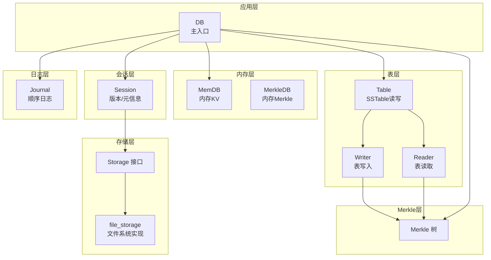
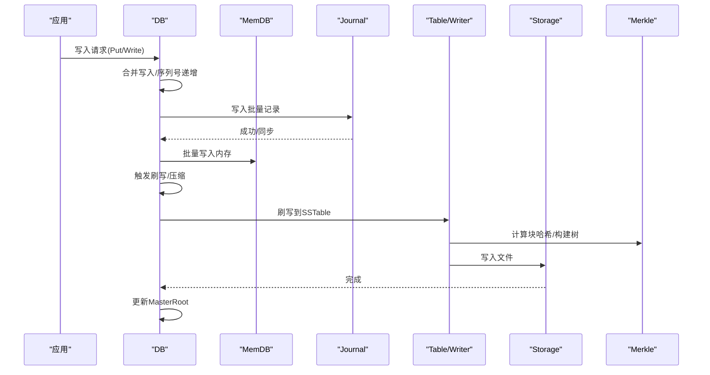
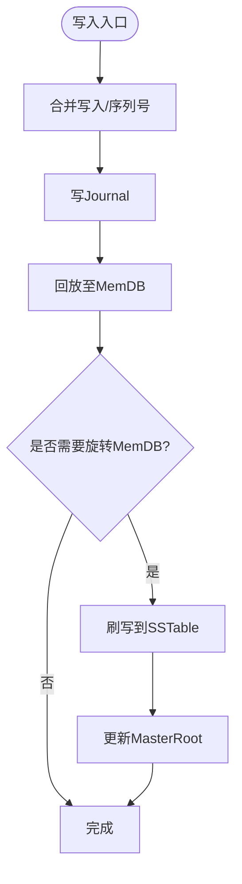
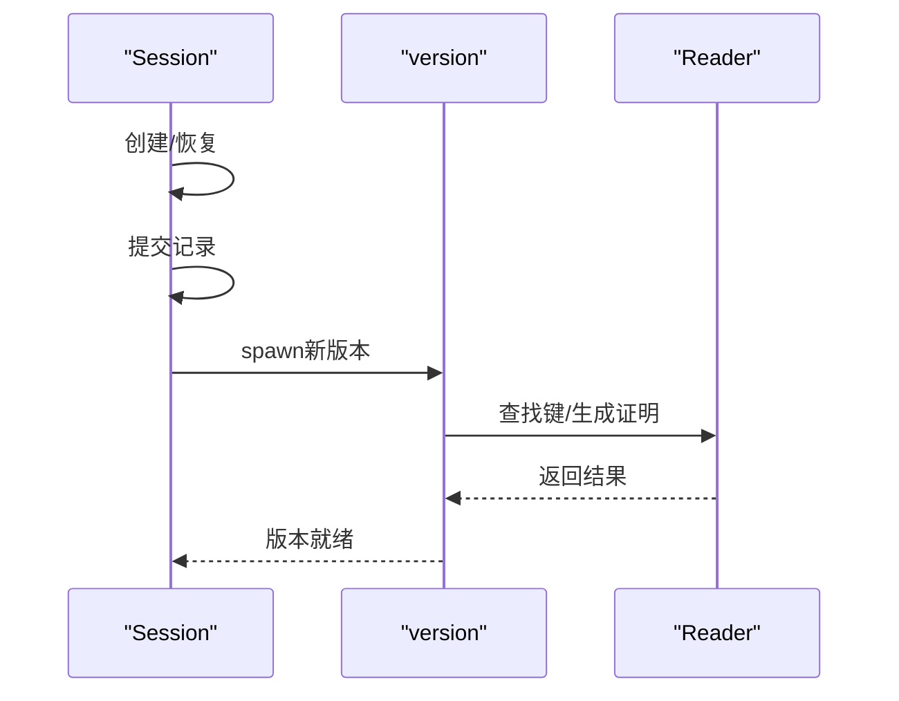
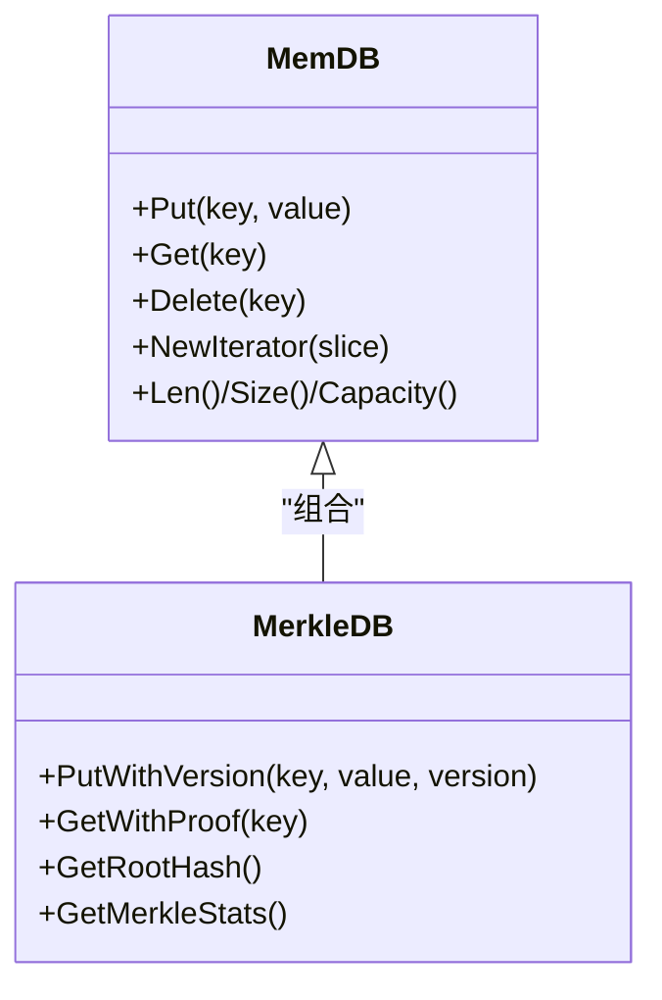
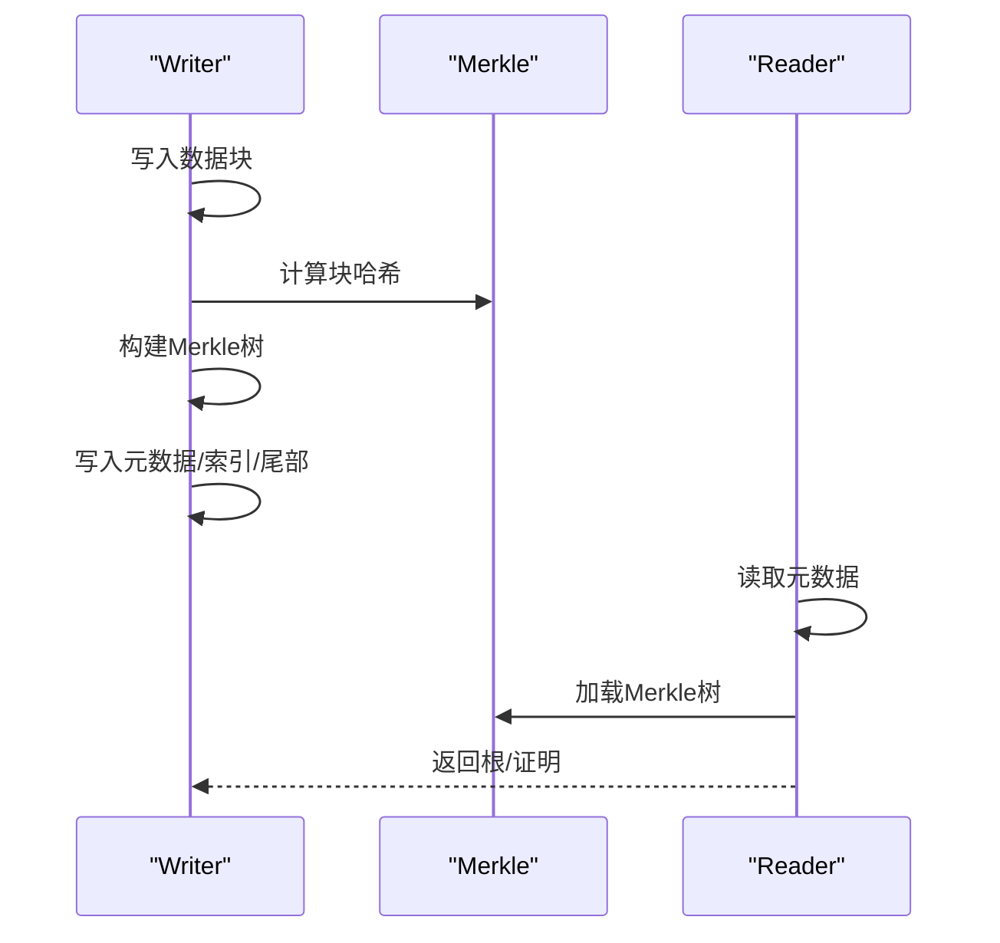
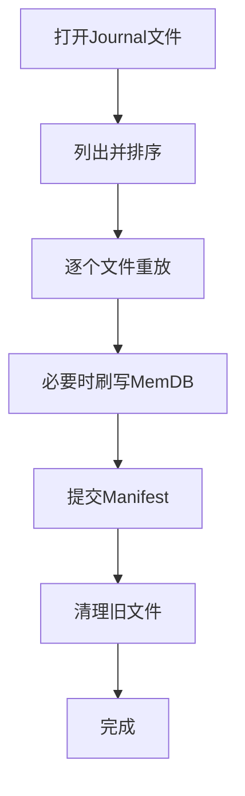
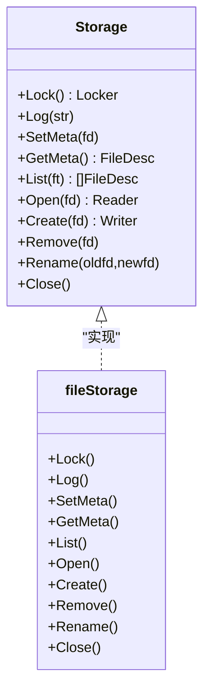
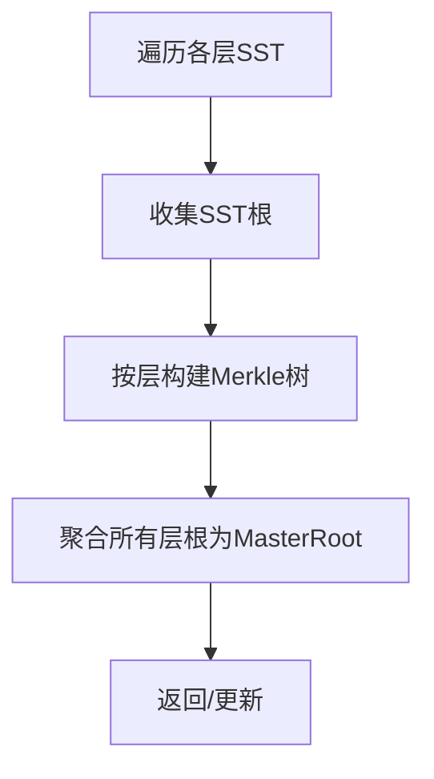
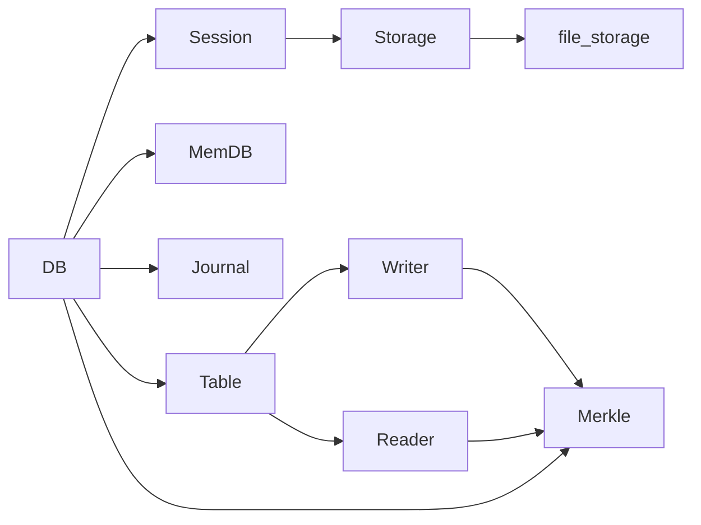

# 技术架构

<cite>
**本文引用的文件**
- [leveldb/db.go](file://leveldb/db.go)
- [leveldb/session.go](file://leveldb/session.go)
- [leveldb/memdb/memdb.go](file://leveldb/memdb/memdb.go)
- [leveldb/memdb/memdb_merkle.go](file://leveldb/memdb/memdb_merkle.go)
- [leveldb/table/table.go](file://leveldb/table/table.go)
- [leveldb/table/writer.go](file://leveldb/table/writer.go)
- [leveldb/table/reader.go](file://leveldb/table/reader.go)
- [leveldb/journal/journal.go](file://leveldb/journal/journal.go)
- [leveldb/storage/storage.go](file://leveldb/storage/storage.go)
- [leveldb/storage/file_storage.go](file://leveldb/storage/file_storage.go)
- [leveldb/version.go](file://leveldb/version.go)
- [leveldb/db_write.go](file://leveldb/db_write.go)
- [leveldb/db_iter.go](file://leveldb/db_iter.go)
- [leveldb/merkle/tree.go](file://leveldb/merkle/tree.go)
</cite>

## 目录
1. [引言](#引言)
2. [项目结构](#项目结构)
3. [核心组件](#核心组件)
4. [架构总览](#架构总览)
5. [详细组件分析](#详细组件分析)
6. [依赖关系分析](#依赖关系分析)
7. [性能考量](#性能考量)
8. [故障排查指南](#故障排查指南)
9. [结论](#结论)

## 引言
本文件面向 avccDB 的技术架构，聚焦于其分层设计与核心组件间的交互关系。重点阐述 DB 类作为主入口如何协调 Session、MemDB、SSTable（Table）、Merkle 树与 Storage 等模块；解析 mLSM（Merkle 增强型日志结构化合并树）的设计原理，覆盖写入路径（DB → MemDB → Journal → SSTable）与读取路径（DB → MemDB/SSTable），并结合观察者模式、迭代器模式等设计模式进行说明。同时，从存储层抽象与 Merkle 树集成角度分析跨层验证能力，并讨论性能与安全性之间的架构权衡。

## 项目结构
avccDB 采用清晰的分层组织：
- 应用层：DB 入口与对外 API（读写、快照、迭代器、统计）
- 会话层：Session 负责元信息（Manifest/Journal/文件号）与版本管理
- 内存层：MemDB 提供内存键值存储与可选 Merkle 支持
- 表层：Table 负责 SSTable 的读写、块索引与过滤器
- 日志层：Journal 负责写入顺序记录与崩溃恢复
- 存储层：Storage 接口抽象文件系统/内存存储，file_storage 实现文件系统后端
- Merkle 层：Merkle 树用于构建层级聚合根，支撑跨层验证

图表来源
- [leveldb/db.go](file://leveldb/db.go#L1-L200)
- [leveldb/session.go](file://leveldb/session.go#L1-L120)
- [leveldb/memdb/memdb.go](file://leveldb/memdb/memdb.go#L1-L120)
- [leveldb/memdb/memdb_merkle.go](file://leveldb/memdb/memdb_merkle.go#L1-L80)
- [leveldb/table/table.go](file://leveldb/table/table.go#L1-L120)
- [leveldb/table/writer.go](file://leveldb/table/writer.go#L1-L120)
- [leveldb/table/reader.go](file://leveldb/table/reader.go#L1-L120)
- [leveldb/journal/journal.go](file://leveldb/journal/journal.go#L1-L120)
- [leveldb/storage/storage.go](file://leveldb/storage/storage.go#L1-L120)
- [leveldb/storage/file_storage.go](file://leveldb/storage/file_storage.go#L1-L120)
- [leveldb/merkle/tree.go](file://leveldb/merkle/tree.go#L1-L80)

章节来源
- [leveldb/db.go](file://leveldb/db.go#L1-L200)
- [leveldb/session.go](file://leveldb/session.go#L1-L120)
- [leveldb/storage/storage.go](file://leveldb/storage/storage.go#L1-L120)

## 核心组件
- DB：数据库主入口，负责写入合并、序列号管理、快照、迭代器、统计与 MasterRoot 维护
- Session：持久化会话，维护 Manifest/Journal/文件号与版本链，负责提交与恢复
- MemDB：内存键值存储，支持并发读写与迭代器；可选集成 MerkleDB
- Table/Reader/Writer：SSTable 的读写实现，包含块结构、索引、过滤器与可选 Merkle 树
- Journal：顺序日志，保证崩溃恢复与重放
- Storage：存储抽象接口，file_storage 提供文件系统实现
- Merkle：Merkle 树与证明生成，贯穿表层与内存层，形成 MasterRoot 聚合

章节来源
- [leveldb/db.go](file://leveldb/db.go#L1-L200)
- [leveldb/session.go](file://leveldb/session.go#L1-L120)
- [leveldb/memdb/memdb.go](file://leveldb/memdb/memdb.go#L1-L120)
- [leveldb/memdb/memdb_merkle.go](file://leveldb/memdb/memdb_merkle.go#L1-L80)
- [leveldb/table/table.go](file://leveldb/table/table.go#L1-L120)
- [leveldb/table/writer.go](file://leveldb/table/writer.go#L1-L120)
- [leveldb/table/reader.go](file://leveldb/table/reader.go#L1-L120)
- [leveldb/journal/journal.go](file://leveldb/journal/journal.go#L1-L120)
- [leveldb/storage/storage.go](file://leveldb/storage/storage.go#L1-L120)
- [leveldb/storage/file_storage.go](file://leveldb/storage/file_storage.go#L1-L120)
- [leveldb/merkle/tree.go](file://leveldb/merkle/tree.go#L1-L80)

## 架构总览
avccDB 采用“日志结构化合并树”（LSM）思想，通过多层有序结构（Level 0~N）与压缩策略实现高吞吐写入与高效读取。mLSM 在此基础上增强 Merkle 树，使每层 SSTable 与层级聚合具备可验证性，最终由 DB 维护 MasterRoot，实现全量跨层验证。

图表来源
- [leveldb/db_write.go](file://leveldb/db_write.go#L1-L120)
- [leveldb/journal/journal.go](file://leveldb/journal/journal.go#L1-L120)
- [leveldb/table/writer.go](file://leveldb/table/writer.go#L1-L120)
- [leveldb/db.go](file://leveldb/db.go#L1400-L1580)

## 详细组件分析

### DB 主入口与控制流
- 写入流程：DB 通过 writeLocked 将批量写入合并、写入 Journal 并回放到 MemDB，必要时触发刷写与压缩；支持同步选项与写入合并优化
- 读取流程：优先检查辅助 MemDB（auxm），再检查有效/冻结 MemDB，最后通过 Session 版本在 SSTable 中查找；支持最新版本与指定版本查询
- 迭代器：DB 新建原始迭代器，合并 MemDB 与 SSTable 迭代器，屏蔽版本差异
- 统计与属性：提供统计信息、打开表数量、缓存状态、压缩次数等
- MasterRoot：DB 维护全局聚合根，基于各层 SSTable 根与 MemDB 根（待集成）计算

图表来源
- [leveldb/db_write.go](file://leveldb/db_write.go#L120-L330)
- [leveldb/db.go](file://leveldb/db.go#L1480-L1580)

章节来源
- [leveldb/db_write.go](file://leveldb/db_write.go#L1-L330)
- [leveldb/db_iter.go](file://leveldb/db_iter.go#L1-L120)
- [leveldb/db.go](file://leveldb/db.go#L780-L932)
- [leveldb/db.go](file://leveldb/db.go#L1480-L1580)

### Session 与版本管理
- Session 负责元信息（Manifest/Journal/文件号）与版本链管理，提供创建、恢复、提交与版本切换
- version 结构维护各层 SSTable 集合，walkOverlapping 按需扫描重叠范围，get/getWithProof 支持版本匹配与证明返回
- 版本演进通过 commit/newManifest 控制，避免阻塞并保持一致性

图表来源
- [leveldb/session.go](file://leveldb/session.go#L120-L243)
- [leveldb/version.go](file://leveldb/version.go#L1-L120)
- [leveldb/version.go](file://leveldb/version.go#L120-L220)

章节来源
- [leveldb/session.go](file://leveldb/session.go#L1-L243)
- [leveldb/version.go](file://leveldb/version.go#L1-L220)

### MemDB 与 MerkleDB
- MemDB：基于跳表结构的内存 KV 存储，支持并发读写、迭代器与容量/大小统计
- MerkleDB：在 MemDB 基础上增加 Merkle 树构建与证明生成，支持版本化键值（待完善内部编码）

图表来源
- [leveldb/memdb/memdb.go](file://leveldb/memdb/memdb.go#L1-L200)
- [leveldb/memdb/memdb_merkle.go](file://leveldb/memdb/memdb_merkle.go#L1-L120)

章节来源
- [leveldb/memdb/memdb.go](file://leveldb/memdb/memdb.go#L1-L200)
- [leveldb/memdb/memdb_merkle.go](file://leveldb/memdb/memdb_merkle.go#L1-L120)

### Table/SSTable 与 Merkle 集成
- Writer：按块写入，支持 Snappy 压缩与校验；启用 Merkle 时收集块哈希并构建 Merkle 树，写入元数据块
- Reader：按块读取，支持过滤器与校验；可加载 Merkle 树以支持证明生成与根哈希获取
- Merkle 树：Writer/Reader 分别维护 Merkle 树，用于表级验证

图表来源
- [leveldb/table/writer.go](file://leveldb/table/writer.go#L1-L120)
- [leveldb/table/writer.go](file://leveldb/table/writer.go#L300-L490)
- [leveldb/table/reader.go](file://leveldb/table/reader.go#L1-L120)
- [leveldb/table/reader.go](file://leveldb/table/reader.go#L500-L700)

章节来源
- [leveldb/table/writer.go](file://leveldb/table/writer.go#L1-L490)
- [leveldb/table/reader.go](file://leveldb/table/reader.go#L1-L800)

### Journal 与崩溃恢复
- Journal Reader/Writer：按 32KB 块写入，支持校验与多段日志；严格模式下遇到损坏会中止或跳过
- DB 恢复：按文件号排序重放 Journal 至 MemDB，必要时触发刷写与清理

图表来源
- [leveldb/journal/journal.go](file://leveldb/journal/journal.go#L1-L120)
- [leveldb/db.go](file://leveldb/db.go#L499-L666)

章节来源
- [leveldb/journal/journal.go](file://leveldb/journal/journal.go#L1-L120)
- [leveldb/db.go](file://leveldb/db.go#L499-L666)

### Storage 抽象与文件系统实现
- Storage 接口定义了锁、日志、元信息、文件列表、打开/创建/删除/重命名与关闭等能力
- file_storage 实现文件系统后端，处理 CURRENT 文件、日志轮转、目录同步与只读保护

图表来源
- [leveldb/storage/storage.go](file://leveldb/storage/storage.go#L1-L189)
- [leveldb/storage/file_storage.go](file://leveldb/storage/file_storage.go#L1-L120)

章节来源
- [leveldb/storage/storage.go](file://leveldb/storage/storage.go#L1-L189)
- [leveldb/storage/file_storage.go](file://leveldb/storage/file_storage.go#L1-L120)

### Merkle 树与 MasterRoot
- Merkle 树：支持存在/不存在证明、根哈希获取、更新叶子与统计
- DB MasterRoot：遍历当前版本各层 SSTable 根，构建层级聚合树，最终得到 MasterRoot；MemDB 根（待集成）可加入聚合

图表来源
- [leveldb/merkle/tree.go](file://leveldb/merkle/tree.go#L1-L120)
- [leveldb/db.go](file://leveldb/db.go#L1491-L1560)

章节来源
- [leveldb/merkle/tree.go](file://leveldb/merkle/tree.go#L1-L120)
- [leveldb/db.go](file://leveldb/db.go#L1491-L1560)

## 依赖关系分析
- DB 依赖 Session 管理版本与元信息，依赖 MemDB/Journal 实现写入路径，依赖 Table/Reader/Writer 处理持久化
- Table Writer/Reader 依赖 Merkle 生成块级与表级 Merkle 树
- Storage 抽象被 Session 与 Table 使用，file_storage 提供具体实现
- Merkle 树贯穿表层与内存层，DB 通过 MasterRoot 进行跨层聚合验证

图表来源
- [leveldb/db.go](file://leveldb/db.go#L1-L200)
- [leveldb/session.go](file://leveldb/session.go#L1-L120)
- [leveldb/table/writer.go](file://leveldb/table/writer.go#L1-L120)
- [leveldb/table/reader.go](file://leveldb/table/reader.go#L1-L120)
- [leveldb/storage/storage.go](file://leveldb/storage/storage.go#L1-L120)
- [leveldb/storage/file_storage.go](file://leveldb/storage/file_storage.go#L1-L120)
- [leveldb/merkle/tree.go](file://leveldb/merkle/tree.go#L1-L80)

章节来源
- [leveldb/db.go](file://leveldb/db.go#L1-L200)
- [leveldb/table/writer.go](file://leveldb/table/writer.go#L1-L120)
- [leveldb/table/reader.go](file://leveldb/table/reader.go#L1-L120)
- [leveldb/storage/storage.go](file://leveldb/storage/storage.go#L1-L120)
- [leveldb/storage/file_storage.go](file://leveldb/storage/file_storage.go#L1-L120)
- [leveldb/merkle/tree.go](file://leveldb/merkle/tree.go#L1-L80)

## 性能考量
- 写入路径优化：批量合并写入、写入合并池、延迟与暂停写入策略，降低写放大
- 读取路径优化：迭代器合并、按层重叠扫描、过滤器命中、块缓存与预取
- 压缩与校验：Snappy 压缩与 CRC 校验在 Writer 中完成，减少磁盘占用与提升可靠性
- Merkle 树：块级哈希与树构建带来额外 CPU 开销，但提供跨层验证能力；可通过配置开关与懒构建策略平衡

## 故障排查指南
- Journal 损坏：Journal Reader 支持严格模式与跳过策略，定位损坏块并决定是否终止
- Manifest 损坏：Session 恢复阶段校验比较器与文件号，不满足条件返回错误
- 表损坏：Table Reader 对块与索引进行校验，发现不一致抛出错误并附带位置信息
- 存储异常：file_storage 对只读模式、文件打开计数与目录同步进行保护

章节来源
- [leveldb/journal/journal.go](file://leveldb/journal/journal.go#L1-L120)
- [leveldb/session.go](file://leveldb/session.go#L120-L243)
- [leveldb/table/reader.go](file://leveldb/table/reader.go#L1-L120)
- [leveldb/storage/file_storage.go](file://leveldb/storage/file_storage.go#L1-L120)

## 结论
avccDB 通过清晰的分层与模块化设计，实现了高性能 LSM 存储与可验证性增强（mLSM）。DB 作为主入口协调 Session、MemDB、Journal、Table 与 Storage，结合 Merkle 树在表层与内存层提供跨层验证能力。MasterRoot 的引入使得全量一致性可被外部验证，满足安全与审计需求。在性能与安全性之间，系统通过压缩、缓存、批处理与严格校验等机制达成平衡，适合对一致性与可验证性有较高要求的应用场景。