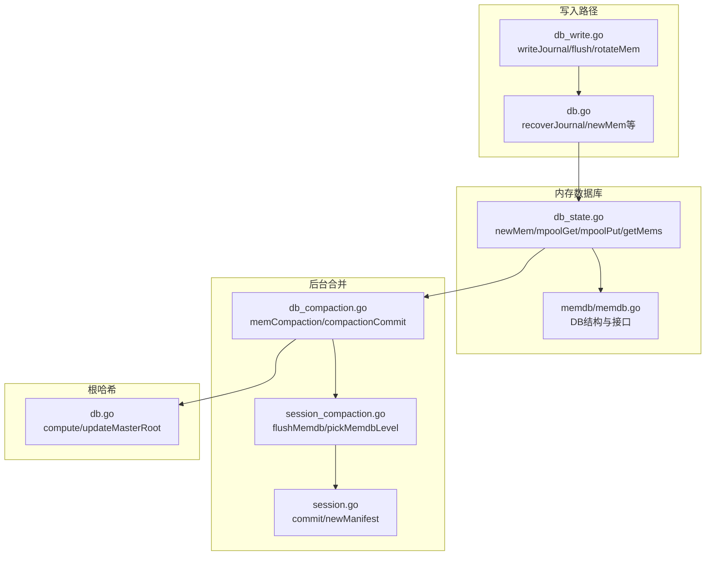
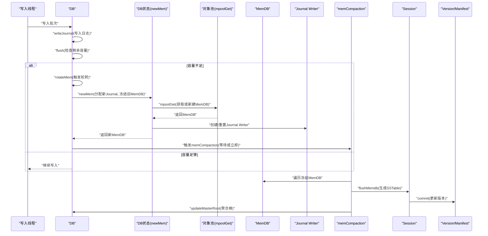
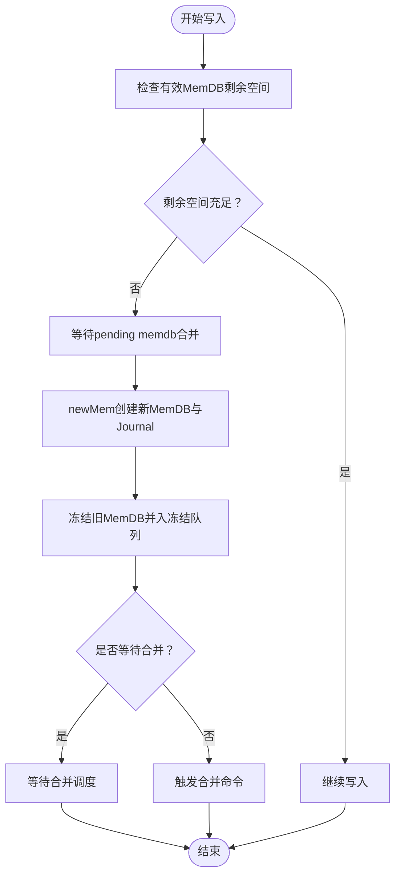
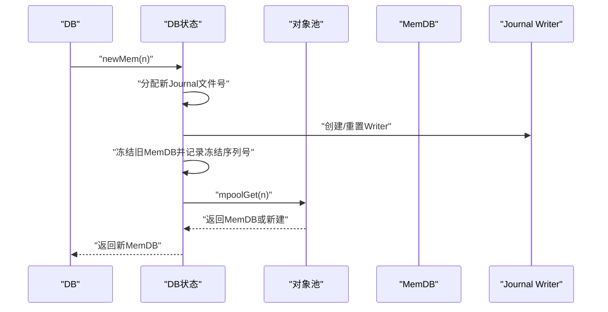
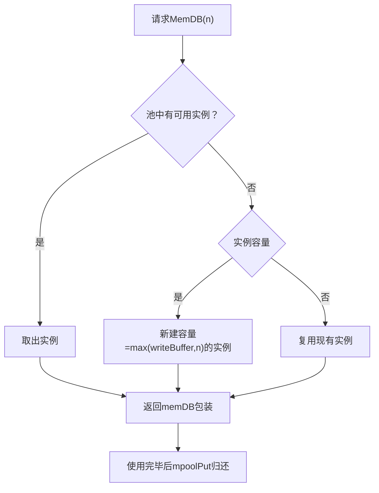
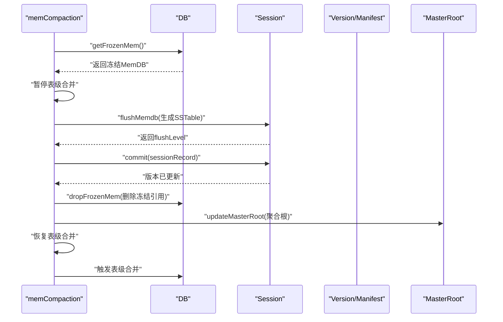
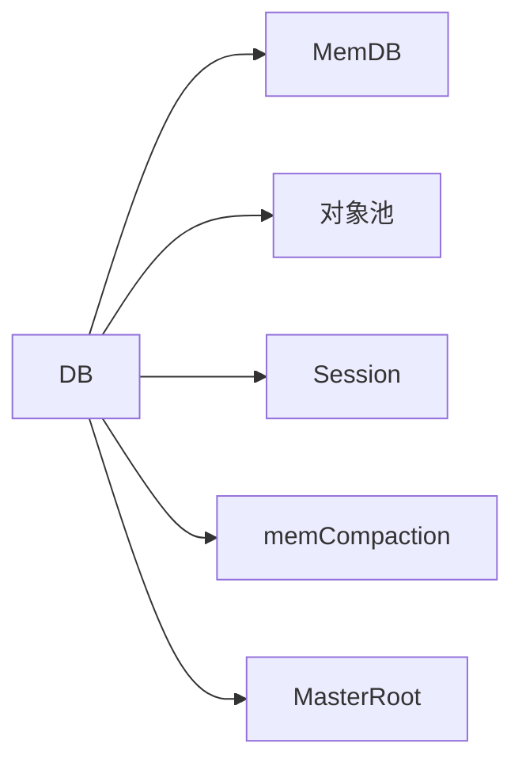

# Flush触发与MemDB轮转

<cite>
**本文引用的文件**
- [db.go](file://leveldb/db.go)
- [db_write.go](file://leveldb/db_write.go)
- [db_state.go](file://leveldb/db_state.go)
- [db_compaction.go](file://leveldb/db_compaction.go)
- [session_compaction.go](file://leveldb/session_compaction.go)
- [session.go](file://leveldb/session.go)
- [memdb.go](file://leveldb/memdb/memdb.go)
- [db.go（MasterRoot相关）](file://leveldb/db.go#L1525-L1571)
</cite>

## 目录
1. [简介](#简介)
2. [项目结构](#项目结构)
3. [核心组件](#核心组件)
4. [架构总览](#架构总览)
5. [详细组件分析](#详细组件分析)
6. [依赖关系分析](#依赖关系分析)
7. [性能考量](#性能考量)
8. [故障排查指南](#故障排查指南)
9. [结论](#结论)

## 简介
本技术文档围绕MemDB的Flush触发机制展开，系统性阐述以下关键流程：
- 当写入数据量达到或超过MemDB剩余容量时，如何通过rotateMem触发MemDB轮转。
- newMem如何创建新的MemDB实例并分配新的Journal文件号，同时将当前MemDB冻结为只读并进入冻结队列。
- mpoolGet与mpoolPut如何管理MemDB对象池以提升性能。
- memCompaction后台goroutine如何将冻结的MemDB数据持久化为SSTable文件，并在完成后更新版本信息与MasterRoot哈希。

## 项目结构
围绕Flush与轮转的核心代码分布在以下模块：
- 写入与轮转：leveldb/db_write.go、leveldb/db.go
- MemDB轮转与对象池：leveldb/db_state.go
- 后台合并与提交：leveldb/db_compaction.go、leveldb/session_compaction.go、leveldb/session.go
- MemDB实现：leveldb/memdb/memdb.go
- MasterRoot聚合：leveldb/db.go（MasterRoot相关）

图表来源
- [db_write.go](file://leveldb/db_write.go#L1-L130)
- [db.go](file://leveldb/db.go#L499-L666)
- [db_state.go](file://leveldb/db_state.go#L74-L181)
- [db_compaction.go](file://leveldb/db_compaction.go#L269-L354)
- [session_compaction.go](file://leveldb/session_compaction.go#L30-L53)
- [session.go](file://leveldb/session.go#L210-L242)
- [memdb.go](file://leveldb/memdb/memdb.go#L181-L480)
- [db.go（MasterRoot相关）](file://leveldb/db.go#L1525-L1571)

章节来源
- [db_write.go](file://leveldb/db_write.go#L1-L130)
- [db.go](file://leveldb/db.go#L499-L666)
- [db_state.go](file://leveldb/db_state.go#L74-L181)
- [db_compaction.go](file://leveldb/db_compaction.go#L269-L354)
- [session_compaction.go](file://leveldb/session_compaction.go#L30-L53)
- [session.go](file://leveldb/session.go#L210-L242)
- [memdb.go](file://leveldb/memdb/memdb.go#L181-L480)
- [db.go（MasterRoot相关）](file://leveldb/db.go#L1525-L1571)

## 核心组件
- MemDB（内存键值数据库）：提供Put/Delete/Get/迭代器等能力，记录kvData与nodeData，支持并发安全访问。
- DB（数据库主控）：维护当前MemDB与冻结MemDB、Journal Writer/文件描述符、序列号、对象池、后台合并通道等。
- 会话（session）：负责Manifest管理、表操作、flushMemdb等持久化逻辑。
- 后台合并（memCompaction）：从冻结MemDB生成SSTable，提交到版本并更新MasterRoot。

章节来源
- [memdb.go](file://leveldb/memdb/memdb.go#L181-L480)
- [db.go](file://leveldb/db.go#L33-L110)
- [session_compaction.go](file://leveldb/session_compaction.go#L30-L53)
- [db_compaction.go](file://leveldb/db_compaction.go#L269-L354)

## 架构总览
下图展示Flush触发与轮转的关键调用链路：

图表来源
- [db_write.go](file://leveldb/db_write.go#L1-L130)
- [db_state.go](file://leveldb/db_state.go#L120-L181)
- [db_compaction.go](file://leveldb/db_compaction.go#L269-L354)
- [session_compaction.go](file://leveldb/session_compaction.go#L30-L53)
- [session.go](file://leveldb/session.go#L210-L242)
- [db.go（MasterRoot相关）](file://leveldb/db.go#L1525-L1571)

## 详细组件分析

### Flush触发与rotateMem轮转
- 触发条件：当待写入批次的内部长度大于等于当前有效MemDB的剩余空间时，触发轮转。
- 流程要点：
  - 先等待pending的memdb合并完成，避免并发冲突。
  - 调用newMem创建新MemDB与新Journal文件，冻结当前MemDB并将其加入冻结队列。
  - 根据wait参数决定是否等待合并调度；否则仅触发一次合并命令。
- 关键路径参考：
  - [rotateMem](file://leveldb/db_write.go#L35-L63)
  - [flush中触发轮转](file://leveldb/db_write.go#L256-L262)

图表来源
- [db_write.go](file://leveldb/db_write.go#L35-L63)
- [db_state.go](file://leveldb/db_state.go#L120-L181)

章节来源
- [db_write.go](file://leveldb/db_write.go#L35-L63)
- [db_write.go](file://leveldb/db_write.go#L256-L262)

### newMem：创建新MemDB与冻结旧MemDB
- 分配新的Journal文件号并创建Journal Writer；若已有Journal则重置并关闭旧Writer，记录冻结的Journal文件描述符。
- 将当前MemDB设为冻结状态，保存冻结时的序列号，以便后续flush与版本记录。
- 通过mpoolGet获取或新建MemDB实例，并增加引用计数（自身与调用者各一次）。
- 关键路径参考：
  - [newMem](file://leveldb/db_state.go#L120-L181)

图表来源
- [db_state.go](file://leveldb/db_state.go#L120-L181)
- [db_state.go](file://leveldb/db_state.go#L74-L118)

章节来源
- [db_state.go](file://leveldb/db_state.go#L120-L181)
- [db_state.go](file://leveldb/db_state.go#L74-L118)

### mpoolGet与mpoolPut：MemDB对象池管理
- mpoolGet：
  - 优先从池中取出可用的MemDB实例；若容量小于请求n，则新建一个容量为max(writeBuffer, n)的实例。
  - 返回包装后的memDB（持有DB指针与底层memdb.DB）。
- mpoolPut：
  - 在未关闭且池未满的情况下，将MemDB放回池中；否则丢弃。
- mpoolDrain：
  - 周期性清理池中过期实例，确保资源回收。
- 关键路径参考：
  - [mpoolGet](file://leveldb/db_state.go#L83-L96)
  - [mpoolPut](file://leveldb/db_state.go#L74-L81)
  - [mpoolDrain](file://leveldb/db_state.go#L98-L118)

图表来源
- [db_state.go](file://leveldb/db_state.go#L74-L118)
- [db_state.go](file://leveldb/db_state.go#L83-L96)

章节来源
- [db_state.go](file://leveldb/db_state.go#L74-L118)
- [db_state.go](file://leveldb/db_state.go#L83-L96)

### memCompaction：后台持久化与版本更新
- 获取冻结MemDB；若为空直接跳过。
- 暂停表级合并，防止与冻结MemDB的flush相互干扰。
- 使用session.flushMemdb将冻结MemDB中的键值对按排序生成SSTable，并记录到sessionRecord。
- 设置Journal文件号与冻结序列号，提交到版本并更新统计。
- 删除冻结MemDB引用并释放对应Journal文件。
- 更新MasterRoot，最后恢复表级合并并触发一次表级合并。
- 关键路径参考：
  - [memCompaction](file://leveldb/db_compaction.go#L269-L354)
  - [flushMemdb](file://leveldb/session_compaction.go#L30-L53)
  - [commit](file://leveldb/session.go#L210-L242)
  - [updateMasterRoot](file://leveldb/db.go#L1562-L1571)

图表来源
- [db_compaction.go](file://leveldb/db_compaction.go#L269-L354)
- [session_compaction.go](file://leveldb/session_compaction.go#L30-L53)
- [session.go](file://leveldb/session.go#L210-L242)
- [db.go（MasterRoot相关）](file://leveldb/db.go#L1525-L1571)

章节来源
- [db_compaction.go](file://leveldb/db_compaction.go#L269-L354)
- [session_compaction.go](file://leveldb/session_compaction.go#L30-L53)
- [session.go](file://leveldb/session.go#L210-L242)
- [db.go（MasterRoot相关）](file://leveldb/db.go#L1525-L1571)

### MemDB数据结构与并发安全
- MemDB内部使用kvData与nodeData存储键值与跳表节点元数据，提供Put/Delete/Get/Find/NewIterator等方法。
- 并发控制通过互斥锁保护关键字段，迭代器在读锁下工作，写操作在写锁下进行。
- 关键路径参考：
  - [MemDB结构与方法](file://leveldb/memdb/memdb.go#L181-L480)

章节来源
- [memdb.go](file://leveldb/memdb/memdb.go#L181-L480)

## 依赖关系分析
- DB对MemDB的依赖：DB持有当前与冻结的MemDB指针，负责轮转、冻结与合并调度。
- DB对对象池的依赖：通过mpoolGet/mpoolPut在创建与复用MemDB实例时降低分配成本。
- DB对Session的依赖：flushMemdb、commit、newManifest等持久化操作由Session封装。
- DB对后台合并的依赖：memCompaction在独立goroutine中运行，处理冻结MemDB的持久化。
- DB对MasterRoot的依赖：每次flush完成后更新聚合根，保证全局一致性。

图表来源
- [db.go](file://leveldb/db.go#L33-L110)
- [db_state.go](file://leveldb/db_state.go#L74-L118)
- [session_compaction.go](file://leveldb/session_compaction.go#L30-L53)
- [db_compaction.go](file://leveldb/db_compaction.go#L269-L354)
- [db.go（MasterRoot相关）](file://leveldb/db.go#L1525-L1571)

章节来源
- [db.go](file://leveldb/db.go#L33-L110)
- [db_state.go](file://leveldb/db_state.go#L74-L118)
- [session_compaction.go](file://leveldb/session_compaction.go#L30-L53)
- [db_compaction.go](file://leveldb/db_compaction.go#L269-L354)
- [db.go（MasterRoot相关）](file://leveldb/db.go#L1525-L1571)

## 性能考量
- 对象池复用：通过mpoolGet/mpoolPut减少频繁分配与GC压力，提升高并发写入场景下的吞吐。
- 写入延迟与暂停：当Level-0表数量达到阈值时，写入可能被延迟或暂停，等待表级合并缓解压力。
- 合并背压：memCompaction在执行期间暂停表级合并，避免竞争导致的抖动。
- MasterRoot聚合：仅在flush完成后更新，避免频繁计算带来的额外开销。

[本节为通用性能讨论，不直接分析具体文件]

## 故障排查指南
- 冻结MemDB未释放：确认memCompaction是否成功完成并调用dropFrozenMem。
- Journal文件残留：检查newMem是否正确关闭旧Journal Writer并记录冻结文件描述符。
- 版本未更新：核对compactionCommit是否成功提交sessionRecord。
- MasterRoot异常：确认updateMasterRoot是否被调用，以及computeMasterRoot的聚合逻辑。

章节来源
- [db_state.go](file://leveldb/db_state.go#L198-L210)
- [db_compaction.go](file://leveldb/db_compaction.go#L319-L354)
- [session.go](file://leveldb/session.go#L210-L242)
- [db.go（MasterRoot相关）](file://leveldb/db.go#L1562-L1571)

## 结论
MemDB的Flush触发与轮转机制通过writeJournal、flush与rotateMem形成闭环：当写入接近MemDB剩余容量时，系统自动冻结当前MemDB并创建新实例，随后由后台memCompaction将冻结数据持久化为SSTable，更新版本与MasterRoot，最终释放冻结资源。对象池机制进一步提升了整体性能与稳定性。该设计在保证数据一致性的前提下，实现了高效的写入与持久化路径。