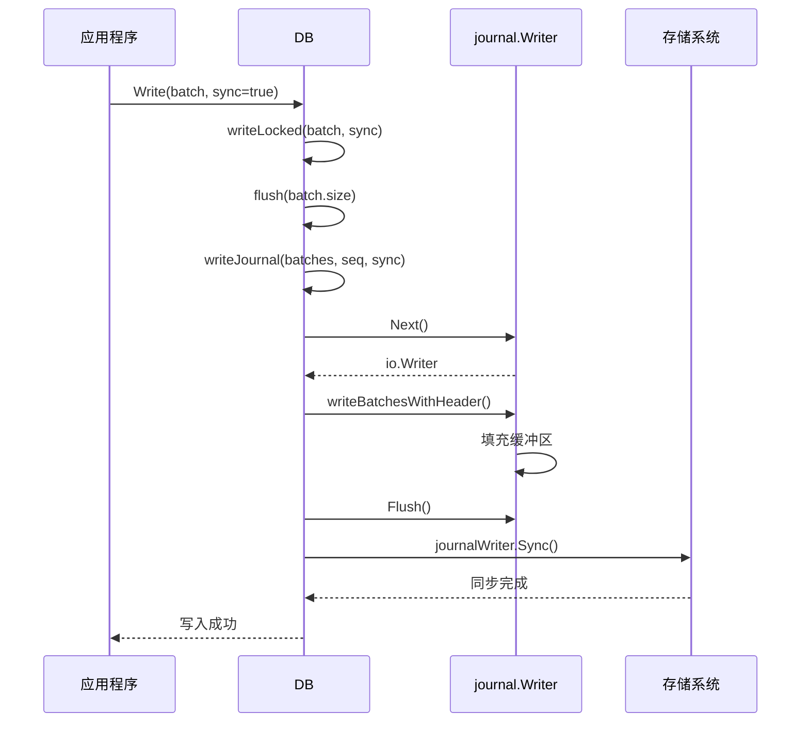
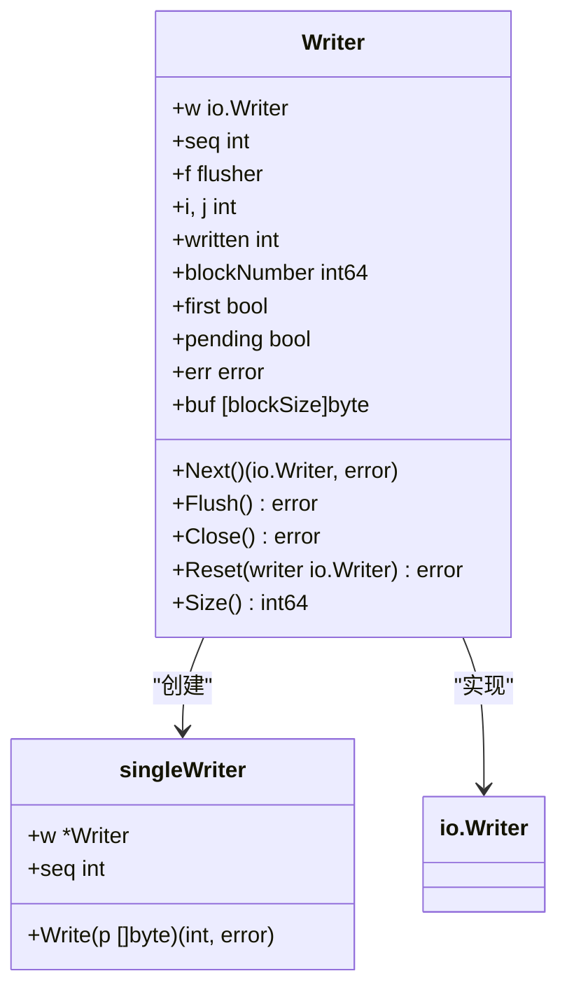
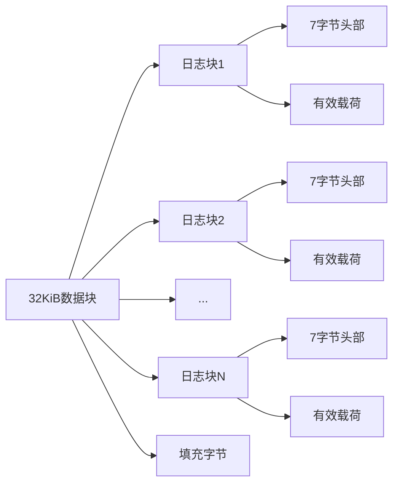
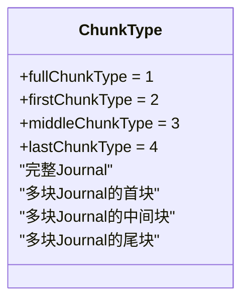
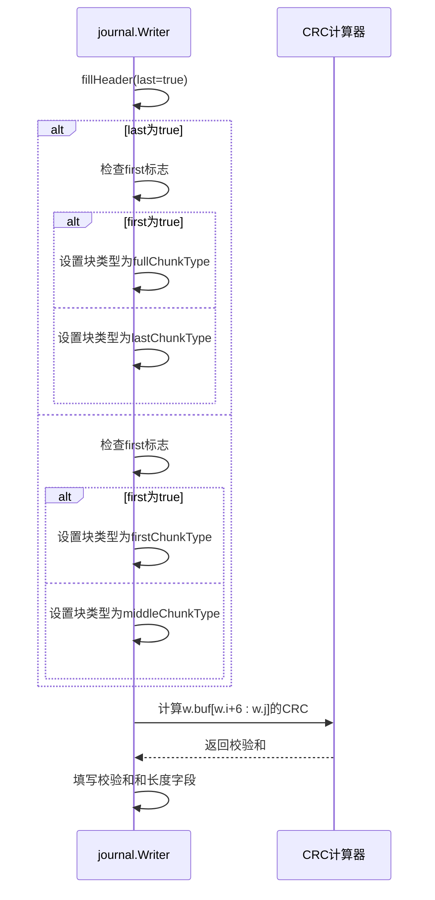
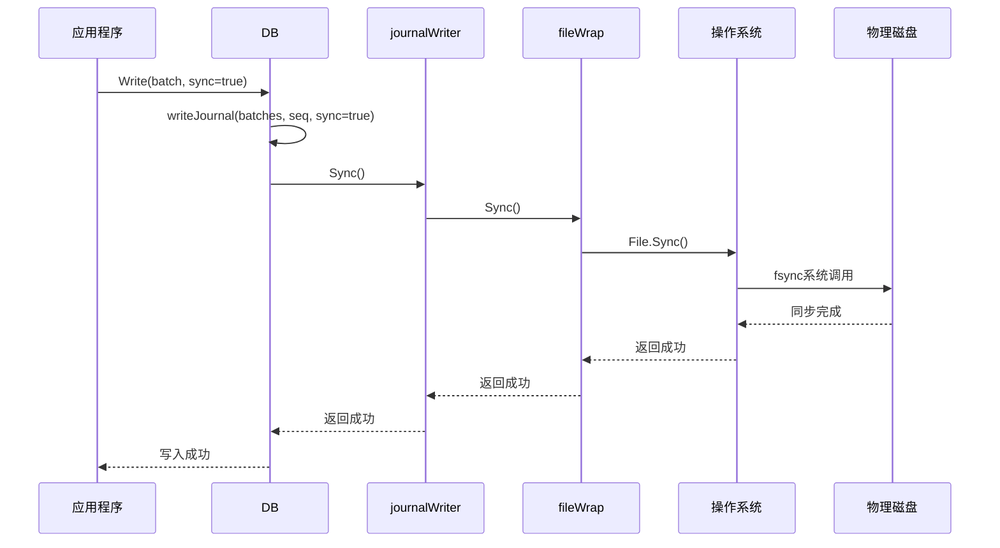

# Journal持久化机制

<cite>
**本文档引用的文件**   
- [journal.go](file://leveldb/journal/journal.go)
- [db_write.go](file://leveldb/db_write.go)
- [batch.go](file://leveldb/batch.go)
- [db.go](file://leveldb/db.go)
- [db_state.go](file://leveldb/db_state.go)
- [storage.go](file://leveldb/storage/storage.go)
- [file_storage.go](file://leveldb/storage/file_storage.go)
- [crc32.go](file://leveldb/util/crc32.go)
</cite>

## 目录
1. [引言](#引言)
2. [Journal持久化流程概述](#journal持久化流程概述)
3. [writeJournal方法分析](#writejournal方法分析)
4. [Journal写入器核心机制](#journal写入器核心机制)
5. [日志块格式结构](#日志块格式结构)
6. [数据持久化与同步](#数据持久化与同步)
7. [错误处理与恢复](#错误处理与恢复)
8. [总结](#总结)

## 引言
avccDB的Journal持久化机制是确保数据可靠性的关键组件。该机制通过将批次数据写入Journal文件来保证数据的持久性，即使在系统崩溃的情况下也能防止数据丢失。本文档详细说明了Journal持久化流程的核心组件和工作机制，包括writeJournal方法如何将批次数据写入Journal文件，journal.Writer的Next()方法如何分配写入缓冲区，writeBatchesWithHeader如何序列化批次记录，以及Flush()和Sync()在持久化过程中的作用。

**Section sources**
- [journal.go](file://leveldb/journal/journal.go)
- [db_write.go](file://leveldb/db_write.go)

## Journal持久化流程概述
avccDB的Journal持久化流程是一个多步骤的过程，涉及从内存到磁盘的数据写入。该流程的核心是将批次数据（Batch）写入Journal文件，以确保数据的持久性。整个流程可以分为以下几个关键步骤：

1. **批次数据准备**：应用程序将多个写操作（Put/Delete）组合成一个批次（Batch），以提高写入效率。
2. **Journal文件写入**：通过writeJournal方法将批次数据写入Journal文件。
3. **缓冲区管理**：使用journal.Writer的Next()方法分配写入缓冲区，并管理数据块的写入。
4. **数据序列化**：通过writeBatchesWithHeader方法将批次记录序列化为字节流。
5. **持久化与同步**：通过Flush()和Sync()方法确保数据被写入磁盘。

该流程的设计考虑了性能和数据安全性的平衡，通过批量写入和适当的同步策略来优化性能，同时确保关键数据的持久性。

```mermaid
flowchart TD
A[应用程序写入] --> B[批次数据准备]
B --> C[调用writeJournal]
C --> D[获取Journal Writer]
D --> E[序列化批次数据]
E --> F[写入缓冲区]
F --> G{sync=true?}
G --> |是| H[调用Sync()]
G --> |否| I[返回成功]
H --> J[确保数据刷入磁盘]
J --> K[返回成功]
I --> K
```

**Diagram sources**
- [db_write.go](file://leveldb/db_write.go#L18-L32)
- [journal.go](file://leveldb/journal/journal.go#L370-L448)

## writeJournal方法分析
writeJournal方法是Journal持久化流程的入口点，负责将批次数据写入Journal文件。该方法在db_write.go文件中定义，是整个持久化流程的核心。



**Diagram sources**
- [db_write.go](file://leveldb/db_write.go#L18-L32)
- [journal.go](file://leveldb/journal/journal.go#L470-L496)

writeJournal方法的执行流程如下：

1. **获取Journal Writer**：通过db.journal.Next()获取一个io.Writer，用于写入Journal文件。这个操作会分配一个写入缓冲区，并准备写入新的Journal记录。

2. **序列化批次数据**：调用writeBatchesWithHeader方法，将批次数据序列化为字节流。该方法首先写入批次头信息（包括序列号和批次长度），然后依次写入每个批次的数据。

3. **刷新缓冲区**：调用db.journal.Flush()方法，将缓冲区中的数据写入底层存储。这一步确保当前Journal记录被完整写入文件。

4. **同步到磁盘**：如果sync参数为true，则调用db.journalWriter.Sync()方法，确保操作系统将数据刷入物理磁盘，防止系统崩溃导致数据丢失。

writeJournal方法的关键特性包括：
- **原子性**：整个Journal记录的写入是原子的，要么全部成功，要么全部失败。
- **顺序性**：Journal记录按顺序写入，保证了数据的时序一致性。
- **可配置的持久性**：通过sync参数控制是否立即同步到磁盘，允许在性能和数据安全性之间进行权衡。

**Section sources**
- [db_write.go](file://leveldb/db_write.go#L18-L32)
- [batch.go](file://leveldb/batch.go#L402-L412)

## Journal写入器核心机制
Journal写入器的核心机制基于journal.Writer结构体实现，该结构体管理着Journal文件的写入过程。其核心组件包括缓冲区管理、块分配和写入控制。

### 缓冲区与块管理
journal.Writer使用一个固定大小的缓冲区（32KiB）来管理数据写入。缓冲区被划分为多个块，每个块包含一个或多个日志块（chunk）。这种设计优化了I/O操作，减少了系统调用的次数。



**Diagram sources**
- [journal.go](file://leveldb/journal/journal.go#L344-L367)

### Next()方法的工作原理
Next()方法是Journal写入器的核心，负责分配写入缓冲区并返回一个io.Writer用于写入数据。其工作流程如下：

1. **检查并完成当前Journal**：如果存在待处理的Journal记录（w.pending为true），则调用fillHeader(true)方法填充当前块的头部信息，将其标记为最后一个块。

2. **更新缓冲区指针**：将缓冲区的起始位置(w.i)设置为当前结束位置(w.j)，并为下一个块的头部预留7字节空间。

3. **处理块边界**：检查是否有足够的空间容纳新的头部信息。如果当前块空间不足，则填充剩余空间为零，并调用writeBlock()方法将整个块写入底层存储。

4. **标记新Journal开始**：设置w.first为true，表示这是一个新的Journal记录的开始，并设置w.pending为true表示有待处理的Journal。

5. **返回写入器**：返回一个singleWriter实例，该实例包装了journal.Writer，允许应用程序写入数据。

Next()方法的关键特性是它实现了Journal记录的边界管理，确保每个Journal记录正确地跨越块边界，并在必要时自动创建新的数据块。

### 写入过程
当应用程序通过返回的io.Writer写入数据时，singleWriter的Write方法会被调用。该方法的执行流程如下：

1. **检查写入器状态**：验证写入器是否仍然有效（未过期）。

2. **块满处理**：如果当前块已满（w.j == blockSize），则调用fillHeader(false)方法填充头部信息，将其标记为中间块，然后调用writeBlock()方法将块写入存储。

3. **数据复制**：将数据复制到缓冲区中，更新w.j指针。

4. **更新状态**：设置w.first为false，表示后续的块不再是Journal记录的第一个块。

这种机制确保了大批次数据可以跨越多个块写入，同时保持数据的连续性和完整性。

**Section sources**
- [journal.go](file://leveldb/journal/journal.go#L470-L536)
- [journal.go](file://leveldb/journal/journal.go#L511-L535)

## 日志块格式结构
Journal文件的格式结构是确保数据可靠性和可恢复性的关键。每个Journal记录被划分为一个或多个日志块（chunk），每个块都有特定的格式和校验机制。

### 块结构
Journal文件被划分为固定大小的32KiB块，每个块包含一个或多个紧密排列的日志块。块的结构如下：



**Diagram sources**
- [journal.go](file://leveldb/journal/journal.go#L62-L78)

每个日志块由7字节的头部和可变长度的有效载荷组成。头部包含以下信息：
- **4字节校验和**：基于Castagnoli多项式的CRC-32校验和，用于检测数据损坏。
- **2字节长度**：小端序的uint16，表示有效载荷的长度。
- **1字节类型**：标识块的类型（完整、首块、中间块或尾块）。

### 块类型
Journal支持四种类型的块，以处理跨越多个块的大型Journal记录：



**Diagram sources**
- [journal.go](file://leveldb/journal/journal.go#L92-L95)

- **完整块（fullChunkType = 1）**：包含整个Journal记录，不跨越块边界。
- **首块（firstChunkType = 2）**：多块Journal记录的第一个块。
- **中间块（middleChunkType = 3）**：多块Journal记录的中间块。
- **尾块（lastChunkType = 4）**：多块Journal记录的最后一个块。

### 头部填充机制
fillHeader方法负责填充日志块的头部信息，是确保数据完整性的关键。其工作流程如下：

1. **验证状态**：检查缓冲区状态是否有效，防止在错误状态下填充头部。

2. **设置块类型**：根据参数last和w.first的值确定块类型：
   - 如果是最后一个块且是第一个块，则为完整块
   - 如果是最后一个块但不是第一个块，则为尾块
   - 如果不是最后一个块但这是第一个块，则为首块
   - 如果不是最后一个块且不是第一个块，则为中间块

3. **计算校验和**：使用util.NewCRC方法计算从块类型字节到有效载荷末尾的CRC-32校验和。校验和算法使用Castagnoli多项式，提供更好的错误检测能力。

4. **写入长度**：将有效载荷长度写入头部的长度字段。



**Diagram sources**
- [journal.go](file://leveldb/journal/journal.go#L378-L398)
- [crc32.go](file://leveldb/util/crc32.go#L18-L29)

### writePending实现
writePending方法负责完成当前Journal记录的写入，是持久化过程的关键步骤：

1. **检查错误状态**：如果已有错误发生，则直接返回。

2. **完成待处理的Journal**：如果存在待处理的Journal记录（w.pending为true），则调用fillHeader(true)方法填充头部信息，将其标记为最后一个块，并将w.pending设置为false。

3. **写入数据**：将缓冲区中从w.written到w.j的所有数据写入底层存储。

4. **更新写入位置**：将w.written设置为w.j，表示这些数据已经成功写入。

writePending方法确保了Journal记录的完整性，只有在成功写入所有数据后才会更新状态，防止部分写入导致的数据不一致。

**Section sources**
- [journal.go](file://leveldb/journal/journal.go#L378-L398)
- [journal.go](file://leveldb/journal/journal.go#L410-L422)
- [crc32.go](file://leveldb/util/crc32.go#L18-L29)

## 数据持久化与同步
数据持久化与同步是Journal机制的核心目标，确保数据在系统崩溃时不会丢失。这一过程涉及多个层次的同步操作，从应用层到操作系统层。

### Flush()方法的作用
Flush()方法在Journal持久化过程中扮演着重要角色，其主要功能是完成当前Journal记录并刷新底层存储：

```mermaid
flowchart TD
A[调用Flush()] --> B[递增序列号]
B --> C[调用writePending()]
C --> D{是否有错误?}
D --> |是| E[返回错误]
D --> |否| F{底层Writer是否实现flusher?}
F --> |是| G[调用f.Flush()]
F --> |否| H[返回nil]
G --> I[返回错误或nil]
```

**Diagram sources**
- [journal.go](file://leveldb/journal/journal.go#L435-L448)

Flush()方法的执行流程如下：
1. 递增序列号，确保写入器的状态更新。
2. 调用writePending()方法完成当前Journal记录的写入。
3. 如果没有错误且底层Writer实现了flusher接口，则调用其Flush()方法。
4. 返回结果。

Flush()方法的关键作用是确保数据从应用程序缓冲区刷新到操作系统缓冲区，但不保证数据已写入物理磁盘。

### Sync()方法的实现
Sync()方法是确保数据持久化的最后一道防线，它确保数据被刷入物理存储设备。在avccDB中，Sync()的调用链如下：

1. **应用层调用**：当WriteOptions中的sync设置为true时，db.writeJournal方法会调用db.journalWriter.Sync()。

2. **存储层实现**：journalWriter是storage.Writer类型，其Sync()方法最终由底层文件系统的实现提供。

3. **文件系统同步**：对于文件存储，Sync()方法会调用操作系统的fsync系统调用，确保数据从操作系统缓冲区刷入物理磁盘。



**Diagram sources**
- [db_write.go](file://leveldb/db_write.go#L30)
- [file_storage.go](file://leveldb/storage/file_storage.go#L591-L603)

### 同步策略分析
avccDB的同步策略提供了灵活的数据持久性控制：

- **sync=false**：仅将数据写入操作系统缓冲区，提供最佳性能但较低的数据安全性。
- **sync=true**：确保数据被刷入物理磁盘，提供最高级别的数据安全性但性能较低。

这种设计允许应用程序根据具体需求在性能和数据安全性之间进行权衡。对于关键数据，可以设置sync=true确保持久性；对于非关键数据，可以设置sync=false提高性能。

**Section sources**
- [db_write.go](file://leveldb/db_write.go#L29-L31)
- [file_storage.go](file://leveldb/storage/file_storage.go#L591-L603)

## 错误处理与恢复
Journal机制包含完善的错误处理和恢复机制，确保在数据损坏或系统异常情况下仍能保持数据的可用性。

### 错误检测
Journal通过多种机制检测数据错误：

1. **校验和验证**：每个日志块都包含CRC-32校验和，读取时会重新计算并验证。

2. **块边界检查**：确保日志块不跨越32KiB块边界。

3. **类型验证**：验证块类型是否有效。

当检测到错误时，Journal Reader会移动到下一个块并寻找下一个完整的或首块，实现有限的恢复能力。

### 恢复机制
在系统崩溃后，avccDB通过以下步骤恢复Journal数据：

1. **读取所有Journal文件**：按文件号排序，从最早的Journal文件开始读取。

2. **逐个处理Journal记录**：使用Journal Reader读取每个Journal记录。

3. **重放操作**：将Journal中的操作重放到内存数据库中。

4. **更新状态**：更新数据库的序列号和其他状态信息。

这种恢复机制确保了即使在系统崩溃后，所有已确认的写操作都能被重新应用，保持数据的一致性。

**Section sources**
- [journal.go](file://leveldb/journal/journal.go#L103-L115)
- [db.go](file://leveldb/db.go#L668-L702)

## 总结
avccDB的Journal持久化机制是一个精心设计的系统，通过多层次的缓冲、序列化和同步策略，实现了高性能和高可靠性的平衡。该机制的核心特点包括：

1. **高效的缓冲管理**：使用32KiB的固定块大小和智能的块分配策略，优化I/O性能。

2. **可靠的数据格式**：通过校验和、长度和类型信息确保数据的完整性和可恢复性。

3. **灵活的持久性控制**：通过sync参数允许应用程序在性能和数据安全性之间进行权衡。

4. **完善的错误处理**：包含校验和验证和有限的恢复能力，确保在异常情况下的数据可用性。

5. **清晰的职责分离**：将缓冲区管理、数据序列化和持久化同步分离到不同的组件中，提高了代码的可维护性。

这一机制确保了avccDB在各种工作负载下都能提供可靠的数据持久性，同时保持良好的性能表现。