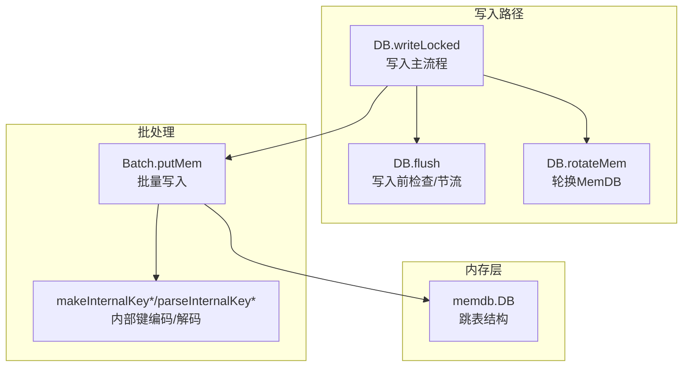
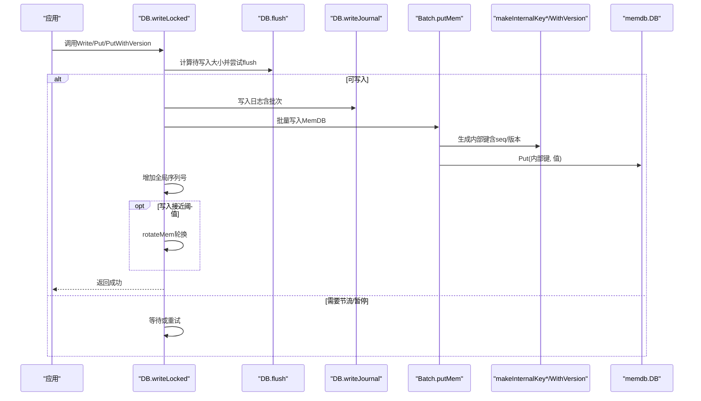
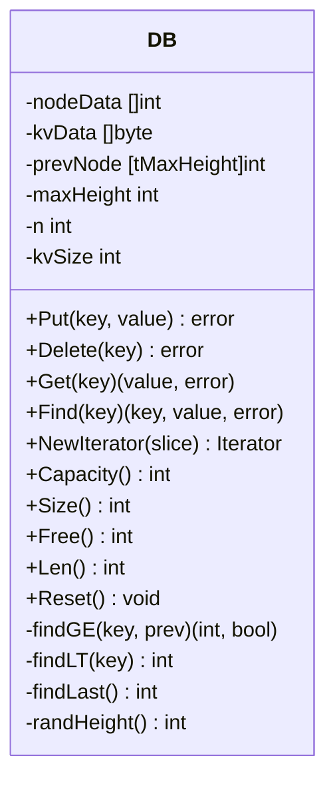
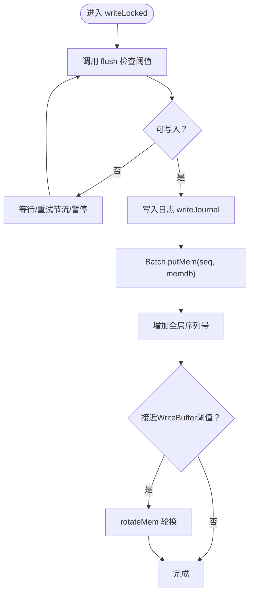
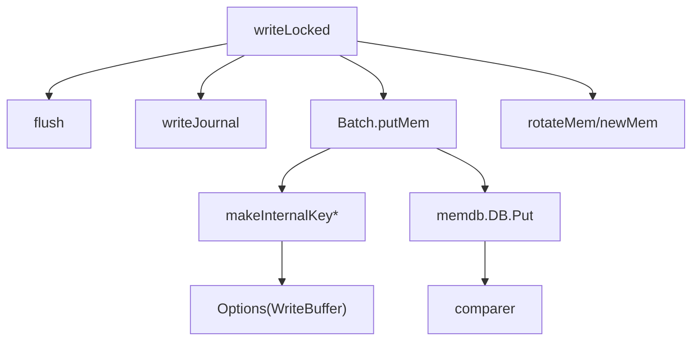

# MemDB内存写入

<cite>
**本文引用的文件**
- [memdb.go](file://leveldb/memdb/memdb.go)
- [db_write.go](file://leveldb/db_write.go)
- [batch.go](file://leveldb/batch.go)
- [key.go](file://leveldb/key.go)
- [db_state.go](file://leveldb/db_state.go)
- [options.go](file://leveldb/opt/options.go)
</cite>

## 目录
1. [简介](#简介)
2. [项目结构](#项目结构)
3. [核心组件](#核心组件)
4. [架构总览](#架构总览)
5. [详细组件分析](#详细组件分析)
6. [依赖关系分析](#依赖关系分析)
7. [性能考量](#性能考量)
8. [故障排查指南](#故障排查指南)
9. [结论](#结论)

## 简介
本文件围绕LevelDB内存层的写入流程进行深入解析，聚焦于writeLocked函数中批次数据如何通过putMem方法写入当前活跃的MemDB实例。文档将阐明：
- MemDB作为内存跳表（SkipList）的内部结构与并发写入机制
- 序列号（seq）如何随每次写入递增并作为内部键的一部分参与版本控制
- 内存使用量（Free()）的计算方式及与WriteBuffer阈值的关系
- 当写入数据量接近WriteBuffer阈值时，系统如何准备触发flush与rotate操作

## 项目结构
与MemDB内存写入直接相关的核心文件如下：
- leveldb/memdb/memdb.go：内存跳表数据库实现，提供Put/Delete/迭代等能力
- leveldb/db_write.go：写入主流程，包含writeLocked、flush、rotateMem等关键逻辑
- leveldb/batch.go：批处理记录的内存表示与写入到MemDB的入口
- leveldb/key.go：内部键编码/解码，包含序列号与类型打包
- leveldb/db_state.go：MemDB生命周期管理、引用计数、冻结与轮换
- leveldb/opt/options.go：WriteBuffer、写入节流阈值等配置项

图表来源
- [db_write.go](file://leveldb/db_write.go#L154-L266)
- [batch.go](file://leveldb/batch.go#L244-L257)
- [key.go](file://leveldb/key.go#L75-L104)
- [memdb.go](file://leveldb/memdb/memdb.go#L273-L315)

章节来源
- [db_write.go](file://leveldb/db_write.go#L154-L266)
- [batch.go](file://leveldb/batch.go#L244-L257)
- [key.go](file://leveldb/key.go#L75-L104)
- [memdb.go](file://leveldb/memdb/memdb.go#L273-L315)

## 核心组件
- MemDB（跳表）：以kvData为连续字节数组存储键值，nodeData为节点元数据数组，形成多层链表结构；提供Put/Delete/Get/Find/迭代器等接口，并通过互斥锁保证读写并发安全。
- 写入主流程（writeLocked）：负责合并写入、写入日志、批量写入MemDB、更新序列号、必要时轮换MemDB。
- 批处理（Batch）：将多个写入记录按顺序编码为内部键后写入MemDB。
- 内部键（Internal Key）：由用户键+版本（可选）+序列号+类型组成，排序规则确保高版本/高序列优先。
- 配置（Options）：WriteBuffer、写入慢速/暂停阈值等，决定flush与rotate时机。

章节来源
- [memdb.go](file://leveldb/memdb/memdb.go#L181-L200)
- [db_write.go](file://leveldb/db_write.go#L154-L266)
- [batch.go](file://leveldb/batch.go#L244-L257)
- [key.go](file://leveldb/key.go#L75-L104)
- [options.go](file://leveldb/opt/options.go#L392-L411)

## 架构总览
下图展示从应用写入到MemDB落盘的关键调用链路与数据流向。

图表来源
- [db_write.go](file://leveldb/db_write.go#L154-L266)
- [batch.go](file://leveldb/batch.go#L244-L257)
- [key.go](file://leveldb/key.go#L75-L104)
- [memdb.go](file://leveldb/memdb/memdb.go#L273-L315)

## 详细组件分析

### MemDB内部结构与并发写入
- 结构要点
  - kvData：连续字节数组，存放所有键值对的拼接内容
  - nodeData：每个节点的元数据数组，包含KV偏移、键长、值长、高度、各层next指针
  - prevNode：查找辅助数组，避免重复扫描
  - maxHeight：当前最大高度
  - n/kvSize：节点数量与键值总长度统计
- 并发模型
  - Put/Delete/Get/Find均通过互斥锁保护；迭代器持有只读锁，允许并发读取
  - Reset会复用缓冲区，便于后续复用
- 查找与插入
  - findGE/findLT/findLast基于比较器与nodeData的多层next指针进行二分式查找
  - 插入时随机高度，更新prevNode并连接各层next指针

图表来源
- [memdb.go](file://leveldb/memdb/memdb.go#L181-L200)
- [memdb.go](file://leveldb/memdb/memdb.go#L210-L271)
- [memdb.go](file://leveldb/memdb/memdb.go#L273-L315)
- [memdb.go](file://leveldb/memdb/memdb.go#L411-L480)

章节来源
- [memdb.go](file://leveldb/memdb/memdb.go#L181-L200)
- [memdb.go](file://leveldb/memdb/memdb.go#L210-L271)
- [memdb.go](file://leveldb/memdb/memdb.go#L273-L315)
- [memdb.go](file://leveldb/memdb/memdb.go#L411-L480)

### writeLocked中的写入流程与putMem
- 合并与写入日志
  - 在writeLocked中，先尝试flush以评估当前MemDB剩余空间与L0状态，决定是否允许本次写入
  - 若允许，先写入journal，再批量写入MemDB
- 批量写入MemDB
  - Batch.putMem遍历批次索引，逐条生成内部键（含seq/版本），然后调用memdb.DB.Put
  - seq按批次内记录顺序递增，确保同一批次内的有序性
- 序列号与版本控制
  - 全局序列号由DB维护，写入完成后整体增加批次长度
  - 内部键编码将seq与类型打包，版本（可选）单独编码，保证排序语义正确
- 触发轮换
  - 当本次写入的internalLen接近或达到MemDB剩余容量时，触发rotateMem轮换新的MemDB

图表来源
- [db_write.go](file://leveldb/db_write.go#L154-L266)
- [batch.go](file://leveldb/batch.go#L244-L257)
- [key.go](file://leveldb/key.go#L75-L104)
- [db_state.go](file://leveldb/db_state.go#L120-L159)

章节来源
- [db_write.go](file://leveldb/db_write.go#L154-L266)
- [batch.go](file://leveldb/batch.go#L244-L257)
- [key.go](file://leveldb/key.go#L75-L104)
- [db_state.go](file://leveldb/db_state.go#L120-L159)

### 内部键编码与版本控制
- 编码格式
  - 非版本键：用户键 + 8字节（seq<<8 | 类型）
  - 版本键：用户键 + 8字节版本 + 8字节（seq<<8 | 类型）
- 排序规则
  - 比较器基于用户键排序；当用户键相同时，按内部键num字段（seq<<8 | 类型）降序排列，即更高seq优先
  - 版本键额外包含版本字段，支持同一用户键的多版本共存
- 解析与断言
  - 提供parseInternalKey/WithVersion解析内部键，校验长度与类型合法性

章节来源
- [key.go](file://leveldb/key.go#L75-L104)
- [key.go](file://leveldb/key.go#L106-L132)
- [key.go](file://leveldb/key.go#L139-L171)
- [key.go](file://leveldb/key.go#L173-L197)

### 内存使用量（Free()）与WriteBuffer阈值
- Free()计算
  - Free()返回cap(kvData) - len(kvData)，即当前kvData缓冲区剩余可用字节数
- WriteBuffer阈值
  - Options中WriteBuffer定义MemDB在flush前的最大容量；默认4MiB
  - flush在写入前根据MemDB剩余空间与L0表数量判断是否需要节流或轮换
- 写入接近阈值的触发
  - writeLocked在写入后若发现本次internalLen接近或等于剩余空间，则调用rotateMem轮换新的MemDB，避免频繁扩容

章节来源
- [memdb.go](file://leveldb/memdb/memdb.go#L427-L432)
- [options.go](file://leveldb/opt/options.go#L392-L411)
- [db_write.go](file://leveldb/db_write.go#L66-L131)
- [db_write.go](file://leveldb/db_write.go#L256-L262)

## 依赖关系分析
- writeLocked依赖
  - flush：评估写入可行性与节流策略
  - writeJournal：持久化批次到日志
  - Batch.putMem：批量写入MemDB
  - DB.addSeq：原子性增加全局序列号
  - rotateMem/newMem：在需要时轮换MemDB并创建新日志
- MemDB依赖
  - comparer：用于键比较
  - util：迭代器范围切片等工具
- 内部键依赖
  - key.go提供编码/解码与断言，确保排序与解析正确

图表来源
- [db_write.go](file://leveldb/db_write.go#L154-L266)
- [batch.go](file://leveldb/batch.go#L244-L257)
- [key.go](file://leveldb/key.go#L75-L104)
- [memdb.go](file://leveldb/memdb/memdb.go#L273-L315)
- [options.go](file://leveldb/opt/options.go#L392-L411)

章节来源
- [db_write.go](file://leveldb/db_write.go#L154-L266)
- [batch.go](file://leveldb/batch.go#L244-L257)
- [key.go](file://leveldb/key.go#L75-L104)
- [memdb.go](file://leveldb/memdb/memdb.go#L273-L315)
- [options.go](file://leveldb/opt/options.go#L392-L411)

## 性能考量
- 写入合并
  - writeLocked支持写入合并，减少锁竞争与日志写入次数
- 节流与暂停
  - flush根据L0表数量触发慢速/暂停，避免写放大
- 内存增长策略
  - MemDB采用追加只写策略，删除不回收缓冲，Free()用于快速评估剩余空间
- 锁粒度
  - MemDB读写分离（RLock/WLock），迭代器仅持读锁，提升并发读性能

[本节为通用性能建议，无需列出具体文件来源]

## 故障排查指南
- 写入被阻塞或延迟
  - 检查flush是否因L0表过多而触发慢速/暂停
  - 关注writeLocked中的重试逻辑与节流日志
- 写入失败
  - 确认writeJournal是否成功；若失败，writeLocked会释放写锁并返回错误
- 版本键排序异常
  - 核对内部键编码是否包含版本字段，比较器排序是否按预期
- 内存溢出风险
  - 监控MemDB.Free()与WriteBuffer配置，避免频繁扩容导致内存抖动

章节来源
- [db_write.go](file://leveldb/db_write.go#L66-L131)
- [db_write.go](file://leveldb/db_write.go#L154-L266)
- [key.go](file://leveldb/key.go#L75-L104)
- [memdb.go](file://leveldb/memdb/memdb.go#L427-L432)

## 结论
- writeLocked通过flush与rotateMem实现了对写入速率与内存占用的动态控制
- Batch.putMem将每条记录转换为内部键并写入MemDB，seq与版本共同构成排序与版本控制基础
- MemDB的Free()与WriteBuffer配合，使系统能够在接近阈值时主动轮换，维持稳定的写入性能
- 内部键编码规范确保了跨版本与跨序列的正确排序，满足上层业务对版本化数据的需求