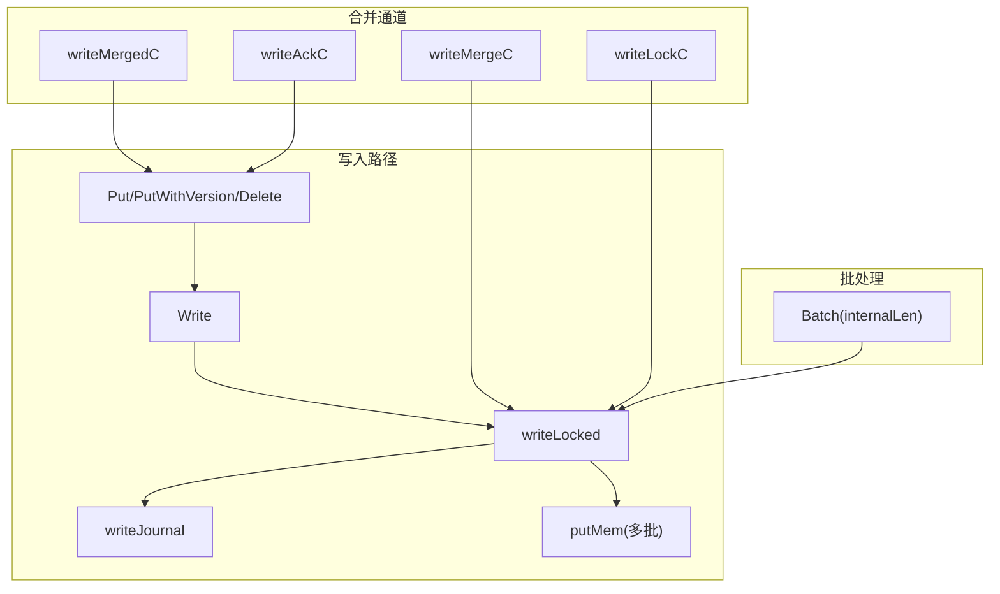
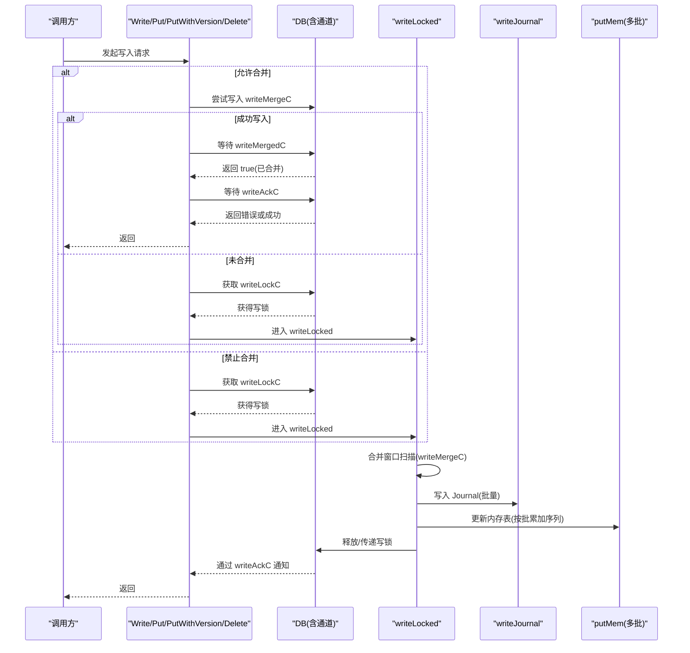
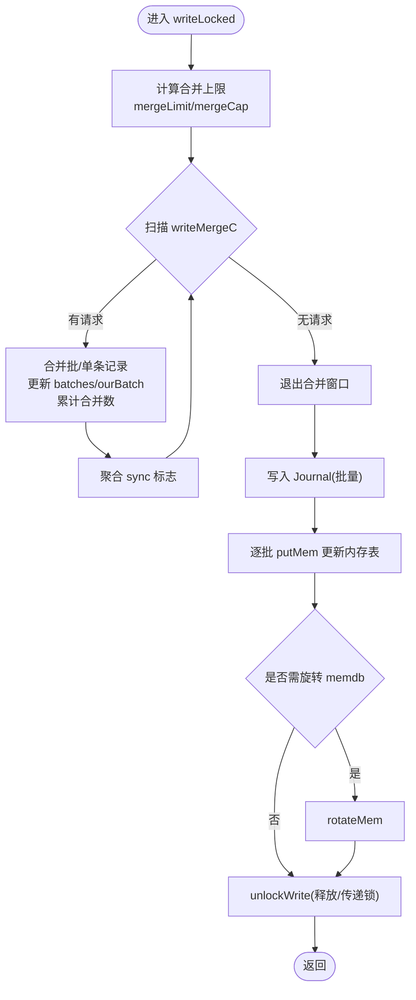
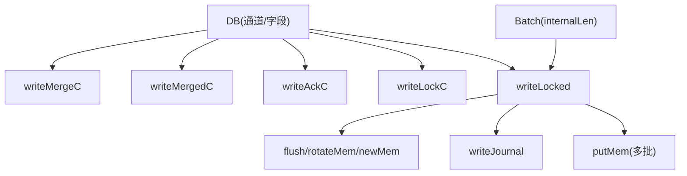

# 写入合并机制

<cite>
**本文引用的文件**
- [leveldb/db_write.go](file://leveldb/db_write.go)
- [leveldb/db.go](file://leveldb/db.go)
- [leveldb/batch.go](file://leveldb/batch.go)
- [leveldb/opt/options.go](file://leveldb/opt/options.go)
- [leveldb/bench_test.go](file://leveldb/bench_test.go)
</cite>

## 目录
1. [引言](#引言)
2. [项目结构](#项目结构)
3. [核心组件](#核心组件)
4. [架构总览](#架构总览)
5. [详细组件分析](#详细组件分析)
6. [依赖关系分析](#依赖关系分析)
7. [性能考量](#性能考量)
8. [故障排查指南](#故障排查指南)
9. [结论](#结论)
10. [附录](#附录)

## 引言
本技术文档聚焦 avccDB 的写入合并机制（WriteMerge），系统性阐述如何通过三个通道（writeMergeC、writeMergedC、writeAckC）在高并发场景下将多个并发写入请求合并为单个批次，从而降低锁竞争与 Journal 写入次数，提升吞吐与稳定性。文档同时解释 writeMerge 结构体设计、NoWriteMerge 选项对合并行为的影响，并给出高并发场景下的性能对比思路与建议。

## 项目结构
与写入合并直接相关的核心代码位于以下文件：
- 写入流程与合并逻辑：leveldb/db_write.go
- 数据库实例字段与通道定义：leveldb/db.go
- 批处理结构与内部长度计算：leveldb/batch.go
- 选项与 NoWriteMerge 配置：leveldb/opt/options.go
- 基准测试入口（用于对比不同策略的性能）：leveldb/bench_test.go



图表来源
- [leveldb/db_write.go](file://leveldb/db_write.go#L268-L375)
- [leveldb/db_write.go](file://leveldb/db_write.go#L155-L266)
- [leveldb/db.go](file://leveldb/db.go#L67-L117)
- [leveldb/batch.go](file://leveldb/batch.go#L63-L136)

章节来源
- [leveldb/db_write.go](file://leveldb/db_write.go#L268-L375)
- [leveldb/db.go](file://leveldb/db.go#L67-L117)
- [leveldb/batch.go](file://leveldb/batch.go#L63-L136)

## 核心组件
- writeMerge 结构体：承载一次写入请求的信息，支持两种形态：
  - 合并批：包含 Batch 指针与同步标志
  - 单条记录：包含键类型、键值、可选版本号与同步标志
- 三个关键通道：
  - writeMergeC：写入请求进入合并窗口的入口
  - writeMergedC：通知发起者“是否成功合并”
  - writeAckC：向所有等待的合并参与者返回错误或成功
  - writeLockC：写锁，确保同一时刻只有一个写入线程执行写入
- writeLocked 方法：在持有写锁后执行合并窗口扫描、批量写入 Journal、更新内存表与序列号、必要时旋转 memdb

章节来源
- [leveldb/db_write.go](file://leveldb/db_write.go#L133-L152)
- [leveldb/db_write.go](file://leveldb/db_write.go#L155-L266)
- [leveldb/db.go](file://leveldb/db.go#L67-L117)

## 架构总览
写入合并的总体流程如下：
- 发起写入（Write/Put/PutWithVersion/Delete）时，若允许合并且存在并发写入，请求会尝试进入 writeMergeC；否则直接获取 writeLockC
- 首个进入 writeMergeC 的请求获得写锁并开始合并窗口扫描；其他并发请求被合并到同一批次
- 合并完成后，统一写入 Journal 并更新内存表，随后释放写锁或传递给下一个未能合并的请求
- 合并参与者通过 writeMergedC 确认是否被合并，最终通过 writeAckC 收到结果



图表来源
- [leveldb/db_write.go](file://leveldb/db_write.go#L268-L375)
- [leveldb/db_write.go](file://leveldb/db_write.go#L155-L266)
- [leveldb/db.go](file://leveldb/db.go#L67-L117)

## 详细组件分析

### writeMerge 结构体与通道交互
- 字段含义
  - sync：是否需要同步落盘
  - batch/keyType/key/value/version：区分“批合并”与“单条记录合并”
- 通道协作
  - writeMergeC：请求进入合并窗口
  - writeMergedC：告知发起者“是否被合并”
  - writeAckC：向所有等待的合并参与者广播结果
  - writeLockC：写锁，保证互斥

```mermaid
classDiagram
class DB {
+chan writeMerge writeMergeC
+chan bool writeMergedC
+chan struct{} writeLockC
+chan error writeAckC
+writeLocked(batch, ourBatch, merge, sync) error
+unlockWrite(overflow, merged, err) void
}
class writeMerge {
+bool sync
+Batch* batch
+keyType keyType
+[]byte key
+[]byte value
+uint64 version
}
DB --> writeMerge : "使用"
```

图表来源
- [leveldb/db.go](file://leveldb/db.go#L67-L117)
- [leveldb/db_write.go](file://leveldb/db_write.go#L133-L152)

章节来源
- [leveldb/db_write.go](file://leveldb/db_write.go#L133-L152)
- [leveldb/db.go](file://leveldb/db.go#L67-L117)

### 合并窗口扫描与批量写入
- 合并窗口
  - 首个请求获取写锁后，基于 batch 的 internalLen 计算合并上限
  - 在循环中从 writeMergeC 非阻塞地接收并发请求，累计到 batches 或 ourBatch
  - 当新请求的大小超过剩余合并容量或版本冲突时，标记 overflow 并结束合并
- 批量写入
  - 统一写入 Journal，支持合并后的同步标志聚合
  - 逐批将记录写入内存表，累加序列号
  - 若当前批次大小达到 memdb 容量阈值，触发旋转



图表来源
- [leveldb/db_write.go](file://leveldb/db_write.go#L155-L266)

章节来源
- [leveldb/db_write.go](file://leveldb/db_write.go#L155-L266)

### NoWriteMerge 选项对合并行为的影响
- WriteOptions.NoWriteMerge：针对单次写入调用禁用合并
- Options.NoWriteMerge：全局禁用合并
- 合并判定逻辑
  - merge = !wo.GetNoWriteMerge() && !db.s.o.GetNoWriteMerge()
  - 若 merge 为 false，则直接获取写锁，不参与合并窗口

章节来源
- [leveldb/db_write.go](file://leveldb/db_write.go#L268-L375)
- [leveldb/opt/options.go](file://leveldb/opt/options.go#L360-L371)

### putRec 与 writeLocked 的配合
- putRec：将单条 Put/Delete/PutWithVersion 包装为 Batch，再调用 writeLocked
- writeLocked：负责合并窗口扫描、批量写 Journal、更新内存表与序列号、释放/传递写锁

章节来源
- [leveldb/db_write.go](file://leveldb/db_write.go#L332-L375)
- [leveldb/db_write.go](file://leveldb/db_write.go#L155-L266)

### Batch 的 internalLen 与合并容量控制
- internalLen：记录每个键值对的内部长度估算，用于合并容量控制
- 合并上限计算：根据 batch.internalLen 动态调整，避免超出 memdb 可用空间

章节来源
- [leveldb/batch.go](file://leveldb/batch.go#L63-L136)
- [leveldb/db_write.go](file://leveldb/db_write.go#L155-L206)

## 依赖关系分析
- DB 实例维护四个关键通道，分别用于合并、确认与结果通知
- writeLocked 依赖 flush/rotateMem/newMem 等方法进行写入节流与 memdb 切换
- 合并窗口依赖 batch 的 internalLen 与 memdb 可用空间



图表来源
- [leveldb/db.go](file://leveldb/db.go#L67-L117)
- [leveldb/db_write.go](file://leveldb/db_write.go#L155-L266)
- [leveldb/batch.go](file://leveldb/batch.go#L63-L136)

章节来源
- [leveldb/db.go](file://leveldb/db.go#L67-L117)
- [leveldb/db_write.go](file://leveldb/db_write.go#L155-L266)
- [leveldb/batch.go](file://leveldb/batch.go#L63-L136)

## 性能考量
- 合并收益
  - 减少写锁争用：仅首个请求持有写锁，其余并发请求被合并到同一批次
  - 降低 Journal 写入次数：批量写入 Journal，减少磁盘 IO
  - 提升吞吐：在高并发场景下显著提高 QPS
- 合并限制
  - 合并上限受 batch.internalLen 与 memdb 可用空间约束
  - 版本化写入（PutWithVersion）会增加单条记录的 internalLen，影响合并容量
- 性能对比建议
  - 使用基准测试工具（如 bench_test.go 中的 BenchmarkDBWrite/BenchmarkDBWriteBatch）对比启用/禁用合并的差异
  - 关注关键指标：QPS、P95/P99 延迟、写放大、Journal 写入频率
  - 可通过设置 Options.NoWriteMerge 或 WriteOptions.NoWriteMerge 来强制关闭合并，观察性能回退

章节来源
- [leveldb/bench_test.go](file://leveldb/bench_test.go#L264-L323)
- [leveldb/db_write.go](file://leveldb/db_write.go#L155-L266)
- [leveldb/opt/options.go](file://leveldb/opt/options.go#L360-L371)

## 故障排查指南
- 常见问题
  - 合并未生效：检查是否设置了 NoWriteMerge（全局或单次）
  - 写入阻塞：确认 writeLockC 是否被长时间占用，是否存在大量小批量写导致频繁切换
  - Journal 写入异常：检查 writeJournal 返回的错误并通过 writeAckC 传播
- 排查步骤
  - 开启合并：移除 NoWriteMerge 配置
  - 观察通道状态：writeMergeC 是否持续有请求进入
  - 检查 batch.internalLen 与 memdb 可用空间：避免 overflow 导致提前结束合并
  - 监控写入延迟与 Journal 写入频率：评估合并效果

章节来源
- [leveldb/db_write.go](file://leveldb/db_write.go#L141-L152)
- [leveldb/db_write.go](file://leveldb/db_write.go#L240-L244)
- [leveldb/opt/options.go](file://leveldb/opt/options.go#L360-L371)

## 结论
avccDB 的写入合并机制通过 writeMergeC、writeMergedC、writeAckC 与 writeLockC 的协同，实现了在高并发场景下的批量写入合并。writeMerge 结构体统一承载批与单条写入请求，writeLocked 在持有写锁期间完成合并窗口扫描与批量写入，有效降低了锁竞争与 Journal 写入次数。NoWriteMerge 选项提供了灵活的开关，可在特殊场景下禁用合并以满足一致性或调试需求。结合基准测试工具，可以量化评估合并带来的性能收益。

## 附录
- 相关实现位置参考
  - 合并结构体与解锁逻辑：[leveldb/db_write.go](file://leveldb/db_write.go#L133-L152)
  - 写入主流程与合并判定：[leveldb/db_write.go](file://leveldb/db_write.go#L268-L375)
  - 批处理内部长度与记录追加：[leveldb/batch.go](file://leveldb/batch.go#L63-L136)
  - 选项配置（NoWriteMerge）：[leveldb/opt/options.go](file://leveldb/opt/options.go#L360-L371)
  - 基准测试入口（对比不同策略）：[leveldb/bench_test.go](file://leveldb/bench_test.go#L264-L323)