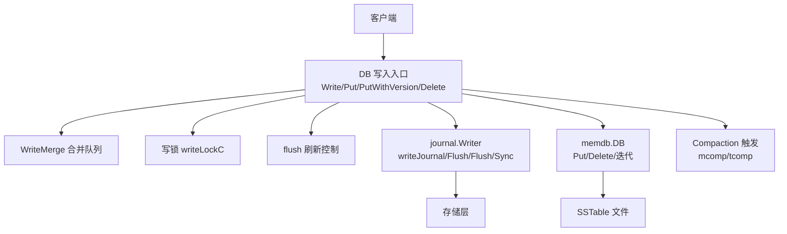
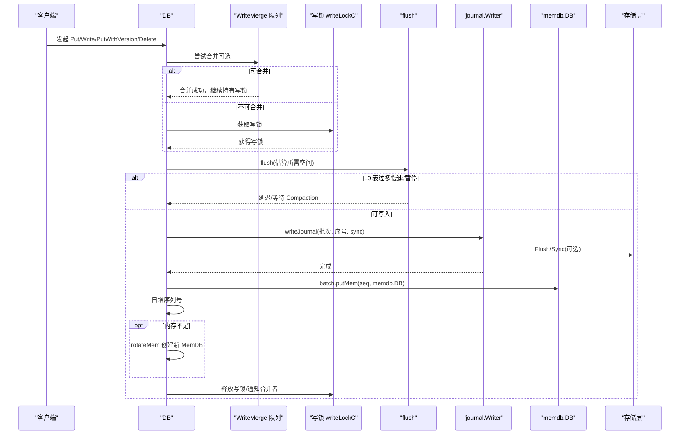
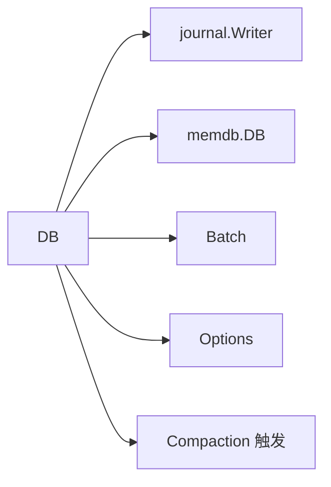

# 写入流程

<cite>
**本文引用的文件**
- [db_write.go](file://leveldb/db_write.go)
- [db_state.go](file://leveldb/db_state.go)
- [journal.go](file://leveldb/journal/journal.go)
- [memdb.go](file://leveldb/memdb/memdb.go)
- [batch.go](file://leveldb/batch.go)
- [mlsm_final_comprehensive_test.go](file://leveldb/mlsm_final_comprehensive_test.go)
- [db.go](file://leveldb/db.go)
</cite>

## 目录
1. [简介](#简介)
2. [项目结构](#项目结构)
3. [核心组件](#核心组件)
4. [架构总览](#架构总览)
5. [详细组件分析](#详细组件分析)
6. [依赖关系分析](#依赖关系分析)
7. [性能考量](#性能考量)
8. [故障排查指南](#故障排查指南)
9. [结论](#结论)

## 简介
本文面向 avccDB 的写入流程，系统性梳理从客户端发起 Put/Write 操作到数据最终落盘的完整路径。重点覆盖：
- 写入请求如何通过 WriteMerge 机制进行批处理合并
- 如何通过 writeLocked 函数获取写锁并执行写入
- Journal 如何保证数据持久性（包括 writeJournal 方法的调用与 Flush/Sync 机制）
- 数据如何写入 MemDB 内存表
- 当 MemDB 达到 WriteBuffer 阈值时，如何通过 flush 和 rotateMem 触发 flush 操作，将内存数据持久化为 SSTable 文件
- 结合 mlsm_final_comprehensive_test.go 中的大规模写入测试，说明在高并发场景下的写入性能表现与流量控制机制
- 提供写入流程的序列图，标注关键的数据转换点和状态变更

## 项目结构
围绕写入路径的关键模块与职责如下：
- DB 层：对外暴露 Put/Write/PutWithVersion/Delete 等接口；负责写入合并、写锁管理、Journal 写入、MemDB 刷新与旋转、触发 Compaction 等
- Batch：批量记录编码与解码，支持版本化记录
- Journal：日志写入器，负责将批次写入磁盘并可选同步
- MemDB：内存键值表，提供 Put/Delete/Get/迭代等能力
- Options：写缓冲、慢速/暂停阈值、是否启用同步等配置项

图表来源
- [db_write.go](file://leveldb/db_write.go#L18-L33)
- [db_write.go](file://leveldb/db_write.go#L66-L131)
- [journal.go](file://leveldb/journal/journal.go#L435-L448)
- [memdb.go](file://leveldb/memdb/memdb.go#L273-L315)
- [db.go](file://leveldb/db.go#L33-L98)

章节来源
- [db.go](file://leveldb/db.go#L33-L98)

## 核心组件
- 写入合并结构体 writeMerge：承载单条 Put/删除或一个 Batch 的请求，以及是否需要同步（sync）标志
- writeLocked：持有写锁后执行实际写入逻辑，包含合并、写 Journal、写 MemDB、序列号递增、必要时旋转 MemDB
- flush：根据 L0 表数量与 WriteBuffer 配置，决定是否延迟、暂停或旋转 MemDB
- rotateMem：创建新 MemDB 并重置 Journal，同时调度内存表压缩
- writeJournal：将批次写入 Journal，并按需 Flush/Sync
- Batch：记录编码、内部长度计算、版本化记录支持
- MemDB：内存表，提供 Put/Delete/迭代等能力

章节来源
- [db_write.go](file://leveldb/db_write.go#L133-L217)
- [db_write.go](file://leveldb/db_write.go#L18-L33)
- [db_write.go](file://leveldb/db_write.go#L66-L131)
- [batch.go](file://leveldb/batch.go#L63-L136)
- [memdb.go](file://leveldb/memdb/memdb.go#L273-L315)

## 架构总览
下图展示一次典型写入从客户端到落盘的端到端流程，标注关键状态与转换点。

图表来源
- [db_write.go](file://leveldb/db_write.go#L18-L33)
- [db_write.go](file://leveldb/db_write.go#L66-L131)
- [db_write.go](file://leveldb/db_write.go#L155-L266)
- [journal.go](file://leveldb/journal/journal.go#L435-L448)
- [memdb.go](file://leveldb/memdb/memdb.go#L273-L315)

## 详细组件分析

### 写入合并与锁管理
- Write/Put/PutWithVersion/Delete 接口均会尝试通过 WriteMerge 队列进行合并，减少 Journal 写入次数与上下文切换
- 合并策略：
  - 对于 Batch，若合并后的 internalLen 超过剩余容量则溢出，交由下一个写入处理
  - 对于单条 Put/删除，计算其内部长度（含 key/value 与版本字段），超过剩余容量则溢出
- 合并完成后，若 sync 选项为真，则在 Journal 写入时设置同步标志
- 写锁管理：
  - 合并成功时，写入者被挂起等待合并结果；若未合并，获得写锁后进入 writeLocked
  - unlockWrite 会向已合并的写入者发送确认，并在溢出时将锁传递给下一个写入者

章节来源
- [db_write.go](file://leveldb/db_write.go#L133-L217)
- [db_write.go](file://leveldb/db_write.go#L141-L152)

### writeLocked 执行路径
- 入口参数：batch、ourBatch（可复用的临时 Batch）、merge、sync
- 步骤：
  1) 调用 flush，评估当前 MemDB 剩余空间与 L0 表数量，必要时触发延迟或暂停
  2) 若允许合并，从 writeMergeC 通道收集可合并的写入，累积到 batches 或 ourBatch
  3) 计算起始序列号 seq，调用 writeJournal 写入 Journal 并按需 Flush/Sync
  4) 将每个 Batch 的记录写入 MemDB（batch.putMem），seq 递增
  5) 若本次写入大小接近 MemDB 剩余空间，触发 rotateMem 创建新 MemDB
  6) 解锁：unlockWrite 通知合并者并释放写锁或传递锁

章节来源
- [db_write.go](file://leveldb/db_write.go#L155-L266)

### Journal 持久化与同步
- writeJournal 负责：
  - 通过 journal.Next() 获取当前 Journal 写入器
  - 使用 writeBatchesWithHeader 将批次头与各批次数据写入
  - journal.Flush() 将缓冲区写入底层存储
  - 若 sync 为真，调用 journalWriter.Sync() 强制同步
- journal.Writer 支持：
  - Next()/Flush()/Close() 生命周期管理
  - 写块与校验和，确保损坏时可跳过恢复

章节来源
- [db_write.go](file://leveldb/db_write.go#L18-L33)
- [batch.go](file://leveldb/batch.go#L402-L412)
- [journal.go](file://leveldb/journal/journal.go#L435-L448)

### MemDB 写入与阈值控制
- MemDB 作为内存表，提供 Put/Delete/迭代等能力
- 写入路径：
  - writeLocked 将 Batch 的记录逐条写入 MemDB
  - 当本次写入大小接近 MemDB 剩余空间时，调用 rotateMem 创建新 MemDB
- rotateMem：
  - 等待内存表压缩完成
  - 创建新 MemDB 并重置 Journal，冻结旧 MemDB
  - 调度内存表压缩（mcomp）

章节来源
- [memdb.go](file://leveldb/memdb/memdb.go#L273-L315)
- [db_write.go](file://leveldb/db_write.go#L35-L64)
- [db_state.go](file://leveldb/db_state.go#L123-L181)

### flush 与阈值控制（WriteBuffer/L0）
- flush 根据 L0 表数量与 WriteBuffer 配置进行流量控制：
  - slowdownTrigger：L0 表数量达到阈值时，写入线程短暂休眠，降低写入速率
  - pauseTrigger：L0 表数量更高时，写入被暂停，等待 tcomp 命令通道完成一次压缩
  - 当 MemDB 空间不足且非空时，触发 rotateMem 创建新 MemDB
- writeDelay 与 writeDelayN 统计写入延迟的累计时长与次数，便于观测与诊断

章节来源
- [db_write.go](file://leveldb/db_write.go#L66-L131)

### 高并发与大规模写入测试
- mlsm_final_comprehensive_test.go 展示了大规模写入场景：
  - 20 万个唯一键，每个键 5 个版本，共 100 万条记录
  - WriteBuffer 设置较小（256KB），CompactionTableSize 与 TotalSize 也较小，以触发更频繁的 flush 与分层
  - 通过定时输出吞吐量（records/s），验证写入性能
  - 测试覆盖写入后验证、MasterRoot 计算、Compaction 后验证、Proof 生成与验证、迭代器全量遍历、删除与 Tombstone 行为等
- 该测试体现了：
  - WriteMerge 合并对吞吐量的提升
  - flush/rotateMem 与 L0 阈值控制对背压的作用
  - 在高并发下，Journal 的 Flush/Sync 与 MemDB 的旋转如何协同工作

章节来源
- [mlsm_final_comprehensive_test.go](file://leveldb/mlsm_final_comprehensive_test.go#L1-L120)
- [mlsm_final_comprehensive_test.go](file://leveldb/mlsm_final_comprehensive_test.go#L120-L220)
- [mlsm_final_comprehensive_test.go](file://leveldb/mlsm_final_comprehensive_test.go#L220-L320)

## 依赖关系分析
- DB 依赖：
  - journal.Writer：负责 Journal 写入与同步
  - memdb.DB：负责内存表写入
  - Batch：负责批次编码与内部长度计算
  - Options：提供 WriteBuffer、WriteL0SlowdownTrigger、WriteL0PauseTrigger 等配置
- 写入链路中的耦合与内聚：
  - writeLocked 将合并、Journal、MemDB、序列号、旋转等紧密耦合，保证原子性
  - flush 与 rotateMem 与后台 Compaction 协同，避免 L0 堆积导致写入阻塞

图表来源
- [db_write.go](file://leveldb/db_write.go#L18-L33)
- [db_write.go](file://leveldb/db_write.go#L66-L131)
- [db_state.go](file://leveldb/db_state.go#L123-L181)
- [batch.go](file://leveldb/batch.go#L63-L136)

## 性能考量
- WriteMerge 合并：
  - 合并上限基于 Batch/internalLen 与 MemDB 剩余空间，避免一次性写入过大
  - 合并过程中可累加 sync 标志，确保必要时进行同步
- L0 阈值控制：
  - slowdownTrigger 与 pauseTrigger 通过原子标记 inWritePaused 与等待 tcomp 命令通道，实现动态背压
  - writeDelay 与 writeDelayN 统计写入延迟，便于监控与调优
- Journal 写入：
  - Flush 用于将缓冲写入存储，Sync 用于强制同步磁盘，满足可靠性需求
- MemDB 旋转：
  - 当写入接近 MemDB 剩余空间时触发 rotateMem，避免内存膨胀与后续 flush 压力

章节来源
- [db_write.go](file://leveldb/db_write.go#L66-L131)
- [db_write.go](file://leveldb/db_write.go#L155-L266)
- [journal.go](file://leveldb/journal/journal.go#L435-L448)

## 故障排查指南
- 写入阻塞或延迟：
  - 检查 L0 表数量是否超过 pauseTrigger，观察 writeDelay 与 writeDelayN 是否增长
  - 确认 compTriggerWait 是否正常返回，tcomp 命令通道是否被消费
- Journal 写入失败：
  - 检查 journal.Next()/Flush()/Sync 返回错误
  - 校验底层存储写入器是否可用
- MemDB 旋转失败：
  - 检查 rotateMem 是否因 frozenMem 已存在而重试
  - 确认 newMem 是否成功创建新 MemDB 并重置 Journal
- 合并溢出：
  - 若 overflow 为真，检查合并上限与 Batch/internalLen 计算
  - 确认 unlockWrite 是否正确传递写锁给下一个写入者

章节来源
- [db_write.go](file://leveldb/db_write.go#L66-L131)
- [db_write.go](file://leveldb/db_write.go#L141-L152)
- [db_state.go](file://leveldb/db_state.go#L123-L181)
- [journal.go](file://leveldb/journal/journal.go#L435-L448)

## 结论
avccDB 的写入流程通过 WriteMerge 合并、写锁保护、Journal 持久化与 MemDB 写入，实现了高吞吐与可靠性的平衡。flush/rotateMem 与 L0 阈值控制共同构成流量控制机制，避免写入洪峰导致系统雪崩。mlsm_final_comprehensive_test.go 的大规模写入测试进一步验证了该机制在高并发场景下的稳定性与性能表现。建议在生产环境中合理配置 WriteBuffer 与 L0 阈值，并结合 writeDelay 统计进行持续监控与调优。