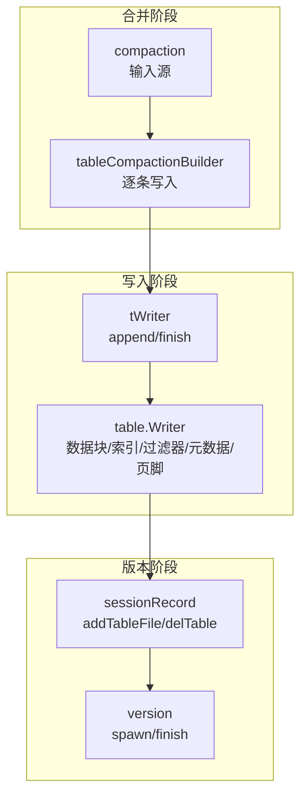
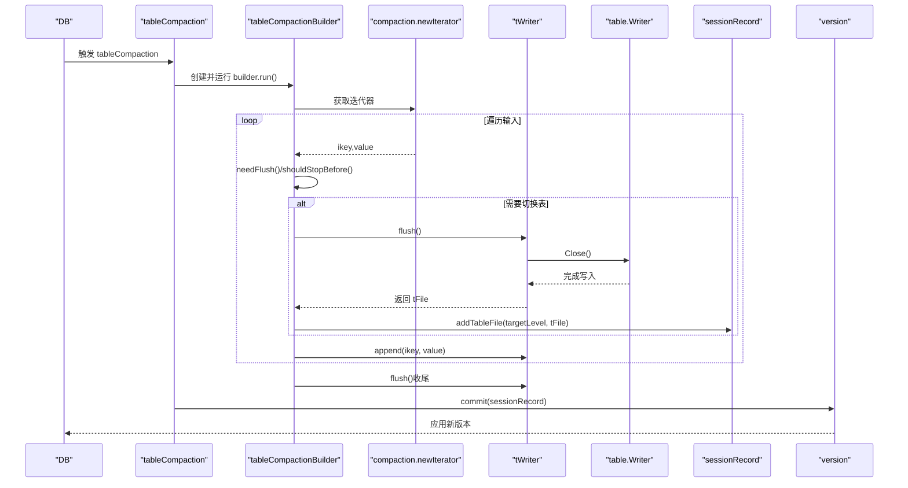
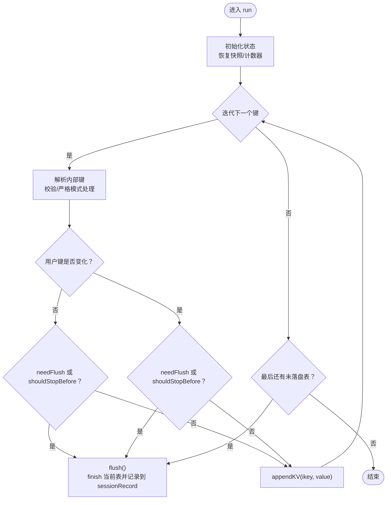
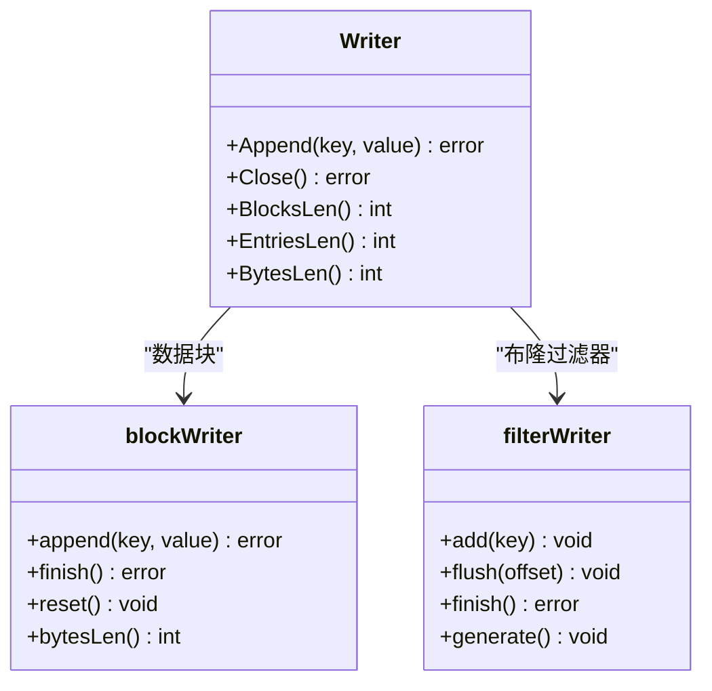
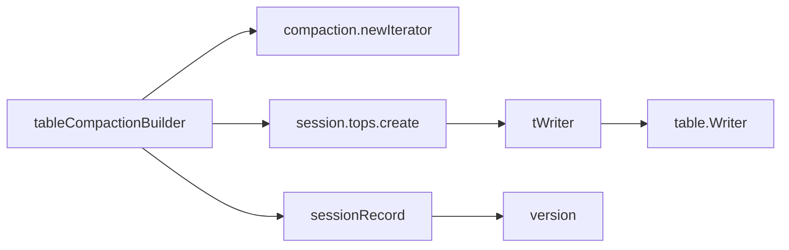
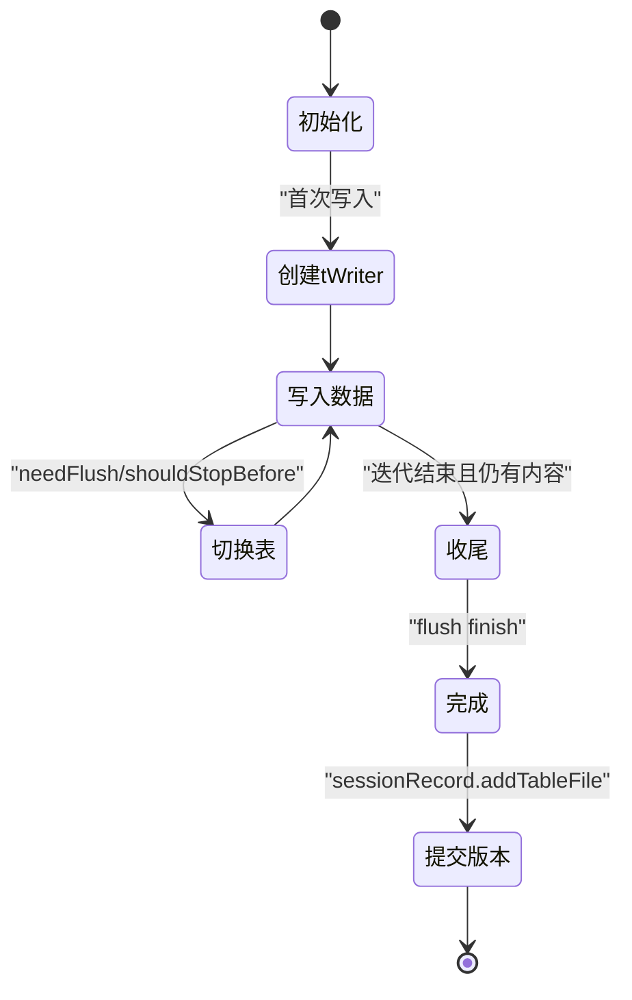

# SSTable生成

<cite>
**本文引用的文件**
- [leveldb/db_compaction.go](file://leveldb/db_compaction.go)
- [leveldb/table/writer.go](file://leveldb/table/writer.go)
- [leveldb/table.go](file://leveldb/table.go)
- [leveldb/session_record.go](file://leveldb/session_record.go)
- [leveldb/version.go](file://leveldb/version.go)
- [leveldb/options.go](file://leveldb/options.go)
- [leveldb/opt/options.go](file://leveldb/opt/options.go)
- [leveldb/db_test.go](file://leveldb/db_test.go)
</cite>

## 目录
1. [简介](#简介)
2. [项目结构](#项目结构)
3. [核心组件](#核心组件)
4. [架构总览](#架构总览)
5. [详细组件分析](#详细组件分析)
6. [依赖关系分析](#依赖关系分析)
7. [性能考量](#性能考量)
8. [故障排查指南](#故障排查指南)
9. [结论](#结论)
10. [附录](#附录)

## 简介
本文件围绕 avccDB 的 SSTable 生成流程进行系统化说明，重点阐述 tableCompactionBuilder 如何通过 table_writer 将合并后的数据写入新的 SSTable 文件；解释 CompactionTableSize（默认 2MiB）如何控制新文件大小，以及 CompactionExpandLimitFactor、CompactionGPOverlapsFactor 等参数对输入范围与文件大小的动态影响；说明写入过程中如何构建数据块（data block）、索引（index block）、布隆过滤器（filter block），以及 finish 方法如何完成文件持久化；最后结合 TestDB_TableCompactionBuilder 测试用例，说明生成的 SSTable 文件如何被添加到版本（version）中，并给出文件生成过程的生命周期图。

## 项目结构
与 SSTable 生成直接相关的关键模块：
- 合并构建器：tableCompactionBuilder（负责遍历 compaction 输入，按需切分输出表）
- 表写入器：table.Writer（封装底层 Writer，负责数据块、索引、布隆过滤器、元数据索引与页脚）
- 表包装器：tWriter（封装 storage.Writer 与 table.Writer，提供 append/finish/drop 等能力）
- 版本记录：sessionRecord（记录新增/删除的表文件，用于提交到版本）
- 版本应用：version（根据 sessionRecord 构建新版本，插入新表文件）

图表来源
- [leveldb/db_compaction.go](file://leveldb/db_compaction.go#L356-L605)
- [leveldb/table/writer.go](file://leveldb/table/writer.go#L148-L490)
- [leveldb/table.go](file://leveldb/table.go#L567-L642)
- [leveldb/session_record.go](file://leveldb/session_record.go#L109-L121)
- [leveldb/version.go](file://leveldb/version.go#L702-L849)

章节来源
- [leveldb/db_compaction.go](file://leveldb/db_compaction.go#L356-L605)
- [leveldb/table/writer.go](file://leveldb/table/writer.go#L148-L490)
- [leveldb/table.go](file://leveldb/table.go#L567-L642)
- [leveldb/session_record.go](file://leveldb/session_record.go#L109-L121)
- [leveldb/version.go](file://leveldb/version.go#L702-L849)

## 核心组件
- tableCompactionBuilder：从 compaction 的迭代器读取键值，按需创建新表、写入数据、必要时切换输出表；最终将生成的表文件记录到 sessionRecord 中。
- table.Writer：负责将键值写入数据块，按 blockSize 切分数据块；维护索引块；生成布隆过滤器；写入元数据索引与页脚。
- tWriter：封装 storage.Writer 与 table.Writer，提供 append/finish/drop；finish 会调用 table.Writer.Close 并返回 tFile。
- sessionRecord：记录新增/删除的表文件，供版本应用使用。
- version：根据 sessionRecord 构建新版本，插入新增表文件并排序。

章节来源
- [leveldb/db_compaction.go](file://leveldb/db_compaction.go#L356-L605)
- [leveldb/table/writer.go](file://leveldb/table/writer.go#L148-L490)
- [leveldb/table.go](file://leveldb/table.go#L567-L642)
- [leveldb/session_record.go](file://leveldb/session_record.go#L109-L121)
- [leveldb/version.go](file://leveldb/version.go#L702-L849)

## 架构总览
SSTable 生成的端到端流程如下：
- tableCompaction 调用 tableCompactionBuilder.run 遍历 compaction 输入
- 每次写入前检查是否需要切换输出表（基于 tableSize 与 shouldStopBefore）
- 写入完成后 flush 将当前表落盘并记录到 sessionRecord
- 提交阶段将新增表文件加入版本，更新版本指针

图表来源
- [leveldb/db_compaction.go](file://leveldb/db_compaction.go#L567-L605)
- [leveldb/db_compaction.go](file://leveldb/db_compaction.go#L380-L420)
- [leveldb/table.go](file://leveldb/table.go#L604-L627)
- [leveldb/session_record.go](file://leveldb/session_record.go#L109-L121)
- [leveldb/version.go](file://leveldb/version.go#L702-L849)

## 详细组件分析

### tableCompactionBuilder：合并构建与表切换
- 关键职责
  - 从 compaction.newIterator 顺序读取键值
  - 维护 lastUkey/lastSeq，处理严格模式下的键解析错误
  - 当遇到用户键变化或达到 tableSize/shouldStopBefore 时，触发 flush 切换新表
  - 将生成的 tFile 记录到 sessionRecord.addedTables
- 表切换策略
  - needFlush：当当前表字节数达到 tableSize 时切换
  - shouldStopBefore：根据 compaction 边界判断是否提前停止并切换
- 收尾
  - 迭代结束后若仍有未落盘表，执行最后一次 flush

图表来源
- [leveldb/db_compaction.go](file://leveldb/db_compaction.go#L380-L555)

章节来源
- [leveldb/db_compaction.go](file://leveldb/db_compaction.go#L356-L605)

### table.Writer：数据块、索引、布隆过滤器与页脚
- 数据块（data block）
  - 使用 blockWriter 按 restartInterval 编码共享前缀，达到 blockSize 自动切分
  - finishBlock 写入压缩后的数据块，记录块句柄 pendingBH
- 索引（index block）
  - 以数据块的最后一个键作为分隔键，写入对应块句柄
- 布隆过滤器（filter block）
  - filterWriter 按 baseLg 分段收集键，生成过滤器并写入
- 元数据索引（metaindex）
  - 将 filter 与可选的 Merkle tree 块句柄写入元数据索引
- 页脚（footer）
  - 写入 metaindex 与 index 的块句柄，附加魔数，完成文件

图表来源
- [leveldb/table/writer.go](file://leveldb/table/writer.go#L148-L490)

章节来源
- [leveldb/table/writer.go](file://leveldb/table/writer.go#L148-L490)

### tWriter：存储层封装与持久化
- append：记录首尾键，委托 table.Writer.Append
- finish：调用 table.Writer.Close，同步（可配置）后构造 tFile（包含文件大小、首尾内部键）
- drop：关闭并删除文件，回收文件号

章节来源
- [leveldb/table.go](file://leveldb/table.go#L567-L642)

### 版本记录与版本应用
- sessionRecord.addTableFile：将新表文件（level、num、size、imin、imax）加入 addedTables
- version.spawn/finish：根据 sessionRecord 构建新版本，插入新增表并排序
- trivial 路径下使用二分查找优化插入位置

章节来源
- [leveldb/session_record.go](file://leveldb/session_record.go#L109-L121)
- [leveldb/version.go](file://leveldb/version.go#L702-L849)

## 依赖关系分析
- tableCompactionBuilder 依赖
  - compaction.newIterator 提供有序输入
  - session.tops.create(tableSize) 创建 tWriter
  - sessionRecord 记录新增/删除表
  - session.commit 提交版本
- table.Writer 依赖
  - options（blockSize、filter、compression、blockRestartInterval 等）
  - filter.Filter 生成器
  - 可选 Merkle tree 支持
- 版本管理
  - versionStaging.commit 接收 sessionRecord，version.finish 构建新版本

图表来源
- [leveldb/db_compaction.go](file://leveldb/db_compaction.go#L356-L605)
- [leveldb/table/writer.go](file://leveldb/table/writer.go#L148-L490)
- [leveldb/version.go](file://leveldb/version.go#L702-L849)

章节来源
- [leveldb/db_compaction.go](file://leveldb/db_compaction.go#L356-L605)
- [leveldb/table/writer.go](file://leveldb/table/writer.go#L148-L490)
- [leveldb/version.go](file://leveldb/version.go#L702-L849)

## 性能考量
- CompactionTableSize（默认 2MiB）
  - 控制单个 SSTable 的目标大小，tableCompactionBuilder 在 needFlush 时触发切换
  - 通过 options.GetCompactionTableSize(level) 计算各层级的目标大小，支持按层级乘方增长
- CompactionExpandLimitFactor
  - 用于扩展 compaction 输入范围，限制扩展后源层与目标层的总大小不超过 limit
  - 由 compaction.expand 计算，避免过度扩大输入导致写放大
- CompactionGPOverlapsFactor
  - 限制单个新表在“祖父层”（GrandParent）的重叠数量，降低后续读放大
- BlockSize、BlockRestartInterval
  - 影响数据块大小与查询效率；较小的 restart 间隔提升随机访问性能但增加索引开销
- 压缩与同步
  - 可配置 Snappy 压缩与 noSync 选项，平衡吞吐与可靠性

章节来源
- [leveldb/opt/options.go](file://leveldb/opt/options.go#L207-L532)
- [leveldb/options.go](file://leveldb/options.go#L55-L107)
- [leveldb/db_compaction.go](file://leveldb/db_compaction.go#L196-L226)

## 故障排查指南
- 常见问题
  - 写入顺序不合法：table.Writer.Append 会检测键序，违反时返回错误
  - 文件同步失败：tWriter.finish 在 noSync=false 时会执行 Sync，失败需检查存储权限与磁盘状态
  - 版本提交失败：session.commit 失败时会回退并清理新增表文件
- 错误处理路径
  - tableCompactionBuilder.revert：删除已创建但未提交的表文件
  - tableCompactionBuilder.cleanup：异常时确保释放资源
  - compactionTransact：重试与回滚机制，保证幂等性

章节来源
- [leveldb/table/writer.go](file://leveldb/table/writer.go#L262-L294)
- [leveldb/table.go](file://leveldb/table.go#L604-L642)
- [leveldb/db_compaction.go](file://leveldb/db_compaction.go#L557-L565)

## 结论
SSTable 生成过程由 tableCompactionBuilder 驱动，借助 tWriter 与 table.Writer 实现数据块、索引、布隆过滤器与页脚的完整写入；通过 CompactionTableSize 控制单表大小，通过 CompactionExpandLimitFactor 与 CompactionGPOverlapsFactor 动态调节输入范围与重叠，从而在吞吐、写放大与读放大之间取得平衡。最终生成的表文件通过 sessionRecord 加入版本，完成持久化与可见性变更。

## 附录

### 参数与行为对照
- CompactionTableSize：决定 tableCompactionBuilder 的 tableSize，用于 needFlush 切表
- CompactionExpandLimitFactor：扩展输入范围时的上限因子，限制扩展后总大小
- CompactionGPOverlapsFactor：限制单表在祖父层的重叠数量
- BlockSize/BlockRestartInterval：影响数据块大小与随机访问性能
- Compression/noSync：影响压缩与同步策略

章节来源
- [leveldb/opt/options.go](file://leveldb/opt/options.go#L207-L532)
- [leveldb/options.go](file://leveldb/options.go#L55-L107)
- [leveldb/db_compaction.go](file://leveldb/db_compaction.go#L196-L226)

### 生命周期图（文件生成）

图表来源
- [leveldb/db_compaction.go](file://leveldb/db_compaction.go#L380-L420)
- [leveldb/table.go](file://leveldb/table.go#L604-L627)
- [leveldb/session_record.go](file://leveldb/session_record.go#L109-L121)

### 与测试用例的关联
- TestDB_TableCompactionBuilder
  - 通过多次创建小表并提交，验证 tableCompactionBuilder 的多文件生成能力
  - 通过设置 CompactionTableSize 与 CompactionExpandLimitFactor，观察输出文件数量与大小
  - 验证生成的表文件被正确加入版本，并保持键范围不跨越

章节来源
- [leveldb/db_test.go](file://leveldb/db_test.go#L2583-L2704)