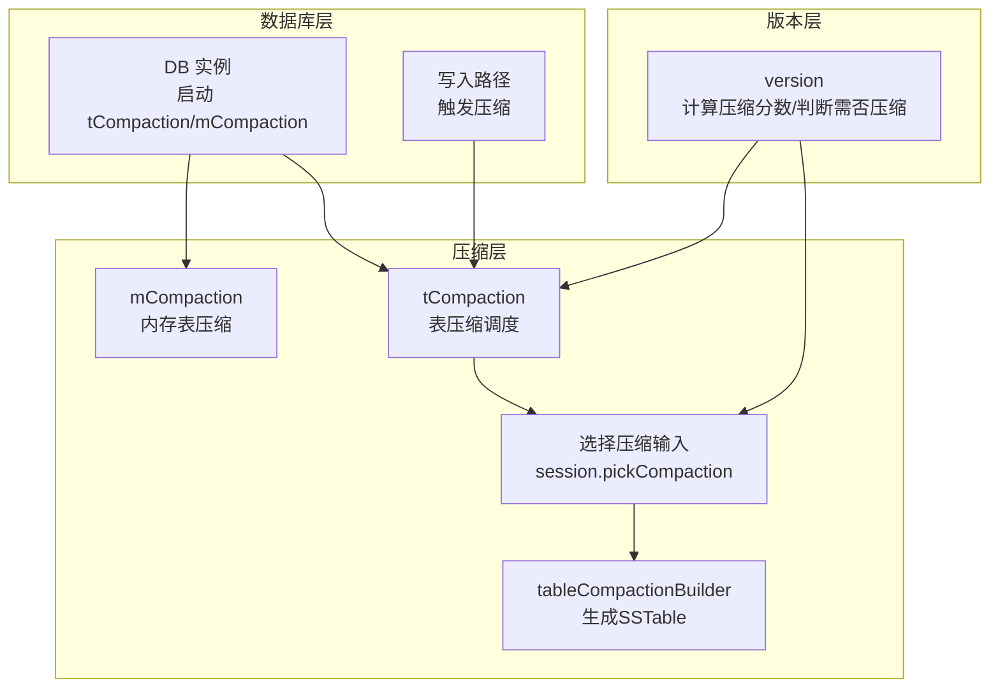
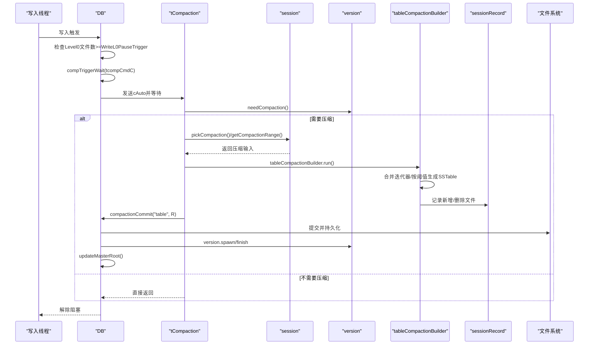
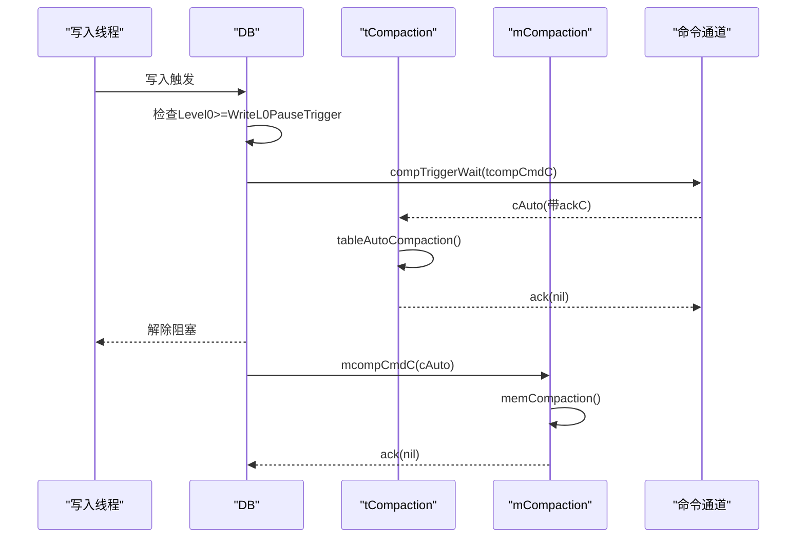
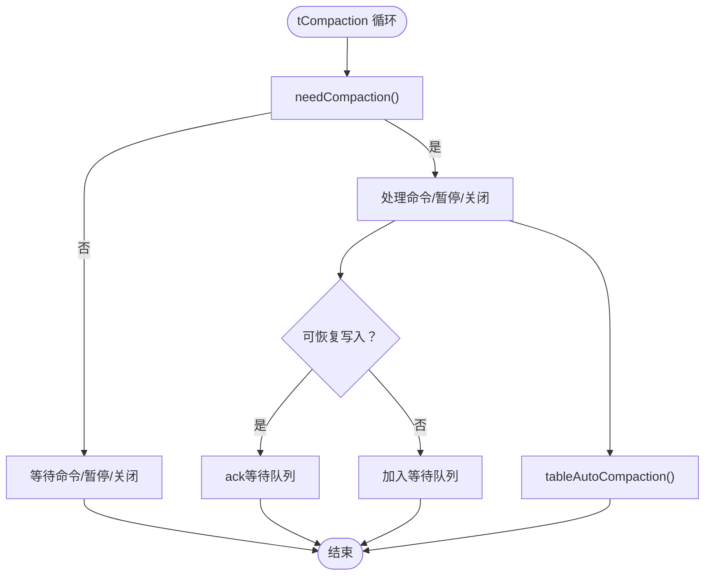
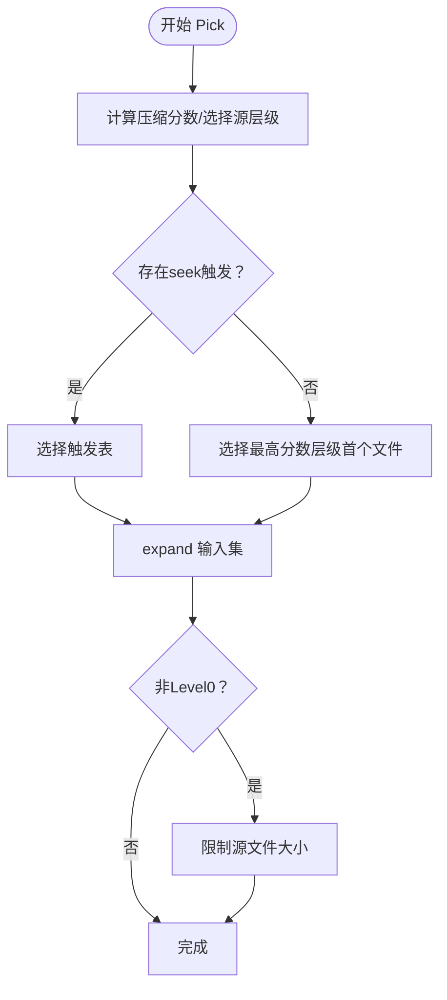
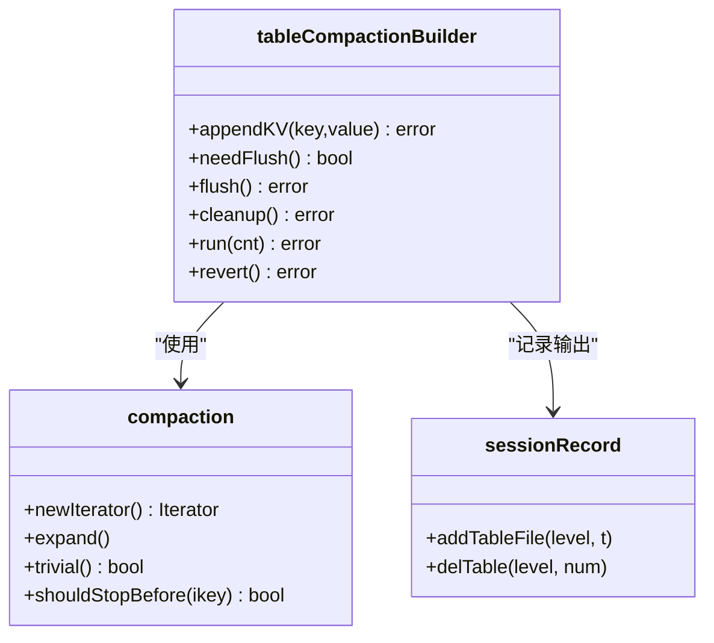
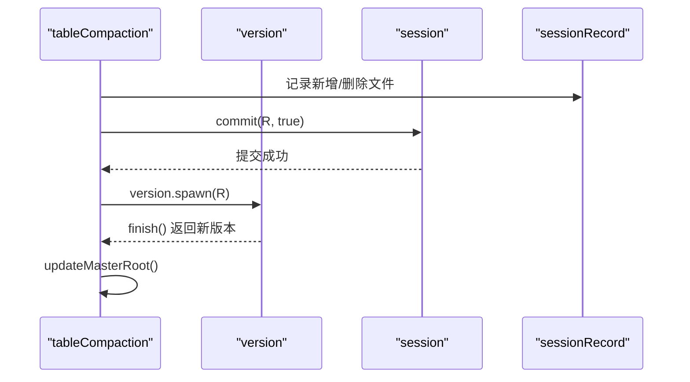
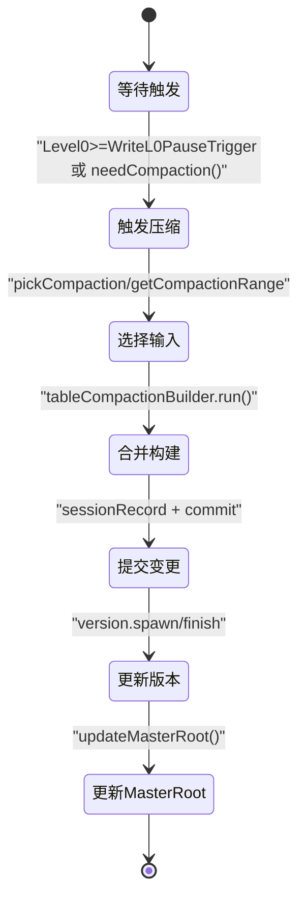
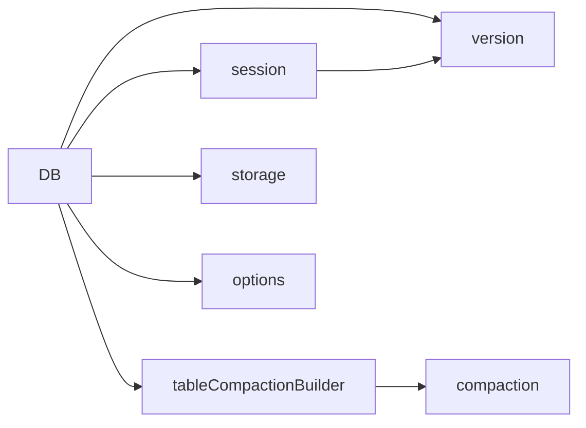

# 压缩流程

<cite>
**本文引用的文件**
- [leveldb/db_compaction.go](file://leveldb/db_compaction.go)
- [leveldb/session_compaction.go](file://leveldb/session_compaction.go)
- [leveldb/version.go](file://leveldb/version.go)
- [leveldb/db.go](file://leveldb/db.go)
- [leveldb/mlsm_final_comprehensive_test.go](file://leveldb/mlsm_final_comprehensive_test.go)
- [leveldb/table.go](file://leveldb/table.go)
- [leveldb/opt/options.go](file://leveldb/opt/options.go)
- [leveldb/options.go](file://leveldb/options.go)
- [leveldb/db_write.go](file://leveldb/db_write.go)
</cite>

## 目录
1. [简介](#简介)
2. [项目结构与定位](#项目结构与定位)
3. [核心组件](#核心组件)
4. [架构总览](#架构总览)
5. [详细组件分析](#详细组件分析)
6. [依赖关系分析](#依赖关系分析)
7. [性能考量](#性能考量)
8. [故障排查指南](#故障排查指南)
9. [结论](#结论)
10. [附录](#附录)

## 简介
本文件围绕 avccDB 的压缩流程，系统性阐述从触发压缩条件到生成新 SSTable 文件的完整过程。重点覆盖：
- 通过 compTriggerWait 和 compTrigger 机制触发压缩，包括 Level0 文件数达到 WriteL0PauseTrigger 阈值或后台自动触发。
- tCompaction 与 mCompaction 两个独立 goroutine 的职责分工与协作。
- 压缩选择输入文件（Pick）、合并不同层级数据、使用 table_builder 生成新 SSTable 并更新版本（Version）。
- 结合 mlsm_final_comprehensive_test 的综合测试，说明压缩对读取性能的优化与大规模场景下的资源消耗特征。

## 项目结构与定位
- 压缩主流程位于 leveldb/db_compaction.go，包含内存表压缩（memCompaction）、表压缩（tableCompaction）、压缩事务封装（compactionTransact）、命令触发（compTrigger/compTriggerWait）等。
- 压缩选择逻辑位于 leveldb/session_compaction.go，负责根据当前版本状态选择待压缩的层级与文件集合（pickCompaction、getCompactionRange）。
- 版本管理与压缩触发判断位于 leveldb/version.go，负责计算压缩分数（computeCompaction）、判断是否需要压缩（needCompaction）。
- 数据库启动与 goroutine 启动位于 leveldb/db.go，初始化 tCompaction 与 mCompaction。
- 写入路径中触发压缩的关键点位于 leveldb/db_write.go，当 Level0 文件数超过阈值时阻塞写入并等待压缩完成。
- 表构建与 SSTable 文件生成位于 leveldb/table.go，提供文件元信息与迭代器接口。
- 压缩阈值与参数来自 leveldb/opt/options.go 与 leveldb/options.go 的缓存选项。

图表来源
- [leveldb/db.go](file://leveldb/db.go#L160-L175)
- [leveldb/db_compaction.go](file://leveldb/db_compaction.go#L781-L890)
- [leveldb/session_compaction.go](file://leveldb/session_compaction.go#L56-L134)
- [leveldb/version.go](file://leveldb/version.go#L646-L695)
- [leveldb/db_write.go](file://leveldb/db_write.go#L66-L131)

章节来源
- [leveldb/db.go](file://leveldb/db.go#L160-L175)
- [leveldb/db_compaction.go](file://leveldb/db_compaction.go#L781-L890)
- [leveldb/session_compaction.go](file://leveldb/session_compaction.go#L56-L134)
- [leveldb/version.go](file://leveldb/version.go#L646-L695)
- [leveldb/db_write.go](file://leveldb/db_write.go#L66-L131)

## 核心组件
- 压缩触发与命令模型
  - compTrigger/compTriggerWait：向 tcompCmdC 发送 cAuto 或 cRange 命令；compTriggerWait 可等待压缩完成。
  - mcompCmdC：向 mCompaction 发送 cAuto 命令，触发内存表压缩。
- 压缩调度与执行
  - tCompaction：根据 needCompaction 自动调度 tableAutoCompaction；支持暂停/恢复与写入等待队列。
  - mCompaction：接收内存表压缩请求，调用 memCompaction。
- 压缩选择与输入确定
  - session.pickCompaction：基于版本压缩分数与 seek 触发，选择源层级与输入文件。
  - session.getCompactionRange：按范围选择输入文件，限制源文件大小。
- 压缩构建与输出
  - tableCompactionBuilder：遍历合并后的迭代器，按表大小阈值生成新的 SSTable 文件，记录到 sessionRecord。
  - tableCompaction：提交变更，更新版本，统计压缩指标。
- 版本与压缩分数
  - version.computeCompaction：计算各层级压缩分数与最佳压缩层级。
  - version.needCompaction：判断是否需要压缩（分数≥1 或存在 seek 触发）。

章节来源
- [leveldb/db_compaction.go](file://leveldb/db_compaction.go#L729-L779)
- [leveldb/db_compaction.go](file://leveldb/db_compaction.go#L781-L890)
- [leveldb/session_compaction.go](file://leveldb/session_compaction.go#L56-L134)
- [leveldb/version.go](file://leveldb/version.go#L646-L695)

## 架构总览
压缩流程从“触发”到“生成新文件”的端到端路径如下：
- 触发阶段：写入路径检测 Level0 文件数超过 WriteL0PauseTrigger，调用 compTriggerWait 阻塞写入直至压缩完成；或后台 tCompaction 根据 needCompaction 自动触发。
- 选择阶段：session.pickCompaction/getCompactionRange 依据版本状态与阈值选择输入文件集合。
- 执行阶段：tableCompactionBuilder 以迭代器方式合并输入，按阈值生成新 SSTable；tableCompaction 提交变更并更新版本。
- 更新阶段：version.spawn/finish 构建新版本，更新 MasterRoot。

图表来源
- [leveldb/db_write.go](file://leveldb/db_write.go#L66-L131)
- [leveldb/db_compaction.go](file://leveldb/db_compaction.go#L781-L890)
- [leveldb/session_compaction.go](file://leveldb/session_compaction.go#L56-L134)
- [leveldb/version.go](file://leveldb/version.go#L566-L583)
- [leveldb/db_compaction.go](file://leveldb/db_compaction.go#L567-L629)

## 详细组件分析

### 压缩触发与命令模型
- compTrigger：向 tcompCmdC 发送 cAuto，非阻塞地触发一次自动压缩。
- compTriggerWait：发送 cAuto 并携带 ackC，阻塞等待压缩完成；若发生错误则返回。
- compTriggerRange：发送 cRange 请求指定层级与范围的压缩，支持等待结果。
- mCompaction：仅接收 cAuto，执行 memCompaction，用于内存表刷新为 SSTable。

图表来源
- [leveldb/db_compaction.go](file://leveldb/db_compaction.go#L729-L779)
- [leveldb/db_compaction.go](file://leveldb/db_compaction.go#L781-L890)

章节来源
- [leveldb/db_compaction.go](file://leveldb/db_compaction.go#L729-L779)
- [leveldb/db_compaction.go](file://leveldb/db_compaction.go#L781-L890)

### 压缩调度与暂停/恢复
- tCompaction 主循环：
  - 若 needCompaction 为真，优先处理命令；否则进入等待。
  - 收到 cAuto 时，若当前可恢复写入（Level0 文件数低于 WriteL0PauseTrigger），直接 ack；否则加入等待队列。
  - 收到 cRange 时，立即执行范围压缩。
  - 收到 tcompPauseC 时，暂停压缩直到收到 resume 信号。
- mCompaction：仅处理 cAuto，执行内存表压缩。

图表来源
- [leveldb/db_compaction.go](file://leveldb/db_compaction.go#L813-L890)

章节来源
- [leveldb/db_compaction.go](file://leveldb/db_compaction.go#L813-L890)

### 压缩选择与输入确定（Pick）
- session.pickCompaction：
  - 若版本压缩分数 cScore≥1，选择最高分数层级作为源层级，取其首个重叠文件或跨越指针后的第一个文件。
  - 若存在 seek 触发（cSeek 指针），选择该表作为源表。
  - 返回 compaction 对象，内部会 expand 扩展输入集并保存快照。
- session.getCompactionRange：
  - 按给定层级与范围查找重叠文件，限制源文件总大小（非 Level0）。
  - 返回 compaction 对象，内部同样 expand 并保存快照。

图表来源
- [leveldb/session_compaction.go](file://leveldb/session_compaction.go#L56-L134)
- [leveldb/version.go](file://leveldb/version.go#L646-L695)

章节来源
- [leveldb/session_compaction.go](file://leveldb/session_compaction.go#L56-L134)
- [leveldb/version.go](file://leveldb/version.go#L646-L695)

### 表压缩构建与 SSTable 生成
- tableCompaction：
  - 若为 trivial（单文件且无 GP 超标），直接移动到下一层级。
  - 否则构造 tableCompactionBuilder，遍历 compaction.newIterator 合并输入。
  - 按阈值生成新表，记录到 sessionRecord，提交并更新版本。
- tableCompactionBuilder.run：
  - 维护 lastUkey/lastSeq 等状态，过滤过期版本与删除标记（mLSM 特性保留删除标记）。
  - 达到表大小阈值或 shouldStopBefore 时 flush 新表。
  - revert 在失败时清理临时文件。

图表来源
- [leveldb/db_compaction.go](file://leveldb/db_compaction.go#L356-L629)
- [leveldb/session_compaction.go](file://leveldb/session_compaction.go#L292-L330)

章节来源
- [leveldb/db_compaction.go](file://leveldb/db_compaction.go#L356-L629)
- [leveldb/session_compaction.go](file://leveldb/session_compaction.go#L292-L330)

### 版本更新与 MasterRoot
- version.spawn/finish：基于 sessionRecord 构建新版本，避免对已删除文件进行全量排序，采用二分插入策略提升大表场景效率。
- updateMasterRoot：在内存表压缩与表压缩完成后更新聚合根，确保 Merkle 证明一致性。

图表来源
- [leveldb/version.go](file://leveldb/version.go#L566-L583)
- [leveldb/version.go](file://leveldb/version.go#L744-L817)
- [leveldb/db_compaction.go](file://leveldb/db_compaction.go#L627-L629)

章节来源
- [leveldb/version.go](file://leveldb/version.go#L566-L583)
- [leveldb/version.go](file://leveldb/version.go#L744-L817)
- [leveldb/db_compaction.go](file://leveldb/db_compaction.go#L627-L629)

### 压缩状态机（关键阶段）
- 触发：写入检测 Level0 文件数达到阈值，调用 compTriggerWait。
- 选择：根据版本分数与 seek 触发选择输入文件。
- 执行：tableCompactionBuilder 合并迭代器，按阈值生成新表。
- 提交：sessionRecord 记录变更，提交并更新版本。
- 更新：MasterRoot 聚合更新。

图表来源
- [leveldb/db_write.go](file://leveldb/db_write.go#L66-L131)
- [leveldb/version.go](file://leveldb/version.go#L646-L695)
- [leveldb/session_compaction.go](file://leveldb/session_compaction.go#L56-L134)
- [leveldb/db_compaction.go](file://leveldb/db_compaction.go#L356-L629)
- [leveldb/version.go](file://leveldb/version.go#L566-L583)

## 依赖关系分析
- 组件耦合
  - DB 依赖 session 与 version 进行压缩决策与版本更新。
  - tableCompactionBuilder 依赖 compaction 的迭代器与 shouldStopBefore 控制输出。
  - version.spawn/finish 依赖 sessionRecord 的增删记录，避免全量排序。
- 外部依赖
  - 存储层（storage）负责 SSTable 文件的创建、删除与同步。
  - 选项层（opt/options.go 与 options.go）提供压缩阈值与表大小等参数。

图表来源
- [leveldb/db.go](file://leveldb/db.go#L160-L175)
- [leveldb/db_compaction.go](file://leveldb/db_compaction.go#L356-L629)
- [leveldb/session_compaction.go](file://leveldb/session_compaction.go#L136-L192)
- [leveldb/version.go](file://leveldb/version.go#L566-L583)
- [leveldb/opt/options.go](file://leveldb/opt/options.go#L470-L541)

章节来源
- [leveldb/db.go](file://leveldb/db.go#L160-L175)
- [leveldb/db_compaction.go](file://leveldb/db_compaction.go#L356-L629)
- [leveldb/session_compaction.go](file://leveldb/session_compaction.go#L136-L192)
- [leveldb/version.go](file://leveldb/version.go#L566-L583)
- [leveldb/opt/options.go](file://leveldb/opt/options.go#L470-L541)

## 性能考量
- 写入阻塞与吞吐
  - 当 Level0 文件数达到 WriteL0PauseTrigger 时，写入线程会阻塞等待压缩完成，避免 Level0 过度膨胀导致读放大。
- 压缩阈值与表大小
  - CompactionL0Trigger、CompactionTotalSize、CompactionTableSize 等参数直接影响压缩频率与单次压缩规模。
- 大表场景优化
  - version.spawn/finish 对 trivial 场景采用二分插入策略，避免全量排序带来的 O(n log n) 开销。
- 读取性能优化
  - 压缩减少 Level0 文件数量与重叠，降低每次读取需要合并的文件数，从而降低读放大。

章节来源
- [leveldb/db_write.go](file://leveldb/db_write.go#L66-L131)
- [leveldb/version.go](file://leveldb/version.go#L784-L817)
- [leveldb/opt/options.go](file://leveldb/opt/options.go#L470-L541)

## 故障排查指南
- 压缩错误传播
  - compactionError：统一收集 transient/persistent 错误，必要时持有写锁阻止写入。
- 压缩回退与重试
  - compactionTransact：带指数退避的重试机制，支持 revert 清理临时文件。
- 常见问题定位
  - 若写入长时间阻塞：检查 Level0 文件数是否持续高于 WriteL0PauseTrigger，确认 tCompaction 是否正常运行。
  - 若压缩失败：关注 compErrC/compPerErrC 中的错误类型，区分瞬时与持久错误。

章节来源
- [leveldb/db_compaction.go](file://leveldb/db_compaction.go#L87-L139)
- [leveldb/db_compaction.go](file://leveldb/db_compaction.go#L152-L235)

## 结论
avccDB 的压缩流程通过“触发—选择—执行—提交—更新”的闭环实现高效的数据组织与读取优化。tCompaction 与 mCompaction 协同工作，前者负责表压缩调度，后者负责内存表刷新；二者均受版本状态与阈值驱动。压缩过程中，tableCompactionBuilder 以迭代器合并输入并按阈值生成新表，最终通过 sessionRecord 与 version.spawn/finish 完成版本更新与 MasterRoot 聚合。在大规模数据场景下，合理的阈值配置与二分插入优化显著降低了压缩成本与读放大风险。

## 附录
- 压缩对读取性能的优化与资源消耗（基于综合测试）
  - 在大规模写入与版本化查询场景下，压缩有效减少 Level0 文件数量与重叠，提升读取性能。
  - 综合测试通过较小的 WriteBuffer 与 CompactionTableSize，频繁触发压缩，验证了压缩在高并发写入下的稳定性与正确性。
  - 测试还展示了 MasterRoot 在压缩后的一致性更新，保证历史版本查询与 Merkle 证明的有效性。

章节来源
- [leveldb/mlsm_final_comprehensive_test.go](file://leveldb/mlsm_final_comprehensive_test.go#L1-L200)