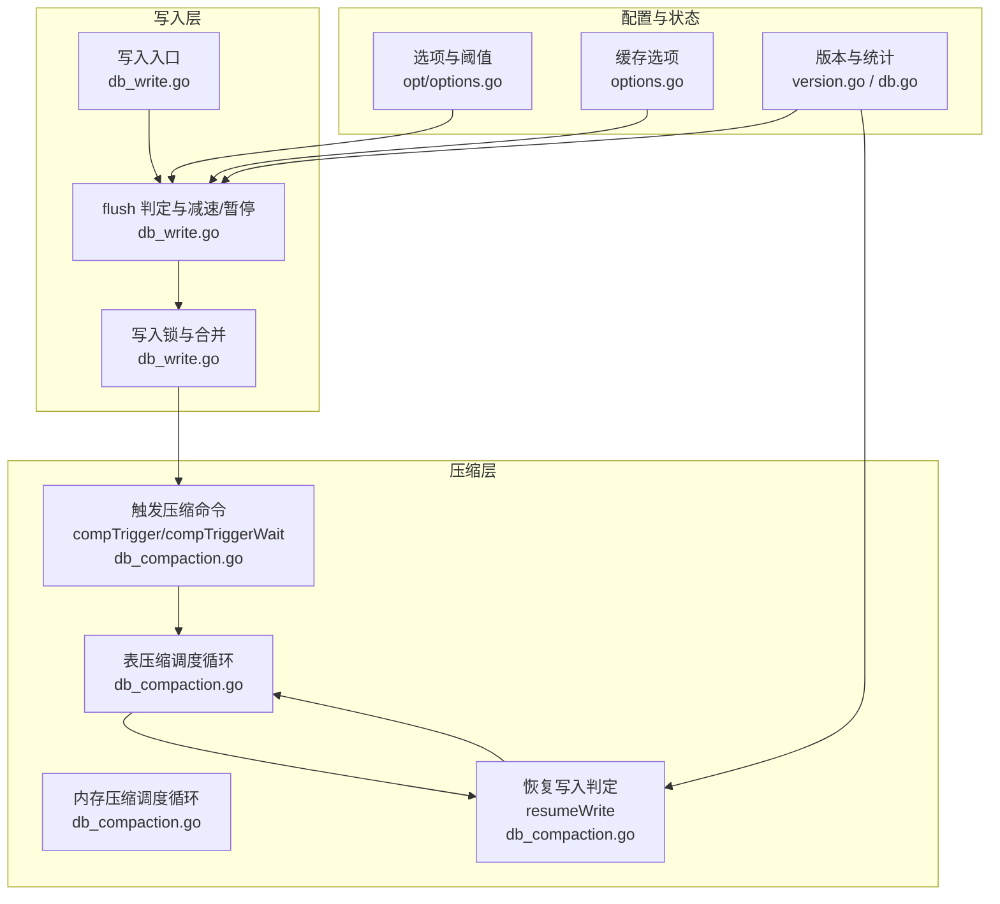
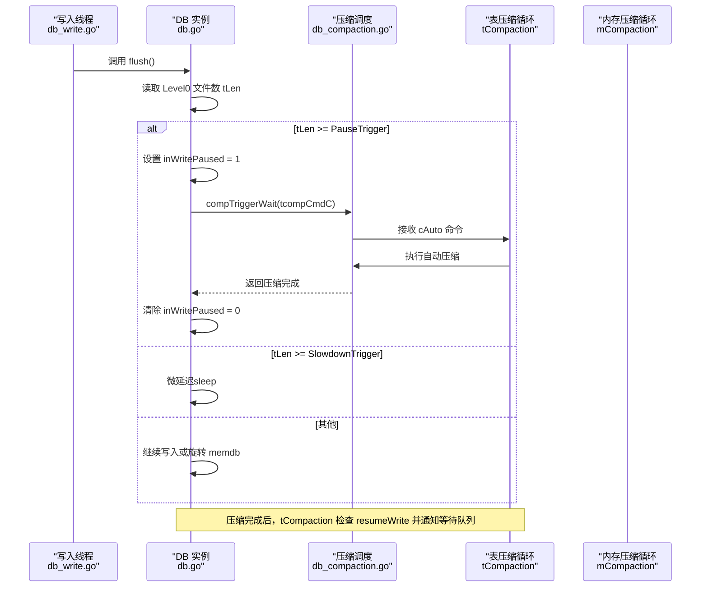
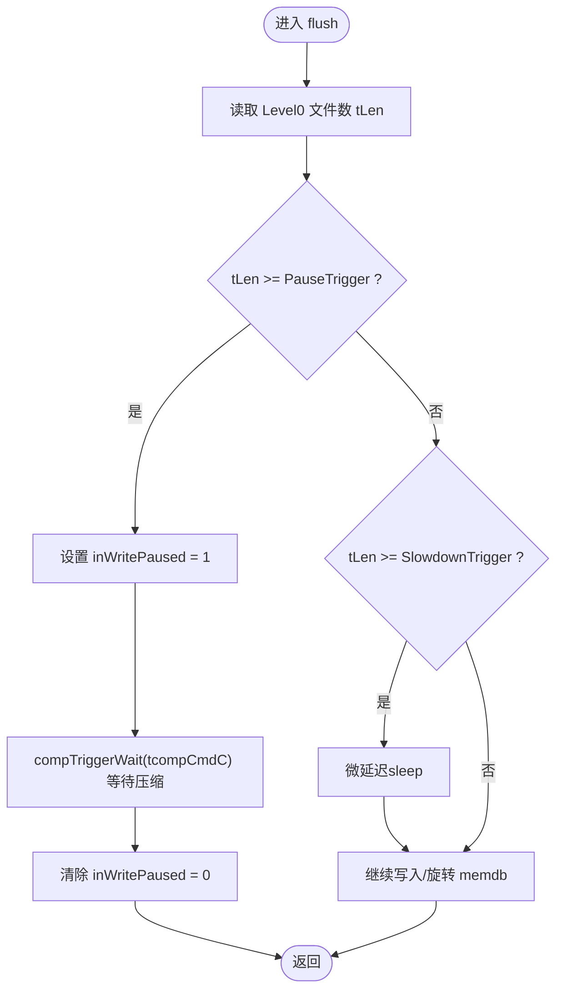
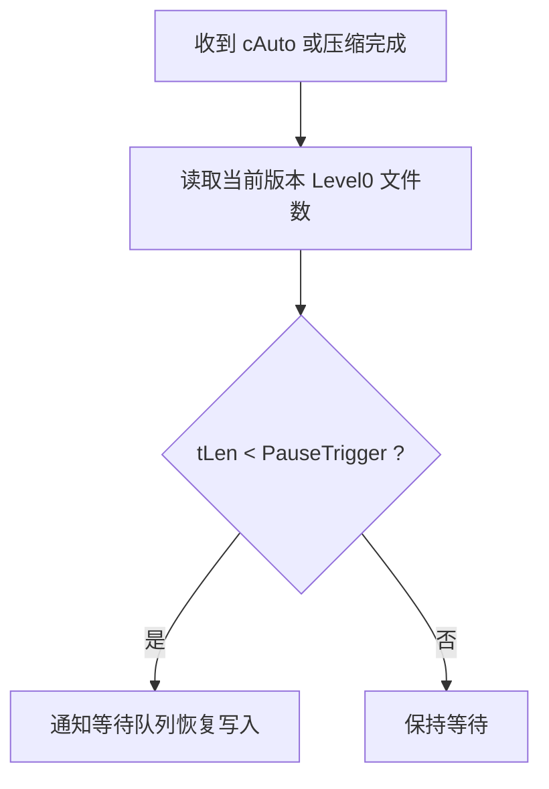
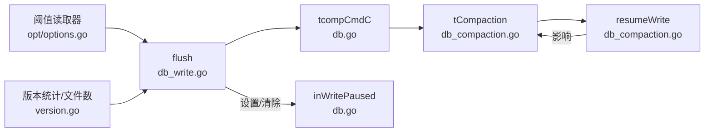

# 写入触发机制

<cite>
**本文引用的文件**
- [leveldb/db_write.go](file://leveldb/db_write.go)
- [leveldb/db_compaction.go](file://leveldb/db_compaction.go)
- [leveldb/db_state.go](file://leveldb/db_state.go)
- [leveldb/db.go](file://leveldb/db.go)
- [leveldb/options.go](file://leveldb/options.go)
- [leveldb/opt/options.go](file://leveldb/opt/options.go)
- [leveldb/version.go](file://leveldb/version.go)
</cite>

## 目录
1. [引言](#引言)
2. [项目结构](#项目结构)
3. [核心组件](#核心组件)
4. [架构总览](#架构总览)
5. [详细组件分析](#详细组件分析)
6. [依赖关系分析](#依赖关系分析)
7. [性能考量](#性能考量)
8. [故障排查指南](#故障排查指南)
9. [结论](#结论)

## 引言
本文件围绕 avccDB 的写入触发机制展开，聚焦于 Level0 文件数量达到阈值时的写入减速与暂停策略，以及触发压缩的完整流程。重点解释：
- 当 Level0 文件数量达到 WriteL0SlowdownTrigger（默认8）时，写入进行减速（微延迟）；
- 达到 WriteL0PauseTrigger（默认12）时，写入被暂停，并通过 compTriggerWait 方法向表压缩通道发送 cAuto 命令以触发压缩；
- 压缩完成后，通过 resumeWrite 状态检查恢复写入；
- 展示从“正常写入”到“减速/暂停”，再到“触发压缩”的状态转换图，说明该机制如何避免 Level0 过度累积导致读取性能下降。

## 项目结构
与写入触发机制直接相关的模块包括：
- 写入路径：db_write.go 中的 flush/writeLocked 等流程
- 压缩调度：db_compaction.go 中的 compTrigger/compTriggerWait、tCompaction、mCompaction、resumeWrite
- 配置项：opt/options.go 中的默认阈值与 options.go 中的读取器
- 版本与统计：version.go 中的版本信息与统计字段；db.go 中的写入暂停标志等



图表来源
- [leveldb/db_write.go](file://leveldb/db_write.go#L66-L131)
- [leveldb/db_compaction.go](file://leveldb/db_compaction.go#L681-L757)
- [leveldb/db_compaction.go](file://leveldb/db_compaction.go#L813-L890)
- [leveldb/opt/options.go](file://leveldb/opt/options.go#L40-L45)
- [leveldb/opt/options.go](file://leveldb/opt/options.go#L673-L685)
- [leveldb/options.go](file://leveldb/options.go#L25-L44)
- [leveldb/version.go](file://leveldb/version.go#L1-L200)
- [leveldb/db.go](file://leveldb/db.go#L33-L98)

章节来源
- [leveldb/db_write.go](file://leveldb/db_write.go#L66-L131)
- [leveldb/db_compaction.go](file://leveldb/db_compaction.go#L681-L757)
- [leveldb/db_compaction.go](file://leveldb/db_compaction.go#L813-L890)
- [leveldb/opt/options.go](file://leveldb/opt/options.go#L40-L45)
- [leveldb/opt/options.go](file://leveldb/opt/options.go#L673-L685)
- [leveldb/options.go](file://leveldb/options.go#L25-L44)
- [leveldb/version.go](file://leveldb/version.go#L1-L200)
- [leveldb/db.go](file://leveldb/db.go#L33-L98)

## 核心组件
- 写入减速与暂停逻辑：在 flush 中根据 Level0 文件数与两个阈值进行判断，必要时设置写入暂停标志并等待压缩完成。
- 压缩触发与等待：compTrigger 发送 cAuto 命令，compTriggerWait 在有 ackC 时阻塞等待压缩完成。
- 恢复写入判定：resumeWrite 基于当前 Level0 文件数与暂停阈值判断是否允许写入继续。
- 表压缩调度循环：tCompaction 在需要时处理 cAuto/cRange 命令并调用自动压缩。
- 内存压缩调度循环：mCompaction 触发 memdb 刷写并随后触发表压缩。

章节来源
- [leveldb/db_write.go](file://leveldb/db_write.go#L66-L131)
- [leveldb/db_compaction.go](file://leveldb/db_compaction.go#L681-L757)
- [leveldb/db_compaction.go](file://leveldb/db_compaction.go#L813-L890)
- [leveldb/db_compaction.go](file://leveldb/db_compaction.go#L681-L700)

## 架构总览
下图展示了写入减速/暂停与压缩触发的关键交互路径，以及恢复写入的条件判断。



图表来源
- [leveldb/db_write.go](file://leveldb/db_write.go#L66-L131)
- [leveldb/db_compaction.go](file://leveldb/db_compaction.go#L681-L757)
- [leveldb/db_compaction.go](file://leveldb/db_compaction.go#L813-L890)

## 详细组件分析

### 写入减速与暂停（flush）
- 读取 Level0 文件数 tLen = db.s.tLen(0)
- 若 tLen >= slowdownTrigger（默认8），写入进入微延迟（sleep），以降低写入速率
- 若 tLen >= pauseTrigger（默认12），写入被暂停：
  - 设置写入暂停标志 inWritePaused = 1
  - 调用 compTriggerWait(db.tcompCmdC) 等待压缩完成
  - 压缩完成后清除暂停标志 inWritePaused = 0
- 默认情况下，若 memdb 可用空间足够或未达到阈值，则继续写入或旋转 memdb



图表来源
- [leveldb/db_write.go](file://leveldb/db_write.go#L66-L131)

章节来源
- [leveldb/db_write.go](file://leveldb/db_write.go#L66-L131)

### 压缩触发与等待（compTrigger/compTriggerWait）
- compTrigger：向压缩通道发送 cAuto 命令，非阻塞
- compTriggerWait：构造带 ackC 的 cAuto 命令，发送后阻塞等待压缩完成，同时处理压缩错误与关闭事件

```mermaid
sequenceDiagram
participant Caller as "调用方"
participant DB as "DB 实例"
participant CmdC as "压缩通道"
participant Loop as "压缩循环"
Caller->>DB : compTriggerWait(compC)
DB->>CmdC : 发送 cAuto{ackC}
alt 有 ackC
DB->>Loop : 等待 ackC
Loop-->>DB : 返回压缩结果/错误
DB-->>Caller : 返回结果
else 无 ackC
DB->>Loop : 发送 cAuto
DB-->>Caller : 立即返回
end
```

图表来源
- [leveldb/db_compaction.go](file://leveldb/db_compaction.go#L681-L757)

章节来源
- [leveldb/db_compaction.go](file://leveldb/db_compaction.go#L681-L757)

### 恢复写入判定（resumeWrite）
- 基于当前版本的 Level0 文件数与暂停阈值比较，决定是否允许写入继续
- tCompaction 在收到 cAuto 命令或处理完压缩后，检查 resumeWrite，若满足则通知等待队列中的写入请求



图表来源
- [leveldb/db_compaction.go](file://leveldb/db_compaction.go#L681-L700)
- [leveldb/db_compaction.go](file://leveldb/db_compaction.go#L813-L890)

章节来源
- [leveldb/db_compaction.go](file://leveldb/db_compaction.go#L681-L700)
- [leveldb/db_compaction.go](file://leveldb/db_compaction.go#L813-L890)

### 表压缩调度循环（tCompaction）
- 当需要压缩时，接收 cAuto/cRange 命令并执行自动压缩
- 若存在等待队列且满足 resumeWrite 条件，立即通知等待的写入请求

章节来源
- [leveldb/db_compaction.go](file://leveldb/db_compaction.go#L813-L890)

### 内存压缩与后续触发（mCompaction）
- 内存压缩过程中会暂停表压缩，压缩完成后恢复表压缩并触发一次表压缩

章节来源
- [leveldb/db_compaction.go](file://leveldb/db_compaction.go#L269-L354)

### 配置项与默认阈值
- 默认阈值定义于 opt/options.go：
  - DefaultWriteL0PauseTrigger = 12
  - DefaultWriteL0SlowdownTrigger = 8
- 读取器位于 opt/options.go 的 GetWriteL0PauseTrigger/GetWriteL0SlowdownTrigger
- 缓存选项位于 options.go 的 cachedOptions，用于加速读取

章节来源
- [leveldb/opt/options.go](file://leveldb/opt/options.go#L40-L45)
- [leveldb/opt/options.go](file://leveldb/opt/options.go#L673-L685)
- [leveldb/options.go](file://leveldb/options.go#L25-L44)

## 依赖关系分析
- 写入路径依赖配置阈值与版本统计
- 压缩调度依赖版本信息与压缩通道
- 状态标志 inWritePaused 由写入路径设置，由压缩循环与恢复判定共同使用



图表来源
- [leveldb/opt/options.go](file://leveldb/opt/options.go#L673-L685)
- [leveldb/db_write.go](file://leveldb/db_write.go#L66-L131)
- [leveldb/version.go](file://leveldb/version.go#L1-L200)
- [leveldb/db.go](file://leveldb/db.go#L33-L98)
- [leveldb/db_compaction.go](file://leveldb/db_compaction.go#L813-L890)

章节来源
- [leveldb/opt/options.go](file://leveldb/opt/options.go#L673-L685)
- [leveldb/db_write.go](file://leveldb/db_write.go#L66-L131)
- [leveldb/version.go](file://leveldb/version.go#L1-L200)
- [leveldb/db.go](file://leveldb/db.go#L33-L98)
- [leveldb/db_compaction.go](file://leveldb/db_compaction.go#L813-L890)

## 性能考量
- 写入减速（微延迟）可平滑流量峰值，避免 Level0 快速堆积
- 写入暂停配合压缩触发，确保后台及时清理 Level0，避免读放大
- 恢复写入判定基于当前 Level0 文件数，避免过早放行导致再次堆积
- 压缩通道采用非阻塞发送 compTrigger 与阻塞等待 compTriggerWait 的组合，兼顾吞吐与一致性

## 故障排查指南
- 若写入长时间阻塞：
  - 检查是否达到 PauseTrigger 导致写入暂停
  - 查看压缩循环是否正常运行（tCompaction/mCompaction）
  - 关注压缩错误通道与持久化错误通道
- 若压缩无法触发：
  - 确认 compTrigger/compTriggerWait 是否正确发送/接收命令
  - 检查压缩通道是否被关闭或阻塞
- 若恢复写入不生效：
  - 检查 resumeWrite 判定逻辑与当前 Level0 文件数
  - 确认等待队列是否被正确通知

章节来源
- [leveldb/db_compaction.go](file://leveldb/db_compaction.go#L681-L757)
- [leveldb/db_compaction.go](file://leveldb/db_compaction.go#L813-L890)

## 结论
avccDB 的写入触发机制通过“阈值驱动 + 压缩触发 + 状态恢复”的闭环设计，有效控制 Level0 文件数量，防止其过度累积导致读取性能下降。默认阈值（慢速阈值8、暂停阈值12）在大多数场景下平衡了写入吞吐与读取效率；通过 compTriggerWait 与 resumeWrite 的配合，系统能够在后台压缩完成后及时恢复写入，维持稳定的服务质量。