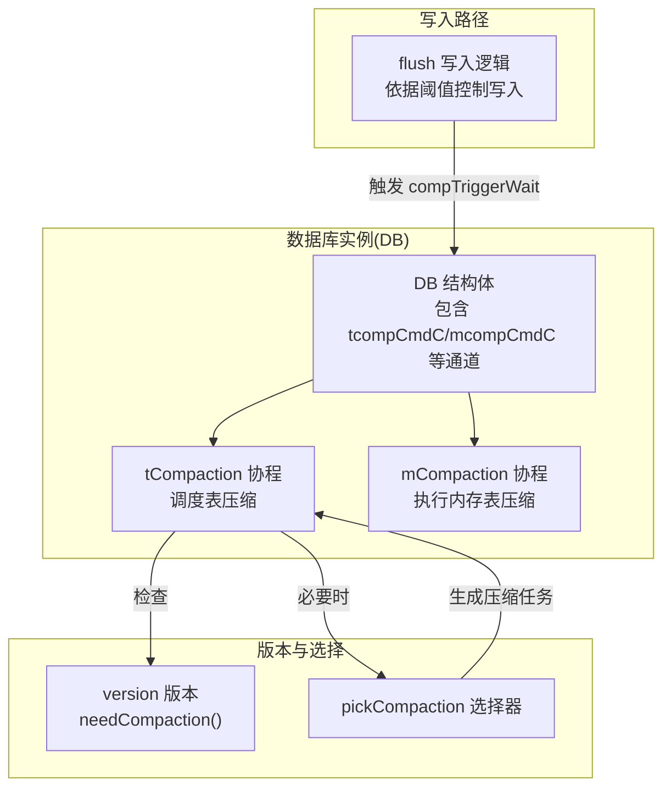
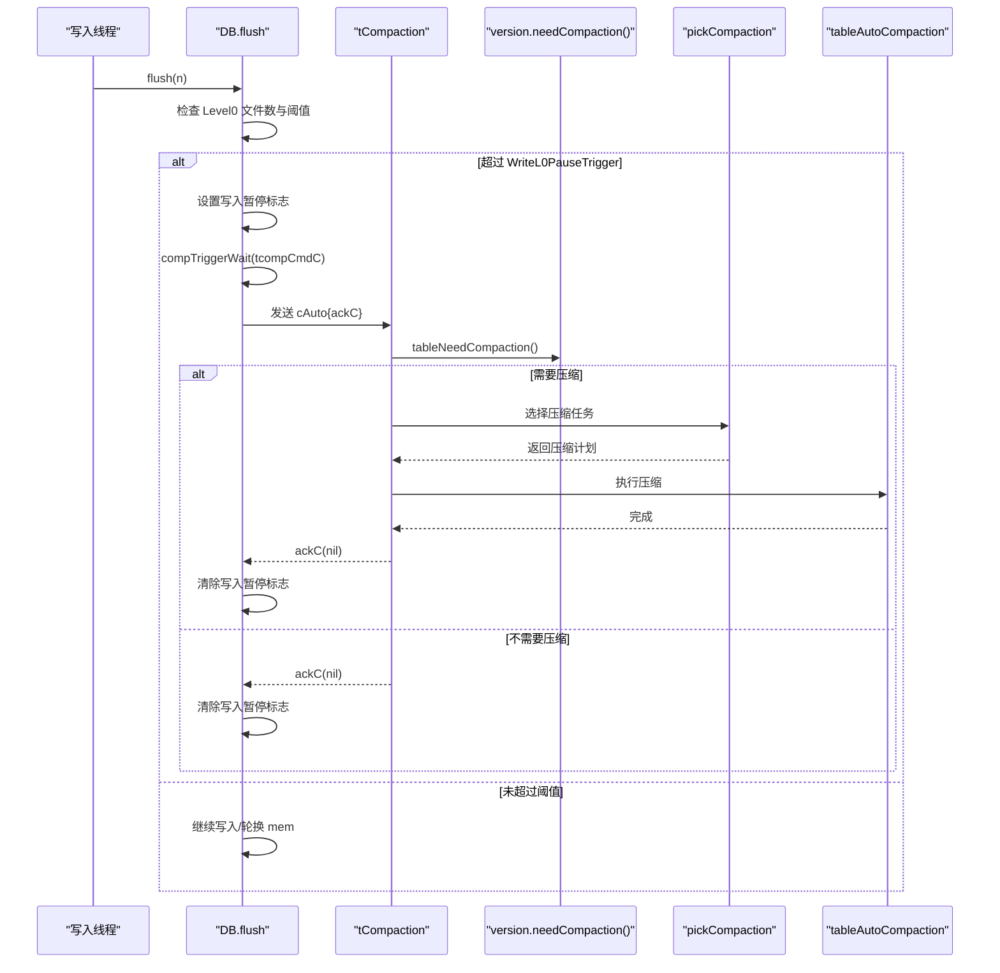
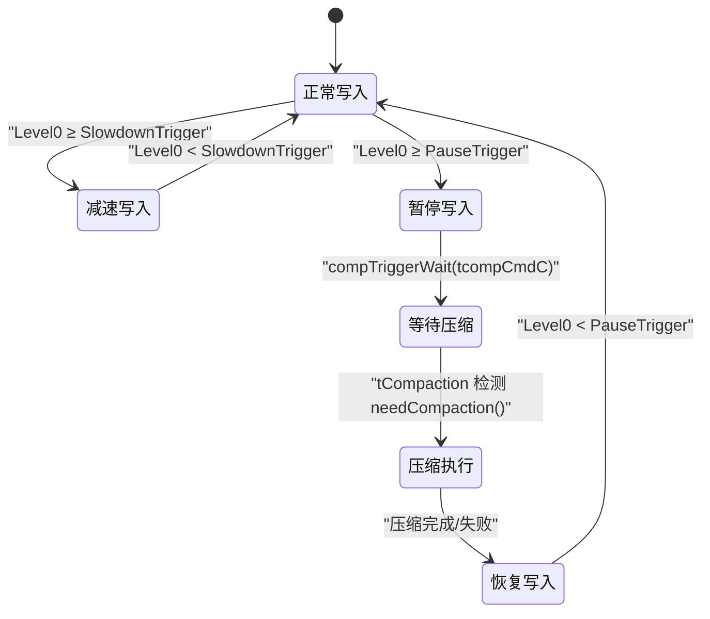
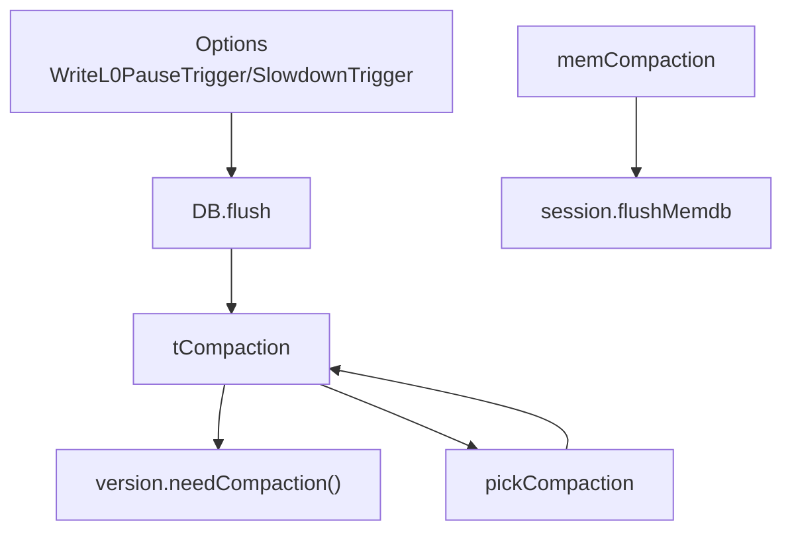

# 压缩触发机制

<cite>
**本文引用的文件**
- [leveldb/db.go](file://leveldb/db.go)
- [leveldb/db_compaction.go](file://leveldb/db_compaction.go)
- [leveldb/db_write.go](file://leveldb/db_write.go)
- [leveldb/db_state.go](file://leveldb/db_state.go)
- [leveldb/version.go](file://leveldb/version.go)
- [leveldb/opt/options.go](file://leveldb/opt/options.go)
- [leveldb/session_compaction.go](file://leveldb/session_compaction.go)
- [leveldb/db_test.go](file://leveldb/db_test.go)
</cite>

## 目录
1. [简介](#简介)
2. [项目结构与入口](#项目结构与入口)
3. [核心组件](#核心组件)
4. [架构总览](#架构总览)
5. [详细组件分析](#详细组件分析)
6. [依赖关系分析](#依赖关系分析)
7. [性能考量](#性能考量)
8. [故障排查指南](#故障排查指南)
9. [结论](#结论)
10. [附录：关键配置与阈值](#附录关键配置与阈值)

## 简介
本文件围绕 avccDB 的压缩触发机制展开，重点阐述两类触发方式：
- compTriggerWait：写入路径上的“等待式”触发，用于在 Level0 文件数量超过 WriteL0PauseTrigger 阈值时暂停写入并等待一次压缩完成。
- compTrigger：后台“非等待式”触发，用于在后台检查或外部请求时发起一次压缩尝试。

同时，文档解释后台定期检查 tableNeedCompaction() 的自动触发机制、cAuto 和 cRange 命令在 mcompCmdC 和 tcompCmdC 通道中的传递过程，并结合 TestDB_MinorCompactionsHappen 等测试用例说明触发条件。最后给出状态转换图，展示从写入压力累积到触发压缩命令的完整流程，并说明 DisableCompactionBackoff 对重试策略的影响。

## 项目结构与入口
- 数据库对象 DB 在打开时启动两条后台协程：tCompaction（表压缩调度）和 mCompaction（内存表压缩执行），并通过通道 mcompCmdC、tcompCmdC 与命令交互。
- 写入路径在 flush 时根据 WriteL0SlowdownTrigger 和 WriteL0PauseTrigger 判断是否需要减速或暂停写入，并通过 compTriggerWait 触发压缩。
- 表压缩调度器 tCompaction 会周期性检查版本 needCompaction()，并在满足条件时执行压缩；同时支持 cAuto/cRange 命令队列与等待确认。

图表来源
- [leveldb/db.go](file://leveldb/db.go#L160-L175)
- [leveldb/db_compaction.go](file://leveldb/db_compaction.go#L669-L889)
- [leveldb/db_write.go](file://leveldb/db_write.go#L66-L131)
- [leveldb/version.go](file://leveldb/version.go#L693-L695)

章节来源
- [leveldb/db.go](file://leveldb/db.go#L160-L175)
- [leveldb/db_compaction.go](file://leveldb/db_compaction.go#L669-L889)
- [leveldb/db_write.go](file://leveldb/db_write.go#L66-L131)
- [leveldb/version.go](file://leveldb/version.go#L693-L695)

## 核心组件
- 触发命令类型
  - cAuto：无等待触发，用于后台自动压缩；可带 ackC 等待确认。
  - cRange：范围压缩触发，指定层级与键区间。
- 触发接口
  - compTrigger：向通道发送 cAuto，不等待结果。
  - compTriggerWait：向通道发送带 ackC 的 cAuto，阻塞等待压缩完成或错误。
  - compTriggerRange：向通道发送 cRange 并等待结果。
- 后台调度
  - tCompaction：读取 tcompCmdC，结合 tableNeedCompaction() 与等待队列，执行 tableAutoCompaction()。
  - mCompaction：读取 mcompCmdC，执行 memCompaction()。

章节来源
- [leveldb/db_compaction.go](file://leveldb/db_compaction.go#L696-L779)
- [leveldb/db_compaction.go](file://leveldb/db_compaction.go#L781-L889)

## 架构总览
下图展示了从写入压力到压缩触发的端到端流程，包括 compTriggerWait 与 compTrigger 的差异、后台自动检查与命令队列处理。

图表来源
- [leveldb/db_write.go](file://leveldb/db_write.go#L66-L131)
- [leveldb/db_compaction.go](file://leveldb/db_compaction.go#L669-L889)
- [leveldb/version.go](file://leveldb/version.go#L693-L695)

章节来源
- [leveldb/db_write.go](file://leveldb/db_write.go#L66-L131)
- [leveldb/db_compaction.go](file://leveldb/db_compaction.go#L669-L889)
- [leveldb/version.go](file://leveldb/version.go#L693-L695)

## 详细组件分析

### compTriggerWait 与 compTrigger 的区别与行为
- compTriggerWait
  - 发送带 ackC 的 cAuto，阻塞等待压缩完成或错误；若压缩成功则 ackC 接收 nil，否则接收具体错误。
  - 适用于写入路径在达到暂停阈值时的“等待式”触发，确保写入压力缓解后再继续。
- compTrigger
  - 发送 cAuto，不等待结果；适用于后台检查或无需立即同步等待的场景。
  - 可能被 tCompaction 的等待队列缓存，直到满足 resumeWrite 条件才 ack。

章节来源
- [leveldb/db_compaction.go](file://leveldb/db_compaction.go#L729-L779)
- [leveldb/db_compaction.go](file://leveldb/db_compaction.go#L813-L889)

### 写入路径的阈值控制与暂停写入
- flush 中使用两个阈值：
  - WriteL0SlowdownTrigger：超过该阈值时写入开始减速（短暂休眠）。
  - WriteL0PauseTrigger：超过该阈值时设置写入暂停标志，调用 compTriggerWait 触发压缩，等待压缩完成后恢复写入。
- 写入暂停期间会清除标志位，避免后续写入误判。

章节来源
- [leveldb/db_write.go](file://leveldb/db_write.go#L66-L131)
- [leveldb/opt/options.go](file://leveldb/opt/options.go#L401-L411)

### 后台自动触发机制：tableNeedCompaction()
- tCompaction 在每次循环中调用 tableNeedCompaction() 判断是否需要压缩。
- 若需要压缩，则从 tcompCmdC 获取命令并执行压缩；若不需要压缩，则清空等待队列并继续监听命令。
- 当有等待的 cAuto 命令且满足 resumeWrite 条件（Level0 文件数低于 WriteL0PauseTrigger）时，立即 ack 通知等待方。

章节来源
- [leveldb/db_compaction.go](file://leveldb/db_compaction.go#L669-L700)
- [leveldb/db_compaction.go](file://leveldb/db_compaction.go#L813-L889)
- [leveldb/version.go](file://leveldb/version.go#L693-L695)

### 命令在通道中的传递与处理
- mcompCmdC：仅接受 cAuto，执行 memCompaction() 并 ack。
- tcompCmdC：接受 cAuto/cRange，维护等待队列 waitQ；当满足 resumeWrite 条件时批量 ack；执行 tableAutoCompaction()。
- cAuto 可带 ackC，用于 compTriggerWait 或等待队列；cRange 用于范围压缩。

章节来源
- [leveldb/db_compaction.go](file://leveldb/db_compaction.go#L781-L889)

### 迭代采样触发压缩
- 当迭代采样命中时，调用 compTrigger(tcompCmdC) 触发一次表压缩，以优化后续读取的层级查找。

章节来源
- [leveldb/db_state.go](file://leveldb/db_state.go#L65-L72)

### 内存表压缩与表压缩
- memCompaction：冻结旧 mem，生成 Level0 表，提交并更新统计；完成后通过 compTrigger(db.tcompCmdC) 触发一次表压缩。
- tableCompaction：根据压缩计划构建输出表，提交并更新统计；支持 trivial 移动与普通合并。

章节来源
- [leveldb/db_compaction.go](file://leveldb/db_compaction.go#L269-L355)
- [leveldb/db_compaction.go](file://leveldb/db_compaction.go#L567-L629)

### 状态转换图：从写入压力到压缩命令

图表来源
- [leveldb/db_write.go](file://leveldb/db_write.go#L66-L131)
- [leveldb/db_compaction.go](file://leveldb/db_compaction.go#L669-L889)
- [leveldb/version.go](file://leveldb/version.go#L693-L695)

章节来源
- [leveldb/db_write.go](file://leveldb/db_write.go#L66-L131)
- [leveldb/db_compaction.go](file://leveldb/db_compaction.go#L669-L889)
- [leveldb/version.go](file://leveldb/version.go#L693-L695)

### 测试用例与触发条件验证
- TestDB_MinorCompactionsHappen：通过大量写入与读取，验证小规模压缩能够发生，间接验证 compTriggerWait 与后台自动触发机制的有效性。
- 其他测试覆盖重复写相同键、重启后数据一致性等，均体现 Level0 压力与压缩触发的联动。

章节来源
- [leveldb/db_test.go](file://leveldb/db_test.go#L920-L942)

## 依赖关系分析
- DB.flush 依赖 Options 中的 WriteL0SlowdownTrigger 与 WriteL0PauseTrigger。
- tCompaction 依赖 version.needCompaction() 与 pickCompaction() 选择压缩任务。
- compTriggerWait 依赖 tcompCmdC 与等待队列逻辑。
- memCompaction 依赖 session.flushMemdb 与提交流程。

图表来源
- [leveldb/db_write.go](file://leveldb/db_write.go#L66-L131)
- [leveldb/db_compaction.go](file://leveldb/db_compaction.go#L669-L889)
- [leveldb/version.go](file://leveldb/version.go#L693-L695)
- [leveldb/session_compaction.go](file://leveldb/session_compaction.go#L136-L149)

章节来源
- [leveldb/db_write.go](file://leveldb/db_write.go#L66-L131)
- [leveldb/db_compaction.go](file://leveldb/db_compaction.go#L669-L889)
- [leveldb/version.go](file://leveldb/version.go#L693-L695)
- [leveldb/session_compaction.go](file://leveldb/session_compaction.go#L136-L149)

## 性能考量
- DisableCompactionBackoff：当启用时，压缩重试不再使用指数退避，可能提升吞吐但增加资源竞争风险；默认关闭以平衡稳定性与性能。
- 写入减速 vs 暂停：在接近阈值时先减速，避免频繁切换；超过暂停阈值再暂停写入并等待压缩，降低写放大。
- 自动触发频率：tCompaction 会在 needCompaction() 为真时尽快执行压缩，减少延迟；同时通过等待队列避免不必要的 ack。

章节来源
- [leveldb/db_compaction.go](file://leveldb/db_compaction.go#L152-L235)
- [leveldb/opt/options.go](file://leveldb/opt/options.go#L305-L308)

## 故障排查指南
- 写入长时间停滞
  - 检查 Level0 文件数是否长期高于 WriteL0PauseTrigger；确认 compTriggerWait 是否持续等待。
  - 查看 tCompaction 是否正常运行，以及是否有持久化错误导致压缩退出。
- 压缩频繁失败
  - 关注 compactionTransact 的重试与退避策略；若 DisableCompactionBackoff 开启，可能导致重试节奏异常。
- 迭代采样未触发压缩
  - 检查 IteratorSamplingRate 与 DisableSeeksCompaction 配置；确认采样命中后是否正确调用 compTrigger。

章节来源
- [leveldb/db_compaction.go](file://leveldb/db_compaction.go#L87-L139)
- [leveldb/db_compaction.go](file://leveldb/db_compaction.go#L152-L235)
- [leveldb/db_state.go](file://leveldb/db_state.go#L65-L72)

## 结论
- compTriggerWait 与 compTrigger 的核心差异在于是否等待压缩完成；前者用于写入路径的即时压力缓解，后者用于后台异步触发。
- 后台自动触发基于 tableNeedCompaction() 的周期性检查，结合等待队列与 resumeWrite 条件，保证在压力缓解后尽快恢复写入。
- WriteL0PauseTrigger 默认值为 12，是写入暂停的关键阈值；WriteL0SlowdownTrigger 默认值为 8，用于提前减速。
- DisableCompactionBackoff 控制压缩重试策略，建议在生产环境保持默认关闭以获得更稳健的行为。

## 附录：关键配置与阈值
- WriteL0PauseTrigger：默认 12，超过此阈值写入暂停并触发压缩。
- WriteL0SlowdownTrigger：默认 8，超过此阈值写入开始减速。
- DisableCompactionBackoff：默认 false，开启后禁用压缩重试退避。

章节来源
- [leveldb/opt/options.go](file://leveldb/opt/options.go#L401-L411)
- [leveldb/opt/options.go](file://leveldb/opt/options.go#L305-L308)