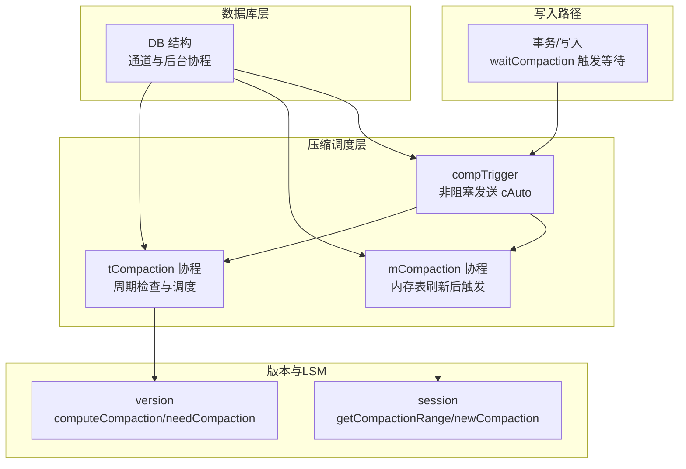
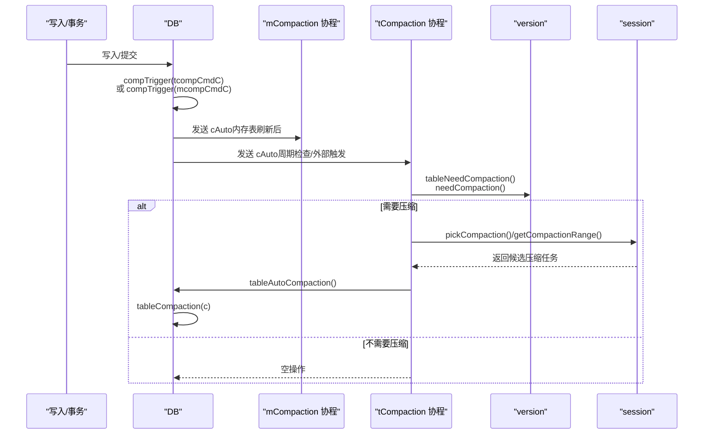
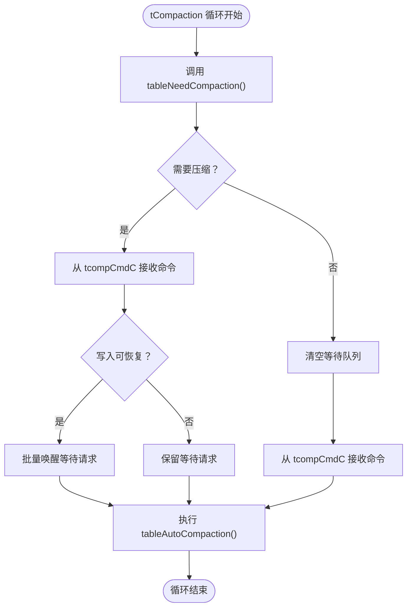
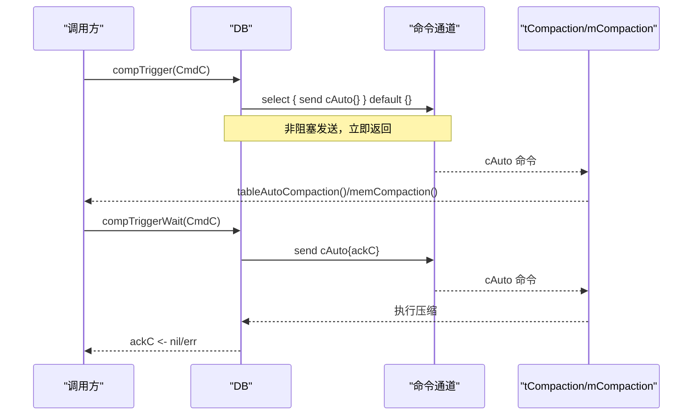
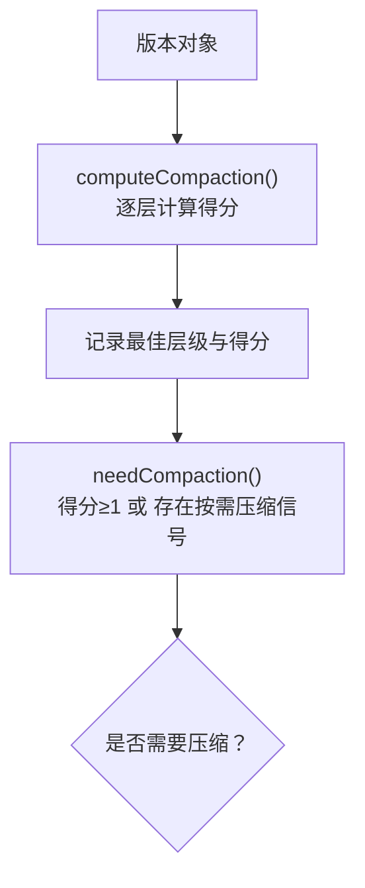
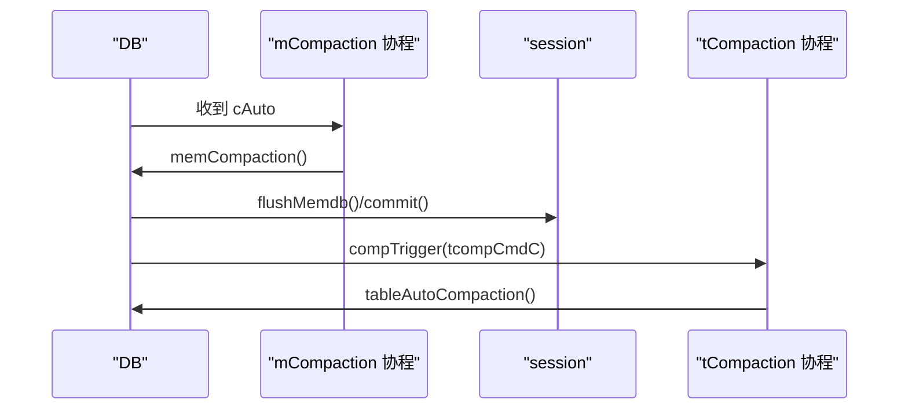
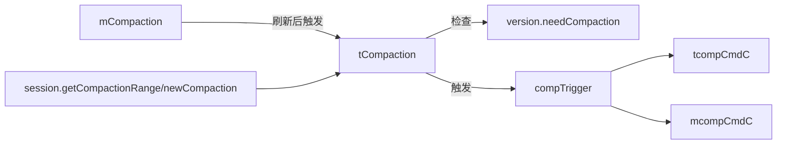

# 周期检查触发机制

<cite>
**本文引用的文件**
- [leveldb/db.go](file://leveldb/db.go)
- [leveldb/db_compaction.go](file://leveldb/db_compaction.go)
- [leveldb/version.go](file://leveldb/version.go)
- [leveldb/session_compaction.go](file://leveldb/session_compaction.go)
- [leveldb/db_transaction.go](file://leveldb/db_transaction.go)
- [leveldb/db_test.go](file://leveldb/db_test.go)
</cite>

## 目录
1. [引言](#引言)
2. [项目结构](#项目结构)
3. [核心组件](#核心组件)
4. [架构总览](#架构总览)
5. [详细组件分析](#详细组件分析)
6. [依赖分析](#依赖分析)
7. [性能考量](#性能考量)
8. [故障排查指南](#故障排查指南)
9. [结论](#结论)
10. [附录](#附录)

## 引言
本文件围绕 avccDB 的“周期检查触发机制”进行系统化技术文档编制，重点阐述后台定期调用 tableNeedCompaction() 方法检查压缩需求的自动触发流程，以及 compTrigger 方法如何通过非阻塞方式向 mcompCmdC 或 tcompCmdC 通道发送 cAuto{} 命令来触发压缩；同时说明该机制与 tableAutoCompaction 函数的协作关系，解释该周期性检查如何与 LevelDB 的 LSM 树结构特性相配合，在不影响正常读写性能的前提下及时处理累积的压缩需求。文末结合 TestDB_MinorCompactionsHappen 等测试用例说明触发条件，并提供时序图展示从检查到触发压缩命令的完整流程。

## 项目结构
本机制涉及的核心代码分布在以下模块：
- 数据库主入口与并发控制：leveldb/db.go（DB 结构、后台协程启动、通道定义）
- 压缩调度与触发：leveldb/db_compaction.go（compTrigger、tCompaction、mCompaction、tableAutoCompaction、tableNeedCompaction）
- 版本与 LSM 计分：leveldb/version.go（computeCompaction、needCompaction）
- 会话与选择候选：leveldb/session_compaction.go（getCompactionRange、newCompaction）
- 写入路径触发等待：leveldb/db_transaction.go（waitCompaction）
- 测试用例验证：leveldb/db_test.go（TestDB_MinorCompactionsHappen 等）

图表来源
- [leveldb/db.go](file://leveldb/db.go#L70-L125)
- [leveldb/db_compaction.go](file://leveldb/db_compaction.go#L730-L889)
- [leveldb/version.go](file://leveldb/version.go#L646-L695)
- [leveldb/session_compaction.go](file://leveldb/session_compaction.go#L97-L134)
- [leveldb/db_transaction.go](file://leveldb/db_transaction.go#L277-L282)

章节来源
- [leveldb/db.go](file://leveldb/db.go#L70-L125)
- [leveldb/db_compaction.go](file://leveldb/db_compaction.go#L730-L889)
- [leveldb/version.go](file://leveldb/version.go#L646-L695)
- [leveldb/session_compaction.go](file://leveldb/session_compaction.go#L97-L134)
- [leveldb/db_transaction.go](file://leveldb/db_transaction.go#L277-L282)

## 核心组件
- DB 结构中的压缩相关通道
  - tcompCmdC：表压缩命令通道（接收 cAuto/cRange）
  - mcompCmdC：内存表压缩命令通道（接收 cAuto）
  - compErrC/compPerErrC：压缩错误传播通道
- 周期检查与调度
  - tableNeedCompaction()：基于版本计算是否需要压缩
  - tCompaction()：后台协程，周期检查并调度表压缩
  - mCompaction()：后台协程，处理内存表压缩命令
- 触发器
  - compTrigger()：非阻塞发送 cAuto 命令
  - compTriggerWait()：发送并等待压缩完成
- 版本与 LSM
  - version.computeCompaction()：计算各层级得分
  - version.needCompaction()：判断是否需要压缩
  - session.getCompactionRange()/newCompaction()：选择候选并构建压缩任务

章节来源
- [leveldb/db.go](file://leveldb/db.go#L70-L125)
- [leveldb/db_compaction.go](file://leveldb/db_compaction.go#L669-L757)
- [leveldb/version.go](file://leveldb/version.go#L646-L695)
- [leveldb/session_compaction.go](file://leveldb/session_compaction.go#L97-L134)

## 架构总览
下图展示了周期检查触发机制在整体系统中的位置与交互关系。

图表来源
- [leveldb/db_compaction.go](file://leveldb/db_compaction.go#L669-L889)
- [leveldb/version.go](file://leveldb/version.go#L646-L695)
- [leveldb/session_compaction.go](file://leveldb/session_compaction.go#L97-L134)

## 详细组件分析

### 组件A：周期检查与调度（tCompaction）
- 职责
  - 后台协程持续运行，周期性调用 tableNeedCompaction() 判断是否需要压缩
  - 当需要压缩时，从 tcompCmdC 接收 cAuto 命令并执行 tableAutoCompaction()
  - 当不需要压缩时，清空等待队列并继续监听命令
- 关键点
  - 使用 tableNeedCompaction() 作为“检查开关”，避免无谓的压缩开销
  - 通过 waitQ 机制在写暂停阈值满足时批量唤醒等待的请求
  - 与 pause/resume 写入路径协同，确保在合适时机恢复写入

图表来源
- [leveldb/db_compaction.go](file://leveldb/db_compaction.go#L813-L889)

章节来源
- [leveldb/db_compaction.go](file://leveldb/db_compaction.go#L813-L889)

### 组件B：触发器（compTrigger 与 compTriggerWait）
- 职责
  - compTrigger：非阻塞地向指定通道发送 cAuto 命令，用于异步触发压缩
  - compTriggerWait：发送 cAuto 并等待压缩完成，用于需要同步确认的场景
- 行为特征
  - 使用 select+default 实现非阻塞发送，避免阻塞写入路径
  - 在等待模式下，通过 ackC 通道返回压缩结果或错误

图表来源
- [leveldb/db_compaction.go](file://leveldb/db_compaction.go#L730-L757)

章节来源
- [leveldb/db_compaction.go](file://leveldb/db_compaction.go#L730-L757)

### 组件C：版本与 LSM 检查（version.computeCompaction/needCompaction）
- 职责
  - computeCompaction：按层级计算得分（Level-0 以文件数计，其他层级以总大小计），确定最需要压缩的层级
  - needCompaction：当最高得分≥1或存在“按需压缩”信号时返回真
- 与 LSM 的关系
  - Level-0 文件数量过多会导致每次读取都要合并，因此采用“文件数/阈值”的策略优先级更高
  - 其他层级采用“总大小/阈值”的策略，平衡吞吐与空间放大

图表来源
- [leveldb/version.go](file://leveldb/version.go#L646-L695)

章节来源
- [leveldb/version.go](file://leveldb/version.go#L646-L695)

### 组件D：内存表刷新后的触发（memCompaction）
- 职责
  - 内存表冻结后，暂停表压缩，生成表文件并提交
  - 提交完成后恢复表压缩，并通过 compTrigger(tcompCmdC) 触发一次周期检查
- 影响
  - 保证内存表刷新过程不被表压缩打断，提升刷新效率
  - 刷新后立即触发一次表压缩检查，快速响应新生成的层级数据

图表来源
- [leveldb/db_compaction.go](file://leveldb/db_compaction.go#L269-L354)
- [leveldb/db_compaction.go](file://leveldb/db_compaction.go#L730-L757)
- [leveldb/db_compaction.go](file://leveldb/db_compaction.go#L813-L889)

章节来源
- [leveldb/db_compaction.go](file://leveldb/db_compaction.go#L269-L354)
- [leveldb/db_compaction.go](file://leveldb/db_compaction.go#L730-L757)
- [leveldb/db_compaction.go](file://leveldb/db_compaction.go#L813-L889)

### 组件E：范围压缩与等待机制（compTriggerRange、waitCompaction）
- 职责
  - compTriggerRange：发送 cRange 命令，执行范围压缩
  - waitCompaction：当 Level-0 表数量达到暂停阈值时，阻塞等待一次压缩完成
- 与触发机制的关系
  - 范围压缩由外部显式触发，内部使用 compTriggerWait 实现等待
  - 周期检查触发的压缩通过 tCompaction 协程统一调度

章节来源
- [leveldb/db_compaction.go](file://leveldb/db_compaction.go#L759-L779)
- [leveldb/db_transaction.go](file://leveldb/db_transaction.go#L277-L282)

## 依赖分析
- 组件耦合
  - tCompaction 依赖 version.needCompaction() 作为检查开关，降低无效压缩成本
  - compTrigger 仅通过通道与协程解耦，避免阻塞写入路径
  - memCompaction 与 tCompaction 通过 compTrigger 协同，形成“刷新→检查”的闭环
- 外部依赖
  - session.getCompactionRange/newCompaction 提供压缩候选选择逻辑
  - options 中的 Compaction 相关阈值影响 needCompaction 的判定

图表来源
- [leveldb/db_compaction.go](file://leveldb/db_compaction.go#L669-L889)
- [leveldb/version.go](file://leveldb/version.go#L646-L695)
- [leveldb/session_compaction.go](file://leveldb/session_compaction.go#L97-L134)

章节来源
- [leveldb/db_compaction.go](file://leveldb/db_compaction.go#L669-L889)
- [leveldb/version.go](file://leveldb/version.go#L646-L695)
- [leveldb/session_compaction.go](file://leveldb/session_compaction.go#L97-L134)

## 性能考量
- 非阻塞触发
  - compTrigger 使用 select+default 实现非阻塞发送，避免写入路径被阻塞
- 周期检查与批量唤醒
  - tCompaction 在 needCompaction 为真时才执行压缩，减少无效工作
  - 通过 waitQ 在写暂停阈值满足时批量唤醒，降低频繁唤醒带来的开销
- LSM 层级策略
  - Level-0 以文件数为主导，避免过多小文件导致读放大
  - 其他层级以总大小为主导，平衡吞吐与空间放大
- 写入等待
  - waitCompaction 在 Level-0 达到阈值时阻塞等待一次压缩完成，防止写入被长期延迟

章节来源
- [leveldb/db_compaction.go](file://leveldb/db_compaction.go#L730-L757)
- [leveldb/db_compaction.go](file://leveldb/db_compaction.go#L813-L889)
- [leveldb/version.go](file://leveldb/version.go#L646-L695)
- [leveldb/db_transaction.go](file://leveldb/db_transaction.go#L277-L282)

## 故障排查指南
- 压缩未触发
  - 检查是否正确调用 compTrigger 或 waitCompaction
  - 确认 tCompaction 协程仍在运行且未关闭
- 压缩频繁但收益低
  - 检查 CompactionL0Trigger/TotalSize 等阈值设置是否过低
  - 观察 needCompaction 是否误判（版本得分计算异常）
- 写入被长时间阻塞
  - 检查 waitCompaction 是否在 Level-0 达到阈值时被调用
  - 查看 compErrC/compPerErrC 是否有持久性错误导致写锁持有

章节来源
- [leveldb/db_compaction.go](file://leveldb/db_compaction.go#L813-L889)
- [leveldb/version.go](file://leveldb/version.go#L646-L695)
- [leveldb/db_transaction.go](file://leveldb/db_transaction.go#L277-L282)

## 结论
avccDB 的周期检查触发机制通过“非阻塞触发 + 周期检查 + 协程调度”的组合，实现了对 LSM 树压缩需求的高效响应。tableNeedCompaction() 作为检查开关，避免了不必要的压缩；compTrigger 以非阻塞方式将 cAuto 命令注入通道，既不影响写入性能，又能及时触发压缩；tCompaction 与 mCompaction 协同工作，形成从内存表刷新到表压缩的完整闭环。该机制与 LSM 的层级特性紧密结合，在保证读写性能的同时，有效管理存储空间与读放大风险。

## 附录

### 触发条件与测试用例
- TestDB_MinorCompactionsHappen
  - 场景：写入大量键值后重启，验证小规模压缩能够发生
  - 关注点：写入路径是否在必要时触发压缩，避免过度压缩
- waitCompaction 与写暂停阈值
  - 当 Level-0 表数量达到 WriteL0PauseTrigger 时，写入路径会等待一次压缩完成，防止写入被长期延迟

章节来源
- [leveldb/db_test.go](file://leveldb/db_test.go#L919-L942)
- [leveldb/db_transaction.go](file://leveldb/db_transaction.go#L277-L282)